# 第五章：云服务是替代的数据来源

本章将介绍以下内容：

+   使用 Cloud Extractor 从云端提取 Android 设备的数据

+   使用 Electronic Evidence Examiner 从 Facebook 账户中提取数据

+   使用 Elcomsoft Phone Breaker 从 iCloud 提取数据

+   使用 Belkasoft Evidence Center 从 iCloud 提取数据

# 简介

如今，我们可以看到新型信息来源的出现，这些信息存储或曾经存储在移动设备的内存中。最著名的有以下几种：

+   存储 Android 操作系统设备信息的 Google 服务

+   苹果云存储 iCloud，用于存储 Apple 设备的数据

+   存储 Windows Phone 操作系统设备信息的 Microsoft 服务

这些服务有哪些特点？苹果设备的所有者在管理保存在 iCloud 中的数据时有一定的限制。因此，如果设备所有者从设备中删除了不需要的信息，这些数据可以从保存在 iCloud 中的 iTunes 备份中恢复。同样，从设备中永久删除的图片文件和视频文件，也可以从 iTunes 和 Android 备份中恢复。

Microsoft 服务用于同步所有者在不同 Windows 设备间的数据。因此，这些云服务中可能包含来自所有者其他设备的信息和文档。换句话说，如果专家可以访问这个云服务，他们几乎就可以访问该账户所有者所有设备上的数据。

由于大量机密数据存储在云服务中，云服务的所有公司（服务提供商）不断提升数据安全机制。几乎所有地方都使用了双重身份验证，这有效阻止了对数据的访问。因此，特别重要的是，你使用的数字取证工具必须支持云服务中所有用户身份验证机制。

UFED Cloud Analyzer，由 Cellebrite 生产，是一款非常好的用于从云服务中提取数据的程序。作者测试了这款程序，并对其功能和从各种云服务中提取数据的能力感到非常满意。然而，这款程序价格非常昂贵，在写作时，只有军队和政府组织才能负担得起。你可以从当地的 Cellebrite 经销商那里获取该程序的试用版。

另一个有趣的云服务工具是 Micro Systemation 的 XRY Cloud（[www.msab.com](http://www.msab.com)）。然而，本书的作者未能获得该程序的试用版或完整版，因此我无法告诉你关于这个产品的更多信息。

在使用用于从云服务提取数据的程序时，应该注意哪些事项？通常，这些程序不仅能通过账户所有者的登录和密码提取数据，还可以通过令牌提取。使用令牌从云服务中提取数据有以下优点：

+   不需要知道登录和密码就能访问云存储

+   它允许你绕过双因素认证

+   一个令牌的有效期可以从几个小时到几个月不等

因此，移动设备越早送达法医实验室，从设备上使用的云账户中成功提取数据的机会就越高。

# 使用 Cloud Extractor 从安卓设备中提取云端数据

Oxygen Forensic 在第一章中有描述，*SIM 卡获取与分析*。该程序包含 Cloud Extractor 模块，可用于从云服务中提取数据。一定程度上，Oxygen Cloud Extractor 的界面和功能与 UFED Cloud Analyzer 类似。然而，Oxygen Cloud Extractor 比 UFED Cloud Analyzer 便宜，而且更容易购买。在本章中，将描述如何使用 Cloud Extractor 从 Google 服务中提取数据。

# 如何操作…

1.  首先，你需要从被检查的设备中提取所有登录名、密码和令牌。如果你提取了文件系统或做了设备的物理转储，成功提取必要数据的可能性会更高。记住，用户的登录名和密码也可以在其他云服务账户中使用。你所需要做的就是测试一下。

1.  从移动设备提取数据后，关于提取数据的信息会显示在设备的桌面上，可以用来访问云服务，显示在 Oxygen Forensic 中：

设备桌面的片段，显示从设备中提取了四个云账户

1.  如果点击“云账户”，该部分的桌面将打开，你可以看到可以用来访问存储在云端的数据的用户名、密码和令牌：

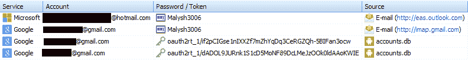

提取的用户名、密码和令牌信息

1.  点击工具栏上的“提取数据”按钮，从云服务中提取数据。填写案件的详细信息：所有者姓名、所有者邮箱、所有者电话号码、证据编号、事件编号、提取别名、检查员、案件、地点等。

1.  在下一个窗口中，程序将显示可供提取的服务。如果你有其他云服务的凭证（或令牌），点击“添加凭证”并添加它们。点击“下一步”：

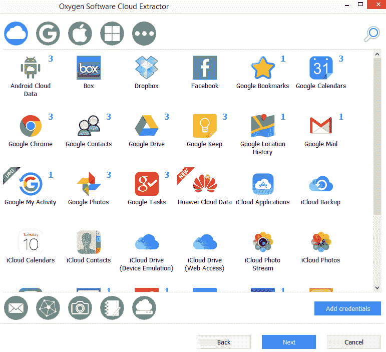

可供提取的云服务

1.  程序将自动开始验证输入的凭证和令牌。验证进度将在程序窗口中显示：

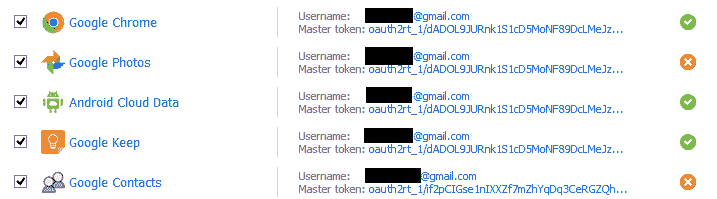

访问云存储所需的验证过程

1.  如果任何云服务要求两步验证，程序将打开附加窗口并提示您输入此数据。

1.  在下一个窗口中，选择您需要的日期范围。点击下一步。

1.  从云服务提取数据的过程将开始。数据提取进度将在程序窗口中显示：

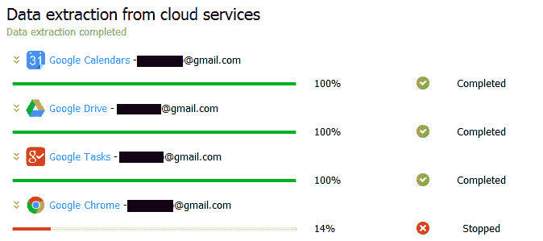

从云服务提取的数据结果

1.  在下一个窗口中，将显示有关提取的汇总信息。点击下一步按钮。然后，程序的最终窗口将显示，提示您选择以下操作之一：

    +   在 Oxygen Software Detective 中打开提取的数据

    +   显示 OCB 备份（包含从云存储提取的数据和文件的备份）

    +   新的提取

1.  如果您不想执行任何这些操作，请点击关闭按钮：

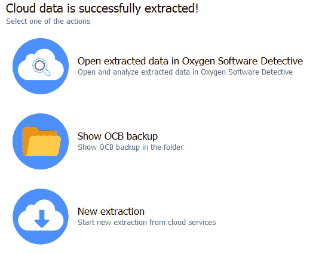

从云存储提取过程的最终窗口

提取的数据将可以进行查看和分析：

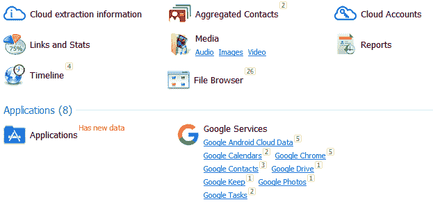

数据提取结果

# 使用电子证据检查器提取 Facebook 账户数据

可能没有哪个专家没听说过 Paraben 产品。然而，并非所有专家都了解其功能。在法医学论坛上，Facebook 账户数据获取的问题时常被提及。在这篇教程中，我们将描述如何使用电子证据检查器来完成此操作。

# 准备中

从您的个人账户下载**电子证据检查器**（**E3: Universal**）并使用电子许可证激活，或者将您的 Paraben 硬件密钥连接到计算机。以下是 E3 Universal 的网页链接：

+   E3: Universal 网页：[`www.paraben.com/products/e3-universal`](https://www.paraben.com/products/e3-universal)

+   E3: Universal 试用版网页：[`www.paraben.com/forms/request-trial`](https://www.paraben.com/forms/request-trial)

# 如何操作……

1.  双击 E3: Universal 图标。当程序启动时，创建一个新案件。点击工具栏上的 Cloud Import 图标：

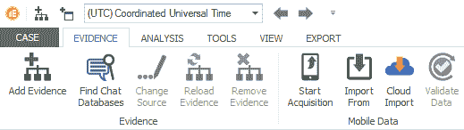

E3: Universal 工具栏

1.  使用此工具，您可以从以下云服务提取数据：Facebook、Google Locations、Google Mail、Google Drive 和 Twitter。在 Cloud Data Import Wizard 窗口中，选择“Data Source”下的 Facebook 复选框，并在相应的窗口中输入帐户的登录名和密码：

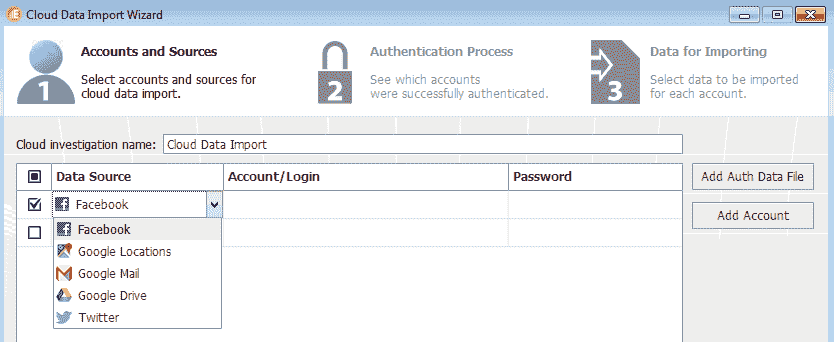

Cloud Data Import Wizard 窗口

1.  点击“认证”按钮。程序将检查帐户数据是否正确，并向您通报：

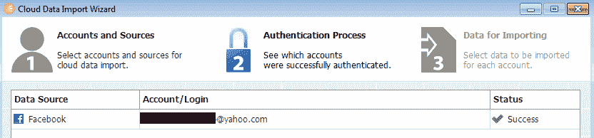

帐户数据验证结果

1.  选择要提取数据的日期范围，并选中数据类型。点击“导入数据”按钮：

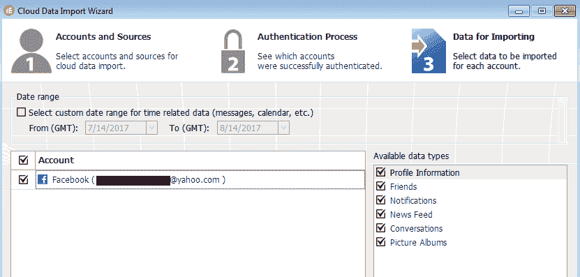

提取选项选择窗口

1.  数据提取过程即将开始。进度将显示在 **Cloud Data Import Wizard** 窗口中。提取完成后，点击“完成”按钮。任务状态通知窗口将显示。该窗口包含数据存放路径的信息。点击“确定”。然后你可以在 E3: Universal 中查看和处理提取的数据：

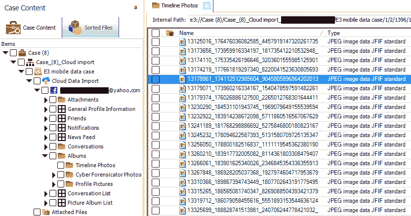

在 E3: Universal 窗口中显示的提取数据

# 使用 Elcomsoft Phone Breaker 从 iCloud 提取数据

Elcomsoft Phone Breaker 是从云服务提取数据的理想工具。尽管界面简洁，但功能强大，可以提取最大量的数据。Elcomsoft Phone Breaker 的特殊之处在于，专家需要从同一公司获取额外的软件来查看提取的数据（Elcomsoft Phone Viewer），与本章描述的其他程序不同。Elcomsoft Phone Breaker 是我们探索的所有云服务数据提取程序中最便宜的一个。在本篇中，我们将介绍使用 Elcomsoft Phone Breaker 提取保存在 iCloud 中的 iTunes 备份的方法。

# 准备工作

从以下链接下载程序，并通过将通过电子邮件发送给您的代码进行激活：

+   Elcomsoft Phone Breaker 页面位于 [`www.elcomsoft.com/eppb.html`](https://www.elcomsoft.com/eppb.html)

+   Elcomsoft Phone Viewer 页面位于 [`www.elcomsoft.com/epv.html`](https://www.elcomsoft.com/epv.html)

# 如何操作…

1.  双击程序图标以启动它：

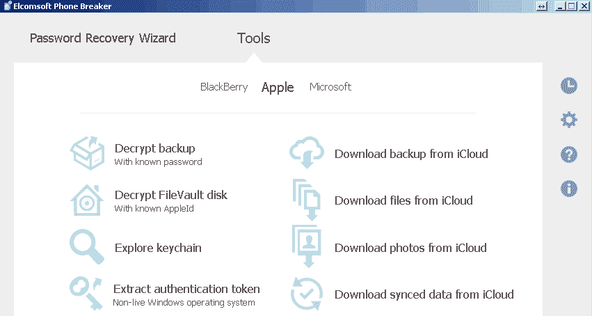

Elcomsoft Phone Breaker 主窗口

1.  点击“从 iCloud 下载备份”选项。在下一个窗口中，您将被提示选择身份验证方法，可以选择登录和密码或者令牌：

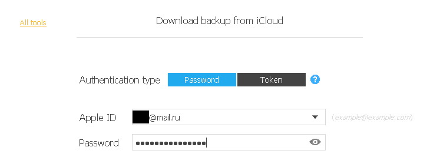

选择身份验证方法

1.  对于提取，检查员应该具有帐户的凭据。有很多方法可以获取它们。例如，检查员可以向帐户所有者请求它们。输入凭据并点击“登录”按钮。在用户识别过程中，如果 iCloud 帐户启用了双因素身份验证，则程序将显示额外窗口，提示您输入发送到受信设备的代码。

1.  然后，位于 iCloud 服务中的 iTunes 备份将显示在程序窗口中：

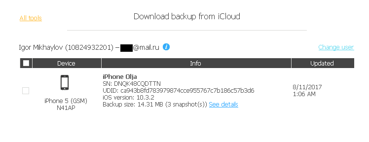

保存在 iCloud 中的备份

1.  勾选所需的 iTunes 备份，并点击“下载”按钮。在提取结束时，提取结果的最终窗口将显示。您可以点击“完成”以结束提取过程，或者点击“在 EPV 中打开”查看从 iCloud 提取的数据：

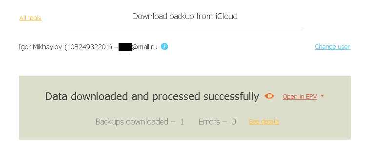

显示有关从 iCloud 提取的数据的信息的窗口

# 还有更多……

使用 Elcomsoft Phone Breaker，您可以从 Microsoft 云服务中提取数据。更多信息，请阅读 *Oleg Afonin* 的文章 *从 Microsoft 帐户获取通话记录、浏览历史和位置信息*：[`blog.elcomsoft.com/2017/06/fetching-call-logs-browsing-history-and-location-data-from-microsoft-accounts/.`](https://blog.elcomsoft.com/2017/06/fetching-call-logs-browsing-history-and-location-data-from-microsoft-accounts/)

# 使用 Belkasoft Evidence Center 从 iCloud 提取数据

Belkasoft Evidence Center 已在 第二章 *Android 设备获取* 中进行了介绍。现在该程序具有从云存储提取数据的功能。在本教程中，我们将描述如何使用 Belkasoft Evidence Center 从 iCloud 提取数据。

# 如何操作……

1.  双击 Belkasoft Evidence Center 图标。程序启动后，点击“新建案件”按钮。在窗口中输入新案件的信息并点击“创建并打开”。在“添加数据源”窗口中，指定提取数据保存的路径，并点击“云”按钮：

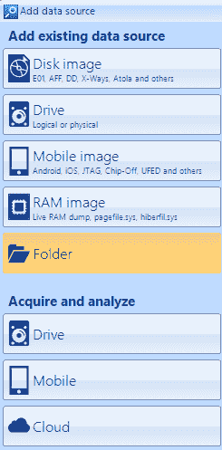

添加数据源窗口

1.  在下一个窗口中，点击“iCloud”图标，然后点击“下一步”按钮：

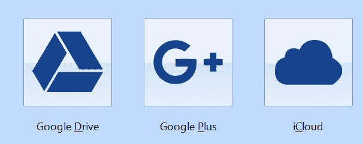

选择云服务

1.  在下一个窗口中，选择身份验证方法：使用登录和密码，或使用 [icloud.com](https://www.icloud.com/) 的 cookies。选择使用登录和密码进行身份验证。输入凭据。点击“下一步”按钮。在下一个窗口中，选择您需要从 iCloud 提取的数据类型。点击“下一步”按钮：

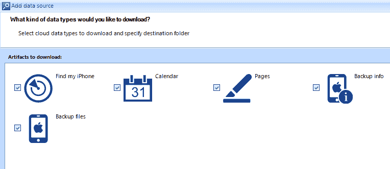

选择保存在 iCloud 中的数据类型

1.  数据提取过程将开始，提取进度将在程序窗口中显示。提取完成后，将显示有关提取的汇总信息。点击“完成”以结束提取器的工作。
