# 第六章：SQLite 取证

在本章中，我们将介绍以下操作方法：

+   使用 Belkasoft Evidence Center 解析 SQLite 数据库

+   使用 DB Browser for SQLite 解析 SQLite 数据库

+   使用 Oxygen Forensic SQLite Viewer 解析 SQLite 数据库

+   使用 SQLite Wizard 解析 SQLite 数据库

# 引言

SQLite 数据库在移动设备和 PC 上广泛用于各种应用程序的数据存储。因此，对这些数据库的分析具有重要意义。根据我们的经验，深入分析 SQLite 数据库可以帮助我们提取最多 50% 的附加数据。以下几点对此进行了解释：

+   有数百万个应用程序将数据存储在 SQLite 数据库中。没有任何移动取证软件开发商能够提供对如此大量应用程序的分析支持。

+   如果数据库名称或存储路径在应用程序版本更改过程中发生了变化，移动取证工具将无法正确识别并分析该数据库。

+   并非所有取证工具都提供 SQLite 数据库的自动分析选项。例如，一些工具能够提取 Skype Freelists 数据，而一些则不能。对数据库的手动深入分析可以更全面地提取其数据。

有成千上万种 SQLite 查看器。那么，应该选择哪个工具进行分析呢？根据我们的经验，最有效的移动应用程序 SQLite 数据库分析工具是由移动取证软件开发者生产的工具。

许多初学者专家担心在手动 SQLite 数据库分析过程中需要编写 SQL 命令。然而，所有先进的 SQLite 查看器都采用了模板和 SQL 命令的可视化方式，使得数据库分析变得更加简便。

SQLite 数据库通常存储在 Android 设备的 userdata 分区中。

# 使用 Belkasoft Evidence Center 解析 SQLite 数据库

Belkasoft Evidence Center 程序已经在第二章中描述过，*Android 设备数据获取*。该程序具有对移动设备和 PC 上的 SQLite 数据库进行分析的功能。在本章中，我们将描述如何使用 Belkasoft Evidence Center 分析 SQLite 数据库。

# 如何操作……

在本案例中，我们将描述一个有趣的案例。问题如下：在一部被检查的 iPhone 5 屏幕上，有与两个人的 Skype 聊天记录，但在分析结果中，并未显示出提取的数据，这些数据是通过取证工具展示的。在我被请求提供帮助之前，我的同事们已经徒劳地尝试了他们所有的移动取证工具。那些工具无法访问聊天记录。

通过 Belkasoft Evidence Center 分析了此设备的 iTunes 备份（该过程将在第九章，*iOS 取证*，*使用 Belkasoft Evidence Center 解析 iOS 备份*部分中描述），我们得到了以下结果：

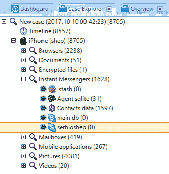

iTunes 备份分析结果总结

从结果可以看出，在检查的 iTunes 备份中有两个 Skype SQLite 数据库，但未找到消息。

这些数据库位于以下路径：

+   配置文件路径：`image:\1\vol_0\HomeDomain\Library\com.apple.internal.ck\main.db`

+   配置文件路径：`image:\1\vol_0\AppDomain-com.skype.skype\Library\Application Support\Skype4LifeSlimCore\serhioshep\main.db`

作为 SQLite 数据库分析的示例，我们将处理位于`serhioshep`文件夹中的`main.db`文件：

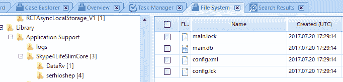

main.db 文件

双击文件系统选项卡并转到该文件：

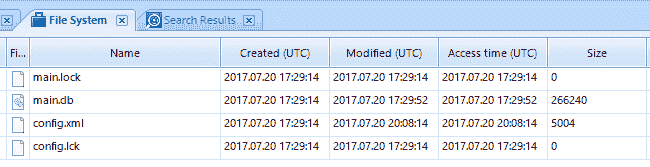

main.db 文件

从下图可以看出，`main.db`文件的大小为 266 KB，这意味着它可能包含我们正在寻找的通信记录。

双击`main.db`文件并选择下窗口中的 Sqlite 选项卡。在此窗口中，将显示所检查数据库中包含的数据类别。例如，在账户类别中，我们可以看到`serhioshep`记录。它是一个 Skype 账户名：

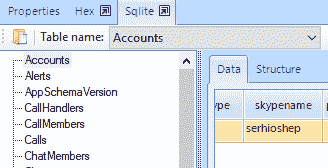

main.db 文件的类别。

然而，在消息类别中没有信息。如果点击此窗口的十六进制选项卡，可以看到该部分数据库中没有数据：

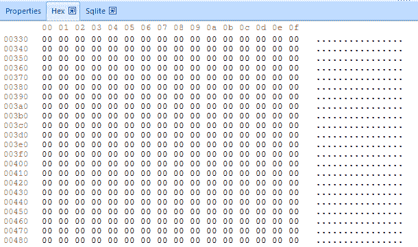

main.db 文件中的数据（十六进制模式）

当我们检查第二个`main.db`文件时，得到了类似的结果。

发生了什么？有两种解释：

+   **解释一**：尽管这些文件是 SQLite 数据库，但它们不包含有关消息的信息。也许这是因为设备的安全设置不允许此信息传输到 iTunes 备份。

+   **解释二**：这些文件确实不包含通信记录，设备显示的是保存在 WAL 文件中的通信记录，而这些记录并未传输到 iTunes 备份中。

解决方案是我们需要越狱设备。越狱可以让我们完全访问设备的文件系统，从而提取更多的数据。`main.db`文件将以未更改的形式提供供分析，如果设备内存中存在 WAL 文件，它们也将可用。这种方法将帮助我们提取 Skype 通信记录。

# 使用 DB Browser for SQLite 解析 SQLite 数据库

SQLite 数据库浏览器是一个免费的工具，可用于 SQLite 数据库分析。它拥有强大的数据分析功能。

# 准备工作

打开 SQLite 数据库浏览器程序官网，在浏览器中选择适合您操作系统的程序版本并下载。双击下载文件的图标，并按照提示完成安装。

# 如何操作…

双击 SQLite 数据库浏览器程序的图标，程序将启动。您可以创建自己的 SQLite 数据库或分析已有的数据库。在本章中，我们将描述如何分析 `mmssms.db` 文件的内容。

点击“打开数据库”。选择要分析的文件。点击“确定”：

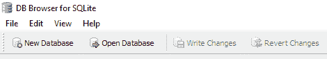

SQLite 数据库浏览器工具栏

要分析的文件将被上传到程序中。程序的主窗口有四个标签页：

1.  数据库结构：显示数据库的结构。

1.  浏览数据：显示数据库中包含的数据。

1.  EditPramas：数据库分析的参数。

1.  执行 SQL：图形界面，可以提供 SQL 命令。

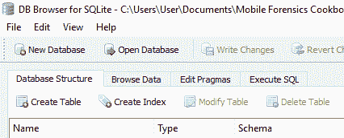

程序主窗口的标签页

在数据库结构标签页中，展示了上传的数据库结构。在本例中，分析的数据库包含两个表，`android_metadata` 和 `sms`：

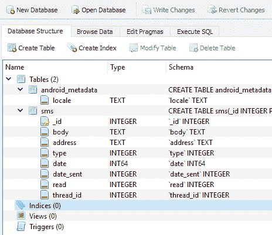

被分析的数据库结构

转到“浏览数据”标签页，从下拉菜单中选择 `sms` 表。在程序的主窗口中，将显示一个表格，显示记录的序号、短信文本、电话号码、类型（收到的短信或发出的短信）、日期、发送日期、状态（短信是否已读）等信息：

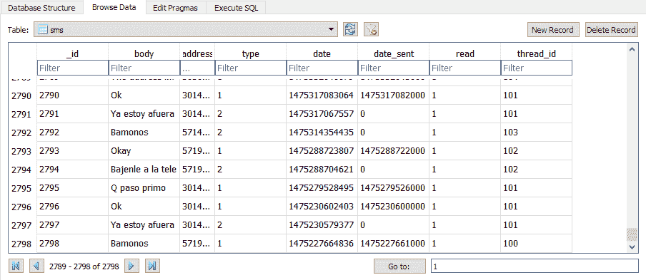

sms 表中的数据

如图所示，无法明确判断 `date` 和 `date_sent` 列中的值所采用的格式。解释这些值可能对经验不足的专家造成困难。同时，请记住该表中的记录数量（2,798），因为在我们描述 Oxygen Forensic SQLite Viewer 时，这个数字对我们来说很重要。

# 还有更多…

除了 SQLite 数据库，数据还可能包含在 WAL 文件中。WAL 文件是预写日志，它们包含 SQLite 数据库中的一些页面。如果想从移动设备中提取最大数据，您也应该分析可用的 WAL 文件。

# 参见

+   SQLite 数据库浏览器官网：[`sqlitebrowser.org/`](http://sqlitebrowser.org/)

+   另一个免费的 SQLite 数据库分析工具 Sqliteman 的官网：[`sourceforge.net/projects/sqliteman/`](https://sourceforge.net/projects/sqliteman/)

+   WAL 文件分析程序 Walitean: [`github.com/n0fate/walitean`](https://github.com/n0fate/walitean)

# 使用 Oxygen Forensic SQLite Viewer 解析 SQLite 数据库

Oxygen Forensic 程序在第一章中已有描述，*SIM 卡的获取与分析*。该程序有一个 Oxygen Forensic SQLite Viewer 模块，可用于 SQLite 数据库的查看与分析。

# 准备工作

Oxygen Forensic SQLite Viewer 可以通过完成三个步骤启动：

1.  双击位于以下路径的`OxySQLiteViewer64.exe`文件：`‘C:\Program Files (x86)\Oxygen Software\Oxygen Forensic Detective’`。

1.  双击 Oxygen Forensic 程序图标。在程序的工具栏中，选择工具，然后选择 SQLite 数据库查看器：

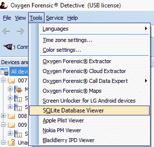

工具菜单

1.  在主案例窗口中，点击文件浏览器部分。在打开的窗口中，选择数据库文件标签。在此窗口中，所有的数据库（包括已删除的）都会显示出来。选择您要查看的数据库，左键点击它。在下拉窗口中选择在 SQLite Viewer 中打开。

# 如何操作…

双击位于`C:\Program Files (x86)\Oxygen Software\Oxygen Forensic Detective`路径中的`OxySQLiteViewer64.exe`程序文件。在程序的工具栏中，选择文件，然后选择打开。选择您要查看的文件并点击确定。为了对比不同程序的功能，我们将描述对相同`mmssms.db`文件的分析。

程序窗口分为三个区域：

+   **区域 1**：表格栏 - 在此栏中，显示上传到程序中的 SQLite 数据库文件的结构。

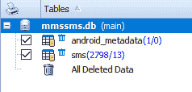

mmssms.db 文件的结构

如截图所示，除了数据库包含的 2,798 条记录外，程序还成功恢复了 13 条记录。

+   **区域 2**：程序的主要工作区域，其中显示数据：

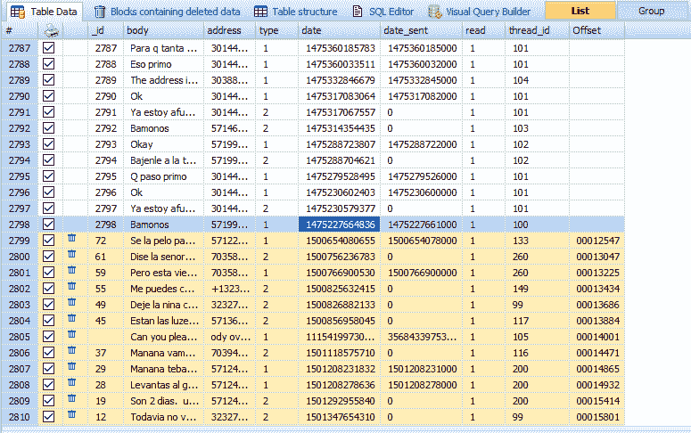

Oxygen Forensic SQLite Viewer 程序主工作窗口的视图

如截图所示，表格中出现了新的附加记录，点击包含已删除数据的块标签，您将看到这些块包含文本，这些文本可能是从程序未能恢复的短信中转移过来的：

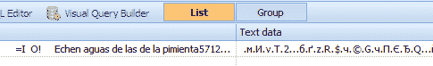

包含在“包含已删除数据的块”标签中的短信内容片段

程序的主窗口还包含以下标签：

表格结构：显示分析的 SQLite 数据库的结构

SQL 编辑器和可视化查询构建器：允许您指定 SQL 命令来分析类似的数据库

+   **区域 3**：位于右侧的栏，自动使用多个算法转换单元格的值。对于转换被检查数据库单元格的值非常方便：

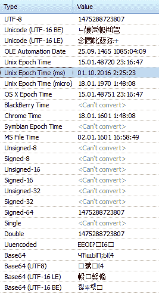

左侧面板的外观

如图所示，所检查数据库中`date`单元格的值以 Unix 纪元时间（毫秒）格式存储。所检查单元格中的值是`01.10.2016 2:25:23`。

# 还有更多…

总结之前所说的，我们可以说，通过使用专业的 SQLite 数据库编辑器，专家不仅通过恢复删除的记录提取更多的数据，还可以恢复来自数据库其他区域的片段，这些片段可能对他们有兴趣。使用 SQL 编辑器和可视化查询构建器，您可以编写脚本，自动化对这些数据库的深入分析。

# 使用 SQLite 向导解析 SQLite 数据库

UFED 程序在第四章中已经描述过，*Windows Phone 和 BlackBerry 数据提取*。该程序包含 SQLite 向导模块，可用于从 SQLite 数据库中提取数据。

# 准备工作

不幸的是，SQLite 向导模块无法单独启动，使用前，专家必须通过 UFED Physical Analyzer 分析从移动设备提取的数据。分析完成后，点击类别：

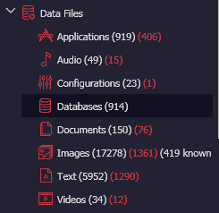

数据库类别

在程序的主窗口中，将显示包含从所检查移动设备提取的 SQLite 数据库信息的标签。窗口还将显示数据库是否通过 UFED Physical Analyzer 进行了分析：

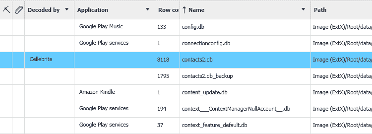

在 UFED Physical Analyzer 主窗口中显示的数据库信息

查看这个窗口时，专家会面临一个不愉快的发现。原来，大多数提取的 SQLite 数据库无法进行分析，这意味着一些数据，有时是非常重要的数据，可能会丢失。

# 如何操作…

作为一个例子，我们将描述对`contacts2.db_backup`数据库的分析。在 UFED Physical Analyzer 程序的主窗口中，右键点击该文件。在下拉菜单中，选择 SQLite 向导。打开的窗口会提示你填写应用程序和名称字段。填写完毕后，点击下一步。

在下一个窗口中，将打开查询构建器标签，其中将显示所检查文件中包含的表结构。通过双击它们，将它们添加到程序的桌面。在桌面上，您可以指定表之间应该如何关联。由于所检查的数据库结构是已知的，因此无需进行额外的操作。点击下一步按钮。

SQLite 向导包含大量模板，可以大大简化专家的工作。点击下拉菜单，选择`Contacts`模板：

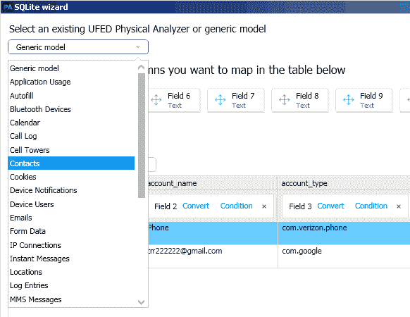

SQLite 向导 R17 模板

在窗口的上部，将会有一些矩形框，显示联系人数据库的类别；包含数值的表格将会呈现在下方。将类别的矩形框拖动到相应的列中。如果有些类别矩形框没有使用也是可以的。点击“下一步”按钮。

在新窗口中，你可以指定设置：是否为此次分析使用新生成的 SQLite 数据库分析方案，或者是否将该分析方案用于所有后续的移动设备检查。

你可以通过点击“关闭”按钮关闭 SQLite 向导，或者通过点击“运行”按钮使用新的`contacts2.db_backup`数据库分析算法进行分析。分析结束后，提取的数据将被添加到之前接收到的数据中。

# 另见

+   *移动取证：UFED 与 Magnet Acquire*，[`www.digitalforensics.com/blog/mobile-forensics-ufed-vs-magnet-acquire/`](https://www.digitalforensics.com/blog/mobile-forensics-ufed-vs-magnet-acquire/)
