# 第七章：理解 Plist 法医分析

在本章中，我们将介绍以下几个方案：

+   使用 Apple Plist Viewer 解析 plist

+   使用 Belkasoft Evidence Center 解析 plist

+   使用 plist Editor Pro 解析 plist

+   使用 Plist Explorer 解析 plist

# 引言

**属性列表**（**plist**）是 iOS 和 macOS 操作系统中用于不同类型数据存储的系统文件。它们可以被这两种操作系统以及应用程序使用。Plist 非常适合存储数组、字典和字符串。

Plist 是 XML 文件，但也有一些不同之处。例如，文件中标签的顺序是由一些规则决定的：它们是键值对，但 `key` 类型标签和 `value` 类型标签处于同一层级。例如：

```
<key>Device Name</key>
<string>iPhone Olja</string>
<key>GUID</key>
<string>D526CA3328B0A964372B4E93C12D5C74</string>
<key>ICCID</key>
<string>897010220192766690f</string>
<key>IMEI</key>
<string>013429003240443</string>
```

为了加速读写过程，`plist` 通常通过转换成 **二进制 plist (bplist)** 格式来实现。专家需要使用特殊工具解码这种文件，以提取其中的数据。

通常，专家会检查从各种移动设备（如 iPod、iPad 和 iPhone）接收到的 iOS 备份。这些备份包含大量的 plist 文件。

你可以在 *Heather Mahalik* 和 *Rohit Tamma* 编写的《*Practical Mobile Forensics, Second Edition*》一书中，了解一些在 iTunes 备份中常见的 plist 文件。

每个 iOS 备份，连同备份数据文件，包含四个元文件：`Info.plist`、`Manifest.plist`、`Status.plist` 和 `Manifest.mbdb`。

让我们看看这些元文件中的每一个：

+   `Info.plist`：这是一个配置文件，包含关于设备的信息，如产品类型、产品版本、IMEI、电话号码、上次备份日期、序列号、同步设置、设备上安装的应用程序列表等。

+   `Manifest.plist`：这是一个配置文件，包含关于第三方应用程序的附加信息、备份密钥包、密码保护标志（`WasPasscodeSet`）、备份加密标志（`IsEncrypted`）等。

+   `Status.plist`：这是一个配置文件，包含关于备份的信息：备份状态、完整备份标志（`IsFullBackup`）、备份日期和备份版本。

+   `Manifest.mbdb`：这是一个二进制文件，包含关于备份中所有其他文件的信息，包括文件大小和文件系统结构信息。

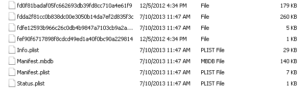

iTunes 备份元文件

# 使用 Apple Plist Viewer 解析 plist

Oxygen Forensic 程序已在第一章中描述过，*SIM 卡获取与分析*。该程序包含 Apple Plist Viewer 模块，可用于查看和分析 plist 文件的内容。

# 如何操作...

1.  双击 Oxygen Forensic 图标以启动程序。在程序菜单中选择工具，然后选择 Apple Plist Viewer：

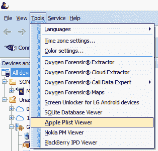

启动 Apple Plist Viewer

1.  会弹出 Windows 窗口，您需要选择要分析的 plist 文件。在本例中，分析的是`History.plist`文件。选择文件后，点击“打开”。

1.  然后，Apple Plist Viewer 的主窗口将打开，在其中显示所选 plist 文件的结果：

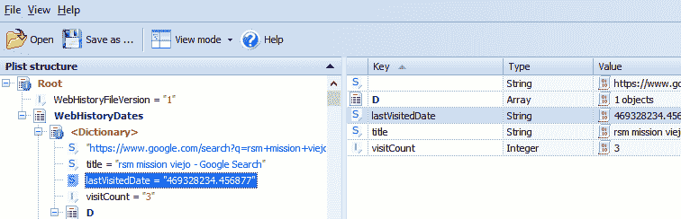

在经典模式下显示 plist 文件的分析结果

结果查看可以在两种模式下进行，**经典模式**和**简单模式**：

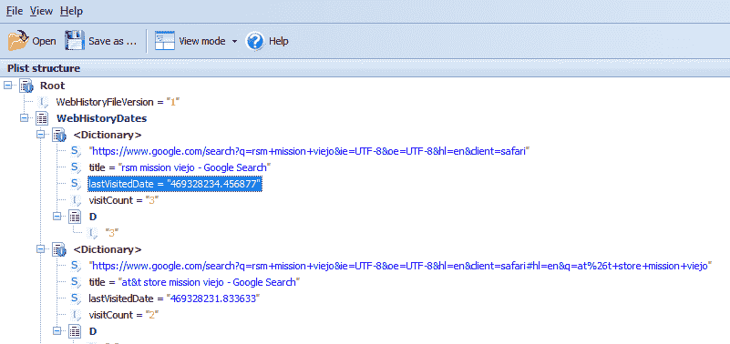

在简单模式下显示 plist 文件的分析结果

1.  可以通过点击程序工具栏上的“查看模式”按钮，在不同模式之间切换。

1.  程序右侧有一个次级窗口。如果在显示分析结果的窗口中，所选值是时间值，则次级窗口中会以不同格式显示时间的解码结果：

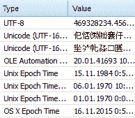

解码时间值的结果，以不同格式显示

# 使用 Belkasoft Evidence Center 解析 plist 文件

Belkasoft Evidence Center 程序在第二章中已做过描述，*Android 设备获取*。该程序具备分析移动设备 plist 文件的功能。在本章中，我们将介绍如何通过 Belkasoft Evidence Center 分析 plist 文件。

# 如何操作…

1.  双击 Belkasoft Evidence Center 图标，程序启动后，点击“新建案件”。在弹出的窗口中，输入新案件的数据，指定案件文件保存路径，然后点击“创建并打开”按钮。

1.  由于在 Belkasoft Evidence Center 程序中没有单独选择文件进行分析的选项，您必须指定包含一个或多个 plist 文件的文件夹作为数据源。

1.  在新的添加数据源窗口中，指定您要分析的 plist 文件路径，然后点击“下一步”按钮：

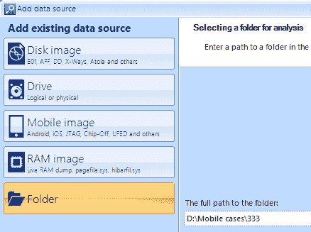

添加数据源窗口

1.  在下一个窗口中，选择与 iOS 操作系统相关的证据类别。点击“完成”按钮：

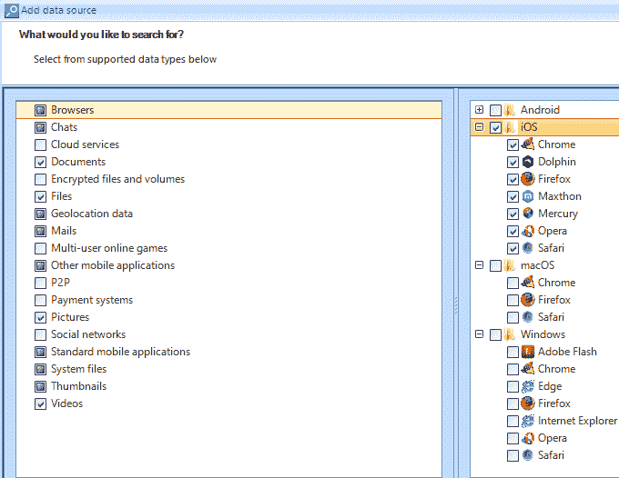

iOS 证据选择

1.  在处理包含 plist 文件的文件夹后，初步分析结果可以在概览标签中查看。如果程序已知所检查的文件，则其数据将以便捷的形式显示：

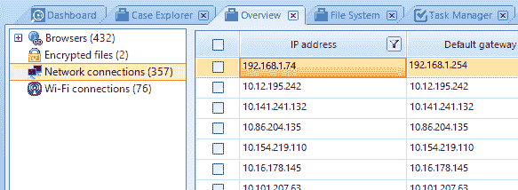

Belkasoft Evidence Center 的概览标签

1.  如果您想查看特定 plist 文件的内容，可以转到文件系统标签，指定您需要的文件。在显示文件内容的窗口中，选择工具栏上的“Plist”。在该窗口中，您可以手动查看所检查的文件内容：

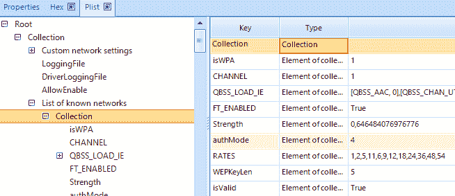

com.apple.wifi.plist 文件的内容

# 使用 Plist Editor Pro 解析 plist 文件

**Plist Editor Pro** 是一个用于 plist 文件分析的工具，推荐者为*Heather Mahalik*和*Rohit Tamma*，他们是《实用移动取证（第二版）》一书的作者。使用此工具，可以分析具有 XML 格式的 plist 文件和二进制文件。

# 准备就绪

将工具下载到计算机并安装，按照安装程序中的说明进行操作。

Plist Editor Pro 的网页可以在[`www.icopybot.com/plist-editor.htm.`](http://www.icopybot.com/plist-editor.htm)找到。

# 如何操作…

1.  双击图标启动程序：


Plist Editor Pro 图标

1.  启动程序时，选择菜单中的视图，然后选择只读模式。这将保护被检查的文件内容不被意外更改：

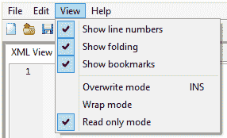

视图菜单中的只读模式标志

1.  为了打开 plist 文件，在下拉的文件菜单中选择打开：

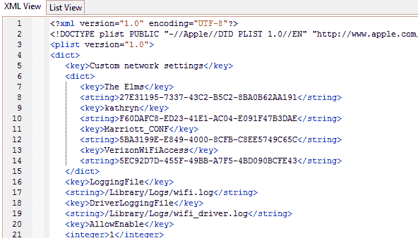

XML 视图模式

在打开的窗口中，选择文件并点击打开。打开的文件可以在两种模式下查看，XML 视图和列表视图：

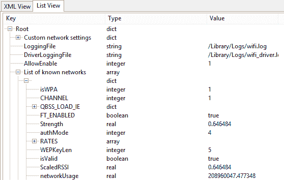

列表视图模式

# 使用 Plist Explorer 解析 plist 文件

Plist Explorer 是由 Dec Software 公司开发的免费工具。

# 准备就绪

下载程序并解压缩文件。该程序无需安装在您的计算机上。

# 如何操作…

1.  双击程序图标：


Plist Explorer 图标

1.  Plist Explorer 程序的主窗口被分为三个部分。使用第一部分，您可以指定存放待检查 plist 文件的分区和文件夹。使用第二部分，您可以指定待检查的文件。

1.  在第二部分，当您指定要检查的文件时，其内容将在第三部分显示。被检查文件的内容将在第三部分底部以十六进制表示：

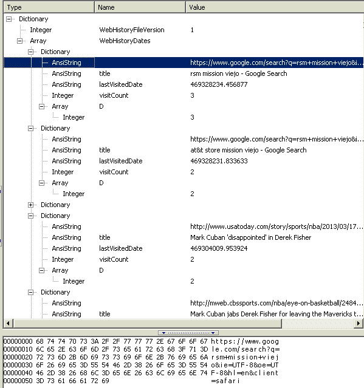

被检查的 plist 文件内容

# 还有更多…

程序下载页面位于[www.ithmbconverter.com/plist/plistexplorer.zip.](http://www.ithmbconverter.com/plist/plistexplorer.zip)

程序的讨论可以在以下页面找到：[`www.forensicfocus.com/Forums/viewtopic/t=8635/.`](http://www.forensicfocus.com/Forums/viewtopic/t=8635/)
