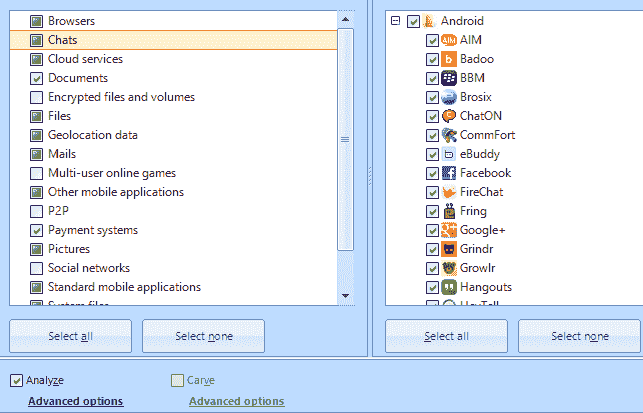
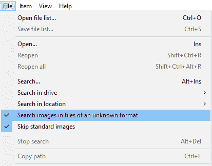
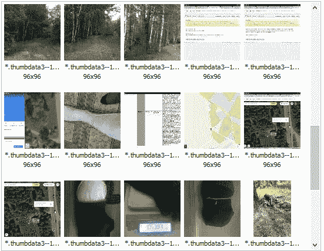

# 第八章：分析 Android 设备的物理转储和备份

本章我们将介绍以下内容：

+   使用 Autopsy 解析 Android 物理转储和备份

+   使用 Oxygen Forensics 解析 Android TOT 容器

+   使用 Belkasoft Evidence Center 解析 Android 备份

+   使用 AXIOM 解析 Android 物理转储和备份

+   使用 Encase Forensic 解析 Android 物理转储

+   使用 ThumbnailExpert 进行缩略图分析

# 介绍

有很多工具可以分析运行 Android 操作系统的移动设备的物理转储和备份。这些工具包括所有最优秀的移动取证工具，如 UFED Physical Analyzer（Cellebrite）、Oxygen Forensics（Oxygen Forensics, Inc）、.XRY（MSAB）、MOBILedit Forensic Express（COMPELSON Labs）和 Secure View（Susteen）。

计算机取证软件开发者也试图将提取和分析移动设备的功能加入到他们的产品中。这些工具包括：Encase Forensic（OpenText Corp.）、MPE+（AccessData）、Belkasoft Evidence Center（Belkasoft）、AXIOM（Magnet Forensics）、E3: UNIVERSAL（Paraben Corporation）等。

令人惊讶的是，一些移动取证专家并不知道可以通过免费工具 Autopsy 或通过一款功能强大的廉价工具 Andriller 来分析物理转储和备份。

像 Rusolut Sp. 和 ACE Lab 这样的移动设备分析硬件解决方案制造商，也在其产品（如 Rusolut Sp. 的 Visual NAND Reconstructor 和 ACE Lab 的 PC-3000 MOBILE）中，加入了删除数据恢复和 SQLite 数据库分析的功能。

不幸的是，本章的篇幅有限，无法涵盖所有这些优秀的程序。本章我们只介绍其中的一些。

# 使用 Autopsy 解析 Android 物理转储和备份

Autopsy 相比其他移动取证工具的无可否认的优势在于它是免费的，这意味着任何想分析自己移动设备的人都可以使用它。运行 Android 操作系统的移动设备的物理转储可以通过 Autopsy 进行分析。

# 准备工作

访问程序的官网。在网站菜单中选择 Autopsy | 下载，并点击“立即下载”。在下载页面，选择与您的操作系统对应的版本，点击“下载 64 位”或“下载 32 位”。当安装文件下载完成后，进入计算机中保存下载文件的目录，双击下载文件的图标。根据安装过程中的指示进行安装。

# 如何操作……

1.  双击程序图标。在欢迎窗口中，点击“创建新案件”图标；它将打开“新案件信息”窗口。输入案件名称，并通过点击“浏览”按钮输入基本目录。点击“下一步”按钮。

1.  在下一个窗口中，填写案件编号和检查员字段。点击“完成”按钮。

1.  在新的添加数据源窗口中，点击磁盘镜像或虚拟机文件按钮，然后点击下一步。

添加数据源窗口的外观

1.  在下一个窗口中，选择之前创建的移动设备物理转储（例如，按照第二章中描述的*Android 设备获取*指南创建的）。指定时区。点击下一步。

1.  在下一个窗口中，勾选您在分析过程中需要使用的程序模块。选择的模块越多，物理转储分析所需的时间就越长。对于移动设备的物理转储分析，无需使用 E01 验证器和虚拟机提取器模块。选择完模块后，点击下一步按钮，最后点击完成。

程序模块的选择

1.  选定物理转储分析的过程将开始。分析进度将显示在程序窗口右下角的进度条中。在分析过程中，从检查的物理转储中提取的数据将显示在程序的左侧部分。这些数据可以立即查看，甚至在分析过程中也能查看。当新的数据被提取时，它将被添加到相关类别中。

在物理转储分析过程中提取的数据类别

从前面的截图中可以看出，在物理转储分析过程中提取了大量不同的数据。这些数据可以在程序的工作区查看。此外，可以通过 Autopsy 生成关于提取数据的报告。

# 另见

+   Autopsy 下载页面：[`www.sleuthkit.org/autopsy/download.php`](http://www.sleuthkit.org/autopsy/download.php)

# 使用 Oxygen Forensics 解析 Android TOT 容器

Oxygen Forensic 程序已在第一章中介绍，*SIM 卡获取与分析*。Oxygen Forensic 程序具有一个专门的 Oxygen Forensic Extractor 模块，可用于对运行 Android 操作系统的移动设备进行逻辑提取、备份和物理转储。Oxygen Forensic 程序能够导入并分析通过其他硬件和软件提取的移动设备数据。该程序可以导入和分析以下类型的 Android 设备镜像和数据：

+   Android 备份

+   Android 物理镜像

+   Android YAFSS 物理镜像

+   JTAG 镜像

+   文件系统 tarball 或 ZIP 归档

+   文件系统镜像文件夹

+   Nandroid 备份 Nandroid（CWM）

+   Nandroid Nandroid（TWRM）

+   Android TOT 容器

以 Android TOT 容器的数据导入为例进行说明。这些容器可以通过某些类型的闪存工具在读取 Android 设备内存时创建。

# 如何操作…

1.  点击工具栏上位于“导入文件”按钮右侧的箭头，以从容器导入数据。在下拉菜单中，选择“导入 Android 备份/镜像”，然后选择“导入 Android TOT 容器...”，如以下屏幕截图所示：

选择数据导入类型

1.  在打开的窗口中，指定 TOT 文件的路径。选择它并点击“打开”按钮。

1.  在新窗口中，填写案件的详细信息，如：设备别名、案件编号、证据编号、地点、事件编号、检查员、设备所有者、所有者电子邮件等。如有必要，请在“搜索并恢复已删除数据”部分选择要恢复的数据。数据恢复过程将需要额外的时间。点击“下一步”按钮。

Oxygen Forensic Extractor 的窗口，显示案件信息和提取选项

1.  程序将提示你通过在窗口中显示已输入的数据来进行双重检查。如果所有数据正确，点击“提取”按钮。导入过程将开始。

1.  当数据导入完成后，Oxygen Forensic Extractor 的最终窗口将显示关于导入的摘要信息。点击“完成”以结束数据提取。

1.  提取的数据将可供查看和分析。

程序主窗口中的提取数据信息

# 使用 Belkasoft Evidence Center 解析 Android 备份

Belkasoft Evidence Center 程序已经在第二章中描述，*Android 设备获取*。该程序具有从 Android 移动设备的物理转储和备份中导入数据的功能。

本章将介绍如何通过 Belkasoft Evidence Center 分析 Android 移动设备的备份。

# 如何操作…

1.  双击程序图标。当程序启动后，创建一个新案件。点击“新案件”按钮。

1.  填写以下字段：案件名称、根文件夹、案件文件夹、调查员和时区。如果需要，你可以在描述窗口中添加更详细的案件描述。

1.  之后，点击此窗口底部的“创建并打开”按钮。在下一个窗口中，你可以在下拉菜单中选择将要显示的文件类别。

1.  选择 Android 备份文件（* .ab）类别，选择 Android 设备的备份文件，然后点击“下一步”按钮。

在程序窗口中选择将要显示的文件类别

1.  之后，窗口将被打开。系统将提示你选择需要搜索的文物类型。除了与 Android 移动设备直接相关的文物外，你还可以搜索文档、图形文件和视频文件。

选择需要搜索的证据类型

1.  当选择了需要搜索的证据类型后，点击“完成”按钮。Android 移动设备备份分析过程将开始。分析完成后，您可以在 Case Explorer **和** Overview 标签页中查看提取的信息和文件：

在 Overview 标签中显示的提取数据的相关信息

# 更多内容...

文章*从运行 Android 操作系统的移动设备转储中提取数据*可以在以下链接找到：[`articles.forensicfocus.com/2014/10/28/extracting-data-from-dump-of-mobile-devices-running-android-operating-system/`](https://articles.forensicfocus.com/2014/10/28/extracting-data-from-dump-of-mobile-devices-running-android-operating-system/)

# 使用 AXIOM 解析 Android 物理转储和备份

AXIOM 程序由 Magnet Forensics 公司开发，是一款广泛应用于计算机取证和移动取证的工具。它有三个组成部分：

+   **Magnet Acquire** 是一款用于从硬盘、移动设备及其他存储介质获取数据的工具（本工具在第二章*Android 设备数据采集*中有介绍）

+   **AXIOM Process** 是一款用于分析设备图像、文件和文件夹的工具。

+   **AXIOM Examine** 是一个用于展示分析结果的工具

AXIOM 程序能够从 Android 移动设备中提取数据，并分析通过 Magnet Acquire 或其他工具提前创建的设备备份和物理转储。

在本章中，我们将介绍通过 AXIOM 分析 Android 移动设备的过程。

# 准备工作

在开发者的网站上，您可以申请试用版本的 AXIOM，试用期为 30 天，提供完整的产品功能。您将在注册时提供的电子邮件地址收到一封电子邮件，邮件中包含安装文件链接和许可证激活码。

点击链接并下载安装文件。安装文件也可以在注册后从账户中下载。点击安装文件的图标并按照说明安装程序。程序安装后，桌面上将出现两个图标，分别是 AXIOM Process 和 AXIOM Examine。双击图标启动 AXIOM Process 程序。当程序第一次运行时，会显示一个信息窗口，告知您未检测到程序的许可证。要激活许可证，请在许可证密钥字段中输入通过电子邮件发送给您的代码。点击确认按钮，重新启动程序。

# 如何操作...

1.  双击 AXIOM Process 图标。在程序窗口中，点击“CREATE NEW CASE”按钮。在下一个窗口中，填写案件信息字段，例如：案件编号、文件夹名称、文件路径和“Scanned by”。然后点击“GO TO EVIDENCE SOURCES”按钮。在下一个窗口中，在“SELECT EVIDENCE SOURCE”部分，点击“MOBILE”图标。在下一个窗口中，点击“ANDROID”图标。

选择证据来源（MOBILE）部分

1.  在下一个窗口中，点击“LOAD EVIDENCE”图标。在下一个窗口中，点击“IMAGE”图标。在打开的额外选择图像窗口中，选择你想要检查的 Android 设备备份文件，然后点击“Open”按钮。文件的分析将需要一些时间，完成后，你将看到该备份的结构。点击“NEXT”按钮。

AXIOM Process 程序窗口中备份.ad 文件的结构

1.  点击“GO TO PROCESSING DETAILS”按钮。

1.  在下一个窗口中，系统会提示你指定处理待分析文件的附加标准，例如：添加关键字，是否计算检测到的哈希文件，设置检测到的图像分离标准等等。当你设置好需要的参数后，点击“GO TO ARTIFACT DETAILS”按钮。在下一个窗口中，系统会提示你选择需要在备份中查找的证据类别。

1.  由于移动设备的物理转储和备份文件较小，因此即使在该窗口中设置了程序搜索所有可能证据的参数，搜索它们的时间也不会很长。

1.  当在分析过程中需要查找的证据被指定后，点击“GO TO ANALYZE EVIDENCE”按钮，然后点击“ANALYZE EVIDENCE”按钮。它将开始分析过程，分析进度将在 AXION Process 窗口中显示，分析过程中找到的证据将显示在 AXIOM Examine 窗口中。AXIOM Examine 窗口将在备份分析开始时自动打开。当分析完成后，可以关闭 AXIOM Process 窗口。

提取数据的信息

在 AXIOM Examine 窗口中查看和进行初步分析数据非常方便。同时，你可以通过 AXIOM Examine 为所有提取的数据或某个选定类别生成取证报告。

# 参见

+   Magnet Forensics 公司的网站：[`www.magnetforensics.com/`](https://www.magnetforensics.com/)

# 使用 Encase Forensic 解析 Android 物理转储

如前所述，经典的计算机取证工具在移动设备检查中也增加了它们的功能。这是因为每年提交到取证实验室进行检查的移动设备数量都在增加。这意味着专家们需要用于分析的软件。Encase Forensic 正在跟随这一趋势。如果我们查看 Encase Forensic 的用户手册，会发现其中三分之一的内容专门介绍了移动设备的数据提取与分析、其物理转储和备份。Encase Forensic 可以从 Android 移动设备提取数据，并分析它们的备份和物理转储。

在本章中，我们将描述通过 Encase Forensic 分析 Android 移动设备备份的过程。

# 准备工作

不幸的是，这个程序没有公开的试用版本。可以从公司经销商和合作伙伴那里获得程序许可证，并在一定期限内使用。在该程序的 7 和 8 版本中，已经可以激活数字许可证，这使得程序安装变得更加简单。通过双击安装文件的图标来安装程序。按照安装说明进行操作。将硬件密钥插入计算机，并根据相应说明激活数字许可证。

# 如何操作...

1.  双击程序图标。程序启动时请注意程序窗口的标题。如果程序窗口的标题显示为 Encase Forensic，则程序以全功能模式运行。如果窗口的标题显示为 Encase Acquire，则表示程序未找到许可证。

1.  首先，您需要创建一个新案件。在程序工具栏中，选择 Case | New Case .... 在打开的选项窗口中，填写名称字段并点击 OK 按钮。接下来，在工具栏中选择 Add Evidence | Acquire Smartphone ...，如以下截图所示：

下拉菜单“添加证据”的外观

1.  在打开的 Acquire Smartphone 窗口中，选择 Evidence 类型为 Android Backup，指定 Android 移动设备备份的路径，以及提取数据的 Encase 程序文件保存的路径和文件名。点击 Finish 按钮。

Acquire Smartphone 窗口的外观

1.  当分析完成后，结果将以任何使用 Encase Forensic 程序的专家所熟悉的形式呈现。

从 Android 移动设备备份中提取数据的结果

# 另见

+   Encase Forensic 程序的网站：[`www.guidancesoftware.com/`](https://www.guidancesoftware.com/)

# 使用 ThumbnailExpert 进行缩略图分析

任何专家都明白分析设备上图形文件和视频文件的缩略图数据库的重要性。与计算机一样，类似的数据库也可以在 Android 移动设备上找到。其检查的复杂性在于这些数据库有不同的名称并保存在不同的路径下（取决于 Android 版本）。即使在移动取证工具出现此类数据库分析选项之前，我们的取证实验室也已使用 ThumbnailExpert 来检测和分析此类数据库。

**ThumbnailExpert** 旨在搜索由各种计算机程序创建的图形文件的非凡缩略图数据库，但除了提取和分析已知程序的缩略图数据库外，您还可以搜索新的缩略图数据库。为了在 Android 移动设备上搜索这些数据库，您应该将移动设备的 "user" 分区文件系统复制到计算机或例如 USB 闪存驱动器中。此程序必须在分析之前完成。

# 准备就绪

不幸的是，目前该项目没有自己的官方网站。您可以通过联系作者获取试用版或购买它。下载并解压缩档案。双击程序的文件。通过勾选 **“我接受协议”** 接受许可协议，然后点击 “OK” 按钮。

# 如何操作…

1.  双击程序图标。当程序启动时，点击程序工具栏上的 “打开” 选项，在下拉菜单中勾选 “在未知格式的文件中搜索图像” 和 “跳过标准图像”：

设置搜索参数

1.  在同一菜单中，您需要指定位置，即程序将搜索缩略图数据库文件的地方。为此，使用 “在驱动器中搜索” 或 “在位置中搜索” 选项。当指定了搜索文件的地方后，搜索将开始。搜索进度将显示在窗口下方的进度条中。

1.  当分析完成时，在程序主窗口的左侧部分，将显示包含图形文件的文件。文件中包含的图形缩略图数量会在括号中注明：

分析结果

1.  在程序的主窗口中，将显示检测到的缩略图。它们可以查看。您可以生成所有检测到的缩略图的报告，或者仅生成专家标记的缩略图报告。此外，如果缩略图有标题，并且类似的标题存在于 JPG 格式的图形文件中，程序还可以提取元数据，这些元数据也将在报告中展示。

检测到的缩略图

# 还有更多…

+   文章*不要错过 Android 操作系统中的新缩略图数据库*可以在以下网址找到：[`www.digitalforensics.com/blog/do-not-miss-new-thumbnail-databases-in-android-os/`](https://www.digitalforensics.com/blog/do-not-miss-new-thumbnail-databases-in-android-os/)

# 另见

+   ThumbnailExpert 程序的试用版本：[`web.archive.org/web/20110717053520/http://www.thumbnailexpert.com/binary/ThumbnailExpertEn.zip`](http://web.archive.org/web/20110717053520/http:/www.thumbnailexpert.com/binary/ThumbnailExpertEn.zip)

+   程序作者的网站：[`www.ithmbconverter.com/`](http://www.ithmbconverter.com/)
