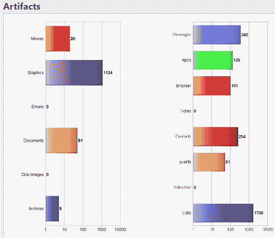
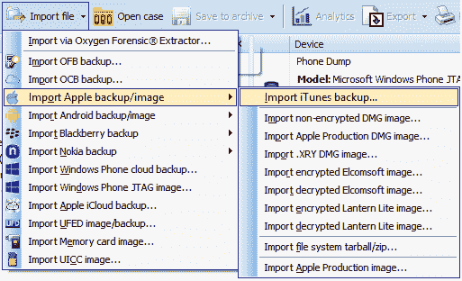
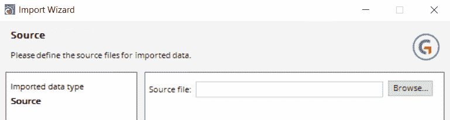

# 第九章：iOS 取证

本章将介绍以下几种解析方法：

+   使用 iPhone Backup Extractor 解析 iOS 备份

+   使用 UFED Physical Analyzer 解析 iOS 备份

+   使用 BlackLight 解析 iOS 备份

+   使用 Oxygen Forensic 进行 iOS 物理转储和备份解析

+   使用 Belkasoft Evidence Center 解析 iOS 备份

+   使用 AXIOM 解析 iOS 备份

+   使用 Encase Forensic 解析 iOS 备份

+   使用 Elcomsoft Phone Viewer 解析 iOS 备份

+   使用 iThmb Converter 进行缩略图分析

# 介绍

从 Apple 移动设备提取的主要数据来源有：

+   物理转储

+   文件系统

+   备份

物理转储和文件系统是所有送往法医实验室进行分析的对象中的最基本部分。这是由于 Apple 移动设备所采用的安全机制。绝大多数对象都是备份。iTunes 是苹果公司的一款工具，用于在 Apple 移动设备上创建备份。法医工具通常都以显性或隐性的方式，从专家的角度来说，基本上是间接从 Apple 移动设备中提取数据：首先创建一个 iTunes 备份，然后从中提取数据。

备份可以在以下路径找到：

+   mac OS X: `C:\Users\<User Name>\Library\Application Support \ MobileSync\Backup\`

+   Windows XP: `C:\Documents and Setting\<User Name>\ Application Data\Apple Computer\MobileSync\Backup\`

+   Windows Vista、7、8 和 10: `C:\Users\<User Name>\AppData\ Roaming\Apple Computer\MobileSync\Backup\`

iTunes 备份可能有不同的格式，具体取决于被检查设备中安装的 iOS 操作系统版本。

带有 iOS 10 版本或更高操作系统设备的 iTunes 备份的外观

有时你可能会遇到检查的 iTunes 备份被加密的情况。这通常发生在设备所有者在创建备份时启用了加密选项。

带有 iOS 10 以下版本操作系统设备的 iTunes 备份的外观

如果你无法从设备的所有者那里获取密码，你可以使用 Elcomsoft Phone Breaker 或 Passware Kit Forensic 程序来恢复密码。如果你有访问该设备所有者的 Mac、Macbook 或 Mac Air 的权限，可以从这些计算机和笔记本的钥匙串中提取备份密码。

# 使用 iPhone Backup Extractor 解析 iOS 备份

**iPhone Backup Extractor**是一款共享软件工具。你可以通过此工具从 iTunes 备份中提取数据，包括加密的备份。

# 准备工作

从开发者网站下载工具。双击下载的文件图标，按照指示安装程序：

1.  双击已安装的 iPhone 备份提取程序的图标。程序启动后，你需要创建一个账户。点击 ACTIVATE；该按钮位于程序窗口的右上角：

iPhone Backup Extractor 窗口的一部分外观

1.  在弹出的额外窗口中，点击创建免费账户。在下一个窗口中，填写以下字段：您的电子邮件地址、密码和重复密码。点击创建账户按钮：

新账户创建窗口的外观

1.  您将收到一封发送到注册时指定的电子邮件地址的邮件，用于确认该电子邮件地址。点击验证地址按钮以创建账户：

从 Reincubate Ltd 收到的电子邮件片段

恭喜，您的账户已创建。

1.  在 iPhone 备份提取器程序的窗口中再次点击激活。在弹出的额外窗口中，输入电子邮件和密码。点击箭头图标。程序窗口顶部的未注册字样应更改为在账户注册过程中指定的电子邮件地址。

# 如何操作……

1.  为了将 iTunes 备份上传到程序中，点击位于程序桌面上的 + 图标：

+ 图标

1.  在打开的偏好设置窗口中，如果 iTunes 备份是通过 iTunes 程序使用默认设置创建的，您将看到备份存储的路径。

1.  如果您点击位于程序左下角的 + 图标，您可以指定存储在计算机硬盘上其他位置的 iTunes 备份路径：

偏好设置窗口片段

1.  当您指定 iTunes 备份的路径时，iPhone 备份提取器将开始备份分析。分析结果将在程序的主窗口中显示。通过点击偏好设置窗口右上角的 x 图标关闭窗口：

显示 iPhone 备份提取器的 iTunes 备份分析结果窗口

您可以通过点击类别图标查看所检查的 iTunes 备份中包含的数据。

iPhone 备份提取器可以从 iCloud 中提取 iTunes 备份。如果 iTunes 备份被加密，程序会提示您输入密码。程序将使用提供的密码解密备份。

# 另见

+   iPhone 备份提取器程序的网站：[`www.iphonebackupextractor.com`](https://www.iphonebackupextractor.com)

# 使用 UFED Physical Analyzer 解析 iOS 备份

**UFED Physical Analyzer** 是一款与 Cellebrite 产品（如 UFED 4PC、UFED Touch、UFED Touch 2、UFED UME-36 等）一起提供的工具。使用此工具，您可以分析以下提取的数据：物理转储、备份和移动设备的文件系统，还可以从 Apple 移动设备和 GPS/大容量存储设备中提取数据。 UFED Physical Analyzer 包括我们在第七章中描述的 SQLite 向导，*理解 Plist 法医分析*。

# 准备中

你可以向 Cellebrite 分销商申请 UFED 物理分析仪的试用许可证。收到请求后，你将会收到一封包含分发包链接的邮件。下载 UFED 物理分析仪。双击程序安装文件的图标。按照说明安装 UFED 物理分析仪。安装完成后，点击 UFED 物理分析仪图标。

当程序启动时，会显示一个窗口，指示程序尚未激活。

点击“软件”。在新窗口中，你会找到计算机的 ID，需要将其发送给分销商。

收到你发送计算机 ID 的邮件后，你将会收到一封包含许可证文件和激活说明链接的新邮件。

按照指示激活 UFED 物理分析仪。

# 如何操作…

1.  双击 UFED 物理分析仪的图标。在工具栏中点击“文件”|“打开（高级）”。在“打开（高级）”窗口中，点击“选择设备”按钮：

选择提取类型

1.  选择 Apple iOS iTunes（备份）。点击“下一步”按钮，再次点击“下一步”。在下一个窗口中，点击“文件夹”按钮，指定 iTunes 备份的路径。点击“打开”按钮。点击“完成”。分析过程将开始。当分析过程完成后，结果将显示在程序窗口中：

从 iTunes 备份中提取的数据分析结果

UFED Cloud Analyzer 可以从 iCloud 提取 iTunes 备份。如果 iTunes 备份被加密，你将被提示输入密码。程序将使用提供的密码解密备份。

# 使用 BlackLight 解析 iOS 备份

**BlackLight** 是 BlackBag Technologies, Inc. 出品的工具。BlackLight 可用于分析运行 Windows 或 macOS 操作系统的计算机或笔记本的硬盘。使用 BlackLight，你可以获取并分析 Android 和 Apple 移动设备。

# 准备就绪

请求该程序的演示版。收到请求后，你将会收到一个链接，下载程序的试用版以及激活码。下载安装文件，双击打开。按照指示安装程序。双击 BlackLight 图标。在弹出的“需要加密狗”窗口中，点击“输入演示密钥…”。填写“姓名”和“许可证”字段，点击“确定”按钮。重新启动程序。

# 如何操作…

1.  在 BlackLight 案件管理器窗口中，点击“新建…”按钮并输入新案件的名称。点击“保存”按钮。填写“检查员信息”和“案件信息”部分的字段。在程序工具栏中，选择“文件”。在下拉菜单中，选择“添加证据…”

BlackLight 主窗口片段

1.  点击位于“文件/文件夹/磁盘映像”标识旁边的“添加”图标。

添加证据窗口的片段。

1.  在弹出的附加窗口中，点击“添加文件夹...”。选择存储 iTunes 备份的文件夹并点击“打开”按钮。所选备份的相关信息将显示在“添加证据”窗口中：

添加证据窗口的片段

1.  通过勾选“添加证据”窗口中的相应框来选择导入选项。点击“开始”按钮。

1.  选定的 iTunes 备份的分析将开始。分析进度将在主 BlackLight 窗口的下方显示。

1.  当分析过程完成后，您可以通过点击 BlackLight 工具栏上的图标或点击主 BlackLight 窗口中 Artefacts 部分的分类来查看结果：

BlackLight 工具栏上的图标

Artefacts 部分的外观

如果 iTunes 备份是加密的，系统会提示您输入密码。程序将使用提供的密码解密备份。

# 另见

+   BlackLight 公司的网站：[`www.blackbagtech.com/software-products.html`](https://www.blackbagtech.com/software-products.html)

# 使用 Oxygen Forensic 对 iOS 物理转储和备份进行解析

Oxygen Forensic 程序已经在第一章《*SIM 卡获取与分析*》中描述过。在本教程中，我们将展示如何通过 Oxygen Forensic 分析 iTunes 备份。

# 如何操作……

1.  若要从 iTunes 备份中导入数据，请点击 Oxygen Forensic 工具栏上“导入文件”按钮右侧的箭头。在下拉菜单中，选择“导入 Apple 备份/镜像”，然后选择“导入 iTunes 备份...”。

选择数据导入类型

1.  在打开的窗口中，指定备份副本的路径。选择 `Manifest.plist` 文件并点击“打开文件”。

1.  在新窗口中，填写案件的详细信息，如案件编号、证据编号、地点、事件编号、备份密码（可选）、检查员、设备所有者、所有者电子邮件等。如果需要恢复已删除的数据，勾选“从应用程序中搜索并恢复已删除的数据”。数据恢复过程将需要额外的时间。点击“下一步”按钮：

显示有关案件和提取选项的 Oxygen Forensic Extractor 窗口

1.  程序将提示您通过在窗口中显示输入的数据来仔细检查。如果所有数据正确，请点击“提取”按钮。导入过程将开始：

数据导入过程

1.  当数据导入完成后，Oxygen Forensic Extractor 的最后一个窗口会显示有关导入的汇总信息：

总结信息窗口

1.  点击“完成”以结束数据提取。你将能够在 Oxygen Forensic 程序的主窗口中查看在分析过程中找到的提取数据的信息：

分析结果

Oxygen Forensic 可以从 iCloud 提取 iTunes 备份。Oxygen Forensic 还可以提取受密码保护的 iTunes 备份数据。用于恢复 iTunes 备份密码的工具是 Passware 公司提供的，该工具包含在 Oxygen Forensic 的安装包中。

# 使用 Belkasoft Evidence Center 解析 iOS 备份

Belkasoft Evidence Center 程序已在第六章《*SQLite 取证*》中进行过描述。在本教程中，我们将描述如何通过 Belkasoft Evidence Center 分析 iTunes 备份。

# 如何操作……

1.  启动 Belkasoft Evidence Center 程序。点击“新建案例”按钮。指定新案例的信息，如案例名称、路径（数据存储的位置）、调查员姓名、案例描述以及时区。点击“创建并打开”按钮：

新案例设置窗口

1.  在下一个窗口中，指定之前提取的 iTunes 备份路径。选择 `Manifest.plist` 文件。点击“打开”按钮，然后点击“下一步”按钮：

数据源选择窗口

1.  指定需要提取的数据类型（聊天记录、电子邮件消息、图片、视频、通话记录、短信等）。点击“完成”按钮。指定的数据类型越多，分析过程所需的时间就会越长。通常，分析时间对移动设备备份的分析并不重要。以所使用的设备为例，分析过程花费了 12 分钟：

数据类型选择窗口

1.  分析过程完成后，检测到的数据类型将会显示出来：

从所检查的苹果移动设备备份中提取的数据类型

尽管创建的备份副本只包含设备上显式存储的数据，但在分析过程中，以下类型的数据会被恢复：从电话簿中删除的记录、通话记录、聊天记录、已删除的短信和笔记。通过分析图形和视频文件的缩略图，可以了解在所检查设备上存储了哪些图片和视频。提取和恢复的数据可以在 Belkasoft Evidence Center 程序中查看和分析。此外，还可以生成报告，作为证据提交给法院。

# 使用 AXIOM 解析 iOS 备份

AXIOM 程序已在第八章，*分析 Android 设备的物理转储和备份*中进行了描述。在本教程中，我们将介绍如何通过 AXIOM 分析 iTunes 备份。

# 操作步骤…

1.  双击 AXIOM Process 图标。在程序窗口中，点击 CREATE NEW CASE 按钮。在接下来的窗口中，填写案件信息字段，例如案件编号、文件夹名称、文件路径以及扫描人员，然后点击 GO TO EVIDENCE SOURCES 按钮。在下一个窗口的 SELECT EVIDENCE SOURCE 部分，点击 MOBILE 图标。在下一个窗口中，点击 IOS 图标：

SELECT EVIDENCE SOURCE (MOBILE)部分

1.  在下一个窗口中，点击 LOAD EVIDENCE 图标。在下一个窗口中，点击 FILES & FOLDERS 图标。在打开的额外 EVIDENCE SOURCES 窗口中，点击 WINDOWS FOLDER BROWSER 按钮。指定要检查的 iTunes 备份的路径，并点击 Select Folder 按钮。

1.  点击 GO TO PROCESSING DETAILS 按钮。在接下来的窗口中，你将被提示设置额外的处理标准，如关键词、是否计算检测到的文件的哈希值、检测到的图像分离标准等。当你设置好所有需要的参数后，点击 GO TO ARTIFACT DETAILS。在下一个窗口中，你将被提示选择在检查的备份中要找到的工件类别。点击 CUSTOMIZE ARTIFACTS 按钮，选择你需要在 iTunes 备份中查找的工件类型：

选择工件类型

1.  选择工件后，点击 GO TO ANALYZE EVIDENCE 按钮，然后点击 ANALYZE EVIDENCE 按钮。分析过程将开始，其进度将在 AXIOM Process 窗口中显示。备份分析过程中找到的工件将显示在 AXIOM Examine 窗口中。由于 iTunes 备份文件较小，其检查过程不会花费太多时间。

当分析过程开始时，AXIOM Examine 会自动打开。分析过程完成后，可以关闭 AXIOM Process 的窗口。分析结果可以在 AXIOM Examine 的主窗口中查看：

iTunes 备份分析的结果

使用 AXIOM Examine 查看和进行初步分析提取的数据非常方便。同时，使用 AXIOM Examine，你可以生成针对所有提取数据或特定选定类别的法医报告。

如果 iTunes 备份被加密，系统会提示你输入密码。程序将使用提供的密码解密备份。

# iOS 备份解析与 Encase Forensic

Encase Forensic 程序已在第八章中详细描述，*分析 Android 设备的物理转储和备份*。在本教程中，我们将描述如何通过 Encase Forensic 分析 iTunes 备份。

# 如何操作…

1.  双击程序图标。启动时注意程序窗口的标题。如果程序窗口的标题显示为 Encase Forensic，那么程序以完整功能模式运行。如果窗口标题显示为 Encase Acquire，则表示程序没有找到许可证。

1.  要开始，您需要创建一个新案件。在程序的工具栏中，选择案例 | 新建案件….在打开的选项窗口中，填写名称字段并点击确定按钮。然后，在工具栏中选择添加证据 | 获取移动设备 | 从文件获取….

添加证据下拉菜单的外观

1.  在打开的输出文件设置中，填写以下字段：备注、证据编号和检查员姓名。指定存储 Encase 程序与提取数据的文件夹路径，然后点击确定按钮。

1.  在导入向导窗口中，勾选 iPhone 备份。点击下一步按钮：

导入向导窗口的片段

1.  点击浏览…按钮，并指定存储 iTunes 备份文件夹的路径。选择`Manifest.plist`文件并点击打开按钮，然后点击完成：

导入向导窗口的片段

1.  从被检查的备份中提取数据的过程将开始。该过程的进度将在导入向导窗口中显示：

从 iTunes 备份提取数据的进度

1.  当提取过程完成时，导入向导窗口中将显示关于从备份成功导入到 Encase Forensic 的消息。点击完成按钮：

关于 iTunes 备份成功导入的消息

1.  导入的数据将添加到该程序中打开的案件中。数据导入进度将在 Encase Forensic 主窗口的右下角显示。

1.  当分析完成后，其结果将以任何使用 Encase Forensic 程序的专家都能熟悉的形式呈现：

从 iTunes 备份提取的数据结果

# 使用 Elcomsoft Phone Viewer 解析 iOS 备份

**Elcomsoft Phone Viewer**是来自 Elcomsof Co.Ltd.的工具。使用此工具，您可以从 iCloud 和 iTunes，以及 BlackBerry 备份中提取数据。该程序价格低廉。在本教程中，我们将描述如何通过 Elcomsoft Phone Viewer 分析 iTunes 备份。

可供导入到 Elcomsoft Phone Viewer 的数据类型

# 准备中

从发送给你的链接下载工具，并双击安装文件图标。按照提示安装程序。在安装过程中，你会被要求输入注册代码。输入发送给你的注册代码并点击“下一步”按钮。完成程序的安装。

# 如何操作…

1.  双击 Elcomsoft Phone Viewer 的图标。在程序的主窗口中，点击带有“iTunes 备份”字样的图标。

1.  在打开的“选择 iOS 备份进行查看”窗口中，指定存储 iTunes 备份的文件夹路径。选择`Manifest.plist`文件并点击“打开”按钮。

1.  程序将显示一个额外的窗口，询问是否希望查找所有媒体文件，包括那些第三方应用程序中的文件。如果你希望，点击“是”，如果不希望，点击“否”：

请求确认的窗口

1.  iTunes 备份分析的过程将开始，进度将在程序的主窗口中显示：

数据提取过程的进度

1.  当提取过程完成后，结果将在程序的主窗口中显示。你可以通过点击类别图标查看所检查备份中包含的数据：

iTunes 备份分析结果

# 另请参见

+   Elcomsoft Phone Viewer 的官方网站：[`www.elcomsoft.com/epv.html`](https://www.elcomsoft.com/epv.html)

# 使用 iThmb Converter 进行缩略图分析

如果苹果移动设备用户使用 iTunes 同步了数据，那么在该设备中你可以找到具有 ITHMB 扩展名的文件。这些文件用于创建缩略图画廊，从而加速图像浏览过程。ITHMB 文件中包含的图形文件缩略图也包含 EXIF 信息，这使得它们的识别更加容易。它还可以帮助专家找到包含这些图形文件的其他设备。

iThmb Converter 允许从 ITHMB 文件中提取图形文件的缩略图及其 EXIF 信息。

# 准备中

程序提供两种版本供下载：安装文件和便携版。访问程序的网站并下载。双击下载的文件。按照提示安装程序。安装完成后，将显示许可协议。阅读协议。如果你同意条款，勾选“我接受协议”并点击“确定”。首次启动时，程序将显示一个信息窗口，告知你该程序未注册并正在以演示模式运行。点击“确定”按钮。

如果您有注册码，请在程序的工具栏中选择“帮助 | 注册”选项。在附加的“请输入注册码”窗口中输入代码。点击“确定”。重新启动程序。

# 如何操作…

1.  程序的主窗口分为三个部分：

1.  第一部分（位于左侧）具有树状结构，类似于 Windows 资源管理器。通过此部分，您可以浏览本地驱动器和文件夹：

第一部分的外观

1.  第二部分（位于中间）显示了所选文件夹中所有具有 ITHMB 扩展名的文件名：

第二部分的外观

1.  第三部分（位于右侧）显示所选 ITHMB 文件中包含的文件缩略图：

第三部分的外观

1.  在第一部分中选择包含 ITHMB 文件的文件夹。 在第二部分中选择需要的 ITHMB 文件。在第三部分中查看文件中包含的缩略图。

# 另见

+   iThmb Converter 程序的官方网站：[`www.ithmbconverter.com/`](http://www.ithmbconverter.com/)
