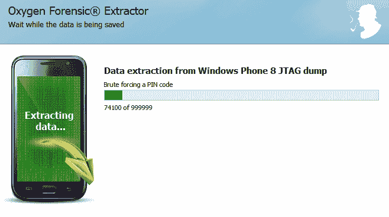
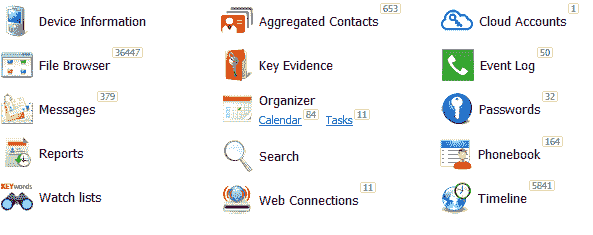

# 第十章：Windows Phone 和 BlackBerry 取证

在本章中，我们将涵盖以下内容：

+   使用 Elcomsoft Blackberry Backup Explorer Pro 解析 BlackBerry 备份

+   使用 Oxygen Forensic 解析 BlackBerry 备份

+   使用 Oxygen Forensic 解析 Windows Phone 物理转储和备份

+   使用 UFED Physical Analyzer 解析 Windows Phone 物理转储

# 简介

创建备份副本是从运行 BlackBerry OS 的移动设备提取数据的主要方法。在运行 Windows 操作系统的计算机上，运行 BlackBerry OS 的移动设备的备份通过 BlackBerry 桌面软件或 BlackBerry Link 创建。备份副本具有`.bbb`扩展名（在 MacOS 上，备份副本具有`.ipd`扩展名）。

备份副本保存在以下路径：

+   Windows XP：`C:\Documents and Settings\<UserName>\My Documents\`

+   Windows Vista、Windows 7、Windows 8、Windows 10：`C:\Users\<UserName>\Documents\`

备份文件的命名如下：

+   使用 BlackBerry 桌面软件中的备份和恢复选项手动创建的备份：Backup-（yyyy-mm-dd）.bbb" *

+   通过 BlackBerry 桌面软件的应用程序加载向导创建的备份：LoaderBackup-（yyyy-mm-dd）.bbb» *

+   自动创建的备份：AutoBackup-（yyyy-mm-dd）.bbb*

* yyyy-mm-dd 是年-月-日。

BlackBerry OS 10 的备份是加密的。为了从中提取数据，您需要移动设备所有者的 BlackBerry ID 和密码。

要创建运行 Windows Phone 操作系统的移动设备的完整备份，建议使用以下方法：

+   使用特殊设备管理程序在 DFU 模式下创建移动设备内存的副本。DFU（设备固件升级）模式允许所有设备从任何状态恢复。此方法适用于 2014 年之前发布的移动设备。

+   通过调试接口 JTAG（联合测试行动组）从集成内存芯片中提取数据。

+   使用系统内编程（ISP）方法从集成内存芯片中提取数据。

+   从内存芯片中提取数据（Chip-off）。

需要提到的是：

+   对于 Windows Phone 设备，从 x30 系列开始，无法通过调试接口（JTAG）进行数据提取，因为它们的系统板上已移除测试点。另一方面，系统内编程方法逐渐流行，这使我们可以直接将导线焊接到移动设备系统板上的内存芯片上，并且比通过调试接口（JTAG）提取数据的速度快得多。

+   从集成内存芯片提取数据（Chip-off）是一种只有在其他方法未能提供预期结果时才会使用的方法。由于在运行 Windows Phone 操作系统的移动设备中，用户分区的加密或安装在内存芯片上的锁定代码，提取数据是很困难的。如果您不知道安装在内存芯片上的锁定代码，就无法访问存储在集成内存芯片中的数据。

# 使用 Elcomsoft Blackberry Backup Explorer Pro 解析黑莓备份

**Elcomsoft Blackberry Backup Explorer Pro** 是一款用于从运行黑莓 OS 的黑莓手机设备中提取数据的工具。该工具不支持从由运行黑莓 OS 10 的设备创建的加密备份中提取数据。该程序价格低廉，任何人都可以购买。

# 准备工作

从您收到的链接下载工具，并双击安装程序图标。按照提示安装程序。在安装过程中，系统会提示您输入许可证码。请输入收到的许可证码并点击“下一步”按钮：

许可证码输入框

# 如何操作…

双击 Elcomsoft Blackberry Backup Explorer Pro 程序图标。在工具栏菜单中，点击“文件”，然后在弹出的菜单中点击“打开 IPB 或 BBB”，或者您也可以点击程序左下角的“打开 IPB 或 BBB”：

Elcomsoft Blackberry Backup Explorer Pro 主窗口的片段

在打开的窗口中，选择黑莓备份文件（具有 IPB 或 BBB 扩展名）并点击“打开”按钮。当文件内容上传到程序后，将可供查看：

从黑莓备份中提取的数据类别，在 Elcomsoft Blackberry Backup Explorer Pro 中显示

您可以为选定类别的提取数据生成报告，报告可以采用以下格式之一：

Elcomsoft Blackberry Backup Explorer Pro 主窗口的工具栏，您可以在此指定报告生成的文件扩展名

此报告包含可自定义字段，您可以通过点击“导出字段”按钮来设置：

报告中将展示的字段选择窗口

您可以使用 Elcomsoft Phone Password Breaker ([`www.elcomsoft.com/eppb.html`](https://www.elcomsoft.com/eppb.html)) 来解密加密的黑莓备份（包括黑莓 OS 10 的备份）。

# 另请参见

+   Elcomsoft Blackberry Backup Explorer Pro 程序的官方网站：[`www.elcomsoft.com/ebbe.html`](https://www.elcomsoft.com/ebbe.html)

# 使用 Oxygen Forensic 解析黑莓备份

Oxygen Forensic 程序已经在第一章《*SIM 卡采集与分析*》中进行了描述。在本节中，我们将介绍如何通过 Oxygen Forensic 从 BlackBerry 备份中提取数据。

# 如何操作…

1.  要从备份中导入数据，请点击位于 Oxygen Forensic 工具栏上“Import file”按钮右侧的箭头。在下拉菜单中，选择“Import Blackberry backup”，然后选择“Import IPD backup ...”。如果你有其他类型的备份，请从此菜单中选择其他选项：

选择数据导入的类型

1.  在打开的窗口中，指定备份的路径。选择备份并点击“Open”按钮。

1.  在新窗口中，填写案件的详细信息，例如设备别名、案件编号、证据编号、地点、事件编号、检查员、设备所有者和所有者电子邮件。点击“Next”按钮：

Oxygen Forensic Extractor 程序的窗口，显示案件和提取选项的信息

1.  程序会提示你通过在窗口中显示已输入的数据来再次检查。如果所有数据正确，点击“Extract”按钮，导入过程将开始。

1.  当数据导入完成后，Oxygen Forensic Extractor 的最终窗口将显示有关导入的摘要信息。点击“Finish”按钮以完成提取。

1.  提取的数据将可供查看和分析：

程序主窗口中关于提取数据的信息

如果你上传到 Oxygen Forensic 的 BlackBerry 备份是加密的，将会显示 Oxygen Forensic Extractor 程序的附加窗口，在此窗口中，你需要输入被调查设备所有者的 BlackBerry ID 和密码。

# 使用 Oxygen Forensic 解析 Windows Phone 物理转储和备份

Oxygen Forensic 程序已经在第一章《*SIM 卡采集与分析*》中进行了描述。在本节中，我们将介绍如何通过 Oxygen Forensic 从 Windows Phone 的物理转储中提取数据。

# 如何操作…

1.  Oxygen Forensic 具有一项功能，允许你从 Windows Phone 设备的物理转储中恢复屏幕锁密码。物理转储可以通过 JTAG 或 chip-off 方法获得。

1.  要从 Windows Phone 物理转储中导入数据，请点击位于 Oxygen Forensic 工具栏上“Import File”按钮右侧的箭头。在下拉菜单中，选择“Import Windows Phone JTAG image ...”。

选择数据导入的类型

1.  在打开的窗口中，指定物理转储的路径。点击“Open”按钮。

1.  在新窗口中，填写案件的详细信息，如设备别名、案件编号、证据编号、地点、事件编号、检查员、设备所有者和所有者电子邮件。点击“下一步”按钮。如有必要，请在“搜索并恢复已删除的数据”部分选择您要恢复的数据。数据恢复过程将需要额外的时间。点击“下一步”按钮。

1.  程序将提示您通过在窗口中显示输入的数据来进行二次检查。如果所有数据正确，请点击“提取”按钮。导入过程将开始：

物理转储分析过程

1.  如果在物理转储分析过程中找到包含加密屏幕锁密码的文件，将使用暴力破解攻击进行破解：

强力破解 PIN 码

1.  数据导入完成后，将显示包含导入摘要信息的 Oxygen Forensic Extractor 最终窗口。

1.  点击“打开设备”：

从 Windows Phone 物理转储中提取的信息

1.  在打开的窗口中，点击“设备信息”部分。在此部分中，将显示解密后的屏幕锁密码。在前面的示例中，此密码的值为 123456。

设备信息部分窗口的片段

# 使用 UFED Physical Analyzer 解析 Windows Phone 物理转储

UFED Physical Analyzer 程序已在第四章中进行了描述，*Windows Phone 和 BlackBerry 获取*。在本章中，我们将描述如何通过 UFED Physical Analyzer 从 Windows Phone 物理转储中提取数据。

# 准备就绪

正如前几章所描述的，Windows Phone 的物理转储可以通过多种方法获取。例如，可以通过 UFED 4PC、JTAG 或芯片脱焊方法获得：

使用 UFED 4PC 创建 Windows Phone 物理转储的说明

在本教程中，我们将描述使用芯片脱焊方法分析 Windows Phone 物理转储。

# 如何操作…

1.  双击 UFED Physical Analyzer 程序的图标。为了从 Windows Phone 物理转储导入数据，请点击程序工具栏上的“文件”并选择“打开（高级）”。

1.  在打开的“打开高级”窗口中，点击“选择设备”窗口。在下一个窗口中，选择与提取物理转储的移动设备对应的设备型号：

在程序中选择移动设备型号

1.  点击“下一步”按钮。确保所选设备具有物理转储分析算法。点击“下一步”按钮：

程序支持的选定移动设备型号的分析算法

1.  在下一个窗口中，点击“Image”按钮并指定 Windows Phone 物理转储的路径。选择文件并点击“Open”按钮：

打开（高级）窗口，在其中指定了 Windows Phone 物理转储的路径

1.  点击“Finish”按钮。提取过程将在程序左上角的进度条中显示。当提取完成后，提取的数据类别将显示在 UFED Physical Analyzer 程序的主窗口中：

UFED Physical Analyzer 程序的主窗口片段，显示了提取数据的类别
