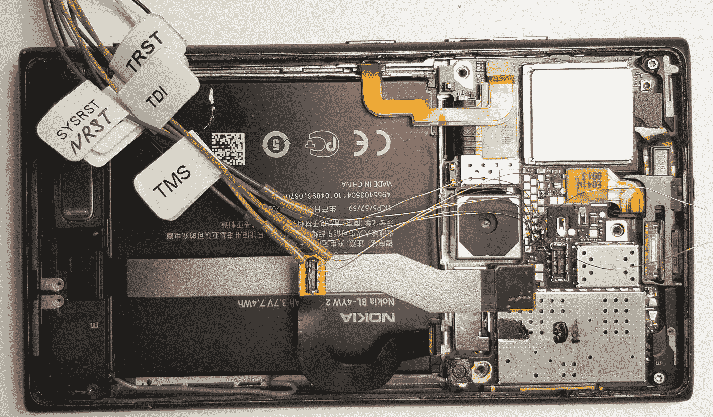
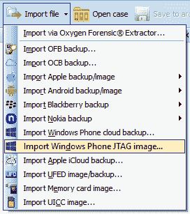
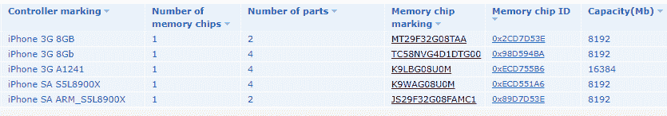

# 第十一章：JTAG 和 Chip-off 技术

在本章中，我们将介绍以下几种方法：

+   一个示例 Android 设备的 JTAG

+   一个示例 Android 设备的芯片拆卸（chip-off）

+   一个示例 Windows Phone 设备的 JTAG

+   一个示例 iPhone 设备的芯片拆卸（chip-off）

# 介绍

在本章中，我们将描述从移动设备提取数据的方法，这些方法仅在其他方法无法得到预期结果时使用。例如，您可以使用（芯片拆卸）方法从物理损坏或水损坏的设备中提取数据。此方法还在移动设备未被商业移动取证工具支持，或需要检查损坏的移动设备甚至其内存芯片碎片时使用。

这些方法包括：

+   **JTAG** – 该方法以行业标准的名称命名。联合测试行动小组（JTAG）是用于测试系统板的标准。系统板上有一个接触垫。通过 JTAG 接口，您不仅可以测试系统板，还可以对内存芯片进行物理转储。该方法不会破坏设备。如果您想使用此方法，所检查的移动设备必须处于正常工作状态。

+   **Chip-off** 是一种破坏性方法，基于将内存芯片从系统板上拆除。然后，可以通过编程器单元或专用适配器提取内存芯片中的数据。使用此方法，您可以直接从内存芯片读取信息，从而检查严重损坏的移动设备或移动设备的部分组件。编程器或适配器的使用取决于内存芯片的类型。尽管内存芯片的尺寸是标准化的，但存在多种不同的外形规格，因此专家需要拥有许多不同且昂贵的适配器来执行此方法。拆除内存芯片后，无法再使用该移动设备。

+   **ISP** 是芯片拆卸方法的温和版本。该方法不涉及从移动设备的系统板上拆除内存芯片；而是使用外部导线连接到内存芯片，通过这些导线可以复制内存芯片中的数据。

此方法的复杂性如下：

+   并非总是能够访问安装在移动设备系统板上的内存芯片的接触点。

+   并非总是能提供外部导线与内存芯片接触垫的高质量接触。

通常，使用 JTAG、芯片拆卸（chip-off）和 ISP 方法可能需要购买额外的昂贵设备和高度专业化的专家。

# 一个示例 Android 设备的 JTAG

当使用 JTAG 方法进行移动设备的物理数据转储时，需要使用闪存器。闪存器是用于给移动设备刷机的设备。不幸的是，没有任何闪存器可以对任何移动设备进行物理数据转储。通常，一个闪存器只支持某个厂商（如三星、LG、摩托罗拉等）的设备，或者仅支持同一厂商的几款型号。因此，您必须准备购买或租赁闪存器，以便对被检查的移动设备进行物理数据转储。

有些闪存器有适配器，用于将闪存器连接到移动设备的系统板。建议购买这些适配器，因为它们能减少将闪存器连接到移动设备所花费的时间。而且，在现代移动设备中，JTAG 接口的密度非常高，除了通过适配器将闪存器连接到系统板外，别无选择。

闪存器可以将提取的数据保存为它们自己的格式。您可能需要额外的软件将提取的数据转换为另一种格式，以便通过移动法医工具进行分析。

移动法医学中最著名的闪存器有：RIFF BOX、Medusa BOX 和 Z3X EasyJTAG BOX。

除了数据提取，闪存器还可以帮助解锁某些安卓移动设备的引导加载程序。引导加载程序是一种每次硬件设备开机时执行的软件。引导加载程序可能是锁定的，无法更改；也可能是解锁的，可以被更改。锁定的引导加载程序是超级用户权限的障碍。当您拥有超级用户权限时，可以轻松通过前面章节描述的工具对移动设备进行物理数据转储。

有些移动设备的系统板上没有 JTAG 接触点，这意味着无法通过 JTAG 方法从这些设备中提取数据。

由于闪存器不是法医设备，使用时必须非常注意和小心。否则，您可能会损坏或销毁移动设备上的数据。

由于现代移动设备中更常使用用户数据分区的加密，这种数据提取方法在某些设备上不再适用。在本实例中，我们将描述如何通过 Z3X EasyJTAG BOX 从三星 GT-I9192 智能手机提取数据。

# 如何操作...

1.  在数据提取之前，先拆卸智能手机并提取系统板。

1.  双击 Z3X EasyJTAG BOX 控制程序的图标——Z3X EasyJtag BOX JTAG Classic Suite。在程序打开的窗口中，选择移动设备型号——三星 GT-I9192。在主窗口中，将显示智能手机和闪存器的接口电路：

Z3X EasyJTAG BOX 与三星 GT-I9192 的接口电路

1.  使用短铜线将 Z3X EasyJTAG BOX 连接到三星 GT-I9192。

Z3X EasyJTAG BOX 与三星 GT-I9192 的连接

1.  打开闪存工具。之后，连接设备的信息将显示在 Z3X EasyJtag BOX JTAG Classic Suite 程序窗口中：

连接设备的信息

1.  验证设备的内存大小是否正确显示（8 GB），并且内存的起始地址是否显示为 Start（HEX），内存片段的大小 Length（HEX）是否正确设置。如有必要，指定将数据读取到的文件名。点击读取 eMMC 卡按钮。

1.  当提取完成后，您将收到一个以 `.bin` 扩展名结尾的文件，该文件包含移动设备内存的副本。

1.  此文件的结构对应于通过移动取证工具从类似设备获得的物理转储结构。要验证移动设备的内存转储是否正确，请使用免费的 AccessData FTK Imager 工具。从开发者的网站下载该工具并双击安装文件。按照指示安装程序。安装完成后，双击其图标启动程序。在程序启动后，在工具栏中选择 文件 | 添加证据项…。在打开的选择源窗口中，勾选镜像文件并点击下一步按钮。在下一个窗口中，点击浏览…并选择创建的闪存器 bin 文件。点击完成按钮。

1.  之后，您将能够查看移动设备内存中包含的分区、文件夹和文件：

三星 GT-I9192 移动设备的分区

用户的数据位于 userdata 分区。

# 另请参见

+   Z3X EasyJTAG BOX 生产商的网站：[`easy-jtag.com/`](http://easy-jtag.com/)

+   FTK Imager 程序的网站：[`accessdata.com/`](http://accessdata.com/)

# 一个 Android 设备的芯片提取示例

对于我们的部分同事来说，从火灾或水灾损坏的设备中提取数据，甚至从系统板的一块中提取数据，似乎是一个奇迹。然而，对我们来说，这只是日常工作。

大多数移动设备中使用的内存芯片都是 eMMC（嵌入式 MMC）类型。这些芯片在内存芯片被焊接到设备的系统板时使用。这些内存芯片与 SD 卡具有相同的接口。因此，您可以通过将内存卡的引脚与读卡器的引脚焊接，读取这种类型内存卡的信息。然而，使用专用适配器来操作会更方便。由于内存芯片有不同的尺寸，专门从事 eMMC 芯片数据提取设备分销的公司会出售这些适配器的套件。例如，您可以购买 Rusolut 公司提供的 SMARTPHONE KIT 适配器套件，使用它几乎可以保证从任何内存芯片中读取信息。此外，ACE Lab 公司在其 PC-3000 MOBILE 套件中也包含了类似的适配器套件。您可以单独购买适配器或从 Allsocket 公司购买适配器套件。

在 Aliexpress 或 eBay 上，您可以单独购买适配器或其他制造商的 eMMC 读取适配器套件。

在流行的智能手机型号中，越来越多地使用用于数据存储的 UFS 芯片。UP828 编程器与适配器一起用于从这些芯片中提取数据。

# 准备工作

拆开手机并取下系统板。通常，系统板上的芯片都被金属外壳覆盖，您需要将其移除。移除金属外壳后，使用芯片上的标记来识别哪个是内存芯片。内存芯片通常位于微处理器旁边：

移动设备系统板上覆盖金属外壳的内存芯片

# 如何操作……

您需要从系统板上取下内存芯片。芯片必须按照特定的顺序加热，避免过热。加热温度应足以融化将芯片焊接到系统板上的焊料。如果焊料没有融化，在取下芯片的过程中可能会损坏芯片。如果过热，芯片上的数据会丢失。您需要使用带有宽喷嘴和温度传感器的烙铁站，将其放置在芯片上以控制温度。您可以在网上找到特定芯片的加热模式。

如果你无法找到适合你芯片的加热模式，建议按照以下步骤操作：先在 100 摄氏度下加热芯片 2 分钟。然后在 230 摄氏度下加热芯片 5 分钟。尽量将烙铁喷嘴靠近芯片。这一点非常重要，因为当喷嘴与芯片的距离增大时，热空气的温度会迅速下降。务必要抓住系统板上与内存芯片相邻的小组件开始移动的时刻。这表明内存芯片下方的焊锡已经熔化。然而，你暂时还不能移除芯片，因为芯片不仅仅是焊接的，还用环氧树脂粘在系统板上。当你看到焊锡已经熔化时，将一把小刀的背面抵在芯片的任一侧，并用力按压，将刀片插入系统板和芯片之间。如果按压过重，可能会导致芯片的机械损坏，从而无法进行后续的检查。

从系统板上移除的内存芯片

当内存芯片从系统板上移除后，需要清除芯片上的环氧树脂残留物，并用焊锡覆盖芯片的接触点。接触点覆盖新一层焊锡一般不会有问题，但清除环氧树脂可能会有些困难。清除环氧树脂的主要方法有两种：

+   **方法 1：化学法：** 使用特定的混合物来去除环氧树脂。

+   **方法 2：机械法：** 使用烙铁喷枪对芯片进行加热。环氧树脂变软后，可以通过机械方式刮除。这个过程会产生强烈的气味，因此你需要在通风良好的地方或排风罩下进行操作。

当内存芯片准备好进行检查时，将其放置在适配器上，并连接到计算机：

用于从内存芯片读取数据的适配器

由于这种适配器并非专用的取证设备，其使用并不排除对连接的内存芯片上信息的记录。因此，你必须使用软件写保护器（例如，SAFE Block）或硬件写保护器（例如，Tableau UltraBlock USB3 (T8u)）。

要创建内存芯片的取证镜像，你可以使用任何具备此功能的取证软件。例如，前面已经提到过的 AccessData FTK Imager。双击程序图标启动程序后，进入工具栏并点击“文件 | 创建磁盘镜像...”。在接下来的窗口中，选择与内存芯片对应的驱动器。点击“完成”按钮。

在创建图像窗口中，点击添加按钮。在选择图像类型窗口中，勾选 Raw (dd)框，并点击下一步按钮。在证据项目信息窗口中，您可以添加案件描述。点击下一步按钮。在选择图像保存位置窗口中，点击浏览按钮并指定保存数据的路径。在图像文件名（不包括扩展名）字段中，指定文件名。在图像碎片大小（MB）字段中，将值设置为零。所有从内存芯片提取的数据将写入一个文件：

选择图像保存位置窗口的外观

点击完成按钮。点击开始按钮。数据创建取证副本的过程将开始。

在这个过程结束时，图像可以通过移动取证软件进行分析。双击 Autopsy 图标，并按照第八章《分析 Android 设备的物理转储和备份》中描述的步骤进行 Android 移动设备的物理转储分析。下一张图显示了分析的结果：

内存芯片转储分析的结果

# 还有更多…

+   文章，*从损坏的移动设备中提取数据*：[`articles.forensicfocus.com/2013/08/21/extracting-data-from-damaged-mobile-devices/`](https://articles.forensicfocus.com/2013/08/21/extracting-data-from-damaged-mobile-devices/)

+   文章，*移动取证中的芯片取出技术*：[`www.digitalforensics.com/blog/chip-off-technique-in-mobile-forensics/`](https://www.digitalforensics.com/blog/chip-off-technique-in-mobile-forensics/)

# 另见

+   Rusolut 公司的官网：[`rusolut.com/`](https://rusolut.com/)

+   PC-3000 MOBILE：独特的一体化解决方案，用于从移动设备恢复数据：[`www.acelaboratory.com/news/newsitem.php?itemid=206`](http://www.acelaboratory.com/news/newsitem.php?itemid=206)

+   Allsocket 公司的官网：[`allsocket.com/`](http://allsocket.com/)

+   UP828 编程器的网站：[`www.vipprogrammer.com/`](http://www.vipprogrammer.com/)

+   SAFE Block 的网站：[`www.forensicsoft.com/`](https://www.forensicsoft.com/)

# 一个 Windows Phone 设备的 JTAG 示例

使用 JTAG 和芯片取出方法，实际上是从 Windows Phone 移动设备获取物理转储的唯一方式。此外，这些方法还用于从屏幕锁定的移动设备提取数据。在本配方中，我们将描述使用 JTAG 方法从诺基亚 Lumia 925（RM-892）提取数据的示例。

# 如何进行...

1.  在数据提取之前，拆解智能手机并访问其系统板：

诺基亚 Lumia 925 的系统板

1.  双击 Z3X EasyJTAG BOX 控制程序图标 - Z3X EasyJtag BOX JTAG Classic Suite。在弹出的窗口中，选择移动设备的型号 - Nokia Lumia 925。设备与闪存器的接口电路将在程序的主窗口中显示：

Z3X EasyJTAG BOX 与 Nokia Lumia 925 的接口电路

1.  使用短铜线，将 Z3X EasyJTAG BOX 与 Nokia Lumia 925 连接：

Z3X EasyJTAG BOX 与 Nokia Lumia 925 的连接

1.  打开闪存器。在 Z3X EasyJtag BOX JTAG Classic Suite 的主窗口中，将显示关于连接设备的信息：

关于连接设备的信息

1.  验证设备的内存大小是否正确显示（8 GB），内存的起始地址是否显示为 Start（HEX），以及内存片段的大小 Length（HEX）是否正确设置。如果需要，指定数据将读取到的文件名。点击读取 eMMC 卡按钮。

1.  当提取完成时，您将获得一个扩展名为 `.bin` 的文件，该文件包含移动设备内存的副本。

1.  为了处理提取的数据，我们使用 Oxygen Forensic。双击程序图标。

1.  要从此 JTAG 图像导入数据，请点击 Oxygen Forensic 工具栏上导入文件按钮右侧的箭头。在下拉菜单中，选择导入 Android 备份 / 图像，然后选择导入 Windows Phone JTAG 图像：

数据导入类型的选择

1.  在弹出的窗口中，指定 JTAG 图像的路径。选择并点击打开。

1.  在新窗口中，填写案件的详细信息，例如：设备别名、案件编号、证据编号、地点、事件编号、检查员、设备所有者、所有者邮箱等。如果需要，选择要恢复的数据，位于搜索并恢复删除数据部分。数据恢复将需要额外的时间。点击下一步按钮。程序将提示您通过在窗口中显示已输入的数据来进行双重检查。如果所有数据正确，点击提取按钮。导入过程将开始。

1.  当数据导入过程完成时，包含导入摘要信息的 Oxygen Forensic Extractor 最终窗口将显示。点击完成按钮以完成数据提取。提取的数据将可以进行查看和分析：

从 Windows Phone JTAG 内存转储提取的信息

# 一个示例 iPhone 设备芯片拆解

我们都知道移动设备物理转储的重要性。只有物理转储才能让专家从被检查的设备中提取最大的数据。当我们需要检查一台被屏幕锁定或损坏的设备时，物理转储的提取变得尤为迫切。遗憾的是，从 Apple 移动设备提取物理转储是一个巨大的问题。在同行之间的会议上，有传言称有人通过芯片拆卸技术成功从 iPhone 中提取了数据。这既是事实，又是谎言。因为从 iPhone 3GS 开始，Apple 的移动设备都进行了加密，这意味着使用芯片拆卸方法没有任何意义。一些专家建议使用暴力破解方法来解密 Apple 设备的物理转储。然而，如果你熟悉 Apple 的 iOS 安全文档，你会明白使用暴力破解方法解密这些转储是毫无意义的。芯片拆卸方法仅适用于早期的 Apple 移动设备，这些设备没有加密。

在本教程中，我们将描述从 iPhone 3G 提取数据的方法。此设备没有用户数据加密。

# 准备工作

从设备中取出系统板。这类设备中只有一个 DIP 封装的存储芯片，很容易找到。

# 如何操作…

1.  使用烙铁站，将芯片加热 2 分钟，温度设置为 100 摄氏度。然后，将温度设置为 230 摄氏度，继续加热芯片 5 分钟。烙铁头要尽量靠近芯片；这是很重要的，因为如果烙铁头和芯片之间的距离过远，热空气的温度会迅速下降。如果操作正确，芯片应该能轻松地从系统板上取下：

从 iPhone 3G 系统板上取下的存储芯片

1.  由于芯片采用标准 DIP 封装，可以使用任何与此类芯片兼容的编程器设备来创建其镜像。将芯片放置在编程器设备的插座上，并通过编程工具的控制程序将芯片中的数据读取到文件中。

1.  下一个重要步骤是对提取的数据进行初步处理，并将其转换为可以被移动设备取证工具处理的状态。

1.  难点在于，除了数据扇区外，芯片中还提取了技术头信息，这些信息包含附加的内容。这些头信息会干扰通过移动设备取证工具对转储数据的分析。此外，芯片的整个存储区域被划分为多个段，这些段通过 RAID 连接。然而，这并不是一个大问题。ACE 实验室公司有一个解决方案库，里面详细描述了如何正确配置提取的数据，以便进行进一步分析：

来自 ACE 实验室知识库的解决方案片段

1.  使用程序员 PC 3000 FLASH 的控制程序和他们知识库中的解决方案，这将允许你以正确的方式配置从芯片提取的数据。如果你做得正确，那么在程序中你将看到关于移动设备文件系统的信息：

提取的数据配置结果

1.  将结果保存在新文件中。现在该文件可以通过移动取证工具进行分析。

1.  双击 UFED Physical Analyzer 图标。在工具栏中，点击 文件 | 打开（高级）。在打开（高级）窗口中，点击选择设备按钮：

提取类型的选择

1.  选择设备 Apple iPhone（物理）。点击下一步按钮。再次点击下一步按钮。在下一个窗口中，点击图像按钮并指定文件的位置。点击打开按钮。点击完成按钮。iPhone 提取数据的分析过程将开始。分析结束时，结果将在程序窗口中显示：

从 iPhone 3G 中提取的数据分析结果

请参阅文章，*通过芯片移除技术提取损坏 iPhone 数据*：[`www.digitalforensics.com/blog/extracting-data-from-a-damaged-iphone-via-chip-off-technique/`](https://www.digitalforensics.com/blog/extracting-data-from-a-damaged-iphone-via-chip-off-technique/)。  请参阅文章，*通过芯片移除技术提取损坏 iPhone 数据 第二部分*：[`www.digitalforensics.com/blog/extracting-data-from-a-damaged-iphone-via-chip-off-technique-part-2/`](https://www.digitalforensics.com/blog/extracting-data-from-a-damaged-iphone-via-chip-off-technique-part-2/) Ace Lab 解决方案中心：[`www.pc-3000flash.com/solbase/task.php?group_id=321&lang=eng`](http://www.pc-3000flash.com/solbase/task.php?group_id=321&lang=eng)

# 另请参阅

+   iOS 安全性：[`www.apple.com/business/docs/iOS_Security_Guide.pdf`](https://www.apple.com/business/docs/iOS_Security_Guide.pdf)

+   PC 3000 Flash：[`www.acelaboratory.com/pc3000flash.php`](http://www.acelaboratory.com/pc3000flash.php)

+   从死逻辑板恢复 iPhone 6 数据：[`www.youtube.com/watch?v=58-7cg9cYNY`](https://www.youtube.com/watch?v=58-7cg9cYNY)
