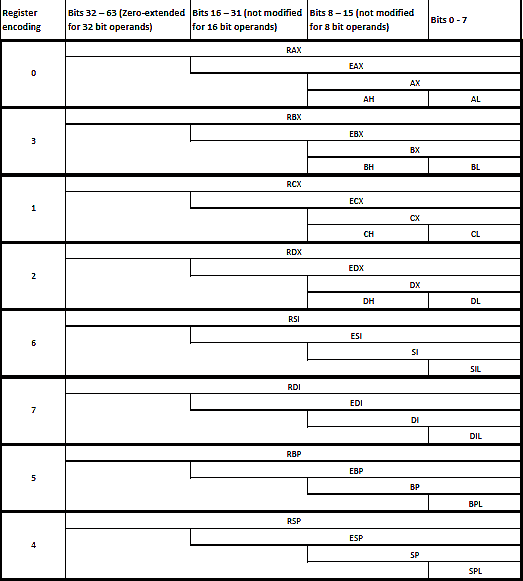
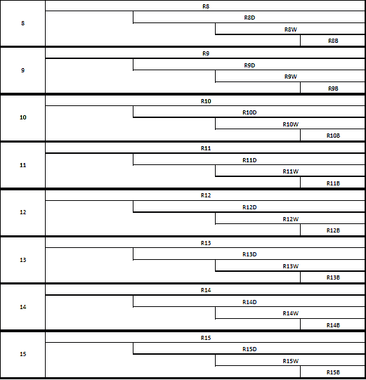
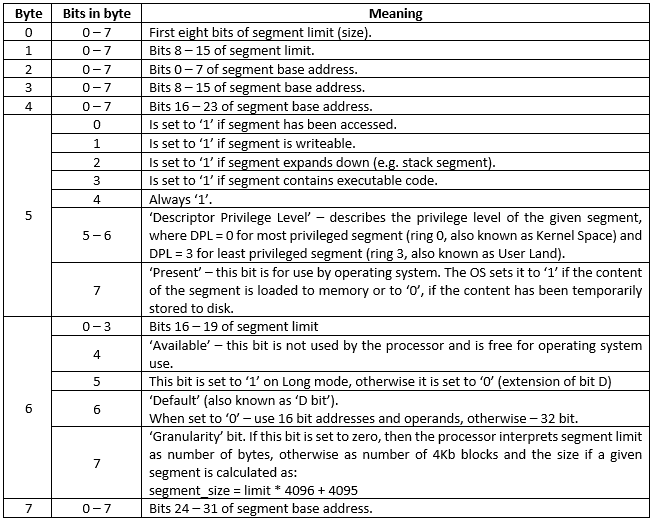
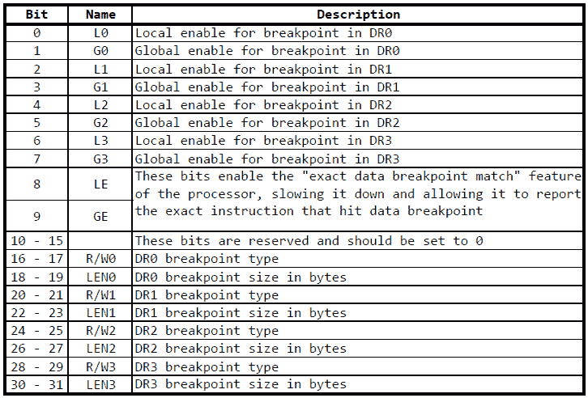

# 第一章：英特尔架构

<q>-你通常使用什么语言？</q> <q>-C 和汇编。事实上，我喜欢用汇编编程。</q>

<q>-嗯……我可不敢公开承认这一点……</q>

提到汇编语言时，人们通常会想象它是一种未知且危险的野兽，只听从编程社区中最怪异的代表，或者是一把只能用来射击自己腿部的枪。就像任何偏见一样，这种看法源于无知和对未知的原始恐惧。本书的目的不仅是帮助你克服这种偏见，还要展示如何将汇编语言变成一项强大的工具，一把锋利的手术刀，帮助你优雅而相对简单地完成某些任务，甚至是复杂的任务，避免有时由高级语言带来的不必要的复杂性。

首先，什么是汇编语言？简单而精确地说，我们可以安全地将汇编语言定义为符号化或人类可读的机器码，因为每条汇编指令都转换成一条机器指令（少数例外）。更精确地说，并没有单一的汇编语言，而是有多种汇编语言——每个平台有一种，而平台则是指可编程设备。几乎任何具有特定指令集的可编程设备都可能有其自己的汇编语言，但并非总是如此。例外的设备如 NAND 闪存芯片，虽然它们有自己的指令集，但没有从内存中获取指令并执行的手段，除非明确告知它们去执行。

为了能够有效地使用汇编语言，必须对底层平台有一个精确的理解，因为用汇编语言编程意味着直接“与设备对话”。理解越深，汇编编程的效率就越高；然而，我们不会详细探讨这一点，因为这超出了本书的范围。一本书不足以涵盖特定架构的每一个方面。由于本书将集中讨论英特尔架构，让我们尽量对英特尔的 x86/AMD64 架构有一个大致的了解，并努力加深这一理解。

本章主要讲解处理器寄存器及其功能，并简要描述内存组织（例如，分段和分页）。

+   **通用寄存器**：尽管在某些情况下它们具有特殊的含义，但正如这一组名称所示，这些寄存器可以用于任何目的。

+   **浮点寄存器**：这些寄存器用于浮点运算。

+   **段寄存器**：这些寄存器很少被应用程序访问（最常见的情况是在 Windows 上设置结构化异常处理程序）；然而，在这里讨论它们很重要，因为它能帮助我们更好地理解 CPU 是如何看待内存的。本章讨论段寄存器的部分还涉及到一些内存组织的方面，例如分段和分页。

+   **控制寄存器**：这是一个非常小的寄存器组，具有重要的作用，因为它们控制着处理器的行为，并启用或禁用某些功能。

+   **调试寄存器**：尽管这一组寄存器主要由调试器使用，但它们为我们的代码增加了一些有趣的功能，例如在追踪程序执行时设置硬件断点的能力。

+   **EFlags 寄存器**：在某些平台上，这也被称为状态寄存器。这个寄存器提供了关于最新执行的**算术逻辑单元**（**ALU**）操作结果的信息，以及一些 CPU 自身的设置。

# 处理器寄存器

每个可编程设备，包括英特尔处理器，都有一组通用寄存器——这些是位于芯片上物理位置的存储单元，因此提供了低延迟访问。它们用于临时存储处理器操作的数据或经常访问的数据（如果通用寄存器的数量允许的话）。英特尔 CPU 的寄存器数量和位大小根据当前的操作模式而有所不同。英特尔 CPU 至少有两种模式：

+   **实模式**：这就是老旧的 DOS 模式。当处理器启动时，它会进入实模式，这种模式有一定的限制，例如地址总线的大小仅为 20 位，并且采用分段内存空间。

+   **保护模式**：该模式最早在 80286 中引入。它通过使用不同的内存分段机制，提供了对更大内存空间的访问。80386 引入的分页技术使得内存寻址虚拟化变得更加容易。

自 2003 年左右起，我们还引入了所谓的长模式——64 位寄存器/寻址（尽管并非所有 64 位都用于寻址），扁平内存模型，以及基于 RIP 的寻址（相对于指令指针寄存器的寻址）。在本书中，我们将使用 32 位保护模式（虽然有 16 位保护模式，但这超出了本书的范围）和长模式，长模式是 64 位操作模式。长模式可以视为保护模式的 64 位扩展，而保护模式则从 16 位发展到 32 位。重要的是要知道，在早期模式中可以访问的寄存器，在新模式中也可以访问，这意味着在实模式中可以访问的寄存器，在保护模式中也可以访问，保护模式中可访问的寄存器，在长模式中也可以访问（如果处理器支持长模式）。关于某些寄存器位宽的细节会在本章稍后讨论。然而，由于 16 位模式（实模式和 16 位保护模式）不再被应用开发者使用（除少数例外），在本书中，我们仅讨论保护模式和长模式。

# 通用寄存器

根据操作模式（保护模式或长模式），现代 Intel 处理器中有 8 到 16 个可用的通用寄存器。每个寄存器被划分为子寄存器，允许访问比寄存器宽度更小的位宽数据。

下表显示了通用寄存器（以下简称 GPR）：



表 1：x86/x86_64 寄存器

所有的 R*寄存器仅在长模式下可用。寄存器 SIL、DIL、BPL 和 SPL 仅在长模式下可用。寄存器 AH、BH、CH 和 DH 不能在不适用于长模式的指令中使用。

为了方便起见，我们在不需要明确指定某个位宽寄存器时，将以其 32 位名称（如 EAX、EBX 等）来引用这些寄存器。上述表格显示了 Intel 平台上所有可用的通用寄存器。它们中的一些仅在长模式下可用（所有 64 位寄存器、R*寄存器，以及少数 8 位寄存器），并且某些组合是不允许的。然而，尽管我们可以将这些寄存器用于任何目的，但在某些情况下，它们确实有特殊的含义。

# 累加寄存器

EAX 寄存器也称为 **累加器**，用于乘法和除法操作，既作为隐含操作数，也作为目标操作数。值得一提的是，二进制乘法的结果是操作数大小的两倍，而二进制除法的结果由两个部分（商和余数）组成，每个部分的位宽与操作数相同。由于 x86 架构最初是以 16 位寄存器为基础，并且出于向后兼容性考虑，当操作数的值大于 8 位时，EDX 寄存器用于存储部分结果。例如，如果我们要将两个字节 `0x50` 和 `0x04` 相乘，预期结果是 `0x140`，它不能存储在一个字节中。然而，由于操作数是 8 位大小，结果存储在 AX 寄存器中，AX 是 16 位的。但如果我们要将 `0x150` 与 `0x104` 相乘，结果需要 17 位才能存储（`0x150 * 0x104 = 0x15540`），而如前所述，最初的 x86 寄存器只有 16 位。这就是使用额外寄存器的原因；在英特尔架构中，这个寄存器是 EDX（更准确地说，在这种情况下只使用 DX 部分）。由于口头解释有时过于概括，最好通过实际示例来展示这个规则。

| **操作数大小** | **源操作数 1** | **源操作数 2** | **目标操作数** |
| --- | --- | --- | --- |
| 8 位（字节） | AL | 8 位寄存器或 8 位内存 | AX |
| 16 位（字） | AX | 16 位寄存器或 16 位内存 | DX:AX |
| 32 位（双字） | EAX | 32 位寄存器或 32 位内存 | EDX:EAX |
| 64 位（四字） | RAX | 64 位寄存器或 64 位内存 | RDX:RAX |

除法涉及稍微不同的规则。更准确地说，这是反向乘法规则，意味着操作结果是被除数位宽的一半，这也意味着在长模式下，最大被除数可以是 128 位宽。最小的被除数值与乘法中源操作数的最小值相同——8 位。

| **操作数大小** | **被除数** | **除数** | **商** | **余数** |
| --- | --- | --- | --- | --- |
| 8/16 位 | AX | 8 位寄存器或 8 位内存 | AL | AH |
| 16/32 位 | DX:AX | 16 位内存或 16 位寄存器 | AX | DX |
| 32/64 位 | EDX:EAX | 32 位寄存器或 32 位内存 | EAX | EDX |
| 64/128 位 | RDX:RAX | 64 位寄存器或 64 位内存 | RAX | RDX |

# 计数器

ECX 寄存器 - 也称为计数器寄存器。该寄存器在循环中用作循环迭代计数器。它首先加载一个迭代次数，然后每次执行循环指令时递减，直到 ECX 中存储的值变为零，指示处理器跳出循环。我们可以将其与 C 中的 `do{...}while()` 子句进行比较：

```
int ecx = 10; 
do 
{ 
    // do your stuff 
    ecx--; 
}while(ecx > 0);
```

该寄存器的另一个常见用法，实际上是其最低有效部分 CL 的用法，是位移操作，其中它包含源操作数应移位的位数。例如，考虑以下代码：

```
mov eax, 0x12345
mov cl, 5 
shl eax, cl
```

这将导致寄存器 EAX 被左移 5 位（结果值为`0x2468a0`）。

# 堆栈指针

ESP 寄存器是堆栈指针。该寄存器与 SS 寄存器一起（SS 寄存器将在本章稍后解释）描述线程的堆栈区域，其中 SS 包含堆栈段的描述符，而 ESP 是指向堆栈中当前指针位置的索引。

# 源和目标索引

ESI 和 EDI 寄存器在字符串操作中作为源和目标索引寄存器，其中 ESI 包含源地址，EDI 显然包含目标地址。我们将在第三章中更多地讨论这些寄存器，*英特尔指令集架构（ISA）*。

# 基址指针

EBP。这个寄存器被称为基址指针，因为它最常见的用途是在函数调用期间指向堆栈帧的基址。然而，与前面讨论的寄存器不同，如果需要，你可以使用任何其他寄存器来完成此目的。

这里还值得提到另一个寄存器 EBX，它在 16 位模式的“好日子”里（当时它还是 BX 寄存器）是我们可以用作寻址基址的少数寄存器之一。与 EBP 不同，EBX（在 XLAT 指令的情况下，默认使用 DS:EBX，至今仍然如此）旨在指向数据段。

# 指令指针

还有一个特殊寄存器不能用于数据存储——EIP（在实模式下为 IP，长模式下为 RIP）。这是指令指针，包含当前执行的指令之后的指令地址。所有指令都会由 CPU 隐式从代码段获取；因此，执行的指令之后的完整地址应描述为 CS:IP。此外，没有常规方法可以直接修改其内容。虽然这并非不可能，但我们不能仅仅使用`mov`指令将值加载到 EIP 中。

所有其他寄存器从处理器的角度来看没有特殊含义，可以用于任何目的。

# 浮点寄存器

CPU 本身没有进行浮点运算的功能。1980 年，英特尔推出了 Intel 8087——为 8086 系列设计的浮点协处理器。8087 一直作为一个可单独安装的设备存在，直到 1989 年，英特尔推出了集成 8087 电路的 80486（i486）处理器。然而，当谈到浮点寄存器和浮点指令时，我们仍然将 8087 称为浮点单元（FPU），有时仍称其为浮点协处理器（不过后者越来越少见）。

8087 处理器有八个寄存器，每个寄存器都是 80 位，按照栈的方式排列，这意味着操作数从内存推入此栈，结果从最顶端的寄存器弹出到内存。这些寄存器命名为 ST0 到 ST7（ST--栈），其中使用最频繁的是 ST0 寄存器，可以简称为 ST。

浮点协处理器支持多种数据类型：

+   80 位扩展精度实数

+   64 位双精度实数

+   32 位单精度实数

+   18 位十进制整数

+   64 位二进制整数

+   32 位二进制整数

+   16 位二进制整数

浮点协处理器将在第三章，*Intel 指令集架构（ISA）*中详细讨论。

# XMM 寄存器

128 位 XMM 寄存器是 SSE 扩展的一部分（其中**SSE**是**流处理单指令多数据扩展**的缩写）。在非 64 位模式下有八个 XMM 寄存器，在长模式下有 16 个 XMM 寄存器，允许对以下内容进行并行操作：

+   16 字节

+   八个字

+   四个双字

+   两个四字

+   四个浮点数

+   两个双精度实数

我们将在第五章，*并行数据处理*中更加关注这些寄存器及其背后的技术。

# 段寄存器和内存组织

内存组织是 CPU 设计中最重要的方面之一。首先要注意的是，当我们说“内存组织”时，我们并不是指它在内存芯片/板上的物理布局。对我们来说，更重要的是 CPU 如何看待内存以及它如何与之通信（当然，这是在更高层次上，因为我们不会深入讨论架构的硬件方面）。

然而，由于本书专注于应用程序编程，而非操作系统开发，在本节中我们将进一步考虑内存组织和访问中最相关的方面。

# 实模式

段寄存器是一个非常有趣的主题，因为它们告诉处理器哪些内存区域可以访问，以及如何访问。在实模式下，段寄存器用于包含一个 16 位段地址。普通地址和段地址的区别在于后者在存储到段寄存器时向右移动 4 位。例如，如果某个段寄存器加载了`0x1234`值，实际上指向的地址是`0x12340`；因此，在实模式中，指针实际上是段寄存器指向的段的偏移量。例如，我们来看看 DI 寄存器（因为我们现在讨论的是 16 位实模式），它会自动与 DS（数据段）寄存器一起使用，并且当 DS 寄存器加载了`0x1234`值时，将其加载为`0x4321`，那么 20 位地址将会是`0x12340 + 0x4321 = 0x16661`。因此，在实模式下最多可以寻址 1MB 内存。

总共有六个段寄存器：

+   **CS**：该寄存器包含当前使用的代码段的基地址。

+   **DS**：该寄存器包含当前使用的数据段的基地址。

+   **SS**：该寄存器包含当前使用的堆栈段的基地址。

+   **ES**：这是供程序员使用的附加数据段。

+   **FS**和**GS**：这两个寄存器是随着 Intel 80386 处理器引入的。这两个段寄存器没有特定的硬件定义功能，供程序员使用。需要知道的是，它们在 Windows 和 Linux 中有特定的任务，但这些任务仅与操作系统相关，并与硬件规范无关。

CS 寄存器与 IP 寄存器（指令指针，也叫程序计数器）一起使用，其中 IP（在保护模式下为 EIP，在长模式下为 RIP）指向当前正在执行的指令的偏移量，在代码段中跟随该指令。

使用 SI 和 DI 寄存器时，分别隐含使用 DS 和 ES 段寄存器，除非指令中隐式指定了其他段寄存器。例如，`lodsb`指令虽然没有操作数，但会从由 DS:SI 指定的地址加载一个字节到 AL 寄存器中，而`stosb`指令（同样没有可见操作数）会将 AL 寄存器中的一个字节存储到由 ES:DI 指定的地址中。使用 SI/DI 寄存器与其他段时，需要显式提及相关段寄存器。考虑以下代码示例：

```
mov ax, [si] 
mov [es:di], ax
```

上述代码从 DS:SI 指向的位置加载一个双字，并将其存储到由 ES:DI 指向的另一个位置。

段寄存器和段的一个有趣之处在于，它们可以平稳重叠。例如，如果你想将一部分代码复制到代码段中的另一个位置或临时缓冲区（例如，用于解密器），此时，CS 和 DS 寄存器可以指向相同位置，或者 DS 寄存器可以指向代码段的某个地方。

# 保护模式 - 分段

在实模式下，一切都很简单明了，但到了保护模式，事情变得复杂了。不幸的是，内存分段仍然存在，但段寄存器不再包含地址。相反，它们加载了所谓的选择子，这些选择子是描述符表中的索引，并乘以 8（向左移位 3 位）。最低的两位表示请求的权限级别（0 表示内核空间，3 表示用户空间）。第三位（在索引 2 处）是**TI**位（**表指示符**），表示所引用的描述符是位于全局描述符表（0）还是局部描述符表（1）。内存描述符是一个小型 8 字节结构，描述了物理内存的范围、访问权限和一些附加属性：



表 2：内存描述符结构

描述符至少存储在两个表中：

+   **GDT**：全局描述符表（由操作系统使用）

+   **LDT**：局部描述符表（每个任务描述符表）

正如我们可以得出的结论，保护模式下的内存组织实际上与实模式并没有太大的不同。

还有其他类型的描述符——中断描述符（存储在**中断描述符表**（**IDT**）中）和系统描述符；然而，由于这些只在内核空间中使用，我们不会讨论它们，因为它们超出了本书的范围。

# 保护模式 - 分页

分页是一种在 80386 中引入的更方便的内存管理方案，并且此后有所增强。分页的核心思想是内存虚拟化——这是使不同进程能够拥有相同内存布局的机制。实际上，我们在指针中使用的地址（如果我们用 C、C++或任何其他编译成本地代码的高级语言编程）是虚拟地址，并不对应于物理地址。虚拟地址到物理地址的转换由硬件实现，由 CPU 执行（不过，也可能有一些操作系统干预）。

默认情况下，32 位 CPU 使用两级转换方案将提供的虚拟地址转换为物理地址。

以下表格解释了如何使用虚拟地址来查找物理地址：

| **地址位** | **含义** |
| --- | --- |
| 0 - 11 | 在 4KB 页面中的偏移量 |
| 12 - 21 | 1024 页的页表中的页项索引 |
| 22 - 31 | 页目录中 1024 条目页表项的索引 |

表 3：虚拟地址到物理地址的转换

大多数基于 Intel 架构的现代处理器都支持**页面大小扩展**（**PSE**），这使得使用所谓的 4 MB 大页面成为可能。在这种情况下，虚拟地址到物理地址的转换有所不同，因为不再有页面表。以下表格展示了 32 位虚拟地址中各位的含义：

| **地址位** | **含义** |
| --- | --- |
| 0 - 21 | 4 MB 页面中的偏移量 |
| 22 - 31 | 1024 项页面目录中相应条目的索引 |

表 4：启用 PSE 时虚拟地址到物理地址的转换

此外，**物理地址扩展**（**PAE**）被引入，显著改变了地址映射方案，允许访问更大的内存范围。在保护模式下，PAE 增加了一个四项条目的页面目录指针表，虚拟地址到物理地址的转换如下表所示：

| **地址位** | **含义** |
| --- | --- |
| 0 - 11 | 4 KB 页面中的偏移量 |
| 12 - 20 | 512 页面表中的页面条目的索引 |
| 21 - 29 | 512 项页面目录中的页面表项索引 |
| 30 - 31 | 四项页面目录指针表中页面目录条目的索引 |

表 5：启用 PAE（未启用 PSE）时的虚拟地址到物理地址转换

启用 PSE 并同时启用 PAE 会强制页面目录中的每个条目直接指向一个 2 MB 的大页面，而不是指向页面表中的条目。

# 长模式 - 分页

长模式下唯一允许的地址虚拟化方式是启用 PAE 的分页；但是，它增加了一个新的表——页面映射级别 4 表作为根条目。因此，虚拟地址到物理地址的转换按以下表格所示，使用虚拟地址中的各个位：

| **地址位** | **含义** |
| --- | --- |
| 0 - 11 | 4 KB 页面中的偏移量 |
| 12 - 20 | 512 页面表中的页面条目的索引 |
| 21 - 29 | 页面目录中页表项的索引 |
| 30 - 38 | 页面目录指针表中页面目录条目的索引 |
| 39 - 47 | 页面目录指针表在页面映射级别 4 表中的索引 |

表 6：长模式下虚拟地址到物理地址的转换

然而，需要指出的是，尽管它是 64 位架构，MMU 仅使用虚拟地址的前 48 位（也称为线性地址）。

地址解析的整个过程由 CPU 内部的**内存管理单元**（**MMU**）执行，程序员仅需负责实际构建这些表并启用 PAE/PSE。然而，这个话题远远超出了本书的范围，涉及的内容较广。

# 控制寄存器

基于 Intel 架构的处理器有一组控制寄存器，用于在运行时配置处理器（例如切换执行模式）。这些寄存器在 x86 上为 32 位宽，在 AMD64（长模式）上为 64 位宽。

有六个控制寄存器和一个**扩展功能启用寄存器**（**EFER**）：

+   **CR0**：此寄存器包含修改处理器基本操作的各种控制标志。

+   **CR1**：此寄存器保留供未来使用。

+   **CR2**：当发生页面错误时，此寄存器包含页面错误的线性地址。

+   **CR3**：此寄存器在启用虚拟地址（分页）时使用，并包含页面目录、页面目录指针表或页面映射级别 4 表的物理地址，具体取决于当前的操作模式。

+   **CR4**：此寄存器在保护模式下用于控制处理器的不同选项。

+   **CR8**：此寄存器是新的，仅在长模式下可用。它用于外部中断的优先级排序。

+   **EFER**：此寄存器是多个特定于型号的寄存器之一。它用于启用/禁用 SYSCALL/SYSRET 指令、进入/退出长模式以及其他一些功能。其他特定于型号的寄存器对我们无关紧要。

然而，这些寄存器在`ring3`（用户态）中不可访问。

# 调试寄存器

除了控制寄存器外，处理器还具有一组所谓的调试寄存器，这些寄存器主要由调试器用于设置所谓的硬件断点。事实上，这些寄存器在控制其他线程甚至进程时是非常强大的工具。

# 调试地址寄存器 DR0 - DR3

调试寄存器 0 到 3（DR0、DR1、DR2 和 DR3）用于存储所谓的硬件断点的虚拟（线性）地址。

# 调试控制寄存器（DR7）

DR7 定义了**调试地址寄存器**中设置的断点如何被处理器解释，以及是否需要被解释。

该寄存器的位布局如下表所示：



表 3：DR7 位布局

L*位，当设置为 1 时，在相应的调试地址寄存器中指定的地址处启用断点--在任务内本地启用。这些位在每次任务切换时由处理器重置。G*位，相反，启用全局断点--适用于所有任务，意味着这些位不会被处理器重置。

R/W*位指定断点条件，如下所示：

+   `00`：在指令执行时断点

+   `01`：仅在指定地址被写入时触发断点

+   `10`：未定义

+   `11`：在读取或写入访问时，或在指定地址处执行指令时触发断点

LEN*位指定断点的大小（以字节为单位），因此可以覆盖多个指令或多个字节的数据：

+   `00`：断点为 1 字节长

+   `01`：断点为 2 字节长

+   `10`: 断点为 8 字节长（仅长模式下）

+   `11`: 断点为 4 字节长

# 调试状态寄存器（DR6）

当启用断点触发时，DR6 中低四位的相应位会在进入调试处理程序之前被置为 1，从而为处理程序提供有关触发断点的信息（位 0 对应 DR0 中的断点，位 1 对应 DR1 中的断点，依此类推）。

# EFlags 寄存器

如果处理器没有办法报告其状态和/或最后一次操作的状态，任何语言的程序都无法在给定的平台上编写。更重要的是，处理器本身有时也需要这些信息。试想一下，如果处理器无法有条件地控制程序的执行流程——这听起来像一场噩梦，不是吗？

获取有关最后操作或 Intel 架构处理器某些配置的信息，程序最常用的方式是通过**EFlags**寄存器（**E**代表扩展）。该寄存在实模式下称为 Flags，在保护模式下称为 EFlags，在长模式下称为**RFlags**。

让我们来看看这个寄存器中各个位（也称为标志）的含义及其使用。

# 位 #0 - 进位标志

**进位标志**（**CF**）主要用于检测算术运算中的进位/借位，并在最后一次此类运算的结果位宽（例如加法和减法）超出 ALU 的位宽时置位。例如，两个 8 位值 255 和 1 相加会得到 256，这需要至少 9 位来存储。在这种情况下，第八位（第九位）被置入 CF，从而让我们和处理器知道最后的操作有进位。

# 位 #2 - 奇偶标志

**奇偶标志**（**PF**）在最低有效字节中 1 的个数为偶数时置为 1；否则，置为零。

# 位 #4 - 调整标志

**调整标志**（**AF**）在最低有效的四个位（低半字节）发生进位或借位时被置位，主要用于**二进制编码十进制**（**BCD**）算术运算。

# 位 #6 - 零标志

**零标志**（**ZF**）在算术或按位操作的结果为 0 时置位。这包括没有存储结果的操作（例如比较和位测试）。

# 位 #7 - 符号标志

**符号标志**（**SF**）在上一次数学运算结果为负数时被置位；换句话说，当结果的最高有效位被置位时，符号标志会被置位。

# 位 #8 - 陷阱标志

当置位时，**陷阱标志**（**TF**）会在每条指令执行后引发单步中断。

# 位 #9 - 中断使能标志

**中断使能标志**（**IF**）定义处理器是否对传入的中断做出反应。该标志仅在实模式或其他模式下的 Ring 0 保护级别下可访问。

# 位 #10 - 方向标志

**方向标志**（**DF**）控制字符串操作的方向。如果标志被复位（为 0），操作会从低地址到高地址执行；如果标志被置位（为 1），操作则从高地址到低地址执行。

# 位 #11 - 溢出标志

**溢出标志**（**OF**）有时被认为是进位标志的二进制补码形式，但实际上并非如此。OF 在操作的结果太小或太大，无法适配目标操作数时被置位。例如，考虑将两个 8 位正值 0x74 和 0x7f 相加。这次加法的结果是 0xf3，仍然是 8 位的，对于无符号数来说是可以接受的，但由于我们加的是两个有符号数，必须考虑符号位，而存储 9 位有符号结果的地方已经没有足够的位数。如果我们尝试加上两个负的 8 位数 0x82 和 0x81，也会发生同样的情况。两个负数相加的意义在于从负数中减去正数，结果应当是一个更小的数。因此，0x82 + 0x81 将得到 0x103，其中第九位（1）是符号位，但它无法存储在一个 8 位操作数中。更大的操作数（如 16、32 和 64 位）也是如此。

# 剩余的位

在用户模式下，EFlags 寄存器的剩余 20 位对我们来说并不重要，除非可能是 ID 位（位 #21）。ID 标志指示我们是否可以使用 CPUID 指令。

在长模式下，RFlags 寄存器的第 32 位到第 63 位将全部为 0。

# 总结

在本章中，我们简要地介绍了 x86 架构处理器的内部结构基础知识，这对进一步理解后续章节的主题至关重要。作为奥卡姆剃刀原理的忠实粉丝，我本人并不打算重复英特尔的程序员手册；然而，本章涉及的一些话题超出了成功开始汇编语言编程所必需的内容。

然而，我相信你会同意——我们已经了解了足够的干货，现在是时候开始动手做一些事情了。让我们从在第二章中设置开发环境开始，*设置开发环境*。
