# 第二章：设置开发环境

我们正慢慢接近能够开始实际处理汇编语言的时刻——编写代码、检查程序、解决问题。我们只差一步，那就是为汇编编程设置开发环境。

尽管本书使用的汇编器是**平面汇编器**（**FASM**），但重要的是至少要了解另外两种选择，因此在本章中，您将学习如何配置三种类型的开发环境：

+   **为 Windows 平台应用程序设置开发环境（使用 Visual Studio 2017 Community）**：这将使汇编项目能够与现有解决方案直接集成

+   **安装 GNU 编译器集合**（**GCC**）：虽然 GCC 可以在 Windows 和*nix 平台上使用，但我们将重点强调在 Linux 上使用 GCC

+   **平面汇编器**：这个汇编器似乎是最简单且最舒适的，用于 Windows 或 Linux 上的汇编编程

我们将在每个章节结束时提供一个用汇编语言编写的简单测试程序，该程序是专门为该章节描述的汇编器编写的。

# 微软宏汇编器

正如这个汇编器的名字所示，它支持宏并且内置了一些很好的宏。然而，今天如果没有这个特性，很难找到一个多少有点价值的汇编器。

我第一次使用的汇编器是**宏汇编器**（**MASM**）（我不记得是哪一版本），它安装在一台配备 4MB RAM 和 100MB 硬盘的索尼笔记本电脑上（啊，那个美好的旧时光），而 MS-DOS 的 edit.exe 是唯一的集成开发环境。无需多言，编译和链接都需要在命令行中手动完成（就像 DOS 有其他界面一样）。

在我看来，这是学习汇编语言或任何其他编程语言的最佳方式——仅仅是一个功能尽可能少的简单编辑器（不过，语法高亮是一个很大的优势，因为它有助于避免拼写错误）和一组命令行工具。现代的**集成开发环境**（**IDEs**）是非常复杂的，但也非常强大的工具，我并不是想低估它们；然而，一旦你了解了这些复杂背后的内容，使用它们会更好。

然而，本书的目的是学习 CPU 所使用的语言，而不是特定的汇编方言或特定汇编器命令行选项。更不用说，目前可用的 Microsoft Visual Studio 2017 Community（获取 MASM 最简单的方法是安装 Visual Studio 2017 Community——免费且方便）附带了多个汇编器二进制文件：

+   一个生成 32 位代码的 32 位二进制文件

+   一个生成 64 位代码的 32 位二进制文件

+   一个生成 32 位代码的 64 位二进制文件

+   一个生成 64 位代码的 64 位二进制文件

我们的目标是了解 CPU 是如何思考的，而不是如何让它理解我们的思维，并且我们如何找到系统中已安装的库和可执行文件的位置。因此，如果 MASM 是你的选择，使用 Visual Studio 2017 Community 会节省你大量时间。

# 安装 Microsoft Visual Studio 2017 Community

如果你已经安装了 Microsoft Visual Studio 2017 Community 或任何其他版本的 Microsoft Visual Studio，你可以安全跳过这一步。

这是本书中描述的最简单的操作之一。访问 [`www.visualstudio.com/downloads/`](https://www.visualstudio.com/downloads/) 下载并运行 Visual Studio 2017 Community 的安装程序。

安装程序有许多选项，你可能根据开发需求选择一些选项；然而，我们用于汇编开发的选项是“使用 C++ 的桌面开发”。

如果你坚持使用命令行构建你的汇编程序，可以在以下位置找到 MASM 可执行文件：

`VS_2017_install_dir\VC\bin\amd64_x86\ml.exe`

`VS_2017_install_dir\VC\bin\amd64\ml64.exe`

`VS_2017_install_dir\VC\bin\ml.exe`

`VS_2017_install_dir\VC\bin\x86_amd64\ml64.exe`

# 设置程序集项目

不幸的是，Visual Studio 默认没有汇编语言项目的模板，因此我们需要自己创建一个：

1.  启动 Visual Studio 并创建一个空的解决方案，如下图所示：

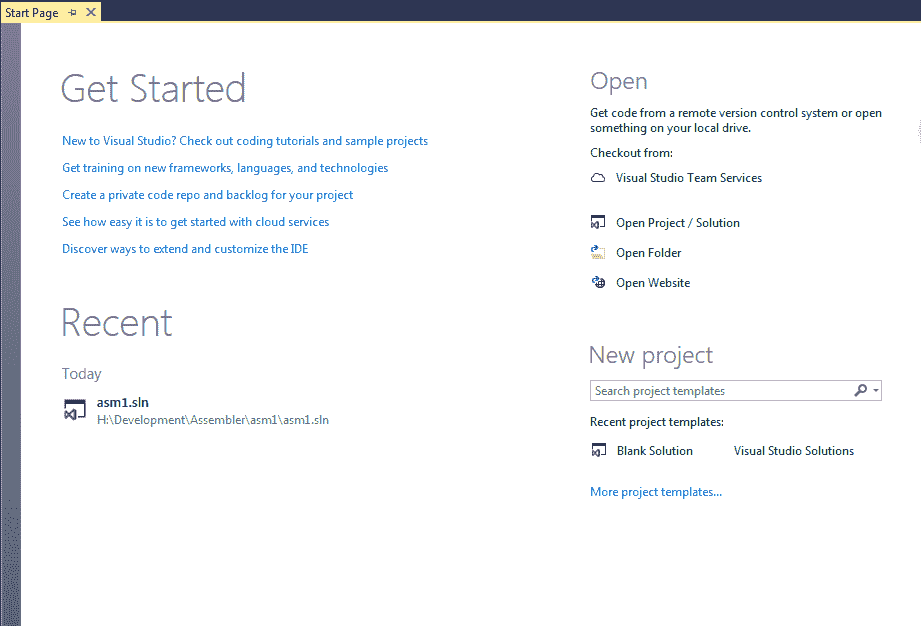

创建空白的 VS2017 解决方案

查看开始页面窗口的右下角，你会看到创建空白解决方案的选项。如果没有该选项，点击“更多项目模板...”并从中选择“空白解决方案”。

1.  一旦解决方案创建完成，我们可以添加一个新项目。右键点击解决方案的名称，然后选择添加 | 新建项目：

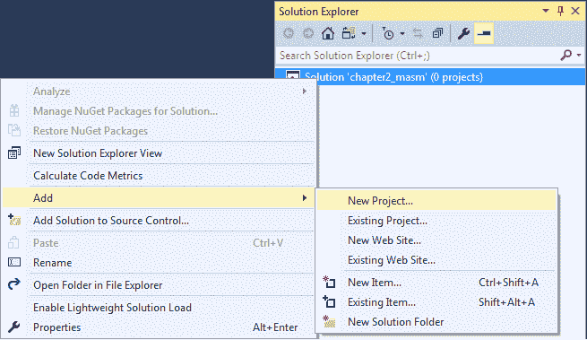

向解决方案添加新项目

由于 Visual Studio 没有内置的汇编项目模板，我们将向解决方案中添加一个空的 C++ 项目：

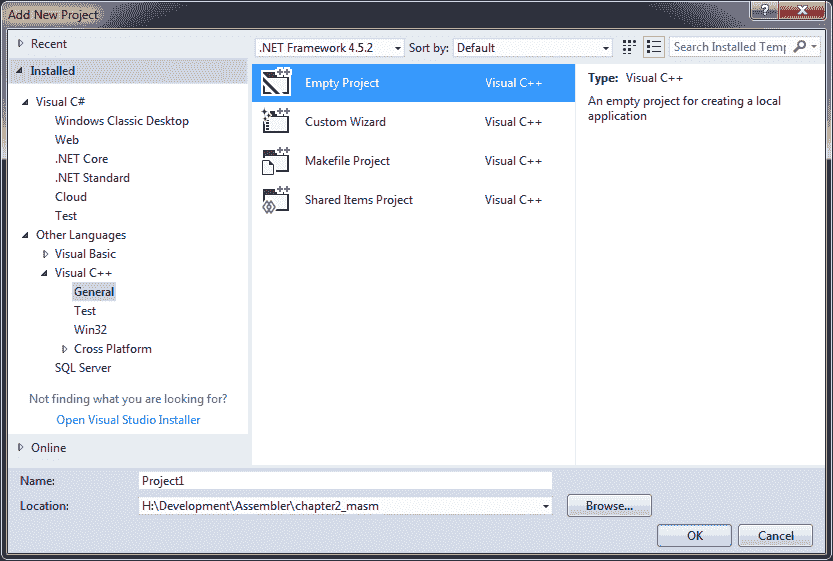

创建一个空项目

1.  选择一个项目名称并点击确定。在我们可以添加源文件之前，还有两件事需要做。更准确地说，我们可以先添加源文件，然后再处理这两件事，因为顺序其实不重要。只需记住，在处理完这些之前，我们是无法构建（或者正确构建）项目的。

1.  第一个需要处理的事情是为项目设置子系统；否则，链接器将无法知道生成哪种可执行文件。

右键点击解决方案资源管理器标签中的项目名称，选择属性。在项目属性窗口中，依次选择配置属性 | 链接器 | 系统，并在子系统下选择 Windows (/SUBSYSTEM:WINDOWS)：

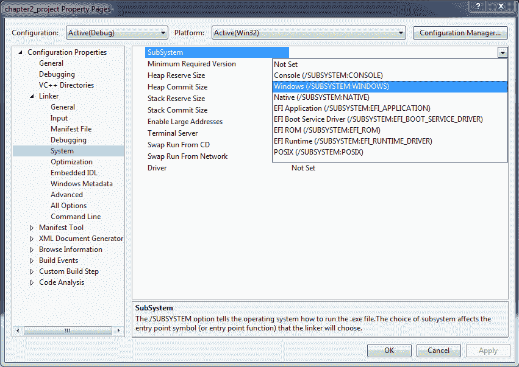

设置目标子系统

1.  下一步是告诉 Visual Studio 这是一个汇编语言项目：

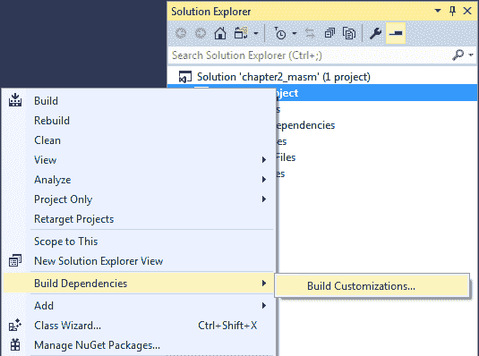

打开“构建自定义”窗口

1.  右键点击项目名称，在上下文菜单中选择构建依赖项，点击构建自定义...，然后在构建自定义窗口中选择 `masm(.targets, .props)`：

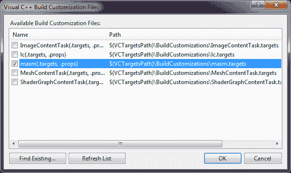

设置适当的目标

1.  现在我们准备好添加第一个汇编源文件了：

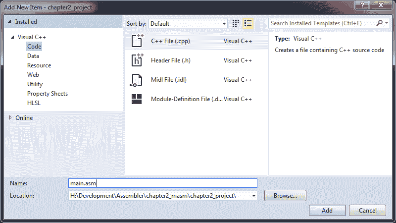

添加新的汇编源文件

不幸的是，Visual Studio 似乎并没有为汇编项目做准备，因此没有内置的汇编文件模板。所以，我们右键点击解决方案资源管理器中的源文件，选择“添加”下的“新建项”，由于没有汇编源文件的模板，我们选择 C++ 文件（.cpp），但将文件名设置为 `.asm` 扩展名。点击添加，瞧！我们的第一个汇编源文件就出现在了 IDE 中。

1.  为了好玩，让我们添加一些代码：

```
        .686
        .model flat, stdcall

        *; this is a comment*
 *; Imported functions*
        ExitProcess proto uExitCode:DWORD
        MessageBoxA proto hWnd:DWORD, lpText:DWORD, lpCaption:DWORD, 
        uType:DWORD

        *; Here we tell assembler what to put into data section*
        .data
            msg db 'Hello from Assembly!', 0
            ti db 'Hello message', 0

        *; and here what to put into code section*
        .code

        *; This is our entry point*
        main PROC
            push 0              *; Prepare the value to return to the* 
 *; operating system*
            push offset msg     *; Pass pointer to MessageBox's text to* 
 *; the show_message() function*
            push offset ti      *; Pass pointer to MessageBox's title to* 
 *; the show_message() function*
            call show_message   *; Call it*

            call ExitProcess    *; and return to the operating system*
        main ENDP

        *; This function's prototype would be:*
 *; void show_message(char* title, char* message);*
        show_message PROC
            push ebp
            mov  ebp, esp
            push eax

            push 0              *; uType*
            mov  eax, [dword ptr ebp + 8]
            push eax            *; lpCaption*
            mov  eax, [dword ptr ebp + 12]
            push eax            *; lpText*
            push 0              *; hWnd*
            call MessageBoxA    *; call MessageBox()*

            pop  eax
            mov  esp, ebp
            pop  ebp
            ret  4 * 2          *; Return and clean the stack*
        show_message ENDP
        END main
```

如果代码目前还没有“跟你说话”，不要担心；我们将在第三章开始熟悉指令和程序结构，*英特尔指令集架构（ISA）*。

现在，让我们构建项目并运行它。代码并不做太多事情，它只是显示一个消息框并终止程序：

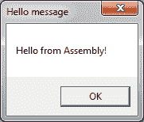

示例输出

到目前为止，我们已经在 Windows 上设置好了 Assembly 开发环境。

# GNU 汇编器（GAS）

GNU 汇编器（GAS），简称 AS，是在 *nix（Unix 和 Linux）平台上使用最广泛的汇编器。虽然它是跨平台的（通过正确版本的 GAS，我们可以为各种平台编译汇编代码，包括 Windows），灵活且功能强大，但它默认使用 AT&T 语法，对于习惯 Intel 语法的人来说，至少可以说有些奇怪。GAS 是自由软件，遵循 GNU 通用公共许可证 v3 发布。

# 安装 GAS

GAS 是作为 `binutils` 包的一部分分发的，但由于它是 GCC（GNU 编译器集合）的默认后端，最好还是安装 GCC。事实上，安装 GCC 而不是仅安装 `binutils` 会稍微简化从汇编代码生成可执行文件的过程，因为 GCC 在链接过程中会自动处理一些任务。尽管 GAS 起源于 *nix 系统，但它也可在 Windows 上使用，可以从 [`sourceforge.net/projects/mingw-w64/`](https://sourceforge.net/projects/mingw-w64/) 下载（只需记得将安装文件夹中的 `bin` 子文件夹添加到 `PATH` 环境变量中）。在 Windows 上的安装过程相当简单，只需按照 GUI 安装向导的步骤进行操作。

对于我们这些使用 Windows 的人，另一个选择是“Windows 上的 Bash”；然而，这只在安装了周年更新或创意者更新的 64 位 Windows 10 上可用。安装 GAS 的步骤与运行 Ubuntu 或 Debian Linux 时的步骤相同。

由于本书面向开发人员，假设你已经在系统上安装了它是可以的，但如果你使用的是*nix 系统，我们还是不做假设，直接安装 GAS。

# 第 1 步 - 安装 GAS

打开你最喜欢的终端模拟器并执行以下命令：

```
sudo apt-get install binutils gcc
```

如果你使用的是基于 Debian 的发行版，或者是基于 RH 的发行版，可以使用以下命令：

```
sudo yum install binutils gcc
```

另外，你也可以使用以下方法：

```
su -c "yum install binutils gcc"
```

# 第 2 步 - 测试一下

准备好之后，让我们在 Linux 上构建我们的第一个汇编程序。创建一个名为`test.S`的汇编源文件。

在*nix 平台上，汇编源文件的扩展名是`.S`或`.s`，而不是`.asm`。

填入以下代码：

```
*/**
 *This is a multiline comment.*
**/*
*// This is a single line comment.*
*# Another single line comment.*

*# The following line is not a necessity.*
   .file "test.S"

*# Tell GAS that we are using an external function.*
   .extern printf

*# Make some data - store message in data section 0*
   .data
msg:
   .ascii "Hello from Assembly language!xaxdx0"

*# Begin the actual code*
   .text
*# Make main() publicly visible*
   .globl main
*/**
 *This is our main() function.* 
 *It is important to mention,* 
 *that we can't begin the program with* 
 *'main()' when using GAS alone. We have then*
 *to begin the program with 'start' or '_start'* 
 *function.*
**/*

main:
   pushl %ebp
   movl %esp, %ebp
   pushl $msg          *# Pass parameter (pointer*
 *# to message) to output_message function.*
   call output_message *# Print the message*
   movl $0, %eax
   leave
   ret

*# This function simply prints out a message to the Terminal*
output_message:
   pushl %ebp
   movl %esp, %ebp
   subl $8, %esp
   movl 8(%ebp), %eax
   movl %eax, (%esp)
   call _printf        *# Here we call printf*
   addl $4, %esp
   movl $0, %eax
   leave
   ret $4
```

如果你在 Windows 上，请在`printf`和`main`前加上下划线（`_`）。

如果你在 Linux 上，可以使用以下命令来构建代码：

```
gcc -o test test.S
```

为了确保这段代码能够在 64 位系统上正确编译，因为它是为 32 位汇编器编写的，你应该安装 32 位工具链和库，并添加`-m32`选项，这告诉 GCC 为 32 位平台生成代码，命令如下：

**`gcc -m32 -o test test.S`**

请参考你所使用的 Linux 发行版的文档，了解如何安装 32 位库。

如果你在 Windows 上，请相应地更改输出的可执行文件名称：

```
gcc -o test.exe test.S
```

在终端运行可执行文件。你应该看到一条消息，后面跟着一个新行：

```
Hello from Assembly language!
```

如你所见，这段汇编源代码的语法不同于 MASM 所支持的语法。MASM 支持所谓的 Intel 语法，而 GAS 最初只支持 AT&T 语法。然而，后来添加了对 Intel 语法的支持，从而大大简化了新手的学习过程。

# Flat Assembler

现在我们已经看到了 MASM 和 GAS 带来的复杂性，无论是语法还是配置的复杂性，我们来看看 Flat Assembler，它是一个免费的、便携的、自编译的汇编器，适用于 Windows 和 Linux，使用 Intel 语法（与 MASM 非常相似，但复杂性更低，更容易理解）。这正是我们需要的工具，可以更轻松、更快速地理解 Intel 汇编语言及其使用。

除了支持各种可执行文件格式（最初是 DOS COM 文件，通过 Windows PE（包括 32 位和 64 位），直到 ELF（包括 32 位和 64 位）），FASM 还有一个非常强大的宏引擎，我们肯定会加以利用。更不用说 FASM 可以轻松集成到现有的开发环境中，适用于更复杂的项目。

# 安装 Flat Assembler

无论你是在 Windows 还是 Linux 上，都可以通过相同的简单方式获取 Flat Assembler：

1.  首先，访问 [`flatassembler.net/download.php`](https://flatassembler.net/download.php) 并选择适合你操作系统的包：

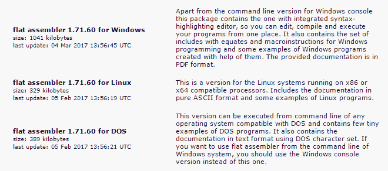

Flat Assembler 下载页面

1.  解压包。Windows 和 Linux 版本的包都包含了 FASM 源码、文档和示例。如我们在以下截图中所见，Windows 版本包含了两个可执行文件：`fasm.exe` 和 `fasmw.exe`。两者之间的唯一区别是，`fasmw.exe` 是 Flat Assembler 的图形界面实现，而 `fasm.exe` 仅支持命令行：

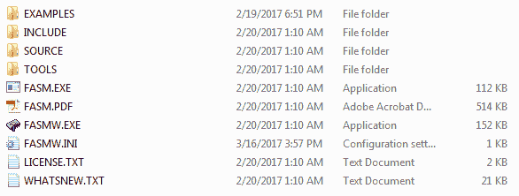

Flat Assembler 包的内容

这两个可执行文件可以从你解压包的目录运行，因为它们没有外部依赖。如果你决定将其移动到其他地方，别忘了将 `INCLUDE` 文件夹和 `FASMW.INI` 文件（如果已经创建的话）一起放入同一目录。如果你复制了 `FASMW.INI` 文件，你需要手动编辑 `[Environment]` 部分下的 `Include` 路径。或者，你可以跳过复制 `FASMW.INI`，因为它会在你第一次启动 `FASMW.EXE` 时自动创建。

Linux 版本缺少图形界面部分，但它仍然包含 `fasm` 源代码、文档和示例：

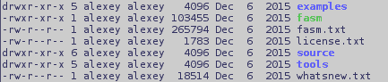

Flat Assembler Linux 版本包的内容

与 Windows 版本一样，Linux 版本的 `fasm` 可执行文件没有外部依赖，可以直接从解压包所在的文件夹运行，但为了方便，最好将其复制到一个更合适的位置，例如 `/usr/local/bin`。

# 第一个 FASM 程序

现在我们已经安装了 Flat Assembler，除非我们为 Windows 或 Linux 构建一个小的测试可执行文件，否则无法继续。很有趣的是，这两个示例可以用相同的汇编器编译，这意味着 Linux 示例也可以在 Windows 上编译，反之亦然。但让我们直接看一下这个示例。

# Windows

如果你使用的是 Windows，启动 `fasmw.exe` 并输入以下代码：

```
 include 'win32a.inc'

 format PE GUI
 entry _start

 section '.text' code readable executable
 _start:
    push 0
    push 0
    push title
    push message
    push 0
    call [MessageBox]
    call [ExitProcess]

 section '.data' data readable writeable
    message db 'Hello from FASM!', 0x00
    title db 'Hello!', 0x00

 section '.idata' import data readable writeable
 library kernel, 'kernel32.dll',
         user, 'user32.dll'

 import kernel,\
        ExitProcess, 'ExitProcess'

 import user,\
        MessageBox, 'MessageBoxA'
```

再次提醒，如果你对代码中的内容几乎不理解，也无需担心；接下来的章节会让它变得更清晰。

为了运行前面的代码，进入“运行”菜单并选择“运行”。

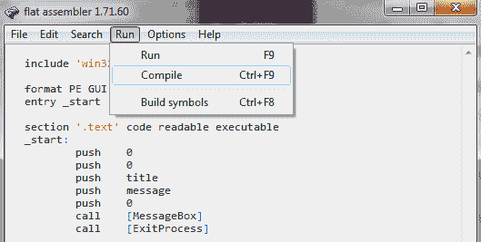

在 FASMW 中编译源代码

欣赏结果几秒钟。

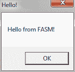

示例输出

# Linux

如果你使用的是 Linux，源代码会更简短。打开你最喜欢的源代码编辑器，无论是 `nano`、`emacs`、`vi` 或其他任何编辑器，并输入以下代码：

```
 format ELF executable 3
 entry _start

 segment readable executable
 _start:
    mov eax, 4
    mov ebx, 1
    mov ecx, message
    mov edx, len
    int 0x80

    xor ebx, ebx
    mov eax, ebx
    inc eax
    int 0x80

 segment readable writeable
    message db 'Hello from FASM on Linux!', 0x0a
    len = $ - message
```

这段代码比在 Windows 上的要紧凑得多，因为我们没有使用任何高级 API 函数；我们宁愿直接使用 Linux 系统调用（在 Windows 上这样做可能会变成一场噩梦）。将文件保存为 `fasm1lin.asm`（这不是 GAS 或 GCC，因此我们可以给汇编源文件使用常规扩展名），然后打开终端模拟器。输入以下命令（假设 `fasm` 可执行文件在 `PATH` 环境变量中提到的地方），以便从这段代码中构建可执行文件：

```
fasm fasm1lin.asm fasm1lin
```

然后，尝试使用以下命令运行该文件：

```
./fasm1lin
```

你应该看到类似这样的内容：

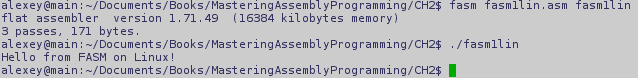

使用平面汇编器构建和运行 Linux 可执行文件

就这么简单。

# 总结

到目前为止，我们已经回顾了三种不同的汇编器：**微软宏汇编器** (**MASM**)，这是 Visual Studio 的一个重要组成部分；**GNU 汇编器** (**GAS**)，这是 GNU 编译器集合（GCC）的默认后端；**平面汇编器** (**FASM**)，这是一个独立的、便携的、灵活的强大汇编器。

尽管我们将使用 FASM，但在某些情况下（而且这些情况确实会发生），我们仍然会参考其他两种汇编器。

有了安装并正常工作的汇编器，我们可以继续进行 第三章，*Intel 指令集架构 (ISA)*，并开始直接使用汇编语言了。前方的路还很长，我们甚至还没有迈出第一步。在 [第三章](https://cdp.packtpub.com/mastering_assembly_programming/wp-admin/post.php?post=52&action=edit&save=save#post_108)，*Intel 指令集架构 (ISA)* 中，我们将深入了解 Intel 处理器的指令集架构，并学习如何为 Windows 和 Linux 编写简单程序，支持 32 位和 64 位。
