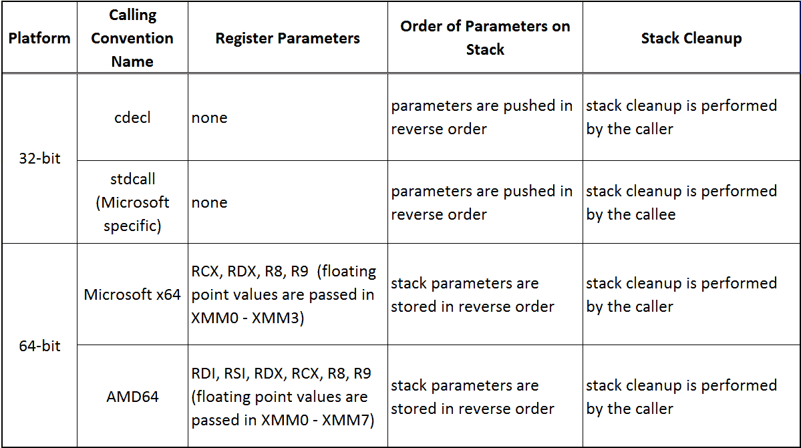

# 第六章：宏指令

使用汇编语言实现你的思想很有趣（我肯定已经说过这个了，而且可能还不止一次）。然而，当涉及到某些操作时，它可能变得相当烦人，因为这些操作必须在程序的不同部分重新实现。一种可能的解决方法是将这些操作实现为一个过程，并在需要时调用它。然而，一旦你有了一个过程，并且它接收超过零个参数，这个方法也可能很快变得令人烦恼。在高级语言中，你只需"传递"参数给一个函数，而在汇编中，你必须根据所选择的调用约定实际将它们传递给一个过程，这反过来可能带来更多的麻烦，尤其是在寄存器管理（如果参数通过特定寄存器传递）或访问栈的过程中。有时候，这种复杂性是值得的，但并非总是如此，尤其是当涉及到一组简短的重复指令时。这正是宏指令可以帮助我们避免许多麻烦和冗余工作的地方，更不用说调用时消耗的 CPU 时间（参数准备、过程的序言和尾声），这些微小的毫秒分数，最终可能会累计成相当可观的延迟。

本章我们将覆盖以下内容：

+   宏指令及其背后的机制

+   宏指令如何参数化

+   学习可变宏指令及其威力

+   了解常见的调用约定

+   审视额外的汇编指令和条件汇编

所有这些对于我们未来与本书的工作至关重要，因为我们将要探讨的方法和算法如果不使用这些方法，将会变得非常繁琐。

# 什么是宏指令？

首先，在我们深入宏指令的世界之前，我们必须了解它们到底是什么。简单来说，宏指令是指令序列的别名。你可能熟悉这个术语，它在高级语言中出现过（我们说"可能"是因为并不是所有高级语言都实现了这一特性），但我们还是会在这里解释一下。记得上一章中的以下序列吗？

```
movd xmm3, [dpy]
movlhps xmm3, xmm3
movsldup xmm3, xmm3
```

这个序列将一个 XMM 寄存器的所有四个单精度浮点数值（在这个特定情况下是 XMM3）从 `dpy` 指向的内存中加载。我们在代码中多次使用了这种序列，因此，将其替换为一个宏指令是非常自然的。这样，定义以下宏将使我们的代码看起来更加优雅和可读：

```
macro load_4 xmmreg, addr
{
   movd xmmreg, [addr]
   movlhps xmmreg, xmmreg
   movsldup xmmreg, xmmreg
}
```

我们在代码中像这样使用它：

```
load_4 xmm3, dpy
load_4 xmm4, pi_2
```

这样会使代码看起来更优雅，也更具可读性。

括号是 FASM 的一个很棒的特性，而在 MASM 和 GAS 中则没有这个特性。相反，在 MASM 中，你将写出如下代码：

`MACRO macro_name`

`; 宏体`

`ENDM`

以及下面这段 GAS 代码：

`.macro macro_name`

`; 宏体`

`` `.endm` ``

# 它是如何工作的

宏指令的逻辑相当简单。预处理器解析代码中的宏指令定义，并将其存储，简而言之，就像一个字典，其中宏指令的名称是键，它的内容是值。当然，实际上更为复杂，因为宏指令可能有（而且大多数情况下都有）参数，更不用说它们可能还是可变的（即具有未定义数量的参数）。

当汇编器处理代码并遇到未知的指令时，它会检查这个字典，以查找具有相应名称的宏指令。一旦找到这样的条目，汇编器就会用其值替换宏指令——即扩展宏。考虑到汇编器看到如下内容：

```
load_4 xmm3, dpy
```

然后，它会参考收集到的宏指令定义，并将这一行替换为实际的代码：

```
movd xmm3, [dpy]
movlhps xmm3, xmm3
movsldup xmm3, xmm3
```

如果汇编器找不到相关的宏定义，错误报告机制会通知我们。

# 带参数的宏指令

虽然你完全可以定义一个不接收任何参数的宏指令，但你很少需要这样做。大多数情况下，你会定义需要至少一个参数的宏指令。以实现过程前言的宏指令为例：

```
macro prolog frameSize
{
   push ebp
   mov  ebp, esp
   sub  esp, frameSize
}
```

上述宏指令中的 `frameSize` 属性是一个宏参数，在此示例中，用于指定栈帧的大小（以字节为单位）。使用此类宏指令的方法如下：

```
my_proc:
   prolog 8
   *; body of the procedure*
   mov esp, ebp
   pop ebp
   ret
```

上述代码在逻辑上等价于（并且会被预处理器展开为）以下内容：

```
my_proc:
   push ebp
   mov  ebp, esp
   sub  esp, 8
   *; body of the procedure*
   mov  esp, ebp
   pop  ebp
   ret
```

此外，我们还可以定义 `return` 宏，它实现栈帧的销毁并从过程返回：

```
macro return
{
   mov   ebp, esp
   pop   ebp
   ret
}
```

这将使我们的过程更加简短：

```
my_proc:
   prolog 8
   *; body of the procedure*
   return
```

这里，`return` 宏也是一个很好的无参数宏指令示例。

# 可变宏指令

在某些情况下，我们不知道同一个宏指令在不同地方被调用时会传递多少个参数，而 FASM 为这样的问题提供了一个非常好且简单的解决方案——支持可变宏指令。术语*可变*意味着一个操作符、过程或宏可以接受不同数量的操作数/参数。

从语法上看，可变宏指令非常简单。我们以宏关键字开始，然后是宏的名称，后跟一个逗号分隔的参数列表（如果有的话）。参数列表中的可变部分用方括号括起来。例如，如果我们有一个宏指令，它扩展为 `printf()` 函数或调用它，并且我们希望它具有类似的声明，那么宏声明会像这样开始：

```
macro printf fmt, [args]
```

这里，`fmt` 代表 `printf()` 函数的格式参数，`args` 表示所有可选的参数。

让我们考虑一个非常简单的`prolog`宏重构例子，除了堆栈帧的大小，它还接收一个寄存器列表，这些寄存器需要在过程体内被修改，因此需要保存在栈上：

```
macro prolog frameSize, [regs]
{
   common
   push  ebp
   mov   ebp, esp
   sub   esp, frameSize
   forward
   push regs
}
```

在这里，你一定注意到了`common`和`forward`关键字，它们对于宏指令展开的正确性至关重要。变参宏指令的一个有趣特点是，它的内容会针对每一个变参（用方括号指定的参数）展开。由于在每次将寄存器（由`regs`参数指定）压入栈之后创建堆栈帧会显得很奇怪，因此我们必须指示预处理器只展开宏指令的特定部分一次，这正是`common`关键字的作用。

`forward`关键字（及其对应的`reverse`关键字）指示预处理器应该按照何种顺序处理变参。`push regs`这一行会展开为`push`指令，针对`regs`中指定的每个参数，前置的`forward`关键字指示预处理器按它们写入的顺序处理参数。例如，考虑以下代码：

```
my_proc:
   prolog 8, ebx, ecx, edx
   *; body of the procedure*
```

这段代码会展开为以下内容：

```
my_proc:
   push ebp
   mov  ebp, esp
   sub  esp, 8
   push ebx
   push ecx
   push edx
```

为了完整性，让我们对`return`宏指令进行适当的修复：

```
macro return [regs]
{
   reverse
   pop  regs
   common
   mov  esp, ebp
   pop  ebp
   ret
}
```

在这里，为了举例，我们使用`reverse`关键字，因为我们指定了应该从栈中以完全相同的顺序恢复寄存器，这些寄存器在传递给`prolog`宏指令时的顺序。然后，过程会像这样：

```
my_proc:
   prolog 8, ebx, ecx, edx
   *; body of the function*
   return ebx, ecx, edx
```

# 调用约定简介

在编写汇编语言代码时，调用过程时最好遵循一定的调用约定（参数传递给过程的方式），因为首先，这样可以最小化烦人的且难以查找的错误的发生，当然，也能帮助你将汇编模块与高级语言链接起来。对于 Intel 架构来说，有很多种调用约定，但我们只会考虑其中一些，稍后将在本书中使用。

我们已经了解了过程，并且在上一章中提到过“调用约定”这一术语，因此你可能会想，为什么现在才介绍这一机制。答案很简单——调用过程是一个需要某些准备的过程，而这些准备在每次过程调用时都应该是相同的，因此显然可以将这些准备以宏指令的形式实现。

首先，让我们看看本章中我们将涵盖的调用约定：



# cdecl（32 位）

`cdecl` 调用约定是 C 和 C++高级语言中的标准约定。参数存储在栈上，最右边的参数首先压入栈中，最左边的参数最后压入栈中。恢复栈是调用者的责任，调用者在控制权返回时需要恢复栈。

模拟 `cdecl` 调用过程的最简单宏如下：

```
macro ccall procName, [args]
{
   common
   a = 0
   if ~args eq
      forward
      a = a + 4
      reverse 
      push args
   end if
   common
   call procName
   if a > 0
      add  esp, a
   end if
}
```

这里的 `if` 语句是自解释的；不过，你可以暂时忽略它们，因为它们将在本章稍后部分进行讲解。

# stdcall（32 位）

`stdcall` 调用约定几乎与 `cdecl` 相同，参数以相同的方式传递到栈中——最右边的参数最先被压入栈中，最左边的参数最后被压入栈中。唯一的区别是调用者无需处理栈的清理：

```
macro stdcall procName, [args]
{
   if ~args eq
      reverse 
      push args
   end if
   common
   call procName
}
```

让我们考虑一个同时使用两种调用约定的简单示例：

```
cdecl_proc:
   push ebp
   mov  ebp, esp
   *; body of the procedure*
   mov  esp, ebp
   pop  ebp,
   ret

stdcall_proc:
   push ebp
   mov  ebp, esp
   *; body of the procedure*
   mov  esp, ebp
   pop  ebp
   ret  8                  *; Increments the stack pointer by 8 bytes after*
 *; return, thus releasing the space occupied* 
 *; by procedure parameters*

main:
   ccall  cdecl_proc, 128  *; 128 is a numeric parameter passed to* 
 *; the procedure*
   stdcall stdcall_proc, 128, 32
```

虽然 `cdecl_proc` 和 `stdcall_proc` 过程都很清楚，但让我们更仔细地看一下 `main` 过程展开后的情况：

```
main:
   push 128
   call cdecl_proc
   add  esp, 4
   *;*
   push 32
   push 128
   call stdcall_proc
```

在前面的示例中，`stdcall` 宏调用还展示了当有多个参数时发生的情况——最右边的参数最先被压入栈中。这种机制使得在函数内部更容易、更直观地访问参数。鉴于栈帧的性质，我们可以这样访问它们：

```
mov  eax, [ebp + 8]  *; Would load EAX with 128*
mov  eax, [ebp + 12] *; Would load EAX with 32*
```

我们使用 EBP 寄存器作为基指针。第一个（最左边的）参数位于 EBP 存储值偏移量`8`的位置，因为过程的返回地址和先前压入的 EBP 寄存器值正好占用了 8 个字节。下表展示了栈帧创建后的栈内容：

| **从 EBP 偏移量** | **内容** |
| --- | --- |
| +12 | 最右边的参数（32） |
| +8 | 最左边的参数（128） |
| +4 | 过程返回地址 |
| EBP 指向此处 | EBP 的上一个值 |
| -4 | 第一个栈帧变量 |
| .... | 其他栈帧变量 |
| .... | 保存的寄存器 |
| ESP 指向此处 | 当前栈位置 |

# Microsoft x64（64 位）

Microsoft 在 64 位模式（长模式）下使用自己的调用约定，通过混合寄存器/栈的方式传递过程参数。这意味着只有前四个参数可以通过寄存器传递，其余的（如果有的话）应该压入栈中。以下表格展示了哪些寄存器被使用以及如何使用：

| **参数索引** **（从零开始）** | **整数/指针** | **浮点数** |
| --- | --- | --- |
| 0 | RCX | XMM0 |
| 1 | RDX | XMM1 |
| 2 | R8 | XMM2 |
| 3 | R9 | XMM3 |

所有这些看起来很清楚，但我们需要特别注意两点：

+   栈必须在 16 字节边界上对齐

+   栈上需要 32 字节的影像空间——32 字节用于存放最后压入栈的参数（如果有的话）和返回地址之间的空间

以下宏指令（`ms64_call`）是简化版的实现，它是这一调用约定的原始实现。此特定宏不支持堆栈参数：

```
macro ms64_call procName, [args]
{
   a = 0
   if ~args eq
      forward
      if a = 0
         push rcx
         mov rcx, args
      else if a = 1
         push rdx
         mov rdx, args
      else if a = 2
         push r8
         mov r8, args
      else if a = 3
         push r9
         mov r9, args
      else
         display "This macro only supports up to 4 parameters!",10,13
         exit
      end if
      a = a + 1
      end if
   common
   sub rsp, 32            *; Allocate shadow space*
   call procName          *; Call procedure*
   add rsp, 32            *; Free shadow space*
   forward
   if ~args eq
      if a = 4
         pop r9
      else if a = 3
         pop r8
      else if a = 2
         pop rdx
      else if a = 1
         pop rcx
      end if
      a = a - 1
   end if
}
```

考虑一个调用 64 位代码中标记为 `my_proc` 的过程的示例，使用 Microsoft x64 调用约定：

```
ms64_call my_proc, 128, 32
```

这样的宏指令将被扩展为以下内容：

```
push rcx         *;Save RCX register on stack*
mov  rcx, 128    *;Load it with the first parameter*
push rdx         *;Save RDX register on stack*
mov  rdx, 32     *;Load it with the second parameter*
sub  rsp, 32     *;Create 32 bytes shadow space*
call my_proc     *;Call the my_proc procedure*
add  rsp, 32     *;Destroy shadow space*
pop  rdx         *;Restore RDX register*
pop  rcx         *;Restore RCX register*
```

# AMD64（64 位）

默认情况下，64 位类 Unix 系统使用 AMD64 调用约定。它的理念非常相似，只是使用了不同的寄存器集合，并且没有阴影空间的要求。另一个区别是，AMD64 调用约定允许通过寄存器传递最多 6 个整数参数和最多 8 个浮点值：

| **参数索引** **（从零开始）** | **整数/指针** | **浮点数** |
| --- | --- | --- |
| 0 | RDI | XMM0 |
| 1 | RSI | XMM1 |
| 2 | RDX | XMM2 |
| 3 | RCX | XMM3 |
| 4 | R8 | XMM4 |
| 5 | R9 | XMM5 |
| 6 | 在堆栈上 | XMM6 |
| 7 | 在堆栈上 | XMM7 |

以下宏指令是这种机制的原始实现。就像在微软 x64 示例中一样，这个实现也不处理堆栈参数：

```
macro amd64_call procName, [args]
{
   a = 0
   if ~args eq
      forward
      if a = 0
         push rdi
         mov rdi, args
      else if a = 1
         push rsi
         mov rsi, args
      else if a = 2
         push rdx
         mov rdx, args
      else if a = 3
         push rcx
         mov rcx, args
      else if a = 4
         push r8
         mov r8, args
      else if a = 5
         push r9
         mov r9, args
      else
         display "This macro only supports up to 4 parameters", 10, 13
         exit
      end if
      a = a + 1
   end if
   common
   call procName
   forward
   if ~args eq
      if a = 6
         pop r9
      else if a = 5
         pop r8
      else if a = 4
         pop rcx
      else if a = 3
         pop rdx
      else if a = 2
         pop rsi
      else if a = 1
         pop rdi
      end if
      a = a - 1
   end if
} 
```

使用这样的宏，在面向类 Unix 系统的 64 位代码中调用过程 `my_proc`，例如：

```
amd64_call my_proc, 128, 32
```

将其扩展为：

```
push rdi       *;Store RDI register on stack*
mov  rdi, 128  *;Load it with the first parameter*
push rsi       *;Store RSI register on stack*
mov  rsi, 32   *;Load it with the second parameter*
call my_proc   *;Call the my_proc procedure*
pop  rsi       *;Restore RSI register*
pop  rdi       *;Restore RDI register*
```

# 关于 Flat Assembler 宏功能的说明

Flat Assembler 相对于其他汇编器在英特尔平台上的一个巨大优势是其宏引擎。除了能够执行其原始任务——用宏指令的定义替换宏指令——它还能够执行相对复杂的计算，我敢称之为一种额外的编程语言。前面的示例仅仅展示了 FASM 宏处理器能力的极小一部分。虽然我们只用了 `if` 条件语句和一个变量，但在必要情况下，我们可以使用循环（`while` 或 `repeat` 语句）。例如，假设你有一串字符需要保持加密状态：

```
my_string  db 'This string will be encrypted',0x0d, 0x0a, 0x00
my_string_len = $ - my_string
```

在这里，`my_string_len` 是字符串的长度。

`$` 是一个特殊符号，表示当前地址。因此，`$-my_string` 表示当前地址减去 `my_string` 的地址，这就是字符串的长度。

可以通过一个简单的四行宏实现简化的 XOR 加密：

```
repeat my_string_len
   load b byte from my_string + % - 1
   store byte b xor 0x5a at my_string + % - 1
end repeat
```

这里的 `%` 符号表示当前的迭代，而 `-1` 的值是必需的，因为迭代计数从 1 开始。

这是 FASM 宏引擎能够执行的一个简短且原始的示例，实际上它的功能远不止此。然而，尽管本书主要使用 FASM 作为汇编语言，但它专注于英特尔汇编语言，而非特定方言，因此这些额外的信息超出了本书的范围。我强烈建议您参考[FASM 文档](http://flatassembler.net)。

# MASM 和 GAS 中的宏指令

尽管宏指令机制背后的核心思想在所有汇编器中都是相同的，但宏指令的语法和引擎的功能有所不同。以下是 MASM 和 GAS 的两个简单宏示例。

# Microsoft Macro Assembler

记得我们在第二章中的测试程序，*设置开发

环境*? 我们可以用以下宏指令替换调用`show_message`过程的代码：

```
MSHOW_MESSAGE MACRO title, message ;macro_name MACRO parameters
   push message
   push title
   call show_message
ENDM
```

这可能使代码更具可读性，因为我们可以通过以下方式调用`show_message`过程：

```
MSHOW_MESSAGE offset ti, offset msg
```

# GNU 汇编器

GNU 汇编器的宏引擎与微软 MASM 的宏引擎非常相似，但有一些语法差异（不考虑整体语法差异）是我们需要注意的。我们以[第二章](https://cdp.packtpub.com/mastering_assembly_programming/wp-admin/post.php?post=221&action=edit#post_52)中的 Linux 测试程序中的`output_message`过程为例，*设置开发

环境*，并将`printf()`调用替换为一个简单的宏来演示。

```
.macro print message       *; .macro macro_name parameter*
   pushl \message          *; Put the parameter on stack*
                           *; parameters are prefixed with '\'*
   call  printf            *; Call printf() library function*
   add   $4, %esp          *; Restore stack after cdecl function call*
.endm

output_message:
   pushl %ebp
   movl  %esp, %ebp
   print 8(%ebp)           *; This line would expand to the above macro*
   movl  $0, %eax
   leave
   ret   $4
```

# 其他汇编指令（FASM 特定）

到目前为止，我们大多认为宏指令是一种替代过程调用的方式，尽管我认为更准确的说法是它们是简化代码编写和维护的便捷工具。在本章的这一部分，我们将看到一些所谓的内置宏指令——汇编指令——它们大致可以分为三类：

+   条件汇编

+   重复指令

+   包含指令

根据汇编器的实现，可能还会有其他类别。你应该参考你正在使用的汇编器的文档，获取更多信息。

# 条件汇编

有时我们可能希望宏指令或代码片段根据特定条件进行不同的汇编。MASM 和 GAS 也提供了这一功能，但让我们回到 FASM（作为最方便的选择），考虑以下宏指令：

```
macro exordd p1, p2
{
   if ~p1 in <eax, ebx, ecx, edx, esi, edi, ebp, esp> &\
      ~p2 in <eax, ebx, ecx, edx, esi, edi, ebp, esp>
      push eax
      mov  eax, [p2]
      xor [p1], eax
      pop  eax
   else
      if ~p1 in <eax, ebx, ecx, edx, esi, edi, ebp, esp>
         xor [p1], p2
      else if ~p2 in <eax, ebx, ecx, edx, esi, edi, ebp, esp>
         xor p1, [p2]
      else
         xor p1, p2
      end if
   end if
}
```

起初看起来可能有点复杂，但宏的目的其实很简单。我们扩展了一个 XOR 指令，以便可以指定两个内存位置作为操作数，这是原始指令无法做到的。为了简化，我们只对双字值进行操作。

开始时，我们检查两个参数是否都是内存位置的标签，如果是，我们从其中一个加载值到寄存器，并执行 XOR 操作，就像第一个操作数是内存位置，第二个操作数是寄存器时一样。

如果此条件不为真，我们将进入宏指令的第二部分，根据第一个操作数是内存位置还是第二个操作数，或者它们是否都是通用寄存器，执行适当的 XOR 操作。

作为一个例子，假设我们有两个变量，分别为`my_var1`和`my_var2`，它们的值分别是`0xCAFECAFE`和`0x02010201`，并通过异或交换它们：

```
exordd my_var1, my_var2   *; a = a xor b*
mov    ebx, [my_var2]
exordd ebx, my_var1       *; b = b xor a*
mov    [my_var2], ebx
exordd my_var1, ebx       *; a = a xor b* 
exordd ebx, ebx           *; Reset EBX register for extra fun*
```

一旦处理完成，上述代码将扩展为：

```
push eax                 *; exordd my_var1, my_var2*
mov  eax, [my_var2]
xor  [my_var1], eax
pop  eax
mov  ebx, [my_var2]
xor  ebx, [my_var1]      *; exordd ebx, my_var1*
mov  [my_var2], ebx
xor  [my_var1], ebx      *; exordd [my_var1], ebx*
xor  ebx, ebx            *; exordd ebx, ebx*
```

如我们所见，`exordd`宏指令的展开方式取决于它的参数。

# 重复指令

有时可能需要重复相同的代码块，可能只会有些微的差异，甚至没有任何差异。汇编器有一些指令（有时称为内建宏指令），可以精确实现这一点。所有三种汇编器——FASM、MASM 和 GAS——都有三种常见的此类指令：

+   `rept count`：`rept`指令后跟`count`参数，简单地复制`count`次代码块中的内容。对于 Flat Assembler，我们可以声明第二个参数，它将等于当前迭代次数（从 1 开始）。例如，以下代码：

```
hex_chars:
rept 10 cnt {db '0' + cnt - 1}
rept 6  cnt {db 'A' + cnt - 1}
```

这将生成一个名为`hex_chars`的十六进制字符数组，等同于：

```
hex_chars db "0123456789ABCDEF"
```

+   `irp arg, a, b, c, ...`：`irp`指令后跟一个参数和一系列参数列表。参数（此处为`arg`）在每次迭代时代表一个单独的参数。例如，以下代码：

```
irp reg, eax, ebx, ecx {inc reg}
```

按顺序递增寄存器 EAX、EBX，然后是 ECX。

+   `**irps arg, a b c ...**`：`irps`指令与`irp`相同，区别在于参数列表中不使用逗号分隔。

# 包含指令

在前几章中，我们几乎没有触及的两条指令，看起来非常有用。这些指令是：

+   `include 'filename'`

+   `file 'filename'`

# 包含指令

`include`指令的语法非常简单。它由指令本身后跟一个带引号的源文件名，表示我们要包含的文件。从逻辑上讲，它的操作类似于 C 或 C++中的`#include`关键字。在汇编编程中，事情并不总是那么简单，分割代码到多个源文件是一个很好的主意（例如，将所有宏指令定义放到一个单独的文件中），然后通过包含将它们组合到主源代码中。

# 文件指令

尽管在语法上，`include`和`file`指令是相似的，且都可以将一个文件包含到源代码处理当中，但在逻辑上它们非常不同。与`include`指令不同，`file`指令不会对被包含的文件进行任何处理。这使得将二进制数据包含到数据段或其他需要的地方成为可能。

# 概要

在本章中，我们简要介绍了汇编语言编程中宏指令的众多功能。不幸的是，可能需要一本完整的书籍来讨论宏指令的所有应用，尤其是当涉及到 Flat Assembler 时，它具有一个非常强大的预处理器。

一个来自我自身实践的例子：我曾经需要实现一个经过高度混淆的 AES128 解密算法版本，总共写了 2175 行，只有少数几个程序，而其中几乎一半（1064 行）被不同宏指令的定义所占据。正如你可以合理推测的那样，约 30%到 60%的每个程序都包含了宏指令的调用。

在下一章，我们将继续深入探讨预处理器，并处理不同的数据结构，以及其创建和管理方法。
