# 第八章：混合使用用汇编语言编写的模块和用高级语言编写的模块

我们已经走了很长一段路，几乎涵盖了汇编语言编程基础的各个方面。事实上，到目前为止，我们应该能够用汇编语言实现任何算法；然而，还有一些重要的内容我们尚未涉及，但这些内容同样重要。

尽管在产品开发的时间表上，用汇编语言编写较大部分（甚至是整个产品）可能不是最佳选择，但它仍然是一个非常有趣且具有挑战性的任务（也具有教育意义）。有时，使用汇编语言实现某些算法的部分，可能比使用高级语言更为方便。还记得我们用来进行异或加密的微型虚拟机吗？为了举例说明，我们将在汇编语言中实现一个简单的加密/解密模块，并看看它如何与高级语言一起使用。

在本章中，我们将涵盖以下主题：

+   实现一个简单的加密模块核心

+   为进一步与高级语言编写的代码进行链接，构建目标文件：

    +   **OBJ**：适用于 Windows 的目标文件（32 位和 64 位）；

    +   **O**：适用于 Linux 的可链接 ELF（32 位和 64 位）；

+   为 Windows 和 Linux（32 位和 64 位）构建 DLL（动态链接库）和 SO（共享对象），以便在.NET 平台上使用

# 加密核心

本章的主要项目是一个完全用汇编语言编写的小型简单（不能说是原始的）加密/解密模块。由于本章的主题是汇编语言模块与高级语言模块的接口，我们不会深入讨论加密原理，而是将重点放在代码的可移植性和互操作性上，同时使用稍微修改过的异或算法。该算法的基本思想是接收一个字节数组并执行以下操作：

1.  获取一个字节，并将其左移指定的位数（计数器在编译时随机生成）。

1.  用 1 字节的密钥（在编译时随机生成）对结果进行异或操作。

1.  将字节写回数组。

1.  如果有更多字节需要加密，回到步骤 1；否则跳出循环。

以下截图是我们即将实现的算法的一个输出示例：

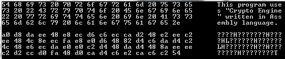

这不是最好的加密方式，但对于我们的需求来说绝对足够。

# 可移植性

我们的目标是编写可以在 32 位和 64 位 Windows 以及 Linux 平台上使用的可移植代码。这个目标可能听起来不可能实现，或者是非常繁琐的工作，但其实非常简单。首先，我们需要定义一些常量和宏，这将使我们的后续工作更加轻松，所以让我们从创建`platform.inc`和`crypto.asm`源文件开始，其中后者是主要的源文件，也是我们将要编译的文件。

Flat Assembler 能够生成多种格式的文件，从原始二进制输出和 DOS 可执行文件，到 Windows 特定格式，再到 Linux 二进制文件（包括可执行文件和对象文件）。假设你至少熟悉以下几种格式：

+   32 位 Windows 对象文件（MS COFF 格式）

+   64 位 Windows 对象文件（MS64 COFF 格式）

+   32 位 Windows DLL

+   64 位 Windows DLL

+   32 位 Linux 对象文件（ELF）

+   64 位 Linux 对象文件（ELF64）

不需要深入了解它们，因为 Flat Assembler 为我们完成了所有繁重的工作，我们所要做的就是告诉它我们感兴趣的格式（并相应地格式化我们的代码）。我们将使用一个编译时变量`ACTIVE_TARGET`进行条件编译，并使用以下常量作为可能的值：

```
; Put this in the beginning of 'platform.inc'

type_dll       equ 0
type_obj       equ 1

platform_w32   equ 2
platform_w64   equ 4
platform_l32   equ 8
platform_l64   equ 16

TARGET_W32_DLL equ platform_w32 or type_dll
TARGET_W32_OBJ equ platform_w32 or type_obj
TARGET_W64_DLL equ platform_w64 or type_dll
TARGET_W64_OBJ equ platform_w64 or type_obj
TARGET_L32_O   equ platform_l32 or type_obj
TARGET_L64_O   equ platform_l64 or type_obj
```

# 指定输出格式

和往常一样，主源文件（在我们这个例子中是`crypto.asm`）应该以输出格式规范开始，从而告诉汇编器在创建输出文件时如何处理代码和段。正如我们之前提到的，编译时变量`ACTIVE_TARGET`将用于选择汇编器处理的正确代码。

下一步将是定义一个宏，该宏将有条件地生成正确的代码序列。我们将其命名为`set_output_format`：

```
macro set_output_format
{
   if ACTIVE_TARGET = TARGET_W32_DLL
      include 'win32a.inc'
      format PE DLL
      entry DllMain

   else if ACTIVE_TARGET = TARGET_W32_OBJ
      format MS COFF

   else if ACTIVE_TARGET = TARGET_W64_DLL
      include 'win64a.inc'
      format PE64 DLL
      entry DllMain

   else if ACTIVE_TARGET = TARGET_W64_OBJ
      format MS64 COFF

   else if ACTIVE_TARGET = TARGET_L32_O
      format ELF

   else if ACTIVE_TARGET = TARGET_L64_O
      format ELF64
   end if
}
```

这个宏会告诉汇编器评估`ACTIVE_TARGET`编译时变量，并且只使用特定的代码。例如，当`ACTIVE_TARGET`等于`TARGET_W64_OBJ`时，汇编器将只处理以下行：

```
format MS64 COFF
```

因此，它将生成一个 64 位 Windows 对象文件。

# 条件声明代码和数据段

在告诉编译器我们期待什么输出格式后，我们需要声明各个段。由于我们在编写可移植代码，因此我们将使用两个宏来为前面提到的每种格式正确声明代码段和数据段。由于我们习惯在代码段后看到数据段（至少在本书中是这样，顺序可能会有所不同），我们将首先声明一个宏，负责正确声明代码段的开始：

```
macro begin_code_section
{
   if ACTIVE_TARGET = TARGET_W32_DLL
      section '.text' code readable executable
    *; This is not obligatory, but nice to have - the DllMain procedure*
    DllMain:
      xor eax, eax
      inc eax
      ret 4 * 3

   else if ACTIVE_TARGET = TARGET_W32_OBJ
      section '.text' code readable executable

   else if ACTIVE_TARGET = TARGET_W64_DLL
      section '.text' code readable executable
    *; DllMain procedure for 64-bit Windows DLL*
    DllMain:
      xor rax, rax
      inc eax
      ret

   else if ACTIVE_TARGET = TARGET_W64_OBJ
      section '.text' code readable executable

   else if ACTIVE_TARGET = TARGET_L32_O
      section '.text' executable

   else if ACTIVE_TARGET = TARGET_L64_O
      section '.text' executable

   end if
}
```

我们接下来会声明数据段的宏：

```
macro begin_data_section
{
   if ACTIVE_TARGET = TARGET_W32_DLL
      section '.data' data readable writeable

   else if ACTIVE_TARGET = TARGET_W32_OBJ
      section '.data' data readable writeable

   else if ACTIVE_TARGET = TARGET_W64_DLL
      section '.data' data readable writeable

   else if ACTIVE_TARGET = TARGET_W64_OBJ
      section '.data' data readable writeable align 16

   else if ACTIVE_TARGET = TARGET_L32_O
      section '.data' writeable

   else if ACTIVE_TARGET = TARGET_L64_O
      section '.data' writeable

   end if
}
```

# 导出符号

系列中的最后一个宏将使得某些符号得以导出。我们实现的加密核心将只导出一个符号——`GetPointers()`过程——它将返回一个指向结构的指针，结构包含指向其他过程的指针。这个宏遵循之前定义的模式：

```
*; In this specific case, when the macro would be called* 
*; at the end of the source, we may replace the*
*; "macro finalize" declaration with the "postpone" directive.*
macro finalize
{
   if ACTIVE_TARGET = TARGET_W32_DLL
      section '.edata' export data readable
         export 'MA_CRYPTO.DLL',\
            GetPointers, 'GetPointers'

   else if ACTIVE_TARGET = TARGET_W32_OBJ
      public GetPointers as '_GetPointers'

   else if ACTIVE_TARGET = TARGET_W64_DLL
      section '.edata' export data readable
         export 'MA_CRYPTO.DLL',\
            GetPointers, 'GetPointers'

   else if ACTIVE_TARGET = TARGET_W64_OBJ
      public GetPointers as 'GetPointers'

   else if ACTIVE_TARGET = TARGET_L32_O
      public GetPointers as 'GetPointers' 

   else if ACTIVE_TARGET = TARGET_L64_O
      public GetPointers as 'GetPointers'

   end if
}
```

上面的宏会使符号对静态或动态链接器可见，具体取决于我们正在构建的目标。或者，我们可以用`postpone`指令替换`macro finalize`，这将强制在源文件结束时自动执行宏体。

现在我们可以保存`platform.inc`文件，因为我们在未来不会以任何方式修改它。

# 核心过程

在处理了所有输出格式的细节后，我们可以安全地继续实现核心代码。正如之前提到的，我们只需导出一个入口；但我们仍需实现其他部分。我们的核心中只有四个过程：

+   `f_set_data_pointer`：此过程接受一个参数，即指向我们要处理的数据的指针，并将其存储到`data_pointer`全局变量中

+   `f_set_data_length`：此过程接受一个参数，即我们要加密/解密的数据长度，并将其存储到`data_length`全局变量中

+   `f_encrypt`：此过程实现了加密循环

+   `f_decrypt`：这是`f_encrypt`的反操作

然而，在实现这些之前，我们首先需要准备模板，或者更准确地说，为我们的主源文件准备一个框架。由于宏指令的广泛使用，这个模板看起来与我们习惯的稍有不同。但不要让它让你困惑，从结构上来说（从汇编语言工程师的角度看）它与我们之前处理的结构是相同的：

```
*; First of all we need to include all that we have written this far*
include 'platform.inc'

*; The following variable and macro are used in compile time 
; only for generation of* *pseudorandom sequences, where 
; count specifies the amount of pseudorandom bytes to* *generate*
seed = %t
macro fill_random count
{
   local a, b
   a = 0
   while a < count
      seed = ((seed shr 11) xor (seed * 12543)) and 0xffffffff
      b = seed and 0xff
      db   b
      a = a + 1
   end while
}

*; ACTIVE_TARGET variable may be set to any of the 
; TARGET* constants*
ACTIVE_TARGET = TARGET_W32_DLL

*; Tell the compiler which type of output is expected 
; depending on the value of* *the ACTIVE_TARGET variable*
set_output_format

*; Create code section depending on selected target*
begin_code_section

*; We will insert our code here*

*; Create appropriate declaration of the data section*
begin_data_section

   *; Tell the compiler whether we are expecting 32-bit 
   ; or 64-bit output*
   if(ACTIVE_TARGET = TARGET_W32_OBJ) |\ 
     (ACTIVE_TARGET = TARGET_W32_DLL) |\ 
     (ACTIVE_TARGET = TARGET_L32_O)
      use32
   else if(ACTIVE_TARGET = TARGET_W64_OBJ) |\ 
          (ACTIVE_TARGET = TARGET_W64_DLL) |\ 
          (ACTIVE_TARGET = TARGET_L64_O)
      use64
   end if

   *; This, in fact, is a structure which would be populated with 
   ; addresses of our procedures*
   pointers:
   fill_random 4 * 8

   *; Here the core stores the address of the data to be processed*
   data_pointer:
   fill_random 8

   *; And here the core stores its length in bytes*
   data_length:
   fill_random 8

   *; Pseudorandom encryption key*
   key:
   fill_random 2

*; The following line may be omitted if we used the postpone*
*; directive instead of "macro finalize"*
finalize
```

尽管前面的代码看起来与我们通常看到的有所不同，但它其实是自解释的，不需要额外的说明。所有的艰难工作都交给了之前定义的宏指令，唯一需要我们关注的就是位容量。正如你所看到的，大小和地址默认分配了 8 字节。这是为了使它们适应 32 位和 64 位的需求。我们本可以插入另一个`if…else`语句，但由于我们只有 3 个受位容量影响的数据项，在 32 位模式下每个数据项多占用 4 字节也不成问题。

# 加密/解密

由于我们在这里开发的是加密核心，因此自然要先实现加密功能。以下代码根据我们之前定义的算法执行数据加密：

```
f_encrypt:
   *; The if statement below, when the condition is TRUE, forces the assembler to produce*
 *; 32-bit code*
   if (ACTIVE_TARGET = TARGET_W32_OBJ) |\
      (ACTIVE_TARGET = TARGET_W32_DLL) |\
      (ACTIVE_TARGET = TARGET_L32_O)
      push eax ebx esi edi ecx
      lea esi, [data_pointer]
      mov esi, [esi]
      mov edi, esi
      lea ebx, [data_length]
      mov ebx, [ebx]
      lea ecx, [key]
      mov cx, [ecx]
      and cl, 0x07

   *; Encryption loop*
   @@:
      lodsb
      rol al, cl
      xor al, ch
      stosb
      dec ebx
      or ebx, 0
      jnz @b

      pop ecx edi esi ebx eax
      ret

*; In general, we could have omitted the "if" statement here,
; but the assembler*
*; should not generate any code at all, if 
; the value of ACTIVE_TARGET is not valid.*
*; In either case, the following block is processed only
; when we are expecting* *a 64-bit output*
   else if (ACTIVE_TARGET = TARGET_W64_OBJ) |\
           (ACTIVE_TARGET = TARGET_W64_DLL) |\
           (ACTIVE_TARGET = TARGET_L64_O)
      push rax rbx rsi rdi rcx
      lea rsi, [data_pointer]
      mov rsi, [rsi]
      mov rdi, rsi
      lea rbx, [data_length]
      mov ebx, [rbx]
      lea rcx, [key]
      mov cx, [rcx]
      and cl, 0x07

   @@:
      lodsb
      rol al, cl
      xor al, ch
      stosb
      dec rbx
      or rbx, 0
      jnz @b

      pop rcx rdi rsi rbx rax
      ret

   end if 
```

到现在为止，你应该能够自己区分过程的不同部分，看到哪里是前导代码的结束，哪里是尾部代码的开始，以及核心功能所在的位置。在这个特定的案例中，大部分代码都用于保存/恢复寄存器和访问参数/变量，而核心功能可以归结为以下代码：

```
*; Encryption loop*
   @@:
      lodsb
      rol al, cl
      xor al, ch
      stosb
      dec ebx
      or ebx, 0
      jnz @b
```

用于 32 位平台，或者这段代码：

```
@@:
      lodsb
      rol al, cl
      xor al, ch
      stosb
      dec rbx
      or rbx, 0
      jnz @b
```

用于其 64 位平台。

很明显，解密过程的实现将与加密过程几乎完全相同，唯一的变化就是交换旋转和`XOR`指令（当然还需要改变旋转方向）。因此，`f_decrypt`的 32 位版本会是这样的：

```
xor al, ch
ror al, cl
```

同样，它的 64 位版本也只是这两行代码。

# 设置加密/解密参数

正如你可能已经注意到的（希望你已经注意到），上一节讨论的过程完全没有接收任何参数。因此，我们确实需要提供两个额外的过程，以便能够告诉核心数据的位置以及需要处理多少字节。由于每个过程只接受一个参数，代码将更加分段，以便反映所使用的调用约定，在我们的情况下，调用约定如下：

+   适用于 32 位目标的 cdecl

+   适用于基于 Windows 的 64 位目标的 Microsoft x64

+   适用于基于 Linux 的 64 位目标的 AMD64

# f_set_data_pointer

这个过程接收一个 `void*` 类型的参数。当然，汇编器并不关心某个过程期望的参数类型。更准确地说，汇编器作为编译器，并不理解过程参数的概念，更不用说它根本没有过程的概念。让我们看一下 `f_set_data_pointer` 过程的实现：

```
f_set_data_pointer:
   if (ACTIVE_TARGET = TARGET_W32_OBJ) |\
      (ACTIVE_TARGET = TARGET_W32_DLL) |\
      (ACTIVE_TARGET = TARGET_L32_O)
      push eax
      lea eax, [esp + 8]
      push dword [eax]
      pop dword [data_pointer]
      pop eax
      ret

   else if (ACTIVE_TARGET = TARGET_W64_OBJ) |\
           (ACTIVE_TARGET = TARGET_W64_DLL)
      push rax
      lea rax, [data_pointer]
      mov [rax], rcx
      pop rax
      ret

   else if (ACTIVE_TARGET = TARGET_L64_O)
      push rax
      lea rax, [data_pointer]
      mov [rax], rdi
      pop rax
      ret

   end if 
```

这段代码也不复杂。传递给这个过程的参数只是被写入到 `data_pointer` 位置。

# f_set_data_length

这个过程与 `f_set_data_pointer` 完全相同，唯一的区别是参数写入的地址。只需复制前面的代码，并将 `data_pointer` 更改为 `data_length`。

另一种选择是实现一个单一的过程，从而消除冗余代码，它将接受两个参数：

+   实际参数（无论是数据的指针还是其大小），因为汇编器并不关心类型

+   一个选择器，用于告诉过程参数值应存储的位置

尝试自己实现这个；这将是一个很好的快速练习。

# GetPointers()

`GetPointers()` 过程是我们唯一公开的过程，只有这个过程对动态链接器或静态链接器可见，具体取决于选择的输出目标。这个过程的逻辑很原始。它创建一个结构体（在这个例子中，结构体是静态分配的），并用核心过程的地址填充它，最后返回这个结构体的地址：

```
GetPointers:

   if (ACTIVE_TARGET = TARGET_W32_OBJ) |\
      (ACTIVE_TARGET = TARGET_W32_DLL) |\
      (ACTIVE_TARGET = TARGET_L32_O)

      push dword pointers
      pop eax
      mov [eax], dword f_set_data_pointer
      mov [eax + 4], dword f_set_data_length
      mov [eax + 8], dword f_encrypt
      mov [eax + 12], dword f_decrypt
      ret

   else if (ACTIVE_TARGET = TARGET_W64_OBJ) |\
           (ACTIVE_TARGET = TARGET_W64_DLL) |\
           (ACTIVE_TARGET = TARGET_L64_O)

      push rbx
      mov rbx, pointers
      mov rax, rbx
      mov rbx, f_set_data_pointer
      mov [rax], rbx
      mov rbx, f_set_data_length
      mov [rax + 8], rbx
      mov rbx, f_encrypt
      mov [rax + 16], rbx
      mov rbx, f_decrypt
      mov [rax + 24], rbx
      pop rbx
      ret

   end if 
```

一旦所有前面的过程都添加到主源文件中，你可以安全地编译它，并看到所选择的输出格式的输出被生成。如果你在这里指定了目标，你应该能够看到一个 32 位的 Windows DLL 被创建。

# 与 C/C++ 接口

让我利用本章的主题说一说。够了，够了，汇编语言，我们做点 C 语言的东西（对于那些愿意将汇编代码与 C++ 链接的人，这个 C 示例应该很容易理解；如果不理解——那你拿错书了）。作为一个例子，我们将从我们的汇编源文件中生成一个目标文件，并将其与在 C 中编写的代码链接，目标平台包括 32 位和 64 位的 Windows 和 Linux。

# 静态链接 - Visual Studio 2017

首先，让我们看看如何生成目标文件。我相信你已经了解了如何生成不同目标，特别是如何为本例生成目标。我们从 32 位的 MSCOFF 目标文件开始，通过将`ACTIVE_TARGET`变量设置为`TARGET_W32_OBJ`并编译主源文件来实现。

在 Visual Studio 中创建一个 C/C++项目，并将目标文件复制到项目目录中，如以下截图所示（截图显示了 32 位和 64 位的目标文件）：

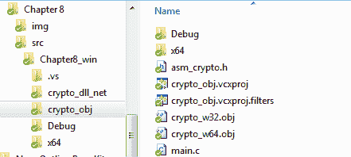

如前面的截图所示，我们还需要至少一个文件，即头文件。由于我们的加密引擎相当简单，所以不需要复杂的头文件。这里显示的这个头文件就足够了：

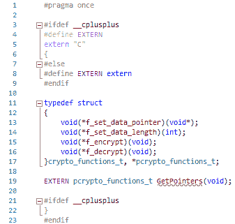

上述代码中有一个小陷阱。在阅读下一个段落之前，尝试找出其中不正确的部分。

从技术上讲，代码是正确的。它会编译并运行没有问题，但在将汇编语言编写的模块与其他语言链接时，有一个非常重要且初看并不明显的方面：结构成员对齐。在这个例子中，我们只使用了一个结构（用于存储过程指针），并且我们小心地处理了它，以确保指针根据平台正确对齐。虽然我们在字节边界上对数据进行了对齐（顺序存储），但 Visual Studio 的默认结构成员对齐值是“默认”，这个值并没有提供太多信息。我们可以做出假设（在这种情况下，我们可以假设“默认”意味着第一种选项，即 1 字节对齐），但这并没有保证，我们必须明确指定对齐方式，因为假设不仅在汇编语言中并不总是有效，而且还会带来严重的风险。需要提到的是，尽管我们在这一段中提到了 Visual Studio，但同样的情况适用于任何 C 编译器。

指定结构成员对齐的一种方式是通过项目设置，如下所示：

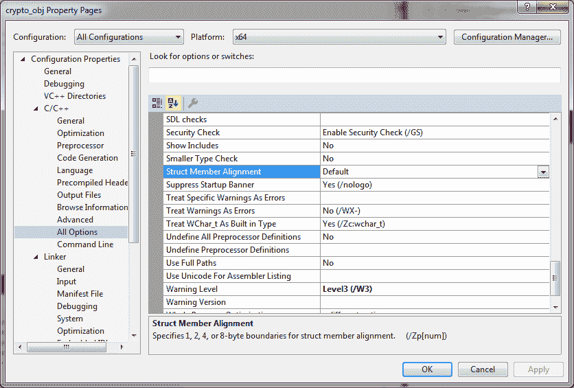

对于我们的例子来说，这已经足够了，但在更大的项目中可能会导致问题。强烈建议在没有合理需求的情况下不要改变整个项目的结构成员对齐方式。相反，我们可以对我们的头文件做一个小修改，告诉编译器如何处理这个特定结构的成员对齐。在`crypto_functions_t`结构声明之前插入以下代码：

```
#ifdef WIN32                   *// For Windows platforms (MSVC)*
#pragma pack(push, 1)          *// set structure member alignment to 1*
#define PACKED                 
#else                          *// Do the same for Unix based platforms* (GCC)
#define PACKED  __attribute__((packed, aligned(1)))  
#endif
```

在声明之后插入以下内容：

```
#ifdef WIN32                   *// For Windows platforms*
#pragma pack(pop)              *// Restore previous alignment settings*
#endif
```

现在，考虑以下这一行：

```
}crypto_functions_t, *pcrypto_functions_t;
```

将前一行更改为：

```
}PACKED crypto_functions_t, *pcrypto_functions_t;
```

然后，按照以下截图所示，添加`main.c`文件：

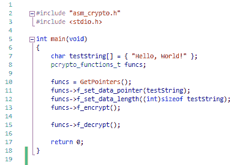

`main.c`文件中的代码不言自明。这里只有两个局部变量；`testString`变量代表我们要处理的数据，`funcs`将存储指向我们加密核心中`pointers`结构的指针。

不要急着构建项目，因为我们还没有告诉 Visual Studio 关于我们的目标文件。右键点击项目，选择“属性”。以下截图展示了如何为 64 位平台项目添加我们的目标文件。32 位项目也应该做同样的操作，只是需要注意将哪个目标文件分配给哪个平台：

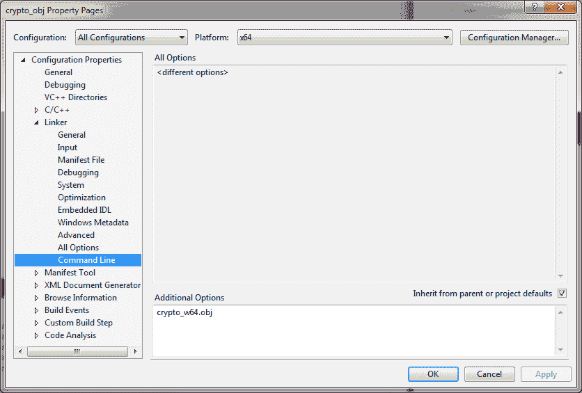

在附带的示例项目中，`crypto_w64.obj`文件用于 x64 平台，`crypto_w32.obj`则用于 x86 平台。

你现在可以自由地构建和运行项目（无论是 x86 还是 x64，只要目标文件正确指定）。我建议你在`main.c`文件的第 13 行和第 15 行设置断点，以便能够观察到`testString`所指向内存的变化。运行时，你会看到类似于以下的内容（之所以说“类似”，是因为每次构建加密核心时，密钥都会不同）：

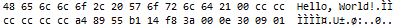

上一截图展示了加密前传入核心的数据。接下来的截图则展示了相同的数据，在加密后状态：

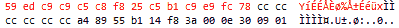

解密这些加密数据将会让我们回到那个熟悉的`Hello, World!`。

# 静态链接 - GCC

在将汇编源代码编译为目标文件并链接到高级语言代码时，Visual Studio 和 GCC 之间并没有太大区别。实际上，坦率地说，我们必须承认，从汇编代码编译出来的目标文件与从高级语言编译出来的目标文件并没有什么不同。对于 GCC 来说，我们有高级语言源代码（C 源代码和头文件，文件无需修改）和两个目标文件，为了方便起见，我们将其命名为`crypto_32.o`和`crypto_64.o`。用于构建可执行文件的命令会略有不同，具体取决于所使用的平台。如果你正在运行 32 位 Linux 系统，则需要执行以下命令，分别构建 32 位和 64 位的可执行文件：

```
gcc -o test32 main.c crypto_32.o gcc -o test64 main.c crypto_64.o -m64
```

第二个命令只有在你安装了 64 位开发工具/库时才能工作。

如果你正在运行 64 位系统，则需要对命令进行轻微修改（并确保安装了 32 位开发工具和库）：

```
gcc -o test32 main.c crypto_32.o -m32
```

以及：

```

gcc -o test64 main.c crypto_64.o
```

在使用 GDB 检查内存内容时，当运行其中一个`testxx`文件时，你将看到类似于以下截图的内容，这是加密前的状态：

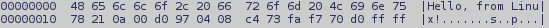

加密后，你将看到类似于以下内容：

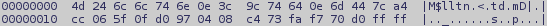

# 动态链接

动态链接意味着使用动态链接库（在 Windows 上）或共享对象（在 Linux 上），其原理与其他 DLL/SO 相同。动态链接的机制将在下一章简要介绍。

然而，我们现在需要构建动态链接库和共享对象，以便能够继续进行。编译 `crypto.asm` 文件时，将 `ACTIVE_TARGET` 编译时变量设置为 `TARGET_W32_DLL`，以生成 Windows 的 32 位 DLL，然后设置为 `TARGET_W64_DLL`，以生成 64 位 DLL。请注意，改变 `ACTIVE_TARGET` 不会影响输出文件的名称，因此我们需要相应地重命名每次编译的结果。

在 Windows 上，你只需改变 `ACTIVE_TARGET` 编译时变量，并通过 GUI 中的“运行 | 编译”选项进行编译（或按 *Ctrl* + *F9* 快捷键），而在 Linux 上，你需要先构建目标文件，然后在终端中输入另一个命令。该命令将是以下之一：

```
*# For 64-bit output on 64-bit machine*
gcc -shared crypto_64.o -o libcrypto_64.so

*# For 64-bit output on 32-bit machine*
gcc -shared crypto_64.o -o libcrypto_64.so -m64

*# For 32-bit output on 64-bit machine*
gcc -shared crypto_32.o -o libcrypto_32.so -m32

*# For 32-bit output on 32-bit machine*
gcc -shared crypto_32.o -o libcrypto_32.so
```

现在我们有了 Windows 的 DLL 和 Linux 的共享对象，可以继续进行，看看如何将用汇编编写的模块与 .NET 等框架进行集成。

# 汇编语言与托管代码

正如我们之前看到的那样，静态或动态链接并不像看起来那样困难，只要我们处理的是本地代码。但当我们决定将用汇编语言编写的代码与用 C# 编写的程序（它是一个托管环境，并不是由处理器直接运行，而是由某种虚拟机运行）结合时，会发生什么呢？许多人害怕混合本地模块和托管模块。将由汇编源代码编译的本地模块与托管代码结合，似乎甚至更可怕或不可能。然而，正如我们之前所见，在二进制层面，最初用汇编语言编写的模块与其他语言编写的模块之间没有区别。当涉及到像 C# 这样的托管代码时，事情变得比链接本地对象文件或使用 DLL/SO 稍微复杂一些。以下内容不适用于托管 C++ 代码，在这种情况下，你可以简单地按照本章前面讨论的步骤，将本地对象与托管代码链接，因为托管 C++ 是 Visual Studio 唯一支持的可以提供这种功能的语言。

然而，对于 C# 来说，我们只能使用 DLL/SO，因为 C# 是一个纯托管环境，无法处理以对象文件形式存在的本地代码。在这种情况下，我们需要一种适配器代码。在我们的示例中，我们将使用一个简单的类，它从 Windows 上的 `crypto_wxx.dll` 或 Linux 上的 `libcrypto_xx.so` 导入核心功能，并通过其方法将这些功能暴露给代码的其他部分。

有一种普遍的误解认为 .NET 平台仅限于 Windows。遗憾的是，这种误解相当普遍。然而，实际上，.NET 平台几乎像 Java 一样具有良好的可移植性，并支持多种平台。不过，我们将重点讨论 Windows（32/64 位）和 Linux（32/64 位）。

# 本地结构与托管结构

当我们尝试将类似于我们核心接口实现的东西与 .NET 等平台结合使用时，首先会遇到的问题是如何在托管代码和本地代码之间传递数据。托管代码和本地代码几乎不可能访问相同的内存区域。这不代表不可能，但绝对不健康，因此我们必须在这两个领域之间传递数据——托管领域和本地领域。幸运的是，.NET 框架中有一个类允许我们相对轻松地执行此类操作——`System.Runtime.InteropServices.Marshal`。由于我们使用的是一个指向包含指向导出过程的指针的结构的指针，因此我们需要实现一个托管结构，用于与我们的 .NET 加密类一起使用，这可以通过一种相当简单的方式完成：

```
*// First of all, we tell the compiler how members of the*
*//struct are stored in memory and alignment thereof*
[StructLayout(LayoutKind.Sequential, Pack=1)]

*// Then we implement the structure itself*
internal struct Funcs
{
   internal IntPtr f_set_data_pointer;
   internal IntPtr f_set_data_length;
   internal IntPtr f_encrypt;
   internal IntPtr f_decrypt;
}
```

前面的代码完美地声明了我们需要的结构类型，我们可以开始实现加密类。尽管 C# 类的实现远远超出了本书的范围，但在这种情况下，似乎适合用几行代码定义方法和委托。

# 从 DLL/SO 导入和函数指针

.NET 中的互操作性是一个有趣的话题，但最好参考专门讨论它的资源。在这里，我们只考虑 .NET 中的函数指针的类比以及动态导入 DLL 和共享对象导出函数的误解。但首先，让我们构建类，导入 `GetPointers()` 过程，并定义函数指针委托：

```
internal class Crypto
{
   Funcs  functions;
   IntPtr buffer;
   byte[] data;

   *// The following two lines make up the properties of the class*
   internal byte[] Data { get { return data; } }
   internal int Length { get { return data.Length; } }

   *// Declare binding for GetPointers()*
 *// The following line is written for 64-bit targets, you should* 
 *// change the file name to crypto_32.so when building for*
 *// 32-bit systems.
   // Change the name to crypto_wXX.dll when on Windows, where XX* 
 *// stands for 32 or 64.*
   [DllImport("crypto_64.so", CallingConvention = CallingConvention.Cdecl)]
   internal static extern IntPtr GetPointers();

   *// Declare delegates (our function pointers)*
   [UnmanagedFunctionPointer(CallingConvention.Cdecl)]
   internal delegate void dSetDataPointer(IntPtr p);

   [UnmanagedFunctionPointer(CallingConvention.Cdecl)]
   internal delegate void dSetDataSize(int s);

   [UnmanagedFunctionPointer(CallingConvention.Cdecl)]
   internal delegate void dEncrypt();

   [UnmanagedFunctionPointer(CallingConvention.Cdecl)]
   internal delegate void dDecrypt();

   *// Constructor*
   internal Crypto()
   {
      *// Luckily when we get a pointer to structure by calling* 
 *// GetPointers() we do not have to do more than just let* 
 *// the framework convert native structure to managed one*
      functions = (Funcs)Marshal.PtrToStructure(
         GetPointers(), 
         typeof(Funcs));

      *// Set initial buffer ptr*
      buffer = IntPtr.Zero;
   }

   *// SetDataPointer() method is the most complex one in our class,* 
 *// as it includes invocation of SetDataLength()*
   internal void SetDataPointer(byte[] p)
   {
      *// If an unmanaged buffer has been previously allocated,*
 *// then we need to free it first.*
      if(IntPtr.Zero != buffer)
         Marshal.FreeHGlobal(buffer);
      buffer = Marshal.AllocHGlobal(p.Length);

      *// Copy data to both the local storage and unmanaged buffer*
      data = new byte[p.Length];
      Array.Copy(p, data, p.Length);
      Marshal.Copy(p, 0, buffer, p.Length);

      *// Call f_set_data_pointer with a pointer to unmanaged buffer*
      ((dSetDataPointer) Marshal.GetDelegateFromFunctionPointer(
         functions.f_set_data_pointer, 
         typeof(dSetDataPointer)))(buffer);

      *// Tell the core what the length of the data buffer is*
      ((dSetDataSize) Marshal.GetDelegateFromFunctionPointer(
         functions.f_set_data_length, 
         typeof(dSetDataSize)))(p.Length);
   }

   *// The remaining two methods are more than simple*
   internal void Encrypt()
   {
      // Encrypt the data in the unmanaged buffer and copy it 
      // to local storage
      ((dEncrypt)Marshal.GetDelegateFromFunctionPointer(
         functions.f_encrypt, 
         typeof(dEncrypt)))();
      Marshal.Copy(buffer, data, 0, data.Length);
   }

   internal void Decrypt()
   {
      // Decrypt the data in the unmanaged buffer and copy it
      // to local storage
      ((dDecrypt)Marshal.GetDelegateFromFunctionPointer(
         functions.f_decrypt, 
         typeof(dDecrypt)))();
      Marshal.Copy(buffer, data, 0, data.Length);
   }
}
```

前面的代码适用于 Linux 版本；然而，通过将共享对象的名称更改为 DLL 的名称，它可以很容易地转换为 Windows 版本。使用这个类，操作我们的 Crypto Core 变得相当简单，可以通过以下代码总结：

```
Crypto c = new Crypto();
string message = "This program uses \"Crypto Engine\" written in Assembly language.";
c.SetDataPointer(ASCIIEncoding.ASCII.GetBytes(message);
c.Encrypt();
c.Decrypt();
```

然而，尽管如果我们实现前面的类并尝试在代码中使用它，它会顺利编译，但我们仍然无法实际运行它。这是因为我们需要根据所选平台提供 DLL 或共享对象。提供库的最简单方法是将它们复制到解决方案文件夹中，并告诉 IDE（Visual Studio 或 Monodevelop）正确处理它们。

第一步是将库（Windows 上的 DLL 和 Linux 上的 SO）复制到项目文件夹中。下图显示了 Linux 上的 Monodevelop 项目文件夹，但对于 Linux 和 Windows，过程完全相同：

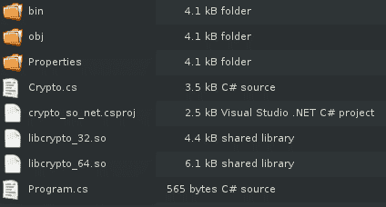

下一步是告诉 IDE 如何处理这些文件。首先，右键点击项目，选择“添加 | 现有项”（Visual Studio）或“添加 | 添加文件”（Monodevelop），然后设置每个库的属性，如下图所示。

在 Visual Studio 中设置属性：

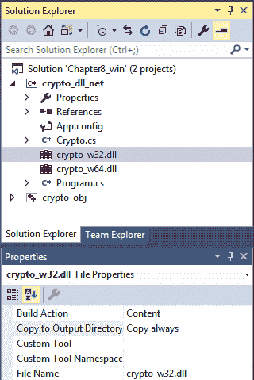

在 Monodevelop 中设置属性：

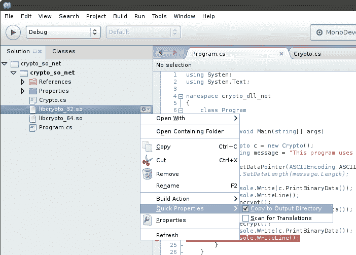

虽然图形界面不同，但两者都需要将构建操作设置为 Content，并在 Visual Studio 中将“复制到输出目录”设置为“始终复制”，在 Monodevelop 中勾选该选项。

现在我们可以构建项目（无论是在 Windows 还是 Linux 上）并运行它。我们可以观察内存中加密/解密的数据，或者添加一个小函数，打印出特定范围内的内存内容。

如果一切设置正确，那么在 Windows 上的输出应类似于以下内容：

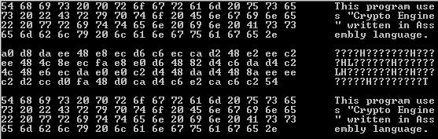

Linux 上的输出将类似于以下内容：

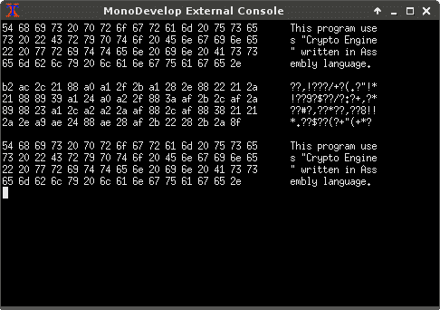

# 总结

本章中，我们仅介绍了将程序集代码与外部世界进行接口的几个方面。目前有许多编程语言，但我们决定集中讲解 C/C++ 和 .NET 平台，因为它们是最能展示如何将用汇编语言编写的模块与用高级语言编写的代码进行绑定的方式。简单来说，任何编译为本地代码的语言都会使用与 C 和 C++ 相同的机制；另一方面，任何像 .NET 这样的平台，尽管有特定平台的绑定机制，但在低层次上会使用相同的方式。

不过，我想有一个问题仍然悬而未决，那就是如何将第三方代码链接到我们的程序集程序中？尽管本章的标题可能暗示这个话题已经包括在内，但将其放在下一章讨论会更有意义，因为我们将讨论的唯一内容就是如何在用汇编语言编写的程序中使用第三方代码。
