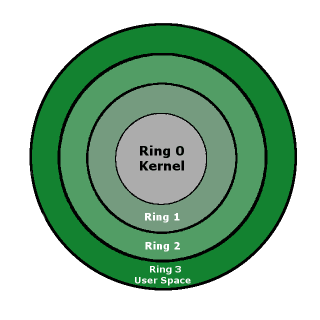
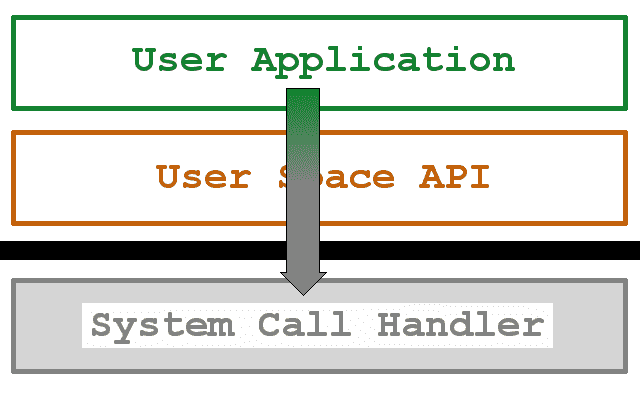
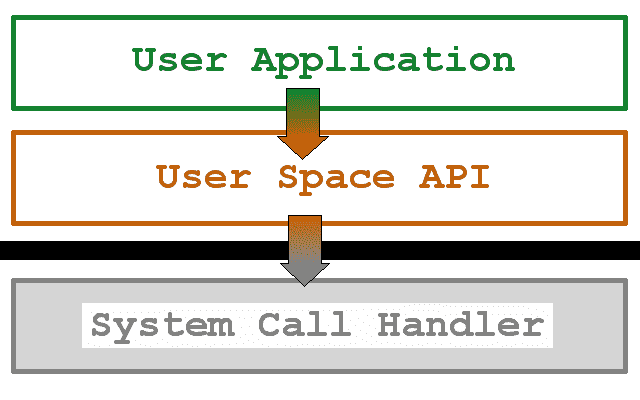
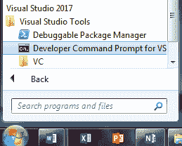
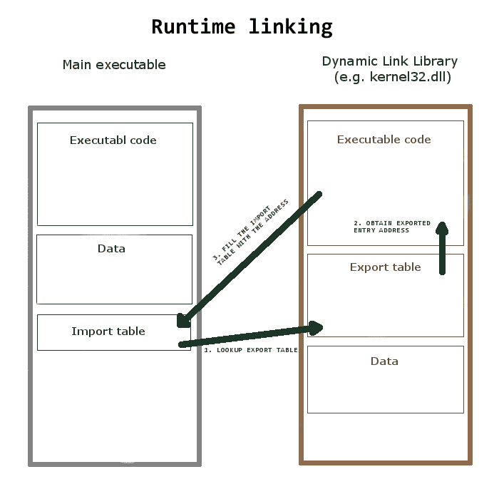
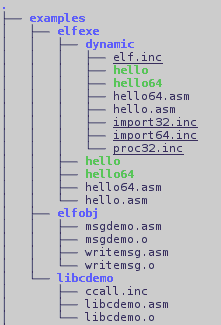

# 第九章：操作系统接口

在准备写这章内容时，我想起了大学时上的一门实时系统课程。当然不是整个课程，而是我们被分配的一个任务——如果说最有趣的任务之一，那可能就是这个了，甚至可以说是最有趣的任务。我们必须写一个小程序，使得文本字符串在屏幕上从左到右再返回，直到按下某个键盘上的按键为止。另外两个按键可以控制字符串移动的速度。那是 2001 年或 2002 年，我们仍然使用 DOS 来进行与汇编相关的练习，而这个任务看起来相当简单。

我个人觉得使用 DOS 中断来做这个事情非常无聊（当时我还不知道奥卡姆剃刀原则，此外，我还想显得聪明），于是我决定完全不使用任何操作系统。我的笔记本有一个软盘驱动器，所以我唯一缺少的是一个能够将原始扇区写入软盘的程序，而我自己写了这个程序（猜猜我用的是什么编程语言）。

这个程序由两部分组成：

+   **引导加载程序**：这是一个小程序（编译后必须适应一个 512 字节的扇区），只负责一件事——从软盘加载我的程序并设置它以便运行

+   **程序**：这实际上是一个用于显示移动字符串的程序

拥有适当的文档并不是实现整个程序包的难点。然而，我不得不处理一些通常我们不太接触的事情。其中之一就是一个原始的显卡驱动程序，它负责切换到图形模式，正确位置显示字符串，并在程序终止之前切换回文本模式。另一个则是编写一个原始的键盘驱动程序，基本上是一个中断处理程序，用来监听键盘输入，调整字符串的移动速度，或者指示程序终止。简单来说，我必须自己处理硬件接口（哦，那是“实模式”的好时光……一切既简单又复杂）。

在现代，除非你是驱动程序开发者，否则你完全不需要直接访问硬件——操作系统会为我们处理所有的脏活，我们可以专注于实现自己的想法。

到目前为止，我们能够用汇编语言实现任何算法，甚至在拥有适当文档的情况下，我们可以编写自己的驱动程序，但这么做会在编写用户空间应用程序时引入冗余工作。更不用说，硬件供应商已经提供了所有硬件的驱动程序，而奥卡姆剃刀原则告诉我们不要无谓地增加复杂性。现代操作系统擅长管理这些驱动程序并提供更简单、无缝的硬件访问，使我们能够专注于创造的过程。

本章中，我们将看到如何轻松无痛地使用操作系统和其他人已创建的众多库所赋予我们的功能。我们将首先将第三方目标文件链接到我们的代码，接着通过导入 DLL/SO 的 API，最后通过动态加载 DLL/SO，在运行时导入 API。

# 环的概念

几乎所有现代平台（除了少数嵌入式平台）都采用相同的安全原则——通过安全级别和权限划分执行环境；在这种情况下，这意味着能够访问某些资源。在基于英特尔的平台上，有四个安全级别，称为**保护环**。这些环的编号从 0 到 3，数字越大，权限越低。显然，在权限较低的级别运行的代码不能直接访问具有更高权限级别的内存。我们将很快看到数据是如何在不同权限级别之间传输的。

以下图示说明保护环的概念：



下面是保护环的不同权限描述：

+   **Ring 0** 是权限最高的级别，所有指令都可以使用，所有硬件都可以访问。这里是内核所在的灰色区域，伴随内核空间的驱动程序。

+   **Ring 1** 和 **Ring 2** 主要用于作为驱动程序执行环境，但几乎没有被使用。

+   **Ring 3** 是用户空间。这是普通软件被授予的权限级别，也是我们唯一关注的权限级别。虽然深入了解可能会非常有趣，但对于本书的目的来说，这并不实用，因为我们所有的代码只需要权限级别 3。

# 系统调用

如果用户空间的应用程序无法向内核发起服务请求，那么它毫无价值，因为它甚至无法在不请求内核终止它正在运行的进程的情况下正常终止。所有系统调用可以按如下方式分类：

+   **进程控制**：属于此类别的系统调用负责进程/线程的创建和管理，以及内存分配/释放。

+   **文件管理**：这些系统调用负责文件的创建、删除和 IO。

+   **设备管理**：此类别包含用于设备管理/访问的系统调用。

+   **维护**：此类别包含用于管理日期、时间、文件或设备属性的系统调用。

+   **通信**：管理通信通道和远程设备

# 系统调用硬件接口

在硬件级别，处理器为我们提供了几种方式来调用内核过程以处理系统调用：

+   **通过中断** (**32 位系统上的 INT 指令**)：操作系统为具有特定编号的中断分配描述符，指向内核空间中的一个过程，该过程根据中断的参数处理该中断（参数通过寄存器传递）。其中一个参数是指向系统调用表的索引（粗略地说，是指向特定系统调用处理程序的指针表）。

+   **使用 SYSENTER 指令** (**32 位系统，不包括 WOW64 进程**)：从 Pentium II 开始，我们可以使用 `SYSENTER` 指令快速调用 ring 0 程序。该指令伴随有 `SYSEXIT` 指令，用于从系统调用返回。

+   **使用 SYSCALL 指令** (**64 位系统**)：此指令由 x86_64 架构引入，仅在长模式下可用。该指令允许更快速地转移到系统调用处理程序，并且不会访问中断描述符表。

# 直接系统调用

使用前述指令之一将意味着进行直接的系统调用，并绕过所有的系统库，如下图所示。然而，这不是最佳实践，我们稍后会看到为什么：



在 Linux 上使用直接系统调用方法很可能会成功，因为 Linux 系统调用有良好的文档支持，并且其调用号是众所周知的（可以在 32 位系统的 `/usr/include/asm/unistd_32.h` 和 64 位系统的 `/usr/include/asm/unistd_64.h` 中找到），而且这些调用号一般不会发生变化。例如，以下代码在 32 位 Linux 系统上将一个 `msg` 字符串打印到标准输出：

```
mov  eax, 4      *; 4 is the number of sys_write system call*
mov  ebx, 1      *; 1 is the stdout file number*
lea  ecx, [msg]  *; msg is the label (address) of the string to write*
mov  edx, len    *; length of msg in bytes*
int  0x80        *; make syscall* 
```

这是其 64 位版本：

```
mov  rax, 1      *; 1 is the number of sys_write on 64-bit Linux*
mov  rdi, 1      *; 1 is the stdout file number*
mov  rsi, msg    *; msg is the label (address) of the string*
mov  rdx, len    *; length of msg in bytes*
syscall          *; make the system call*
```

然而，在 Windows 上，尽管思想相同，但实现方式却不同。首先，Windows 系统调用没有公开的官方文档，这不仅需要一定的反向工程技术，还无法保证通过反向工程 `ntdll.dll` 获得的信息在下次更新后仍然保持不变，更不用说系统调用号会在不同版本之间发生变化。然而，为了普及教育，下面是 32 位 `ntdll.dll` 的系统调用调用过程：

```
_KiIntSystemCall:
   lea  edx, [esp + 8]      *; Load EDX with pointer to the parameter block*
   int  0x2e                *; make system call*
```

此外，如果 `SYSENTER` 指令可用，那么我们将得到以下情况：

```
_KiFastSystemCall:
   mov  edx, esp            *; Load EDX with stack pointer so that kernel*
                            *; may access the parameter block on stack*
   sysenter                 *; make system call*
```

尽管第二种变体更具潜力，但仍无法保证参数块的格式不会发生变化（尽管这种情况不太可能）。总结本小节，值得一提的是，除非绝对必要，否则强烈不建议使用直接系统调用。

# 间接系统调用

更常见的利用系统服务的方式是通过支持库，无论是 Windows 上的系统 DLL 还是 Linux 上的 libc，它们提供了比原始系统调用接口更便捷的 API。过程如下面的图所示：



尽管看起来引入另一层可能会带来冗余的复杂性，但实际上情况正好相反，更不用说在这种情况下我们的代码将变得更具可移植性。

# 使用库

正如之前所述，从汇编语言编写的程序与操作系统交互的最佳方式是通过系统 API —— Windows 上的系统 DLL 和 Linux 上的 libc，本章的其余部分将专注于此主题，因为它将大大简化你作为汇编开发者的工作。

本章的其余部分将专注于如何使用外部库和 DLL 文件（如果在 Windows 上），或者在 Linux 上使用外部库和共享对象。我们将一举两得，不仅学习如何将 DLL 或系统库文件链接到代码中，还将涵盖如何将其他对象文件与代码链接。

为了举例说明，我们将创建一个小程序，该程序将消息打印到标准输出，并使用我们在第八章中开发的模块，*混合汇编语言编写的模块和高级语言编写的模块*，用于消息的加密和解密。

# Windows

在 Windows 上，有两种方法可以访问外部功能：一种是将代码编译为对象文件，并将其与其他对象文件或库链接，另一种是创建可执行文件并导入由不同 DLL 导出的函数。我们将分别研究这两种方法，以便你能在需要时选择最合适的方法。

# 与对象文件和/或库文件的链接

对象文件是一个包含可执行代码和/或数据的文件。它不能单独执行（即使它包含了可执行文件的所有代码），因为存储在此类文件中的信息仅供链接器在构建最终可执行文件时使用；否则，文件中的所有代码和数据都没有绑定到任何地址，仅提供提示。关于 Microsoft 对象文件格式的详细信息以及 PE 可执行格式的规格，可以在[`www.microsoft.com/whdc/system/platform/firmware/PECOFF.mspx`](http://www.microsoft.com/whdc/system/platform/firmware/PECOFF.mspx)获取。访问此 URL，点击下载按钮，选择`pecoff.docx`。

# 对象文件

让我们开始写代码，创建我们的对象文件 `obj_win.asm`：

```
*; First we need to tell the assembler that*
*; we expect an object file compatible with MS linker*
format MS COFF

*; Then specify the external API we need*
*; extrn means that the procedure is not in this file*
*; the 4 after the '@' specifies size of procedure parameters*
*; in bytes*
*; ExitProcess is a label and dword is its size* 
extrn '__imp__ExitProcess@4' as ExitProcess:dword
extrn '__imp__GetStdHandle@4' as GetStdHandle:dword
extrn '__imp__WriteConsoleA@20' as WriteConsole:dword

*; And, of course, our "crypto API"*
extrn '_GetPointers' as GetPointers:dword

*; Define a constant for GetStdHandle()*
STD_OUTPUT_HANDLE   equal -11

*; and a structure to ease the access to "crypto functions"*
struc crypto_functions
{
   .f_set_data_pointer  dd ?
   .f_set_data_length   dd ?
   .f_encrypt           dd ?
   .f_decrypt           dd ?
}

*; The following structure makes it a bit easier* 
*; to manipulate strings and sizes thereof*
struc string [s]
{
   common
   .      db s
   .length = $ - .
}
```

在我们实现代码之前，让我们先创建数据段，以便代码更容易理解：

```
section '.data' data readable writeable
   *; We will store the STDOUT handle here*
   stdout        dd ?

   *; This buffer contains the message we will operate on*
   buffer        string 'Hello from object file!', 0x0a, 0x0d

   *; Progress messages*
   msg1          string 'Encrypted', 0x0a, 0x0d
   msg2          string 'Decrypted', 0x0a, 0x0d

   *; This one is required by the WriteConsole procedure*
   bytesWritten  dd ?
```

数据段非常自明，我们现在终于可以写代码了：

```
section '.text' code readable executable
   *; We need the entry point to be accessible to the linker,*
 *; therefore we make it "public"*
   public _start

_start:
   *; The first step would be obtaining the STDOUT handle*
   push  STD_OUTPUT_HANDLE
   *; Since we are linking against a DLL, the GetStdHandle* 
 *; label would refer to a location in the import section* 
 *; which the linker will create for us. Hence we make an*
 *; indirect call*
   call  [GetStdHandle]
   *; Store the handle*
   mov   [stdout], eax

   *; Print the message*
   push  0 bytesWritten buffer.length buffer eax
   call  [WriteConsole]

   *; Let's play with encryption a bit*
 *; First get the procedure pointers. Since the GetPointers()*
 *; is in another object file, it would be statically linked,*
 *; therefore we make a direct call*
   call  GetPointers
   *; Store the pointer to the crypto_functions structure in EBX*
   mov   ebx, eax
```

记得`virtual`指令吗？

我们程序员有时是懒惰的，喜欢事物变得更加方便，尤其是在编写代码一周后查看自己写的代码时。因此，我们更愿意按名称处理我们的加密程序，而不是根据`crypto_functions`结构的地址偏移来处理。这时，`virtual`指令派上用场，它允许我们像下面的代码片段所示那样将由 EBX 寄存器指向的位置标记为虚拟标签：

```
   virtual at ebx
      funcs  crypto_functions
   end virtual
```

`funcs`是一个虚拟标签，指向由`ebx`寄存器指向的位置，它将在编译时被替换为`ebx`。任何通过`funcs`引用的`crypto_functions`结构的成员都将被其在结构中的偏移量所替换。现在，让我们设置加密引擎，对存储在`buffer`中的消息进行加密和解密：

```
 *; Set the pointer to data and its length*
   push  buffer
   call  [funcs.f_set_data_pointer] *; Equivalent to 'call [ebx]'*
   push  buffer.length
   call  [funcs.f_set_data_length]

   *; We have to restore the stack pointer due to the* 
 *; fact that the above two procedures are in accordance*
 *; with the cdecl calling convention*
   add   esp, 8

   *; Encrypt the content of the buffer*
   call  [funcs.f_encrypt]

   *; Print progress message*
   push  0 bytesWritten msg1.length msg1 [stdout]
   call  [WriteConsole]

   *; Decrypt the content of the buffer*
   call  [funcs.f_decrypt]

   *; Print another progress message*
   push  0 bytesWritten msg2.length msg2 [stdout]
   call  [WriteConsole]

   *; Print the content of the buffer in order to verify*
 *; decryption*
   push  0 bytesWritten buffer.length buffer [stdout]
   call  [WriteConsole]

   *; All is fine and we are free to exit*
   push  0
   call  [ExitProcess]
```

# 生成可执行文件

编译这个源文件会生成`obj_win.obj`文件，我们将把它链接到`kernel32.lib`和`crypto_w32.obj`。但是我们该去哪里找到`kernel32.lib`文件呢？这个任务有时可能并不简单，尽管它并不困难。所有的系统库都可以在`c:\Program Files\Microsoft SDKs\Windows\vX.X\Lib`目录中找到，其中`vX.X`代表版本号（很可能会有多个版本）。对于 64 位 Windows，目录应为`c:\Program Files (x86)\Microsoft SDKs\Windows\vX.X\Lib`。所以，让我们把`crypto_w32.obj`文件复制到工作目录中，然后尝试链接它。打开 VS 2017 的开发者命令提示符窗口，如下图所示，并导航到你的工作目录：



输入以下命令：

```
link /entry:start /subsystem:console obj_win.obj "c:\Program Files\Microsoft SDKs\Windows\v7.0A\Lib\kernel32.lib" crypto_w32.obj
```

一旦按下回车键，如果一切顺利，控制台中将显示 Microsoft (R)增量链接器的徽标消息，随后会出现新的提示符，并且会生成`obj_win.exe`文件。尝试运行它，应该会得到以下输出：

```
Hello from object file!
Encrypted
Decrypted
Hello from object file!
```

Voilà！我们刚刚在汇编代码中使用了外部功能。

# 从 DLL 导入过程

Flat Assembler 为我们提供了另一种使用外部功能的方法。虽然在其他汇编器中我们需要一个链接器来链接 DLL 文件，Flat Assembler 使得我们可以生成一个包含所有在源代码中定义的导入项的可执行文件，这样我们只需编译源代码并运行可执行文件。

运行时将动态链接库链接到我们代码的过程相当简单，可以通过以下图示来说明：



一旦加载器加载了一个可执行文件，它将解析其导入表（如果存在），并识别请求的库（有关导入表格式规格，请参阅`PECOFF.docx`）。对于在导入部分找到的每个库引用，加载器尝试加载该库，然后解析可执行文件的导入部分，查找该库所导出的过程名称，并扫描库的导出部分以寻找匹配项。一旦找到匹配项，加载器计算该条目的虚拟地址，并将其写回可执行文件的导入部分。此过程对于每个请求的库的每个导入条目都会重复。

对于我们的例子，我们将使用与链接对象相同的代码（只需将其重命名为`dll_win.asm`），并做一些微小的修改，将`crypto_w32.obj`替换为`crypto_w32.dll`。首先，删除所有的`extrn`和`public`声明，然后通过将`format MS COFF`更改为`format PE CONSOLE`，告诉汇编器这次我们期待的是一个控制台可执行文件，而不是一个对象文件。

由于我们将创建自己的导入表，因此需要包含`win32a.inc`文件，该文件包含我们可能需要的所有宏。将这一行添加到格式声明之后：

```
include 'win32a.inc'
```

我们快完成了；将以下代码附加到源文件中：

```
section '.idata' import data readable writeable

   *; Tell the assembler which libraries we are interested in*
   library kernel,'kernel32.dll',\
           crypto,'crypto_w32.dll'

   *; Specify procedures we need from kernel32.dll*
   import kernel,\
      GetStdHandle, 'GetStdHandle',\
      WriteConsole, 'WriteConsoleA',\
      ExitProcess, 'ExitProcess'

   *; And, finally, tell the assembler we are also*
 *; interested in our crypto engine*
   import crypto,\
      GetPointers, 'GetPointers'
```

我们需要做的最后一项修改是将`call GetPointers`改为`call [GetPointers]`，因为这次`GetPointers`过程不会静态链接到我们的可执行文件中，而是将从动态链接库中导入，这意味着`GetPointers`标签将引用内存中的一个地址，该地址存储着`GetPointers`过程的地址。

尝试编译该文件并在控制台中运行。你应该得到与我们从多个对象链接的可执行文件相同的输出。

如果你遇到一个错误消息，显示可执行文件未启动，而不是预期的输出，尝试在`platform.inc`文件的`TARGET_W32_DLL`部分中添加`section '.reloc' fixups data readable discardable`这一行，然后重新编译`crypto_w32.dll`。这对于构建 DLL 是正确的，尽管在某些情况下没有这个也可能能正常工作。

当然，可以使用`LoadLibrary()` Windows API 手动加载 DLL，并通过`GetProcAddress()`解析所需过程的地址，但这与链接 DLL 或导入 API 没有区别，因为我们仍然需要导入这两个 API。然而，有一种方法可以让我们以所谓的隐形方式导入 API 地址。

在构建 64 位可执行文件时，完全适用相同的规则。唯一的区别是`kernel32.lib`的位置，它将位于`c:\Program Files\Microsoft SDKs\Windows\vX.X\Lib\x64`，以及指针的大小。另外，非常重要的一点是，记住在 x86_64 Windows 上使用的调用约定既不是`cdecl`也不是`stdcall`！

# Linux

在 Linux 中，就像在 Windows 中一样，我们支持静态和动态链接（也支持手动导入）。主要区别在于，在 Linux 中（这是我个人的看法），构建软件要容易得多，因为所有开发工具都集成在系统中。嗯，除了 Flat Assembler，但它的集成并不成问题——我们只需将 `fasm` 可执行文件复制到用户 PATH 环境变量中包含的某个 `bin` 目录即可。

幸运的是，Flat Assembler 内置支持生成目标文件和可执行文件，它能够像在 Windows 上一样在 Linux 上导入库中的程序。稍后我们将看到，在 Linux 上这些方法与 Windows 上几乎相同，只要我们不深入研究 ELF 规范和格式的细节。

如果你想深入探索 ELF 格式，相关规范可以在以下链接查看：

[`refspecs.linuxbase.org/elf/elf.pdf`](http://refspecs.linuxbase.org/elf/elf.pdf) 了解 32 位 ELF 规范。

和

[`ftp.openwatcom.org/devel/docs/elf-64-gen.pdf`](http://ftp.openwatcom.org/devel/docs/elf-64-gen.pdf) 了解 64 位 ELF 规范。

如果这些链接出现失效，你也可以通过 Google 或其他搜索引擎找到这些规范。

就像我们在 Windows 中做的那样，我们将首先将几个目标文件链接到一个可执行文件中，然后创建一个带有动态依赖链接的可执行 ELF 文件。

# 链接目标文件和/或库文件

**Microsoft 公共对象文件格式**（**MS COFF**）和 **ELF**（**可执行与可链接格式**，以前称为 **可扩展链接格式**）的结构差异很大，但对我们来说，这种差异完全不重要。ELF 由 UNIX 系统实验室开发，并于 1997 年发布。它后来被选为 32 位 Intel 架构的便携式目标文件格式。直到今天，32 位系统使用 ELF，64 位系统使用 ELF64。

然而，从我们的角度来看，Linux 的代码与 Windows 的代码非常相似。更准确地说，正是 FASM 让它们非常相似。

# 目标文件

就像 Windows 的目标文件源代码一样，我们一如既往地首先告诉汇编器我们期望什么样的输出，哪些程序是公开的，哪些是外部的：

```
format ELF

*; As we want GCC to take care of all the startup code*
*; we will call our procedure "main" instead of _start,*
*; otherwise we would be using LD instead of GCC and* 
*; would have to specify all runtime libraries manually.*
public main

*; The following function is linked from libc*
extrn printf

*; And this one is from our crypto library*
extrn GetPointers
```

接下来我们进行便捷宏定义，建议将便捷宏放入一个单独的包含文件中，这样可以方便地在不同代码中使用，而无需重新编写它们：

```
struc crypto_functions
{
   .f_set_data_pointer dd ?
   .f_set_data_length  dd ?
   .f_encrypt          dd ?
   .f_decrypt          dd ?
}

struc string [s]
{
   common
   .                   db s
   .length = $ - .
   .terminator         db 0
}
```

数据段几乎与 Windows 目标文件中的相同，不同之处在于我们不需要一个变量来保存 `stdout` 句柄：

```
section '.data' writeable
   buffer  string  'Hello from ELF linked from objects!', 0x0a
   msg1    string  'Encrypted', 0x0a
   msg2    string  'Decrypted', 0x0a
```

最后是代码部分。从逻辑上来说，这段代码和之前一样，唯一的不同是使用了`printf()`代替`WriteConsoleA()`，在这种情况下，`libc`中的`printf()`实现将为我们处理所有的安排，并调用一个`SYS_write`的 Linux 系统调用。由于从 GCC 的角度看，我们仅仅是实现了`main()`函数，因此我们不需要自己终止进程，也就没有引入`exit()`过程——运行时代码会自动添加并链接，GCC 会处理其余的部分，而我们只需要从`main()`函数返回：

```
section '.text' executable

*; Remember that we are using GCC for linking, hence the name is*
*; main, rather than _start*
main:
   *; Print the content of the buffer to stdout*
 *; As all procedures (except crypto procedures) would be*
 *; statically linked, we are using direct calls*
   push  buffer
   call  printf
   *; Restore stack as printf() is a cdecl function*
   add   esp, 4

   *; Get pointers to cryptographic procedures*
   call  GetPointers
   mov   ebx, eax

   *; We will use the same trick to ease our access to cryptography*
 *; procedures by defining a virtual structure*
   virtual at ebx
      funds   crypto_functions
   end virtual

   *; Right now we will push parameters for all subsequent procedure*
 *; calls onto the stack in reverse order (parameter for the last* 
 *; call is pushed first*
   push  0 buffer msg2 msg1 buffer.length buffer

   *; Set crypto library's data pointer*
 *; Crypto procedures are not available at link time, hence not*
 *; statically linked. Instead we obtain pointers thereof and this* 
 *; is the reason for indirect call*
   call  [funcs.f_set_data_pointer]
   *; Restore stack*
   add   esp, 4

   *; Set size of the data buffer*
   call  [funcs.f_set_data_length]
   add   esp, 4

   *; Encrypt the buffer. As this procedure has no parameter, there*
 *; is no reason to do anything to stack following this call*
   call  [funcs.f_encrypt]

   *; Print msg1*
   call  printf
   add   esp, 4

   *; Decrypt the buffer back*
   call  [funcs.f_decrypt]

   *; Print msg2*
   call  printf
   add   esp, 4

   *; Print the content of the buffer to ensure correct decryption*
   call  printf
   add   esp, 4

   *; All is done, so we may safely exit*
   pop   eax
   ret
```

# 生成可执行文件

将文件保存为`o_lin.asm`，并使用终端中的`fasm o_lin.asm`命令将其编译为目标文件。下一步将使用以下命令将`o_lin.o`与`crypto_32.o`链接：

```
gcc -o o_lin o_lin.o crypto_32.o
***# If you are on a 64-bit system then*** 
gcc -o o_lin o_lin.o crypto_32.o -m32
```

这将生成一个`5KB o_lin`可执行文件——相比我们曾经生成的代码大小，这个文件相当庞大。如此巨大的体积是由于 GCC 将 C 运行时库链接其中。尝试运行它，你应该在终端看到以下内容：


# ELF 的动态链接

并不是总是适合将目标文件静态链接成单一可执行文件，Linux 提供了一个机制，可以生成一个 ELF 可执行文件，该文件在运行时与所需的库（共享对象）动态链接。Flat Assembler 曾经对 ELF 的支持相对基础，这意味着只能创建直接使用系统调用的可执行文件，或者创建一个目标文件以与其他文件链接（正如我们所做的那样）。

Flat Assembler 对 ELF 的支持在版本 1.69.05 发布时得到了扩展——添加了一些段属性，并引入了几个便捷宏，使我们能够手动在 ELF 可执行文件中创建导入表。这些宏位于 Linux 包中的`examples/elfexe/dynamic`目录下（在以下截图中有下划线标出）：



这些宏可以在本章随附代码中的`linux_include`文件夹下找到。

# 代码

动态链接 ELF 的代码几乎与 ELF 目标文件的代码相同，只有一些微小的差别。首先，`formatter`指令必须告诉汇编器生成可执行文件，而不是目标文件：

```
format ELF executable 3    *; The 3 may be omitted if on Linux* 

*; Include this in order to be able to create import section*
include 'linux_include/import32.inc'

*; We have to specify the entry point for the executable*
entry _start
```

本章中使用的便捷结构（`crypto_functions` 和 `string`）依然有效，并应被放置在文件中。虽然没有严格规定它们应放置的位置，但它们应当在使用之前出现：

```
*; The content of the data section is the same as in object file*
*; source. The section itself is declared in a different way (in*
*; fact, although, an ELF file is divided into sections, it is* 
*; treated a bit differently when in memory - it is divided into*
*; segments)*
segment readable writeable
   buffe  string 'Hello from dynamically linked ELF!', 0x0a
   msg1   string 'Encrypted', 0x0a
   msg2   string 'Decrypted', 0x0a
```

为了增强 Flat Assembler 对 ELF 的支持，引入了一个新的段，其中一个是包含可与可执行文件一起使用的加载器名称的**解释器**：

```
segment interpreter writeable
   db '/lib/ld-linux.so.2',0
```

另一个是**动态的**，作为一个导入索引。然而，我们不会自己声明这个段；相反，我们将使用两个宏——其中一个会创建所需库的列表，另一个则指定要导入的程序。在我们的例子中，它将如下所示：

```
*; In our example we only need to libraries - libc for*
*; printf() and exit() (and we will use exit() this time)*
*; and crypto_32.so for our cryptographic core.*
needed\
   'libc-2.19.so',\
   'crypto_32.so'

*; Then we specify requested procedures*
import\
   printf,\
   exit,\
   GetPointers
```

其余的代码只需要做一些小的修改。首先，代码段声明如下：

```
segment executable readable
_start:
```

这次所有的程序都被间接调用：

```
push  buffer
call  [printf]
add   esp, 4

call  [GetPointers]
mov   ebx, eax

virtual at ebx
   funcs  crypto_functions
end virtual

push  0 buffer msg2 msg1 buffer.length buffer

*; All procedures are cdecl, so we have to adjust* 
*; the stack pointer upon return from procedures*
*; with parameters*

call  [funcs.f_set_data_pointer]
add   esp, 4

call  [funcs.f_set_data_length]
add   esp, 4

call  [funcs.f_encrypt]

call  [printf]
add   esp, 4

call  [funcs.f_decrypt]

call  [printf]
add   esp, 4

call  [printf]
add   esp, 4

call  [exit]
```

我们替换掉的最后两条指令是：

```
pop  eax
ret
```

和：

```
cal  [exit]
```

将文件保存为`so_lin.asm`。

现在，你可以构建并运行新创建的可执行文件了：

```
fasm  so_lin.asm
./so_lin
```

如果一切都做得正确，你应该看到这个：


# 总结

在这一章中，你了解了系统调用——操作系统的服务网关。你学到了，使用现有的库来间接调用系统调用，既更实用也更方便，而且更加安全。

本章故意没有提供 64 位的示例，因为我希望你能自己尝试编写这些简单的可执行文件的 64 位版本，作为一个小练习来测试自己。

现在我们是大师了。我们有了坚实的基础，能够用纯粹的 Intel 汇编实现任何算法，甚至能够直接调用系统调用（至少在 Linux 上可以，因为在 Windows 上这样做是强烈不推荐的）。然而，作为真正的大师，我们知道还有更多需要学习和探索的东西，因为单单一个基础是远远不够的。
