# 第十章：修补遗留代码

几年前，我有机会参与一个有趣的项目——我接到了一个商家老板的电话，他因一个可悲的开发者锁死了可用的可执行文件，而该开发者拿了钱就消失了。由于没有源代码，唯一的选择是修补可执行文件，以更改执行流程并绕过锁定。

不幸的是，这并不是一个孤立的案例。老旧工具经常出现需要稍微更改的情况（即使已经存在多年，甚至几十年），然后……嗯，至少有两个选择：

+   源代码丢失，无法在应用更改后重新构建可执行文件。

+   源代码存在，但似乎已经老旧到无法用现代编译器编译，几乎需要从头重写。在这种情况下，即使重写不是大问题，但与软件一起使用的库可能与现代编译器或其输出不兼容，这将使整个项目变得更加复杂，问题依然存在。

根据需要应用的更改复杂度，直接用新代码修补二进制可执行文件可能是一个足够的选择，因为将几个字节放入十六进制编辑器要比逆向工程一个工具（无论是其二进制形式还是已经不再被编译器支持的旧源代码）并从头重写它更简单。

在本章中，我们将考虑一个非常简单的可执行文件示例，目标是进行安全修复。我们将分别为 Windows 和 Linux 创建可执行文件，并首先研究可用的选项，然后应用二进制补丁。由于我们将面向两个平台，我们将在需要时讨论 PE 和 ELF 文件格式。

# 可执行文件

如前所述，我们必须首先创建可执行文件。寻找一个足够简单、贴合本章内容的现实示例似乎是一个相对困难的任务，因此我们决定采用一个现实中的问题，并用简化的代码进行封装。我们将用 C 语言编写可执行文件的代码，并在 Windows 上使用 Visual Studio 2017 编译，在 Linux 上使用 GCC 编译。代码将简单如以下所示：

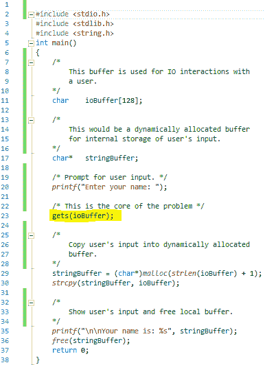

如我们所见，这段代码唯一能够做的，就是将用户输入作为字符串读取到一个 128 字节的缓冲区中，为输入字符串分配一个内部缓冲区，将输入字符串复制到其中，并从内部缓冲区打印它。

在 Visual Studio 2017 中创建一个新的解决方案，命名为`Legacy`，并将前面展示的代码填入其`main.cpp`文件。个人来说，我更喜欢在编写 C 代码时使用 `.c` 扩展名，并将“编译方式”选项（可以在项目属性窗口中通过导航到配置属性 | C/C++ | 高级找到）设置为 C。

将前面的代码构建成可执行文件的过程非常简单，除了一个关于 Visual Studio 2017 的细节。当我们尝试伪造一个`Legacy`可执行文件时，我们需要禁用链接器的动态基址选项。在 Visual Studio 中，右键点击项目并选择“属性”。以下截图展示了动态基址选项的位置：

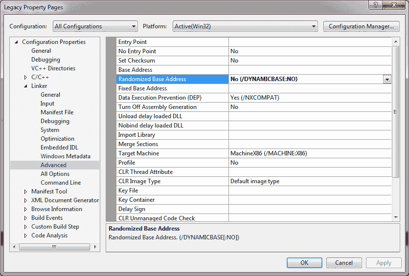

一旦禁用此选项，只需点击“构建”或“全部构建”即可。

然而，在 Linux 上，我们可以通过在终端输入以下命令之一，像往常一样构建可执行文件（现在先忽略警告）：

```
*# As we are interested in 32-bit executable* 
*# on a 32-bit platform we will type:*
gcc -o legacy legacy.c

*# and on a 64-bit platform we will type:*
gcc -o legacy legacy.c -m32
```

在本章中，我们将首先修补 Windows 可执行文件，然后继续修补 Linux 可执行文件，并查看如何在 ELF 的情况下解决问题。哦，最重要的是；忘记 C 源代码，假装我们没有它们。

# 问题

无论我们尝试在 Windows 还是 Linux 上运行我们的可执行文件，都几乎不会发现任何问题，因为程序会要求输入我们的名字并将其打印出来。只要程序没有遇到超过 127 个 ASCII 字符的名字（第 128 个字符是结束的 `NULL` 值），这种方式将稳定工作，然而，确实存在这样的长名字。我们来试着运行这个可执行文件（我们指的是为 Windows 构建的那个，但相同的原理也适用于 Linux 可执行文件），并输入一长串文本，远远超过 127 个字符。结果会是这样：

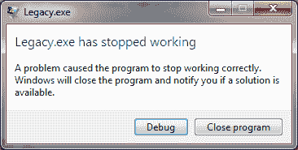

这个消息的原因是 `gets()` 函数。如果 C 不是你首选的语言，你可能不知道这个函数不会检查输入的长度，这可能导致堆栈破坏（至少像前面那条消息的出现一样），在最坏的情况下，这也是一个漏洞，容易受到精心制作的攻击。幸运的是，解决 `gets()` 问题的方法非常简单；必须将对 `gets()` 的调用替换为对 `fgets()` 函数的调用。如果我们有源代码，这将是一个一分钟的修复，但我们没有（至少我们假装没有它们）。

然而，我们稍后实现的解决方案并不复杂。我们只需要一个反汇编器（最好是 IDA Pro）、一个十六进制编辑器，当然还有 Flat Assembler。

# PE 文件

为了成功地实现补丁，我们需要了解 PE 文件格式（PE 代表便携式可执行文件）。虽然可以通过此 URL 获取详细的规格：[`www.microsoft.com/whdc/system/platform/firmware/PECOFF.mspx`](http://www.microsoft.com/whdc/system/platform/firmware/PECOFF.mspx)，但我们只需要了解格式的几个关键点，并能够手动解析其基本结构。

# 头文件

一个 PE 文件包含多个头部，第一个我们遇到的是 DOS 头部，它仅包含对我们有用的两个内容；第一个是`MZ`签名，第二个是文件头的偏移量，也就是 PE 头（因为它之前有`PE\x0\x0`签名）。文件头包含关于文件的基本信息，例如节的数量。

紧随 PE 头之后的是可选头部，它包含更有趣的信息，如`ImageBase`——即图像（文件）应加载的首选地址——和`NumberOfRvaAndSizes`，后者对我们特别重要。`NumberOfRvaAndSizes`字段表示紧随可选头部之后的`IMAGE_DATA_DIRECTORY`条目数组中的条目数。`IMAGE_DATA_DIRECTORY`结构定义如下：

```
struct IMAGE_DATA_DIRECTORY
{
   DWORD VirtualAddress;
   DWORD Size;
}
```

每个结构描述了 PE 文件的特定区域。例如，`Import IMAGE_DATA_DIRECTORY`，我们特别感兴趣的那个，指的是关于文件中没有的函数的信息，而这些函数是从动态链接库中导入的。

接下来是一个`IMAGE_SECTION_HEADER`结构数组，其中描述了每个 PE 节（我们会得到节的文件偏移量和大小，以及它的虚拟地址和虚拟大小，即内存中的大小，通常与文件中的大小不同）。

尽管我强烈建议你阅读官方规格，我还建议下载并安装我见过的最好的十六进制编辑器——010 Editor（可以在[`www.sweetscape.com/010Editor/`](https://www.sweetscape.com/010Editor/)下载）。这个强大的应用程序除了支持 Windows、macOS 和 Linux 版本，还支持不同二进制格式的模板解析，并且有一个解析 PE 文件的模板。看看模板的输出——它使理解 PE 格式变得更加简单。以下是 010 Editor 中 PE 文件的显示方式：

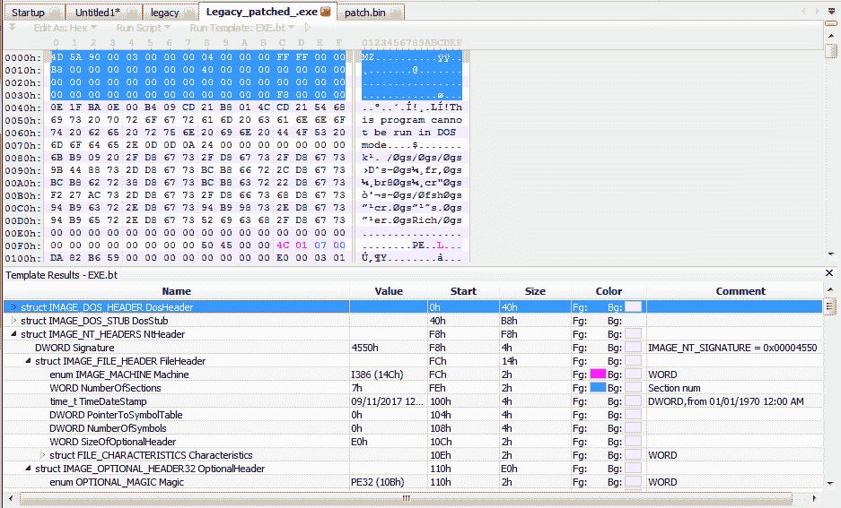

# 导入

我们正在寻找的`gets()`函数是从`ucrtbased.dll`文件动态链接的，因此我们应该在导入表中查找它。使用 010 Editor 来查找并解析导入表，就像我们在下面的截图中看到的那样，并不困难：

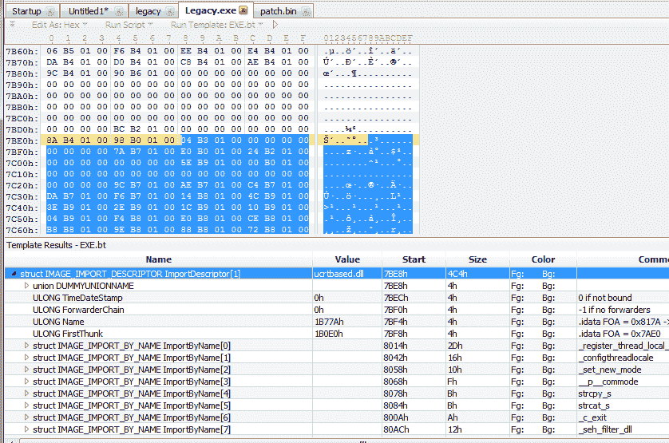

尽管手动解析 PE 可执行文件可能是一个有趣的过程（事实上确实如此），但使用现有工具会更方便、更轻松。例如，IDA Pro 可以为我们完成所有繁琐的工作。

# 收集信息

将`Legacy.exe`文件加载到 IDA Pro 或任何你选择的反汇编工具中，我们将开始收集关于如何修补`Legacy.exe`文件的信息，并强制它使用`fgets()`代替`gets()`。

# 定位`gets()`调用

我们很幸运，因为在我们的案例中，只有一个对`gets()`的调用，而且我们知道它应该出现在调用`printf`的附近，而`printf`打印出`Enter your name:`这段字符串。然而，让我们看看 IDA Pro 中的 Strings 窗口：

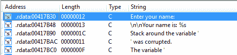

在最坏的情况下，找到感兴趣的字符串只需要一秒钟，一旦找到，我们只需双击它，进入可执行文件的`.rdata`部分，在那里我们看到如下内容：

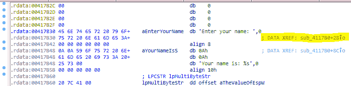

双击`DATA XREF:`会带我们到代码中字符串被访问的位置：

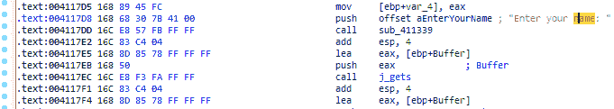

向下滚动五行，我们看到对`j_gets`的调用……你可能会问，为什么是`j_gets`？我们不是在寻找`gets()`函数的地址，而是跳转到它吗？当然，我们是在寻找`gets()`；然而，由于可能有多个`gets()`的调用，编译器为此函数创建了一个单独的“调用中心”，这样任何其他调用`gets()`的代码实际上都会调用`j_gets`，然后被引导到实际的`gets()`函数地址，在导入表中。这就是我们在`j_gets`地址看到的内容：

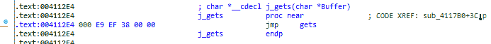

现在，我们只需要注意`call j_gets`指令的地址，它是`0x4117Ec`。

# 为补丁做准备

不幸的是，我们不能简单地将调用重定向到`fgets()`，而不是`j_gets`，因为我们根本没有导入`fgets()`（因为我们在 C 源代码中没有使用它），而且由于`gets()`只接受一个参数（如我们在地址`0x4117EB`处看到的`cdecl`传递的参数），而`fgets()`需要三个参数。尝试在原地修补代码，以使其传递三个参数是不可能的，这样会损坏可执行文件并使其无法使用。这意味着我们需要为 shim 代码找到一个位置，该代码将添加两个额外的参数并实际调用`fgets()`（一旦我们将其添加为导入函数）。

幸运的是，对于我们来说，内存中的 PE 段（实际上，在文件中也是如此）占用的空间比它们的实际内容要大得多。在我们的例子中也是如此，我们需要找到`.text`段结束的位置；因此，首先我们查看下一个段的开始位置，如下图所示：

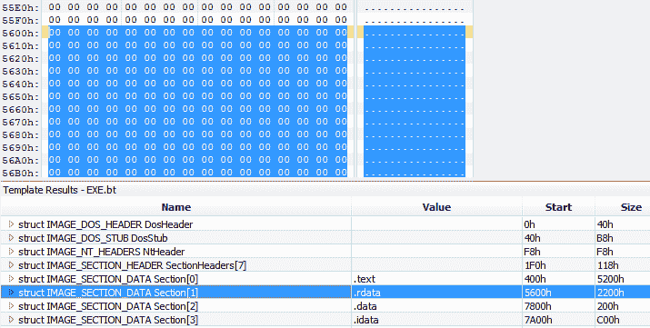

正如我们在前面的截图中看到的，下一个段是`.rdata`，其内容的开始已被高亮显示。一旦我们到达那里，我们开始向上滚动，直到看到非零或`0xcc`字节的内容，如下图所示：

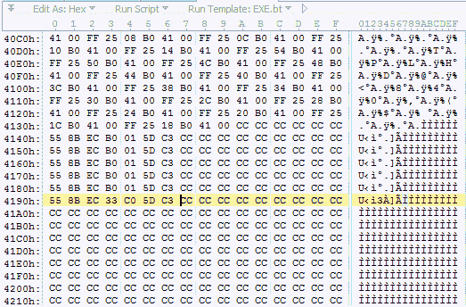

我们看到实际内容的最后一个字节位于文件偏移 `0x4196`，因此从文件偏移 `0x4197` 开始有一些剩余空间；然而，从未对齐的地址开始执行一个过程似乎不太合适，所以我们决定从文件偏移 `0x4198` 开始。为了确保我们在正确的位置，让我们将这些字节与 IDA Pro 中看到的内容进行对比：  

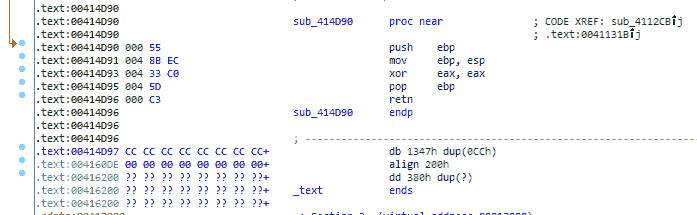  

最终，我们看到字节相同，并且可以使用文件偏移 `0x4198`（虚拟地址 `0x414d98`）来放置我们的 shim 代码。

# 导入 `fgets()`  

在我们开始实现补丁之前，我们还需要使可执行文件导入 `fgets()` 而不是 `gets()`。这看起来相当简单。让我们看看导入表中 `gets()` 函数的内容：  

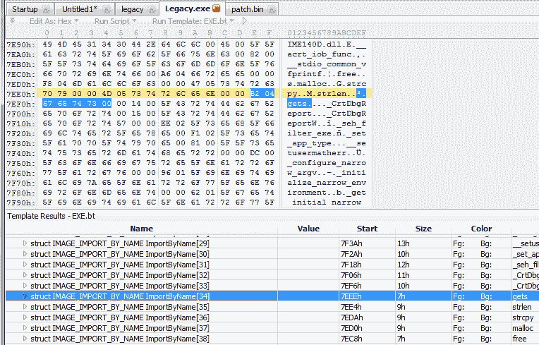  

找到字符串后，我们可以安全地用 `fgets` 覆盖它。从以下截图可以看出，为什么在这种特定情况下覆盖是安全的：  

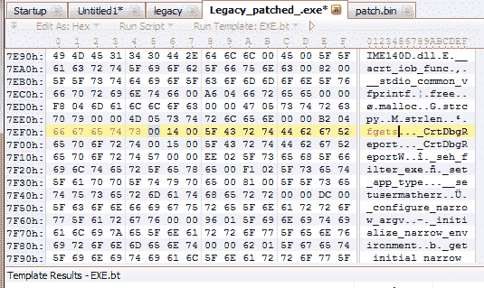  

前面的截图显示了 `gets` 被替换为 `fgets`。我们在这里再次幸运，因为从文件偏移 `0x7EF0` 开始的 `gets` 字符串并未以偶数边界结束，因此我们在 `0x7EF5` 处有一个额外的零，留出了足够的空间来将 `gets` 替换为 `fgets`，并且终止的 `NULL` 保持不变。  

# 补丁调用  

下一步将是补丁 `gets()` 的调用，并将其重定向到我们的 shim。由于我们只有一个 `gets()` 的调用（现在是一个带有无效参数数量的 `fgets()` 调用），我们将直接补丁这个调用。如果我们有多个 `fgets()` 调用，我们将补丁 `jmp fgets` 指令，而不是对每一个调用进行补丁。  

正如我们之前所看到的，调用是相对于 `EIP` 的，因此我们需要计算一个新的偏移量，使其调用我们位于 `0x414d98` 的代码。公式相当简单：  

*new_offset = 0x414d98 - 0x4117EC - 5*  

这里，`0x4117EC` 是调用指令的地址，`5` 是其字节长度。我们需要使用该调用指令的长度，因为在执行时，`EIP` 已经指向紧接着调用后的指令。计算得到的偏移量为 `0x35A7`。  

然而，在我们应用这个补丁之前，我们必须在十六进制编辑器中找到正确的位置，并使用一些字节表示这个调用指令以及后面的几个字节，如以下截图所示：  

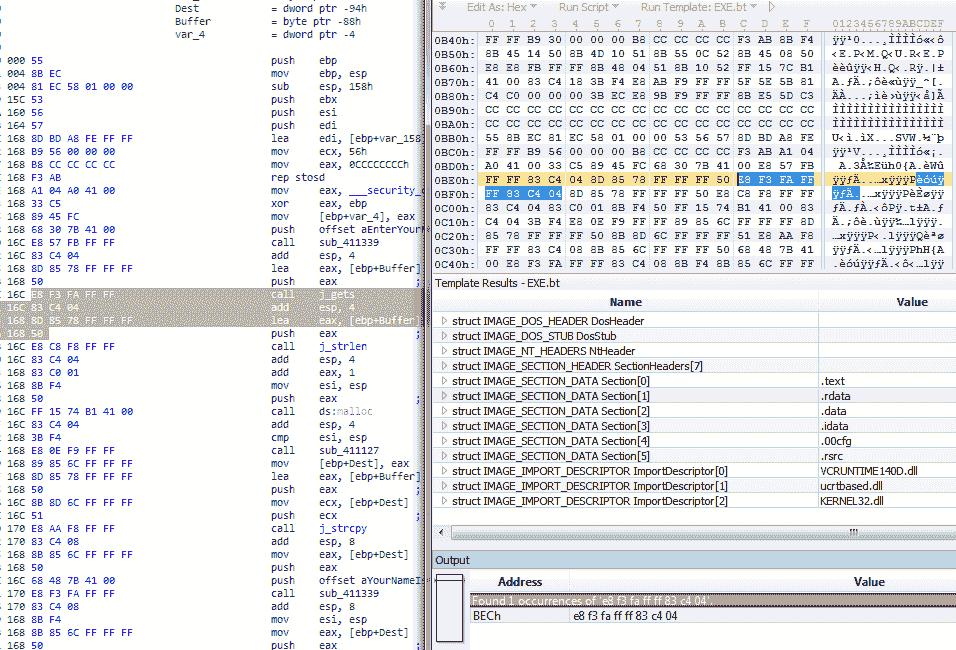  

我们使用了 `0xe8 0xf3 0xfa 0xff 0xff 0x83 0xc4 0x04` 字节进行搜索。这样做时，必须确保这样的字节序列在搜索结果中只出现一次。这里的 `0xe8` 是调用指令，`0xf3 0xfa 0xff 0xff` 字节是下一条指令的偏移量——`0xfffffaf3`。以下截图展示了偏移补丁的应用：  

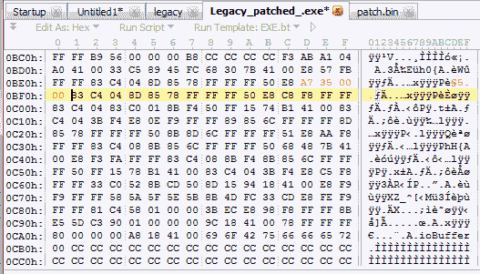

偏移量被`0x000035a7`覆盖。现在，`0x4117ec`处的指令将调用我们的 Shim 代码。但我们仍然需要实现 Shim 代码。

# Shim 代码

我们即将编写的代码看起来会与我们通常编写的代码略有不同，因为我们并不期望从中生成一个可执行文件；相反，我们将生成一个包含假定会加载到特定地址的 32 位过程的二进制文件，这也是我们将在`patch.asm`源文件的前两行中告诉编译器的内容：

```
*; Tell the assembler we are writing 32-bit code*
use32

*; Then specify the address where the procedure*
*; is expected to be loaded at*
org 0x414d98
```

然后，我们将定义两个标签，指向我们过程外的地址。幸运的是，Flat Assembler 允许我们在任意地址定义一个标签，像这样：

```
*; Assign label to the code where jump* 
*; to fgets is performed*
label fgets at 0x414bd8

*; We will discuss this label in just a few seconds*
label __acrt_iob_func at 0x41b180
```

完成之后，我们就可以开始实现实际的 Shim 代码，作为一个常规的`cdecl`过程：

```
fgets_patch:
  * ; Standard cdecl prolog*
   push  ebp
   mov   ebp, esp

   *; Ooops... We need to pass a pointer to* 
 *; the stdin as one of the fgets' parameters,*
 *; but we have no idea what this pointer is...*
```

Windows 上的标准 C 库实现提供了一个根据流的编号来确定指针的函数。这个函数是`__iob_func(int)`。幸运的是，我们的目标可执行文件正在从`ucrtbased.dll`中导入这个函数，正如我们在 IDA Pro 的 Imports 标签（或者在 010 Editor 中）看到的：

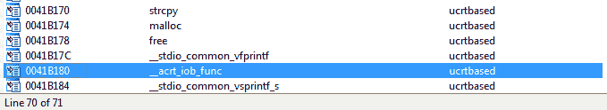

尽管名称有些不同（前面加了`__acrt_`），但这就是我们感兴趣的函数，它位于虚拟地址`0x41b180`。这也是我们几分钟前添加`__acrt_iob_func`标签的原因。访问这个地址后，我们可以看到在动态链接后，真正的`__acrt_iob_func`的地址会被放在那里：

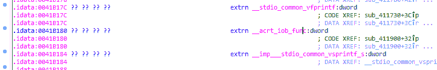

为了调用这个外部函数以获取`stdin`流的指针，我们必须记住`stdin`的编号是`0`，并且导入的函数是间接调用的：

```
 *; Get the stdin stream pointer*
   push  0
   call  dword[__acrt_iob_func]
   *; The result is in the EAX register*
 *; Do not forget to fix the stack pointer*
 *; after calling a cdecl procedure*
   add   esp, 4
```

现在，我们已经准备好将执行流转发到`fgets()`，我们这样做：

```
 *; Forward the call to fgets()*
   push  eax             *; stdin*
   push  128             *; max input length*
   push  dword [ebp + 8] *; forward pointer to the* 
                        * ; input buffer*
   call  fgets
   add   esp, 12

   *; Standard cdecl epilog*
   mov   esp, ebp
   pop   ebp
   ret
```

补丁的代码已经准备好。就这么简单（在这个特定的案例中）。编译这段代码会生成一个包含原始二进制代码的 35 字节二进制文件。这是十六进制编辑器中看到的代码：

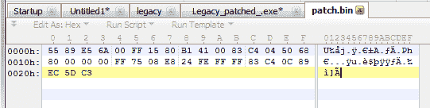

# 应用补丁

在本章的*准备补丁*小节中，我们已经在十六进制编辑器中找到了补丁应用的位置，即文件偏移量`0x4198`。应用补丁非常简单——我们将`patch.bin`文件中的字节复制到可执行文件中的上述位置，并得到以下结果：

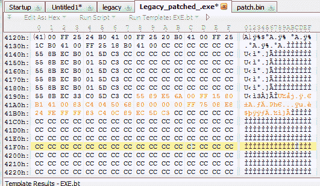

现在保存文件，我们就完成了。可执行文件已经打上补丁，从现在开始将使用`fgets()`代替`gets()`。我们可以通过运行可执行文件并输入一个非常长的字符串代替名字来检查这一点：

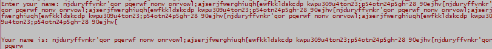

如我们所见，这种输入不再像`fgets()`那样导致错误，因为最多只会读取 127 个字符，从而保持了栈的安全性，我们在前面的截图中看到了结果；--输出被截断了。

# 复杂场景

我们刚刚经历了一个简单的 PE 可执行文件打补丁的场景；然而，现实生活中的情况很少如此简单，修改通常比简单地导入不同的函数复杂得多。在这种情况下，有没有办法静态地打补丁到可执行文件呢？当然有。实际上，不止一种方法。例如，可以对文件中的某个过程进行补丁，从而改变它实现的算法。然而，只有当现有过程占用了足够的空间来容纳新代码时，这种方法才可行。另一个选项是向 PE 文件中添加一个可执行部分，这个过程相当简单，值得在这里进行检查。整个过程包含五个简单的步骤（如果修改`patch.asm`文件算作第六步的话），我们将一一讲解。

# 准备补丁

这是最简单的一步，因为我们几乎不需要做任何操作。我们已经有一个工作中的补丁代码，唯一的重要区别是从汇编角度来看，代码将放置在内存中的位置。我们将在目标可执行文件的末尾添加一个新部分，因此，代码的加载地址（即`Virtual Address`）是通过将当前最后一部分的`Virtual Address`和`Virtual Size`相加，并将结果四舍五入到最接近的`SectionAlignment`的倍数来计算的。在我们的情况下，`0x1D000 + 0x43C = 0x1d43C`，四舍五入到`0x1e000`。然而，尽管它被称为虚拟地址，但实际上这个值是`ImageBase`的偏移量，而`ImageBase`是`0x400000`，因此真实的虚拟地址应为`0x41e000`。

简单来说，我们只需要修改`patch.asm`中的一行——第 2 行，将`org 0x414d98`改为`org 0x41e000`。其余代码保持不变。

# 调整文件头

由于我们打算将部分附加到一个可执行文件中，我们需要对其头部进行一些更改，以便它们能够反映新的实际情况。让我们在 010 编辑器或任何你喜欢的十六进制编辑器中打开`Legacy.exe`文件，并查看所有头部，在必要的地方进行修改。

在我们更新文件之前，我们必须根据`FileAlignment`和`SectionAlignment`的值分别决定文件中新部分的大小（`SizeOfRawData`）和内存中的大小（`VirtualSize`）。查看`IMAGE_OPTIONAL_HEADER32`结构中的这些值，我们发现`FileAlignment`的值是`0x200`，`SectionAlignment`的值是`0x1000`。由于我们要插入的新代码非常小（只有 35 字节），因此可以使用最小的大小，设定部分的`SizeOfRawData = 0x200`，`VirtualSize = 0x1000`。

然而，让我们一步步进行，作为第一步，调整`IMAGE_FILE_HEADER`下`IMAGE_NT_HEADERS`的`NumberOfSections`字段，如下图所示：

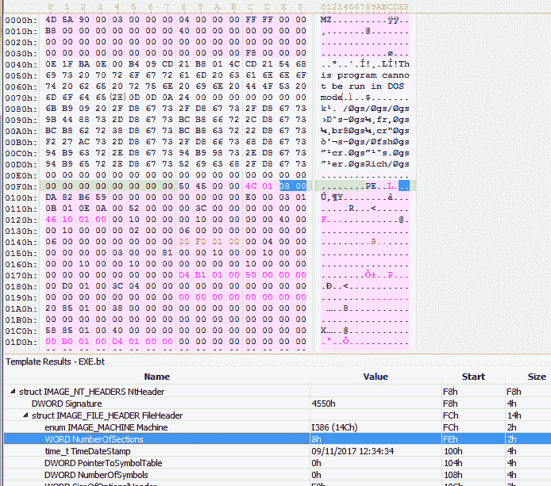

原本，文件有七个节，随着我们将增加另一个节，我们将`WORD NumberOfSections`的值更改为`8h`。

一旦更新了`NumberOfSections`字段，我们接着更新`IMAGE_OPTIONAL_HEADER32`头中的`SizeOfImage`字段（这是内存中可执行镜像的大小）。`SizeOfImage`字段的原始值是`0x1E000`，由于我们的新节应该占用`0x1000`字节的内存，我们简单地将`SizeOfImage`设置为`0x1F000`，如下面的截图所示：

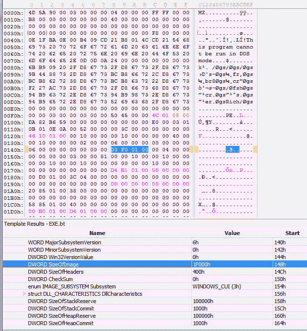

现在进入一个更加有趣的部分——添加一个节头。节头位于`IMAGE_DATA_DIRECTORY`条目数组之后，在我们的例子中，位于文件偏移量`0x1F0`。最后一个节头（针对`.rsrc`节）位于文件偏移量`0x2E0`，我们将把我们的节头插入在其之后，起始于文件偏移量`0x308`。对于这个可执行文件，我们有足够的空闲字节，因此可以安全地继续。

节头的前八个字节包含节的名称，我们将节命名为`.patch`。关于节名称字段的一个有趣的事实是，名称不必以 0（`NULL`字符串终止符）结尾，并且可以占用所有八个字节。

接下来的四个字节是描述节的虚拟大小的整数（它在内存中将占用多少字节），如我们之前决定的，虚拟大小是`0x1000`字节（另一个有趣的事实是——我们可以将此字段设置为 0，它仍然能够正常工作）。

接下来的字段是一个四字节整数，描述节的`VirtualAddress`字段（该节应该被加载到哪里）。该字段的值是之前`SizeOfImage`字段的值，即`0x1E000`。

紧随`VirtualAddress`字段之后的是`SizeOfRawData`字段（也是 4 个字节），我们将其设置为`0x200`——即文件中新节的大小——以及

`PointerToRawData`，我们将其设置为文件之前的大小——`0x8E00`。

其余字段填充为零，除了最后一个字段`Characteristics`，我们将其设置为`0x60000020`，表示该节包含代码并且是可执行的。

你添加的节头应该像下图所示：

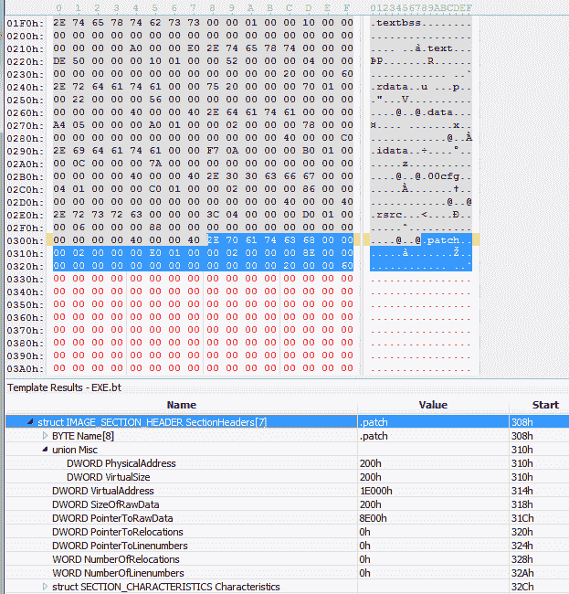

# 添加新节

还有两个步骤，首先是将实际的节数据追加到文件中。在十六进制编辑器中滚动文件到末尾，我们会看到第一个可用的文件偏移量是`0x8e00`，这正是我们设置的`PointerToRawData`字段的值。

我们应该将`0x200`字节附加到文件中，从而将其大小设置为`0x9000`，并用我们的代码填充这`0x200`字节的前 35 个字节，如下图所示：

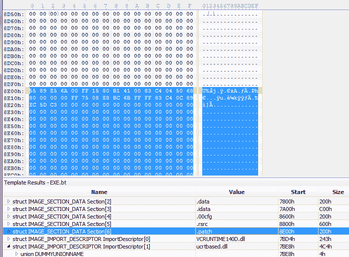

只剩下最后一步，就可以实际运行可执行文件了，别犹豫了。

# 修复调用指令

剩下的工作就是修复`call gets()`指令，使其指向我们的新代码。我们使用相同的二进制字符串`0xE8 0xF3 0xFA 0xFF 0xFF 0x83 0xC4 0x04`来定位我们感兴趣的调用，并将`0xF3 0xFA 0xFF 0xFF`字节替换为`0x0F 0xC8 0x00 0x00`，这是从调用后的指令到我们新部分的精确偏移。以下截图准确地展示了这一过程：

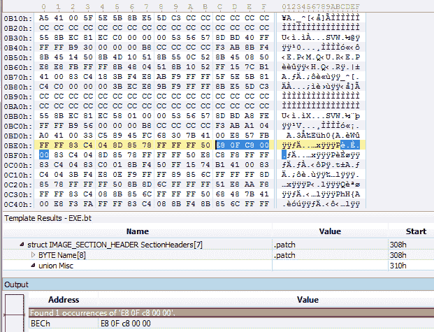

最后，保存文件并尝试启动它。如果修补正确，你将看到与之前方法相同的结果。

# ELF 可执行文件

修补 ELF 可执行文件比修补 PE 可执行文件要困难一些，因为 ELF 文件通常在其节区中没有空闲空间，因此我们只能选择添加一个节区，这不像 PE 文件那样简单，或者注入共享对象。

添加节区需要对 ELF 格式有很好的了解（可以在[`www.skyfree.org/linux/references/ELF_Format.pdf`](http://www.skyfree.org/linux/references/ELF_Format.pdf)中找到相关规范），尽管这一内容非常有趣，但在本书的范围之外。最显著的问题是 ELF 可执行文件中节区和头部的排列方式，以及 Linux 如何处理 ELF 结构，这使得像我们在 PE 修补中那样附加数据变得非常困难。

另一方面，注入共享对象要简单得多，实施起来也容易，因此我们将采用这种方式。

# `LD_PRELOAD`

`LD_PRELOAD`环境变量由 Linux 动态链接器/加载器`ld.so`使用，如果设置了它，变量中将包含一个共享对象列表，这些共享对象会在任何其他共享对象之前与可执行文件一起加载，包括`libc.so`。这意味着我们可以创建一个共享对象，导出一个名为`gets`的符号，并将这个共享对象指定给`LD_PRELOAD`，这样如果我们尝试运行的可执行文件导入了一个同名符号，我们的`gets`实现就会被链接，而不是之后加载的`libc.so`中的实现。

# 一个共享对象

现在，我们将实现我们自己的`gets()`过程，它实际上会将调用转发给`fgets()`，就像我们之前修补 PE 文件时做的那样。不幸的是，Flat Assembler 对 ELF 的支持目前还无法让我们简单地创建共享对象；因此，我们将创建一个目标文件，并稍后使用 GCC 将其作为 32 位系统的共享对象进行链接。

源代码通常非常简单直观：

```
*; First the formatter directive to tell*
*; the assembler to generate ELF object file*
format ELF

*; We want to export our procedure under* 
*; the name "gets"*
public gets as 'gets'

*; And we need the following symbols to be*
*; imported from libc*
*; As you may notice, unlike Windows, the* 
*; "stdin" is exported by libc*
extrn fgets
extrn stdin

*; As we want to create a shared object*
*; we better create our own PLT (Procedure*
*; Linkage Table)*
section '.idata' writeable
   _fgets  dd  fgets
   _stdin  dd  stdin

section '.text' executable

*; At last, the procedure*
gets:
   *; Standard cdecl prolog*
   push  ebp
   mov   ebp, esp

   *; Forward the call to fgets()*
   mov   eax, [_stdin]
   push  dword [eax]             ; FILE*
   push  127                     ; len
   push  dword [ebp + 8]         ; Buff*
   call  [_fgets]
   add   esp, 12

   *; Standard cdecl epilog*
   mov   esp, ebp
   pop   ebp
   ret
```

将前面的代码保存为 `fgets_patch.asm`，并使用 `fasm` 或 `fasm.x64` 编译；这将生成 `fgets_patch.o` 目标文件。将此目标文件构建为共享对象，方法就是在终端运行以下命令之一：

```
*# On a 32-bit system*
gcc -o fgets_patch.so fgets_patch.o -shared 

*# and on a 64-bit system*
gcc -o fgets_patch.so fgets_patch.o -shared -m32
```

现在让我们在没有补丁的情况下测试并运行旧版可执行文件，并使用一个长字符串（140 字节）进行输入。结果如下：

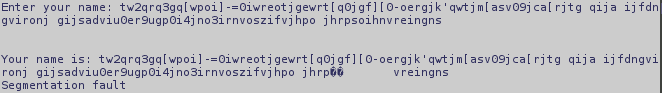

如我们所见，栈被破坏，导致了段错误（无效的内存访问）。现在我们可以尝试运行相同的可执行文件，但将 `LD_PRELOAD` 环境变量设置为 `"./fgets_patch.so"`，从而在启动 `legacy` 可执行文件时强制加载我们的共享对象。命令行将如下所示：

```
LD_PRELOAD=./fgets_patch.so ./legacy
```

这次，我们得到了预期的输出——被截断到 127 个字符——这意味着我们的 `gets()` 实现通过动态链接过程进行了链接：

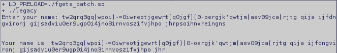

# 总结

修改现有可执行代码和/或正在运行的进程是一个相当广泛的主题，十分难以在单一章节中涵盖，因为这个主题本身可能值得独立成书。然而，它与编程技术和操作系统的关系更为紧密，而我们试图专注于汇编语言。

本章几乎只是触及了所谓的二进制代码修改（即补丁）的冰山一角。目的在于展示这个过程是多么简单和有趣，而不是详细讨论每一种方法。然而，我们已经获得了一个大致的方向，当涉及到那些无法简单重建的代码修改时，应该去哪里。

代码分析的方法仅被表面性地涵盖，目的是为你提供一个大致的概念，应用程序补丁过程的大部分内容也是如此，因为重点是补丁的实现。我的个人建议是——去了解 Windows PE 可执行文件和目标文件格式规范，以及 Linux ELF。即使你永远不需要修改任何可执行文件，了解这些内容也能帮助你理解在高级语言编程时，底层发生了什么。
