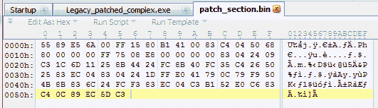
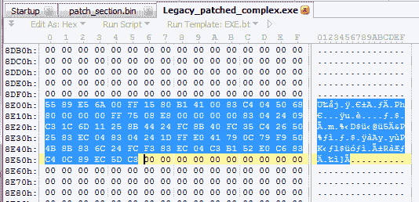
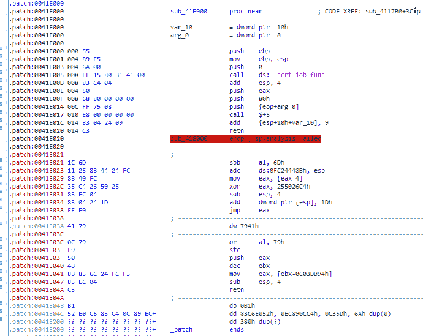
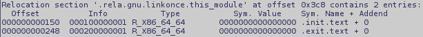
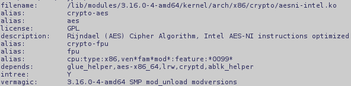
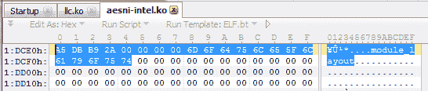

# 第十一章：哦，差点忘了

我们的旅程接近尾声。然而，需要明确的是，这本书仅仅涵盖了名为汇编语言编程的冰山一角，前方还有更多的内容等待你去学习。本书的主要目的是向你展示如何在汇编语言中创建强大而简便的软件，以及它的可移植性和便利性。

在本书的过程中，我们还有一些话题没有涉及，但这些话题仍然值得关注。一个这样的主题是我们如何防止我们的代码被偷偷窥探。我们将简要介绍如何通过 Flat Assembler 实现一些保护代码的方法，而不需要第三方软件的支持。

另一个在我看来很有趣且值得探讨的话题是如何编写可以在内核空间中执行的代码。我们将为 Linux 实现一个小型可加载的内核模块。

# 保护代码

有很多书籍、文章和博客帖子讨论如何更好地保护代码。它们中的一些确实有用且实际；然而，大多数都是专门针对某些第三方工具或它们的组合。我们不会对这些内容进行评审，无论是书籍还是工具。相反，我们将看看我们自己能利用现有工具做些什么。

首先，我们必须接受一个事实，那就是没有任何东西能为我们的代码提供 100%的保护。不管我们做什么，只要我们的代码越有价值，就越可能被逆向工程。我们可以使用打包工具、保护工具以及任何其他我们能想到的工具，但最终它们都是众所周知的，并且总有一种方法可以绕过它们。因此，最终的防线就是代码本身。更准确地说，就是代码呈现给潜在攻击者的方式。这就是混淆的作用所在。

*混淆*这个词的字典定义是使某物变得模糊、不清楚或难以理解。它可能是一种非常强大的技术，无论是与其他方法结合使用还是单独使用。我曾有机会逆向工程一个广泛使用加密的程序。这个程序没有使用任何第三方工具进行保护，而是采用了一种非常巧妙且模糊（乍一看）的比特操作，我不得不承认——这比如果使用像**Themida**这样的工具，逆向工程会更加困难。

在本章的这一部分，我们将看到一个混淆的简单示例，通过稍微增强我们为 Windows 可执行文件使用`gets()`时做的补丁。由于混淆不是本书的主要话题；我们不会深入细节，而是展示一些简单而微小的改变是如何使理解代码的基本逻辑变得稍微困难，而不必在调试器中动态观察它。

# 原始代码

让我们先快速浏览一下我们作为补丁一部分植入到可执行文件中的原始代码。代码非常简单，考虑到我们已经了解的内容，阅读起来很容易：

```
*; First of all we tell the assembler*
*; that this is a 32-bit code*
use32

*; Tell the assembler that we are expecting*
*; this code to appear at 0x41e000*
org 0x41e000

*; Define labels for "external" procedures*
*; we are about to use*
label fgets at 0x414bd8
label __acrt_iob_func at 0x41b180

*; Implement the procedure*
fgets_patch:

 *; We begin the procedure with the standard*
 *; prolog for cdecl calling convention*
   push  ebp
   mov   ebp, esp

 *; As we need the pointer to the stdin stream*
 *; we call the __acrt_iob_func procedure*
   push  0                      *; This is the number of the stream*
   call  dword[__acrt_iob_func]
   add   esp, 4                 *; Restore the stack pointer

   ; Forward the parameter (char*) and 
   ; invoke fgets()* push  eax                    *; Contains pointer to the stdin stream*
   push  128                    *; Maximum input length*
   push  dword[ebp + 8]         *; Pointer to the receiving buffer*
   call  fgets
   add   esp, 4 * 3             *; Restore the stack pointer

   ; Standard epilog for procedures using cdecl 
   ; calling convention* mov   esp, ebp
   pop   ebp
   ret
```

代码相当简单，而且很难从中找到任何有价值的保护内容。鉴于这种情况，我们将使用这个例子来展示如何简单地用其他指令实现`call`指令，使得它既不指向被调用的函数，也完全不像一个过程调用。

# 调用

有几种方法可以用一系列指令替换`call`指令，这些指令会执行完全相同的操作，但会被反编译器以不同的方式处理。例如，以下代码将完全执行`call`指令的功能：

```
 *; Preceding code*
   push  .return_address   *; Push the return address on stack*
   push  .callee           *; Redirect the execution flow to*
   ret                     *; callee*
.return_address:
 *; the rest of the code*
```

我们也可以替换以下序列：

```
push  callee
ret
```

例如：

```
lea  eax, [callee]
jmp eax
```

这样仍然会产生相同的结果。然而，我们希望我们的混淆更强一些；因此，我们继续并创建一个宏。

# 调用混淆宏

在开始混淆`call`指令之前，我们将定义一个名为`random`的实用宏：

```
*; The %t below stands for the current*
*; timestamp (at the compile time)*
random_seed = %t

*; This macro sets 'r' to current random_seed*
macro random r
{
   random_seed = ((random_seed *\
                   214013 +\
                   2531011) shr 16) and 0xffffffff
   r = random_seed 
}
```

`random`宏生成一个伪随机整数，并将其返回到参数变量中。我们需要这一小段随机化代码来为我们的`call`实现添加一些多样性。该宏本身（我们称之为`f_call`）使用了 EAX 寄存器；因此，我们要么在调用`f_call`之前保存这个寄存器，要么只在返回值存放在 EAX 寄存器的过程中使用该宏，因为否则寄存器中的值将会丢失。此外，由于它处理参数的方式，它仅适用于直接调用。

最后，我们来看一下宏本身。由于理解代码的最佳方式是查看代码，让我们深入了解这个宏：

```
*; This macro has a parameter - the label (address)*
*; of the procedure to call*
macro  f_call callee 
{
 *; First we declare a few local labels*
 *; We need them to be local as this macro may be*
 *; used more than once in a procedure*
   local .reference_addr,\
         .out,\
         .ret_addr,\
         .z,\
         .call

 *; Now we need to calculate the reference address*
 *; for all further address calculations*
   call  .call
.call:
   add   dword[esp], .reference_addr - .call
 *; Now the address or the .reference_addr label*
 *; is at [esp]*
 *; Jump to the .reference_addr*
   ret

 *; Add some randomness*
   random .z
   dd     .z

 *; The ret instruction above returns to this address*
.reference_addr:

 *; Calculate the address of the callee:*
 *; We load the previously generated random bytes into*
 *; the .z compile time variable*
   load .z dword from .reference_addr - 4

   mov  eax, [esp - 4]     *; EAX now contains the address*
 *; of the .reference_addr label*
   mov  eax, [eax - 4]     *; And now it contains the four*
 *; random bytes*
   xor  eax, callee xor .z *; EAX is set to the address of*
 *; the callee*

   *; We need to set up return address for the callee* 
 *; before we jump to it*
   sub  esp, 4             *; This may be written as* 
 *; 'add esp, -4' for a bit of* 
 *; additional obfuscation*
   add  dword[esp], .ret_addr - .reference_addr
   *; Now the value stored on stack is the address of*
 *; the .ret_addr label*
 *; At last - jump to the callee*
   jmp  eax

   *; Add even more randomness*
   random .z
   dd     .z
   random .z
   dd     .z

   *; When the callee returns, it falls to this address*
.ret_addr:
   *; However, we want to obfuscate further execution*
 *; flow, so we add the following code, which sets* 
 *; the value still present on stack (address of the*
 *; .ret_addr) to the address of the .out label*
   sub  dword[esp - 4], -(.out - .ret_addr)
   sub  esp, 4
   ret
   *; The above two lines are, in fact, an equivalent* 
 *; of 'jmp dword[esp - 4]'*

 *; Some more randomness*
   random .z
   dd     .z

.out:
}
```

如我们所见，这个混淆尝试并没有涉及复杂的计算，甚至代码仍然是可读且易于理解的，但让我们将`patch_section.asm`文件中的`call fgets`这一行替换为`f_call fgets`，重新编译并重新应用补丁到可执行文件。

新的补丁明显变大了——从 35 字节变成了 86 字节：



将这些字节复制并粘贴到`Legacy.exe`文件的`0x8e00`偏移位置，如下图所示：



运行可执行文件后，我们将获得与上一章相同的结果，因此在这一阶段没有明显的区别。不过，让我们来看一下代码在反汇编器中的样子：



我们不能说这里的代码被严重混淆了，但它应该能让你了解使用相对简单的宏与 Flat Assembler 配合时可以做些什么。前面的例子仍然可以通过一点努力读取，但应用更多的混淆技巧会让它变得几乎无法阅读，且在没有调试器的情况下几乎无法还原。

# 一点内核空间

直到现在，我们一直在处理用户空间的代码，编写小型应用程序。然而，在本章的这一部分，我们将为 Linux 实现一个小而简单的**可加载内核模块**（**LKM**）。

几年前，我参与了一个有趣的项目，目标是识别由某些内核模块处理的数据。由于我不仅无法访问内核源代码，还无法访问内核本身，更不用说这不是一个 Intel 平台，这个项目变得更加具有挑战性。我所知道的只有相关内核的版本，以及目标模块的名称和地址。

我经历了一个漫长而有趣的过程，直到我能够构建一个能够完成我需要的工作的 LKM。最终，我成功构建了一个用 C 编写的 LKM，但如果我不尝试用汇编语言编写一个，我就不会满足自己。这是一次难忘的经历，我必须承认。然而，一旦项目完成，我决定尝试在我的开发机器上实现一个简单的 LKM。由于第一个模块是为不同的平台编写的，且针对不同版本的内核，并且考虑到我决定假装自己没有当前内核的源代码，我不得不进行几乎同样多的研究和逆向工程，即使我编写的是我自己系统的模块。

# LKM 结构

让我来为你省去同样漫长的挖掘信息、逆向其他内核模块的结构和检查内核源代码的过程，以便弄清楚模块是如何加载的。相反，我们直接进入 LKM 的结构。

可加载内核模块实际上是一个 ELF 对象文件，带有一些额外的部分和一些信息，这些信息在用户空间创建的目标文件和可执行文件中通常是看不到的。我们应该指出至少五个通常在常规文件中没有的部分：

+   `.init.text`：这一部分包含模块初始化所需的所有代码。以 Windows 为例，这部分内容可以与 `DllMain()` 函数及其引用的所有函数进行比较。对于 Linux 来说，它可以被看作是一个包含构造函数的部分（Windows 可执行文件也可能包含该部分）。

+   `.exit.text`：这一部分包含在模块卸载之前需要执行的所有代码。

+   `.modinfo`：这一部分包含有关模块本身的信息、它所写的内核版本等。

+   `.gnu.linkonce.this_module`：此部分包含 `this_module` 结构体，后者包含模块的名称以及指向模块初始化和去初始化过程的指针。尽管对于我们来说，这个结构体本身有点模糊，但我们只对某些特定的偏移量感兴趣，在没有源代码的情况下，可以使用逆向工程工具（如 IDA Pro）找到这些偏移量。不过，我们仍然可以通过在终端中运行 `readelf` 命令，查看 `.init.text` 和 `.exit.text` 指针在结构体中的偏移量，方法如下：

    ```
    readelf- sr name_of_the_mofule.ko
    ```

    然后，我们看到输出中的偏移量：如我们所见，指向 `.init.text` 的指针位于偏移量 `0x150`，而指向 `.exit.text` 的指针则位于 `this_module` 结构体的偏移量 `0x248` 处。

+   `__versions`：此部分包含外部符号的名称，并附带其版本号。内核使用该表格来验证相关模块的兼容性。

# LKM 源代码

LKM 的结构并不神秘。它可以从 Linux 内核源代码中获取，这些源代码是公开的，因此我们无需进一步探究；相反，根据奥卡姆剃刀原则，让我们继续实现模块。

如前所述，LKM 是一个目标文件；因此，我们首先创建一个 `lkm.asm` 文件，并按如下方式输入我们的代码：

```
format ELF64       *; 64-bit ELF object file*
extrn printk       *; We are going to use this symbol,*
 *; exported by the kernel, in order to*
 *; have an indication of the module being*
 *; loaded without problems*
```

紧接着，我们可以开始创建 LKM 的各个部分。

# .init.text

本部分包含成功初始化 LKM 所需的代码。在我们的情况下，由于我们没有为模块添加任何功能，它可以直接返回，但由于我们需要表示我们的 LKM 成功加载，因此我们将实现一个小过程，向系统日志中打印一条字符串：

```
section '.init.text' executable 

module_init:
   push  rdi       *; We are going to use this register*

   mov   rdi, str1 *; Load RDI with the address of the string*
 *; we want to print to system log (we will*
 *; add it to the data section in a few moments)*
   xor   eax, eax
   call  printk    *; Write the string to the system log*

   xor   eax, eax  *; Prepare return value*
   pop   rdi       *; Restore the RDI register*
   ret
```

相当简单，是不是？我们只需打印字符串并从该过程返回。

# .exit.text

该部分的内容将更加简单（在我们这个具体情况下）。我们只需从过程返回：

```
section '.exit.text' executable
module_cleanup:
   xor   eax, eax
   ret
```

由于我们没有分配任何资源，也没有加载任何模块或打开任何文件，因此我们直接返回 0。

# .rodata.str1.1

这是一个只读数据部分，唯一需要放入其中的内容是我们将写入系统日志的字符串：

```
section '.rodata.str1.1'
   str1  db  '<0> Here I am, gentlemen!', 0x0a, 0
```

# .modinfo

在本节中，我们需要提供关于我们模块的某些信息，例如许可证、依赖项，以及内核版本和支持的选项：

```
section '.modinfo'
 *; It is possible to specify another license here,*
 *; however, some kernel symbols would not be* 
 *; available for license other than GPL*
   db  'license=GPL', 0

   *; Our LKM has no dependencies, therefore, we leave*
 *; this blank*
   db  'depends=', 0

   *; Version of the kernel and supported options*
   db  'vermagic=3.16.0-4-amd64 SMP mod_unload modversions ', 0
```

如果你不确定应该指定什么作为 `vermagic`，你可以在 `''/lib/modules/`uname -r`/''` 目录中的任何模块上运行 `modinfo` 命令。例如，我在我的系统上运行以下命令：

```
/sbin/modinfo /lib/modules/`uname -r`/kernel/arch/x86/crypto/aesni-intel.ko
```

输出将如下截图所示：



一旦你获得这些信息，你可以简单地复制 `vermagic` 字符串并将其粘贴到你的代码中。

# .gnu.linkonce.this_module

这里没有什么特别要说的。此部分只包含一个结构体--`this_module`，它大部分都填充为零（因为它在 LKM 加载器内部使用），除了三个字段：

+   模块名称

+   指向初始化过程的指针--`module_init`

+   指向反初始化过程的指针--`module_cleanup`

在这个内核版本和 Linux 发行版中，这些字段分别位于偏移量`0x18`、`0x150`和`0x248`的位置；因此，代码将如下所示：

```
section '.gnu.linkonce.this_module' writeable

this_module:
 *; Reserve 0x18 bytes*
   rb  0x18
 *; String representation of the name of the module*
   db  'simple_module',0

   *; Reserve bytes till the offset 0x150*
   rb  0x150 - ($ - this_module)
   *; The address of the module_init procedure*
   dq  module_init

   *; Reserve bytes till the offset 0x248*
   rb  0x248 - ($ - this_module)
   *; The address of the module_cleanup procedure*
   dq  module_cleanup
   dq  0
```

这就是我们在这一部分需要处理的全部内容。

# __versions

本节中的信息通过版本号和名称描述外部符号，并由加载器使用，以确保内核和 LKM 使用相同版本的符号，从而避免出现任何意外。你可以尝试在没有此部分的情况下构建模块，甚至可能加载它，但不建议这样做。加载器会拒绝加载版本无效的模块，这告诉我们这些信息并非只是为了好玩，而是为了防止失败。

当时，我找不到关于如何获取某些符号版本号的可靠信息，但这可能是一个不错的变通办法，这对我们的小 LKM 足够用，方法是简单地查找以 8 字节版本值（在 32 位系统上为 4 字节）为前缀的符号名，如下截图所示：



我们的 LKM 只需要两个外部符号，分别是`module_layout`和`printk`。正如你在前面的截图中看到的，`module_layout`符号的版本是`0x2AB9DBA5`。采用相同的方法获取`printk`符号的版本号，我们得到了（在我的系统上是如此，但在你的系统上可能不同）`0x27E1A049`。

这些条目作为结构体数组存储，其中每个结构体包含两个字段：

+   `版本号`：这是 8 字节版本标识符（在 32 位系统上为 4 字节）

+   `符号名称`：这是一个变长字符串（最多 56 字节），表示符号的名称

由于我们在讨论的是固定大小的字段，因此定义一个结构体是自然的；但是，由于我们不想为每个符号命名每一个结构体，我们将使用宏：

```
macro __version ver, name
{
   local .version, .name
   .version  dq  ver
   .name     db  name, 0
   .name_len = $ - .name
             rb  56 - .name_len
}
```

定义了`__version`宏后，我们准备好方便地实现`__versions`部分：

```
section '__versions'
   __version  0x2AB9DBA5, 'module_layout'
   __version  0x27E1A049, 'printk'
```

就这样。保存文件，试着编译并加载它。

# 测试 LKM

测试模块比编写模块要简单得多。编译与通常的方式没有不同；我们只需使用 Flat Assembler 进行编译：

```
*# It is just the name of the output file that differs*
*# The extension would be 'ko' - **k**ernel **o**bject, instead*
*# of 'o' for regular **o**bject*
fasm lkm.asm lkm.ko 
```

一旦我们的内核模块被编译完成，我们需要确保它已经设置了可执行属性，可以通过在终端运行`chmod +x lkm.ko`命令来完成。

为了将 LKM 加载到当前运行的内核中，我们使用以下方式的`insmode`命令：

```
sudo /sbin/insmode ./lkm.ko
```

除非 LKM 的格式存在严重问题（例如，符号版本无效），否则不会出现任何错误。如果一切顺利，可以尝试在终端中运行 `dmesg` 命令，像这样：

```
dmesg | tail -n 10
```

你应该能看到 `"<0> Here I am, gentlemen!"` 字符串出现在系统日志的末尾。如果该字符串没有出现，那么很可能你需要重启系统，但首先可以尝试通过在终端中运行 `rmmod` 命令卸载模块，像这样：

```
sudo /sbin/rmmod simple_module
```

如果一切顺利，我们现在应该能够使用纯汇编语言创建 Linux LKM（加载内核模块）。

# 总结

我们已经走了很长一段路。从英特尔架构的概述开始，我们经历了不同算法的实现，尽管为了便于理解，大多数算法进行了简化，最后我们实现了一个适用于 Linux 的可加载内核模块。

本章最后部分的目的是引起你对一些超出本书范围的话题的兴趣，因此这些话题无法得到足够的关注，但它们仍然在某种程度上很重要。尽管本章开始时给出的混淆方法相对简单，但它应该让你对如何使用 Flat Assembler 提供的基本工具——宏引擎，提出更复杂的混淆方案有一个大致的了解。

我们在本章的第二部分投入了一些时间来讲解内核编程，尽管我们实现的内核模块可能是最基础的一个，但我们已经展示了即便是内核开发这些许多人认为非常复杂的编程领域，即使从高级语言的角度来看，实际上也没有什么值得害怕的，尤其是从被称为汇编语言的坚硬岩石的巅峰来看。

到目前为止，你应该已经有了足够扎实的基础，可以轻松继续前进并提高你的汇编编程技能和能力，祝你在这个过程中好运。

谢谢！
