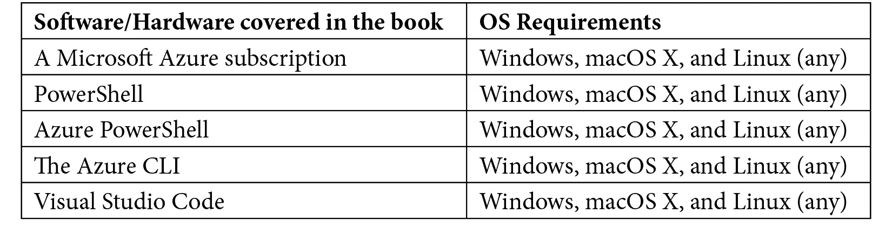

# 前言

安全始终是云平台的一部分，这使得用户放松警惕，认为云安全是理所当然的。云计算带来了新的安全挑战，但你可以通过 Microsoft Azure 的共享责任模型克服这些挑战。

*掌握 Azure 安全*介绍了 Microsoft 提供的最新安全功能，以识别不同的威胁并使用创新技术保护你的 Azure 云。 本书带你深入了解 Azure 提供的内建安全控制和多层次的安全功能，用于保护跨应用程序和网络的云工作负载。你将学习如何使用 Azure 安全中心进行统一的安全管理，在 Azure 上构建安全的应用程序，保护云免受 DDoS 攻击，通过 Azure Key Vault 保护敏感信息等等。此外，本书还涵盖了 Azure Sentinel、监控和审计、Azure 安全与治理最佳实践以及安全资源部署等内容。

到本书结束时，你将建立起扎实的云端网络安全基础，能够在 Microsoft Azure 中设计安全的解决方案。

# 本书适合谁阅读？

本书适合 Azure 云计算专业人员、Azure 架构师和希望利用 Azure 安全中心以及其他 Azure 安全功能来实施安全云服务的安全专家。对安全概念的基本理解以及对 Azure 云的先前接触将有助于理解本书中介绍的关键概念。

# 本书内容概述

*第一章*，*Azure 安全概述*，介绍了云计算如何改变 IT 的概念，安全性也不例外。网络安全在云端需要采用不同的方式，我们需要理解这些差异、新的威胁，以及如何应对它们。

*第二章*，*治理与安全*，讲解了如何在 Microsoft Azure 中创建政策和规则，以便制定标准、执行这些政策和规则，并保持质量水平。

*第三章*，*管理云身份*，解释了为什么身份是安全中最重要的部分之一。在云端，身份的表现比以往任何时候都更加重要。你将学习如何在 Microsoft Azure 中保持身份安全，如何跟踪访问权限并监控用户行为中的任何异常。

*第四章*，*Azure 网络安全*，介绍了网络在任何环境中都是第一道防线。确保资源安全且不易被攻击者接触是安全性的一个重要方面。你将学习如何通过 Microsoft Azure 的内建工具或自定义工具实现这一目标。

*第五章*，*Azure KeyVault*，解释了如何在 Azure 中管理机密和证书，并以安全的方式通过基础设施即代码（Infrastructure as Code）将资源部署到 Microsoft Azure。

*第六章*，*数据安全*，介绍了如何使用 Microsoft 或自己的加密密钥对云中的数据进行额外加密来保护数据。

*第七章*，*Azure 安全中心*，解释了如何使用 ASC 检测 Microsoft Azure 中的威胁，以及如何查看评估、报告和建议，以增强 Azure 租户的安全性。它还探讨了通过启用即时访问来提高虚拟机安全性。

*第八章*，*Azure Sentinel*，介绍了如何使用 Azure Sentinel 来监控 Azure 及本地资源的安全，包括在威胁发生前进行检测，并使用人工智能分析和调查威胁。还介绍了如何利用 Azure Sentinel 自动化响应安全威胁并立即加以阻止。

*第九章*，*安全最佳实践*，介绍了 Azure 安全的最佳实践，包括如何设置一个坚不可摧的 Azure 环境，找到 Azure 中隐藏的安全功能，以及其他可能帮助你提高 Microsoft Azure 安全性的工具。

# 为了最大限度地发挥本书的作用

你需要以下软件，这些软件是开源并且免费使用的，除了 Microsoft Azure，它是基于订阅的，按使用时长收费。然而，即使是 Microsoft Azure，也可以使用试用订阅。



如果你正在使用本书的数字版，我们建议你自己输入代码或通过 GitHub 仓库访问代码（链接将在下一节提供）。这样可以帮助你避免与复制/粘贴代码相关的潜在错误。

# 下载示例代码文件

你可以通过访问[www.packt.com](http://www.packt.com)来从你的账户下载本书的示例代码文件。如果你是从其他地方购买的本书，可以访问[www.packtpub.com/support](http://www.packtpub.com/support)并注册，文件会直接通过电子邮件发送给你。

你可以通过以下步骤下载代码文件：

1.  登录或在[www.packt.com](http://www.packt.com)注册。

1.  选择**支持**选项卡。

1.  点击**代码下载**。

1.  在**搜索**框中输入书名，并按照屏幕上的说明操作。

下载文件后，请确保使用以下最新版本的工具解压或提取文件夹：

+   WinRAR/7-Zip for Windows

+   Zipeg/iZip/UnRarX for Mac

+   7-Zip/PeaZip for Linux

本书的代码包也托管在 GitHub 上：[`github.com/PacktPublishing/Mastering-Azure-Security`](https://github.com/PacktPublishing/Mastering-Azure-Security)。如果代码有更新，现有的 GitHub 仓库会进行更新。

我们还提供其他来自丰富目录的书籍和视频的代码包，您可以在[`github.com/PacktPublishing/`](https://github.com/PacktPublishing/)查看。

# 下载彩色图像

我们还提供了一个包含本书中使用的截图/图表的彩色图像的 PDF 文件。您可以在这里下载：[`www.packtpub.com/sites/default/files/downloads/9781839218996_ColorImages.pdf`](http://www.packtpub.com/sites/default/files/downloads/9781839218996_ColorImages.pdf)。

# 使用的约定

本书中使用了多种文本约定。

`文本中的代码`：表示文本中的代码词、数据库表名、文件夹名称、文件名、文件扩展名、路径名、虚拟 URL、用户输入以及 Twitter 用户名。以下是一个示例：“如何创建一个规则以拒绝通过端口 22 的流量”

一段代码如下所示：

```
"policyRule": {
"if": {
      	"not": {
                	"field": "location",
"in": "[parameters('allowedLocations')]"
}
},
"then": {
      	"effect": "deny"
}
}
```

任何命令行输入或输出均按如下方式编写：

```
New-AzResourceGroup -Name "Packt-Security" -Location ` "westeurope"
```

**粗体**：表示新术语、重要词汇或您在屏幕上看到的词汇。例如，菜单或对话框中的词汇在文本中会以这种方式出现。以下是一个示例：“转到**子网**部分下的**NSG**并选择**关联**。”

提示或重要说明

看起来是这样的。

# 联系我们

我们始终欢迎读者的反馈。

**一般反馈**：如果您对本书的任何内容有疑问，请在邮件主题中提到书名，并通过邮件联系我们：customercare@packtpub.com。

**勘误**：虽然我们已尽一切努力确保内容的准确性，但错误仍然可能发生。如果您在本书中发现任何错误，我们将非常感激您能向我们报告。请访问[www.packtpub.com/support/errata](http://www.packtpub.com/support/errata)，选择您的书籍，点击“勘误提交表格”链接并输入详细信息。

**盗版**：如果您在互联网上遇到我们作品的任何非法复制品，我们将感激您提供其位置地址或网站名称。请通过版权@packt.com 与我们联系，并提供该材料的链接。

**如果您有兴趣成为作者**：如果您在某个领域有专长，并且有兴趣写书或参与书籍的编写，请访问[authors.packtpub.com](http://authors.packtpub.com)。

# 评论

请留下评论。当您阅读并使用完本书后，为什么不在您购买书籍的网站上留下评论呢？潜在读者可以看到并利用您的公正意见做出购买决策，我们在 Packt 能够了解您对我们产品的看法，而我们的作者也能看到您对其书籍的反馈。谢谢！

欲了解更多关于 Packt 的信息，请访问 [packt.com](http://packt.com)。
