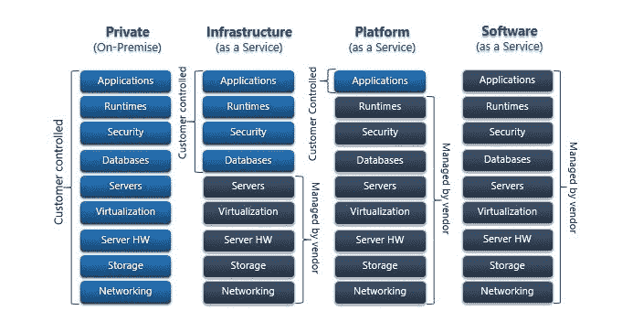
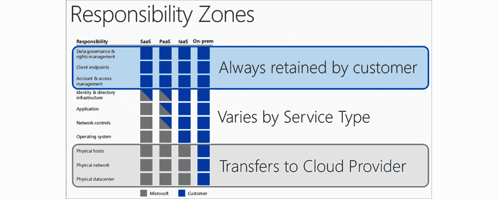
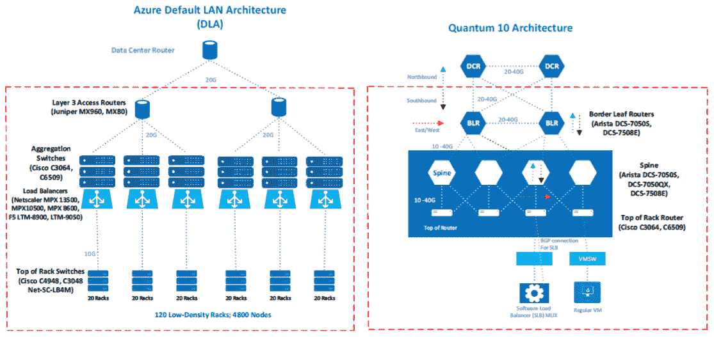

# 第一章：*第一章*: Azure 安全概述

当云计算成为讨论话题时，安全通常是最主要的议题。当数据离开本地数据中心时，许多人会担心它会发生什么。我们习惯于对所有事物拥有完全控制权，从物理服务器、网络、虚拟机管理程序，到应用程序和数据。然后，突然间，我们需要将这些控制权转交给他人。刚开始时自然会感到一些紧张和不信任，但如果深入思考，我们会发现云计算实际上能为我们提供比我们自己做得更好的安全性。

Microsoft Azure 是通过 Microsoft 管理的数据中心提供的云计算服务，这些数据中心分布在全球各地。Azure 数据中心建设符合行业顶级标准，并遵守所有相关认证机构的要求，如 ISO/IEC 27001:2013 和 NIST SP 800-53 等。这些标准保证了 Microsoft Azure 的安全性和可靠性。

本章我们将学习 Azure 安全概念，以及 Microsoft Azure 数据中心中的安全结构，涵盖以下主题：

+   探索共享责任模型

+   物理安全

+   Azure 网络

+   Azure 基础设施的可用性

+   Azure 基础设施的完整性

+   Azure 基础设施监控

+   理解 Azure 安全基础

# 探索共享责任模型

虽然 Microsoft Azure 非常安全，但构建安全环境的责任并不单单由 Microsoft 承担。其共享责任模型将责任分配给 Microsoft 和其客户。

在我们讨论哪个方负责安全的哪个方面之前，我们需要先了解云服务模型。基本的模型有三种：

+   **基础设施即服务** (**IaaS**)

+   **平台即服务** (**PaaS**)

+   **软件即服务** (**SaaS**)

这些模型在 Microsoft 和客户控制的内容上有所不同。可以从以下图示中看到一般的分配情况：

图 1.1 – 基本云服务模型

让我们更详细地看一下这些服务：

## 本地环境

在本地环境中，我们作为用户需要负责所有事项：网络、物理服务器、存储等等。我们需要设置虚拟化堆栈（如果使用的话），配置和维护服务器，安装和维护软件，管理数据库等。最重要的是，所有安全相关的事宜都由我们负责：物理安全、网络安全、主机和操作系统安全，以及运行在我们服务器上的应用程序安全。

## 基础设施即服务

在 IaaS 模型下，Microsoft 承担了部分责任。我们只需要负责数据、运行时、应用程序以及一些安全方面的内容，稍后我们会进一步讨论。Microsoft Azure 中的一个 IaaS 产品示例是 Azure **虚拟机** (**VM**)。

## 平台即服务

PaaS（平台即服务）将更多责任交给微软。我们只负责管理我们的应用程序。然而，这仍然意味着我们需要照管一部分安全内容。微软 Azure 中的一些 PaaS 示例包括 Azure SQL 数据库和 Web 应用。

## 软件即服务

SaaS（软件即服务）将大量控制权交给客户，而我们管理的非常少，包括部分安全方面。在微软的生态系统中，SaaS 的一个常见例子是 Office365；然而，我们在本书中不会讨论这一点。

现在我们对共享责任有了基本的了解，接下来让我们理解如何分配安全责任。

## 共享责任模型中的安全划分

共享责任模型将安全划分为三个区域：

+   始终由客户控制

+   始终由微软控制

+   根据服务类型而异

无论采用何种云服务模型，客户始终会保留以下安全责任：

+   数据治理与权限管理

+   终端

+   账户和访问管理

同样，微软始终负责以下安全事务，无论其云服务模型是什么：

+   物理数据中心

+   物理网络

+   物理主机

最后，根据云服务模型，会有一些安全责任的分配：

+   身份与目录基础设施

+   应用程序

+   网络

+   操作系统

不同云服务模型下的责任分配，如下图所示：

图 1.2 – 不同云服务模型下客户与服务提供商的责任分配（图片来源：微软，许可证：MIT）

现在我们了解了安全是如何划分的，接下来让我们专注于其中一个特定方面：微软管理的物理安全。这个部分很重要，因为我们在接下来的章节中不会详细讨论它。

# 物理安全

一切始于物理安全。无论我们采取何种措施来保护数据免受来自网络外部的攻击，如果有人进入数据中心或服务器机房，拿走我们服务器上的硬盘，那么一切都会是徒劳的。微软非常重视物理安全，以减少未经授权访问数据和数据中心资源的风险。

只有通过严格定义的接入点才能访问 Azure 数据中心。设施的外围被钢筋混凝土的高围栏保护。为了进入 Azure 数据中心，个人需要经过至少两个检查点：首先进入设施的外围，其次进入大楼。这两个检查点都由专业的训练有素的安保人员值守。除了接入点外，安保人员还会巡逻设施的外围。该设施及其建筑物都受到视频监控，且由安保人员进行监控。

进入大楼后，需要进行带有生物识别的双重身份验证才能访问数据中心内部。如果身份验证通过，个人只能访问已批准的部分区域。批准不仅定义了可以访问的区域，还定义了可以在这些区域内停留的时间。它还严格规定了是否可以单独访问这些区域，或者是否需要由他人陪同。

在进入数据中心内部的每个区域之前，必须进行金属探测器检查。为了防止未经授权的数据进出数据中心，只允许使用批准的设备。此外，所有服务器机架都会通过视频监控对前后进行监控。当离开数据中心区域时，还需要进行额外的金属探测器筛查。这有助于微软确保没有未经授权的物品被带入或从数据中心中取出，从而危及其数据的安全。

所有设施都会定期进行物理安全审查，确保始终满足所有的安全要求。

设备达到使用寿命后，会以安全的方式处置，并有严格的数据和硬件处置政策。在处置过程中，微软工作人员会确保数据不被不可信的第三方获取。所有数据设备要么被清除（如果可能），要么被物理摧毁，以确保无法恢复任何信息。

所有微软 Azure 数据中心的设计、建设和运营都符合行业最高标准，如 ISO 27001、HIPAA、FedRAMP、SOC 1 和 SOC 2 等。此外，许多情况下还会遵循特定地区或国家的标准，如澳大利亚 IRAP、英国 GCloud 和新加坡 MTCS 等。

作为额外的预防措施，所有微软 Azure 数据中心中的数据在静止状态下都会进行加密。即使有人设法获取了包含客户数据的磁盘（虽然所有的安全措施几乎让这种情况不可能发生），要解密任何数据也需要巨大的努力（无论是从财务还是时间的角度来看）。

但是在云时代，网络安全和物理安全同样重要，甚至可能更重要。大多数服务是通过互联网访问的，即便是隔离的服务也依赖于网络层。因此，接下来我们需要了解 Azure 网络架构。

# Azure 网络

Azure 网络可以分为两部分：微软管理的部分和我们管理的部分。在本节中，我们将讨论微软管理的网络部分。了解这一部分的架构、可靠性和安全设置非常重要，这为我们后续讨论需要管理的网络安全部分提供了更多背景信息。

与 Azure 数据中心通常的做法一样，Azure 网络遵循行业标准，采用三个不同的模型/层级：

+   核心

+   分发

+   访问

三种模型使用不同的硬件，以便完全分离所有层级。核心层使用数据中心路由器，分发层使用接入路由器和 L2 聚合（此层将 L3 路由与 L2 交换分开），接入层使用 L2 交换机。

Azure 网络架构包括两个层次的 L2 交换机：

+   **第一层**：聚合流量

+   **第二层**：循环以纳入冗余

这种方法提供了更大的灵活性和更好的端口扩展能力。另一个好处是，L2 和 L3 完全分开，这使得每一层可以使用不同的硬件。不同的硬件减少了一个层级出现故障时影响到其他层的可能性。使用 trunk 允许资源共享，以实现更好的连接性。

Azure 数据中心内部的网络被分为多个集群，以便更好地进行控制、扩展和容错。每个 Azure 集群中的网络由以下设备组成：

+   路由器

+   交换机

+   数字 CMs

+   配电单元

路由器可以分为三组：数据中心路由器、接入路由器和边缘叶路由器。交换机是聚合交换机或机架顶端交换机。

需要特别提到的是，Azure 数据中心有两种不同的网络架构 —— **默认局域网架构** (**DLA**) 和 **量子 10 架构** (**Q10**)。

DLA 被一些现有客户和共享服务使用，主要在一些较早的 Azure 区域。Q10 用于较新的 Azure 数据中心和虚拟客户。DLA 使用经典的树形设计，配有主动/被动接入路由器。Q10 使用紧凑的网状设计。这些架构之间的主要区别在于 **访问控制** **列表** (**ACLs**) 的应用方式。在 DLA 中，ACLs 被直接应用到接入路由器上。Q10 不在路由层应用 ACLs，而是在其下一级，使用软件定义网络 (SDN)，结合 **软件** **负载** **均衡** (**SLBs**) 和软件定义 VLANs。

Q10 的主要优势在于其更强的能力和扩展现有基础设施的能力。Q10 的另一个优势是软件定义网络能够处理一些安全特性，例如 **网络** **地址** **转换** (**NAT**)。

以下图表展示了 DLA 和 Q10 两种架构：

图 1.3 – DLA 和量子 10 架构（图像来自 Microsoft，许可：MIT）

Azure 网络是基于每个 Azure 数据中心内高度冗余的基础设施构建的。实施的冗余为**需求加一**（**N+1**）或更好，并且在 Azure 数据中心内外具有完整的故障转移功能。完整的故障转移容忍度确保了持续的网络和服务可用性。从外部看，Azure 数据中心通过专用的高带宽网络电路互联，这些电路冗余地连接到全球超过 1,200 个**互联网服务提供商**（**ISP**）。网络的边缘容量超过 2,000 GBps，展现了巨大的网络潜力。

**分布式拒绝服务**（**DDoS**）正成为服务可用性方面的一个重大问题。随着云服务数量的增加，DDoS 攻击变得更加有针对性且复杂。借助地理分布和快速检测，微软可以帮助您缓解这些 DDoS 攻击并最小化其影响。让我们更详细地了解这一点。

# Azure 基础设施的可用性

Azure 的设计、建设和运营旨在提供高可用性和可靠性的基础设施。持续实施改进，以提高可用性和可靠性，同时提升效率和可扩展性。提供更安全、更可信的云服务始终是优先事项。

不间断电源和大量电池组确保在短期电力中断的情况下，电力流保持不中断。在长期电力中断的情况下，应急发电机可以提供数天的备用电力。应急发电机用于长时间停电或计划性维护的情况下。在自然灾害发生时，当外部电力供应长时间无法提供时，每个 Azure 数据中心都备有现场燃料储备。

强大且高速的光纤网络将数据中心连接到主要枢纽。重要的是，除了通过主要枢纽连接外，数据中心之间也需要直接互联。所有内容都分布到节点中，这些节点托管更靠近用户的工作负载，以减少延迟、提供地理冗余并增强弹性。

Azure 中的数据可以放置在两个不同的位置：主位置和次位置。客户可以选择主位置和次位置的位置。次位置是备用站点。在每个位置，无论是主位置还是次位置，Azure 始终保持三个健康的数据副本。这意味着数据在任何时候都有六个副本。如果任何数据副本在任何时候变得不可用，它会立即被声明为无效，创建一个新副本，并销毁旧副本。

微软通过持续的监控、事件响应和服务支持来确保高可用性和可靠性。每个 Azure 数据中心全天候运营，确保一切正常运行，所有服务随时可用。当然，“随时可用”是一个目标，最终是无法完全实现的。有很多因素可能影响正常运行时间，有时无法控制所有这些因素。实际上，目标是实现最佳的**服务水平协议**（**SLA**），并确保潜在的停机时间尽可能小。SLA 可以根据多个因素变化，并且每个服务和配置的 SLA 都不同。如果我们考虑到所有可以控制的因素，那么我们可以达到的最佳 SLA 为 99.99%，也就是所谓的“四个九”。

与基础设施可用性密切相关的是基础设施完整性。完整性影响部署的可用性条款，所有步骤必须从不同角度进行验证。新的部署不能引起任何停机或以任何方式影响现有服务。

# Azure 基础设施完整性

所有安装在 Azure 环境中的软件组件都是定制构建的。这当然指的是由微软作为 Azure 服务架构一部分安装和管理的软件。定制软件是使用微软的**安全** **开发** **生命周期**（**SDL**）过程构建的，包括操作系统镜像和 SQL 数据库。所有软件部署都在严格定义的变更管理和发布管理过程中进行。所有节点和 Fabric 控制器都使用定制版本的 Windows Server 2012。禁止安装任何未经授权的软件。

在 Azure 中运行的虚拟机（VM）被分组到集群中。每个集群包含大约 1,000 个虚拟机。所有虚拟机都由**Fabric** **Controller**（**FC**）进行管理。FC 是可扩展且冗余的。每个 FC 负责其所在集群中应用程序的生命周期管理。这包括该集群硬件的配置和监控。如果任何服务器发生故障，FC 会自动重建该服务器的新实例。

每个 Azure 软件组件都经过构建过程（作为发布管理过程的一部分），其中包括使用终端保护杀毒工具进行病毒扫描。在每个软件组件经过此过程时，只有通过清洁的病毒扫描后，才会进入生产环境。在发布管理过程中，所有组件都要经过构建过程。在此过程中，会执行一次病毒扫描。每次病毒扫描都会在构建目录中生成日志，如果检测到任何问题，该组件的过程将被冻结。对于检测到问题的软件组件，微软安全团队会进行检查，以确定具体问题。

Azure 是一个封闭且受限的环境。所有节点和虚拟机的默认 Windows 管理员账户都已被禁用。也不会在任何节点或虚拟机上直接创建用户账户。只有在获得适当授权的情况下，Azure 支持的管理员才能连接到它们，进行维护任务和紧急修复。

尽管采取了所有预防措施以确保最大程度的可用性和安全性，事件仍然可能会发生。为了尽早检测并减轻这些问题，Microsoft 实施了监控和事件管理。

# Azure 基础设施监控

Azure 数据中心的所有硬件、软件和网络设备都会不断进行审查和更新。审查和更新至少每年强制执行一次，但根据需要会进行额外的审查和更新。任何更改（硬件、软件或网络）都必须通过发布管理流程，且需要在开发和测试环境中开发、测试并批准后才能发布到生产环境。在此过程中，所有更改必须经过 Azure 安全和合规团队的审查和批准。

所有 Azure 数据中心都使用集成的部署系统来分发和安装 Microsoft 提供的所有软件的安全更新。如果使用第三方软件，客户或软件制造商负责安全更新，具体取决于软件的提供和使用方式。例如，如果第三方软件是通过 Azure Marketplace 安装的，则制造商负责提供更新。如果软件是手动安装的，则由具体软件决定。对于 Microsoft 软件，Microsoft 内部有一个专门的团队——**Microsoft 安全响应中心**，负责 24/7/365 全天候监控和识别任何安全事件。此外，任何事件必须在最短的时间内解决。

Azure 基础设施（服务器、数据库和网络）每季度至少进行一次漏洞扫描。如果出现特定问题或事件，漏洞扫描的频率会更高。Microsoft 进行渗透测试，还聘请独立顾问进行渗透测试。这确保没有任何问题被遗漏。一旦发现安全问题，立即处理，以提高安全性并阻止任何漏洞被利用。

如果发生任何安全问题，Microsoft 已经设立了事件管理机制。如果 Microsoft 发现安全问题，它将采取以下措施：

1.  客户会被通知该事件。

1.  将立即启动调查，以提供有关安全事件的详细信息。

1.  采取措施减轻安全事件的影响，并尽量减少损失。

事件管理有明确的定义，以便及时管理、升级和解决所有安全事件。

# 了解 Azure 安全基础

总的来说，我们可以看到，通过微软 Azure，云计算可以是非常安全的。但理解共享责任模型也非常重要。仅仅将应用程序和数据放入云中，并不能使其变得安全。微软提供了部分安全措施，并确保物理和网络安全到位。客户必须承担部分责任，并确保在自己这一方采取正确的措施。

比如说，假设我们将数据库和应用程序放在微软 Azure 中，但我们的应用程序容易受到 SQL 注入攻击（这仍然是一种非常常见的数据泄露方式）。如果我们的数据被泄露，我们能怪微软吗？

假设更加极端一点，我们公开暴露了端点，且忘记实施任何形式的身份验证。这是微软的责任吗？

如果我们看看微软在 Azure 数据中心提供的物理和网络安全水平，没有多少组织能说他们在本地数据中心具备同样的水平。更多时候，物理安全完全被忽视。服务器机房不安全，访问控制不到位，很多时候甚至没有专门的服务器机房，而只是一些服务器架子放在某个角落或走廊里。即使有服务器机房上了锁，也没有任何管理变更措施，没人控制或审查谁进入了服务器机房以及为什么进入。另一方面，微软在他们的数据中心实施了顶级的安全措施。所有一切都在持续监控中，任何访问都需要批准和审查。即使有些事情被遗漏，所有数据依然被加密并且额外安全保护。根据我的经验，这也是大多数组织不会去做的事情。

网络安全方面也可以说类似的事情。在大多数组织中，防火墙后几乎所有的网络安全措施都没有了。网络通常没有进行分段，内部没有流量控制，等等。路由和流量转发是基础的，或者根本不存在。微软 Azure 很好地解决了这些问题，帮助我们为我们的资源提供安全的网络。

但是，即使微软处理了所有安全组件，这也只是一个开始。通过使用微软 Azure，我们可以实现比本地数据中心更好的物理和网络安全，并且我们可以集中精力处理其他事情。

共享责任模型在不同的云服务模型中有不同的责任，且有时并不清晰需要做什么。幸运的是，即使这些安全部分不是微软的责任，Azure 中仍然有许多安全服务可用。许多 Azure 服务的唯一目的是解决安全问题，帮助我们保护 Azure 数据中心中的数据和资源。再者，事情并不止步于此。即使这些服务与安全无关，Azure 的大多数服务也内置了某种安全功能。微软非常重视安全，并使我们能够使用许多不同的工具来保障资源的安全。

可用的工具各不相同，从通过启用多个选项帮助我们增加安全性的工具，到有大量配置选项帮助我们设计安全性的工具，再到监控我们 Azure 资源并提供我们需要实施的安全建议的工具。某些 Azure 工具使用机器学习帮助我们实时检测安全事件，甚至在事件发生之前就能发现。

本书将涵盖微软 Azure 安全性的各个方面，从治理和身份，到网络和数据保护，再到高级工具。最终目标是理解云安全，学习如何结合不同的工具最大化安全性，最终掌握 Azure 安全！

# 总结

本章最重要的教训是理解 Azure 中的共享责任模型。微软负责一些安全部分，特别是在物理安全方面，但我们需要负责其余部分。

在 Azure 网络、完整性、可用性和监控方面，我们没有影响力，无法做出任何更改（至少在我们讨论的部分是如此）。然而，这些内容非常重要，因为我们可以在可管理的安全部分应用许多东西。它们还将提供更多背景信息，帮助我们更好地理解 Azure 中完整的安全设置。

在下一章中，我们将讨论身份，它是安全性最重要的支柱之一。在 Azure 中，身份甚至更为重要，因为大多数服务是通过互联网进行管理和访问的。因此，我们需要采取额外的步骤，确保身份和访问的安全，做到万无一失。

# 问题

1.  在云中，谁负责安全？

    A. 用户

    B. 云服务提供商

    C. 责任是共享的

1.  根据共享责任模型，谁负责物理主机的安全？

    A. 用户

    B. 云服务提供商

    C. 两者皆是

1.  根据共享责任模型，谁负责物理网络？

    A. 用户

    B. 云服务提供商

    C. 取决于服务模型

1.  根据共享责任模型，谁负责网络控制？

    A. 用户

    B. 云服务提供商

    C. 取决于服务模型

1.  根据共享责任模型，谁负责数据治理？

    A. 用户

    B. 云服务提供商

    C. 取决于服务模型

1.  Azure 网络使用的是哪种架构？

    A. DLA

    B. Quantum 10 (Q10)

    C. 两者都可以，但 DLA 正在替代 Q10

    D. 两者都可以，但 Q10 正在替代 DLA

1.  在发生安全事件时，第一步是什么？

    A. 立即调查

    B. 缓解

    C. 通知客户
