# 第二章：*第二章*: 治理与安全

在深入研究帮助保护和保障 Azure 云环境的技术特性之前，我们首先需要停下来，反思、规划并据此行动。治理至关重要，云中需要有护栏。谈到云计算时，客户往往会表现出一种 *开始行动* 的心态。这很好，但在云中，也需要有规则。除此之外，你当然不希望最后得到一个完全不适合你公司需求的云构架，对吧？

本章旨在帮助你设计一个安全的云战略基础，并根据你的计划采取行动，我们将引导你通过以下主题：

+   理解 Azure 中的治理

+   运用常识避免错误

+   使用管理锁

+   使用管理组进行治理

+   理解 Azure 策略

+   定义 Azure 蓝图

+   Azure 资源图

# 理解 Azure 中的治理

如果我们深入研究治理的实际含义，我们可以在在线商业词典中找到一个很好的定义。这个定义的第一部分如下：

**由组织治理机构成员制定政策，并持续监控其正确实施。**

要阅读完整定义，请访问以下链接：[`www.businessdictionary.com/definition/governance.html`](http://www.businessdictionary.com/definition/governance.html)

这个定义中最重要的词是 *政策*、*监控* 和 *实施*。如果你将 *实施* 换成 *部署*，你会得到三个对安全至关重要的方面。所以，你可以说治理对安全至关重要！

现实生活中适用的规则，在 IT 领域也是适用的。我说的是规则。规则只有在通过 *政策* 强制执行时才会真正有效。你可以告诉管理员他们不能做什么。但如果他们能够做不该做的事，依然有可能不小心违反你的规则。所以，你需要定义一些政策，帮助你执行或监控公司规则。

*监控* 是安全中第二个重要的部分。如果你看不到发生了什么，就没有机会做出反应或做出正确的决策。这就是为什么监控如此重要且不可避免的原因。在后续章节中，我们将介绍一些适用于 Azure 的监控最佳实践，帮助你获取适量的信息以应对环境的需求。

最后是*实施*。你可以使用 Azure 门户手动部署 Azure 资源。然而，采用这种方法时，你肯定需要一套严格的策略来执行你的规则，确保手动部署不会破坏这些规则。如果你希望确保所有环境都严格遵守你的规则，自动化部署是你应该采用的方式。通过制定强有力的治理计划、实施策略和**基于角色的访问控制**（**RBAC**），并通过像 Azure DevOps 这样的 DevOps 管道进行部署，你可以确保你的部署和目标环境的一致性。然后，如果你确保环境中的所有更改只能通过你的 DevOps 管道工具进行，而不能通过 Azure 门户手动进行，你就能保护你的环境免受意外更改的影响。你可以使用 PowerShell 进行*命令式*部署，使用 **Azure 资源管理器**（**ARM**）模板和 Terraform 进行*声明式*部署。无论哪个最适合你的需求，使用它！

重要说明：不同的部署模型

如果你使用像 PowerShell 这样的命令式脚本语言来部署资源，你需要明确描述为了获取所需的基础设施，应该做哪些事情。你需要按正确的顺序定义步骤。而对于像 ARM 模板或 Terraform 这样的声明式语言，你只需描述需要部署到目标环境的资源，因此这里关注的不是*如何*做，而是*做什么*。本书稍后会提供这些语言的示例。

使用 Azure 和云计算时，我们需要在安全性和管理方面采用新的方法，一方面，另一方面，仍然有一些传统的、已有数十年历史的行业原则是有效的。其中就有最小权限原则（POLP）。该原则规定程序或用户应只拥有完成任务所必需的最少权限。

职责分离（SoD）是一个即使在云时代依然有效的原则。SoD 是指完成某项任务需要不止一个人的概念。例如，你可能有一个团队负责在 Azure Active Directory 中创建和管理帐户，但另一个团队负责 Office 365 管理，因此也负责创建用户邮箱。第三个团队可能负责管理 Azure 资源。在这个资源团队中，有管理员负责管理数据库，其他人负责管理网络，还有一些虚拟机专家专注于计算资源的管理。SoD 也是多步审批的一部分。例如，当你的管理员申请他们有资格获得的角色时，必须由其他人批准该请求：

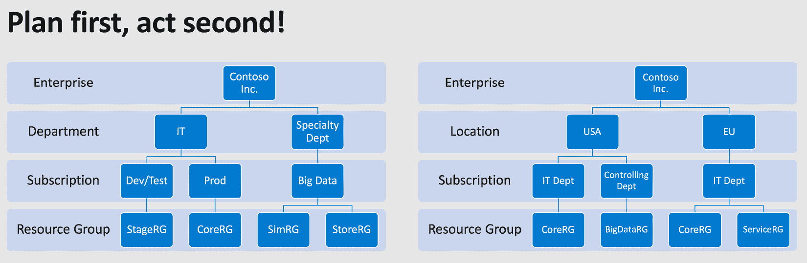

图 2.1 – 先规划，后执行 – 定义可能的 Azure 层级结构

在开始使用 Microsoft Azure 云服务时，首先要做的是规划你的 Azure 层次结构，这描述了 Azure 订阅、租户和目录在企业环境中是如何相互依赖的。目的是为一个企业拥有一个合同，但有多个 Azure 订阅。每个 Azure 订阅都与一个 Azure Active Directory 租户绑定（理想情况下，你应该只有一个！）。你可能想按位置划分公司，例如欧洲和北美。或者，你可能希望按部门划分公司，例如 IT 部门和财务部门。你也可以选择两者都做——甚至可以选择其他层次结构。无论什么最适合你的需求，都应该在实际开始之前完成。高层次的层次结构模式有三种：*职能型*，即基于企业部门（如 IT 和会计）创建订阅；*业务单元型*，可以用来区分业务单元，如航空航天和汽车行业；以及*地理型*，即根据公司地理位置创建订阅。你选择的层次结构应该与你企业的管理需求和地理位置相匹配，以便在根据公司需求授予访问权限和计费时提供支持。

现在你已经知道了治理是什么以及它为何重要，让我们继续看看有哪些工具可以帮助我们简化治理和安全方面的工作。

# 运用常识避免错误

我常常被问到，如何确保 Azure 管理员不会不小心删除云中的生产资源。除了下一节将要讨论的技术功能之外，答案是*常识*非常有帮助！你不会不小心走进本地数据中心，把你的服务器从机架上拉出来并把它扔出窗外，对吧？你通常不会对 Hyper-V 农场运行一个*一键清除*脚本，然后等到当天稍后才意识到所有虚拟机都不见了吧？而且你肯定不会不小心删除你的生产 SAN！在 Azure 中，你不可能不小心删除一个资源组。

嗯，如果你不小心确认了“你确定吗？”对话框，然后不小心将资源组的名称输入到提示框中，那么是可以的。资源甚至更容易被删除——无论是偶然还是故意的。因此，我们需要一些方法来帮助我们减少事故的风险。常识和良好的谨慎态度是云治理成功的第一步。

然而，即使小心谨慎，您仍然可能不小心删除不该删除的东西。例如，您可能会不小心删除单个资源，如存储账户、密钥保管库或其他任何资源。我记得大约 10 年前的一个夏日下午，我在一块小型硬件主板上运行 Linux 防火墙发行版，它和今天的 Raspberry Pi 类似。我将这块小硬件作为我的家庭防火墙解决方案，它做得非常出色。它有三个局域网连接，连接到三个不同的网络，甚至还有一个 Wi-Fi 模块，并且操作系统安装在 CF 卡上。只有 RAM 是有限的，由于 CF 卡专门用于操作系统安装，所有日志都写入了 RAM 磁盘。因此，我必须定期从 `/var/log/*` 目录中删除日志文件。我不想启用日志轮转，而是希望将日志导出到我环境中的另一台 Linux 服务器。好吧，长话短说，我可以告诉你，运行以下命令时，拥有提升权限的情况下效果相当不错——即使你没有将工作目录切换到预期的目录：

```
rm -rf *
```

所以，我又有一个星期六下午重新安装和重新配置防火墙。下次，行动之前要三思而后行！教训得到了。

在下一节中，我们将探讨一个技术功能，用于防止管理员不小心删除 Azure 资源。

# 使用管理锁

当然，也有一个技术功能可以防止您不小心删除 Azure 上的任何内容——一个叫做 *管理锁* 的功能。Azure 中有两种不同类型的锁：

+   *删除*锁确保没有人能够不小心或故意删除您 Azure 订阅中的资源。授权用户仍然可以读取和修改资源，但他们不再能够删除它。

+   *只读*锁确保只有授权用户能够读取资源，同时确保他们无法修改或删除资源。

在我创建的每个订阅中，我通常使用一个**核心资源组**，将跨多个资源组使用的资源部署到该资源组中。例如，如果我有一个虚拟网络，它被整个订阅中的多个服务使用，或者我有一个密钥保管库，用于存储作为机密的管理员凭证，那么这些资源就会被创建在我的核心资源组之一中。正如您所想象的那样，那里的资源非常重要，因此我总是在这个核心资源组的范围内使用删除锁。

在本章讨论范围时，我们讨论的是管理层次结构。锁、策略和访问权限始终应用于特定的范围，并且它们始终是从上到下应用的：


图 2.2 – 从上到下的 Azure 范围：管理组、订阅，

资源组和单个资源

如果在订阅级别创建锁定，它将适用于该订阅下的所有资源组以及所有资源。如果在资源组级别创建锁定，它只会应用于该资源组内的资源：

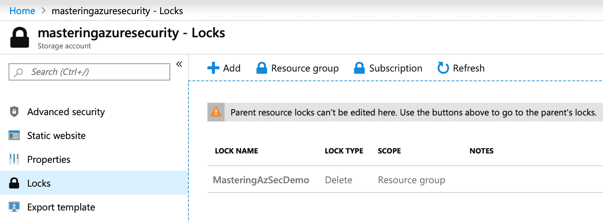

图 2.3 – Azure 资源组的管理锁定

为了演示，我在我的核心资源组之一中创建了一个存储账户 **masteringazuresecurity**。如果你在左侧管理窗格中选择了 **锁定**，你会看到有人在资源组级别创建了一个名为 **MasteringAzSecDemo** 的 **删除** 锁定。当你尝试删除该存储账户时，以下消息将会显示：

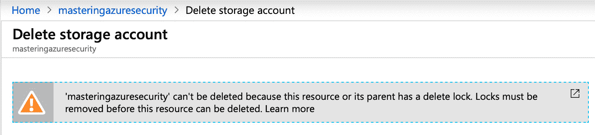

图 2.4 – 尝试删除被锁定资源时的警告消息

重要提示：

只有在你具有 `Microsoft.Authorization/*` 或 `Microsoft.Authorization/locks/*` 管理操作的访问权限时，才能创建或删除管理锁。在 Azure 中有几个内置角色，其中只有 *所有者* 和 *用户访问管理员* 才被授予这些特定的管理操作权限。

现在你已经了解了如何在 Azure 中使用管理锁定以及可以用来创建它们的范围。在下一节中，我们将探讨如何使用管理组，这是最重要的范围层次之一，以及如何利用它们来定义你的云治理。

# 使用管理组进行治理

如前所述，在治理、护栏、规则和政策方面，制定计划并遵守计划是至关重要的。使用多个订阅的组织需要一种高效的方式来管理所有订阅的访问、策略和合规规则。通过 Azure 管理组，我们可以在订阅级别之上提供一个范围层次：

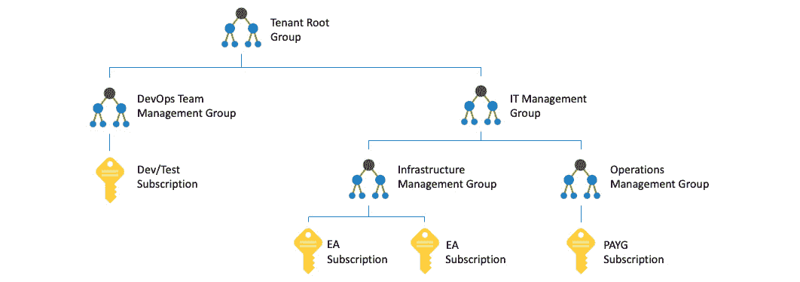

图 2.5 – 管理组层级结构示例

通过管理组，我们可以配置不同的管理范围，使我们能够轻松地管理所有治理设置，且无需太多精力。前面的图示展示了一个可能的管理组层级结构。如图所示，一个管理组可以包含多个订阅和其他管理组。该示例显示了一个层级结构，其中已创建并附加到不同管理组的几种类型的订阅。你可以在同一租户中拥有 **按需付费**（**PAYG**）订阅、**企业协议**（**EA**）订阅和**开发/测试**订阅，并将它们附加到任何管理组。

也许您希望确保在 Azure 中为生产环境创建的所有资源仅存储在欧洲的两个 Azure 区域，West Europe 和 North Europe。在这种情况下，您可以创建一个包含所有生产订阅的管理组，然后将策略应用于该管理组，以限制资源仅能在这些区域创建。管理组的另一个使用场景可能是为多个 Azure 订阅一次性提供用户访问权限，而不是为每个订阅单独管理访问权限。

每个 Azure AD 目录都有一个顶级管理组，称为根管理组。为该 Azure 租户创建的所有订阅和管理组都属于此根组。根管理组使客户能够创建适用于 Azure 租户范围内所有 Azure 订阅的全局策略和角色分配。

根组的默认显示名称是**租户根组**。以下是关于租户根组的一些重要信息，您应该了解：

+   只有在租户根组上被分配了*所有者*或*贡献者*角色的用户账户才能更改其显示名称。

+   根组不能被删除或移动到其他管理组。

+   在 Azure 层次结构中，所有订阅和管理组都归属于各自目录中的一个租户根组。每个目录只有一个租户根组，而所有其他管理组、订阅和资源都是此租户根组的子对象。换句话说，所有订阅中的所有资源都归属于租户根组以进行全局管理。新订阅在创建时会自动附加到租户根组。

+   没有任何人被默认赋予租户根组的访问权限。只有 Azure AD 全局管理员有权提升自己的权限以获取访问权限并在必要时进行更改。

您可能希望将安全管理员赋予对在 Azure AD 租户范围内创建的所有资源的只读访问权限，因为他们需要查看所有订阅和管理组。或者，您可能希望为所有 Azure 订阅提供应用程序访问权限；例如，自动部署资源或收集计费信息的能力。因此，您可能希望更改租户根组的某些设置，以便您只需管理一次访问权限。由于默认情况下没有人能够访问租户根组，您首先需要为 Azure AD 全局管理员提升访问权限。

当为 Azure AD 全局管理员提升访问权限时，在 Azure 中根范围（/）下为该账户分配了用户访问管理角色。在根范围下，此角色允许账户查看所有资源，并分配访问权限到整个目录下的任何订阅或管理组！

要提升访问权限，请执行以下步骤：

1.  作为全局管理员登录到 Azure 门户或 Azure Active Directory 管理中心。

1.  点击**Azure Active Directory**，然后在导航列表中点击**属性**：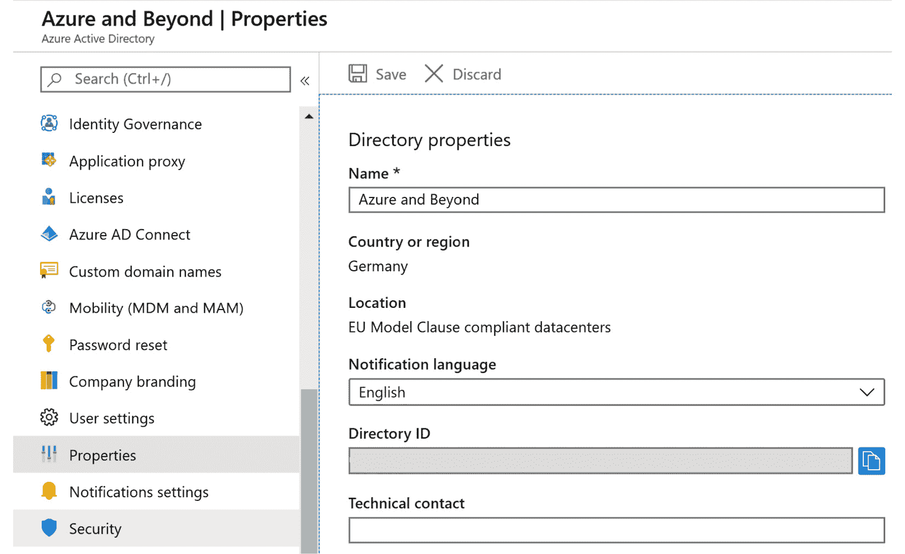

    图 2.6 – Azure Active Directory – 属性

1.  在**Azure 资源的访问管理**下，将切换按钮设置为**是**：

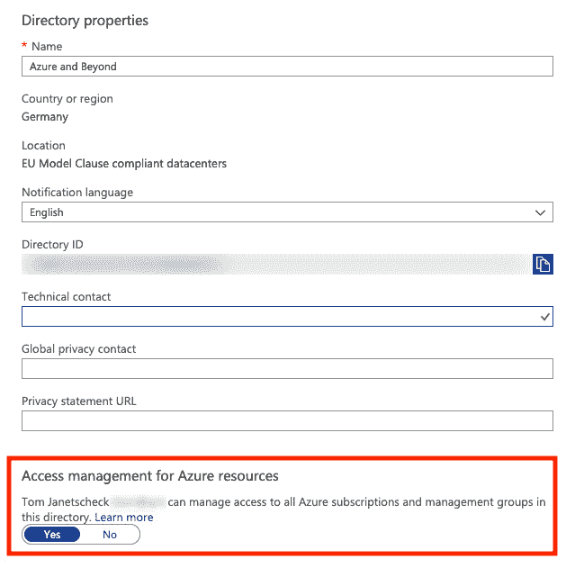

图 2.7 – 启用所有 Azure 资源的访问管理

提示

访问权限应始终尽可能严格，并且应仅在需要时授予。因此，在你对租户根组进行更改后，一定要移除提升的访问权限。

要移除提升的访问权限，可以将切换按钮从根范围的 `用户访问管理员` 角色分配恢复：

```
Remove-AzRoleAssignment -SignInName <username@example.com> `
  -RoleDefinitionName "User Access Administrator" -Scope "/"
```

重要提示：

为了能够执行此 PowerShell 命令，你需要安装最新版本的 Az PowerShell 模块。由于不能同时安装旧版的 AzureRM 和新版的 Az PowerShell 模块，你需要首先卸载 AzureRM 模块。有关更多信息，请参阅 [`docs.microsoft.com/en-us/powershell/azure`](https://docs.microsoft.com/en-us/powershell/azure)。

你刚刚学习了如何使用管理组进行治理。在接下来的章节中，我们将介绍 Azure Policy，它是一个强制执行规则的服务。

# 了解 Azure Policy

规则很重要，但为了确保它们不被违反，你需要监控它们的应用，或者强制执行它们。通过 Azure Policy，你可以使用一个服务来实现这两者。Azure Policy 允许你创建、分配和管理策略。你定义的策略强制执行在策略范围内创建的资源的不同规则。

Azure Policy 服务会评估资源是否违反已分配的策略，然后执行定义的操作。例如，你可能只希望允许 Azure 管理员在北欧和西欧的 Azure 区域中创建 Azure 资源，或者你可能只希望在某个 Azure 订阅中使用某一特定的 VM SKU 尺寸。在这些情况下，你可以创建一个策略。一旦这个策略被创建并激活，新的和现有的资源将会被评估是否符合政策要求。如果不符合要求，新的资源将被禁止创建，现有资源也可以根据需要进行合规性调整。

你可以为你的策略定义四种不同的效果类型：

+   **禁用**在测试新的策略定义效果时非常有用，或者当你只想禁用特定策略定义的一个分配，而不是所有分配时。

+   **附加**用于在资源创建或更新过程中向请求的资源添加额外字段。使用附加策略时，你可以例如为资源添加标签，如**resourceOwner**或**costCenter**。

+   **拒绝** 用于拒绝不符合你的合规标准的资源请求。评估后，资源请求将失败。使用拒绝策略，你可以例如防止管理员在不允许的 Azure 区域创建资源，或防止他们部署未经批准的虚拟机 SKU 大小。

+   **审核** 用于在评估不合规资源时在活动日志中创建警告事件。资源请求不会被停止，但你会收到不合规的通知。

在使用 Azure 策略时，你可能需要创建自定义策略定义或使用 Azure 自带的某些内置策略定义，例如以下几种：

+   **允许的位置：** 此策略定义限制了新资源可用的位置。它用于执行你的地理合规要求。

+   **审核未使用托管磁盘的虚拟机：** 此策略审核未使用托管磁盘的虚拟机。每个虚拟机会在活动日志中生成一个警告事件。

+   **允许的虚拟机 SKU：** 此定义指定了可以部署的虚拟机 SKU 集。

策略定义描述了资源合规性以及当资源不合规或变得不合规时应使用的效果。策略定义的架构文档请参见 [`schema.management.azure.com/schemas/2018-05-01/policyDefinition.json`](https://schema.management.azure.com/schemas/2018-05-01/policyDefinition.json)。策略定义是以 JSON 格式创建的。

策略定义包含以下元素：

+   模式

+   参数

+   显示名称（在 Azure 门户或 CLI 中的显示方式）

+   描述（此策略的实际作用，何时使用等）

+   策略规则（规则定义）

+   逻辑评估：资源合规性的条件是什么？

+   效果：如果资源不合规，会发生什么？

## 模式

策略模式决定了政策评估哪些资源类型。支持两种模式：

+   **all**：评估所有资源组和资源类型。

+   **indexed**：仅评估支持标签和位置的资源类型。

如果你通过 Azure 门户创建策略，则模式始终设置为 Apply。如果使用 PowerShell 或 Azure CLI，则可以手动指定模式参数。

重要说明：

如果你的自定义策略定义不包含模式值，则在 PowerShell 中默认设置为 *all*，在 Azure CLI 中默认设置为 *null*。*null* 值等同于出于向后兼容的原因使用 *indexed*。

## 参数

策略定义中的参数有助于减少策略定义的数量。你可以将它们视为表单中的字段，例如名字、姓氏和街道地址。参数始终保持不变；只有根据填写表单的人不同，其值才会变化。通过在策略定义中包含参数，你可以重复使用该策略，并相应地更改值。

### 参数属性

参数具有以下属性：

+   `name`：你的参数的名称。

+   `type`：参数类型可以是`string`、`array`、`object`、`boolean`、`integer`、`float`或`datetime`。

+   `metadata`：Azure 门户使用的参数子属性，用于显示参数的用户友好信息。

+   `description`：对参数用途的说明。

+   `display name`：在 Azure 门户中显示的参数的友好名称。

+   `strongType`：（可选）此属性在通过 Azure 门户分配策略时使用。目前支持的`strongType`选项列表可以在[`docs.microsoft.com/en-us/azure/governance/policy/concepts/definition-structure#strongtype`](https://docs.microsoft.com/en-us/azure/governance/policy/concepts/definition-structure#strongtype)找到。

+   `assignPermissions`：（可选）如果此值设置为`true`，Azure 门户将在策略分配过程中创建角色分配。如果你想在策略分配范围之外分配权限，此选项可能会很有用。

+   `defaultValue`：（可选）如果在策略分配时未指定值，则使用此值。如果你更新一个已分配的现有策略定义，则`defaultValue`是必需的。

+   `allowedValues`：（可选）此属性提供一个值的数组，参数在策略分配期间将接受这些值。

你可能希望将 Azure 资源的创建限制在少数几个 Azure 区域。在一个仅允许在欧洲 Azure 区域创建资源的策略中，你可以定义一个名为`allowedLocations`的参数。在每次策略分配时，都会使用并评估此参数。定义了`strongType`值后，在 Azure 门户中分配策略时会出现一个额外字段：

```
"parameters": {
    "allowedLocations": {
        "type": "array",
        "metadata": {
            "description": "The list of allowed locations for resources.",
            "displayName": "Allowed locations",
            "strongType": "location"
        },
        "defaultValue": [ "westeurope" ],
        "allowedValues": [
            "northeurope",
            "westeurope"
        ]
    }
}
```

上述代码展示了 Azure 策略定义中的参数定义部分。在这种情况下，`allowedLocations`参数是一个数组，包含两个允许的值，`northeurope`和`westeurope`。默认值设置为`westeurope`，这意味着如果你未将参数设置为其他值，系统将默认选择此位置。然后，在策略规则中，参数的引用如下：

```
"policyRule": {
"if": {
      	"not": {
                	"field": "location",
"in": "[parameters('allowedLocations')]"
}
},
"then": {
      	"effect": "deny"
}
}
```

为此目的，整个策略定义可能如下所示：

```
{
    "properties": {
        "mode": "all",
        "parameters": {
            "allowedLocations": {
                "type": "array",
                "metadata": {
                    "description": "The list of locations that can be specified when deploying resources",
                    "strongType": "location",
                    "displayName": "Allowed locations"
                },
                "defaultValue": [ "westeurope " ]
                "allowedValues": [
            "northeurope",
      		      "westeurope"
        	    ]
            }
        },
        "displayName": "Allowed locations",
        "description": "With this policy you can restrict resource creation to Azure regions your organization allows.",
        "policyRule": {
            "if": {
                "not": {
                    "field": "location",
                    "in": "[parameters('allowedLocations')]"
                }
            },
            "then": {
                "effect": "deny"
            }
        }
    }
}
```

## 策略分配

在创建策略定义时，您需要将其分配到特定的作用域，以使策略生效。这就是微软所称的策略分配。策略分配的作用域可以是从管理组、订阅到资源组的任何内容。策略分配会从父资源传递到子资源。因此，分配给管理组或订阅的策略也会应用于该作用域内的所有下游资源。但您也可以将某个子作用域排除在策略分配之外。例如，假设您想防止管理员在欧洲以外的地方创建资源。然而，您有一个资源组需要在欧洲以外的地方创建物联网资源。在这种情况下，您可以创建一个策略定义，仅允许在某个欧洲 Azure 区域内创建资源。此策略被分配到管理组，因此将应用于该作用域内的所有订阅、资源组和资源。然后，您将排除该资源组的策略分配，因此该策略不会应用于该组。

## 启动定义

策略用于强制执行一条规则。启动是几个相关规则的集合。例如，Azure 安全中心自带的一个预配置启动定义。在这个启动定义中，您将找到所有的审计策略，这些策略将在 Azure 安全中心的建议部分中显示，这部分内容将在本书后面介绍。启动用于简化策略分配。使用启动，您无需分配多个策略。只需分配一个启动并将相应的策略添加到其中。

## 启动分配

与策略一样，启动也需要分配到特定作用域才能生效。启动分配的作用域与策略分配的作用域相同。

## 策略最佳实践

在策略方面，有一些最佳实践是您应该牢记的：

+   在管理组级别定义策略和启动。通过这样做，您可以将它们分配给所有子订阅和资源组，而无需重新定义它们。如果在订阅级别定义策略和启动，您只能将它们分配给该单个订阅。因此，简而言之，定义应在管理组级别创建，而分配可以在管理、订阅或资源组级别进行。

+   像往常一样，在阻止用户工作之前，您应该首先测试您的新策略。您可以通过定义审计策略，而不是直接使用拒绝策略来做到这一点。通过审计效果，您可以感受您的策略定义会产生的影响。拒绝策略可能会破坏您的 DevOps 部署链，而通过审计效果，您可以了解您的策略在以后会产生什么影响。

+   即使你只想创建一个单一的策略定义，创建计划定义也是一个好主意。如果你有了计划，你可以在以后轻松地添加更多策略，前提是你需要这么做。

+   在评估计划定义时，会评估该计划中的所有策略。如果你有某个特定的策略不希望在该上下文中进行评估，你应该将其从定义中移除，并单独进行分配。

在前面的部分中，你已经了解了治理的基本概念、范围、策略和锁定。接下来的部分，你将学习如何通过定义 Azure 蓝图将这些内容整合起来。

# 定义 Azure 蓝图

现在你已经知道如何定义 Azure 层次结构以及如何使用锁定和策略，你可能希望创建一个适用于所有订阅和未来创建的订阅的模板。使用 Azure 蓝图服务，你可以为此目的获得正是你需要的东西。在这种情况下，蓝图是一个可重复使用的模板，你只需定义一次，然后在未来所有 Azure 订阅的创建过程中使用它。这里的好处是，你可以定义组织规则集，并自动将它们应用到所有订阅，同时加速部署过程。借助 Azure 蓝图，你可以声明式地将 Azure 资源和工件部署到所有订阅中，例如以下内容：

+   角色分配

+   策略分配

+   ARM 模板

+   资源组

+   锁定

在本章关于管理锁定的部分中，我提到我通常在所有订阅和客户订阅中拥有一个核心资源组。这些资源组通常会被锁定，以防止意外删除。在较大的组织中，你可能希望为开发人员或专业部门提供创建自己环境的选项，而不破坏你的规则。无论是什么情况，只要你想要自动化复杂的标准化 Azure 环境部署，Azure 蓝图就是你首选的服务！

## 蓝图定义

Azure 蓝图是通过所谓的工件定义的。当前，工件可以是以下之一：

+   **资源组**：由蓝图创建的资源组可以被蓝图范围内的其他工件使用。例如，你可以在蓝图中创建一个资源组，然后将一个 ARM 模板引用到这个新的资源组。

+   **策略分配**：你可以将现有策略分配给一个已分配蓝图的订阅或资源组。例如，你可以将本书前几章中的“仅限欧洲 Azure 位置”策略分配给一个订阅。

+   **角色分配**：你可以为分配给此蓝图的订阅分配管理权限。例如，你可以为基础设施管理员的新订阅自动分配贡献者权限。

+   **ARM 模板**：使用 ARM 模板，你可以声明式地部署复杂的 Azure 环境。ARM 模板可以在 Azure 蓝图的范围内使用。例如，你可以在蓝图范围内自动在核心资源组中创建一个新的 Log Analytics 工作区。

    重要提示：

    蓝图定义可以保存到管理组或订阅中。如果你在管理组级别创建蓝图定义，你可以在此特定管理组范围内对所有子订阅使用该蓝图进行分配。

## 蓝图发布

每个新创建的蓝图最初都处于 *草稿* 模式。完成所有配置后，蓝图需要被 *发布*。发布蓝图时，你需要定义一个 *版本* 字符串，并可以选择性地添加更改说明。当对该蓝图进行额外更改时，已发布的版本仍然存在，而更改将在草稿模式下进行。

当修改蓝图（并保存更改）时，同一个蓝图会存在多个版本，以确保你仍然可以分配旧版本，并且在应用更改时不会影响已发布的版本。

你可以通过创建一个新的空白蓝图或从 Azure 门户选择一个蓝图示例来开始。例如，有些蓝图定义会分配必要的策略，以满足特定的 NIST SP 800-53 R4 或 ISO 27001 控制要求：

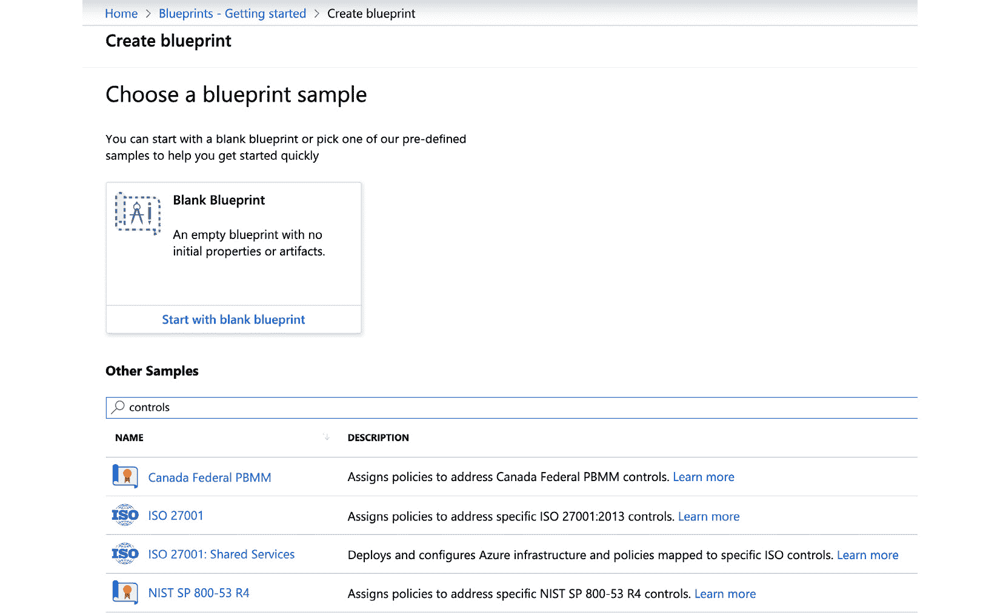

图 2.8 – 创建蓝图定义时，你可以选择一个预定义的示例蓝图

要开始创建蓝图定义，请执行以下操作：

1.  导航到 **所有服务** -> **蓝图**。

1.  选择 **创建**。

1.  当向导出现时，你需要为你的蓝图命名，然后选择保存蓝图定义的位置。在下面的截图中，我决定将蓝图保存在我的 `Tenant Root Group` 中，以便在所有当前或将来可能附加到我的 Azure AD 租户的订阅中使用该蓝图：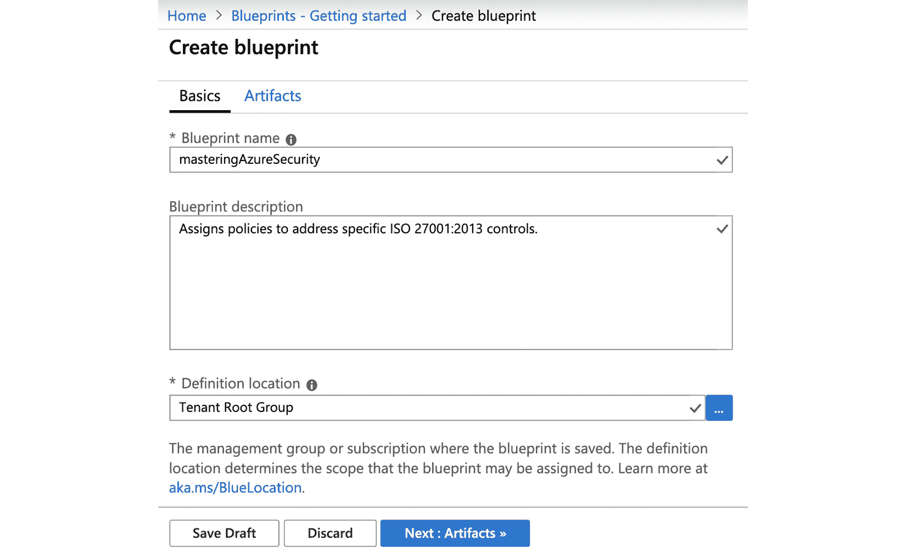

    图 2.9 – 创建蓝图 – 基本信息

    我决定使用 `ISO 27001` 蓝图示例进行本演示。在第二个标签页 **工件** 标签页中，你可以根据需要添加、移除或编辑工件。你可以随时保存草稿，稍后再回来修改、添加或移除任何内容：

    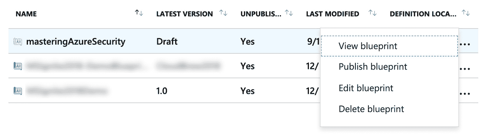

    图 2.10 – 保存蓝图到草稿模式后的上下文对话框

1.  完成后，你需要将蓝图定义发布为新版本。版本基本上是一个自定义文本字段，你需要定义它。选择版本号是有意义的，这样你可以轻松地迭代版本。然而，你可以使用任何适合你需求的蓝图版本名称。我决定将蓝图版本命名为`0.1`：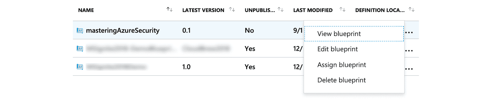

    图 2.11 – 发布新蓝图后显示的上下文对话框

    发布蓝图后，上下文对话框会发生变化，并为你提供一个新菜单选项，**分配蓝图**。

1.  现在，你可以将新的蓝图分配给任何现有的订阅，或者直接从对话框中选择创建一个新的订阅：

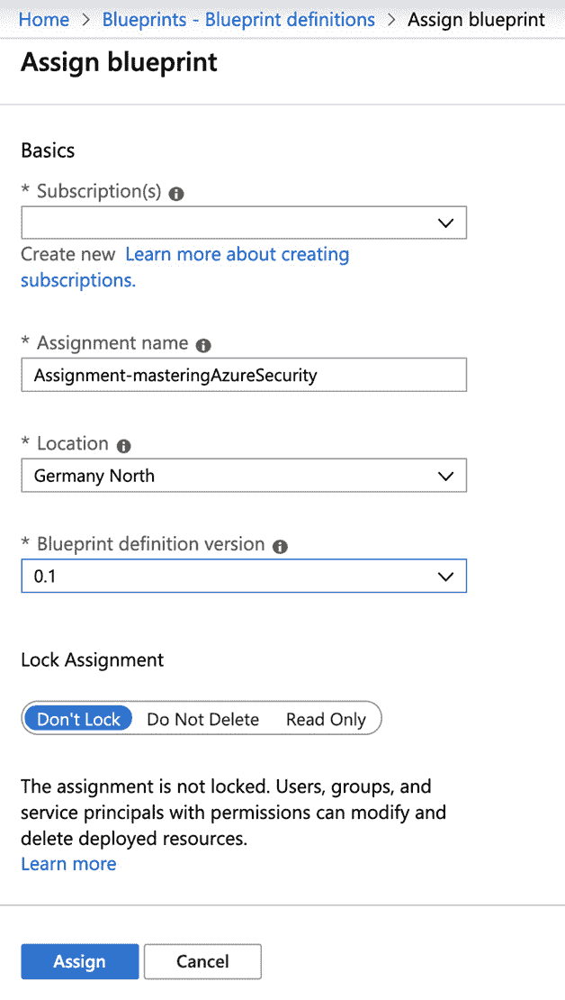

图 2.12 – 新蓝图分配

一旦你分配了蓝图，蓝图定义中定义的策略将被应用，同时资源组和资源也会被创建。你还可以在分配蓝图时分配锁定。如果你在蓝图分配时应用了锁定，则只有在取消分配蓝图时才能移除它。

重要提示：

你可以在将蓝图分配给订阅时分配管理锁定。但是，如果你这样做，锁定不能仅由订阅所有者移除，而只能在取消从订阅中分配蓝图时移除。

你需要为蓝图分配定义一个位置。这是因为蓝图使用**托管身份**（**MI**）来部署你在蓝图定义中定义的工件，如资源和资源组。你可以使用*系统分配的* MI，也可以选择使用*用户分配的* MI。如果你使用系统分配的 MI（默认设置），该 MI 将临时被授予在蓝图分配范围内的订阅的所有者权限。需要拥有者权限，以确保蓝图服务能够正确创建和设置所有的工件和锁定。当蓝图分配过程完成后，系统分配的 MI 的拥有者权限会自动从你的订阅中移除。

根据你在蓝图定义中定义的工件，你可能需要在分配过程中定义工件参数：

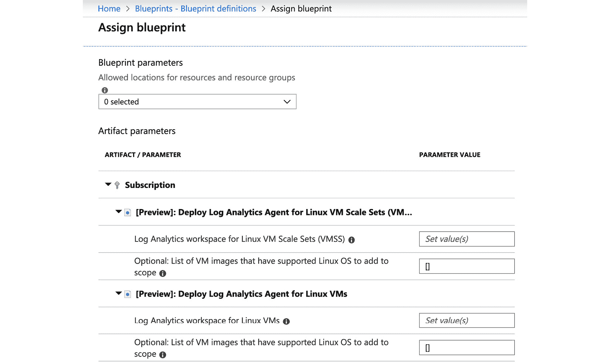

图 2.13 – 在蓝图分配期间配置工件参数

在我们的例子中，我们从 ISO 27001 蓝图示例开始。这个蓝图定义包含多个政策，比如限制资源部署仅限于少数 Azure 区域，或者将 Azure Log Analytics 代理部署到 Windows 和 Linux 虚拟机。所有这些政策的参数本应已经在蓝图定义中进行定义。然而，如果我们这样做了，所有参数对于所有订阅都会相同，且无法根据你分配蓝图的订阅来定义。这对需要在每个系统环境中强制执行的公司限制可能非常有用，但这也会限制蓝图/政策的灵活性。

在这种情况下，最佳实践是定义所有在蓝图定义中永远不能更改的参数。例如，如果公司资源仅允许部署在某些 Azure 区域，这将非常有用。但对于 Log Analytics，最好在每个 Azure 区域部署一个单独的工作区，以避免因跨区域网络流量而产生费用。这应该在蓝图分配时定义。

提示

**最佳实践**：在*蓝图定义*中定义适用于所有订阅的工件参数。在*蓝图分配*过程中定义仅适用于特定订阅的工件参数。

现在你已经了解如何定义治理概念，以及我们今天所拥有的所有功能如何协同工作，我们将深入了解 Azure 资源图，这是一个帮助你收集在 Azure 租户范围内创建的所有资源信息的引擎。

# Azure 资源图

你是否曾尝试获取所有部署在欧洲以外的 Azure 资源的信息？或者，如何列出你所有订阅中的所有 Azure 虚拟机（VM）？在*理解 Azure 中的治理*部分，我提到过监控对于安全至关重要，如果没有有效的监控实践，你就像一头瞎子。现在，如果你尝试获取类似我们在讲解**Azure 资源管理器**（**ARM**）时讨论的信息，你可能会一直等待。你甚至可能没有能力一次性获取所需的所有信息。

Azure 资源图（Azure Resource Graph）是一个相对较新的服务，帮助你收集所有租户的 Azure 订阅中的资源信息。听起来很棒，对吧？确实，它非常棒。

你可以把 Azure Resource Graph 看作是一个大型的索引数据库，包含所有资源，可以使用**Kusto 查询语言**（**KQL**）进行查询。每当你创建或更新资源时，ARM 会通知 Azure Resource Graph 这一变化，Azure Resource Graph 数据库会进行更新。为了确保没有漏掉任何通知，并且在你在 ARM 之外更新资源时，Azure Resource Graph 会定期进行全扫描，除了接收通知外，这样数据库能够保持最新。

为了能够使用 Azure Resource Graph 查询你的资源，你需要至少具有查询资源的读取权限。换句话说，你只能看到你有权限查看的资源。因此，查询结果始终取决于当前登录 Azure 门户、Azure CLI、PowerShell 或 REST API 的帐户。

## 使用 PowerShell 查询 Azure Resource Graph

如果你想使用 PowerShell 查询 Azure Resource Graph，请按照以下步骤操作：

1.  使用以下命令安装 `Az.resourcegraph` PowerShell 模块。

    ```
    First, install the PowerShell module for Azure Resource Graph:
    install-module Az.resourcegraph
    ```

    然后，将模块导入到当前的 PowerShell 会话中：

    ```
    import-module Az.resourcegraph
    ```

1.  使用以下 PowerShell 命令来确保模块已正确安装：

    ```
    get-command -module Az.resourcegraph
    ```

    你应该看到以下输出：

    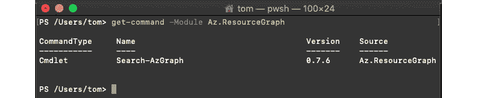

图 2.14 – Az.ResourceGraph 模块已成功安装并导入

目前，Az.ResourceGraph PowerShell 模块在线包含一个 cmdlet，即 Search-AzGraph。将来可能会有所变化，所以请确保始终使用最新版本的 PowerShell 模块。

现在，你可以开始使用 PowerShell 查询 Azure Resource Graph。例如，我们想获取所有资源名称中包含“core”一词的 Azure 资源列表，并限制输出为五个结果。现在，有趣的地方是，Search-AzGraph cmdlet 已经为你提供了需要查询的数据库列，所以在查询时，你只需要定义你的过滤逻辑。

一个 KQL 查询通常是这样的：

```
database |
where <filter logic> |
project columnname1, columname2 |
limit n
```

由于数据库名称是由 Search-AzGraph 给出的，我们只需要定义过滤逻辑。因此，对于刚才描述的结果，你的 PowerShell 命令，包括查询，可能如下所示：

```
Search-AzGraph -Query 'project name, type | where name contains "core" | limit 5'
```

该命令将为你提供最多五个结果，这些结果的资源名称中包含“core”一词：

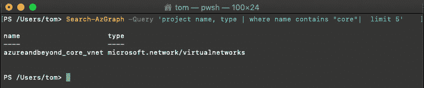

图 2.15 – 你的第一次 Azure Resource Graph 查询结果（使用 PowerShell）

你现在已经学会了如何使用 PowerShell 查询 Azure Resource Graph。在接下来的章节中，你将学习如何使用 Azure CLI 获取相同的查询结果。

## 使用 Azure CLI 查询 Azure Resource Graph

如你从前面的截图中可能已经看到的，我在 macOS 的 Bash 终端中使用 PowerShell Core。这完全没有问题，因为我既喜欢 PowerShell 又喜欢 macOS，对我来说这是个不错的选择。然而，使用 Azure CLI（基于 Python 的命令行界面，可以在 Windows、macOS 和 Linux 上运行），你也可以轻松查询 Azure Resource Graph。如果你已经安装了最新版本的 Azure CLI，你只需通过以下命令进行交互式登录：

```
az login
```

接下来，系统会提醒你，浏览器窗口已打开，你可以在其中输入凭据，完成多重身份验证挑战，并处理所有与 Azure AD 相关的其他安全事务（这些内容将在本书的下一章讨论）。登录后，Azure CLI 会显示你账户所拥有访问权限的所有订阅概况：

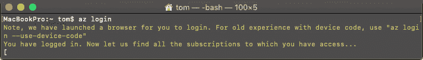

图 2.16 – Azure CLI – 交互式登录成功

如果你现在尝试获取 `az graph` 的帮助（这是访问 Azure Resource Graph 的起始命令），你将看到一条错误信息，因为需要先将图形扩展添加到你的 Azure CLI 环境中：


图 2.17 – 当 Azure Resource Graph 扩展尚未启用时，Azure CLI 中的错误信息

所以，让我们添加图形扩展：

1.  在 Bash 会话中输入以下命令：

    ```
    az extension add --name resource-graph
    ```

1.  你现在可以运行在 PowerShell 中运行的相同查询（但使用 Azure CLI 语法）：

    ```
    az graph query -q "project name, type | where name contains 'core' | limit 5"
    ```

运行此查询将返回以下输出：

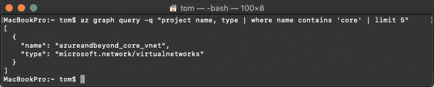

图 2.18 – 你的第一个 Azure Resource Graph 查询结果（使用 Azure CLI）

所以，查询本身将保持不变。它只是被包装在 Azure CLI 语法中，而不是 PowerShell。

## 高级查询

现在你已经知道如何在 Azure CLI 和 PowerShell 中运行查询了，或许你有兴趣运行一些高级查询，对吧？那么，这里是相关查询。你在这里找到的查询可以在 Azure CLI 和 PowerShell 中运行。

首先，让我们尝试获取更多关于资源的信息——不仅仅是名称和类型，并且不限制输出结果的数量；让我们筛选特定的订阅。查询可能如下所示：

```
where subscriptionId == 'your subscription ID' and name contains 'core'
```

Azure CLI 的命令如下：

```
az graph query -q "where subscriptionId == 'your subscription ID' and name contains 'core'"
```

对于 PowerShell，你输入以下命令：

```
Search-AzGraph -Query "where subscriptionId == 'your subscription ID' and name contains 'core'"
```

你将看到，根据你的访问权限和资源类型，你的查询结果将为你提供大量信息。在我的环境中，作为查询结果出现的单个资源——一个虚拟网络——的截图大约会占用本书的两页。幸运的是，即使你的查询返回了很多资源，由于你查询的是 Azure 资源图数据库而不是 Azure 资源管理器，你的结果也会接近实时返回，而 Azure 资源管理器必须“与”每个资源先进行通信。

# 总结

在本章中，你已经了解了为什么治理对安全至关重要，以及 Azure 提供了哪些功能来帮助你为公司建立治理概念。你已经学会了如何分组和组织订阅和资源，如何执行策略，以及所有最佳实践，以确保你有效且不破坏系统地进行操作，并创建一致且可重复的环境。我们知道，在这片选择的丛林中找到一条出路并不容易，但当你停下来、思考、计划、行动并重复时，你将走上发现最适合你需求的道路。

在下一章中，你将不仅学习如何通过管理云身份来跟踪访问权限并监控用户行为中的任何异常，还将学习保护身份的策略，以及如何减少特权账户的攻击面。

# 问题

1.  治理中最重要的部分是什么？

    A. 策略

    B. 监控

    C. 实施

    D. 以上所有

1.  在部署问题中，治理中需要定义什么？

    A. 我们需要定义可以部署的内容

    B. 我们需要定义部署步骤

    C. 我们需要定义“什么”和“如何”

    D. 这取决于部署方法

1.  哪个功能可以防止意外删除资源？

    A. 资源锁定

    B. 删除锁定

    C. 管理锁定

1.  群组层级的最高级别是什么？

    A. 租户

    B. 管理组

    C. 订阅

    D. 资源组

1.  Azure 蓝图应用在哪个级别？

    A. 资源

    B. 订阅

    C. 资源组

1.  我们可以用 Azure 蓝图定义什么？

    A. 角色分配

    B. 策略分配

    C. 以上两者

    D. 以上都不是

1.  什么是 Azure 资源图？

    A. 控制部署的服务

    B. 一个收集信息的服务

    C. 以上两者

    D. 以上都不是
