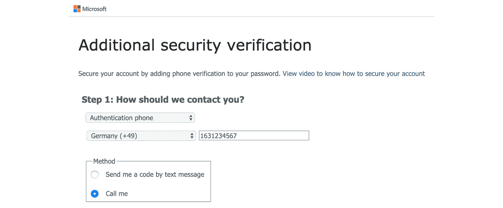

# 第三章：*第三章*：管理云身份

在过去，IT 安全几乎等同于阻挡网络流量，那时的生活非常简单。你可以确信你的物理围墙构建了你的边界，因此你只需要保护你的边界。然而，今天，仅靠网络端点已经不足以保障你的边界。如今，我们看到越来越多针对企业环境的钓鱼攻击和凭证窃取攻击。我们正处于一个企业数据逐渐脱离其安全企业网络环境的时代。这是云服务时代，例如 Office 365，因此传统的安全策略不足以保护数据，因为数据已经在安全围墙之外。我们需要在传统方法的基础上增加新的方法。这种新方法就是“身份是新的边界”。这使得身份成为我们比以往任何时候都更需要保护的内容。当然，这并不意味着我们必须放弃保护网络的旧方法，我们将在*第四章*《网络安全》中探讨这一点。

一般来说，为了避免随机攻击，你需要提高门槛，并让攻击尝试对攻击者来说尽可能昂贵。这就像保护你的家一样：如果你用更高的**抗性等级**（**RC**）保护前门，在窗户前安装格栅，使用自动照明系统照亮你的财产，而你的邻居没有这样做，那么寻找随机目标的窃贼很可能根本不会尝试攻击你的家。这是因为对你的家进行攻击可能会非常耗时，或者被发现的概率太高；因此，从攻击者的角度来看，代价太高。如果你遭受的是针对你的家或身份的精心策划、针对性的攻击（没有绝对的安全！），那么这种方法就不起作用，但它有助于抵御所有随机的攻击尝试。

本章不仅将介绍保护身份的策略，还将帮助你了解如何减少特权账户的攻击面。我们将讨论的主题如下：

+   探讨密码和密码短语

+   理解**多因素认证（MFA）**

+   使用条件访问

+   介绍**Azure Active Directory** **(Azure AD)** 身份保护

+   理解**基于角色的访问控制（RBAC）**

+   使用 Azure AD **特权身份管理（PIM）**保护管理员账户

+   混合认证和**单点登录（SSO）**

+   理解无密码认证

+   许可证考虑

# 探讨密码和密码短语

在谈论身份安全时，有一个原则你必须始终记住：*假设已经被攻破*。问题不在于*你的账户是否被攻击*，而在于*你是否知道这一点*以及*你是否能防止攻击者成功*。我们已经可以看到，每天都有许多成功攻击云身份的案例。没有单一的解决方案能保护你的身份，但你需要利用更广泛的工具集，以应对身份攻击。

重要提示

问题不在于你的云身份是否受到攻击，而在于你是否能确保攻击者不会成功。

如果我们从密码谈起，你可以说没有人喜欢它们。嗯，攻击者倒是喜欢，因为它们常常为攻击者提供了进行后续**以身份为中心的攻击**的契机。鉴于人们往往根据自己的生活经历创建密码，攻击者通常需要擅长收集有关特定用户的背景信息，以猜测其密码。当然，这意味着攻击者需要付出一些努力，而这通常会在针对高价值目标的复杂攻击中进行。你可以看到，密码并不是保护账户的好方法。

此外，密码还可能导致**拒绝服务（DoS）**攻击。在 Windows Server 的**Active Directory 域服务（AD DS）**中，许多公司使用相应的安全策略，在多次登录失败后，锁定用户账户一定时间（或无限期）。问题在于，已认证的用户——即那些能够登录到 Active Directory 的用户——能够读取这个安全策略，并且他们能够列出 AD 中的用户账户。已认证的用户可以是任何员工（内部攻击者），也可以是某个试图从外部攻击公司并且能够获取一组登录凭证的人（外部攻击者）。利用 PowerShell，攻击者可以轻松地：

+   了解当前的安全政策

+   列出所有用户账户

+   尝试使用错误密码登录，锁定所有用户账户

+   每隔*X*分钟重复此脚本。

如果有人这么做，本目录中的任何人都将无法再登录，因此公司将遭受拒绝服务（DoS）攻击。也就是说，你不应该*实施*这种锁定策略，而是应监控登录尝试，并在出现异常情况时做出明智决策。请留意 Windows 服务器上的安全事件日志，或 Linux 上的 syslog/auth 日志域。

## 字典攻击与密码保护

字典攻击，例如暴力破解和密码喷洒攻击，仍然每天都会成功。在字典攻击中，攻击者尝试将用户名和常见的、经常使用的密码组合用于身份验证服务。暴力破解攻击比较显眼且更容易被识别。在暴力破解攻击中，攻击者会对一个用户帐户尝试多个密码，希望其中一个攻击能够成功。在后端，你会看到大量失败的登录尝试，因此你可以轻松地作出反应。然而，密码喷洒攻击则更加隐蔽，因为攻击者只会对多个用户帐户使用少量的密码。如果攻击非常缓慢且分散，那么就很难发现攻击。为了避免在云中，尤其是在 Azure AD 中，密码喷洒和暴力破解攻击的成功发生，可以采用一些简单的最佳实践：

+   鼓励用户使用密码短语而不是传统密码

+   阻止在你的环境中不应该使用的密码或模式

目前，你可以在 Azure AD 中使用最多 256 个字符的密码或密码短语。即使你仅使用所有大写和小写字母中的 26 个字母，这也意味着 (2x26)²⁵⁶ 共有 256 种可能性，结果几乎接近无穷大。

话虽如此，考虑到你不仅可以使用大写和小写字母，还可以在密码短语中使用数字和其他字符，这会产生大量的组合。你看，绝对应该启用并鼓励用户使用包含大量字母的密码短语。

对于你不希望在组织中使用的密码，还有另一种选项可以启用。默认情况下，Microsoft 不允许使用可以在密码列表中找到的、已知会被字典攻击使用的密码或密码模式。例如，一个不被允许的模式是你的用户名或其中的任何一部分。此外，可能对你的公司有意义的是避免使用容易与企业相关的密码。这可能包括著名的营销词汇、公司缩写等。在 Azure AD 中，你可以创建一个自定义禁止密码列表，既可以用来审计，也可以强制使用安全密码。你甚至可以使用这个自定义列表为本地 Windows Server AD 启用密码保护，通过安装并启用本地代理。

自定义禁止密码列表最多可以包含 1,000 个区分大小写的词条，长度介于 4 到 16 个字符之间。一个很棒的特点是，字符替代（例如“e”与“3”或“o”与“0”）也会被考虑在内。


图 3.1 - 在 Azure AD 中配置自定义禁止密码列表

要配置自定义的禁止密码列表，你需要在 Azure 门户中导航至**Azure Active Directory** -> **身份验证方法** -> **密码保护**，如*图 3.1*所示。在该屏幕上，你还会找到**自定义智能锁定**功能的配置选项。如前所述，你可能会发现本地 AD 安全策略在一定次数的登录失败后强制锁定账户。这是一种开关决策，你可以轻松通过使用相同的密码增加锁定计数器，从而强制账户锁定。记住，这也是为什么你应该禁用本地 AD 中的此类策略并监控登录尝试的原因。

然而，在 Azure AD 中，智能锁定是结合了两全其美的特性：让用户在不被不必要地阻塞的情况下工作，同时防止攻击者猜测你的密码。为了实现这一目标，智能锁定提供了一些有趣的功能：

+   用户并不应该被阻止工作。智能锁定能够识别攻击尝试和有效用户的登录尝试。攻击尝试会被区别对待，因此合法用户仍然可以正常工作，而攻击者则会被阻止。

+   智能锁定会存储最后三个错误密码的哈希值。通过这种方式，你不能仅仅通过多次使用相同的错误密码来增加锁定计数器，从而实施拒绝服务攻击。

+   默认的锁定阈值是 10 次错误尝试，锁定持续时间为 60 秒。智能锁定始终开启在 Azure AD 中；然而，它并不保证合法的用户账户永远不会被锁定。该服务会通过比较熟悉与不熟悉的位置来尝试判断登录尝试是否来自恶意行为者或真正的用户。然而，仍然存在用户被阻止登录的概率。一个重要的点是，服务并不一定能保护你免受高度敏感的密码喷洒攻击。这并不是因为服务本身存在问题，而是因为这类攻击可能会变得非常难以发现。

+   假设攻击者有一份包含九个密码的列表，并且他们利用广泛分布的机器人网络在几周的时间内攻击一个自定义域中的成千上万个用户账户。在这种情况下，有几个事实需要注意：

    每个用户账户的登录尝试次数不会超过默认阈值。

    通过使用多个广泛分布的主机系统来执行攻击，很难发现一个登录尝试是有效的还是恶意的。然而，微软也会考虑登录尝试是否来自已知的恶意 IP 地址或不熟悉的位置。

所以，在这种情况下，该服务可能不会阻止攻击者。当然，列表中的九个密码需要足够复杂才能被接受。然而，攻击者猜测你的密码仍然有成功的概率。

现在您知道了密码不足以保护您的账户，接下来我们进一步了解 MFA 如何为您的账户增加一层额外的安全防护。

# 了解多因素认证（MFA）

很少有技术功能能比使用 MFA 更好地保护您的账户。通过 MFA，知道用户名和密码是不够的；您还需要通过其他认证因素来证明您的身份。通过 MFA，通常需要能够通过以下方式登录：

+   您的身份信息，例如您的用户账户名或生物识别属性

+   您知道的东西，例如密码

+   您拥有的东西，例如额外的认证因素（智能卡、智能手机应用或安全密钥）。

鉴于 MFA 挑战只有在登录尝试成功后才会触发，它仍然依赖于不容易猜测的密码。换句话说：如果触发了 MFA 挑战，相应的用户名/密码组合已经成功验证。


图 3.2 - 在用户凭证成功验证后，触发 MFA 挑战

如今，Azure AD 提供了多种使用 MFA 的选项：

+   来自 Microsoft Authenticator 智能手机应用的推送消息

+   来自 Microsoft Authenticator 智能手机应用的 **一次性密码** (**OTP**)

+   通过短信发送到您移动设备的 OTP 代码

+   致认证电话的电话

+   一个安全密钥或令牌

如果您正确设置了 MFA，您可以通过这些选项的组合应对所有情况。如果您无法访问移动数据或 Wi-Fi，您可以使用短信中的 OTP 代码或智能手机应用中的 OTP。如果您把智能手机忘在家里，您可以接到办公室电话（或者您在配置过程中定义的其他认证电话）。

重要提示

需要注意的是，由于显而易见的原因，您不应将手机号码作为身份验证电话。如果您丢失了手机或将手机忘在家里，您将没有太多可选项。

在*第二章*《治理与安全》中，您学习了职责分离和最小权限原则。帐户只获得完成任务所需的访问权限。然而，重要的是要防止意外被锁定在 Azure AD 环境之外。因此，仍然需要具有更高权限的帐户，如订阅所有者或全局管理员访问权限。这就是为什么您需要创建至少两个管理员紧急访问帐户的原因。部分这些紧急访问或*备用解锁*帐户也需要通过 MFA 进行保护。现在，单一智能手机似乎并不是这些帐户的好选择，因为根据墨菲定律，事情总会出错；当您需要它们时，智能手机的拥有者总是度假、病倒或因为其他原因无法使用。值得知道的是，您可以将最多五个身份验证因素连接到一个帐户。例如，您可以将三个安全密钥、一个智能手机应用和一个电话号码与一个帐户关联，以确保始终有至少一种方法可以用来完成 MFA 挑战。

## 在 Azure AD 中启用 MFA

从管理员的角度来看，在 Azure AD 中启用 MFA 非常简单：

1.  在 Azure 门户中，导航到**Azure Active Directory**，并选择**用户**导航窗格。在右上角，导航到**•••更多**，然后选择**多重身份验证**，如下图所示：

    图 3.3 - 在 Azure 门户中启用 MFA

    您将被重定向到 [windowsazure.com](http://windowsazure.com) 域的复古风格门户，在那里您可以启用或禁用单个用户的 MFA，或者通过选择多个帐户或使用 CSV 文件批量更新它们，方法是在**用户**选项卡中进行操作。

1.  在启用用户帐户的 MFA 之前，首先从**用户**选项卡切换到**服务设置**选项卡，以配置一些适合您环境的自定义设置，如下截图所示：

    图 3.4 - MFA - 服务设置

    第一个选项是允许或不允许用户为不支持 MFA 的传统非浏览器应用程序创建应用程序密码。Outlook 曾经是这样的应用程序；然而，现如今，大多数应用程序应该能够通过 MFA 进行身份验证。

    您还可以定义可信 IP 地址，从而跳过 MFA。例如，如果您的用户从公司办公室进行身份验证，并且您已经在此处定义了外部 IP 范围，则可以定义只有当某人从公司大楼外部进行身份验证时，才会触发 MFA 挑战。您还可以启用或禁用单一验证选项，如果它们不适合贵公司的需求。最后一个设置是允许用户记住他们（但不是您作为公司！）信任的设备上的 MFA。如果启用此选项，则在特定设备上，用户在给定的时间段（1 到 60 天之间）内不会再次被提示进行 MFA 挑战。

1.  现在，回到在**用户**选项卡上启用用户帐户 MFA。当您在选择一个或多个用户帐户后，点击右侧的**启用**链接时，系统会提示您阅读在线部署指南，然后点击**启用多因素身份验证**。从管理员的角度来看，这就是所有操作。很简单吧？确实是。


图 3.5 - 为一个或多个用户帐户启用 MFA

启用 MFA 的用户在下次登录尝试后必须配置所有个性化设置。帐户的电话号码将从已经存储在 Azure AD 中的信息中获取。然而，用户可以在下次登录时出现的向导中更新这些号码。

## 从用户的角度来看启用 MFA

在为 John 强制启用 MFA 后，他下一次成功登录时将会弹出一个新窗口，告诉他组织需要更多信息来保护他的帐户，具体如以下截图所示：


图 3.6 - 启用 MFA 后第一次登录时的窗口

现在，John 只有两个选项：**使用不同帐户**登录或点击**下一步**继续执行 MFA 激活过程。也就是说，在激活 MFA 之前，您应该提前通知您的用户，让他们知道将会发生什么，并减少支持票的数量！

让我们看看如果 John 决定完成此过程会发生什么：

John 决定继续并点击**下一步**按钮。在接下来的屏幕上，他可以决定哪种方式将成为他的主要身份验证选项。John 的办公室电话号码已经从他在 Azure AD 用户帐户中存储的信息中自动填充，且无法更改。然而，身份验证电话号码可以单独配置。


图 3.7 - 办公电话不能单独更改，而是从 Azure AD 用户帐户中存储的值填充

如果 John 决定使用认证电话作为他的主要 MFA 选项，他必须配置号码，然后选择是否希望接收包含 OTP 的电话或短信：



图 3.8 - 认证电话 - 单独配置号码并选择联系方式

第三个选项是让 John 使用 Microsoft Authenticator 应用，该应用可以在所有主要智能手机操作系统的应用商店中找到。在这里，他有两个选择：要么通过推送通知接收信息，要么使用来自应用的验证码，验证码是每 30 秒更换一次的 OTP（一次性密码）。


图 3.9 - 移动应用 - 选择主要的 MFA 验证选项

John 决定使用移动应用，因此必须点击 **设置** 按钮。他已经在智能手机上安装了 Microsoft Authenticator 应用，因此现在可以轻松继续。一个新窗口会打开，显示给 John 一个 **快速响应（QR）** 代码，用移动应用扫描，如下图所示：


图 3.10 - 移动应用配置窗口

在他的应用中，John 点击 **+** 符号并选择添加新的 **工作或学校帐户** 选项。在智能手机应用中打开的二维码扫描器中，John 扫描屏幕上的二维码，帐户将立即添加到应用的帐户列表中，如下图所示：


图 3.11 - John's 账户已添加到他智能手机应用的账户列表中

在电脑上，John 点击 **下一步**，这样应用和后台服务会同步。**配置移动应用** 窗口将再次消失，John 然后可以点击 **下一步** 按钮。系统会触发推送通知到智能手机应用，随后可以批准或拒绝，如下图所示：


图 3.12 - Microsoft Authenticator 应用中的推送通知

接下来，John 被要求输入他的认证电话号码，以便 Microsoft 确保即使 John 无法访问移动应用，他也能进行身份验证登录。

*步骤 4*会向 John 展示他需要使用的应用密码，而不是他自己的用户账户密码。在当前不支持基于电话的 MFA 的应用程序中，该密码只显示一次，因此用户需要复制并保存它，以便在需要时使用。如果应用密码没有安全存储，用户可以稍后创建新的应用密码，但同样，密码只在创建时显示一次。之后，MFA 配置完成，John 将被注销。再次登录时，John 必须接受 MFA 挑战。

MFA 结合强密码可以保护账户免受 95%以上的攻击，而且考虑到 Azure MFA 在默认配置下可以免费使用，完全没有理由不启用它。

现在你已经了解了如何从管理员和用户的角度配置 MFA，让我们更进一步，了解如何根据公司的业务需求使用条件访问来微调 MFA 过程。

# 使用条件访问

MFA，我们在上一节中讨论的功能，是更好地保护云身份的完美选择。但它仍然是一个开关式的决策。你要么启用 MFA 用户账户，要么不启用。难道不是很棒，能够动态地响应身份验证尝试，然后决定是否需要 MFA 挑战吗？有了**条件访问**，我们可以定义认证条件，从而在认证过程中要求更多或更少的挑战。

条件访问为客户提供了多种选择，可以在策略中包括或排除。例如，你可以强制指定目录角色使用 MFA，比如 Azure AD 全局管理员，并且要求登录必须在公司拥有的设备上进行。或者，你可以将“正常”的 Office 365 员工从 MFA 挑战中排除，但仅当他们在公司办公室工作时。只要其中一个人试图从火车站、移动设备、家庭办公室等地方登录，就会触发 MFA 挑战。你看，选择非常多，我们将在这一节中详细介绍。


图 3.13 - Azure AD 中的条件访问

你会在 Azure 门户中的**Azure Active Directory** > **条件访问**下找到所有与条件访问相关的设置：


图 3.14 - 条件访问概览页面

现在出现的主要部分是**策略**部分。条件访问策略根据多个条件定义并强制执行身份验证的复杂性。策略可以依赖于身份验证请求的来源位置、用户和登录风险、设备、应用程序，或这些因素的组合。你可以使用条件访问策略来决定何时以及为谁允许或阻止访问你的云环境。因此，通过使用条件访问策略，你可以确保在需要时施加适当的安全措施，以保持环境安全，并避免在不需要时对用户进行不必要的挑战。

在我们更深入地了解如何在条件访问策略中定义所有这些条件之前，让我们先来看看可以在这些策略中使用的命名位置。

## 命名位置

有一个管理区域，用于定义可以在条件访问策略中使用的自定义设置。首先要提到的是**命名位置**。对于**命名位置**，有两个不同的选项可以选择。第一个选项是**配置 MFA 受信任的 IP 地址**，这将把你重定向到你从前一部分已经知道的传统门户中的**服务**设置。你可以使用这个选项定义应始终排除在 MFA 挑战之外的 IP 地址范围。


](img/Fig._3.15.jpg)

图 3.15 - 条件访问 - 命名位置

第二个选项是**+ 新位置**，你可以使用它来定义 IP 范围，甚至是国家和地理区域，以便在自定义条件访问策略中使用它们。如果你为某个 IP 范围选择**标记为受信任位置**，那么当来自该位置的身份验证请求时，用户的登录风险将降低。


](img/Fig._3.16.jpg)

图 3.16 - 创建一个受信任的命名位置

登录风险对于 Azure AD 身份保护很重要，这是我们在*介绍 Azure AD 身份保护*部分中讨论的功能。

## 自定义控制

使用*自定义控制*，你可以在身份验证过程中将用户重定向到外部兼容服务，以满足 Azure AD 之外的进一步身份验证要求。用户的浏览器窗口将被重定向到一个第三方服务，在那里用户需要执行任何进一步的身份验证要求，才能获得访问云资源的权限。自定义控制依赖于第三方应用程序。例如，你可以将第三方 MFA 提供商集成到身份验证工作流中，而不是依赖 Azure AD 的 MFA 服务。

## 使用条款

你可以定义用户在访问某些云应用程序之前需要接受的自定义使用条款。例如，你可以允许用户使用自己的设备访问你的环境，但前提是他们接受你的使用条款。


](img/Fig._3.17.jpg)

图 3.17 - 使用条款

要配置自定义的使用条款，你需要为每种语言上传一个 PDF 文件。在保存后，使用条款将在创建新条件访问策略时显示在授权控制列表中。

## 条件访问策略

如前所述，条件访问策略帮助你始终为每个身份验证情况应用适当的安全性，而无需在不需要时不必要地阻止或挑战用户。因此，可以按原样查看它们。

条件访问策略由*分配*和*访问控制*组成。分配定义了谁将受此条件访问策略的影响，以及在哪种情况下。访问控制定义了是否阻止访问或允许访问，如果允许访问，则定义哪些条件。

### 分配

在**分配**部分，你可以选择在条件访问策略中包含或排除的用户和组、云应用或用户操作以及条件，如下图所示：


图 3.18 - 用户和组 - 选择哪些用户和组要在条件访问策略中包含或排除

你可以选择在条件访问策略中**包含**或**排除** **无**、**所有用户**，或定义的用户和组的子集。你还可以选择排除所有来宾和外部用户、目录角色（如全局管理员）或在条件访问策略中定义的用户和组的子集。

重要说明

当选择所有用户并使用此策略阻止访问时，这也会影响所有管理员帐户。也就是说，启用此策略时可能会将自己锁定在外。因此，建议先将策略应用于少数用户，以确保其按预期工作！

你还可以在条件访问策略中**包含**或**排除**云应用或用户操作。同样，你可以选择**无**、**所有应用**或选择包含的应用，或者定义从策略中豁免的应用。

重要说明

在选择包含在策略中的所有云应用时，这也会影响 Azure 门户。确保不要只先对少数用户启用该策略，以免将自己锁定在外，从而确保它按预期工作！

在**用户操作**部分，你可以选择此策略是否影响用户的安全信息注册。这意味着在进行 MFA 注册过程时，策略对用户有效。

要包含在分配中的条件包括登录风险、设备平台、位置、客户端应用程序和设备状态。登录风险由 Azure AD 身份保护计算。你可以选择该策略适用的登录风险级别，**无风险**/**低风险**/**中风险**/**高风险**。可以包含或排除设备平台。你可以选择在策略中包含任何设备平台，或者选择包含或排除以下一个或多个：

+   Android

+   iOS

+   Windows Phone

+   Windows

+   macOS

你可以选择任何位置，或选择包括或排除所有信任的位置，或者你在之前步骤中已经定义的选定位置。

客户端应用程序可以是浏览器、移动应用程序和桌面客户端，包括现代认证客户端、Exchange ActiveSync 客户端或其他客户端（旧版 Office 客户端或其他邮件协议）。

你可以在策略中包括所有设备状态，或者排除混合 Azure AD 加入的设备或在 Intune 中标记为符合要求的设备。

### 访问控制

在 **访问控制** 部分，你可以根据之前所做的选择定义是否阻止或授予访问权限。如果你希望授予访问权限，可以选择无条件授予，也可以要求强制执行以下一个或多个控制：

+   **要求多因素认证**：当你在策略中定义的条件得到满足时，用户响应 MFA 挑战后，将授予用户访问权限。

+   **要求设备标记为符合要求**：在 Intune 中，你可以定义设备合规性策略。例如，只有当设备为公司所有并且已经打上补丁时，才能将其标记为符合要求。

+   **要求混合 Azure AD 加入的设备**：混合 Azure AD 加入的设备由组织拥有。它们同时存在于云端和本地，这意味着它们既加入 Windows Server AD，又加入 Azure AD。

+   **要求批准的客户端应用程序**：仅当使用其中一个批准的客户端应用程序访问公司信息时，才会授予访问权限。目前，批准的客户端应用程序可以是与 Microsoft 365 相关的 25 多个应用程序之一，包括但不限于 Microsoft Azure 信息保护、Microsoft Excel、Microsoft Edge、Microsoft Intune 管理浏览器、Microsoft Teams 和 Microsoft Outlook。

+   **要求应用保护策略**：你可以使用 Intune 为 Microsoft Cortana、Microsoft Outlook、Microsoft OneDrive 和 Microsoft Planner 定义应用保护策略。通过此设置，你可以在授予公司信息访问权限之前，强制要求应用保护策略存在，如下截图所示：


图 3.19 - 使用条件访问授予访问权限的条件

现在你已经知道了如何在理论上配置条件访问策略，接下来我们再进一步，尝试为一些行为定义设置。

例如，你可以创建一个策略，阻止所有未混合 Azure AD 连接的设备访问。然而，这个策略不应该影响属于特定管理员组的用户。适合你需求的策略可能包括以下内容：

1.  包括所有用户，排除特定的管理员组。

1.  排除混合 Azure AD 连接的设备。

1.  阻止访问。

你可能还希望在身份验证尝试不是来自可信位置，或用户没有使用公司拥有的设备时强制执行多重身份验证（MFA）。该策略将会：

1.  包括所有用户。

1.  包括所有位置，排除所有可信位置。

1.  授予访问权限并要求 MFA。

    重要提示

    最佳实践是不在条件访问策略中包括所有用户，除非有例外。因为这样会有锁定自己无法访问云环境的风险。

你的组织可能会要求用户在办公地点完成 MFA 注册。通过这种方式，组织可以确保即使用户的凭证被泄露，攻击者也需要在你的网络边界内才能配置 MFA。强制执行该策略的条件访问策略可以这样配置：

1.  包括所有用户，排除特权角色或包含管理员帐户的特定用户组。

1.  启用**注册安全信息**用户操作。

1.  包括定义办公位置的选定位置。

1.  阻止访问。

使用条件访问，你可以细化定义何时以及如何授予或拒绝访问云环境。在本节内容中，我们已经介绍了 Azure AD 身份保护。现在，让我们进入下一部分，你将了解 Azure AD 身份保护到底是什么，以及如何使用它。

# 引入 Azure AD 身份保护

如前所述，安全方面的一个重要目标是尽可能增加攻击者尝试攻击的成本。换句话说，重要的是提高安全门槛，并采用几种互补的技术，为你的安全防护增加额外的价值。另一方面，你还需要确保不会阻止合法用户的身份验证，以免对用户的登录体验产生负面影响。微软已经保护云端身份超过 10 年，借助 Azure AD 身份保护系统，他们可以帮助你使用其保护机制来保护身份。

偷窃用户帐户的凭证，即使它们没有很高的权限，仍然是获取公司资源的好方法。多年来，攻击者已经学会了利用第三方泄露或高度复杂的钓鱼攻击来获取公司凭证。即使攻击者获得了低权限的用户帐户，他们也能相对容易地通过横向移动提升权限级别或访问重要的公司资源。

因此，我们需要做的是以下几步：

+   保护所有级别特权的身份

+   防止被泄露的身份访问企业资源

现在，第二步更加困难，因为您首先需要弄清楚一个身份是否已经被泄露。这时，Azure AD 身份保护就发挥作用了。

## Azure AD 身份保护概览

Azure AD 在确定用户帐户身份验证中的异常和可疑行为时，利用的是自适应机器学习算法和启发式方法。通过这些数据，Azure AD 身份保护可以生成报告和警报，帮助客户评估最近的登录情况。此外，Azure AD 身份保护还能计算用户和登录的风险等级，并可用于基于风险的条件访问策略。例如，您可以决定在登录尝试的风险等级被计算为中等或更高时强制使用 MFA，或者基于风险计算来阻止登录尝试。


图 3.20 - 一个登录尝试被 Azure AD 身份保护阻止

在前面的截图中，您可以看到一个登录尝试被阻止，因为无法验证用户的身份。原因是 John 在此可疑的登录活动被检测到之前没有配置 MFA。当然，现在试图登录并被阻止的人员无法在此阶段配置 MFA，因为那样会让攻击者根据他们的需求来配置该服务。


图 3.21 - Azure AD 身份保护概览仪表盘

Azure AD 使用多种类型的风险检测，实时检测（5-10 分钟）和离线检测（2-4 小时）。一旦检测到与帐户登录相关的风险，该检测会被添加到一个逻辑概念中，称为 *高风险登录*。高风险登录表示一个可能是攻击者进行的登录尝试，而非合法帐户所有者的操作。基于这些检测，会计算出登录由恶意行为者执行的概率，并反映在 *登录风险等级* 中。您可以使用登录风险等级（**低**，**中**，**高**）来定义 *登录风险策略*。登录风险策略是根据指定的登录风险等级自动响应的策略，用来阻止访问您的资源或要求用户在获得访问权限之前通过 MFA 挑战。

除了登录风险，Azure AD 还会检测用户账户是否被泄露的可能性。这种行为被称为*用户风险检测*。所有已经检测到并且尚未解决的风险检测都被称为*活动风险检测*。与用户相关的所有活动风险检测定义了该用户的风险。根据用户风险，Azure AD 会计算用户账户被泄露的概率（**低**、**中**、**高**）。这个概率被称为*用户风险等级*。例如，如果检测到一个高风险的登录行为，但多重身份验证（MFA）挑战通过，则该用户没有任何活动风险检测。因此，在这种情况下，用户风险等级将保持在低水平。你可以定义一个*用户风险策略*，作为对特定用户风险等级的自动响应。通过此策略，你可以选择阻止访问企业资源，或强制要求用户更改密码，以恢复用户的清洁状态。

### 风险检测

在 Azure AD 中，目前有六种不同类型的风险检测：

1.  **凭证泄露的用户：** 凭证泄露是由于网络犯罪分子大规模窃取凭证并公开发布，特别是在暗网上。微软积极监控这些渠道，并将泄露的用户名和密码配对与现有用户进行比较，以识别那些有凭证泄露的账户。

1.  **来自匿名 IP 地址的登录：** 匿名 IP 地址是那些希望隐藏设备真实 IP 地址的用户所使用的。使用这些 IP 地址可能有多种原因，其中一些可能具有恶意性质。微软会检查来自先前被识别为匿名 IP 地址的登录请求。

1.  **不可能的旅行到非典型位置** 是指从地理上相距遥远的地点进行的登录。至少一个位置需要是根据用户的登录行为判定的非典型位置。例如，用户第一次去美国出差并从那里登录。除了这一点，底层的机器学习算法还会考虑登录之间的时间，以及用户从一个位置移动到另一个位置所需的时间。微软尽量忽略明显的误报，比如**虚拟专用网络（VPN）** 连接，或者在同一组织中的其他用户账户所知的熟悉位置。此类风险检测需要 14 天的用户行为分析，才能计算出用户账户的风险。

1.  **来自感染设备的登录：** 这种风险检测方法依赖于微软追踪已知与僵尸网络服务器通信的 IP 地址。微软会将所有连接到服务的 IP 地址与这些已知的恶意 IP 地址进行匹配，以判断是否存在来自感染设备的登录。此类风险检测还会针对简单的攻击方法，如密码喷射攻击。

1.  **来自具有可疑活动的 IP 地址的登录：** 在这种检测方法中，微软会检查 IP 地址是否存在可疑活动。主要的指示器是 IP 地址在相对短的时间内发生大量失败的登录尝试。这可能表明一个不良行为者正在尝试通过暴力破解或密码喷洒等简单攻击方法猜测密码。

1.  **来自不熟悉位置的登录：** 这种风险检测方法涉及微软维护一个用户常用 IP 地址的历史记录。系统会检测请求是否来自一个以前未曾使用过的 IP 地址。系统至少需要 30 天的时间来创建一个可用的熟悉与不熟悉位置的历史记录。

### 创建登录风险或用户风险策略

策略创建是 Azure AD 条件访问中最简单的部分。要创建登录风险策略，您只需在 Azure 门户中导航至**Azure AD 身份保护** -> **登录风险策略**。在这里，您定义条件（**登录风险**级别 - **低**及以上、**中**及以上或**高**），访问控制（阻止访问或使用 MFA 挑战用户），并选择启用策略的用户或组。就这么简单。


图 3.22 - 创建登录风险策略

对于新的用户风险策略，您可以导航至**Azure AD 身份保护** -> **用户风险策略**并定义相应的参数。与登录风险策略的不同之处在于，您可以选择阻止访问或强制风险用户更改密码。


图 3.23 - 创建用户风险策略

现在您已经了解了 Azure AD 身份保护的工作原理以及如何使用计算出的用户和登录风险级别来保护您的帐户。接下来，我们将继续关注特权用户帐户。

# 理解 RBAC

在 *第二章* *治理与安全性* 中，我们提到了安全原则，如职务分离和最小特权原则。通过 RBAC，我们拥有了在 Azure AD 中实施这些原则的技术特性。RBAC 是管理所有 Azure 资源访问的方式，也包括 Azure AD 和 Office 365 的访问管理。

如前所述，Azure 提供了几个作用域级别，可以用于授予帐户的访问权限。此外，还有若干角色，如**所有者**、**Azure Sentinel 贡献者**或**阅读者**，如下图所示：


图 3.24 - Microsoft Azure 中的 RBAC 角色分配

创建角色分配需要三个不同的实体：

+   安全主体，可以是用户、组或服务主体中的任意一个。

+   一个角色，描述了一组管理权限。例如，贡献者角色包含所有操作，除了与授权相关的权限。因此，贡献者可以管理给定范围内的所有方面，而无需授予访问资源的权限。

+   一个设置访问权限的范围，从管理组级别到单个资源。

如果这三者结合起来，这就是我们所说的 RBAC 角色分配。

重要提示

你需要被授予 `Microsoft.Authorization/roleAssignments/write` 和 `Microsoft.Authorization/roleAssignments/delete` 权限，才能创建或删除角色分配。默认情况下，这些权限会授予 RBAC 角色“用户访问管理员”和“所有者”。

你可以在 Azure 的所有管理范围内编辑角色分配。需要注意的是，角色分配是从上到下继承的。这意味着，如果你在资源组级别配置角色分配，则该访问权限也适用于该资源组中的所有资源；如果你在管理组级别配置角色分配，则它会被继承到该范围内的所有订阅、资源组和资源。

在 Azure 门户中，有一个**访问控制（IAM）**面板，用于管理 RBAC 的各个方面。你可以检查特定帐户的访问权限，了解显式和继承的角色以及拒绝分配，并查看给定范围内存在的内置或自定义角色。


](img/Fig._3.25.jpg)

图 3.25 - Azure 门户中的 RBAC 管理面板

要创建新的角色分配，你需要点击**+ 添加**，然后选择**添加角色分配**。


](img/Fig._3.26.jpg)

图 3.26 - 添加角色分配

然后选择你想要授予访问权限的角色和安全主体，并保存你的选择。完成。

实施 RBAC 是相当直接的，但在规划你环境中的访问权限时可能会变得更加具有挑战性。这就是为什么在定义治理概念时你应该提前规划 RBAC 角色。

重要提示

在创建治理概念时，定义你在环境中需要的 RBAC 角色。这样，你将对需要哪些访问权限（角色）以及需要授予谁（哪个安全主体）访问权限有一个清晰的了解。这样，稍后创建角色分配时会更容易。

在接下来的部分中，我们将展示如何创建自定义的 RBAC 角色，以便你可以根据需要更细粒度地使用角色。

## 创建自定义 RBAC 角色

当内置角色不能完全满足贵公司在云环境访问权限方面的需求时，便需要使用自定义 RBAC 角色。如前所述，角色基本上是一组管理权限，然后应用到用户或组的角色分配中。*自定义 Azure AD RBAC 角色*和*自定义 Azure 资源 RBAC 角色*之间存在差异。如果您想创建一个自定义的 Azure AD RBAC 角色，您需要遵循以下步骤：

1.  进入**Azure Active Directory** -> **角色和管理员**，然后点击 Azure 门户中的+**新建自定义角色**按钮，如以下截图所示：

    图 3.27 - 创建新的自定义角色

1.  输入**名称**，并可选择性地为您的自定义角色输入**描述**。您可以选择**从头开始**，或选择**从自定义角色克隆**来继续创建您的自定义角色。在以下示例中，我们选择了**从头开始**：

    图 3.28 - 定义基本信息

1.  在**权限**选项卡上，选择您以后希望授予身份的所有权限。

1.  在**查看 + 创建**选项卡上，您可以最终确认您的设置，点击**创建**按钮后，您的自定义 Azure AD RBAC 角色就会创建，如以下截图所示：


图 3.29 - 审查并创建您的自定义 Azure AD RBAC 角色

Azure 资源的自定义 RBAC 角色不能通过 Azure 门户进行创建。您需要使用 PowerShell、Azure**命令行界面(CLI)**或 Azure**表述性状态传输(REST)**API。在本示例中，我们将通过 PowerShell 创建一个自定义 RBAC 角色。

要创建自定义的 RBAC 角色，您需要定义哪些资源提供程序的资源操作必须被允许，以满足您的目标。因此，您应该首先了解有哪些资源提供程序操作。您可以通过使用`Get-AzProviderOperation` cmdlet 来实现，如以下代码块所示：

```
Get-AzProviderOperation <operation> | FT OperationName, Operation, Description -autosize
```

例如，如果您想查找`Microsoft.Compute/VirtualMachines/*`资源提供程序的所有资源操作，命令和结果可能如下所示：


图 3.30 - Azure 虚拟机的资源提供程序操作

前述截图中列出的资源提供程序操作都是与**虚拟机(VM)**相关的操作，您可以将这些操作的访问权限授予用户、组或服务主体。如果您想了解某个特定 RBAC 角色绑定了哪些资源提供程序操作，您可以使用以下命令来查询：

```
(Get-AzRoleDefinition <role name>).actions
```

例如，如果您想了解虚拟机贡献者 RBAC 角色允许哪些操作，命令如下：

```
(Get-AzRoleDefinition "Virtual Machine Contributor").actions
```

当你知道存在哪些资源提供者操作时，你可以开始创建自定义 RBAC 角色。你可以从头开始创建新角色，或者使用现有角色作为模板，根据你的需要进行修改。你将会在本书的 GitHub 仓库中找到有关为 Azure 资源创建自定义 RBAC 角色的示例。

现在你已经了解了 RBAC 及如何利用它，我们将为你介绍另一项服务——**Azure AD 特权身份管理**（**Azure AD PIM**），这项服务专注于保护特权用户账户。让我们继续吧！

# 使用 Azure AD PIM 保护管理员账户

在 *第二章**，《治理与安全》*中，我们讨论了我们经常看到的客户环境，其中管理员拥有大量他们不一定需要的特权。我们还讨论了**职责分离**（**SoD**）以及任何人都不应该拥有超过完成特定工作所需的权限。现在，如果你能将这一权限集缩减到某一特定时间点或时间范围呢？或者，如果你需要批准流程来授予特权访问权限呢？也许你想监控特权角色的使用情况，或者想决定某个人是否仍然需要特权访问权限？

Azure AD PIM 是一项服务，提供多个功能，帮助你进一步保护特权账户，其中一些功能包括：

+   **即时**和**时间限制**的特权访问

+   **批准**以激活特权角色

+   **访问审查**以确保角色仍然需要

+   强制实施**多重身份验证（MFA）**以激活角色

通过 Azure AD PIM，你可以——但不必——无限期地授予特权用户访问权限；你只需要将他们设置为“有资格”申请访问权限。因此，用户只有在真正需要时才会被授予访问权限。访问权限可以在用户请求访问后自动批准，或者通过手动批准。一个好的地方是，你可以通过 Azure AD PIM 管理 Azure AD 和 Azure 资源角色。

提示

在开始使用 PIM 之前，确保你在组织中已经实施了最小特权原则。

## 启用 PIM

在使用 PIM 之前，你必须为你的目录启用此服务。你可以通过以目录的全局管理员身份登录 Azure 门户，然后导航到 **Azure AD 特权身份管理** 来执行此操作。进入后，你将看到**同意 PIM**选项，如下图所示：


图 3.31 - 同意 PIM

然后点击**验证我的身份**以通过 MFA 验证身份。如果你还没有这么做，你将被要求为你的账户启用 MFA，如本章的*了解多因素认证（MFA）*部分所述。身份验证完成后，你可以点击**同意**按钮，并点击**是**以确认对话框，如下图所示：


图 3.32 - 确认 PIM 同意

现在你已经为目录启用了 PIM，你需要注册 PIM 来管理你的 Azure AD 角色。你可以通过导航到 Azure AD PIM 仪表板的**Azure AD 角色**部分并点击**注册**来完成注册。一旦注册完成，Azure AD 选项将被启用。

## 管理 Azure AD 角色在 PIM 中

在**Azure AD 角色**视图中，你可以管理所有 Azure AD 角色的 PIM 行为，还可以访问与 Azure AD 角色相关的任务，如访问审查、批准或你自己的角色和访问请求，如下图所示：


图 3.33 - 在 PIM 中管理 Azure AD 角色

**管理**部分提供了所有 Azure AD PIM 配置选项，用于管理你的 Azure AD 目录。**角色**部分让你可以查看所有 Azure AD 角色，并使你能够将成员添加到特定角色中。在**成员**部分，你可以看到所有符合条件或是永久成员的特权角色账户概览。这是一个快速查看你目录中所有具有提升权限用户的视图。**警报**部分展示了需要审查的问题。例如，你会看到没有使用其特权角色的管理员（因此可以取消分配）。你还可以创建定期的**访问审查**，以确定特定账户是否仍然需要成为角色成员。在相应的部分，你可以找到一个配置向导来创建这些定期审查。相应部分中的**向导**会引导你完成一个过程，将已有永久角色分配的用户转为符合条件的用户。最后，在**设置**中，你可以为 Azure AD 角色、警报和访问审查配置全局设置。

提示

你可以要求对角色激活进行批准。此要求是角色的设置，而不是用户账户的设置。也就是说，当你配置此要求时，它适用于所有有资格申请访问此特定角色的用户。

一旦一个账户被标记为合格，它的拥有者需要在执行任务之前请求访问。我们来举个例子：John 在帮助台团队工作，这个团队负责管理用户账户。因此，我们将 John 的账户标记为 *用户管理员* 角色。当 John 登录到 Azure 门户并想要管理 Azure AD 中的用户设置时，他将只能看到普通用户账户能够看到的内容；他无法管理任何账户。于是，John 导航到 Azure AD PIM 仪表板，看到自己需要先激活角色。


图 3.34 - 用户可选角色

John 可以在之前配置的 `1` 小时内激活角色。除此之外，我们还强制要求输入一个理由，之后可以在审计历史中查看：


图 3.35 - 激活角色

John 还可以设置自定义激活开始时间。例如，当 John 知道他当天稍后需要访问时，他可以手动设置未来的激活时间。点击 **激活** 后，会提交一个激活请求，并在激活完成后进行验证。然后，John 登出并重新登录后，他将拥有用户管理员角色，持续 1 小时。


图 3.36 - 成功激活角色

所以，用户的流程非常简单。请求访问；登出并重新登录；然后开始工作。当然，每个激活请求都会被记录，同时每个用户在拥有提升权限时进行的配置更改也会被记录。如前所述，监控至关重要，因此没有办法绕过它。

## 使用 PIM 管理 Azure 资源

你不仅可以使用 PIM 来管理 Azure AD 角色，还可以基于 RBAC 管理 Azure 资源。你首先需要将 Azure 订阅加入 PIM，才能使用它来管理基于资源的访问权限。为此，你需要在 Azure AD PIM 仪表板中导航到 **Azure 资源**，然后选择 **发现资源**。接着，你过滤出未管理的资源，并选择 **管理资源**，如下面的截图所示：


图 3.37 - 将 Azure 订阅加入 PIM

你也可以选择一个**管理**组来加入 PIM。PIM 在加入后会自动管理所选范围内所有子资源的角色分配。配置选项与 Azure AD 管理的 PIM 相似。唯一的区别是，你需要输入角色分配的开始和结束日期。结束日期后，用户将无法再请求访问。最大时长为 1 年。

举个例子。在作为“Mastering Azure Security”项目的项目负责人时，John 需要管理为此项目创建的特定资源组中的所有资源。然而，他不应该能够将其他用户或组的访问权限授予该资源组，因此，访问“贡献者”角色将是最合适的选择。


图 3.38 - John 通过 PIM 成为贡献者角色成员

如果 John 登录到 Azure 门户，他将看不到任何资源或资源组，因为他没有对 Azure 资源的永久访问权限。然后，他再次导航到 Azure AD PIM 仪表板，选择 Azure 资源，激活他的角色。注销后重新登录，John 就能够管理他在**MasteringAzSec**资源组中的资源。

提示

PIM 总是将角色激活 1 小时或更长时间，即使访问仅需要 10 分钟。因此，用户可以找到一个选项，在完成任务后通过导航到**我的角色**，然后在**Azure AD 角色**和**Azure 资源**部分的**活动角色**中停用角色。

现在，您已经学习了如何通过使用 Azure AD PIM 进一步减少特权帐户的攻击面。

# 混合身份验证和单一登录（SSO）

组织在从本地 IT 基础设施转向基于云的**软件即服务（SaaS）**应用程序（如 Microsoft Office 365）时，已经走了很长一段路。用户通常不想跟踪多个帐户，因为他们已经拥有基于 Windows Server AD 的公司帐户，并且通常希望也能将该帐户用于基于云的身份验证。这时，Azure AD Connect 就发挥了作用。

Azure AD Connect 是一个目录复制服务，帮助您将现有的本地 Windows Server AD 用户帐户与 Azure AD 同步。这是一个必要步骤，因为您只能为 Azure AD 中的云身份授予访问权限和许可证，而不能为本地帐户授予。

使用 Azure AD Connect，您可以提供多种选项来为用户提供单一登录体验。在下图中，您可以看到一个决策树，帮助您决定哪种方式最适合您的组织：


图 3.39 - Azure AD Connect 身份验证决策树

**密码哈希同步 + 无缝单一登录（SSO）**是最简单的方法。通过此方法，本地的密码哈希将被复制到相应的云身份中，因此用户可以在所有登录环境中使用相同的用户名和密码。无缝 SSO 可以消除用户登录时不必要的提示。

如果你有更强的要求，例如在登录时应强制执行的用户级 AD 安全策略，你可以选择 **Pass-through Auth + Seamless SSO**。在此方案中，你需要在一个或多个本地服务器上安装软件代理。这些服务器可以通过建立一个安全隧道，直接验证用户凭证，进而实现基于云的登录验证。

**与 Active Directory 联邦服务（AD FS）** 或其他联邦服务的**联邦身份验证**是最复杂的身份验证方法。它应在 Azure AD 原生不支持登录功能的场景中使用。这些功能包括以下内容：

+   使用智能卡或证书进行登录。

+   使用本地 MFA 服务器进行登录。

+   使用第三方身份验证解决方案进行登录。

+   多站点本地身份验证解决方案。

    提示

    我们建议始终在 Azure AD Connect 中启用密码哈希同步。通过这样做，当你的本地身份验证平台无法正常工作时，你将有一个备用方案，并且可以使用 Azure AD Identity Protection 获取泄露凭证报告。此外，当启用密码哈希同步时，你可以启用 **自助密码重置**（**SSPR**）。

使用 SSPR，可以有效减少用户的非工作时间和帮助台团队的支持工作量。SSPR 为用户提供了一个有效的手段，如果他们忘记密码，可以解锁他们的公司账户。为了使用 SSPR，用户必须提供一种二次身份验证方法。当他们失去对公司密码的访问权限时，用户需要验证他们之前注册的备用身份验证方法以证明身份。之后，用户可以输入新密码。如果这是一个混合用户账户，意味着该账户通过 Azure AD Connect 进行了复制，则新密码将被写回到本地 Active Directory。在这种情况下，你需要在 Azure AD Connect 中启用的功能是 *密码回写*。

当前，SSPR 和 MFA 的联合注册提供了一个新的用户安全注册体验，正在预览阶段。


图 3.40 - SSPR 和 MFA 的联合注册

今天，你可以通过导航至 **Azure Active Directory** -> **用户设置** -> **管理用户功能预览设置** 来为你的 Azure AD 租户启用此功能。你可以为所有用户或选择的组启用预览功能，如以下截图所示：


图 3.41 - 在租户中启用 SSPR 和 MFA 的联合注册

之后，适用此设置的用户可以在 [`myprofile.microsoft.com/`](https://myprofile.microsoft.com/) 上使用新的体验。


图 3.42 - 新的结合体验

将本地身份集成到 Azure AD 是提升混合组织登录体验的绝佳方式，你刚刚了解了在开始混合之旅前需要注意的事项。在*探索密码和密码短语*部分，你了解到密码不足以保护帐户。所以，让我们继续讨论 Azure AD 中的无密码登录。

# 了解无密码身份验证

在密码已不足以保护身份的世界中，我们需要另一种更安全的方式来进一步保护身份。密码可能被猜测或通过钓鱼攻击获取，即使没有物理访问用户设备或存储的权限。而通过无密码身份验证，Azure AD 提供了两种不同的方法来登录到基于云的用户帐户，无需密码。

你可以使用**Microsoft Authenticator 应用**，这款应用你在*了解 MFA*部分已经熟悉了。使用这种方法时，你只需在 Authenticator 应用中点击一个数字以批准登录，如下图所示：


图 3.43 - 基于手机的无密码身份验证

用户只需将该应用注册为 MFA 选项，然后在智能手机应用中从下拉菜单中选择**启用手机登录**。按照应用中的说明操作后，用户可以无需输入密码登录应用。

第二种选择是使用**FIDO2 安全密钥**对 Azure AD 进行登录。基于 FIDO2 的无密码身份验证目前处于预览阶段，仅在 Windows 10 和 Microsoft Edge 浏览器中受支持。


图 3.44 - FIDO2 安全密钥

使用这种方法时，用户需要在身份验证过程中拥有物理访问安全密钥的权限。用户需要启用增强安全性注册预览功能，这样才能访问[`myprofile.microsoft.com/`](https://myprofile.microsoft.com/)门户，如*混合身份验证和单点登录*部分所述。要使用安全密钥，必须将其添加到用户的安全信息中，如下图所示：


图 3.45 - 将安全密钥与用户的个人资料关联

按照说明操作后，用户将能够在不输入密码的情况下对 Azure AD 进行身份验证。

## 全局设置

在你能为每个用户启用无密码身份验证之前，必须首先为 Azure AD 租户启用此功能。相关设置可以在 Azure AD 门户中的**Azure AD** -> **安全性** -> **身份验证方法**下找到，如下图所示：


图 3.46 - 为 Azure AD 租户启用无密码认证

你现在已经学习了如何为用户启用无密码认证。在下一节中，你将学习关于 Azure AD 中安全功能的许可。

# 许可考虑

Azure AD 许可在安全功能方面可能会变得有些复杂。因此，我们决定比较不同的许可，并解释每个功能需要哪个许可。Azure AD 始终按每用户许可模式授权，因此你需要为每个用户提供相应的许可。对于本章讨论的所有安全功能，你将需要 Azure AD Premium P1 或 Azure AD Premium P2 许可。这些许可也是 Microsoft 365 和**企业流动性与安全性**（**EMS**）许可包的一部分。

+   Microsoft 365 E3 包含 EMS E3，其中包括 Azure AD Premium P1 的功能。

+   Microsoft 365 E5 包含 EMS E5，其中包括 Azure AD Premium P2 的功能。

+   对于以下功能，你将需要 Azure AD Premium P2 许可证：

+   Azure AD PIM

+   Azure AD 身份保护

+   基于风险的条件访问策略

对于以下功能，Azure AD Premium P1 许可证已足够：

+   Azure MFA

+   基于组、位置和设备状态的条件访问

+   自助密码重置

# 摘要

身份是新的边界，因此在云中正确保护用户和管理员账户至关重要。在本章中，你已经了解了为什么密码不足以保护账户，以及如何通过 MFA、Azure AD 身份保护和无密码认证来保护账户。从现在开始，你可以减少特权账户的攻击面，并将 Azure AD 集成到现有环境中。

在下一章中，你将学习如何保护 Azure 上的网络基础设施资源，以及为了实现更好的安全态势你需要哪些平台服务。

# 问题

1.  在云中，身份是…

    A. 更容易受到攻击

    B. 更少暴露于攻击

    C. 同样容易受到攻击

1.  我们可以通过…控制密码设置

    A. Azure AD 保护

    B. 账户保护

    C. 密码保护

1.  我们可以通过…提高账户安全性

    A. 更复杂的密码

    B. 更频繁的密码更改

    C. 多因素认证（MFA）

    D. 双重身份验证（2FA）

1.  你可以控制需要 MFA 的操作。

    A. 是

    B. 否

    C. 仅针对某些操作

1.  在风险检测中哪个报告不可用？

    A. 泄露凭证的用户

    B. 不可能的旅行

    C. 被感染的用户

    D. 被感染的设备

1.  具有**特权身份管理**（**PIM**）角色的用户拥有…

    A. 更多特权

    B. 更少的特权

    C. 激活特权

1.  最安全的身份验证是…

    A. 强密码

    B. MFA

    C. 无密码
