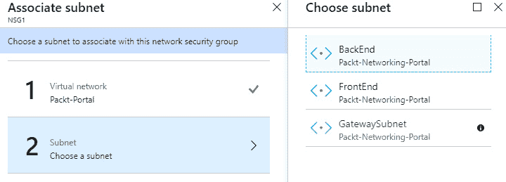

# 第四章：*第四章*：Azure 网络安全

在 *第一章*，《Azure 安全性简介》中，我们简要讨论了 Azure 中的网络安全，但仅讨论了 Microsoft 如何在 Azure 数据中心内处理网络安全。由于网络也属于共享责任模型，在本章中，我们将从用户的角度讨论网络安全，并探讨我们负责的安全处理方式。

本章将涵盖以下主题：

+   理解 Azure 虚拟网络

+   考虑其他虚拟网络的安全性

+   理解 Azure 应用程序网关

+   理解 Azure Front Door

# 理解 Azure 虚拟网络

从本地环境过渡到云的第一步是 **基础设施即服务** (**IaaS**)。IaaS 的一个关键要素是 **虚拟网络** (**VNets**)。虚拟网络是我们本地网络的虚拟表示，包含 IP 地址范围、子网及所有我们在本地基础设施中找到的其他网络组件。最近，我们也看到许多云网络组件被引入到本地网络中，尤其是 **软件定义网络** (**SDN**) 在 Windows Server 2016 操作系统中的引入。

在我们开始研究虚拟网络安全之前，让我们记住，命名标准应适用于所有 Azure 资源，网络也不例外。随着环境的扩大，这将帮助你更好地控制环境，简化管理，并对安全态势有更多洞察。

我们创建的每个虚拟网络都是 Azure 中完全隔离的网络。我们可以在一个订阅中创建多个虚拟网络，甚至在一个区域内创建多个虚拟网络。即使是在同一个订阅或区域内创建的虚拟网络之间也没有直接通信，除非另行配置。配置虚拟网络时，首先需要配置 IP 地址范围。接下来，我们需要一个具有自己范围的子网。一个虚拟网络可以有多个子网。每个子网必须在虚拟网络的 IP 地址范围内有自己的 IP 地址范围，并且不能与同一虚拟网络中的其他子网重叠。

在定义 IP 地址范围时，我们需要考虑的一点是，范围不能与我们使用的其他虚拟网络重叠。即使最初没有要求在不同虚拟网络之间建立连接，这也可能在未来成为需求。

重要提示

拥有重叠 IP 范围的虚拟网络将无法进行连接。

虚拟网络（VNet）用于通过私有 IP 地址在 Azure 资源之间进行通信。主要用于 Azure **虚拟机（VMs）**之间的通信，但其他资源也可以配置为使用私有 IP 地址进行通信。

Azure 虚拟机之间的通信通过**网络接口卡（NIC）**进行。每个虚拟机可以根据大小分配一个或多个 NIC。较大的虚拟机允许更多的 NIC 关联。每个 NIC 可以分配私有 IP 地址和公共 IP 地址。私有 IP 地址是必需的，公共 IP 地址是可选的。由于 NIC 必须有一个私有 IP 地址，因此它必须与同一虚拟网络（VNet）和子网关联。

作为第一道防线，我们可以使用**网络安全组（NSG）**来控制 Azure 虚拟机（VM）的流量。NSG 可以用于控制入站和出站流量。在创建 NSG 时会自动创建默认的入站和出站规则，但我们可以根据需求修改（或删除）这些规则并创建其他规则。默认的入站规则如图所示：


图 4.1 – 入站安全规则

默认的入站规则将允许来自虚拟网络（VNet）内的任何流量以及从 Azure 负载均衡器转发的任何流量。所有其他流量将被阻止。

相反，默认的出站规则将允许几乎所有的出站流量。默认规则将允许任何流向 VNet 或互联网的出站流量，如下图所示：


图 4.2 – 出站安全规则

要添加新的入站规则，我们需要定义源、源端口范围、目标、目标端口范围、协议、动作、优先级和名称。可选地，我们可以添加一个描述，帮助我们理解创建此规则的原因。以下图展示了如何创建一个允许通过端口`443`（HTTPS）的流量规则：


图 4.3 – 添加新的入站安全规则

或者，我们可以使用 Azure PowerShell 创建相同的规则：

1.  首先，我们需要创建一个资源组来部署资源：

    ```
    New-AzResourceGroup -Name "Packt-Security" -Location ` "westeurope"
    ```

1.  接下来，我们需要部署虚拟网络（VNet）：

    ```
    New-AzVirtualNetwork -Name "Packt-VNet" -ResourceGroupName ` "Packt-Security" -Location  "westeurope" -AddressPrefix ` 10.11.0.0/16
    ```

1.  最后，我们部署 NSG 并创建规则：

    New-AzNetworkSecurityGroup -Name "nsg1" -ResourceGroupName ` "Packt-Security" -Location "westeurope"

    ```
    $nsg=Get-AzNetworkSecurityGroup -Name 'nsg1' `
    -ResourceGroupName 'Packt-Security'
    $nsg | Add-AzNetworkSecurityRuleConfig -Name 'Allow_HTTPS' `
    -Description 'Allow_HTTPS' -Access Allow -Protocol Tcp `
    -Direction Inbound -Priority 100 -SourceAddressPrefix Internet `
    -SourcePortRange * -DestinationAddressPrefix * `
    -DestinationPortRange 443 | Set-AzNetworkSecurityGroup 
    ```

要添加新的出站规则，我们需要定义与入站规则相同的选项。以下图展示了如何创建一个拒绝通过端口`22`的流量规则：


图 4.4 – 添加新的出站安全规则

请注意，优先级在网络安全组（NSG）中起着非常重要的作用。数字越小表示优先级越高，数字越大表示优先级越低。如果我们有两个规则相互冲突，优先级较低的规则将优先执行。例如，如果我们创建了一个优先级为`100`的允许通过端口`443`的流量规则，而另一个优先级为`400`的规则拒绝通过端口`443`的流量，流量将被允许，因为允许规则的优先级更高。

同样，我们可以使用 Azure PowerShell 来创建规则：

```
$nsg | Add-AzNetworkSecurityRuleConfig -Name 'Allow_SSH' `
-Description 'Allow_SSH' `
-Access Allow -Protocol Tcp `
-Direction Outbound -Priority 100 `
-SourceAddressPrefix VirtualNetwork  -SourcePortRange * `
-DestinationAddressPrefix * -DestinationPortRange 22 `
| Set-AzNetworkSecurityGroup 
```

一个 NSG 可以与子网和 NIC 关联。与子网级别关联的 NSG 会将所有规则应用于该子网中所有关联的设备。当 NSG 与 NIC 关联时，规则只会应用于该 NIC。建议将 NSG 与子网关联，而不是与 NIC 关联，以便更简单的管理。当虚拟机数量较少时，管理 NIC 级别的流量比较简单。但当虚拟机数量达到几十、几百甚至几千时，管理 NIC 级别的流量就变得非常困难。将具有相似要求的虚拟机在子网级别关联会更好。

要将 NSG 与子网关联，请按以下步骤操作：

1.  转到 **NSG1** 下的 **子网** 部分，选择 **关联**，如下图所示：

    图 4.5 – NSG 子网面板

1.  接下来，我们选择虚拟网络，如下截图所示：

    图 4.6 – VNet 与 NSG 的关联

1.  最后，我们选择子网并确认：



图 4.7 – 子网与 NSG 的关联

现在，所有添加到该子网中的 Azure 虚拟机将立即应用所有 NSG 规则。

将 NSG 与子网关联的 Azure PowerShell 脚本如下：

```
$vnet = Get-AzVirtualNetwork -Name 'Packt-VNet' `
-ResourceGroupName 'Packt-Security'
Add-AzVirtualNetworkSubnetConfig -Name FrontEnd `
-AddressPrefix 10.11.0.0/24 -VirtualNetwork $vnet
$subnet = Get-AzVirtualNetworkSubnetConfig `
-VirtualNetwork $vnet -Name FrontEnd
$nsg = Get-AzNetworkSecurityGroup `
-ResourceGroupName 'Packt-Security' -Name 'nsg1'
$subnet.NetworkSecurityGroup = $nsg
Set-AzVirtualNetwork -VirtualNetwork $vnet 
```

以一个简单的三层应用架构为例。在这里，我们将有可以从外部访问的虚拟机（通过互联网），这些虚拟机应该放置在 DMZ 子网中，并与一个允许此类流量的 NSG 关联。接下来，我们将有一个应用层，它允许内部 VNet 中的流量，但不允许直接通过互联网访问。

应用层将与适当的子网关联，使用子网级别的 NSG 将拒绝互联网流量，但允许来自 DMZ 的任何流量。最后，我们将有一个数据库层，它只允许来自应用层的流量，使用与子网级别关联的 NSG。这样，任何请求都可以到达 DMZ 层。一旦请求被验证，它可以传递到应用层，然后再到达数据库层。DMZ 层与数据库层之间不允许直接通信，并且不允许从互联网直接请求访问应用层或数据库层。

为了更安全，资源可以与应用程序组关联。通过使用 NSG 和应用程序组，我们可以创建具有更多网络过滤选项的附加安全规则。

现在我们将讨论如何将本地网络与 Azure 连接。

## 将本地网络与 Azure 连接

在大多数情况下，我们已经有某种本地基础设施，并希望将云作为混合模式，将云和本地资源结合起来。在这种情况下，我们需要考虑如何从本地网络访问 **Azure 虚拟网络（VNet）**。

有三个可用选项：

+   **点对站连接（P2S）**通常用于管理。它使你能够从单个本地计算机创建到 Azure VNet 的连接。它有一个安全连接，但并不是最可靠的，不应用于生产环境，只能用于执行管理和维护任务。

+   **站点到站点连接（S2S）** 是一种更稳定的连接，它启用网络到网络的连接。在这种情况下，就是从本地网络到 VNet，在这种方式下，所有本地设备都可以连接到 Azure 资源，反之亦然。使用 S2S 使你能够将本地基础设施扩展到 Azure，使用混合云，并利用本地和云网络所能提供的最佳功能。

+   **ExpressRoute** 是从本地数据中心到 Azure 的直接连接。它不经过互联网，提供更好的连接。与 S2S 连接相比，ExpressRoute 提供更高的可靠性和速度，并具有更低的网络延迟。

接下来，我们将查看如何创建 S2S 连接。

## 创建 S2S 连接

为了创建 S2S 连接，必须创建多个资源。首先，我们需要创建一个 **虚拟网络网关（VNG）**。在创建 VNG 的过程中，我们需要定义订阅、VNG 的名称、创建的区域，并且必须选择一个 VNet。

可以选择的 VNet 限制于 VNG 将创建的区域。必须定义一个单独的网关子网，因此我们可以选择现有的子网，或者如果所选 VNet 上不存在该子网，则自动创建。

在同一部分，我们需要定义公共 IP 地址（创建一个新的或选择现有的）并选择启用（或禁用）主动-主动模式或 BGP。示例如下图所示。

需要填写以下详细信息：

+   **订阅**

+   **实例详细信息**

+   **公共 IP 地址**

你可以在下图中看到一个示例：


图 4.8 – 创建 VNG

另一个需要创建的资源是 **本地网络网关（LNG）**。创建 LNG 时，我们需要定义以下内容：

+   **名称**

+   **IP** **地址**

+   **地址** **空间**

+   **订阅**

+   **资源** **组**

+   **位置**

+   **BGP** **设置**

BGP 设置是可选的。我们需要定义的 IP 地址是我们 VPN 设备的公共 IP 地址，地址范围是我们本地网络的地址范围。示例如下图所示：


图 4.9 – 创建 LNG

在创建 VNG 和 LNG 后，我们需要在 VNet 中创建连接：

1.  在**VNet**面板中的**连接设置**下，添加一个新连接。

1.  需要定义以下参数：**名称**、**连接** **类型**、**虚拟** **网络** **网关**、**本地** **网络** **网关**、**共享密钥（PSK）**和**IKE** **协议**。

1.  **订阅**、**资源** **组**和**位置**将被锁定，并将使用与选定 VNet 相同的选项：


图 4.10 – 创建 VPN 连接

在 Azure 创建连接后，我们仍然需要在本地 VPN 设备上创建连接。强烈建议仅使用受支持的设备（大多数行业领导者的设备都支持，如 Cisco、Palo Alto 和 Juniper 等）。在本地 VPN 设备上配置连接时，我们需要考虑 Azure 端使用的所有参数。

一旦两边都配置了连接，隧道就会建立，我们应该能够从本地网络访问 Azure 资源，也可以从 Azure 访问本地网络。当然，我们可以控制流量的流动、什么可以访问什么、如何访问以及在什么条件下访问。

我们现在已经了解了如何在 Azure VNet 和本地网络之间创建连接。但我们经常需要连接一个 VNet 到另一个 VNet。当然，即使一切都在 Azure 内部，保持相同的安全级别仍然很重要。在下一部分中，我们将讨论如何在这种情况下连接网络。

## 连接一个 VNet 到另一个 VNet

在 Azure 中有多个 VNet 的情况下，我们可能需要在它们之间创建连接，以便允许服务在网络之间进行通信。我们可以通过两种方式来实现这一目标：

+   第一个步骤是创建 VNets 之间的 S2S 连接。在这种情况下，过程与创建 VNet 和本地网络之间的 S2S 非常相似。我们需要为两个 VNet 创建 VNG，但不需要 LNG。创建连接时，我们需要在**连接类型**中选择**VNet 到 VNet**，并选择适当的 VNG。

另一个选项是创建 VNet 对等连接。S2S 连接是安全且加密的，但它通过互联网传输。对等连接则使用 Azure 的骨干网络来路由流量，并且流量不会离开 Azure。这使得对等连接更加安全。

要在 VNets 之间创建对等连接，我们需要执行以下步骤：

1.  进入 VNet 面板中的对等连接部分，添加一个新的对等连接。

1.  我们需要定义名称和我们想要建立连接的 VNet。

1.  还有其他设置，例如是否允许双向连接，或者是否允许转发流量。

以下图示例展示了一个对等连接：


图 4.11 – 创建 VNet 到 VNet 的对等连接

理解 VNet 对等连接中的附加安全设置及其如何影响网络流量非常重要。

网络访问设置将定义从一个 VNet 到另一个 VNet 的流量访问。例如，我们可能希望启用从 **VNet A** 到 **VNet B** 的访问。但是，由于安全设置，我们希望阻止从 **VNet B** 到 **VNet A** 的访问。这样，**VNet A** 中的资源可以访问 **VNet B** 中的资源，但 **VNet B** 中的资源无法访问 **VNet A** 中的资源：


图 4.12 – VNet 对等连接

在下一节中，我们将定义如何处理转发的流量。假设 **VNet** **A** 连接到 **VNet** **B** 和 **VNet** **C**，并且 **VNet** **B** 和 **VNet** **C** 之间没有连接。在这些设置下，我们定义是否希望允许 **VNet** **B** 的流量通过 **VNet** **A** 到达 **VNet** **C**。反过来也可以进行相同的定义：


图 4.13 – 多个 VNet 的 VNet 对等连接

网关中继设置允许我们控制是否希望当前连接能够使用与另一个网络的其他连接。例如，**VNet** **A** 连接到 **VNet B**，且 **VNet B** 连接到本地网络（或另一个 VNet）。此设置将定义 **VNet A** 的流量是否能够到达本地网络。在这种情况下，VNet 中的一个将被本地网络替换。如果存在本地网络与 **VNet A** 之间的连接，并且 **VNet A** 与 **VNet B** 之间也存在连接，网关中继将决定是否允许 **VNet B** 的流量访问本地网络。

在下一节中，我们将讨论与安全性相关的最重要的内容，即 VNets 中的服务终结点。

## VNet 服务终结点

VNet 服务终结点使我们能够扩展一些**平台即服务（PaaS）**服务，以使用私有地址空间。通过服务终结点，我们可以将服务（默认情况下没有此选项的）连接到我们的 VNet，从而使服务能够通过私有 IP 地址进行通信。这样，流量永远不会公开暴露，数据交换会通过 Microsoft Azure 骨干网络进行。

仅某些 Azure 服务支持此功能：

+   Azure 应用服务

+   Azure 容器注册表

+   Azure Cosmos DB

+   Azure 数据湖

+   Azure MariaDB 数据库

+   Azure MySQL 数据库

+   Azure PostgreSQL 数据库

+   Azure 事件中心

+   Azure 密钥保管库

+   Azure 服务总线

+   Azure 存储

+   Azure SQL 数据库

+   Azure SQL 数据仓库

使用服务端点的第一个安全好处显然是数据永远不会离开私有空间。假设我们有 Azure 应用服务和 Azure SQL 数据库，它们通过服务端点连接到 VNet。在这种情况下，应用服务上的 Web 应用程序与 Azure SQL 数据库上的数据库之间的所有通信都将通过 VNet 安全地进行。没有数据会公开暴露，正如没有使用端点时使用相同服务的情况一样。

如果没有此功能，两个服务将只有公共 IP 地址，且它们之间的通信将通过互联网进行。虽然也有办法保证这种通信的安全性，例如通过 HTTPS 加密发送通信，但使用服务端点可以在一定程度上消除这种通信的安全风险。

但是，使用服务端点的安全性好处不仅仅止步于此。由于连接到 VNet 且使用服务端点的服务会从特定子网分配私有 IP 地址，所有与此子网相关的安全规则也会应用到我们的服务上。如果 NSG 阻止了子网上的特定流量，PaaS 服务的相同流量也会被阻止。

我们可以在创建 VNet 时，或者稍后启用 VNet 上的服务端点。服务端点是在子网级别启用的，可以在 VNet 或子网配置中进行此操作。按照以下步骤启用 VNet 中的服务端点：

1.  转到 VNet 配置页面，选择**服务端点**。点击**添加**，然后选择你想使用的子网和服务，如下图所示：

    ](img/Fig_4.14.jpg)

    图 4.14 – 添加 PaaS 服务端点

1.  转到**子网**配置，选择服务，如下图所示：


图 4.15 – 在子网上启用服务端点

在 VNet 和子网上启用服务端点只是工作的一半。我们还需要在 PaaS 服务中启用设置，才能使服务端点生效。当在服务设置中启用服务端点时，只有启用了服务端点的子网会显示出来。

使用服务端点后，我们完成了 Azure VNet 设置中直接可用的网络部分。但在网络安全方面，还有其他需要考虑的因素。让我们看看在 Azure 中增加网络安全性还有哪些其他可用的功能。

# 考虑其他虚拟网络的安全性

为了增强安全性和流量控制，可以使用**网络虚拟设备（NVA）**。NVA 可以通过 Azure Marketplace 部署。部署后，你会发现 NVA 实际上是一个安装了第三方防火墙的 Azure 虚拟机。大多数行业领导者都在 Azure Marketplace 中提供解决方案，我们可以部署我们在本地环境中习惯的防火墙解决方案。需要提到的是，我们不必在 NSG 和 NVA 之间做出选择；这两者可以结合使用，以提供额外的安全性。

使用 Azure 防火墙还可以实现额外的网络安全。Azure 防火墙是一种作为服务提供的防火墙。它比 NSG 提供更好的网络控制，在许多方面可以与 NVA 解决方案进行比较。但与 NVA 相比，Azure 防火墙也有一些优势，如内置高可用性、可以部署到多个可用区的选项以及不受限制的云扩展性。这意味着无需负载均衡器。我们可以将 Azure 防火墙跨多个可用区部署（并实现 99.99% 的 SLA），并且扩展配置可以自动适应网络流量的任何变化。支持的选项包括：应用程序过滤、网络流量过滤、FQDN 标签、服务标签、出站 SNAT 支持、入站 DNAT 支持以及多个公共 IP 地址。通过这些选项，我们可以对 VNet 中的网络流量进行完全控制。需要注意的是，Azure 防火墙符合许多安全标准，如 SOC 1 Type 2、SOC 2 Type 2、SOC 3、PCI DSS 和 ISO 27001、27018、20000-1、22301、9001 和 27017。

接下来，我们将查看如何通过 Azure 门户部署和配置 Azure 防火墙。

## Azure 防火墙的部署和配置

本示例——部署和配置 Azure 防火墙——需要使用 Azure PowerShell。但是，也可以通过 Azure 门户配置和部署 Azure 防火墙。

### Azure 防火墙的部署

为了部署 Azure 防火墙，我们需要设置所需的网络和基础设施：

1.  首先，我们需要创建子网，创建一个 VNet，并将子网与 VNet 关联：

    ```
    $FWsub = New-AzVirtualNetworkSubnetConfig -Name ` AzureFirewallSubnet -AddressPrefix 10.0.1.0/26
    $Worksub = New-AzVirtualNetworkSubnetConfig -Name Workload-SN ` -AddressPrefix 10.0.2.0/24
    $Jumpsub = New-AzVirtualNetworkSubnetConfig -Name Jump-SN `  
    -AddressPrefix 10.0.3.0/24 
    $testVnet = New-AzVirtualNetwork -Name Packt-VNet `
    -ResourceGroupName Packt-Security -Location "westeurope" `
    -AddressPrefix 10.0.0.0/16 -Subnet $FWsub, $Worksub, $Jumpsub 
    ```

1.  接下来，我们需要部署 Azure 虚拟机（VM），该虚拟机将用作跳跃盒子（我们连接到该虚拟机以便对网络中的其他虚拟机执行管理任务；我们不会直接连接到其他虚拟机，而是通过跳跃盒子进行连接）：

    ```
    New-AzVm -ResourceGroupName Packt-Security -Name "Srv-Jump" `
    -Location "westeurope" -VirtualNetworkName Packt-VNet `
    -SubnetName Jump-SN -OpenPorts 3389 -Size "Standard_DS2" 
    ```

1.  在跳跃盒子之后，我们创建一个测试虚拟机（VM）：

    ```
    $NIC = New-AzNetworkInterface -Name Srv-work `
    -ResourceGroupName Packt-Security -Location "westeurope" `
    -Subnetid $testVnet.Subnets[1].Id
    $VirtualMachine = New-AzVMConfig -VMName Srv-Work -VMSize ` "Standard_DS2"
    $VirtualMachine = Set-AzVMOperatingSystem -VM $VirtualMachine `
    -Windows -ComputerName Srv-Work -ProvisionVMAgent `
    -EnableAutoUpdate
    $VirtualMachine = Add-AzVMNetworkInterface -VM $VirtualMachine ` -Id $NIC.Id
    $VirtualMachine = Set-AzVMSourceImage -VM $VirtualMachine `
    -PublisherName 'MicrosoftWindowsServer' -Offer 'WindowsServer' ` -Skus '2016-Datacenter' -Version latest
    New-AzVM -ResourceGroupName Packt-Security -Location ` "westeurope" -VM $VirtualMachine -Verbose 
    ```

1.  最后，我们部署 Azure 防火墙：

    ```
    $FWpip = New-AzPublicIpAddress -Name "fw-pip" `
    -ResourceGroupName  Packt-Security -Location "westeurope" `
    -AllocationMethod Static -Sku Standard
    $Azfw = New-AzFirewall -Name Test-FW01 -ResourceGroupName `
    Packt-Security -Location "westeurope" -VirtualNetworkName ` Packt-VNet -PublicIpName fw-pip
    $AzfwPrivateIP = $Azfw.IpConfigurations.privateipaddress 
    ```

1.  接下来，我们将查看 Azure 防火墙的配置。

#### Azure 防火墙的配置

部署 Azure 防火墙后，它实际上什么也不做。我们需要创建配置和规则，以使 Azure 防火墙生效：

1.  首先，我们将创建一个新的路由表，并禁用 BGP 传播：

    ```
    $routeTableDG = New-AzRouteTable -Name Firewall-rt-table `
    -ResourceGroupName Packt-Security -location "westeurope" `
    -DisableBgpRoutePropagation
    Add-AzRouteConfig -Name "DG-Route" -RouteTable $routeTableDG `
    -AddressPrefix 0.0.0.0/0 -NextHopType "VirtualAppliance" `
    -NextHopIpAddress $AzfwPrivateIP | Set-AzRouteTable
    Set-AzVirtualNetworkSubnetConfig -VirtualNetwork $testVnet `
    -Name Workload-SN -AddressPrefix 10.0.2.0/24 `
    -RouteTable $routeTableDG | Set-AzVirtualNetwork 
    ```

1.  接下来，我们创建一个应用程序规则，允许访问 [www.google.com](http://www.google.com) 的出站流量：

    ```
    $AppRule1 = New-AzFirewallApplicationRule -Name Allow-Google `
    -SourceAddress 10.0.2.0/24 -Protocol http, https `
    -TargetFqdn www.google.com
    $AppRuleCollection = New-AzFirewallApplicationRuleCollection `
    -Name App-Coll01 -Priority 200 -ActionType Allow -Rule $AppRule1
    $Azfw.ApplicationRuleCollections = $AppRuleCollection
    Set-AzFirewall -AzureFirewall $Azfw 
    ```

1.  然后，我们创建一个规则，允许在端口 `53` 上进行 DNS 访问：

    ```
    $NetRule1 = New-AzFirewallNetworkRule -Name "Allow-DNS" `
    -Protocol UDP -SourceAddress 10.0.2.0/24 `
    -DestinationAddress 209.244.0.3,209.244.0.4 -DestinationPort 53
    $NetRuleCollection = New-AzFirewallNetworkRuleCollection `
    -Name RCNet01 -Priority 200 -Rule $NetRule1 -ActionType "Allow"
    $Azfw.NetworkRuleCollections = $NetRuleCollection
    Set-AzFirewall -AzureFirewall $Azfw 
    ```

1.  然后，我们需要为网络接口卡（NIC）分配一个 DNS：

    ```
    $NIC.DnsSettings.DnsServers.Add("209.244.0.3")
    $NIC.DnsSettings.DnsServers.Add("209.244.0.4")
    $NIC | Set-AzNetworkInterface
    ```

尝试连接到跳跃盒子，然后通过跳跃盒子测试虚拟机。从测试虚拟机尝试解析多个 URL。只有 [www.google.com](http://www.google.com) 应该成功，因为除非我们创建了明确的允许规则，否则所有出站流量都会被拒绝。

让我们继续了解 PaaS 中的网络，并查看除了使用服务端点保护 PaaS 外，还有哪些可用的选项。即使服务端点公开可用，我们也能更好地控制网络并防止不需要的流量。

# 了解 Azure 应用程序网关

下一个可以帮助增加安全性的 Azure 服务是应用网关。应用网关是一个用于 Web 应用程序的流量负载均衡器，能够管理 Web 应用程序的流量。它作为**第 7 层（L-7**或**应用层）**负载均衡器运行。这意味着它支持基于 URL 的路由，并可以根据 URI 路径或主机头路由请求。

应用网关支持**安全套接字层（SSL/TSL）**终止网关。网关之后，流量以未加密形式流向后端服务器，后端服务器无需承担加密和解密的开销。但是，如果因为安全、合规性或其他要求而不选择此选项，则还支持全端到端加密。

应用网关还支持可伸缩性和区域冗余。可伸缩性允许根据流量负载进行自动扩展，而区域冗余允许将服务部署到多个可用区，以提供更好的故障容错性，并消除手动部署到多个区域的需求。

总体而言，Azure 应用网关是一个 L-7 负载均衡器，如果排除 SSL/TSL 终止，我们可以质疑其安全方面，因为这更多是可靠性和可用性的问题。但是，应用网关具有一个称为 Azure **Web 应用防火墙（WAF）**的出色安全功能。WAF 保护 Web 应用程序免受常见的攻击和漏洞。

WAF 基于**开放式 Web 应用安全项目（OWASP）**，并更新以解决最新的漏洞。由于它是平台即服务（PaaS），所有更新都会自动完成，无需用户配置。从策略的角度来看，我们可以创建多个自定义策略，并将不同的策略集应用于不同的 Web 应用程序。

两种模式可供选择：检测模式和预防模式。在检测模式下，WAF 将检测所有可疑请求，但不会阻止它们，只会记录下来。需要强调的是，WAF 可以与不同的日志工具集成，因此日志可以用于审计目的。在预防模式下，WAF 还将阻止任何恶意请求，返回`403 unauthorized access`异常，并关闭连接。预防模式也会记录所有攻击。

攻击按四个严重级别分类：

+   严重（5）

+   错误（4）

+   警告（3）

+   注意（2）

每个级别都有一个严重性值，阻止的阈值为`5`。因此，单个严重问题足以阻止值为`5`的会话，但至少需要 2 个错误问题才能阻止会话，因为一个值为`4`的错误低于阈值。

WAF 在应用网关之前起到过滤器的作用 - 它会处理请求，决定其是否有效，并根据此决定允许请求继续传递到应用网关或拒绝请求。一旦 WAF 允许请求通过，应用网关则作为正常的 L-7 负载均衡器运行，就好像 WAF 已关闭一样。您可以在以下图中看到这一点：


图 4.16 – 应用网关流量流动

下面列出了一些可以通过 WAF 检测并防止的攻击：

+   SQL 注入

+   跨站脚本攻击

+   命令注入

+   请求走私

+   响应分割

+   HTTP 协议违反和异常

+   防护爬虫和扫描器

+   地理过滤流量

应用网关上的 WAF 支持将日志选项传输到 Azure Monitor、诊断日志存储到存储账户，并与安全工具如 Azure Security Center 或 Azure Sentinel 集成。

# 了解 Azure Front Door

Azure Front Door 与应用网关的工作方式非常相似，但它位于不同的层级。像应用网关一样，它是一个具有 SSL 卸载的 L-7 负载均衡器。不同之处在于，应用网关只与单一区域中的服务协作，而 Azure Front Door 允许我们在全球范围内定义、管理和监控路由。通过 Azure Front Door，我们可以通过全球分发确保最高的可用性。使用 Azure Traffic Manager 也能实现类似的全球分发功能，但该服务不具备 L-7 负载均衡和 SSL 卸载功能。

Azure Front Door 提供的功能实际上结合了应用网关和流量管理器，以实现具有全球分发的 L-7 负载均衡器。还需要提到的是，Azure Front Door 上还可以使用 WAF。通过在 Azure Front Door 上使用 WAF，我们可以为全球分布的应用程序提供 Web 应用保护。

# 总结

本章我们讨论了网络安全，之前我们还讨论了如何管理云身份。我们需要记住，网络安全不仅仅止步于 IaaS 和 VNets。网络安全的基础通常与 VNets 和 NSGs 相关。但即使是在 IaaS 中，也不止于此，我们可以通过 NVA 或 Azure 防火墙来扩展安全性。在 PaaS 中，我们可以利用 VNet 的服务端点，并通过应用网关或 Azure Front Door 等服务进一步扩展安全性。

但是，尽管有许多限制我们访问资源的前提条件，如谁、如何、何时以及从哪里获取资源，我们仍然需要处理敏感信息和数据。下一章将讲解如何使用 Azure Key Vault 管理证书、机密、密码和连接字符串。

# 问题

1.  我们可以通过……控制虚拟网络中的流量

    A. 网络接口

    B. 网络安全组（NSG）

    C. 访问控制列表（ACL）

1.  与本地网络连接可用的类型是什么？

    A. 点到站点

    B. 站点到站点

    C. VNet 对 VNet

1.  虚拟网络之间的连接可以通过……

    A. VNet 对 VNet

    B. VNet 对等连接

    C. 以上两项

    D. 以上都不正确

1.  哪个功能允许我们将 PaaS 服务连接到虚拟网络？

    A. 服务连接

    B. 服务端点

    C. ExpressRoute

1.  当涉及多个网络时……

    A. 我们可以定义路由

    B. 默认情况下，流量被阻止

    C. 默认情况下，流量允许

    D. A 和 B 正确

    E. A 和 C 正确

1.  在应用程序网关中，哪个功能可以增加额外的安全性？

    A. 开放网络应用安全项目（OWASP）

    B. 网络应用防火墙（WAF）

    C. **安全套接字层**（SSL）/ 传输层安全协议（TSL）

1.  什么类型的攻击无法通过应用程序网关进行阻止？

    A. SQL 注入（SQLi）

    B. 跨站脚本攻击（XSS）

    C. 分布式拒绝服务攻击（DDoS）

    D. HTTP 协议违规
