# 第八章：*第七章*：Azure 安全中心

Azure 安全中心旨在成为一款工具，提供您混合云环境当前安全配置的统一概览，并告知您有关当前威胁和攻击的信息。

在本章中，我们将覆盖以下主题：

+   介绍 Azure 安全中心

+   安全评分和建议

+   自动化响应

+   Azure 虚拟机的及时访问

+   高级云防御

# 介绍 Azure 安全中心

随着云计算成为现代 IT 世界的主要范式，许多好处伴随着这种新工作方式而来。IT 不再是目的本身，员工的生产力远远超过过去。但在保护现代 IT 环境方面，也出现了新的挑战。

在*第三章*，*管理云身份*，我们已经讨论了高级身份保护，并指出仅仅保护网络边界已不再足够，然而，云计算带来的一些其他主要安全挑战也值得关注。

如何确保保护您不断变化的云服务和应用程序？这是云计算的价值主张之一，实际上，可能最大的好处就是您可以轻松地在云环境中进行变更和适应。无论是**定义缩略语连续集成（CI）/持续交付（CD），虚拟机（VM）**，还是定义缩略语扩展，或服务退役，云环境都在动态变化。但同时，主要挑战之一是跟踪这些变化，并确保公司服务始终符合其安全基准。

威胁态势正在演变，攻击变得愈发复杂。攻击者正在使用攻击自动化和规避技术，同时，他们利用帮助其在网络攻击链条上实施攻击的工具。因此，他们不再需要成为高度训练的技术专家，这导致了越来越多复杂的攻击，其中一些是网络钓鱼和凭证盗窃攻击。此外，攻击者还利用被劫持的计算机，通过机器人网络发起广泛传播的密码喷射攻击，这种攻击可能很难识别。

我们需要人类的专业知识、创造力和适应能力来对抗人类威胁行为者。问题是，安全技能短缺。目前，全球网络安全领域大约有 300 万个空缺职位，并且这一数字还在增加。这不仅包括网络威胁猎人，还包括专注于管理内部 IT 系统的安全工程师和管理员。

Azure 安全中心是一个提供两大主要解决方案的服务：

1.  作为**云安全态势管理**（**CSPM**）解决方案，Azure 安全中心不断提供关于所有云资源当前配置状态的信息，以避免安全方面的错误配置。

1.  作为**云工作负载保护平台**（**CWPP**），Azure 安全中心提供针对服务器的网络威胁防护，无论这些服务器运行在 Microsoft Azure、内网，还是其他云平台，同时也保护您在 Azure 中的云原生工作负载，例如密钥库、存储账户、SQL 数据库等，免受威胁：

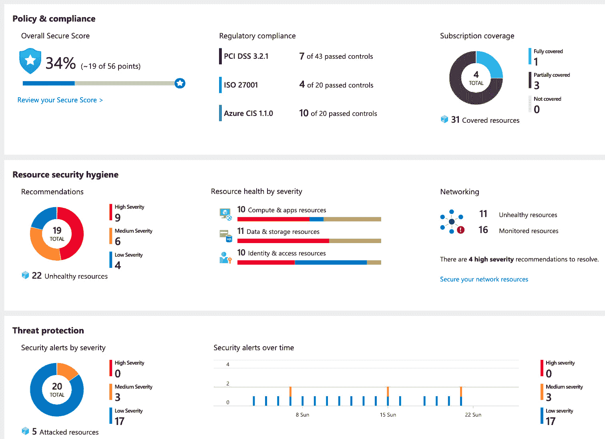

图 7.1 – Azure 安全中心概览仪表板

中央 Azure 安全中心**概览**仪表板分为三个不同的区域：

+   **政策与合规性**

+   **资源安全卫生**

+   **威胁防护**

在**政策与合规性**部分，您将找到有关*合规性*和*治理*的所有信息。例如，**订阅覆盖范围**为您提供关于所有订阅中 Azure 安全中心注册状态的洞察。换句话说，您可以查看您的租户中是否存在未受 Azure 安全中心覆盖的 Azure 订阅。您还将看到您的**总体安全评分**，这是一个反映您环境保护状况的数字，表示保护得有多好（或多差）。最后，**法规合规性**是 Azure 安全中心的一部分，它将帮助您确保您的云环境符合诸如**Azure CIS 1.1.0**和**ISO27001**等法规。

Azure 安全中心的第二部分，**资源安全卫生**，是一个展示当前安全配置建议的区域。通过持续评估您的环境配置，Azure 安全中心会向您提供有关安全最佳实践的建议，帮助您保护环境。

在**威胁防护**部分，作为三个主要部分中的最后一部分，Azure 安全中心向您展示当前的安全警报与事件（这些是多个警报的累积，已结合背景呈现）：

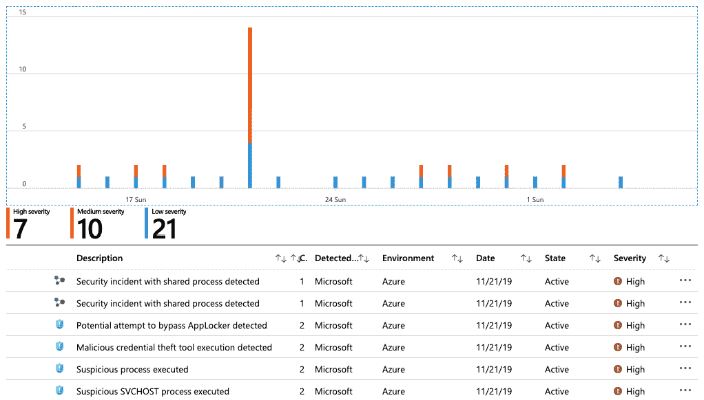

图 7.2 – 安全警报与事件

您可以选择一个事件或警报，以获取更多关于背景信息以及每个警报的修复步骤，并可以触发一个 Azure 逻辑应用作为响应。例如，您可以创建一个逻辑应用，发送电子邮件或发布到 Microsoft Teams 频道。

注意：

Azure 安全中心是为负责保护（混合）企业基础设施的安全工程师和管理员设计的工具。它有助于实施安全最佳实践并提供安全概览。对于威胁狩猎和深入挖掘警报及事件，您最好使用 Azure Sentinel，这是一种 SIEM/SOAR 解决方案，我们将在*第八章*中讨论，*Azure Sentinel*。

现在，您已经对 Azure 安全中心及其**概览**仪表板有了一个快速的了解，让我们更深入地探讨一下它是如何在技术上运作的。

## 启用 Azure 安全中心

在利用 Azure 安全中心的第一步中，我们必须启用此服务并提供初始配置参数。在开始之前，有几个关键组件需要考虑。

Azure 安全中心基本上依赖于 Azure 日志分析及其相关工作区、智能安全图和 Azure 策略：

+   **日志分析工作区**用于存储各种日志信息，例如 Windows Server 安全事件日志或 Linux 服务器的 syslog 条目，也用于存储安全警报和其他信息。

+   **智能安全图**是一个基于 AI/ML 的后台，用于通过评估 Microsoft 产品和服务每天生成的数十亿个威胁信号来识别攻击和威胁。Azure 安全中心**威胁防护**部分中的警报和事件基本上是通过智能安全图生成的（以及依赖它并集成到 Azure 安全中心中的工具，如 Microsoft Defender ATP）。

+   **Azure 策略**，我们在*第二章*中已经介绍过的服务，*治理与安全*，是 Azure 安全中心中的建议所依赖的。

Azure 安全中心有两种不同的定价层级：

+   免费

+   标准

使用 Azure 安全中心的免费层，您可以访问 Azure 安全评分，并持续评估当前配置以及为 Azure 资源提供安全建议。如果您还希望保护本地服务器或运行在其他公共云平台上的虚拟机，或者如果您想利用其他功能，如按需虚拟机访问、适应性应用控制和网络硬化、合规性仪表板、威胁防护等，您需要启用 Azure 安全中心的标准层。

标准层定价取决于您保护的资源，并按以下方式计算：

+   虚拟机和服务器：每个节点每月 $15

+   Azure 应用服务：每个实例每月 $15

+   PaaS SQL 服务器：每个服务器每月 $15

+   存储帐户：每 10,000 次存储事务 $0.02

+   虚拟机上的 SQL 服务器：免费（预览期间）

+   容器注册表：每个容器镜像 $0.29（预览定价）

+   Azure K8s 服务：每个虚拟机核心每月 $2（预览定价）

    重要提示

    即使是 Azure 安全中心的免费层，Azure 日志分析的定价仍然适用。对于 Azure 安全中心的标准层也是如此，日志分析的定价将在 ASC 标准层费用的基础上计算。预览定价在相关服务正式发布后可能会发生变化（**GA**）。

在开始使用 Azure 安全中心之前，你必须定义每个 Azure 订阅所需的定价层，并将 Azure 安全中心连接到一个日志分析工作区。你可以通过导航到 Azure **安全中心**门户，选择 **定价与设置**，在这里你可以为每个 Azure 订阅定义定价层和其他全局设置：

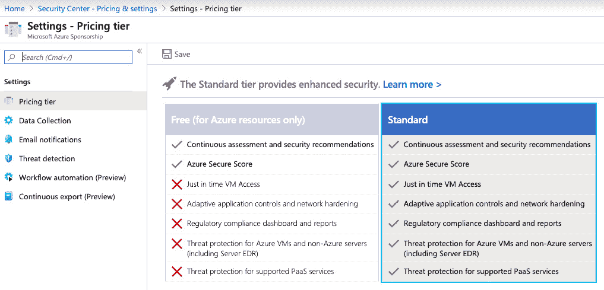

图 7.3 – 选择 Azure 安全中心定价层

在`自动配置`中，它启用 Microsoft 监控代理的自动安装：

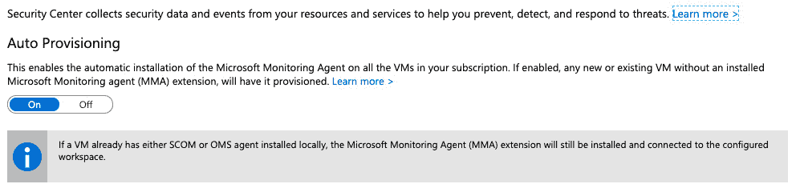

图 7.4 – 启用自动配置

你还需要定义是否希望使用由 Azure 安全中心自动创建的默认日志分析工作区，或者是否希望使用现有的工作区：

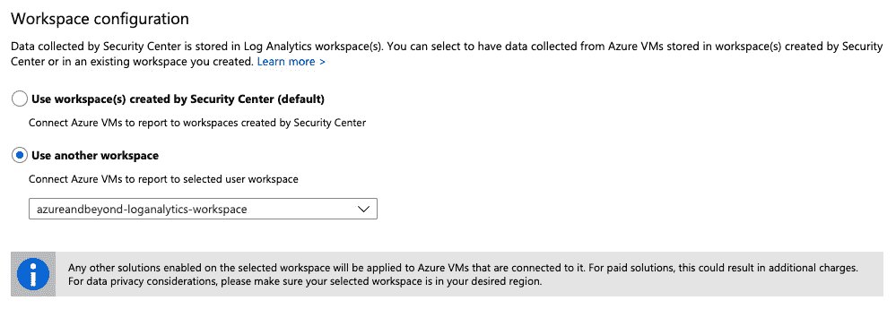

图 7.5 – 选择你的日志分析工作区配置

在这一部分，你需要做的最后一个决定是关于你希望提交到配置的日志分析工作区的安全性和 AppLocker 事件日志文件的数量。你可以在以下选项之间进行选择：

+   **无**

+   **最小**

+   **常见**

+   **所有事件**

启用 Azure 安全中心后，我们可以开始享受它所提供的所有优势，并使 Azure 安全性变得更好。但 Azure 安全中心不仅限于云资源，还可以扩展到本地资源。接下来，我们将查看 Azure 安全中心提供的工具，这些工具使我们能够提高我们的安全态势。

# Azure 安全评分与建议

像其他一些 Microsoft 企业云服务一样，例如 Azure AD 和 Office 365，Azure 安全中心现在也提供一个安全游戏化选项——**Azure 安全评分**。其思想是展示你在当前部署的 Azure 资源上可以达到的最大分数，以及你当前的安全评分是多少。得分越高，安全态势就越好。这就像是把云安全的复杂性简化成了一个简单的游戏：

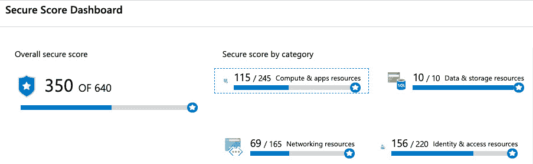

图 7.6 – Azure 安全评分仪表板

**安全得分仪表板**为您提供了当前**整体安全得分**和**按类别划分的安全得分**的概览。如果您点击某个安全得分类别，您将看到该类别内的建议及其相应的安全得分影响。建议的安全得分影响越大，修复相应配置错误的优先级就越高。

提示

安全得分并不反映行业标准的安全基准；例如，超过 700 分（满分 1000 分）是安全的，低于 300 分则极为不安全。安全得分仅计算您可以根据当前已部署资源和已满足的建议所能获得的分数，就像玩游戏一样。

两个 Azure 环境的安全得分是无法直接比较的。您只能说，得分越高越好。如果您比较**图 7.1：Azure 安全中心概览仪表板**和**图 7.6：Azure 安全得分仪表板**，您会发现整体安全得分不一致（393/655 与 350/640）。这些截图显示的是相同的 Azure 环境，之间相隔 6 天。在此期间，有一些资源被删除，但没有其他配置更改。Azure 安全得分可以用于比较同一环境在不同时间点的安全水平。您的云配置的每一个变化都会影响整体安全得分，而 Azure 安全得分直接与建议相关。因此，您满足的建议越多，您的安全得分就会越高。现在，让我们继续查看建议，看看那里提供了什么。

## 与建议合作

在*第二章*，《治理与安全》中，您已经学习了监控在安全方面的重要性，以及如何利用策略为您的 Azure 环境创建保护措施。Azure 安全中心的一个优点是，一旦您访问 Azure 门户中的**Azure 安全中心**仪表板，其免费层会自动启用，安全策略、持续的安全评估和帮助您保护 Azure 资源的建议会自动包含在内。这些建议是安全最佳实践，可以在您的安全策略中启用或禁用，该策略依赖于您在*第二章*《治理与安全》中学习到的 Azure 策略服务。每个建议都涉及一个审核策略，如果某个资源未能遵守特定政策，**建议**仪表板将反映此失败资源：

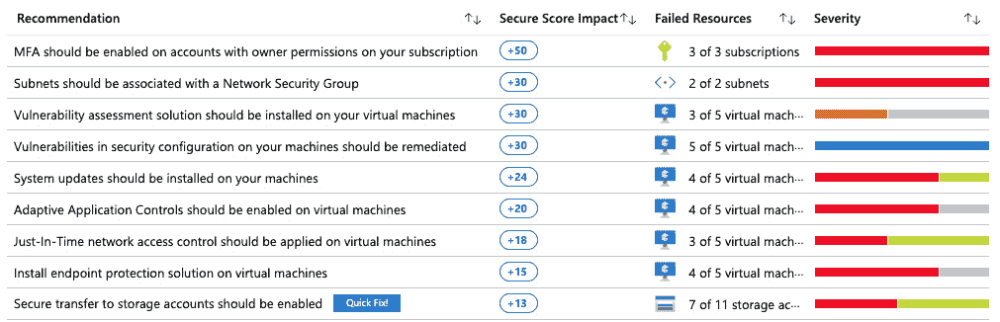

](img/Fig_7.7.jpg)

图 7.7 – Azure 安全中心建议仪表板中的失败资源

单击建议之一时，您将看到该建议保护的描述和威胁。根据建议，您可以直接从 Azure 安全中心补救，或者您将获得有关手动补救步骤的信息。从前面截图中的 **快速修复！** 按钮可以使几个建议的单击修复生效，其中之一是禁用所有存储帐户的不安全连接。

# Azure 安全中心社区

此部分在 **Azure 安全中心 (ASC)** 刀片中包含一些非常有用的链接，可以帮助您扩展对 Azure 安全中心的使用。在社区论坛中，您可以查看各种公告、提问问题或查找先前发布的问题。社区博客提供了一些关于某些主题的详细描述和操作指南。用户声音为您提供了请求新功能或改进的机会。

Azure 安全中心社区部分中的一个有用链接是 Azure 安全中心 GitHub 仓库。该仓库包含仍在预览中的安全建议、Azure 策略自定义定义以进行规模管理、用于自动响应（警报或自动修复）的逻辑应用模板，以及以编程方式工具和 PowerShell 脚本形式的安全修复。这是一个社区仓库，因此每个人都有机会贡献。如果您撰写了模板、脚本或其他有用的内容，并认为它们可能对他人有帮助，请随时提交。

# Azure 安全中心中的工作流自动化和部分

在开始工作流自动化之前，我们需要快速解释一下逻辑应用是什么。

**Azure 逻辑应用** 是一种云服务，帮助您安排、自动化和编排不同的任务、流程和工作流。它还提供与组织中不同应用程序、数据集、系统和服务集成的能力。这使得它在多种场景中非常有用，无论您是想创建重复的自动化任务，根据条件触发操作，还是连接不同的系统。

在使用逻辑应用与 Azure 安全中心时，我们可以利用工作流自动化来设置逻辑应用以响应 Azure 安全中心的警报。警报可以分为组、威胁和建议。根据警报，我们可以根据严重性和类型定义自动响应。

例如，我们可以设置一个逻辑应用，以便在 Azure 安全中心检测到暴力攻击时自动触发。我们需要创建一个工作流，根据检测到的威胁自动触发逻辑应用，如下图所示：

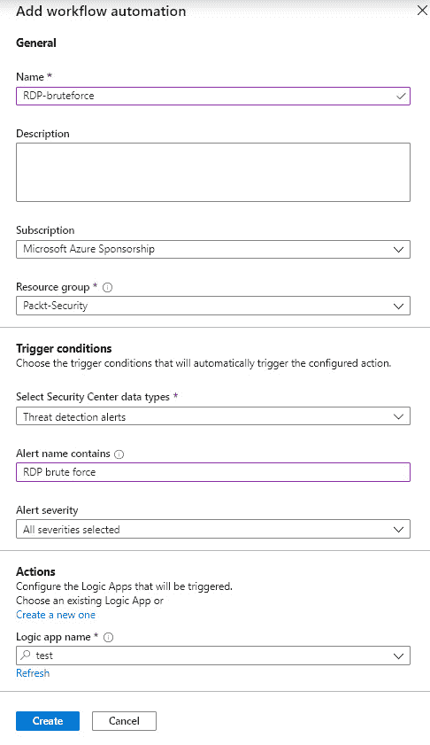

图 7.8 – 在工作流自动化中配置逻辑应用触发器

这只会为指定的逻辑应用程序设置一个触发器。我们仍然需要为响应配置一个逻辑应用程序。例如，我们可以发送一个通知，告知检测到暴力破解攻击。逻辑应用程序配置了许多连接器，我们可以设置其中一个或多个。常见的选项包括发送电子邮件通知或在 Teams 小组中发布消息：

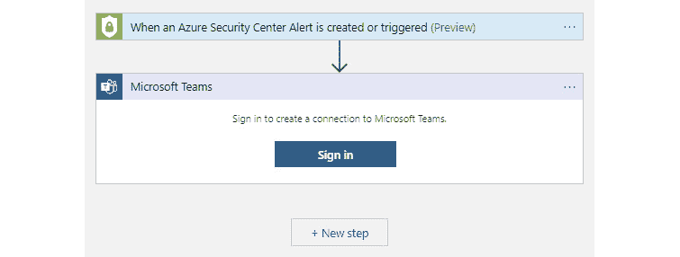

图 7.9 – 配置警报以发布到 Teams 频道

这只是自动响应的一个示例。我们可以设置许多自定义操作，例如暂时禁用对受攻击资源的访问，或阻止来自攻击源的 IP 地址的访问。Azure 安全中心 GitHub 仓库提供了许多可用于自动化响应的模板和脚本。

## 政策与合规性

涵盖政策和合规性部分包含四个子部分：

+   覆盖范围

+   安全分数

+   安全策略

+   合规性要求

覆盖范围和安全分数部分提供了每个订阅的安全概况。覆盖范围部分显示了每个订阅启用的 Azure 安全中心计划，以及每个订阅覆盖的资源数量。安全分数部分可以在主仪表板上看到，但这次它提供了每个订阅的信息，显示每个订阅的分数。

安全策略部分帮助您定义 Azure 安全中心将发送何种类型的安全建议。默认情况下，建议将基于最常见的合规性标准和自定义 Azure CIS 进行。此设置可以在订阅级别进行，我们可以为不同的订阅设置不同的配置。

默认设置的示例如下图所示：

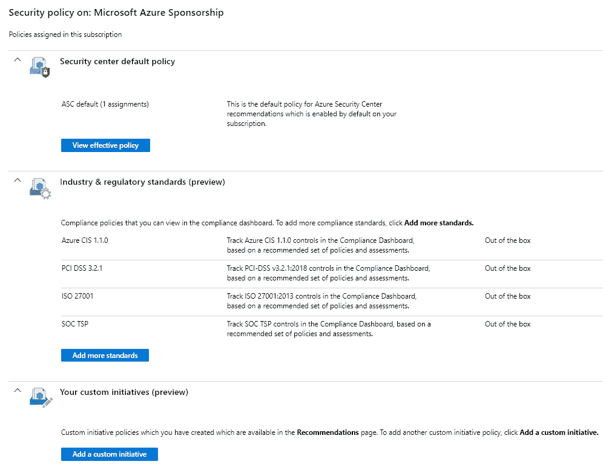

图 7.10 – 默认策略设置

默认启用的标准策略包括 Azure CIS 1.1.0、PCI DSS 3.2.1、ISO 27001 和 SOC TSP。还可以使用的额外行业和监管标准包括 NIST SP 800-53 R4、英国官方和英国 NHS、加拿大联邦 PBMM 以及 SWIFT CSP CSCF v2020。

除了行业和法规标准外，我们还可以创建适用于我们组织的自定义策略。通过自定义策略，我们可以根据特殊需求跟踪 Azure 环境中的事件。要创建自定义策略，我们需要定义一个应用此策略的订阅，并选择我们希望跟踪的定义。例如，我们可以设置一个策略，跟踪 SQL 托管实例是否启用了透明数据加密（TDE）并使用自定义密钥，或是否启用了 Azure 虚拟机的 Azure 备份。Azure 安全中心将跟踪定义订阅中的资源，并在策略未应用时发送通知。需要提到的是，这只会跟踪并发送通知，指出资源未符合政策要求。我们需要根据建议采取行动并进行更改，才能真正改变资源的状态并确保符合要求。

以下截图显示了自定义策略的示例：

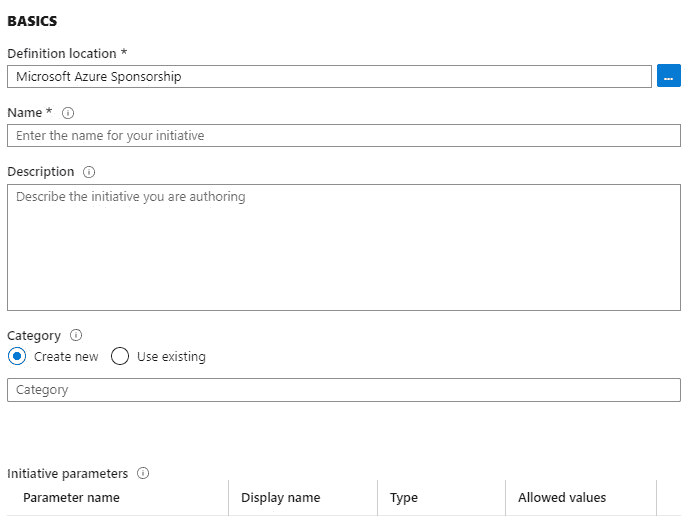

图 7.11 – 创建自定义安全策略

通过安全策略，我们可以定义希望符合的行业标准（如果有的话）。在法规合规性下，我们可以看到在每个标准的评估中，我们的订阅情况如何。目前有四个标准可用：Azure CIS 1.1.0、PCI DSS 3.2.1、ISO 27001 和 SOC TSP。每个标准都有控制项，我们可以看到哪些控制项通过了，哪些失败了。总共有 330 个控制项在标准之间进行干预。法规合规性部分提供了所有控制项的概览，以及每个单独标准的控制项，如下图所示：

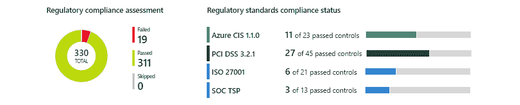

图 7.12 – 法规合规性概览

对于每个可用的标准，我们可以查看一个更详细的报告，包含通过和失败的控制项信息。与建议类似，我们也有一个需要采取的行动列表，以通过控制项测试。和建议一样，行动可以以我们需要手动执行的指令形式呈现，或者可以提供一个快速修复方案来解决问题。

以下截图显示了失败的控制项示例：

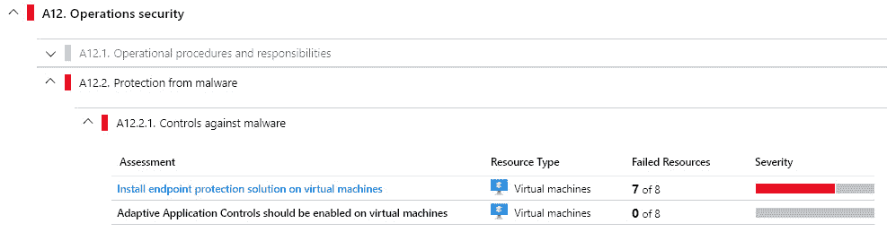

图 7.13 – 法规合规性概览

控制项仅作为指导，不能自动固定。失败的控制项列表是提醒我们需要解决和修复的问题，以便通过控制项测试。

资源安全卫生

本节提供了 Azure 安全中心建议的不同视图。该部分分为以下子部分：

+   **建议**

+   **计算与应用**

+   **网络**

+   **物联网中心与资源**

+   **数据与存储**

+   **身份与访问**

+   **安全解决方案**

**推荐**部分提供了与概述中相同的信息，其余子部分根据类型提供了子类别。例如，**网络**子部分仅提供与 Azure 网络服务相关的推荐，如网络安全组、网络接口、虚拟网络等。

最后的子部分，**安全解决方案**，启用了将第三方工具与 Azure Security Center 集成的功能。我们可以将非 Azure 服务器添加到 Azure Security Center 进行监控，将 Azure Security Center 日志发送到 SIEM，或添加 Web 应用防火墙或下一代防火墙。

许多公司和组织需要一个集中日志解决方案——**SIEM**（**安全信息和事件管理**）。所有具有自定义日志记录功能的产品和系统，以及能够帮助你识别整个组织中事件的集中解决方案，都是非常有用的。因此，将 Azure Security Center 收集的信息和日志发送出去的能力可能是一个非常重要的要求，尤其是对于大型组织和企业。一些可能与 Azure Security Center 集成的 SIEM 解决方案包括 IBM QRadar、Splunk、SumoLogic、ArcSight、Syslog 服务器、LogRhythm 和 Logz.io。

将非 Azure 虚拟机添加到 Azure Security Center 的选项实现了真正的混合云能力。Azure Security Center 为 Azure 虚拟机启用的安全增强功能可以扩展到几乎任何其他服务器，不论是在本地数据中心还是在其他云中运行。这使得我们可以在整个环境中进行高级威胁检测、警报和事件调查。

高级云防御

高级云防御提供了用于增强威胁缓解的附加工具。提供了四种附加工具：

+   自适应应用程序控制

+   即时虚拟机访问

+   自适应网络加固

+   文件完整性监控

自适应应用程序控制使您可以控制哪些应用程序可以在由 Azure Security Center 保护的服务器上运行。这适用于 Azure 虚拟机和非 Azure 虚拟机及服务器。我们可以通过仅允许特定的应用程序或类型的应用程序运行来控制服务器上可以运行的内容，并防止任何恶意或未经授权的软件运行。我们可以创建不同的组，以根据位置、操作系统和环境类型跟踪文件类型保护。服务器可以被添加到多个组，以跟踪不同的保护模式。以下截图展示了一个组的例子，用于保护位于美国区域的 Azure Windows 虚拟机，并为任何 EXE、MSI 或脚本启用审核选项：

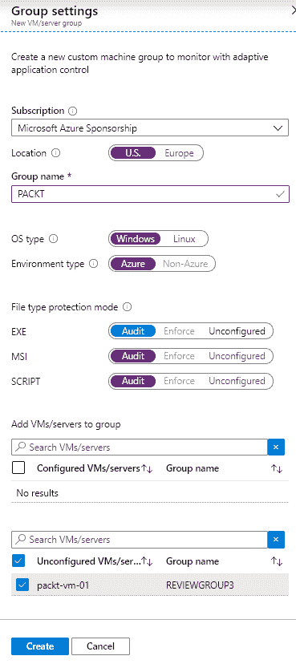

图 7.14 – 自适应应用程序控制组设置

Azure 虚拟机管理是另一个需要非常认真对待的话题。最佳实践是只通过安全连接执行任何管理任务，使用 P2S 或 S2S 连接。另一种方法是使用一台虚拟机作为跳板，然后从该虚拟机进行管理。但即使在这种情况下，连接也必须是安全的。

### 即时虚拟机访问

Azure 虚拟机的即时访问（Just-in-Time，简称 JIT）用于阻止传入流量访问虚拟机，直到特定流量被暂时允许。这种方法通过缩小攻击面并启用访问来减少虚拟机的暴露风险。启用 **即时访问**（**JIT**）将阻止所有通常用于管理的端口上的传入流量，如 RDP、SSH 或 WinRM。用户必须明确请求访问，该访问将在指定时间内被授予，但仅限于已知的 IP 地址。这种方法与 **特权身份管理**（**PIM**）的使用方式相同，在 PIM 中，拥有权限并不意味着我们可以随时使用它们；我们必须激活/请求这些权限才能在一段时间内使用。

重要提示

Azure 虚拟机的 JIT 访问仅支持通过 ARM（Azure Resource Manager）部署的虚拟机。它不适用于非 Azure 虚拟机或通过 **Azure 服务管理**（**ASR**）部署的 Azure 虚拟机。

可以通过 Azure 安全中心或 Azure 虚拟机面板配置 JIT。为 Azure 虚拟机配置 JIT 需要定义一些参数，例如我们希望使用哪些端口、是否希望允许来自特定 IP 地址或 **无类域间路由**（**CIDR**）格式的 IP 范围的访问，以及访问可用的最大时间。

配置 JIT 的示例如下图所示：

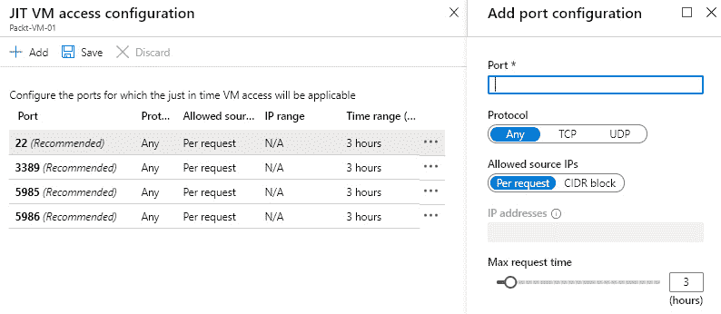

图 7.15 – 配置 JIT 访问

默认情况下，我们可以使用最常见的管理端口。我们可以编辑这些端口的规则、删除规则或添加自定义规则。除了端口外，我们还可以更改协议、允许的来源以及最大请求时间（可以在 1 小时到 24 小时之间）。

一旦配置了 JIT，每次访问虚拟机时都需要请求访问。这同样可以通过 Azure 安全中心或 Azure 虚拟机面板进行。在请求时，我们可以要求打开特定（或多个）端口，指定是否希望从当前 IP 地址或 IP 范围启用访问，最后，我们需要定义时间范围。时间范围取决于配置。默认情况下，时间范围为 1 至 3 小时，但可以配置为最长 24 小时。

请求 JIT 访问的示例如下图所示：

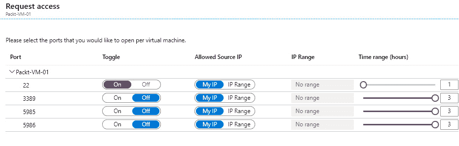

图 7.16 – 请求 JIT 访问

JIT 使用 **网络安全组**（**NSG**）控制允许或阻止的流量。当 JIT 为 Azure 虚拟机配置时，会创建 NSG 规则来阻止通过配置端口的访问。未为 JIT 配置的端口应自动被阻止，除非另行配置。当请求 JIT 访问时，将临时创建另一个 NSG，允许在请求的端口上访问。新的 NSG 规则将具有更高的优先级，覆盖阻止规则以启用访问。一旦请求的时间到期，允许规则将被删除，访问将再次被阻止。

重要提示

如果正在使用 JIT，则不应手动创建管理端口的 NSG 规则。Azure 安全中心应该始终控制这些端口。如果我们手动创建规则，可能会覆盖 JIT 规则，或者我们可能会创建一个规则，始终允许某个管理端口的访问，同时对其余管理端口使用 JIT。这两种情况都会使 JIT 失去意义。

高级网络强化分析我们的流量通信模式。通过分析，判断 NSG 规则是否过于宽松，从而增加了攻击面并造成威胁。跟踪三种潜在威胁：恶意内部人员、数据泄露和数据外泄。Azure 安全中心报告所有威胁，并评估当前规则，以确定是否需要更改 NSG 规则，并提供增强安全性的建议。

文件完整性监控用于验证操作系统和应用软件的文件及注册表。它跟踪文件的更改，并将当前的文件校验和与上次扫描的相同文件进行比较，以检查是否有不同。该信息可用于判断更改是否有效或是恶意修改的结果。

## 威胁防护

威胁防护提供有关检测到的威胁的信息和报告。了解我们的资源情况以及是否有人对我们进行攻击是非常有用的。

重要提示

威胁防护不会自动执行任何操作；本部分仅提供信息。要对检测到的威胁采取行动，我们需要设置工作流自动化。

在威胁防护部分提供的信息可能会让人眼界大开。你可能并非目标对象，但仍然会因为成为机会的受害者或一时疏忽而被攻击。

举个例子，我们创建了一个实验，部署了五个 Azure 虚拟机，并将 RDP 端口通过私有 IP 地址暴露。这五个虚拟机都是空白的，没有数据，也没有任何特别之处。实际情况是，“坏人”扫描公共 IP 地址，希望能发现开放的端口。一旦检测到类似的情况，就会开始“暴力破解”攻击。暴力破解攻击使用最常见的用户名和密码组合尝试连接。这五个 Azure 虚拟机运行了一个月，每台虚拟机大约遭遇了 20,000 次攻击。

所有这些攻击都可以在 Azure 安全中心的威胁防护部分中进行追踪和查看。以下截图显示了一个报告的示例：

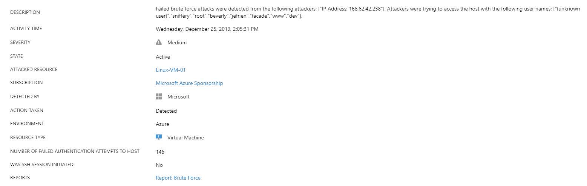

图 7.17 – 强力攻击检测到

在这些报告中，我们可以找到关于哪些用户名在攻击中被使用、攻击来源地以及身份验证尝试的次数等信息。我们还可以看到关于攻击来源地和攻击发生位置的更多信息，如下图所示：

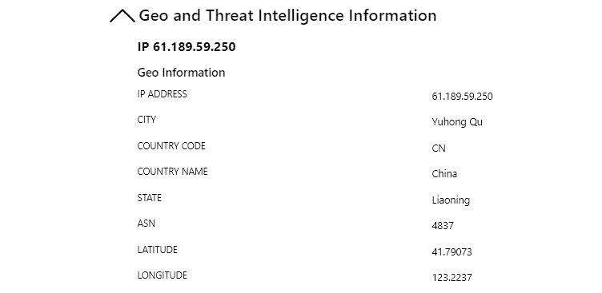

图 7.18 – 强力攻击来源

# 总结

Azure 安全中心通过多种方式帮助我们保护云环境，从提供关于需要改进的建议，到在威胁发生时进行检测，再到自动响应可能的威胁。通过不同的设置和策略，我们可以定义我们的重点，跟踪资源健康状况，并创建更安全的基础设施。

本章中，我们讨论了 Azure 安全中心作为 **云安全姿态管理**（**CSPM**）和 **云工作负载保护平台**（**CWPP**）工具的重要性。下一章将重点介绍 Azure Sentinel，这是微软基于云的 SIEM/SOAR 解决方案。

# 问题

1.  Azure 安全中心将数据存储在哪里？

    A. Azure 存储

    B. Azure SQL 数据库

    C. 日志分析工作区

1.  Azure 安全中心具有以下哪些定价层？

    A. 免费

    B. 标准

    C. 高级

    D. 以上所有

    E. 仅限 1 和 2

    F. 仅限 2 和 3

1.  提供有关如何提高 Azure 安全性的信息的形式是？

    A. 修复

    B. 推荐

    C. 建议

1.  我们可以通过什么自动化响应 Azure 安全中心的警报？

    A. 日志分析

    B. 逻辑应用

    C. PowerShell

1.  不能通过自适应应用控制来控制的文件类型是？

    A. EXE

    B. JAR

    C. MSI

1.  当在 Azure 虚拟机上启用 JIT 时，用户会做什么？

    A. 具有相同的访问权限

    B. 访问权限较少

    C. 具有更多访问权限

    D. 必须请求访问权限

1.  使用**高级威胁防护**（**ATP**），当发生攻击时会发生什么？

    A. 它将被自动阻止。

    B. 用户需要对攻击创建响应。

    C. 一些攻击会被自动阻止，用户需要为不支持的攻击创建自定义响应。
