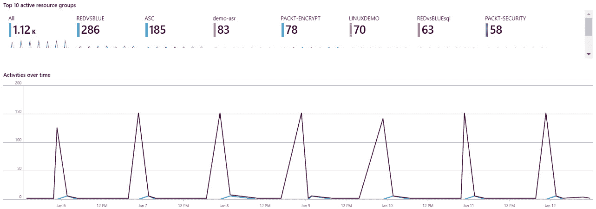

# 第九章：*第八章*：Azure Sentinel

**安全信息与事件管理**（**SIEM**）结合了之前是分开的两个解决方案，**安全信息管理**（**SIM**）和**安全事件管理**（**SEM**）。

我们已经提到，大型组织依赖于 SIEM 解决方案。而微软的云端 SIEM 解决方案是 Microsoft Azure Sentinel。但首先，让我们回顾一下 SIEM 是什么，以及它应该具备哪些功能。

本章将涵盖以下主题：

+   SIEM 简介

+   什么是 Azure Sentinel？

+   创建工作簿

+   使用威胁狩猎和笔记本

# SIEM 简介

许多安全合规标准要求长期存储，其中与安全相关的日志应长期保存。这在不同的合规标准之间有所不同，可能是从 1 到 10 年的任意时间段。这就是 SIM 发挥作用的地方：长期存储所有与安全相关的日志，以便进行分析和报告。

当我们谈到 SEM 时，我们往往是在讨论实时数据流而不是长期事件追踪。SEM 的重点是实时监控；它的目标是通过通知和仪表板来关联事件。当我们将这两者结合时，我们就得到了 SIEM，它试图实时流式传输所有与安全相关的日志并进行长期保存。通过这种方法，我们可以在一个解决方案中实现实时监控和报告工具。

在讨论所需功能时，我们有一些 SIEM 必须勾选的检查项：

+   **数据聚合**：将不同系统中的日志集中存放在一个地方。这可以包括网络、应用、服务器和数据库日志等。

+   **仪表板**：所有聚合数据都可以用来创建图表。这些图表可以帮助我们直观地检测模式或异常。

+   **警报**：聚合数据会自动进行分析，任何检测到的异常都会成为警报。然后，警报会发送给需要了解或采取行动的个人或团队。

+   **关联**：SIEM 的职责之一是为常见的属性和事件提供有意义的关联。这也是数据聚合发挥作用的地方，因为它有助于识别不同日志类型之间的关联事件。数据库日志中的一行可能没有太多意义，但如果与网络和应用程序的日志结合，它可以帮助我们防止灾难发生。

+   **保留**：如前所述，合规要求之一是将数据保存较长时间。但这也有助于我们在较长时间内建立模式，并更容易检测异常。

+   **取证分析**：一旦我们意识到安全问题，SIEM 就会被用来分析事件，检测问题发生的方式和原因。这有助于我们消除损害并防止问题重复发生。

总结来说，SIEM 应具备实时接收不同类型数据的能力，能为接收到的数据提供意义，并能长期存储这些数据。接收到的数据将被分析以发现模式、检测异常，并帮助我们预防或解决安全问题。

那么，让我们看看 Azure Sentinel 如何满足这些需求。

# 开始使用 Azure Sentinel

Azure Sentinel 是微软的云端 SIEM 解决方案。随着云计算继续改变我们使用 IT 的方式，SIEM 必须进化，以应对 IT 变革带来的新挑战。Azure Sentinel 是一个可扩展的云解决方案，提供智能安全和威胁分析。除此之外，Azure Sentinel 还提供威胁可见性和警报功能，以及主动的威胁追踪和响应。

所以，如果我们仔细查看，所有的 SIEM 复选框都已勾选。

Azure Sentinel 的定价模型有两种选择：

+   **按需付费**：在按需付费模式下，计费是根据接收的每 GB 数据进行的。

    重要提示

    在撰写时，按需付费模型下每接收一个 GB 的价格为 $2.60。

+   **容量预留**：容量预留提供不同的层级和不同数量的预留数据。预留创建了一个承诺，即使我们没有使用预留容量，也会按照每个层级进行计费。然而，预留提供了接收数据的折扣，是预期会接收大量数据的组织的一个不错选择。

以下图表显示了在撰写时，Azure Sentinel 的容量预留定价：


图 8.1 – Azure Sentinel 定价

如果接收的数据超过了预留限额，超出部分将按照按需付费模型进行计费。例如，如果我们预留了 100 GB 的容量，但接收了 112 GB 数据，我们将按预留容量的层级价格支付前 100 GB，并为超过预留容量的额外 12 GB 支付费用。

启用 Azure Sentinel 时，我们需要定义一个用于存储数据的日志分析工作区。我们可以创建一个新的日志分析工作区，也可以使用现有的工作区。

Azure Sentinel 使用日志分析来存储数据。Azure Sentinel 的定价不包括日志分析的费用。

重要提示

对接收的数据将收取额外的日志分析费用。有关定价的信息，请访问 [`azure.microsoft.com/en-us/pricing/details/monitor/`](https://azure.microsoft.com/en-us/pricing/details/monitor/)。

在以下截图中，我们可以看到在撰写时，Azure Sentinel 的所有定价选项：


图 8.2 – 更改 Azure Sentinel 定价层级

现在，让我们看看 Azure Sentinel 如何实现 SIEM 应该具备的所有功能。我们将逐一分析所有要求，看看它们如何通过 Azure Sentinel 得到满足。

让我们从数据连接器和数据保留配置开始，配置数据连接器和数据保留

SIEM 的要求之一是数据聚合。然而，数据聚合不仅仅是收集数据，还意味着能够从多个来源收集数据。Azure Sentinel 在这方面做得非常好，并且拥有许多集成的连接器。目前（并且不断有更多连接器被引入），共有 32 个连接器可用。大多数连接器是针对不同的 Microsoft 源，如 Azure Active Directory、Azure Active Directory Identity Protection、Azure Security Center、Microsoft Cloud App Security 或 Office365，仅举几例。但也有用于 Microsoft 生态系统外的数据源的连接器，如 Amazon Web Services、Barracuda 防火墙、Cisco、Citrix 和 Palo Alto Networks。

重要提示

有关连接器的更多信息，请参阅以下链接：[`docs.microsoft.com/en-us/azure/sentinel/connect-data-sources`](https://docs.microsoft.com/en-us/azure/sentinel/connect-data-sources)

数据连接器页面在以下截图中显示：


图 8.3 – Azure Sentinel 数据连接器

所有数据连接器都包括逐步说明，解释如何配置数据源以发送数据。值得一提的是，所有数据都存储在 Log Analytics 中。不同数据源的配置说明有所不同。大多数 Microsoft 数据源可以通过启用一个服务与另一个服务之间的连接来添加。其他数据源则需要安装代理或编辑端点配置。

Azure Sentinel 中有许多默认的连接器。除了显而易见的与 Azure 和 Office365 服务相关的 Microsoft 连接器外，我们还有许多用于本地服务的连接器。但这并不止步于此，还有许多其他连接器可用，如 Amazon Web Services、Barracuda、Cisco、Palo Alto、F5 和 Symantec。

一旦数据导入到 Log Analytics 并准备好在 Azure Sentinel 中使用，真正的工作就开始了。

## 使用 Azure Sentinel 仪表盘

在数据收集之后，下一步是使用各种仪表盘来展示数据。仪表盘通过**关键绩效指标**（**KPIs**）、指标和关键数据点来直观展示数据，以便监控安全事件。通过可视化展示数据有助于建立基准模式并检测异常。

下图显示了随着时间推移的事件和警报：


图 8.4 – 事件和警报仪表盘

在此截图中，我们可以看到基准是如何建立的。随着时间的推移，事件的数量保持相似。任何突然的增减都将被视为异常，需要进一步调查。

时间轴事件仪表盘使用指标来显示数据。但我们也可以使用关键绩效指标（KPIs）来创建不同类型的仪表盘。下图显示了数据源中的异常：


图 8.5 – 异常仪表板

这两个示例代表了启用 Azure Sentinel 后可用的默认仪表板。我们还可以根据要求和定义的关键绩效指标（KPI）创建自定义仪表板。

然而，这只是检测异常的第一步。我们还需要额外的步骤来自动化该过程。

## 设置规则和警报

仪表板的唯一问题是，它们只有在有人监视时才有用。数据以视觉形式展示，只有在我们时刻监控仪表板时，才能发现问题。但当没有人在监视时，会发生什么呢？对于这些情况，我们定义规则和警报。

使用规则，我们可以定义基线，并在任何类型的异常出现时发送通知（甚至自动响应）。在 Azure Sentinel 中，我们可以在**分析**面板上创建自定义规则，提供两种类型的规则：

+   第一类规则是**Microsoft 事件创建规则**，在此我们可以从一系列预定义的分析规则中进行选择。这里的规则包括**Microsoft Cloud App Security**、**Azure Security Center**、**Azure Advanced Threat protection**、**Azure Active Directory Identity Protection**和**Microsoft Defender Advanced Threat Protection**。唯一的其他选项是选择将要跟踪的事件的严重性。

+   第二类规则是**计划查询规则**。这里我们有更多的选项，可以定义几乎任何跟踪规则。我们唯一的限制是我们的数据。数据越多，我们可以跟踪的内容就越多。使用**Kusto 查询语言**，我们可以创建自定义规则并检查任何类型的信息，只要数据已经存在于日志分析工作区中。

要创建自定义查询规则，需要执行以下步骤：

1.  我们需要定义一个名称，选择战术，并设置我们想要检测的严重性。我们可以选择几种战术选项：初始访问、执行、持久性、特权升级、防御规避、凭证访问、发现、横向移动、收集、外泄、指挥与控制、以及影响。

    可选地，我们可以添加描述。建议添加描述，因为它可以帮助我们跟踪规则并检测它们的用途。以下截图展示了一个示例：

    

    ```
    let GetAllHostsbyAccount = (v_Account_Name:string){
      SigninLogs
      | extend v_Account_Name = case(
      v_Account_Name has '@', tostring(split(v_Account_Name, '@')[0]),
      v_Account_Name has '\\', tostring(split(v_Account_Name, '\\')[1]),
      v_Account_Name
      )
      | where UserPrincipalName contains v_Account_Name
      | extend RemoteHost = tolower(tostring(parsejson(DeviceDetail.['displayName'])))
      | extend OS = DeviceDetail.operatingSystem, Browser = DeviceDetail.browser
      | extend StatusCode = tostring(Status.errorCode), StatusDetails = tostring(Status.additionalDetails)
      | extend State = tostring(LocationDetails.state), City = tostring(LocationDetails.city)
      | extend info = pack('UserDisplayName', UserDisplayName, 'UserPrincipalName', UserPrincipalName, 'AppDisplayName', AppDisplayName, 'ClientAppUsed', ClientAppUsed, 'Browser', tostring(Browser), 'IPAddress', IPAddress, 'ResultType', ResultType, 'ResultDescription', ResultDescription, 'Location', Location, 'State', State, 'City', City, 'StatusCode', StatusCode, 'StatusDetails', StatusDetails)
      | summarize min(TimeGenerated), max(TimeGenerated), Host_Aux_info = makeset(info) by RemoteHost , tostring(OS)
      | project min_TimeGenerated, max_TimeGenerated, RemoteHost, OS, Host_Aux_info
      | top 10 by min_TimeGenerated desc nulls last 
      | project-rename Host_UnstructuredName=RemoteHost, Host_OSVersion=OS
      };
      // change <Name> value below
      GetAllHostsbyAccount('<Name>')
    ```

1.  一旦查询定义完成，我们需要创建计划。计划定义了查询的执行频率和执行所针对的数据。我们还定义了事件成为警报的阈值。例如，登录失败尝试只是一个事件。但如果该事件随着时间的推移重复出现，那么它就变成了警报。

    以下截图展示了一个计划和阈值的示例：

    

    图 8.8 – 分析规则调度

1.  在最后一步，我们可以定义当警报被触发时将会发生什么。类似于 Azure 安全中心中的工作流自动化（参见*第七章*，*Azure 安全中心*），逻辑应用被用于创建自动化响应。这些响应可以是通知（发送给用户或用户组）或自动化反应，能够阻止或防止威胁发生。

    创建新逻辑应用的示例如下图所示：


图 8.9 – 使用逻辑应用的自动化响应

但在现代网络安全中，这可能还不够。我们需要在几秒钟内做出响应，并且需要能够追踪与安全相关的特定事件。

# 创建工作簿

在 Azure Sentinel 中，我们可以使用工作簿定义我们想要监控的内容以及如何进行监控。类似于警报规则，我们可以选择使用预定义模板或创建自定义警报。与警报规则不同，使用工作簿时，我们创建仪表板以实时监控数据。

目前有 39 个模板可用，这个列表与数据连接器的列表非常相似。基本上，每个数据连接器至少有一个工作簿模板。我们可以选择以下屏幕截图中显示的任何模板：


图 8.10 – Azure Sentinel 工作簿模板

每个模板将启用一个额外的仪表板，用于定制监控特定的数据源。在下图中，我们可以看到 Azure 活动的仪表板：



图 8.11 – Azure 活动模板

故事并未就此结束。在 Azure Sentinel 中，我们可以利用机器学习并将智能嵌入到我们的安全层中。

## 使用威胁狩猎和笔记本

在 Azure Sentinel 中，借助仪表板和警报，我们可以查找异常和问题，但在现代 IT 中，我们需要更多的功能。网络威胁变得越来越复杂，传统的检测问题和威胁的方法已经不足够。等我们发现问题时，可能已经太晚了。我们需要采取主动，寻找潜在问题，并在威胁发生之前将其阻止。

对于威胁狩猎，Azure Sentinel 中有一个独立的部分。它允许我们创建自定义查询，同时也提供了一份广泛的预创建查询列表来帮助我们入手。主动威胁狩猎的一些查询包括高反向 DNS 计数、与 WannaCry 勒索病毒相关的域、失败的登录尝试、新登录的主机，以及异常登录等。以下屏幕截图中显示了部分可用查询列表：


图 8.12 – 威胁狩猎查询

我们还可以切换视图到实时流，并用它实时监控某些事件。实时流提供了图形化的视图，以帮助我们直观地监控威胁。

狩猎部分的另一个选项是书签。当我们在探索数据和寻找威胁时，可能会遇到一些不确定的事件。有些事件看起来无害，但与其他事件结合起来，可能会证明非常危险。书签允许我们保存某些查询的结果，以便稍后再次查看。我们可能希望在接下来的几天里检查相同的内容并比较结果，或者检查其他日志，看看是否能提供更多信息。

主动狩猎不仅仅停留在此。Azure Sentinel 还有一个叫做笔记本的功能。Azure Sentinel 是一个数据存储库，利用强大的查询和扩展性分析海量数据。笔记本更进一步，通过常用的 API，允许使用 Jupyter Notebooks 和 Python。这些工具扩展了我们在 Azure Sentinel 中存储数据的应用，使我们可以利用大量的机器学习、可视化和复杂分析库。

同样，我们已经有一些可用的笔记本，可以立即开始使用。可用查询的列表如下所示：


图 8.13 – Azure Sentinel 笔记本

Azure Sentinel 不仅仅是一个拥有有限选项的工具，它也非常可定制。可以通过多种方式调整 Azure Sentinel 以满足你的具体需求和要求。还有许多外部资源可以使用或进一步调整。

## 使用社区资源

Azure Sentinel 的强大功能由其社区进一步扩展。在 [`github.com/Azure/Azure-Sentinel`](https://github.com/Azure/Azure-Sentinel) 上有一个 Git 仓库。在这里，我们可以找到许多可以使用的附加资源。由社区开发的资源提供了新的仪表盘、狩猎查询、探索查询、自动响应的操作手册等，还有更多功能。

社区资源库是一个非常有用的资源集合，我们可以用它来扩展 Azure Sentinel 的功能，进一步提高安全性。

# 总结

Azure Sentinel 满足 SIEM 所有要求。不仅如此，它还通过主动威胁狩猎、机器学习和预测算法等额外工具增强了功能。结合我们已覆盖的其他资源，现代安全的各个方面已经涵盖，从身份与治理，到网络与数据保护，再到健康监控、问题检测和威胁预防。

但安全性不仅仅止步于此。几乎所有 Azure 资源都启用了某些安全选项。这些选项可以帮助我们进一步提高安全性。考虑到今天周围的网络安全威胁，我们需要采取一切可用的预防措施。

在最后一章中，我们将讨论安全最佳实践以及如何利用每个安全选项来为我们服务。

# 问题

1.  Azure Sentinel 是…

    A. 安全事件管理（SEM）

    B. 安全信息管理（SIM）

    C. 安全信息事件管理（SIEM）

1.  Azure Sentinel 存储数据在…

    A. Azure 存储

    B. Azure SQL 数据库

    C. 一个日志分析工作区

1.  Azure Sentinel 支持哪些数据连接器？

    A. Microsoft 数据连接器

    B. 云数据连接器

    C. 来自不同供应商的多种数据连接器

1.  在 Azure Sentinel 中使用的是哪种查询语言？

    A. SQL

    B. GraphQL

    C. Kusto

1.  Azure Sentinel 中的仪表板用于…

    A. 问题的可视化检测

    B. 持续监控

    C. 威胁预防

1.  Azure Sentinel 中的规则和警报用于…

    A. 问题的可视化检测

    B. 持续监控

    C. 威胁预防

1.  威胁狩猎是由…执行的

    A. 监控仪表板

    B. 使用 Kusto 查询

    C. 使用 Jupyter Notebook 分析数据
