# 第十章：*第九章*：安全最佳实践

本书已经涵盖了关于 Azure 安全的最重要话题，从治理与监控到身份、网络和数据保护，再到具体工具如 Azure 安全中心和 Azure Sentinel。在本章最后，你将找到一些作者在项目中定期使用的技巧和窍门。

我们将在接下来的部分中讨论以下主题：

+   日志分析设计考虑因素

+   了解 Azure SQL 数据库的安全功能

+   Azure 应用服务的安全性

# 日志分析设计考虑因素

你已经学到 Azure 安全中心和 Azure Sentinel 在很大程度上依赖于 Azure 日志分析。但在开始你的云安全监控之旅之前，有一些重要的事项需要考虑。

在这个背景下，最重要的两个范式是：

+   尽可能使用最少的日志分析工作区

+   使用区域性工作区以避免 Azure 带宽费用

从技术角度来看，最好的做法是只使用一个单一的中央工作区，这样所有数据都集中在一个地方。拥有一个单一工作区，你可以轻松、高效、快速地将数据关联起来，从而获得相应的洞察。同时，你只需要关注这个工作区的**基于角色的访问控制**（**RBAC**）模型。然而，细粒度的 RBAC 模型需要更多的努力。

然而，从财务角度来看，如果你在不同的 Azure 区域使用 Azure 资源，你应该规划区域性工作区，而不是中央工作区。对于本地服务器来说，规划布局并不重要，因为所有**进入网络流量**（**ingress**）进入 Azure 区域是免费的。Microsoft Monitoring Agent 会将数据发送到 Azure，但并没有定期的数据从 Azure 传输到本地服务器。问题是，你需要为**出去的流量**（**egress**）支付费用。如果你使用一个单一的中央日志分析工作区，并且在不同的 Azure 区域部署了 Azure **虚拟机**（**VMs**），那么这些虚拟机到工作区的外出数据传输将产生流量费用。

为了将这两种范式结合起来，最好的做法是在每个使用的 Azure 区域创建一个单一的工作区，这不仅可以避免定期的流量费用，还能坚持尽可能少使用工作区的理念。

如果你使用多个工作区，则无法再在 Azure 安全中心使用自动配置。由于自动化过程，每个订阅只能配置一个工作区。由于 Azure 订阅可以包含来自所有或至少几个 Azure 区域的资源，因此根据你的策略，你需要另一种方式来自动部署 Microsoft 监控代理到你的 Azure 虚拟机。这时，**基础设施即代码**（**IaC**）就派上用场了。通过 **Azure 资源管理器**（**ARM**）模板、Terraform 或 PowerShell，你可以同时部署 Azure 虚拟机并安装日志分析虚拟机扩展。日志分析虚拟机扩展通过 ARM 进行部署和管理，并且完全支持 DevOps 场景中的 CI/CD 管道。也就是说，当你在 DevOps 场景中使用 IaC 部署虚拟机时，你还可以通过管道更新、管理和配置代理。如果你还配置了策略、蓝图以及在*第二章*《治理与安全》中学习到的所有其他治理功能，你就能轻松遵循企业的安全策略，并同时利用自动化。

接下来，我们将查看其他 Azure 服务的安全功能以及它们如何帮助我们增强安全性。

# 了解 Azure SQL 数据库的安全功能

有关 Azure SQL 数据库的一些安全功能在*第六章*《数据安全》一节中提到，我们讨论了数据安全。但是，还有其他额外的功能可以帮助我们增强安全性。

当谈到 Azure SQL 数据库时，第一个特点和防线就是防火墙。这个内置工具默认会阻止来自任何未预授权（白名单）的 IP 地址访问数据库。值得一提的是，防火墙设置是在 Azure SQL 服务器级别进行的，并且会继承到该服务器上的所有数据库。如果我们需要允许某个 IP 地址访问单一数据库，我们可能需要重新考虑我们的资源策略。允许一个 IP 地址访问单一数据库将会允许该 IP 地址访问同一服务器上的所有数据库。因此，我们需要考虑将仅由相同应用程序或相同用户组使用的数据库放在同一服务器上。

允许新的 IP 地址连接到 Azure SQL 服务器可以通过 Azure SQL 服务器防火墙设置进行。我们可以选择添加一个单独的 IP 地址（起始和结束 IP 地址相同），或者添加一段 IP 地址范围（从起始 IP 到结束 IP）。如果我们想允许当前的 IP 地址，有一个方便的**添加客户端 IP**按钮。这个按钮会自动检测我们当前的 IP 地址，并添加一个新的规则来允许该 IP 地址。添加任何规则后，我们需要保存更改才能使其生效。

以下图展示了防火墙设置的一个示例：

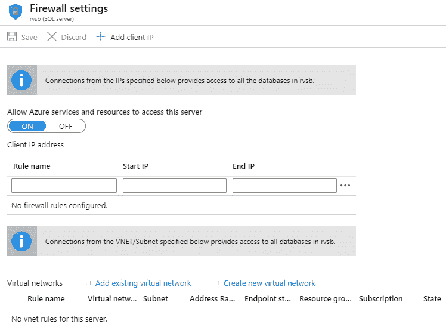

图 9.1 – Azure SQL 服务器防火墙设置

在 **防火墙** **设置** 下，有两个额外的选项可供使用：

+   **允许 Azure 服务和资源访问此服务器**

+   **来自 VNET/Subnet 的连接**

允许 Azure 服务的选项看起来很有吸引力，但我们需要非常小心。乍一看，这个选项似乎很有帮助，大多数人可能会认为应该允许 Azure 服务连接。当我们不必担心 Web 应用如何连接到数据库时，生活会变得更轻松。但这个选项并不是只允许你的 Azure 服务连接，它允许任何 Azure 服务连接。允许 Azure 服务和资源连接仅会检查连接是否来自 Azure 数据中心，而不会将连接限制在你的订阅或租户内。允许此选项将使 Azure SQL 数据库更加脆弱，我建议你保持此选项关闭。

重要提示

**允许 Azure 服务和资源访问此服务器** 默认设置为 **关闭**，但之前并非如此。以前，该设置是默认启用的。如果你已经创建了 Azure SQL 数据库，请确保禁用此设置。

从 VNET/Subnet 的连接允许我们通过让特定的 VNET（或仅限子网）连接到 Azure SQL 数据库来创建 VNET 集成。这种方法更加安全，因为数据库无需通过互联网公开，所有通信都在安全的私有网络上进行。

但 Azure SQL 数据库只是服务级别内置安全功能的一个例子。几乎每个服务都有一些服务特定的安全功能。Azure 应用服务是另一个很好的例子，提供了许多可用的安全选项，接下来我们将讨论这些选项。

# Azure 应用服务中的安全性

Azure 应用服务是一个基于 HTTP 的服务，用于托管 Web 应用程序和 API，支持多种编程语言。它也是 Azure 服务的另一个很好的示例，内置了多种安全功能。我们可以控制访问、协议、证书和许多其他事项。

我们需要解决的第一个问题是身份验证。应用服务允许我们基于几个不同的提供者设置身份验证：**Azure Active Directory**（**Azure AD**）、Microsoft（或 Live）帐户、Facebook、Google 和 Twitter。显然，最佳的集成方式是使用 Azure AD，因为它是本地的，并且还允许通过 Azure AD 工具和功能进行进一步控制。

为了为应用服务设置 Azure AD 身份验证，我们需要执行以下操作：

1.  在 **应用服务身份验证** 刀片中，我们需要选择 **Azure Active Directory**，如以下图所示：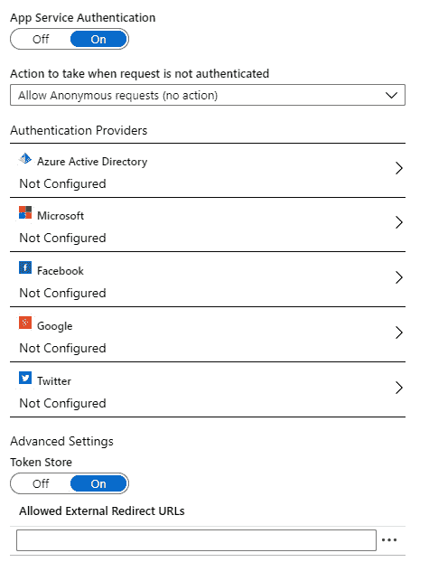

    图 9.2 – Azure 应用服务身份验证

1.  在身份验证设置中，我们有两个选项。如果选择**Express**，这将自动为我们创建一个服务主体和所有所需的权限。如果选择**高级**设置，我们需要自己提供服务主体并创建权限。下图展示了**Express**设置的示例：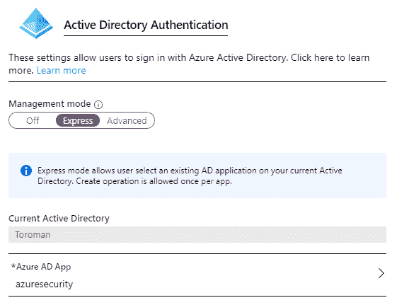

    图 9.3 – 应用服务 Azure AD 身份验证

1.  配置完成后，我们需要确保用户必须使用**Azure** **Active** **Directory** 登录才能访问应用程序，如下图所示：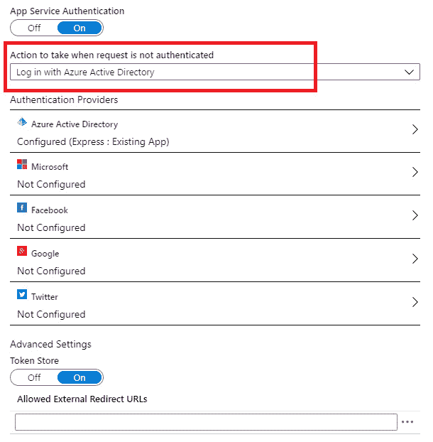

    图 9.4 – 强制执行 Azure AD 登录

1.  访问应用程序时，用户将被提示使用其 Azure AD 账户**登录**以继续，如下图所示：

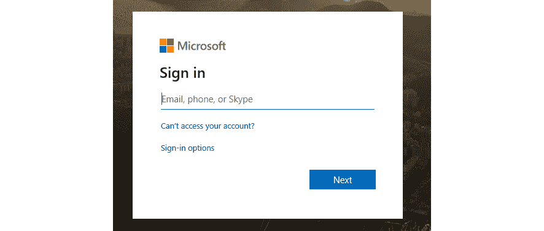

图 9.5 – 用户需要登录才能访问应用程序

Azure 应用服务的另一组安全特性是**协议** **设置**。在这里，我们可以强制应用程序仅使用 HTTPS，控制最小的 TLS 版本，或者是否需要传入的客户端证书。我们还可以配置**TLS/SSL 绑定**，以指定在响应特定主机名请求时使用的证书。可以使用公有和私有证书：

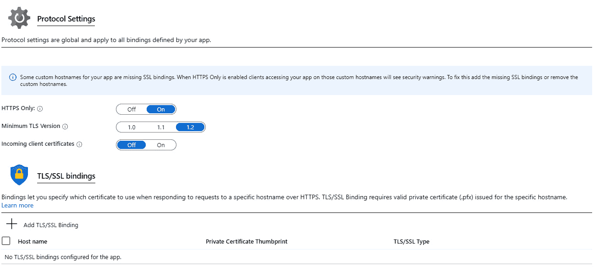

图 9.6 – 应用服务协议设置

私有证书可以从应用服务导入（到特定的 Web 应用），上传，或从 Azure Key Vault 导入，或者我们可以创建一个新的**应用服务管理证书**。

注意

**应用服务管理证书**适用于应用服务上的所有 Web 应用，而不仅仅是它创建时所在的 Web 应用。

在下图中，我们可以看到**私钥证书**设置：

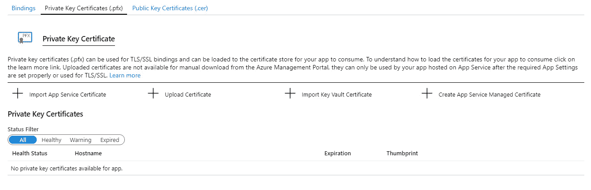

图 9.7 – 应用服务私钥证书

**公钥证书**要求由受信任的**证书授权机构**（**CA**）签发的证书。此证书通常用于公开访问的 Web 应用，并作为网站可信的证明：

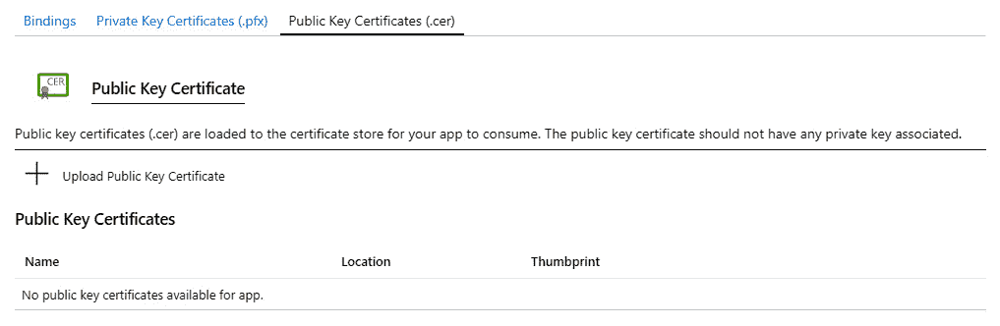

图 9.8 – 公钥证书

在应用服务的网络设置下，我们有多个选项。大多数选项与安全连接和 Web 应用与私有网络的集成相关。此前在*第四章*《Azure 网络安全》中，我们已经讨论过网络安全。我们可以通过 VNET 集成和混合连接来实现这一点。此外，本节还包括启用 Azure Front Door（作为全球分布式应用程序的 Web 应用防火墙）和**内容分发网络**（**CDN**）等服务的选项。网络设置下的最后一个选项是访问限制。与 Azure 应用服务相关的所有网络设置如下面的图所示：

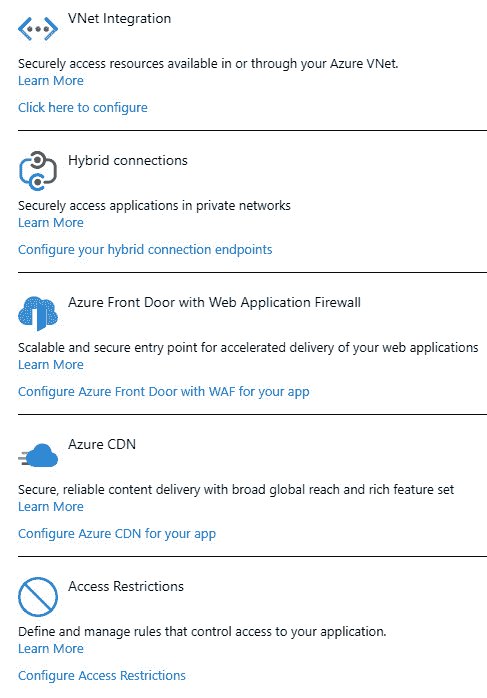

图 9.9 – Azure 应用服务网络设置

**访问** **限制**是**Azure 应用服务**设置中的一个非常有用的功能。通过使用**访问** **限制**，我们可以阻止来自特定 IP 地址的访问，或仅允许来自白名单 IP 地址的访问。实际上，**访问限制**的工作方式与**网络安全组**（**NSGs**）非常相似，通过创建规则并为其分配优先级。然而，**访问限制**专注于公共访问，而 NSGs 则控制更广泛的网络，包括公共和私有网络规则。在下图中，我们可以看到创建阻止规则的示例：

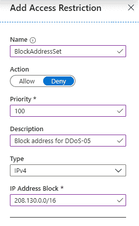

图 9.10 – 应用服务访问限制

要创建一个阻止规则，我们需要提供以下信息：

+   **名称**

+   **操作**（允许或拒绝访问）

+   **优先级**

+   **描述**

+   **类型**（IPv4 或 IPv6）

+   **IP 地址块**

在前面的示例中，创建了一个规则来阻止来自 IP 地址块`208.130.0.0/16`的访问。如果有人尝试从指定 IP 地址范围内的任何 IP 地址访问应用程序，请求将被阻止，用户将无法访问该 Web 应用程序。

由于我们可以使用优先级，我们也可以采用不同的方法，仅允许来自白名单 IP 地址的访问。在这种情况下，我们将创建一个阻止规则，阻止任何人访问应用程序，并为其分配`200`。另一个规则将被创建，允许来自特定 IP 地址范围的访问，并为其分配`100`（这可以是`200`以下的任何值）。允许指定 IP 地址的规则将覆盖阻止规则，因为其优先级较高。但它仍然会阻止其他任何人访问应用程序。

我们在云环境中面临的另一个挑战是密钥管理。我们需要小心如何使用机密、连接字符串和其他敏感信息，并确保这些信息不会暴露。如本书中许多已讨论的情况一样，Azure Key Vault 可以提供帮助。类似于使用 IaC 传递机密（如在*第五章*中讨论的，*Azure Key Vault*），或者管理密钥和证书（在*第六章*中讨论的，*数据安全*），Azure Key Vault 可以用来保护 Azure App Service 所需的任何敏感信息。我们不需要将敏感信息存储在 Web 配置文件或 App Service 配置中（虽然信息会被隐藏，但如果用户有足够权限，仍然可能会暴露），而是可以使用托管身份来访问 Azure Key Vault，在那里敏感信息以安全的方式存储。以下是 App Service 中身份设置的示例：

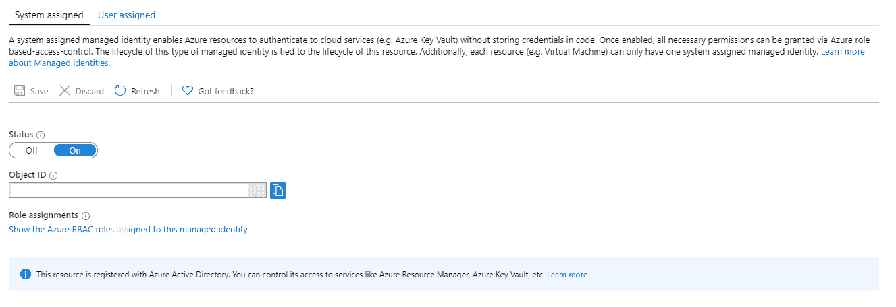

](img/Fig_9.11.jpg)

图 9.11 – Azure App Service 中的托管身份

如我们所见，可以设置两种类型的托管身份：**系统分配**和**用户分配**。**系统分配**将生成一个托管身份并设置必要的选项。而在**用户分配**中，我们需要自己创建托管身份，并创建任何必要的权限和设置。如果我们需要为一个服务使用多个托管身份，就必须使用**用户分配**的托管身份，因为一个服务只能拥有一个系统分配的托管身份。

**系统分配**的托管身份与资源生命周期相关，一旦资源被移除，托管身份也会被移除。该托管身份是为了服务而生成的，并且不会被其他任何服务使用。而**用户分配**的托管身份则不同，因为多个资源可以使用同一个托管身份。

# 总结

在本书的最后，我们已经涵盖了 Microsoft Azure 安全性的各个方面。从共享责任模型到高级安全功能，我们已经讲解完毕。需要记住的是，云环境不断变化，越来越多的服务可以帮助我们提高安全性。

让我们专注于本书中最重要的要点：

+   使用一切可用的手段确保你的身份和机密安全。

+   在访问控制方面，采取两种方法：**足够的管理权限**（**JEA**）和**及时管理**（**JIT 管理**）。

+   如果没有必要，任何东西都不应该暴露给公共访问，特别是管理和安全访问。

+   数据应该始终加密。

+   所有通信和流量都应加密（通过 HTTPS）并尽可能在安全（私有）网络上进行。

+   Azure 安全中心和 Azure Sentinel 可以帮助你进行分析、检测和推荐，以保持对云安全的掌控，并确保 Azure 资源的安全。

+   除了专注于安全的服务外，所有 Azure 服务都具有自己的安全功能。使用这些功能来增强安全性。

Microsoft Azure 时刻在变化；新功能几乎每天都会添加，现有功能也在不断更新。因此，未来选项可能会发生变化，但这些选项现在是为了展示如何处理云安全的问题。这七个关键点是我们需要关注的；我们完成这些任务的方式并不重要。

# 问题

1.  什么是 Log Analytics 的最佳实践？

    A. 使用单一工作区

    B. 使用区域工作区

    C. 为每个区域和每个服务使用多个工作区

1.  我们可以通过…控制对 Azure SQL 数据库的访问

    A. 访问列表

    B. 防火墙

    C. 条件访问

1.  在 Azure 应用服务中支持哪种类型的证书？

    A. 私有

    B. 公共

    C. 通配符

    D. 以上所有

    E. 仅 1 和 2

    F. 仅 2 和 3

1.  我们可以通过…控制对 Azure 应用服务的访问

    A. 访问限制

    B. 防火墙

    C. 条件访问

1.  用于启用 App Service 与其他 Azure 服务通信的是什么？

    A. 服务主体

    B. 托管身份

    C. Azure 密钥保管库

1.  Azure 应用服务支持与…的身份验证

    A. Azure Active Directory (Azure AD)

    B. Microsoft 帐户

    C. Twitter

    D. 以上所有

    E. 仅 1 和 2

    F. 仅 2 和 3

1.  可以从…设置 Azure 的安全性

    A. Azure 安全中心

    B. Azure Sentinel

    C. 不同的服务和功能

    D. Azure AD

# 进一步阅读

+   *《Hands-On Cloud Administration in Azure》* 由 Mustafa Toroman 编著: [`www.packtpub.com/virtualization-and-cloud/hands-cloud-administration-azure`](https://www.packtpub.com/virtualization-and-cloud/hands-cloud-administration-azure)。

+   *《Azure 管理手册》* 由 Kamil Mrzyglod 编著: [`www.packtpub.com/cloud-networking/azure-administration-cookbook`](https://www.packtpub.com/cloud-networking/azure-administration-cookbook)。

+   *《Active Directory 管理手册》* 由 Sander Berkouwer 编著: [`www.packtpub.com/virtualization-and-cloud/active-directory-administration-cookbook`](https://www.packtpub.com/virtualization-and-cloud/active-directory-administration-cookbook)。

+   *《Azure 网络管理手册》* 由 Mustafa Toroman 编著: [`www.packtpub.com/virtualization-and-cloud/azure-networking-cookbook`](https://www.packtpub.com/virtualization-and-cloud/azure-networking-cookbook)。

+   *《Hands-On Azure for Developers》* 由 Kamil Mrzyglod 编著: [`www.packtpub.com/virtualization-and-cloud/hands-azure-developers`](https://www.packtpub.com/virtualization-and-cloud/hands-azure-developers)。
