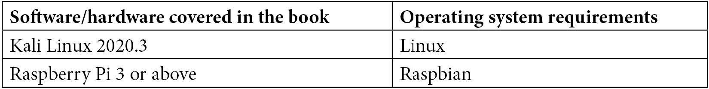

# 前言

*掌握防御性安全* 是一本面向 IT 专业人员的书，旨在帮助他们提高网络安全知识，包括 Wireshark、DVWA、Burp Suite、OpenVAS 和 NMAP 等工具的使用，硬件威胁如武器化树莓派，以及 Unix 和 Windows 的加固技术。

如果你是网络安全专业人员，本书将帮助你探索 IoT、Web 应用和云等高级防御性安全领域，并处理复杂的主题，如恶意软件分析和取证。

到本书结束时，你将获得成为网络安全专家所需的所有技术技能，以及制定定制化网络安全策略所需的所有知识，最终成为防御性安全的专家。

# 本书适合谁

本书非常适合 IT 专业人员、数据科学家、开发人员以及任何希望了解并探索网络安全迷人世界的 IT 专家。

本书对于希望扩展其网络安全知识并有效创建和设计大型组织防御性安全策略的网络安全专业人员来说，是一个极大的资产。

需要具备网络、信息技术（IT）、服务器、虚拟化和云计算等概念的基本理解。

# 本书内容

*第一章*，*防御性安全概念复习*，全面概述了网络安全概念（包括攻击类型），帮助更好地理解当前的威胁格局。

*第二章*，*管理威胁、漏洞和风险*，概述了如何处理网络安全漏洞和威胁，包括风险管理、业务连续性和灾难恢复。

*第三章*，*理解政策、流程、合规性和审计*，提供了如何设计和开发网络安全政策（和流程），如何实现合规性，审计介绍，以及如何应用网络安全成熟度模型的详细指南。

*第四章*，*修补第 8 层*，专门讲解了与用户相关的风险、与用户相关的常见威胁类型（包括社交工程）以及如何防止这些威胁。

*第五章*，*网络安全技术与工具*，解释了如何在你的防御性安全策略中利用先进的网络安全设备，并提供了 APT 和威胁情报的介绍。

*第六章*，*保护 Windows 基础设施*，深入探讨了保护 Windows 基础设施的策略、工具和技术，包括加固、修补和端点安全。

*第七章*，*加固 Unix 服务器*，包含了一份全面的最佳实践汇编，旨在确保您的 Unix 应用服务器具有良好的防御安全态势。

*第八章*，*增强你的网络防御技能*，是一本旨在涵盖网络安全最重要元素的章节，包括网络扫描器、Wi-Fi 漏洞，以及适用于无线网络的用户安全指南，您可以在您的组织中加以利用。

*第九章*，*深入物理安全*，深入探讨了物理安全中最危险的工具和攻击，包括强大的 LAN Turtle、隐秘的 Plunder Bug LAN Tap、危险的 Packet Squirrel、便携式 Shark Jack、令人惊叹的 Screen Crab 和先进的 Key Croc，以及最新的 USB 威胁。

*第十章*，*应用物联网安全*，是一本完整的物联网安全指南，涵盖了如何检测恶意物联网设备，以及如何利用物联网设备创建自己的网络安全系统。

*第十一章*，*在云端的安全开发与部署*，探讨了不同类型的云以及如何保护云中数据的不同状态，还介绍了 Kubernetes 的安全性和一些用于测试云安全性的工具。

*第十二章*，*掌握 Web 应用安全*，是一本有趣的章节，教你如何收集有关你网站的公开信息，并提供一些实践实验，帮助你理解用于 Web 应用安全的工具，包括 DVWA 和 Burp Suite。

*第十三章*，*漏洞评估工具*，介绍了漏洞管理和扫描器，包括如何安装和配置先进工具，如 OpenVAS。

*第十四章*，*恶意软件分析*，是一本全面的恶意软件分析指南，包括恶意软件分析的类型、所用工具的解释，甚至还有一个实践实验，帮助你进行第一次恶意软件分析。

*第十五章*，*利用渗透测试进行防御安全*，包含了动手实践经验，帮助你学习进攻性安全所使用的工具，包括如何安装和设置 Metasploit、SearchSploit、sqlmap 和 Weevely。

*第十六章*，*实践取证*，是一本全面的数字取证指南，包括取证平台的介绍、如何以及在哪里收集证据，并提供一系列国际标准，从法律角度正确地收集证据。

*第十七章*，*实现安全工具自动化*，提供了最常见的自动化攻击的解释，并给出了使用 Python 和树莓派自动化安全工具的一些示例。

*第十八章*，*实用资源的汇编*，是一个网络资源汇编，你可以在防御性安全中利用这些资源，包括工具、最佳实践、免费模板、框架和标准。

# 为了充分利用本书

你需要一台安装了 Kali Linux 的机器，才能跟随本书中的示例和实验。示例已经在一台加载了 Kali Linux 版本 2020.3 虚拟机镜像的虚拟机上进行了测试。它们也可能适用于任何未来版本的 Kali。

如果你想基于这款小巧但强大的设备创建一些网络安全工具，可以选择使用树莓派。



我们还将使用多种网络安全工具，包括 NMAP、Wireshark、sqlmap、DVWA、Burp Suite 和 Metasploit。然而，这些工具的安装和配置将在本书中介绍！

# 下载彩色图像

我们还提供了一个 PDF 文件，其中包含本书中使用的屏幕截图和图表的彩色图像。你可以在此下载：[`static.packt-cdn.com/downloads/9781800208162_ColorImages.pdf`](https://static.packt-cdn.com/downloads/9781800208162_ColorImages.pdf)。

# 使用的约定

本书中使用了许多文本约定。

`文中的代码`：表示文本中的代码字、数据库表名、文件夹名称、文件名、文件扩展名、路径名、虚拟 URL、用户输入和 Twitter 用户名。例如：“使用这个工具，你可以创建一个`autorun.inf`文件，该文件将在插入设备（如 USB、DVD 或 CD）时自动执行。”

代码块的格式如下：

```
//Identify USB HID Devices
let MalPnPDevices =
    MiscEvents
    | where ActionType == "PnpDeviceConnected"
    | extend parsed=parse_json(AdditionalFields)
    | sort by EventTime desc nulls last
    | where parsed.DeviceDescription == "HID Keyboard Device"
    | project PluginTime=EventTime, ComputerName,parsed.
ClassName, parsed.DeviceId, parsed.DeviceDescription, AdditionalFields;
```

任何命令行输入或输出都如下所示：

```
sudo apt-get install telnet
```

**粗体**：表示新术语、重要单词或屏幕上显示的单词。例如，菜单或对话框中的单词通常以**粗体**显示。以下是一个示例：“这些设置可以通过**Windows 组策略编辑器**中的**高级审核策略配置**进行配置和验证（审计）。”

提示或重要说明

外观如下。

# 联系我们

我们始终欢迎读者的反馈。

**一般反馈**：如果你对本书的任何内容有疑问，请发送邮件至 customercare@packtpub.com，并在邮件主题中注明书名。

**勘误**：虽然我们已尽最大努力确保内容的准确性，但错误仍有可能发生。如果你在本书中发现错误，我们将非常感谢你向我们报告。请访问 [www.packtpub.com/support/errata](http://www.packtpub.com/support/errata) 并填写表单。

**盗版**：如果您在互联网上发现我们作品的任何非法复制形式，恳请您提供该位置地址或网站名称。请通过版权@packt.com 与我们联系，并提供相关材料的链接。

**如果您有兴趣成为作者**：如果您在某个领域有专业知识，并且有兴趣撰写或参与书籍的创作，请访问[authors.packtpub.com](http://authors.packtpub.com)。

# 分享您的想法

阅读完*《防御安全精通》*后，我们很希望听到您的想法！请点击此处直接进入本书的亚马逊评论页面，分享您的反馈。

您的评论对我们和技术社区非常重要，它将帮助我们确保提供高质量的内容。
