# 第一章：*第一章*: 防御安全概念回顾

*网络安全不再是 IT 部门的专属问题，它越来越成为公司领导层需要理解的问题，也是一个需要组织中每个成员的意识和知识的挑战。*

*– Rogelio Umaña - 高级合伙人 | RDP 咨询的数字化转型*

理解核心的网络安全概念是成为大师的关键。大师不仅仅是通过与特定技术相关的经验来定义的，更是通过对话题的深刻理解和对技术术语与概念的恰当使用。

作为一名网络安全专家，你可能会受到媒体的邀请，了解最新的攻击信息，或被政府召集加入网络安全顾问团队。在这两种情况下，你都需要准备好发声，提供你的专家意见，本章将帮助你深入理解网络安全概念，使你能够以大师级别的自信发言！

作为这一旅程的一部分，我们将涵盖以下主要主题：

+   深入探讨网络安全的核心

+   管理网络安全的传奇痛点：*密码*

+   如何掌握深度防御

+   对蓝队和红队的全面解释

# 技术要求

本章没有技术要求，但你可能需要一杯咖啡（来为即将接收的大量知识准备好大脑）。

现在，让我们准备好迎接我们的学习冒险。

# 深入探讨网络安全的核心

大师在他们的领域中拥有更高的知识和理解。在这种情况下，你应该理解所有的概念、术语和攻击方式，才能自信地作为网络安全专家发言。这不仅仅是重复别人告诉你的内容，而是要获得一种理解的层次，能够解释所有这些话题，使每个人都能理解（即使他们不熟悉 IT 概念）。

## 网络安全三原则

一位 CISO 曾告诉我：如果你想看某人是否真正了解他们所谈论的攻击，只需问：这个攻击影响的是**CIA 三原则**中的哪一项？如果没有回应，那个人是新手。如果答案不明确或缺乏论据，那个人是初级，但如果回应清楚地概述了攻击会影响三原则中的哪些元素及其原因，那么你正在与一位专家交谈。

*这一三原则在进行防御安全工作时尤为重要，因为它将帮助你根据影响的程度以及这些影响如何与业务相关来优先考虑风险。*

这对组织来说尤其重要，因为它帮助他们确定优先投资领域（并提供更多资源），以减少在网络攻击发生时对公司造成的影响或损害。例如，攻击人力资源公司信息网页的可用性可能对业务影响较小，而攻击其管理的机密信息可能会造成灾难性的后果。

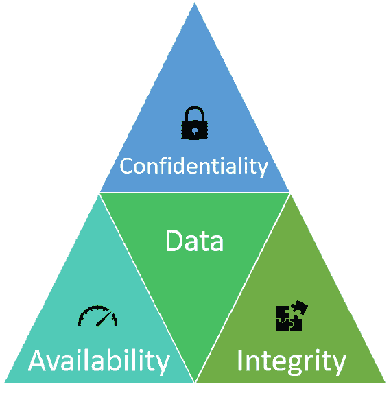

图 1.1 – CIA 三元组

*图 1.1* 展示了**CIA 三元组**的三个组成部分：**机密性**、**完整性**和**可用性**。现在，让我们深入了解这三个概念。

### 机密性

影响机密性的攻击是基于未经授权的人访问公司的数据。那么，如何知道谁可以访问哪些类型的数据呢？回答这个问题的最佳方法是遵循最佳实践，要求所有公司根据数据的敏感性对其数据进行分类和标记。这样，你就可以有效地确定如何实施适当的控制措施。数据可以按照以下方式进行分类：

+   **限制**：这是公司拥有的最重要的数据，可能包括商业机密，如果泄露，可能会对公司造成灾难性影响。

+   **机密**：这是公司必须保密的数据（仅限知情者）。很多时候，这类数据与外部法规相关，若泄露，可能会面临制裁和罚款。

+   **私人**：这是较不敏感的数据。然而，它并不适合公开消费，应当保留在组织内部。

+   **公开**：这是指那些旨在公开分发的数据（通常，这些数据是公开的并且在线可检索的）。

### 完整性

除了保持数据的机密性外，我们还需要确保数据不会被恶意行为者篡改。实际上，我们需要确保有适当的机制，确保数据只能由授权方进行更改。

如果你的公司运营一个交易性网站（如电子商务网站），这尤其重要，因为攻击者可能攻击你的数据库，创建或修改折扣代码，而等你发现问题时，你的商品可能已经以远低于原价的价格被售出并配送。

这些攻击之所以更危险，是因为攻击者不仅会将折扣应用到自己的购买上，而是会应用到每个人的购买上。因此，你可能会发现 1,000 个订单被以 99%的折扣处理，这使得你很难识别出是谁实施了攻击。

最著名的*黑客攻击*银行事件是因为数据的完整性被破坏。

因此，由于这些攻击的影响，企业必须主动并不断地投入时间和资源来防止它们的发生。

### 可用性

这些攻击旨在破坏给定系统、网络或网络资源的可用性。

除了在线商店外，这些是相对不太危险的攻击类型；然而，这类攻击也是最常见的类型。事实上，黑客行动组织进行的大多数攻击都旨在破坏系统可用性。

## 攻击类型

为了实施一个良好的防御策略，你必须理解当前的威胁形势和最常见的攻击类型——*你无法防范未知的威胁*。一些资料根据影响的领域将攻击分类；例如，网络攻击和物理攻击。然而，这样的高层次分类对于像你这样的高手来说过于简单，因此，我将提供一份详尽且最新的常见攻击类型列表，正如*图 1.2*所示：

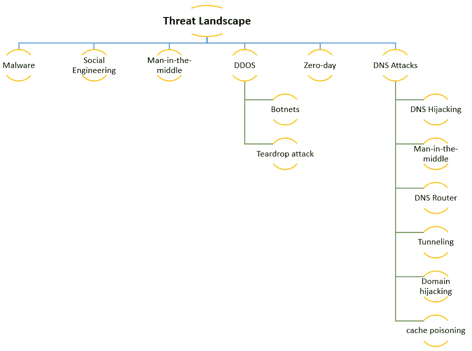

图 1.2 – 网络安全威胁形势

现在，让我们深入探讨这些类别，以便更好地理解当前的威胁形势。

### 恶意软件

每个人都熟悉这种类型的攻击。事实上，几乎每个人在一生中至少会遭遇一次这种攻击。然而，尽管大多数这类攻击可以通过良好的、更新的防病毒软件加以预防，但值得关注新的威胁，以确保我们的防护机制能够应对新出现的威胁。

为了提高这些攻击类型的有效性，通常它们会与其他策略结合使用进行传播，例如，通过社会工程学手段。

重要提示

恶意软件有多种类型，包括远程访问木马（RAT）、木马、蠕虫、勒索软件、间谍软件等。每种类型都有其独特之处，你必须理解它们的特性，才能有效地防御。

有趣的是，我记得当我发现我每周都要重新安装我妈妈电脑的操作系统，原因是我弟弟在上网时相信他的*好运*时：


图 1.3 – "你赢了"恶意软件样本

现在，让我们来看一下任何公司安全的**最大**威胁——通过**社会工程学**进行渗透：

### 社会工程学

作为技术爱好者，我们通常专注于保护我们的系统和网络。事实上，我们可能会投入大量时间、精力和资源来建立一个稳固的网络安全环境，但这并不完整，直到你将最弱的一环——用户纳入考虑。

我曾见过很多公司遭受灾难性攻击的案例，原因并不是他们的昂贵系统被突破，也不是因为他们遭遇了复杂的零日漏洞攻击，而是因为一名员工不小心将自己的凭据提供给了攻击者。

这个话题通常被忽视，犯罪分子正是利用了这一点，因此你必须理解并应用所有的策略、机制和系统，以避免在你的组织中发生此类攻击。在*第四章*《修补第 8 层》中，我们将深入探讨如何防御包括钓鱼攻击、精准钓鱼、捕鲸攻击、网络药物攻击等在内的攻击。

### 中间人攻击

假设你在商场约会，想要播放一个视频，但墨菲定律作祟，你的网速极其缓慢。然而，有一个名为**Free Wi-Fi**的 Wi-Fi 网络——听起来像是奇迹，对吧？嗯，让我告诉你，这可不是你的幸运日。很有可能有网络犯罪分子知道该地区的手机信号差，因此设下陷阱，悄悄捕获你所有的数据，而你甚至没有察觉。

虽然这是一个简化版的中间人攻击案例，但它展示了实现这种攻击的简易性。

重要提示

在技术方面，犯罪分子可能会使用多种可用的攻击方式，如会话劫持、IP 欺骗、重放攻击或窃听。这些将在*第八章*《增强你的网络防御技能》中深入讲解。

### 拒绝服务攻击

黑客活动分子常用的经典攻击——**分布式拒绝服务**（**DDoS**）攻击非常有趣，因为它可能以两种方式影响你，既作为攻击者，也作为目标。如前所述，这类攻击的影响取决于业务的性质；然而，你的基础设施也可能被攻击者用来发起基于僵尸网络的攻击，攻击其他公司，无论你的公司属于什么类型的业务，这都会对你的公司产生严重影响。

僵尸网络

僵尸网络是由受感染的设备组成的网络，这些设备由攻击者远程控制（通常使用指挥与控制服务器），执行一系列任务，且设备所有者并未同意或知晓。这些受控或感染的机器通常被称为僵尸，如前所述，它们将执行背景任务，如 DDoS 攻击、发送垃圾邮件和挖掘加密货币（比特币）。

这些攻击的一种有趣变种是 SYN 洪水攻击。这种攻击非常有趣且巧妙，它基于 TCP 的三次握手。但等等，什么是 TCP 三次握手？

让我通过类比来解释一下：假设你（客户端）需要一辆出租车（服务器），于是你决定打电话叫出租车（SYN）。当出租车到达时，它告诉你它已经到达门口（SYN-ACK），并等待你确认才能通过（ACK）。现在，假设你从未确认，一直在打电话叫更多出租车。最终，你的车道将被出租车占满，阻止了其他任何车的到来。

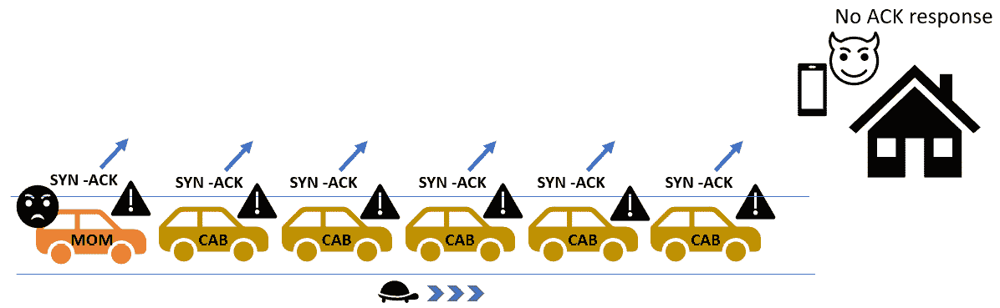

图 1.4 – SYN 洪水攻击

我知道 **SYN Flood 攻击** 可能听起来非常技术化，但这并不意味着它不常见。此外，还有许多其他执行 **DDoS 攻击** 的方式，另一个很酷的例子就是 **teardrop 攻击**。

#### Teardrop 攻击

**Teardrop 攻击**利用了一种旧的漏洞，在这种漏洞中，系统试图重新组装碎片化的包，但由于这些包已损坏，系统崩溃（CPU 达到 100%）。如前所述，这是一个旧的漏洞，现代系统不应受到影响。然而，出现了一个名为 **FragmentSmack** 的新版本，它影响当前的操作系统，包括 Windows 10 和 Linux 发行版（参见 CVE-2018-5391）。好消息是，已经有了这两者的补丁。

重要提示

在 Windows 系统中，你可以通过以下方式禁用数据包重组：

`Netsh int ipv4 set global reassemblylimit=0`

`Netsh int ipv6 set global reassemblylimit=0`

还有其他类型的 DDoS 攻击，包括 **死亡之 Ping** 和 **Smurf 攻击**（使用 ICMP 包），但这些是你应该已经熟悉的旧攻击，因此我不会浪费你太多时间。

### 零日漏洞

这些类型的攻击是最危险的攻击之一，因为它们会给我们带来突然的打击。

在处理这些类型的攻击时，快速反应是 *关键*。事实上，你需要 *时刻* 留意新的漏洞，以便了解它们，评估它们是否会影响你的基础设施，并找到解决方法或缓解措施，直到发布正式的解决方案或补丁。

有许多网站和博客提供网络安全新闻；然而，正如你可能知道的那样，假新闻很流行，因此你需要确保使用可靠的来源，提供最佳的信息。就我个人而言，我建议你使用以下网站，随时掌握最新的漏洞和威胁：

+   [`nakedsecurity.sophos.com`](https://nakedsecurity.sophos.com)

+   [`www.darkreading.com`](https://www.darkreading.com)

+   [`krebsonsecurity.com`](http://krebsonsecurity.com)

    RSS 源很酷

    顺便提一下，我建议你使用 RSS 源订阅上述网站，以实时获取所有新闻。你可以通过小部件或应用程序在手机上获取它们，或者将它们添加到你的消息应用中。例如，我使用 Slack，集成非常酷（[`slack.com/help/articles/218688467-Add-RSS-feeds-to-Slack`](https://slack.com/help/articles/218688467-Add-RSS-feeds-to-Slack)）。

### DNS 攻击

我记得曾经在 Windows 2000 机器上修改主机文件，只是为了通过重定向页面来娱乐自己。然而，事情已经发生了变化，现在有了许多更复杂的与 DNS 相关的攻击。

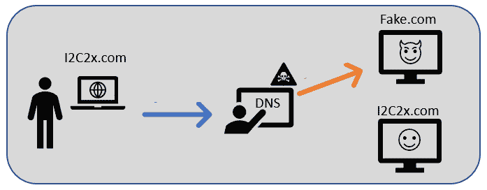

图 1.5 – 旧式 DNS 攻击

现在，让我们来看一下你需要了解的今天最流行的 DNS 攻击。

### DNS 劫持

在此攻击中，计算机通常会受到恶意软件的影响，将计算机的 DNS 指向攻击者的 DNS 服务器，而不是可信的 DNS，这样攻击者就可以控制并重定向所有流量。

这里有一些可以采取的防御措施：

+   保护端点免受恶意软件攻击。

+   始终检查网站的 URL。

+   如果可能，手动输入 URL，而不是点击链接（尤其是来自电子邮件的链接）。

+   实施 DNSSEC。

+   检查和/或监控**Host**文件是否有修改。

+   你还可以使用这个网页检查你的 DNS 是否被篡改：[`forms.fbi.gov/check-to-see-if-your-computer-is-using-rogue-DNS`](https://forms.fbi.gov/check-to-see-if-your-computer-is-using-rogue-DNS)。

### 中间人攻击

这种攻击与之前提到的原理相同，都是拦截 DNS 请求并用虚假网站进行回应。攻击者通过拦截受害者与真实 DNS 之间的请求，将恶意网站的响应提供给用户。

这里有一些可以采取的防御措施：

+   避免连接到开放的热点。

+   避免连接到公共网络。

+   避免连接到免费的 Wi-Fi。

### DNS 路由器攻击

在这种情况下，攻击者利用路由器中的漏洞进行重定向，将流量导向恶意网站。

这里有一些可以采取的防御措施：

+   更改你网络设备（路由器、接入点等）上的默认**管理员**和**连接**密码。

+   保持你的网络设备固件为最新。

+   尝试购买有良好声誉的网络设备（质量差的固件设备可能会存在漏洞）。

### DNS 缓存中毒

这与 DNS 劫持非常相似，但在这种情况下，攻击者只是修改了 DNS 缓存，将未来的请求发送到恶意网站。

以下图示展示了一个缓存中毒攻击的典型示例：

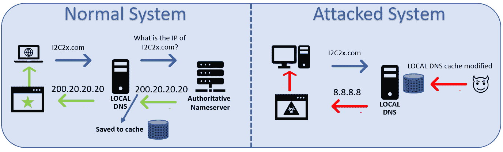

](img/Figure_1.6_B16290.jpg)

图 1.6 – 缓存中毒攻击流程

但别担心，以下是你可以采取的防御措施：

+   将你的 DNS 解析器放置在防火墙内部。

+   移除不必要的 DNS 解析器以降低风险。

+   必须强化 DNS 服务器，以确保所有不必要的服务被移除（从而减少故障点和潜在漏洞）。

+   使用随机源端口、随机化查询 ID，并在域名中使用随机大小写（大写/小写）。

+   清空你的 DNS 缓存 macOS（Catalina）：

    ```
    sudo killall -HUP mDNSResponder
    ```

+   清空你的 DNS 缓存 Windows：

    ```
    ipconfig /Flushdns
    ```

+   清除你的浏览器缓存。

此外，如果你有一个暴露给*外部用户*的系统，建议实施**“重启与恢复”系统**，这样一旦有人在本地更改了 DNS，这些值将在计算机重启或用户注销后被删除（并恢复为原始值）。

### 域名劫持与重定向

这种攻击针对的是网页资源（网页、网页应用等）。在这种情况下，攻击者会修改您在域名注册商的 DNS 设置，将所有指向您页面的流量重定向到另一个服务器。在这里，攻击者利用拼写错误的名称或与原始字母相似的字母来欺骗用户，让他们误以为访问的是真实网站。

以下是可以采取的防御措施：

+   将您的域名注册在一家可信赖的公司。

+   避免在多个供应商处注册域名。

+   为您的 DNS 管理员账户使用非常长且随机的密码（基于密码管理器）。

让我们考虑一个例子。

你认为这两个域名 `I2C2x.com` 和 `l2C2x.com` 是一样的吗？

它们看起来一样，但实际上并不相同，这是这些攻击类型（以及某些钓鱼攻击）中使用的策略之一，用来欺骗受害者认为他们访问的是原始网站，而实际上并非如此。

在这个例子中，第一个域名使用了大写字母 `i`，而第二个例子则使用了小写字母 `L`，这与眼睛相似，但显然不是相同的域名。

### DNS 隧道

这是一种非常巧妙的攻击方式，攻击者利用 DNS 查询和响应来窃取数据，而不被检测到。这种外泄机制使得攻击者能够绕过大多数网络控制。然而，这种攻击非常复杂，因为它要求攻击者必须控制存储数据的机器（通常是通过使用指令与控制恶意软件），内部 DNS 服务器、外部 DNS 服务器以及一个域名。

正常的 DNS 查询：

```
C:\Users\Cesar> Nslookup mysite.com
Server:  dns.google
Address:  8.8.8.8
Non-authoritative answer:
Name:    mysite.com
Address:  168.82.172.128
```

DNS 隧道查询：

```
C:\Users\Cesar> Nslookup company_exfiltrated_data123.com
Server:  dns.google
Address:  8.8.8.8
*** dns.google can't find company_exfiltrated_data123.com: Non-existent domain
```

以下是可以采取的防御措施：

+   设置监控器来跟踪 DNS 流量中的异常（这些攻击中的许多会指数级增加 DNS 查询的数量，从而外泄大量数据）。

+   分析 DNS 查询以识别异常。

    DNS 隧道工具

    有几种工具可以用于数据外泄，包括 `dns2tcp` 和 `heyoka`，还有一些其他工具用于嗅探 DNS 查询的内容，包括 `dnshunter` 和 `reassemble_dns`。

请记住，这只是您可以作为基准使用的示例列表，但还有许多其他类型的攻击在这里不会提及，但会在稍后讨论，例如物联网攻击、基于网页的攻击等。然而，记住，一个专家应该不断研究，保持更新，时刻警惕新的威胁和漏洞。

# 管理网络安全的著名痛点：密码

密码对我们的工作可能是最大的痛点。有趣的是，在过去的 14 年中，许多专家一直在说密码会消失，但尽管所有新的身份验证技术，密码仍然存在，并且可能会长期存在。因此，作为安全专家，我们需要不断寻找创新的方式来防止基于密码的攻击，这就是为什么在本章中，我们将审查最常见的攻击类型以及如何保护您和您的基础设施免受这些攻击的影响。

## 密码泄露

现在，每个月或每周几乎都可以看到新的数据泄露（暴露了数百万用户的电子邮件、用户名和密码到互联网）。因此，虽然你无法控制其他公司对你个人数据的安全级别，但你可以采取一些额外措施来防止受到这些攻击的影响。

**注意：**

如果你还没有这样做，请检查你的账户是否已经被泄露。你可以在著名网站[`haveibeenpwned.com`](https://haveibeenpwned.com)和[`dehashed.com/`](https://dehashed.com/)上进行这项检查。

在这些页面上你可以找到的一个很酷的功能是通过电子邮件、用户名甚至密码进行搜索。此外，这些网站还会告诉你一些非常有趣的信息，比如你的数据曾在哪些黑客攻击中被暴露过、用户名详细信息（如果网站使用自定义用户名而不是电子邮件）以及被泄露密码的哈希值。

### 防御措施

我曾经在是否应该添加这一步骤上犹豫不决（因为这对像你这样的专家可能是显而易见的）；然而，如果我不添加，有些人可能会指责我，所以在这里是：如果你的密码在这些网站中被发现，那么请更改你的密码（所有密码）：

+   在可用时使用或启用多因素或多步骤身份验证。

+   在可用时迁移到更强大的无密码解决方案（例如 Microsoft Authenticator）。

但是，Cesar，你不打算推荐密码保险库吗？实际上不会，因为密码保险库在这类攻击中无济于事，因为无论你的密码是*CesarRocks*还是*Iam_having-a.greattimereadingthisbookin2021*，它们都会以相同的方式泄露，作为一个看起来像这样的哈希：31b54027af2ed2299b2bd7fda556d782。

提示

想要解码哈希吗？你可以使用像[`md5hashing.net/hash`](https://md5hashing.net/hash)这样的页面，它使用哈希匹配（字典表）来解码哈希。

### 多因素与多步骤身份验证

仍然有人将这两个术语互换使用，但作为安全专家，你必须知道它们的区别。

多因素认证意味着在身份验证过程中，您使用至少两种不同的因素。这包括原有的三种因素（我知道的、我拥有的、我生来的），以及研究人员正在引入的另外两种因素：我所在的地方（通过地理定位和地理围栏技术实现）和我最喜欢的，您所做的事（通过物联网设备实现）。

举个例子，您的银行可能会要求您向右移动您的手腕来进行认证。这一动作将通过您智能手表中的加速度计捕捉，并通过安全的 API 与银行共享这些数据。

## 使用被泄露密码的社会工程攻击

这是一个有趣的攻击，因为它不需要攻击者具备技术知识，这使得这种攻击成为非常普遍且危险的威胁。

在这里，攻击者从已发布的密码泄露中收集电子邮件/密码组合，并利用这些信息欺骗受害者相信自己早已被黑客攻击，而且黑客掌握了关于受害者的敏感信息。这类攻击有多个变种，其中一些是告诉受害者黑客已访问了他们的摄像头，并且掌握了受害者的私密视频/照片，或黑客已获得浏览历史，并威胁如果不支付某些费用，将发布受害者的“脏”浏览历史。

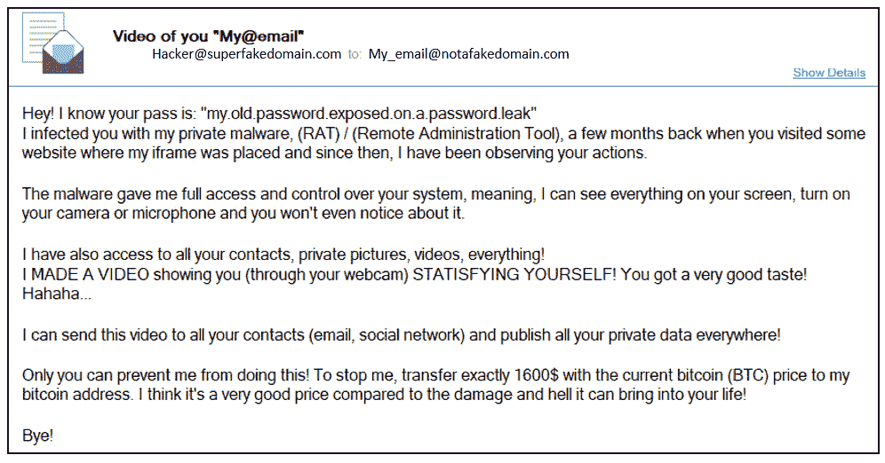

图 1.7 – 欺诈邮件示例

作为一名安全专家，当收到像这样的电子邮件时，您可能会觉得很有趣，但请记住，作为专业人士，您的使命是帮助他人避免成为这些攻击的受害者，从家人和朋友到同事，尤其是公司高层管理人员等高端目标。应对这些攻击的最佳方法是通过教育。事实上，用户教育是任何网络安全战略的关键支柱之一。这个话题如此重要，以至于我决定为您创建一个完整的章节！

小贴士

使用社交媒体作为工具，让别人知道这是个骗局。尽量每三个月在您的 LinkedIn、Facebook 和 Instagram 帐户上发布与这些攻击相关的内容。这个简单的举动可能会为您的朋友节省很多麻烦和金钱，同时帮助您提高社交声誉。

作为一名网络安全专家，您拥有巨大的能力，但也肩负着巨大的责任。

## 暴力破解攻击

密码攻击中最常见的一种是暴力破解攻击。目前最著名的应用程序是 John the reaper，您可以自定义攻击方式以减少暴露密码所需的时间。

在这些类型的攻击中，密码的复杂性（和大小）至关重要，让我通过一些数学证明这一点。

我们有两个变量：可能性空间（S）和密码长度（L）。在字母表中，我们有 26 个字符，这意味着我们的可能性空间是 26，但这只是考虑了其中的一种情况，因为如果我们使用小写字母和大写字母，可能性空间将增加到 26+26 = 52。

这意味着如果我们有一个 8 字符的密码（L），只包含小写字母（S），那么可能的组合数为*SL*，或者在这种情况下是*268*，大约有 2000 亿种组合。

你们中的一些人可能认为 2000 亿是一个巨大的猜测可能性，但现代计算机每秒可以猜测 1000 亿种组合，这意味着我们的 8 字符密码如果只有小写字母，可以在 2 秒内被破解。

但别担心，我们要做的只是通过以下方式增加可能性空间（S）：

+   通过添加数字，密码空间（S）增加了 10。这相当于*368*，可以在 30 秒内被猜测出来。

+   通过添加特殊字符，密码空间（S）增加了 32。这相当于*688*，可以在 1.5 小时内被猜测出来。

+   通过添加大写字母，密码空间（S）也增加了 26。这相当于*948*，可以在 20 小时内被猜测出来。

所有这些数学证明了一个 8 字符的密码已不再安全。因此，为了被认为是安全的，密码至少应该包含 10 个字符，并包括上述所有内容。这些数学非常重要，特别是支持确定您组织密码策略的要求（并获得用户和高层的支持）。

提示

如果你想检查密码的强度，而不必做所有的数学计算，我推荐以下网站：[`www.grc.com/haystack.htm`](https://www.grc.com/haystack.htm)

## 字典攻击

这类似于暴力破解攻击，但不同之处在于它使用的是**字典**，其中包含最常见的密码。

你可以找到包含数百万个密码的字典。事实上，一些字典大到可以让记事本崩溃。因此，为了方便攻击者，大多数字典都按主题、地区、语言或来源（通常是密码泄露）进行排序。

如前所述，从攻击者的角度来看，这种攻击有所不同，但之前提供的相同技巧适用于这种类型的攻击。

如果您想看看字典的样子，可以在这里看到许多按多种因素排序的字典：[`www.md5this.com/tools/wordlists.html`](http://www.md5this.com/tools/wordlists.html)。

自我测试

看看这两个密码，想想哪个更安全，然后去上面的链接查看结果：

`Lol********`

`C4b-6W@8#5`

## 创建一个安全的密码

如果曾经有过永无休止的争论，那可能就是关于密码强度的争论。我的祖父曾说：避免谈论宗教、政治和足球，因为这些话题总是以争论结束，你会失去许多朋友。嗯，我认为“密码强度”的讨论也应该包括在这个列表中。

我记得曾经在一个来自世界各地的专家小组中讨论非常具有挑战性的议题，尽管我们有不同的看法，但我们能够就所有议题达成一致，只有一个例外：*密码！*

一些专家相信密码的长度（例如使用长短语），另一些则相信复杂度（他们希望密码是无法阅读的），还有一些则要求两者兼顾，但最具争议的话题是*密码过期*。主要有两个阵营——专制派和用户友好派。

专制者不关心用户体验，他们只想制定规则，然后让用户去弄清楚如何遵守（即使这意味着把密码写在键盘下的便签上）。

另一方面，用户友好的团队通过分析用户遵守某条规则而不采取不良做法的可行性，采用了一种更*富有同理心*的方法。

在这种情况下，你必须根据事实做出决策，而不是偏袒任何一方（数据永远不会说谎）。因此，为了制定一个防弹的密码过期策略，我建议你找到以下问题的答案：

+   我的听众技术背景如何？

+   他们在密码方面的教育程度如何？

+   你能根据用户角色应用分段吗？（特权用户每 90 天更换一次密码，而普通用户则每 180 天更换一次）。

+   我是否具备执行此策略的基础设施？

+   你能根据访问/使用的数据/系统进行分段吗？

+   他们是否有工具和培训来创建/存储/管理复杂密码？

此外，还有*三条黄金规则*可以帮助你提高组织内的密码安全性：

1.  **实施密码保险库**：默认情况下，人们不信任将所有凭证存放在应用程序中。在这种情况下，你需要教育用户，向他们展示使用密码保险库的所有好处（从它比把密码写在键盘下的便签上更安全这一点开始）。

    但不要走弯路，制定一个政策并强制大家执行。相反，应该以身作则，向大家展示你有多喜欢使用密码保险库，使用它有多简单，以及用一个点击就能登录所有应用的便利性。炫耀你为每个账户都设置了一个独特的 *防弹* 80 位密码，*是的，每个账户的密码都不同*。让他们知道，这不仅仅是为了公司使用，也是为了他们的个人生活，展示给他们你有多自信，确信你的男朋友永远猜不到你的密码，因为你永远不需要再贴纸条（永远不怕被偷看了），只需要一个点击，嗖！你就能连接到你的账户。你需要的只是一个密码保险库应用（有很多免费的甚至开源的选项）和一个主密码来解锁它（因为你只需要记住一个，确保这个是安全的）。*记住，密码短语始终是一个不错的选择*。

    一旦人们看到这有多么简单，他们就会喜欢上它，并开始主动要求使用（所以，不是你去追着他们实施，而是他们来找你要）。如果你想降低成本，可以尝试使用 KeePass，它包含你所需要的一切，而且是免费且开源的。另一个选择是使用 LastPass；它们提供一个很好的免费版本，但也提供一些额外的选项，可能对你的组织有用，费用也非常低。

    提示

    要创建一个密码短语，可以尝试使用一个你永远不会忘记的句子，例如 *我记得那天我在沃尔玛遇到我的女朋友*，或者 *我再也不会在快乐汉堡吃汉堡了*。

1.  **一旦每个人都喜欢它，制定政策并建立执行机制**：在实施任何执行机制之前，确保先制定、批准并发布政策。否则，你可能会因为 *密码问题* 收到很多抱怨和不必要的支持请求。

1.  **不要做统治者，要做领导者**：与其制定一个没人理解、大家都讨厌的密码政策，不如创建一些与密码相关的培训或网络研讨会，讲解弱密码带来的危险和数据泄露的后果。如果时间允许，可以进行一些真实的演示，设置一台 Kali 机器，并用 John the reaper 演示如何在短时间内破解任何 8 位密码。记住：文档总比没有强，音频比文档好，视频比音频好，但最有效的还是实时演示。刚开始时，你可能会觉得这非常耗时，但根据经验，你投入在面对面培训和演示中的时间和精力，都是值得的。

一旦人们了解使用弱密码的后果以及你密码政策带来的优势，他们就不会将其视为负担，而是当作一个可以拯救他们工作的工具。

## 在企业级别管理密码

虽然前面的页面旨在帮助你提高密码管理技能，但在企业级管理密码时，仍然有一些额外的安全考虑需要遵循。现在，让我们来探索一下在管理这种环境时可能遇到的主要威胁。

### 哈希攻击

如前所述，密码不会以明文形式存储（嗯，至少不应该是），通常它们会以**哈希值**的形式存储。哈希通常被称为单向哈希函数，意味着它们是*在数学上不可能*创建一个反向函数来基于哈希值恢复明文的。

听起来很酷、聪明且安全，*但其实并非如此！*（我觉得黑客更聪明。）

破解这些密码，黑客使用一种叫做**彩虹表**的工具。这个概念非常简单。基本上，它是一个包含哈希/明文组合的数据库，可以用来确定给定哈希值对应的明文，因为一个单词或短语的哈希值始终是相同的。

彩虹表非常庞大（它们可能包含数十亿个组合），使得这种攻击非常危险。

提示

如果你想玩弄彩虹表，可以访问这个网站，在那里你可以下载一个大集合：[`crackstation.net/crackstation-wordlist-password-cracking-dictionary.htm`](https://crackstation.net/crackstation-wordlist-password-cracking-dictionary.htm)。

不过，别担心！有一种方法可以防御彩虹表攻击；你只需要像做沙拉一样……*加盐加胡椒！*

### 防御解决方案 – 使用盐值和胡椒

尽管这个技术名字很有趣，但它实际上是一个非常强大的机制，用来防范彩虹表攻击，而且它比你想象的要简单。

#### 盐值

这涉及在密码哈希之前，向密码中添加随机生成的文本。然后，这个盐值会保存在同一个密码数据库中，用于后续认证：

```
$Salt = random_bytes [$Salt]
$Hash = SHA [$password + $Salt]
```

*为什么盐值应该是随机的？* 如果盐值相同，攻击者就能识别出使用相同密码的用户，如下所示：

```
$Salt = random_bytes [$Salt]
$Bob_Psswd = [$password + $Salt] | Hash= 68586044d92547df605b
$Jake_Psswd = [$password + $Salt] | Hash= 68586044d92547df605b
```

但如果使用不同的（随机生成的）盐值，哈希值将完全不同，因此攻击者无法确定它们是否相同：

```
$BobSalt = random_bytes [$Salt]
$JakeSalt = random_bytes [$Salt]
$Bob_Psswd = [$password + $BobSalt]   | Hash = 10db4775dc38f4
$Jake_Psswd = [$password + $JakeSalt] | Hash = dc74116ef9525h
```

所以，如前面的示例所示，即使 Bob 和 Jake 使用相同的密码，攻击者也无法确定，因为使用的盐值不同。

#### 胡椒

如前所述，哈希值和盐值是存储在同一个数据库中的，因此，如果攻击者能够访问数据库，即使使用了盐值，哈希也可能会被泄露。

为了降低这种风险，我们可以再添加一串字符（就像盐一样），但这次这个值会保存在另一个地方，将这个新字符串变成黑客的*秘密*，因为即使主数据库被泄露，*胡椒*仍然是保密的：

```
$Pepper = I.am.the.Pepper
$BobSalt = random_bytes [$Salt]
$JakeSalt = random_bytes [$Salt]
$Bob_Psswd = [$password+$BobSalt+$Pepper]   | Hash = h1k477g56
$Jake_Psswd = [$password+$JakeSalt+$Pepper] | Hash = o28l4115h
```

在前面的例子中，我们可以看到密码是如何基于三个变量（密码、盐值和加盐）组成的，这大大增加了破解密码的复杂性。

在实现方面，你可以选择将盐（salt）添加在密码前面或后面。重要的是它必须在创建哈希值之前添加。正如我的数学老师常说的：*因数的顺序不改变结果*。

此外，在遗留系统上实现动态盐值可能会很困难。在这种情况下，我强烈建议使用盐和加盐来提高系统的安全性。

*盐的效率在于随机性，加盐的秘密在于保密性*。

你可以在同一系统上使用相同的密码加盐（pepper），但我建议你为每个系统使用**不同的加盐**（如果一个系统被攻破，其他系统就不会受到威胁）。

## 额外内容

让我与您分享一些最新的研究成果，这些研究旨在解决密码问题（硬件和软件方面）：

### 增强的密码认证

这是我和*Kyndryl*的副首席信息安全官*隆达·奇尔德雷斯*共同开发的一个非常有趣的系统，利用 USB 漏洞并将其转化为一种巧妙的密码问题解决方案。这里是完整专利申请披露的链接：[`patents.google.com/patent/US20200092282A1/en`](https://patents.google.com/patent/US20200092282A1/en)。

### 无线密码注入

这个想法来自我和我的朋友、安全专家*约翰·费泽尔*进行的一项研究，我们想通过实现真正即插即用的无线密码注入解决方案，将密码保险库带入一个新的层次。这个系统的优点在于它不需要安装任何特殊的驱动程序和固件，但仍能在任何操作系统上正常工作。你可以通过以下链接查看详情：[`patents.google.com/patent/US20190163893A1/en`](https://patents.google.com/patent/US20190163893A1/en)。

### 密码的键盘注入

这是对之前想法的改进版，我们增加了另一层安全性，并利用当前连接的键盘作为输入机制，像普通按键输入一样注入密码：[`patents.google.com/patent/US20200074069A1/en`](https://patents.google.com/patent/US20200074069A1/en)。

我们已经讨论了关于密码相关的主要风险以及如何从用户和基础设施的角度解决这些问题。现在是时候迈向下一个层次，看看我们如何根据相互连接的系统、方法和技术构建最佳的防御安全策略。

# 掌握深度防御

早期，人们依赖于周界防御，即构建一个虚拟的围栏，防止未经授权的人进入你的系统。

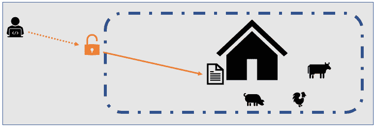

图 1.8 – 单层外围防御

然而，威胁环境已经发生了变化，我们也必须做出相应的调整！

虽然外围防御大多基于单一的保护层（通常是网络层），**深度防御**（**DiD**）则通过应用多个安全层将这一理念进一步扩展，每一层都提供一条新的防线来抵御攻击。

通常，这些层是独立的，每一层提供不同的安全机制，从而增强整体的安全性。这种独立性的好处在于，影响某一层的漏洞可能对其他层无关紧要。这相比于金字塔模型是一个巨大的优势，在金字塔模型中，如果底层受到影响，其余的层次也会随之崩溃。

然而，这种独立性也带来了操作复杂性的缺点。在这种情况下，管理所有不同的层（配置、测试、更新、维护）并非易事，但谁说我们的工作会轻松呢！

## 创建 DiD 模型时需要考虑的因素

大多数 DiD 模型是基于技术来创建层的；然而，如果你想成为 DiD 的高手，你还必须考虑以下两个非常重要的因素：**人**和**过程**。

提示

DiD 模型可以在宏观层面（整个组织）或微观层面（单一系统或技术）应用。这意味着一旦你掌握了这种方法，你可以用它来制定整体的安全策略，也可以用它来为你的 Web 应用程序创建安全策略。

现在，让我们详细分析这两个因素。

### 人员

人员通常被认为是网络安全中最大的威胁……他们确实是！我们说的不是罪犯，而是你的公司员工，他们负责许多安全漏洞，要么是由于不小心的错误，要么是被攻击者利用，借此获得对某些系统或数据的访问。

因此，在制定我们的防御策略时，我们必须考虑人为因素。忽视这一点，你的策略注定会失败。

你在这里的第一步是根据访问类型对公司员工进行细分。用户应该根据“需要知道/需要做”的原则来创建。这种员工细分应作为身份和管理过程的一部分进行，虽然刚开始时可能是一个耗时的过程，但最终我向你保证，这项投资是非常值得的。

#### 管理员权限

一些公司开始采纳一种政策，即为所有员工提供对其工作计算机的管理员权限。其理由是与雇佣一个支持团队的巨大成本有关，这个团队负责每次员工需要安装软件、硬件、更新或插件时提供帮助。

但如果设备感染恶意软件后需要重新安装，成本会怎么样？如果安装了损坏的驱动程序，成本又如何？如果由于安装木马程序导致数据泄露，成本如何？安装未经授权或受限软件的法律成本又该如何计算？这些是你可以问高级管理层的问题，以防他们想要给予每个人管理员权限。记住，帮助你的组织理解安全始终高于可用性和用户体验是你的责任。

你是说这不应该做吗？不，我只是说，这需要从网络安全的角度进行仔细分析，以确保如果执行，所有适当的控制措施都已到位，以降低前面提到的风险。

### 流程

你必须深入了解你所负责保护的组织。你可以通过了解公司的所有流程（或至少是核心流程）来实现这一点。一旦你了解它们，就能更容易地识别出别人无法发现的漏洞和风险！

我理解作为技术人员，你可能讨厌流程以及它带来的（通常是过时的）文档，但相信我，如果你了解它们，你将为组织带来极大的价值，而这种价值是很少有人能够提供的。

另一个让你熟悉这些内容的原因是，因为你最终将需要创建你自己的流程。一个好的建议是将你的流程与组织的流程保持一致；这将帮助你减少风险，并弥补任何潜在的漏洞。

此外，我建议你从两个角度评估/分析这三大因素（**技术**、**人员**、和**流程**）：**内部**和**外部**。

提示

我建议你先对你的技术、流程和员工类型进行盘点，然后评估与每个因素相关的风险（内部/外部），如下面的图示所示。

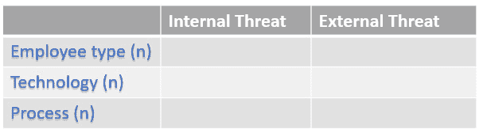

图 1.9 – 基于三大因素的风险评估矩阵

现在我们已经回顾了需要考虑的因素以及如何管理它们，是时候继续了解如何确定哪些资产将由我们的 DiD 模型进行保护，以及如何为它们优先排序。

## 资产识别

在理想的世界里，你会对整个组织施加强有力的防护，但正如你所知，这并不现实，因为安全越强，成本就越高。

因此，在继续之前，你必须分析你的系统和数据，并对它们进行分类，以便为每种类型的资产制定优先的防护策略。

提示

一旦你识别了不同的系统和数据，创建一个*类似看板*的板，其中列是安全等级（并有相应的成本），然后安排与相关的高层管理人员（如 CEO、CFO）开会，要求他们将不同的系统和数据放入所需的安全级别（列）。这不仅是支持预算请求的一个好工具，也有助于在委派每个系统/基础设施或数据集的安全级别责任时使用。

以下图示是一个类似看板的示例板，可以用来确定**资产优先级**（基于影响），同时支持向高层管理提出预算请求：

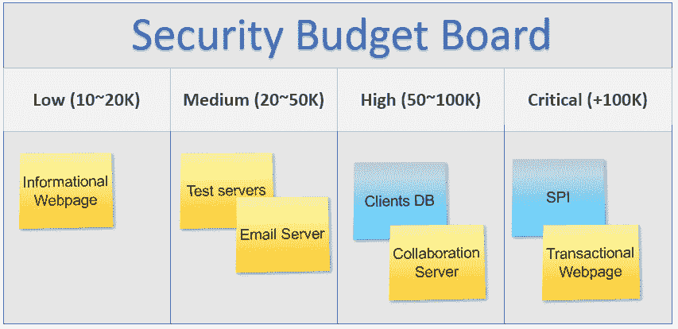

图 1.10 – 资产分类的示例看板

现在是时候创建你的 DiD 模型的安全层了。

## 分层防御

在这里，你将使用我们刚刚创建的资产优先级信息，根据你的资源开发最佳的分层模型。

关于是采用单一超级强控制还是多个良好的控制措施，目前存在一个公开辩论。

让我们看看一个示例场景的优缺点，以便你可以得出自己的结论。

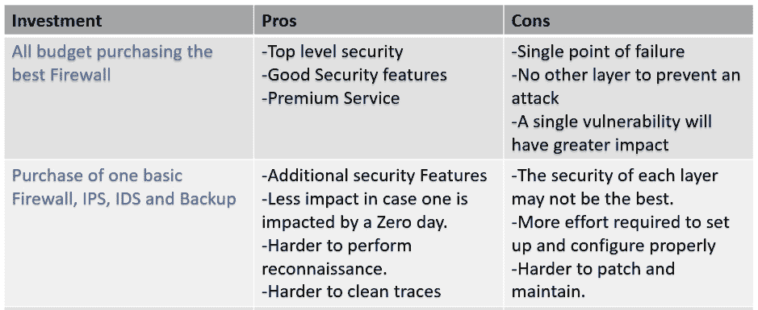

图 1.11 – 单一强控制与多重控制方法

创建安全层有两种方式，一是通过控制的功能，二是通过技术，接下来会进行说明。

### 按控制类型或功能创建安全层

在这里，你根据**控制的功能**或**类型**来创建安全层。

这个方法的核心是将你试图保护的内容与适用的控制措施相关联。例如，在某些情况下，纠正性控制可能不相关，而在其他情况下，它应该成为优先事项。*请记住，在安全领域，一切都需要根据业务量身定制*。

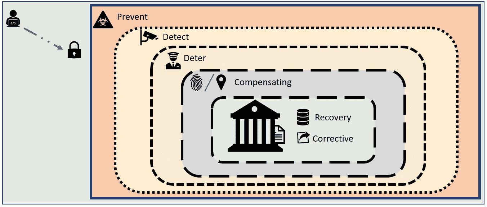

图 1.12 – 通过控制功能实现的分层安全

*图 1.12* 显示了一个完整的分层模型，包含按功能分层的最常见控制措施。例如，使用电围栏来*防止*有人进入建筑物，摄像头系统来*检测*入侵者，保安人员来*威慑*潜在入侵者，生物识别认证或地理位置作为*补偿*更昂贵机制的替代方法，备份系统用于在灾难发生后执行*恢复*，以及一个“**重启恢复**”软件（如深度冻结软件）来*修复*给定系统上的任何问题或配置错误。

### 按技术创建安全层

在这里，你根据使用的技术创建控制层，尽管它们提供相同的功能。例如，你可以在一个关键系统上实现多种方法或技术来检测入侵者（IDS、审计、日志等）。

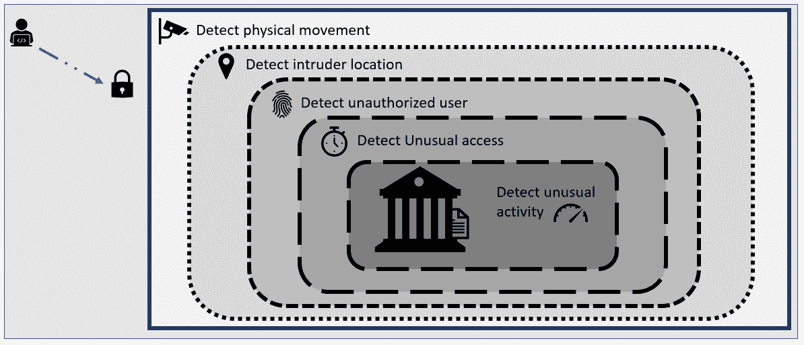

图 1.13 – 通过技术实现的分层安全

在前面的图示中，你可以看到如何根据技术创建分层的示例。例如，摄像头和传感器可能都是侦测控制，但它们使用不同的技术来实现这一点。当你想要增加对某个特定功能的关注时，这种模型非常有用，例如，实施多种技术来专注于侦测或预防。

小贴士

为了让事情更有趣，记住，层次还可以进一步定义为三类控制：管理控制、物理控制和技术控制。我知道你已经熟悉这些类别（所以不需要浪费笔墨解释它们），但我只是想提醒你，可以在同一层上添加来自这三类的组件。

### 哪种方法更好？

这取决于你的基础设施，因此，进行深入的环境分析是关键。

记住，这背后的逻辑是**让攻击者更难突破**，你可以通过这两种方法来实现。

### 分层安全模型的好处

实施*分层安全*方法有很多好处，*图 1.14* 突出显示了其中一些，供你考虑它们是否对你的防御性安全策略有益：

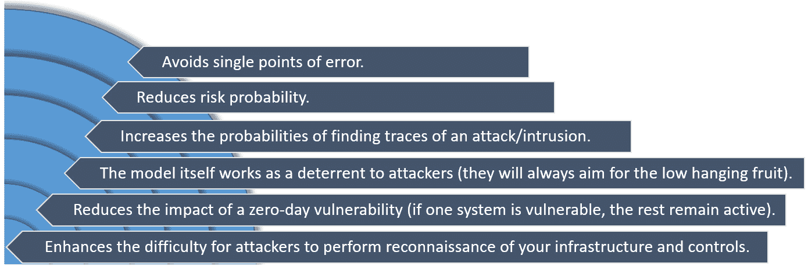

图 1.14 – 实施分层安全模型的好处

此外，高层管理人员也将从实施这种安全模型中受益，因为这使公司能够更好地分配网络安全资源。

小贴士

分层模型设计为独立工作，这意味着层与层之间没有通信。然而，最新的研究表明，连接各层之间的关系将改善系统，因为一个层级可能从另一个层级中学习，从而更好地防御即将到来的威胁。

请记住（就像安全领域中的其他一切一样），一个今天有效的分层模型可能在两年后就变得过时，因此你需要不断评估你的各个层级，以确定它们是否仍然提供所需的安全级别。

## 附加曲目

我知道你想看到最新和最先进的技术，所以这里有几个最近开发的系统，可以应用于分层安全模型。

### 移动设备功能禁用

这是我最近与我的朋友和大师级发明家*Eric Rueger*一起参与的一个非常有趣的项目（美国已获得专利）。这个项目的理念是根据时间、位置等多个因素，阻止在移动设备上执行多个系统。因此，这是一个最先进的系统，可以应用于模型的预防层或侦测层。以下是链接：[`patents.google.com/patent/US10594855B2/en`](https://patents.google.com/patent/US10594855B2/en)。

### 基于用户的认知安全调整

如果你想看到一个关于如何将 AI 添加到预防层（并将你的分层模型提升到下一个级别）的实际例子，可以看看这项正在申请专利的技术，其中系统监控用户的情绪状态和注意力水平，以判断是否应自动锁定用户的计算机，以防止未经授权的访问或敏感信息的无意披露。在这项系统开发过程中，我有幸与人类历史上最具创造力的发明家之一*Greg Boss*合作：[`patents.google.com/patent/US20190180013A1`](https://patents.google.com/patent/US20190180013A1)。

# 比较蓝队和红队

蓝队是防御团队，负责制定旨在防止网络安全事件发生的政策、流程、方法和技术（这可能就是你）。

另一方面，红队是一个经过专业训练的团队，专门寻找漏洞。他们将利用自己的技能找到访问某个系统或数据的途径。

他们基本上会遵循攻击者的相同步骤，但与其将你的数据暴露或卖给最高出价者，他们会制作一份精美的报告，供你用来检测漏洞并制定修复策略。

一些大公司可能拥有自己的红队，但这非常昂贵，而且资源可能会被低效利用，因此大多数公司通常会定期雇佣红队来测试其基础设施并收集宝贵数据以进行改进。

就像网络安全中的许多其他话题一样，关于红队和渗透测试存在公开辩论，因此为了便于读者理解，渗透测试将被定义为红队执行的任务之一。

作为一名防御性安全专家，你必须了解与渗透测试相关的许多因素，例如测试类型、渗透测试服务及其好处。

### 渗透测试的类型

渗透测试是根据你在测试之前授予他们的知识和访问权限的级别进行分类的。类别如下：

#### 黑盒测试

在这种类型的测试中，红队不会被提供任何关于目标的信息。这通常在测试整个基础设施以寻找全球性漏洞时使用。在这种情况下，红队必须从执行初步发现阶段开始，并跨越多个层次寻找任何易受攻击的点。

这种类型的测试更为*通用*，通常不涉及团队之间的合作。事实上，这通常作为某种*审计*执行，只有高级管理层知道测试的执行。这通常是为了进行真实的测试，而不让安全团队保持警觉。

这通常是三者中最复杂、资源消耗最重、最广泛的测试。

#### 灰盒测试

在这里，您向红队提供有关目标的一些细节，同时隐藏其他信息。例如，您可能要求测试某个应用程序，并提供该应用程序的架构，但更详细的信息，如源代码和用户，将被隐藏。

#### 白盒测试

在这种类型的测试中，您会向红队提供大量关于被测试系统/基础设施的数据，包括蓝图、用户、代码以及任何与被测试系统/基础设施相关的文档。

虽然这看起来是为红队简化工作，但这种类型更多的是关于蓝队和红队之间的协作环境，以进行更有针对性的测试。

### 渗透测试服务

您几乎可以测试任何东西；然而，以下是提供的最常见的渗透测试类型列表：

+   网络服务

+   数据库

+   Web 应用

+   Web 服务

+   API

+   无线网络

+   自带设备（BYOD）

+   VPN

+   社会工程

+   物理入侵

+   代码/应用

### 渗透测试的好处

许多组织仍然不愿意对其环境进行某种形式的渗透测试，所以让我与您分享一些好处，激励公司使用这个伟大的资产：

+   关于您的基础设施的外部反馈，包括弱点、漏洞和改进领域

+   在黑客利用之前关闭安全漏洞的机会

+   客观评估

+   支持您持续改进的举措

+   您辛勤工作的外部验证!!!

    提示

    雇佣专门的红队可能会很昂贵；然而，如果您的团队中有人具备进攻性技能，您可以利用这些经验进行小规模测试（如小型紫队）。

    拥有紫队并不取代红队的需求，因为来自外部“公正”测试者的输入可以提供额外的见解和价值。

    在雇佣红队时要小心，因为他们将处理公司非常敏感的信息。这里的规则是，您应该始终与一个您可以信任的合作伙伴合作。

    让您的法律团队参与进来，并确保与红队签署保密和数据隐私合同。

# 总结

在本章中，我们回顾了一些非常有趣的攻击类型，包括撕裂攻击、SYN 洪泛攻击和多种 DNS 攻击类型，以及如何防御这些攻击。

我们还学习了如何更好地处理基于密码的攻击，不仅从用户的角度，还从企业的角度来看。此外，我们还学习了如何创建 DiD 模型，以及如何利用多层防护来保护您的数据。

最后，我们通过了解如何在组织中利用拥有（或雇佣）蓝队或红队的优势来结束本章。

现在，让我们进入下一章，在这一章中，我们将了解如何通过利用 NIST 网络安全框架来管理企业级风险。同时，我们还将看到如何创建世界一流的 BCP 和 DRP，以增强组织的可用性和生存能力。

# 进一步阅读

本书的设计重点是*防御性安全*；然而，如果你想了解更多关于*进攻性安全*的内容，可以查看这本关于进攻性安全团队（红队）所采用策略的书：[`www.packtpub.com/product/cybersecurity-attacks-red-team-strategies/9781838828868`](https://www.packtpub.com/product/cybersecurity-attacks-red-team-strategies/9781838828868)。
