# 第二章：*第二章*: 管理威胁、漏洞和风险

*“你永远无法消除所有风险——专注于识别最高风险并加以缓解或消除。”*

*– 迪安妮·约翰森 - 安全 IT 总监 | IBM*

作为网络安全专业人士，你将不得不处理众多漏洞、威胁和风险。这三个术语通常是同义使用的；然而，它们非常不同，了解如何应对和管理它们非常重要。

现在，你需要理解*没有系统是完全无风险的*，你的基础设施和系统可能（且将会）随时发生故障。因此，你必须做好准备，确保在发生灾难时，能够确保你的业务继续（或恢复）运营。

在本章第二部分中，我们将讨论以下主要内容：

+   漏洞评估是什么以及如何创建一个漏洞评估

+   最常见的漏洞类型

+   USB HID 漏洞和设备概述

+   保持基础设施免受漏洞威胁的最佳机制

+   像专家一样管理网络安全风险

+   NIST 网络安全框架概述

+   创建一项有效的**业务连续性计划**（**BCP**）

+   实施一项最佳的**灾难恢复计划**（**DRP**）

# 技术要求

你可以通过使用带有互联网连接的设备来增强阅读效果，查阅提供的一些网络资源。然而，本章包含了完成学习所需的所有内容。

# 理解网络安全漏洞和威胁

所有系统、过程、基础设施和环境都有漏洞。这些漏洞通常是由于设计缺陷、bug、不良实现、缺乏更新以及其他攻击者（或威胁代理）利用的原因，从而导致他们能够访问你的系统和/或制造干扰。

*问题不在于系统是否有漏洞，而是到底是谁先发现它们？*

## 执行漏洞评估

作为一名网络安全专家，你必须不断寻找新的漏洞，以确保你的基础设施安全。

执行此搜索的过程叫做**漏洞评估**。

主要有两种方法可以实现这一目标。第一种是使用进攻性技术（如渗透测试），第二种则更像是基于识别基础设施中已知漏洞的防御性技术，具体方法是搜索与系统和产品相关的所有漏洞。

查找这些漏洞的最佳网站之一是**常见漏洞与曝光**（**CVE**）网站，网址为[`cve.mitre.org/`](https://cve.mitre.org/)。

本网站包含超过 130,000 个漏洞，这些漏洞几乎存在于所有主要系统中（包括软件和硬件）。

*现在，问问自己，你是否检查过你的打印机是否存在漏洞？* 好吧，这个页面上列出了超过 200 个与打印机相关的漏洞；其中一些与**拒绝服务**、**远程代码执行**、**缓冲区溢出**等有关。所以，如果你还没检查过你管理的打印机是否存在漏洞，*现在就去做吧*！

*你或你的公司是否在 Joomla 上创建了网页？* 如果是的话，你可能会惊讶地发现，那里列出了超过 1200 个与 Joomla 相关的漏洞，而这只是 Joomla 的漏洞，因为其他 CMS 软件还存在更多漏洞：

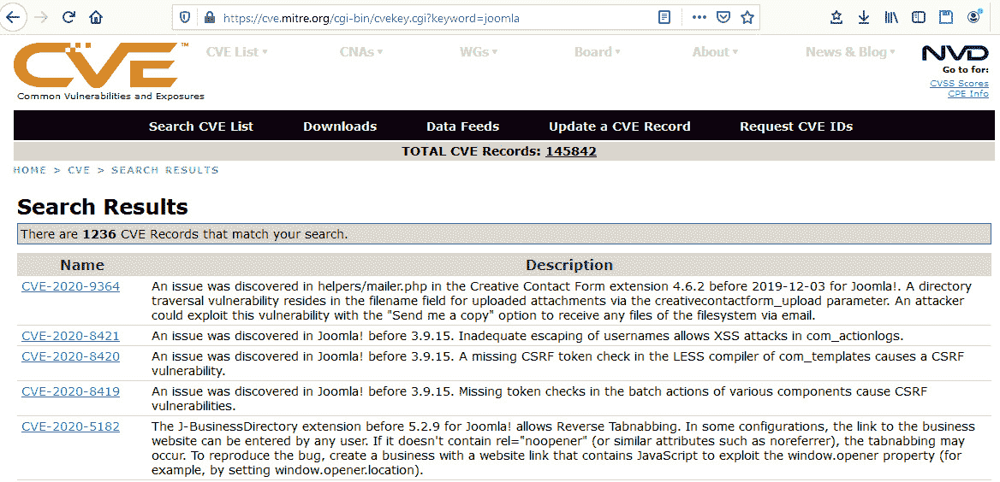

](img/Figure_2.1_B16290.jpg)

图 2.1 – Joomla 漏洞

如你所见，在*图 2.1*中，漏洞是按发现日期排序的。然而，在描述中，这些漏洞可能与旧版本（如版本 3.9）或新版本（如版本 5.2.8）相关。

提示

许多漏洞通过补丁或更新得到修复（这也是保持系统更新的重要原因）。然而，还有许多漏洞可能没有补丁，需要你对配置进行一些更改来消除漏洞。

现在，让我们回顾一下你需要遵循的过程，以像专业人士一样妥善管理你基础设施上的漏洞！

## 漏洞评估过程

每个公司都有自己独特的漏洞评估方法；然而，大多数公司遵循以下几个阶段。

### 漏洞识别

这一步是关于如何识别系统和网络中的漏洞。在这里，你可以使用一些知名工具，比如漏洞扫描器，甚至可以进行渗透测试，来进行有效的识别。

### 漏洞分析

一旦你发现了一个漏洞，就该分析它并尽可能收集关于它的信息。例如，你需要考虑以下问题：*如果这个漏洞被利用对我的公司造成影响，成本会有多高？；会有多少人受到影响？；这个漏洞的来源是什么？*。

执行**根本原因分析**（**RCA**）来查找漏洞的根本原因及其修复成本是非常常见的做法。

### 风险评估

这涉及执行风险评估，以根据概率和影响（定性和定量）来评估风险。但它也用于确定其他因素，如成本分析、缓解分析等。

### 漏洞修复

一旦你完成了所有分析，你必须继续实施*最佳修复措施*（或者，至少是高层管理选择的修复措施），以降低与漏洞相关的风险：

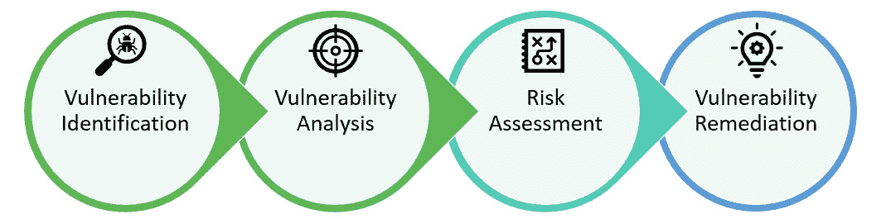

](img/Figure_2.2_B16290.jpg)

图 2.2 – 漏洞评估过程

请注意，这个过程是*迭代*的，因为任何给定的修复可能会在您的基础设施中引入一个新的漏洞。

## 您什么时候应该检查漏洞？

您必须时刻保持警惕，寻找新的漏洞；然而，有些事件需要您进行评估，以发现新的漏洞。以下是一些示例：

+   **在购买任何设备、系统或软件之前**：确保制造商不断发布针对已知漏洞的补丁。

+   **每次获得新系统时**：有时会在没有您同意的情况下获得新系统。在这种情况下，您需要确保在实施之前修复任何漏洞。

+   **当收购新业务时**：这是为了确保他们的安全政策与您的安全政策匹配。

+   **当开设新的办公室/分支机构时**：这是为了检查与可用性（或服务冗余）以及物理安全相关的漏洞。

+   **当迁移到另一个物理位置时**：这与前面的例子类似。您需要确保新地点不会增加任何与可用性和物理安全相关的新漏洞。

+   **新承包商的合同**：这是为了确保他们不会带来可能会为您的环境带来漏洞的设备；例如，受雇于贵公司执行工作的第三方不应使用不受支持的操作系统（如 Windows XP）。

现在，让我们深入回顾作为网络安全专业人员可能面临的最常见类型的漏洞。

## 漏洞类型

漏洞有很多种类型。然而，在这里，我将尝试总结出最重要的几种。

### 软件漏洞

错误、设计缺陷、后门和零日漏洞是您将面临的最常见软件漏洞。幸运的是，有一些工具专门用于搜索这些漏洞，我们将在 *第十三章*中更深入地回顾它们，*漏洞评估工具*。

### 用户漏洞

用户是任何组织中最脆弱的因素之一，原因有很多；例如，您可能会遇到使用弱密码的用户，使用相同密码的用户（在所有系统中，包括个人和工作系统），以及离开未加锁的系统的用户。等等。

然而，这非常复杂，因此我们将在 *第四章*中更详细地讨论这个漏洞，包括如何防范它，*修补第 8 层*。

### 物理漏洞

就好像你已经有很多事情要处理一样，你还需要检查与你的系统所在建筑物或校园相关的漏洞。例如，你需要确保建筑物不会受到某些天气条件的影响，这可能会干扰你的系统（如洪水或水漏）。此外，你还需要评估与物理访问系统相关的漏洞；我们将在 *第九章* 中更详细地讲解，*深入探讨物理安全*。

### 网络漏洞

你必须检查你的面向网络的设备和系统，看看别人能看到什么，并找出任何漏洞，这样你可以在别人利用它之前修补它。找出这些网络漏洞的方法有很多，我们将在本书中探索其中的许多。你可以利用的一个非常简单的方法是**Google Hacking Database**（**GHDB**）。这是一个 Google 搜索关键词（称为**dorks**）的汇编，使你能够利用 Google 搜索引擎发现网站和互联网连接设备上暴露的文档和信息，这些信息被 Google 索引。

有成千上万种 dork 可供你使用，用来查找你的网络资源中的漏洞，这些漏洞可能暴露敏感信息，如用户名、密码、目录、配置文件、表格、数据库、文档等。

你想了解更多关于 GHDB 的信息吗？

在这个页面上，你可以找到超过 5000 个现成的 dork 供你使用。我敢肯定，你会对这里找到的内容感到震惊：[`www.exploit-db.com/google-hacking-database`](https://www.exploit-db.com/google-hacking-database)。

有一个超级酷的应用程序，叫做**Damn Vulnerable Web Application**（**DWWA**），你可以用它来查看和探索*受控环境*中的网络漏洞。如果你想了解更多这个很棒的应用程序，可以跳到 *第十二章*，*掌握 Web 应用安全*。

### 物联网漏洞

物联网是一项蓬勃发展的技术，几乎所有公司在其基础设施中都有某种物联网实现。因此，分析所有物联网实现以检查漏洞非常重要。

有时，这些设备未经安全团队授权就被安装，主要风险是它们仍然使用默认凭证。所以，确保所有的物联网实现（即使只是一些小工具）都已正确配置。

有几个网站爬取互联网以寻找易受攻击的网页。你可以找到各种网站，范围从扫描互联网中带有默认密码的网络摄像头的页面（如 [www.insecam.org](https://www.insecam.org)）到扫描多个端口以查找暴露系统漏洞的更强大的页面。

最好的网站之一是[www.shodan.io](https://www.shodan.io)。这个搜索引擎允许你查找网站、物联网设备、网络摄像头、数据库、**工业控制系统**（**ICSes**）、路由器、网络设备等上的漏洞。通过快速搜索，你会惊讶于*大量*使用默认凭据的设备在网上存在：


图 2.3 – Shodan 的搜索类别

正如你在*图 2.2*中看到的，你甚至可以通过[Shodan.io](https://Shodan.io)按类别进行搜索，找到易受攻击的*设备、摄像头、数据库，甚至 ICS 系统*（我们将在接下来的章节中更详细地审视它们）。

提示

你可以使用[Shodan.io](http://Shodan.io)来查找你的网站、系统和暴露在互联网上的设备的漏洞。该搜索引擎允许你通过 URL、IP 地址、子网、设备类型、国家等进行搜索。

我将在*第十章*中通过许多例子扩展这个话题（包括如何利用物联网设备提高安全性），*应用物联网安全*。

### SCADA/ICS 上的漏洞

如果你的公司从事任何类型的制造业；拥有智能建筑；使用智能系统来管理能源、废物和水资源；或者从事智能城市业务，那么他们很可能有一些 SCADA 系统。

这些系统至关重要，你需要确保它们得到保护，因为攻击这些系统的影响通常会对公司造成毁灭性后果。一个关于此类攻击影响的典型例子是**Stuxnet**。这个国家支持的攻击通过针对 SCADA 系统，成功破坏了一个核电站。

这些系统非常复杂，且根据供应商的不同，它们之间的差异可能很大，使得保护它们的任务变得相当复杂。然而，你可以采取一些步骤或最佳实践来保护这些系统：

+   如果可能，安排供应商进行的维护服务，并确保这些服务包括漏洞评估。

+   保持设备更新，安装最新的更新。

+   了解系统使用的协议，并寻找相关的漏洞。

+   删除或禁用系统上未使用的用户。

+   禁用你们组织未使用的功能，以减少风险和可能的漏洞数量。

+   如果未得到供应商批准，避免使用第三方插件。

+   如果不使用，禁用远程访问连接或移动应用程序。

+   禁用未使用的 API。

+   应用网络分段，将这些设备与其他面向网络的系统隔离开来。

+   限制对设备管理控制台的物理访问。

+   确保所有默认用户和密码都已更改为强密码。

如果你的组织没有处理这些系统的经验，最佳做法是雇佣第三方公司，为你的团队提供如何保护这些系统的培训，或者与他们签订合同以确保这些系统的安全。

### 供应商漏洞

记住，你的系统的可用性依赖于你的供应商，因此你需要分析它们，以揭示与这些供应商相关的任何潜在漏洞（例如，互联网服务提供商、云服务提供商、硬件提供商等）。

### 客户端漏洞

在某些情况下，你可能需要将你的系统连接到合作伙伴或客户的网络或基础设施；在这些情况下，你需要对这些外部系统进行详细的漏洞评估，以确保它们不会给你的基础设施带来额外的漏洞。

### 依赖关系

进行漏洞评估时需要考虑的一个非常重要的方面是识别我们的系统或基础设施的依赖关系，并分析这些依赖关系以揭示潜在的漏洞。一个明显的例子是，某个系统可能通过 API 连接消耗人工智能（例如聊天机器人），如果该连接中断，系统将无法正常工作或容易受到欺骗。

### 过程漏洞

假设你的公司没有一个明确的流程来处理员工离职的情况。在这种情况下，一位系统管理员可能只是禁用该用户（这会产生剩余风险），而另一位可能会删除该用户（这可能会成为问题，因为你没有留下该用户的可追溯性）。因此，这两种情况都可能引发问题。这就是为什么缺失、不完整或设计不当的**身份与访问管理**流程本身就是一个巨大的漏洞。

提示

开始漏洞评估可能是过程中的最困难部分，因为你可能不知道从哪里开始。在这里，我的建议是首先将**漏洞类型**列出作为类别，然后开始在这些领域寻找漏洞。这样做既能为你提供一个起点，又能帮助你避免遗漏整个类别的评估。

现在，是时候了解攻击者利用具有物理访问权限的系统进行攻击的*最大漏洞*之一了：**USB HID 漏洞**。

## USB HID 漏洞

理想情况下，这个漏洞应该是*漏洞类型*部分的一个子主题。然而，我决定专门创建一个部分来讨论这些漏洞，因为它们是攻击者非常常用的、*危险的*漏洞，几乎存在于所有公司和基础设施中。因此，理解这些漏洞并准备好采取多种方法、系统、策略和技术来有效保护公司免受它们的侵害是至关重要的。

### 真实且危险的威胁

这个漏洞之所以如此相关，是因为它几乎存在于所有系统中，无论操作系统如何。实际上，你的所有系统（包括计算机、平板、笔记本，甚至服务器）都有这个漏洞的可能性：

*“基于 USB HID 的漏洞被认为是有史以来最严重的 IT 威胁之一。”*

*– Rhonda Childress*

其原因是，它利用了几乎所有系统中存在的两个因素：**USB 连接和 HID 驱动程序**。

另一个使这个威胁更具危险性（和相关性）的因素是所需硬件的价格。实际上，为了利用这个漏洞，你只需要一块配有 ATMEGA 32U4 芯片组的开发板，正如*图 2.4*所示，这种芯片组可以在几块便宜的开发板上找到（价格低于 5 美元）：

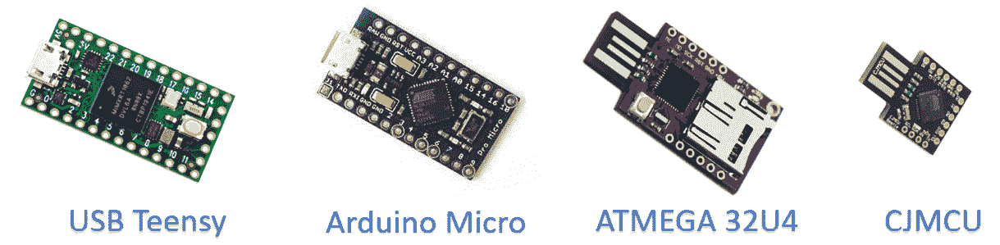

图 2.4 – ATMEGA 32U4 开发板

现在，让我们深入了解这个攻击的技术细节及一些示例。

### 什么是 HID 驱动程序？

几乎所有系统都会允许人类输入（即与系统的交互），而这通常是通过鼠标或键盘等设备完成的。因此，为了简化我们的生活，所有操作系统中都创建并加载了一组通用驱动程序，以使几乎所有的键盘和鼠标都成为真正的**即插即用**设备。这对用户来说非常方便，直到它们被攻击者利用来进行击键攻击。

### USB HID 攻击的开始

在担任系统管理员时，我的朋友和 Hak5 的创始人 Darren Kitchen 厌倦了反复输入相同的命令来修复设备。于是，他编程开发了一块开发板来模拟打字；从此，*击键注入攻击诞生了*。

### 这个攻击是如何工作的？

这个攻击非常简单；当恶意 USB 设备连接时，它会将自己呈现为一个 HID 设备（无论是键盘还是鼠标），由于 HID 设备默认被信任，这个恶意设备将能够完全访问目标系统并注入任何代码或命令。然而，由于这是一个低级别的攻击，注入击键所需的代码相对复杂，直到**USB Rubber Ducky**和**Rubber Ducky 脚本**的出现。

## USB HID 攻击的类型

虽然**USB Rubber Ducky**是第一个利用这个漏洞的商业设备，但如今许多其他设备也能利用这个漏洞。在这里，我们将探索其中一些最著名的设备。

### USB Rubber Ducky

*“看起来像一个闪存驱动器——像键盘一样输入。”*

几年前，Hak5 的 Darren Kitchen 介绍了**USB Rubber Ducky**，这是一款能够利用 USB 漏洞并允许你向目标计算机注入几乎任何有效载荷的 USB 设备：

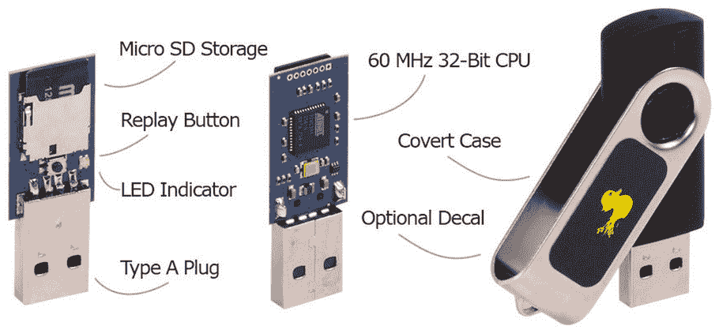

图 2.5 – USB Rubber Ducky 规格

虽然这个工具是为系统管理员和渗透测试人员创建的，但该设备被攻击者使用的风险非常高：

*“正如我们从经验中知道的，信任是难以建立却容易打破的。USB Rubber Ducky —— 以其闪存驱动器外观 —— 通过欺骗操作员让其认为它是无害的，从而破坏了信任。同样，通过模拟键盘，它欺骗了计算机，让它认为它是一个人类。简单的谎言在计算机系统设计上如此有效，因为计算机系统本质上是信任人类的——说实话，我不想生活在一个计算机不信任人类的世界里。”*

*– 达伦·基钦*

#### USB Rubber Ducky 脚本

对渗透测试和系统管理员社区做出最大贡献之一的，就是 **Ducky 脚本**的引入，这是一种简单（且优雅）的语言，允许你使用任何文本编辑器为多种 *恶意 USB HID 设备* 编写有效载荷：

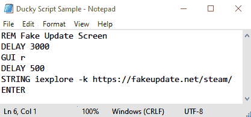

图 2.6 – Ducky 脚本示例

如你所见，在前面的截图中，创建 Ducky 脚本非常简单且直观。在这个示例中，你使用 **REM** 添加注释，然后添加一个 **延时**，延时为 3,000 毫秒，这是这类脚本中的良好实践，因为它在执行操作前等待 3 秒。这为 Windows 加载所有驱动程序并确保设备在执行攻击时准备就绪提供了足够的时间。

然后，它打开命令提示符（**Windows + R**）并添加一个小的延时（确保系统有足够的时间打开 *运行* 窗口）。接着，它注入一些 *按键* 来以特定参数打开程序。在这个示例中，我们以自定义的 Kiosk 模式（全屏）打开 **Internet Explorer**，然后打开一个模拟系统更新的页面，如下图所示（来自 Steam 的更新）：

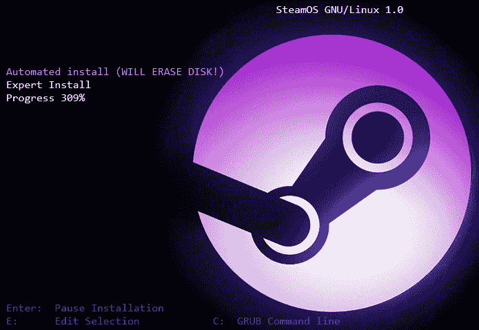

图 2.7 – 一个假更新屏幕

这是一个无害的示例，只会让用户产生一些恐慌，但没有造成实际的损害。然而，攻击者可以利用这种设备执行许多非常危险的攻击，比如将你的数据外泄到远程服务器、执行反向 shell、窃取用户凭证等等。

提示

你想了解更多关于 Ducky 脚本的信息吗？这里是官方 Git Wiki 的链接，你可以在这里学习如何创建自己的脚本，并查看许多示例，包括 DNS 投毒攻击、OSX 攻击等：[`github.com/hak5darren/USB-Rubber-Ducky/wiki`](https://github.com/hak5darren/USB-Rubber-Ducky/wiki)。

虽然 USB Rubber Ducky 是第一个利用此漏洞的先锋设备，但也有许多其他设备同样利用 USB HID 漏洞。

### Bash Bunny

Hak5 的 Bash Bunny 是世界上最先进的 USB 攻击平台之一。这个小巧而强大的 USB 设备使攻击者能够使用一个设备执行多种攻击。因此，虽然 USB 橡胶鸭只能注入按键，但 Bash Bunny 具有额外的功能，如 USB 以太网控制、大容量存储和串行控制台（本质上，该设备就是一个小型 Unix 主机）。更危险的是，Bash Bunny 允许攻击者将所有这些功能组合使用，使其成为对你基础设施的严重威胁。如果你想了解更多信息，请访问[`www.bashbunny.com`](http://www.bashbunny.com)。

### WHID 注射器

之前的示例存在一个局限性，因为攻击需要预先加载到设备中，但如果你想远程注入有效载荷呢？嗯，这正是你可以通过**WHID**来实现的功能（[`github.com/whid-injector/WHID`](https://github.com/whid-injector/WHID)）。

WHID 基于廉价（但强大）的硬件，配合*ESPloitV2*软件，执行远程命令注入。为了让攻击者的操作更为简便，你可以使用一个应用程序来远程控制注入。这个应用程序可以在**nethunter**上找到，网址是[`store.nethunter.com/en/packages/whid.usb.injector/`](https://store.nethunter.com/en/packages/whid.usb.injector/)。

### P4wnpi

这是一个非常酷的项目，使用**树莓派 Zero**（它是一个非常棒的物联网单板计算机）执行多种 USB HID 攻击：

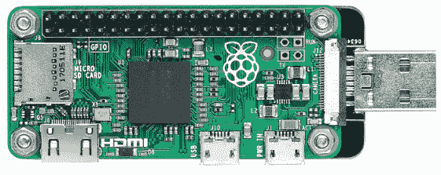

图 2.8 – 带 USB A 端口的树莓派 Zero

使这个攻击非常危险的一个特点是，**树莓派 Zero W**内置了 Wi-Fi 功能，使攻击者能够远程执行操作，甚至将数据实时外泄到外部服务器。

重要提示

你想用支持物联网的树莓派来创建自己的网络安全设备吗？如果是的话，那么我会在*第十章*中向你展示如何做到这一点，*应用物联网安全*。

如果你想提升自己的网络安全技能并成为一名网络安全研究员，那么我强烈建议你使用物联网设备，如**树莓派**或**ESP8266**，进行自己的测试。

### USB 鱼叉

你可能会认为连接一个 USB 驱动器可能非常可疑（这是真的），但这个问题可以通过一些社会工程技巧来解决。

然而，为了克服这个局限性，研究人员将一个**BadUSB**设备嵌入到充电电缆中，以伪装攻击并创造了这个新威胁——**USB 鱼叉**。

*现在，每当你在公司看到一根 USB 电缆时，你可以开始变得多疑，因为即使是用来为 USB 风扇供电的电缆也可能是* **USB 鱼叉**。

### 易受攻击的 USB 加密狗

研究人员发现了许多 USB 加密狗中的漏洞，这些漏洞允许攻击者注入按键操作。这是一种更危险的情况，因为攻击者将利用一个合法的 USB HID 设备来执行攻击。请参考 CVE-2019-13052、CVE-2019-13053、CVE-2019-13054 和 CVE-2019-13055。

### USB Samurai

简单来说，你可以将 WHID 的强大功能、USB Harpoon 的隐蔽性与 USB 加密狗的漏洞相结合，就能得到一个 USB Samurai！这是一种看起来像标准 USB 电缆的危险设备，但它允许攻击者向受害者的计算机注入远程按键（所有这些都在 *$5* 以下）：

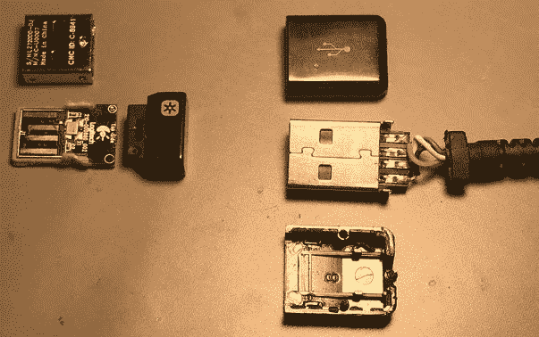

图 2.9 – USB Samurai 组件

*图 2.9* 显示了 USB Samurai 的基本组件：一根普通的 USB 类型 A 电缆和一个易受攻击的 USB 通用键盘加密狗。

### 基于智能手机的 USB HID 攻击

为了使 USB HID 漏洞更具危险性，攻击者现在可以利用智能手机的*USB OTG 功能*来执行 USB HID 攻击。

为了实现这一点，攻击者将使用**Nethunter**，这是一个针对 Android 设备（手机和平板）的 Kali Linux 发行版。要了解更多关于此攻击的信息，请访问官方仓库：[`github.com/offensive-security/kali-nethunter/wiki/NetHunter-HID-Attacks`](https://github.com/offensive-security/kali-nethunter/wiki/NetHunter-HID-Attacks)。

重要提示

如果攻击者熟悉 Rubber Ducky 攻击，可以使用 **Nethunter** 上的一款工具，名为 **DuckHunter HID**，它将允许攻击者快速轻松地*将 USB Rubber Ducky 脚本转换为 NetHunter HID 攻击格式*：[`www.kali.org/docs/nethunter/nethunter-duckhunter/`](https://www.kali.org/docs/nethunter/nethunter-duckhunter/)。

甚至还有一个工具，攻击者可以在智能手机上执行，利用这一 HID 漏洞，这被称为**BadUSB 中间人攻击**。在这种攻击中，攻击者只需通过 USB OTG 电缆连接目标机器，就可以发起中间人攻击。

要了解更多信息，请参考：[`www.kali.org/docs/nethunter/nethunter-badusb/`](https://www.kali.org/docs/nethunter/nethunter-badusb/)。

提示

在**Nethunter**上还有许多其他可用的攻击方式。你可以访问他们的官方网站以了解更多信息：[`www.kali.org/kali-linux-nethunter/`](https://www.kali.org/kali-linux-nethunter/)。

如你所见，在我们展示的例子中，攻击者可以利用这一漏洞的可能性和选项太多了。因此，意识到这个漏洞是你有效防御它们的第一步。

## 虚假的安全感

我对公司未能意识到 USB HID 漏洞的危险感到震惊。事实上，大多数公司将面向外部客户的员工的 USB 端口完全暴露！更疯狂的是，我亲眼目睹了许多银行将客户服务代理的计算机放在桌面上，完全暴露了 USB 端口：

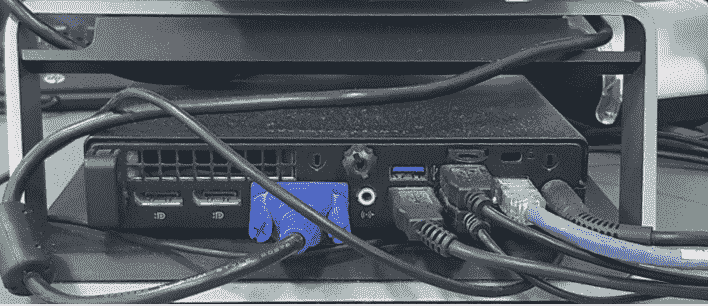

图 2.10 – 小型机箱 PC，面向客户的一侧暴露一个 USB 端口

因此，我决定与银行的 CTO 进行沟通，了解将客户接待员工的计算机 USB 端口暴露在桌面上（即电脑上）背后的原因（如果有的话）。他的回答令人震惊：*"将电脑放在桌面上有利于维护，因为电脑会积累更少的灰尘。"* 起初，我以为他在开玩笑，但在几秒钟的不适沉默后，我悲哀地意识到他并没有开玩笑。

我的下一个问题是询问他是否意识到这种行为所代表的风险，他的回答是：*"不用担心 USB，它们被禁用了，所以如果有人插入 USB 驱动器也没有风险。"* 然后，我意识到他的漏洞评估是基于 USB 大容量存储攻击，而不是针对 USB 按键攻击的。

知道那些电脑很可能存在 USB HID 攻击的漏洞后，我请求连接我的 USB 驱动器的许可，他笑着同意了（就像他知道我在浪费时间一样）。那时，我总是带着一个 USB Rubber Ducky，它上面有一个简单的脚本，可以执行两项简单任务：

1.  将背景更改为看起来像是被病毒感染的图片。

1.  杀死`explorer.exe`，让桌面上的所有文件看起来都消失了。

这一切发生得非常迅速。起初，他似乎很震惊，然后看着我，在我有机会向他解释发生了什么之前，我就被踢出了银行！

问题在于，他对 USB 漏洞的理解不足，给了他一种虚假的安全感，这让他（以及银行）变得更容易受到 USB HID 攻击。

后来我发现，他实际上只是使用了 Windows 策略（如下面的截图所示）来阻止大容量存储 USB 驱动器。当然，这并不能保护他免受任何 USB HID 攻击：

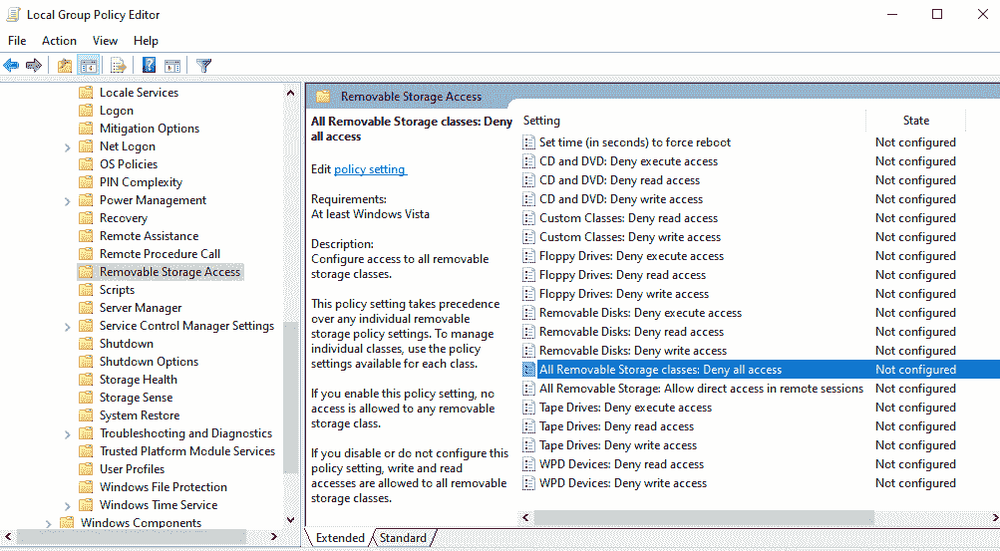

图 2.11 – 禁用 Windows 系统上的大容量存储设备类别

为了理解为何会发生这种情况，我们需要了解 USB 协议是如何工作的。

### 理解 USB 协议

每次你连接一个 USB 设备时，首先，它会识别设备的速度。然后，它会获取设备描述符，这些描述符基本上有助于设备的识别。

其中一个描述符是 USB 类，它告诉计算机你正在连接什么类型的设备；例如，考虑以下情况：

+   类 01h  音频设备（如扬声器）

+   类 03h  HID 设备（如鼠标、键盘或 Rubber Ducky 设备）

+   类 08h  大容量存储设备（如 USB 驱动器或外部硬盘）

这就是魔法发生的地方，因为根据银行的例子，他们当时防御的是类 08h 的设备，但所有类 03h 设备都能直接连接，而没有任何警告信息。

提示

如果你想了解更多关于 USB 协议的信息，建议你查看[`www.usb.org/sites/default/files/hid1_11.pdf`](https://www.usb.org/sites/default/files/hid1_11.pdf)。此文档详细解释了你需要了解的有关该协议如何工作以及它如何与主机计算机交互的所有内容。

因此，我们需要找到一种方法来保护我们的系统免受类 03h（即 USB HID 设备）的攻击。

## 防御 USB HID 攻击

到目前为止，你应该已经意识到（并且更有可能担心）USB HID 漏洞的危险。因此，现在是我给你一些工具、技术和方法的时刻，你可以实施它们来有效地防御你的基础设施免受这些攻击。

### 利用 Windows 安全日志

每次连接外部设备时，Windows 会生成一个**安全事件**日志条目，事件 ID 为**6416**（[`docs.microsoft.com/en-us/windows/security/threat-protection/auditing/event-6416`](https://docs.microsoft.com/en-us/windows/security/threat-protection/auditing/event-6416)）。

使用此方法，你可以查找攻击设备（如 Rubber Ducky）的痕迹，以检测任何攻击。

为了实现这一点，我们需要考虑到，大多数用于这些攻击的设备都基于两种微控制器：著名的**atmega32u4**（它出现在 Arduino Nano、Arduino Micro 和 Teensy 中）和小型的**ATtiny8**（它出现在 Digispark 和 Beetle USB 中）。

好消息是，这两款设备都是由同一家公司**ATMEL**生产的，这个信息非常关键，因为它可以帮助我们检测连接的设备是否是真正的键盘或是一个微小的恶意设备：

```
idVendor              0x03EB Atmel Corp.
idProduct             0x2FF4
iManufacturer         1 ATMEL AVR
iProduct              2 HID Keyboard
```

另一种选择是通过**设备 ID**进行搜索：

```
USB\ \VID_1B4F&PID_9208
```

为了自动化此过程，你还可以利用日志监控系统来搜索前述值并触发一些警报。

提示

请注意，所有这些值（设备 ID、供应商 ID 等）都可能被伪造。因此，虽然这是一种不错的防御措施，但需要配合其他方法，以保护你免受即便是最先进的攻击。

如前所述，尽管目前用于这些攻击的大多数设备是基于**ATMEL**的，但你也可能需要检查其他用于这些攻击的设备，比如使用 Broadcom CPU 的**树莓派**。

### Windows Defender

你还可以使用 Windows Defender 来检测多种 USB HID 攻击。

由于这些攻击是基于脚本的，你可以利用它们的可预测性，通过事件序列来检测它们。

该代码非常简单；首先，它会监控新的 USB HID 设备连接。如果检测到连接，它将检查在接下来的*x*秒内是否有打开命令提示符或 PowerShell 窗口。如果是，可能是某人插入了一个恶意 USB（或者系统管理员急于打开命令提示符测试新键盘）：

```
//Identify USB HID Devices
let MalPnPDevices =
    MiscEvents
    | where ActionType == "PnpDeviceConnected"
    | extend parsed=parse_json(AdditionalFields)
    | sort by EventTime desc nulls last 
    | where parsed.DeviceDescription == "HID Keyboard Device"
    | project PluginTime=EventTime, ComputerName,parsed.ClassName, parsed.DeviceId,         parsed.DeviceDescription, AdditionalFields;
//check if a cmd or powershell is executed in the next 10 seconds
ProcessCreationEvents
| where ProcessCommandLine contains "powershell" or
        ProcessCommandLine startswith "cmd"         
| project ProcessCommandLine, ComputerName, EventTime, ReportId, MachineId
| join kind=inner MalPnPDevices on ComputerName
| where (EventTime-PluginTime) between (0min..10s)
```

你还记得 WHID 设备吗？好吧，你可以添加一行代码，使用它们的设备 ID 来专门检测该设备：

```
| where DeviceId == @"USB\VID_1B4F&PID_9208\HIDFG"
```

请记住，这种防御机制是基于攻击的可预测性；然而，它也存在一些缺陷。例如，在提供的代码中，它会监听在接下来的 10 秒内是否有命令提示符窗口打开，但如果攻击者在脚本中添加了 11 秒的延迟，那么你就完蛋了。

如果你想了解更多关于使用 Windows Defender **高级威胁保护**（**ATP**）的附加安全设置，请参考[`docs.microsoft.com/en-us/windows/security/threat-protection/device-control/control-usb-devices-using-intune`](https://docs.microsoft.com/en-us/windows/security/threat-protection/device-control/control-usb-devices-using-intune)。

### DuckHunt

这是 Pedro Sosa 创建的一个非常酷的脚本，它通过非常巧妙的方式解决了前面提到的问题。基本上，他修改了自己开发的按键程序，在每次检测到按键后都会添加一个时间戳。

有了这些信息，你可以判断打字速度是否超过正常水平（比如，每秒输入 10 到 20 个字符）。然后，系统会将其标记为注入攻击，并阻止所有 USB HID 输入。

以下是 Ducky Script 攻击的示例：

```
C:\Users\Robotin>This is a scripted attack and now I can inject my payload at lightning speed…..HAHAHA
```

这是**DuckHunt**如何停止 Ducky Script（USB HID 注入）攻击的示例：

```
C:\Users\Robotin>This is a scri_
```

DuckHunt 有许多额外功能。如果你想了解更多，可以访问其官方站点：[`github.com/pmsosa/duckhunt`](https://github.com/pmsosa/duckhunt)。

### USB 锁

这是一个非常基础的解决方案，通过设置一个锁机制来物理阻止新的 USB 设备连接。然而，这个设备有几个缺点，包括以下几点：

+   它的成本很高。

+   实施它需要大量的努力。

+   维护它需要大量的努力。

+   它不适合远程工作者或 BYOD（自带设备）。

+   这种方法不适合经常移动或出差的销售人员或用户：


图 2.12 – USB 锁机制示例

此外，正如你在*图 2.12*中看到的，使用这些设备的钥匙非常基础，使得大多数解决方案容易受到开锁攻击。

### USB 阻止器

在对系统应用安全措施时，你需要确保所实施的解决方案不会影响系统的可用性，而这可能正是问题所在。

这款由技嘉提供的工具按设备类型封锁端口。这意味着，如果你选择封锁 HID 设备，你将无法使用 USB 鼠标和键盘，这可能是一个非常糟糕的主意。

### 保护免受易受攻击的 USB 加密狗威胁

这是一个非常严重的威胁。因此，首先，确保你的个人设备（甚至是你家人和朋友的设备）上没有易受攻击的 USB 加密狗。

另一方面，在公司层面，你可以采取以下步骤：

1.  创建一个易受攻击设备的清单（也就是说，只需搜索一个易受攻击的 USB 加密狗就能获得最新清单）。

1.  一些供应商发布了补丁来修复漏洞。然而，要确保所有连接的加密狗都已修补将非常困难，因此你在制定政策时应该考虑到这一点。

1.  确保你的公司不购买易受攻击的设备。

1.  检查公司资产中是否有易受攻击的设备，并进行修补或更换。

1.  此外，制定（并分发）一项政策，限制员工在公司资产上使用易受攻击的设备（包括易受攻击设备和型号的清单）。

到现在为止，你应该已经清楚地理解了**网络安全漏洞**的概念。然而，识别漏洞只是游戏的第一步。现在，是时候继续深入了解如何管理、评估、响应并监控这些漏洞，从而提高我们基础设施的安全性。

# 管理网络安全风险

**风险管理**是一个非常有趣的话题，关于这个话题有成百上千本书籍和认证。然而，我不会给你提供大量让人不知所措的信息，而是会尝试总结所有关于风险管理的现有知识，将其适应于网络安全环境，并仅提供你在管理风险时需要的正确信息，帮助你像专业人士一样进行管理！

为了简化定义，我们将风险定义为在满足特定条件时会对系统或基础设施产生影响的事件。这些事件通常是由威胁（或威胁代理）触发的，利用了特定的漏洞。

现在，识别和分析该事件发生的影响及概率的过程称为风险管理。

所有系统和基础设施都存在多种相关风险，因此识别并尽早减轻这些风险至关重要。

管理风险的方法论和框架有很多，虽然大多数非常相似，但概念的名称略有不同；不过，我将专注于最被广泛认知的方法，以便让你更容易理解。

现在，让我们查看管理网络安全风险的四个步骤的详细信息（**风险识别**、**风险评估**、**风险应对**和**风险监控**），让您像*专家*一样管理网络安全风险。

## 风险识别

首先，您需要*识别*与您的基础设施或系统相关的风险。现在，我将分享一些有助于您完成此任务的技巧：

1.  **详细而广泛地列出您的资产**：大多数时候，风险未被发现是因为未识别“幽灵”或遗留系统，因此，从彻底发现您的资产开始，确保所有基础设施和系统都在覆盖范围内是至关重要的。

1.  **新资产的持续发现**：请记住，这是一个持续进行的任务，您需要定期扫描您的环境和网络，发现任何已添加到基础设施中的新设备。

1.  **资产评估**：这里的一个好做法是评估您的资产，确定哪些对您的组织至关重要（即您的“皇冠珠宝”），以便为其防护投入更多的资金。这也有助于您在优先级排序和风险分析方面。

    提示

    不要单打独斗；寻求帮助和支持！您很难从自己的办公桌上列出所有的风险，因此，可以利用系统管理员、IT 人员和最终用户的经验，帮助您发现潜在的风险。

在此识别过程中，您需要创建一个**风险登记册**，这是一个包含所有已识别风险的数据库。有成百上千种模板可供使用，它们的大小和列数各不相同。然而，您也可以使用 Excel 创建自己的风险登记册，只需确保包括以下基本要素：

+   **风险 ID**：风险的唯一标识符。

+   **描述**：风险的清晰简洁描述。

+   **风险拥有者**：负责监控风险的人。

+   **风险触发器**：将风险转化为问题的事件。

+   **风险类别**：为了更好地管理所有风险，建议您创建风险分组，例如，物理访问、网络、软件、Web 应用等。

+   **概率**（**定性**）：这里您可以使用 3 或 5 个等级（例如无关紧要、低、一般、高和关键）。

+   **影响**（**定性**）：评估如果风险发生，给业务带来的影响。

+   **风险应对**：描述您采取了哪种应对措施来减少风险的发生概率和/或影响（例如减轻、转移等）：

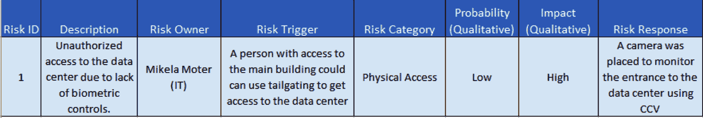

图 2.13 – 风险登记册示例

还有许多其他领域可以包括，比如**风险来源**，在其中您可以指定风险是来自内部还是外部威胁（无论是人为的还是环境的）。

现在，您已经识别出风险，接下来需要对其进行评估。

## 风险评估

顾名思义，这一步是关于评估风险的*发生概率*和业务*影响*。

有两种方式可以进行这种类型的评估：定性和定量。

### 定量分析

让我们停顿一下，让我问你一个问题：

*如果你有一个价值 50 万美元的资产，你会投资 7.5 万美元来保护这个资产吗？*

这是一个棘手的问题，因为无论你的回答是“是”还是“否”，真正重要的是你是否用*数字*来支持你的回答，因为这将告诉你是否能获得该预算。

好消息是，你可以使用几种工具和方法来获得这些数字。然而，更好的消息是，你可以使用三个简单的公式来收集这些数字。

首先，你需要确定*如果风险发生，资产的价值*。其次，你还需要确定*有多少资产将受到影响*。举例来说，假设在地震情况下，你公司数据中心的 25%受到影响，如果数据中心的价值为 10 万美元，那么地震造成的损失将是 2.5 万美元。这个可以通过以下公式来表达：

*单一损失预期（SLE）= 资产价值 * 暴露因子*

然而，如果你试图确定每年该投入多少资金来应对该风险，那么你还需要进行两个额外的计算：

1.  确定该风险在每 12 个月内发生的可能性，其中 1 意味着每年一次，而每 5 年一次则等于 1/5（0.2）。得到的值称为**年化发生率**（**ARO**）。

1.  现在你已经知道了风险的成本和风险发生的概率（每 12 个月一次），你可以将这两个值相乘，来确定每年的平均风险成本：*年损失预期（ALE）= SLE * ARO*。

    重要提示

    还记得我刚才的棘手问题吗？现在，你可以利用之前的公式来确定在什么情况下投资 7.5 万美元用于修复或控制措施是合理的（例如，你不希望采取的风险响应措施比风险发生的成本还要昂贵）。

现在，让我们来看一下如何通过文字而不是数字来对风险进行分类，这是一种更简单、更快速的分析方法。

### 定性分析

这是一种更主观的分析，因为它基于专家（或专家组）的意见，他们根据一个等级来提供评分。通常，这些等级分为 3 个或 5 个级别，但有些公司使用自定义的值。

最常见的做法是使用 5 x 5 矩阵，将*概率*和*影响*关联起来，从而得出风险的平均关键性。如你所见，在下表中，一个低概率但高影响的风险将被视为中等风险，而一个高概率且中等影响的风险将被视为重大风险：

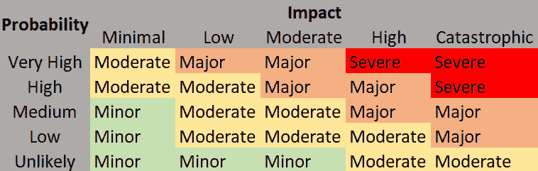

图 2.14 – 5 x 5 风险矩阵

相关性值（**轻微**、**中等**、**重大**或**严重**）将用于对风险进行排名。

如前所述，这是一个主观评估。因此，一个好的做法是分析不同小组，以收集他们的意见，因为这可能有助于减少结果的偏差。

## 风险应对

在这个阶段，你已经了解了风险，并根据发生的概率和商业影响对其进行了优先级排序。现在，是时候确定应对这些风险的最佳机制、策略或控制方法，以便让你的生活更轻松。应对措施可以分为四类：

+   **减轻**：这是最常见的应对措施；事实上，“减轻”一词常常与风险应对同义使用，因为它是应对风险时考虑的默认行为。减轻是通过应用一种控制措施、系统、机制或策略来减少风险的概率或影响，使其降到一个可接受的水平。减轻的例子包括安装**生物识别访问控制**、安装**入侵防御系统**以及在发布系统前进行安全测试。

+   **转移**：有时，缓解措施要么太昂贵，要么难以实施（由于缺乏知识或资源）。在这种情况下，你可能想将风险转移给第三方。一个典型的例子是购买保险（以恢复设备费用）或将服务外包给第三方（例如，有时将服务器托管在安全的数据中心比将这些安全措施应用于自己的数据中心要便宜）。

+   **规避**：现在，假设有一个面向客户的新应用，具有漂亮的 GUI 界面。然而，你通过研究发现该系统存在多个*未修复的漏洞*，这些漏洞可能会暴露客户数据。在这种情况下，处理这个风险的最佳方法是*规避*购买该系统。

+   **接受**：这是最不推荐的选项，应该仅在其他三种选项不适用时作为最后的手段使用。例如，如果某人访问旧版服务器的风险非常低，且影响也非常低，因为它是一个测试服务器，托管的数据不敏感，而且缓解成本为$100,000，那么你可能会选择接受这个风险，并将预算用于支持更关键风险的应对。

    重要提示

    我们之前讨论了为硬件购买保险；然而，你也可以为其他无形资产投保，例如数据丢失，甚至可以涵盖一些其他风险，如数据泄露或由此产生的责任。

现在，让我们查看该过程的最后一步，通常被忽视，但它是确保风险始终保持最新并持续管理的关键。

## 风险监控

风险管理应该是一个迭代的过程，这最后一步旨在确保风险始终被**识别**、**评估**并**处理**。一个被评估为*轻微*的风险可能随着时间的推移变得*严重*，因此响应也应根据这种变化进行调整。

# NIST 网络安全框架

NIST 网络安全框架的设计旨在帮助网络安全专业人士更好地评估和提升其**识别**、**保护**、**检测**、**响应**和**恢复**网络攻击的能力。该框架基于以下五个领域。

## 识别

这里的目标是了解我们的环境，包括我们的资产、业务环境、治理、风险管理策略等。

正如你可能已经注意到的，资产识别在网络安全中至关重要。然而，我想强调的是，尽管这看起来显而易见，但许多公司因未能充分了解和意识到自己的基础设施、系统和设备而遭受攻击。

## 保护

现在你已经了解了你的环境，接下来就是保护它。框架提出了以下机制（这些自解释，因此无需深入探讨）：

+   访问控制

+   意识与培训

+   数据安全

+   信息保护过程和程序

+   维护

+   防护技术

## 检测

会有许多情况，攻击者能够绕过你的防护系统和层级，因此，在这些情况下，你应该能够检测到这些威胁。为此，框架建议采取以下措施：

+   **检测异常和事件**：及时检测所有恶意活动，包括与之相关的潜在影响。

+   **安全持续监控**：保持对 IT 系统和资产的监控，以识别任何事件以及防护措施的有效性（或弱点）。

+   **检测过程**：确保你开发、更新并共享所有旨在检测网络安全事件的过程和程序。

## 响应

该领域是关于对特定网络安全事件采取适当行动的应用：

+   **响应规划**：确保你已建立所有流程和程序，以确保能够及时有效地响应网络安全事件。

+   **沟通**：这是一个关键的（通常被忽视的）任务，涉及如何与内部和外部利益相关者沟通任何网络安全事件。

+   **分析**：这是对响应进行分析，以衡量其效果。

+   **缓解**：这指的是旨在减轻网络安全事件影响的活动。

+   **改进**：这利用从经验中获得的教训来支持持续改进的模型。

## 恢复

这个领域涉及到为恢复受网络安全事件影响的业务能力和服务所需的活动：

+   **恢复计划**：所有计划事件都是必要的，以确保受影响的系统和资产能够及时恢复。

+   **改进**：这指的是基于从经验中获得的教训对所有计划事件进行改进。

+   **沟通**：这涉及管理与受影响系统相关的内部和外部利益相关者的沟通（例如，供应商、提供商、受害者等）。

前四个领域与我们在风险管理过程中回顾的内容非常相似，因此不需要展开。然而，最后一个领域非常有趣且重要，因为所有公司都应该为应对灾难做好准备，并确保在灾难发生后业务的连续性，这也是我们将在下一部分中回顾的内容。

# 创建有效的业务连续性计划（BCP）

*问题不在于灾难是否会发生，甚至不在于它何时发生，而在于当它发生时你是否准备好了*。

从本质上讲，人类往往认为负面情况会发生在别人身上，而不是自己身上。这样思考的问题在于，即使他们知道其他公司在遭遇网络攻击后失去了一切的历史，只有少数公司会投资于确保在网络事件后业务连续性的计划。

公司创建*BCP*的三大驱动因素如下：

+   那些基于政府或国际机构的监管要求

+   客户的合同要求

+   对 BCP 价值的自我认知

现在，我知道获得资金和资源来创建有效的业务连续性计划（BCP）有多么困难，因此这里有一些市场研究专家（如 Gartner 集团、美国华盛顿国家档案和记录管理局、美国**联邦应急管理局**（**FEMA**）、彭博社和德克萨斯大学）收集的关键点，强调了公司在遭受安全攻击后未能拥有有效的连续性计划所面临的后果：

+   93%的公司在数据中心丧失超过 10 天后，在灾难发生一年内申请了*破产*。

+   94%的公司在遭受灾难性数据丢失后无法生存——其中 43%永远不再开门，51%会在两年内关闭。

+   50%的磁带备份恢复失败。

+   那些在灾难发生后无法在 10 天内恢复运营的公司，很难生存下来。

+   在灾难发生后，40%到 60%的小型企业永远不会重新开门。

此外，让我分享一些关于大公司业务连续性计划（BCP）的额外统计数据：

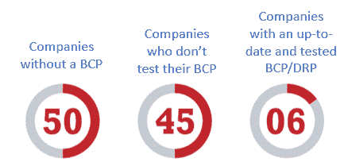

图 2.15 – BCP 统计数据

*数字不骗人：你可以利用这些数字来突显全球网络安全形势，以获得高层管理人员和资助人的支持和资源，来创建/维护你的 BCP/DRP。*

现在，创建 BCP 的第一步是深入了解公司（即其流程、部门、层级、职能和角色），以及任何潜在中断如何影响公司继续开展核心业务的能力；这就是所谓的**业务影响分析**（**BIA**）。

## 创建业务影响分析（BIA）

再次强调，互联网上有很多模板可以用来创建 BIA。其中一些非常复杂，可能对中型公司来说有些过于繁琐。另一方面，也有非常简易的模板，适合小到中型公司，但对于大公司来说，它们可能不够详细或具体。然而，重要的并不是模板，而是如何正确填写它。我们来回顾一下创建世界级 BIA 所需理解的所有概念。

### 任务关键职能

所有流程都很重要；然而，你需要识别哪些是支持性流程，哪些是运营业务所必需的核心流程。例如，如果你的公司制造汽车，那么制造流程是核心流程，必须保持正常运转，以免造成经济损失。相比之下，还有其他支持性职能，例如会计，尽管它们也很重要，但如果该流程中断，其影响可能不如核心流程那样严重。

### 关键系统识别

你必须识别对公司至关重要的系统。例如，电子邮件服务器对公司来说非常重要，但即使电子邮件服务器宕机，公司仍然可能继续运营核心业务。然而，另一方面，如果你的公司是做线上服装销售的，那么每当网页宕机，你的公司都会在每一分钟（或每一秒钟）中失去客户和收入。

### 恢复时间目标（RTO）

RTO 代表公司在遭受灾难后，必须花费的时间来恢复那些流程、活动或操作。

定义 RTO 并非易事，因为高层管理人员总是希望将其设定为接近零，但最终 RTO 越低，相关成本越高。因此，在定义这个数字时要现实，避免做出不切实际的决策。

请记住，一些高管可能会试图寻找整个公司的总体 RTO。然而，*你应该在更低层级定义 RTO*（按流程、活动、部门或任务），因为这样有助于你识别差距或需要更多资源支持的点。例如，灾难发生后恢复制造线的 RTO 必须低于恢复邮件服务的 RTO。在下面的表格中，你可以看到如何将服务映射到所管理数据的关键性，并对应的 RTO 和 RPO：

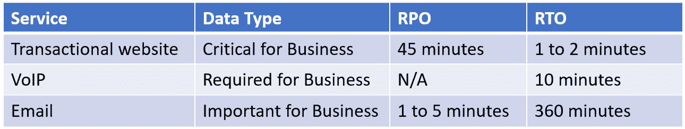

图 2.16 – 按照数据的关键性划分的 RPO/RTO

现在，让我们看看另一个重要的指标，**恢复点目标**（**RPO**）。

### 恢复点目标（RPO）

这指的是灾难后可以接受的最大数据丢失量。换句话说，就是在灾难发生后需要恢复多少数据。然而，问题在于；即使我们谈论的是数据，这些数据并不是按大小来衡量的，而是按时间来衡量的，因此并不是恢复多少比特的数据，而是恢复到哪个时间点的数据。例如，如果你有一个邮件服务器，那么丢失过去一小时收到的邮件可能是可以接受的，因此，RPO 为 1 小时是可以的。相比之下，如果丢失 1 小时的支付记录，那就可能不可接受。在这种情况下，RPO 应该在 1 到 10 秒之间。在下面的图表中，你可以看到 RPO 和 RTO 之间的关系：

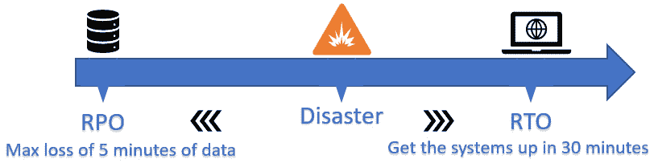

图 2.17 – RPO 和 RTO 的示例

这两个指标是基于停机时间和数据丢失的。然而，还有一个重要的指标可以用来确定系统的可靠性，那就是通过衡量系统预期的停机频率：**平均故障间隔时间**（**MTBF**）。

### 平均故障间隔时间（MTBF）

该指标通常由制造商用于确定产品的平均生命周期；然而，当你想为替换*故障*的旧系统进行投资辩护时，这个指标非常有用。例如，假设你有 20 个无线接入点，它们是在同一天安装的。然后，你会发现，第一个在 200 天后故障，第二个在 400 天后故障，第三个在 600 天后故障。这意味着在 1,200 天内，发生了三次故障，所以，通过除以 3，你可以得到这些无线接入点的 MTBF 为 400 天。

重要提示

如果你负责网络安全，那么你有责任检测到*故障*系统，并提供替代方案在它们造成重大灾难之前进行更换。这是因为如果该系统导致了停机，所有的责任都会归咎于你。所以，务必保持主动！

另一个有用的指标是确定*执行特定维护活动所需的平均时间*，例如重启服务器或更换硬件。这一点非常重要，因为你可以在未来利用这个时间，更好地预测该活动所需的时间。这个指标被称为**平均修复时间**（**MTTR**）。

### 平均修复时间（MTTR）

正如其名称所示，这指的是在系统或设备发生故障后，恢复、更换或修复所需的预估时间。这可以是你的团队修复所需的时间（内部修复），也可以是供应商根据给定的 SLA 修复或更换所需的时间。MTTR 与设备缺失对业务造成的影响相关。例如，更换终端用户笔记本电脑的硬盘可能需要 3 天（收集硬盘信息、购买硬盘、安装硬盘），而更换服务器硬盘可能优先级更高，MTTR 可能只有 1 小时（即收到警报，确定部件，使用本地库存更换部件）。

### 可用性

你还在疑惑了解 MTBF 和 MTTR 的价值吗？除了前面提到的好处，你还可以用它们来计算服务的可用性。

这是一个非常有趣的指标，你可以用它向上级管理层报告系统的状态，并为之前和未来的投资提供依据。例如，假设你的网页服务器在过去 400 天内故障了两次（MTBF = 200 天），而 MTTR 为 3 小时（MTTR = 0.125 天）。因此，如果设备每 200 天发生一次故障，且修复时间为 0.125 天，那么可用性就等于`200 / (200 + 0.125)`，这意味着，在这种情况下，我们的网页服务器可用性为*99.9375%*。

*可用性 = MTBF / (MTBF + MTTR)*

那么，99.9375%是否足够好？嗯，这取决于你的业务需求。然而，数据中心使用**等级**方法来确定它们的可用性水平，因此你可以将这些值作为参考点：

+   **Tier 1**：99.671%的可用性（这相当于每年 28.8 小时的停机时间）。

+   **Tier 2**：99.741%的可用性（这相当于每年 22 小时的停机时间）。

+   **Tier 3**：99.982%的可用性（这相当于每年 1.6 小时的停机时间）。

+   **Tier 4**：99.995%的可用性（这相当于每年 26.3 分钟的停机时间）。

    提示

    你在寻找一种客观支持是否选择内部托管解决方案还是第三方托管的方法吗？嗯，你可以分析当前的可用性，并与供应商提供的可用性进行对比，从而决定哪种解决方案最适合你的业务。

增强基础设施可用性的一个好方法是找出那些可能危及系统和基础设施正常运行的设备。这些设备被称为**单点故障**。

### 单点故障

如前所述，增强系统和基础设施可用性的一个关键方面是识别可能影响*系统正常运行时间*的关键设备。识别后，必须确保这些系统具有最高级别的安全性，以降低与之相关的风险，正如你可能猜到的，这些设备的 MTBF 和 MTTR 应为最低。

此外，你需要采取必要的措施，确保为那些单点故障设备提供冗余，以避免非计划的停机时间：

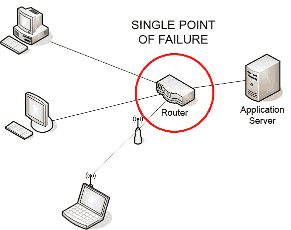

图 2.18 – 单点故障示例

*图 2.18* 是一个网络设备作为单点故障的常见示例。

### 谁创建 BIA？

BIA 的创建是一个共同的努力，部门或单位的每个负责人负责评估其组织并创建 BIA。然而，应该有一个人负责领导和协调它们的创建，并提供有关如何创建的指导和支持。根据公司结构，通常由风险经理或 BCP 经理负责这一任务。然而，如果你的组织没有这个角色，我建议你接手，因为最终，最能受益的人将是你。

## 业务连续性规划（BCP）

*这是通向终结之路的指南！*

BCP 的目标是拥有一套可以减少破坏性事件影响的政策、流程、程序、机制和工具，随时可以启用。现在，让我们来看看创建 BCP 需要做哪些工作。

### 确定范围和目标

一个好的计划是一个定义明确的计划。因此，我们将从为一个好的 BCP 奠定基础开始：

+   **范围**：确定 BCP 的范围（例如，部门级、公司级、国家级等）。

+   **目标**：根据公司指导方针突出 BCP 的目标。

+   **假设**：添加任何可能对读者有用的相关假设。

+   **文档所有者**：概述文档的所有者。

+   **文档版本**：概述文档的当前版本。

+   **分发列表**：概述该文档应分发给谁。

+   **识别关键利益相关者**：列出利益相关者及其角色和职责。

### 风险评估

你不需要创建另一个风险评估，而是利用现有的风险评估作为 BCP 的输入之一；只需确保它包含以下内容：

+   **风险描述**：确保列出的风险包括明确的描述，便于 IT 团队外的人理解。

+   **剩余风险和次要风险**：列出任何剩余或次要风险。

+   **风险来源**：确保按来源对风险进行分类（例如，环境、人为等）。

### 业务影响分析

我们已经知道如何创建 BIA（因此无需再次审查）。然而，关于应该先创建哪个，BCP 还是 BIA，仍有很多争议（这类似于“先有鸡还是先有蛋”的困境）。

专家的普遍共识是，最好先创建 BIA，因为它是 BCP 的输入。另一种方法是同时进行这两项工作；然而，同时完成这两项工作所需的努力可能是巨大的。

### 业务连续性策略

这可能是 BCP 中最重要的部分，因为它包含了所有支持业务连续性的策略、流程、程序及其他相关信息：

+   **流程和程序的定义**：定义所有的流程和程序，确保在网络事件或服务中断后业务的连续性。

+   **团队责任**：确定与业务连续性相关的不同团队的角色和责任。

+   **法律和法规要求**：列出所有适用的法律和法规，以及在网络事件发生时的相关影响。

+   **预防控制和缓解措施**：提及现有的控制措施和缓解措施，确保业务的连续性。

+   **触发定义**：概述何时触发控制措施和缓解措施，以避免业务中断。

+   **备用站点** (**数据**)：在主系统发生中断时，列出所有与备用站点相关的信息。

+   **替代地点** (**员工**)：在服务中断的情况下，包含所有与备用地点相关的信息，用于转移业务操作。

+   **替代提供者和采购**：在当前提供者出现问题时，提供可用的商品和服务替代供应商名单。

### 员工安全

每个公司的优先事项*始终*应该是员工的安全，因此作为一种最佳实践，BCP 必须至少包括以下内容：

+   **撤离计划**：与公司地点的撤离计划相关的所有信息

+   **紧急工具包**：与紧急工具包相关的信息（例如，工具包的可用性、位置、内容、有效期等）

+   **角色和责任**：应急响应团队的角色和责任

+   **紧急联系人**：应急响应团队成员的联系信息

### 通信

在发生网络安全事件时，通信管理是公司应对事件时最重要的方面之一。缺乏良好的规划可能会损害所有组织最宝贵的资产之一：其声誉和品牌。因此，确保你的计划中至少包括以下内容：

+   **内部沟通**：这是关于如何在发生网络事件时管理沟通的指导方针。

+   **利益相关者通讯**：这是关于如何在发生网络事件时管理与公司利益相关者通讯的指南。

+   **媒体通讯**：这是关于如何在发生网络事件时管理与外部实体（如媒体、社交媒体渠道等）通讯的指南。

### 测试和评审

一家公司可能会投入大量资源来制定业务连续性计划（BCP）。这个计划可能看起来很棒，老板可能也很喜欢，但你怎么知道它是否能有效呢？在这里，你需要考虑以下几点：

+   **测试指南**：BCP 将如何进行测试以及如何衡量测试结果。

+   **测试计划**：确定何时进行测试（例如，测试频率）或什么事件会触发测试。

+   **测试经理**：谁将负责测试？

### 更新和维护

风险变化和威胁不断演变，因此 BCP 也应不断演进。因此，确保在计划中包括这一部分，以保持计划的相关性和更新：

+   **更新政策**：概述如何、何时、由谁负责更新这个 BCP。

+   **修订历史**：包括 BCP 每个版本变更的版本历史。

如果你包括了所有前面的步骤，那么你将拥有一个非常详细且强大的 BCP，帮助你确保公司在服务中断或网络事件发生后能够生存下来。下图展示了 IT 服务中断或停机的主要原因：

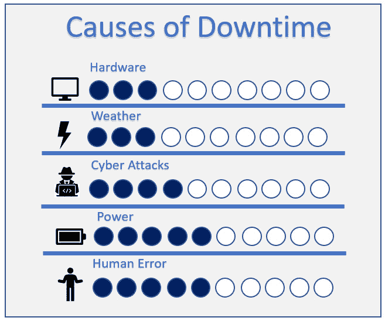

图 2.19 – 常见的停机原因

但如果 BCP 失败了会怎样呢？比如，假如电力发生故障怎么办？如果备用站点无法访问怎么办？那将是灾难性的，你需要对此做好准备。你可以通过拥有**灾难恢复计划**（**DRP**）来做到这一点。

# 实施一流的 DRP

你对 DRP 和 BCP 的范围感到困惑吗？别担心，因为这很常见。事实上，快速搜索这个话题会发现，甚至连作者们对于这两个术语的界限也没有统一意见；不过，让我尽量简单地解释清楚。

BCP 和 DRP 之间的区别如下：

+   DRP 可以被视为整个 BCP 的一个子集。

+   DRP 是关于在灾难发生时恢复关键服务器（反应性）。

+   BCP 是为了防止业务停机（主动性）。

+   BCP 与业务相关（流程），而 DRP 更与 IT 相关（系统和数据）。

+   BCP 可以在正常运营期间应用，以防止中断，而 DRP 只有在发生灾难时才会执行。

现在我们已经了解了这两者的区别，接下来让我们继续学习如何创建一个高效的 DRP。

## 创建 DRP

下面是制定 DRP 时必须包括的内容概述：

+   **范围**：在这里，你必须定义 DRP 的范围。通常，公司会创建一个整体的 DRP，但有时你会发现创建分段式 DRP 是有益的；例如，一个针对系统，一个针对网络，另一个针对数据。

+   **假设**：识别与此 DRP 相关的所有假设。一个常见的假设示例是，某些事项已经包含在 BCP 中（如备份、冗余和故障转移）。

+   **启动标准**：确定哪些触发因素表明一个事件是灾难。例如，如果发生停电，且缓解策略（如备用发电机）无法正常工作。

+   **场景和应对策略**：在这里，你需要包括一组可以视为灾难的场景，并概述如何通过缓解措施来恢复业务运营。例如，本地服务器宕机，而云上的备用服务器不可访问。

    创新思维！事实上，考虑一些不寻常的场景，比如大流行或战争（即使它们可能永远不会发生），比不考虑这些情况并受到影响要好。在下图中，你可以查看一些灾难的例子来源：

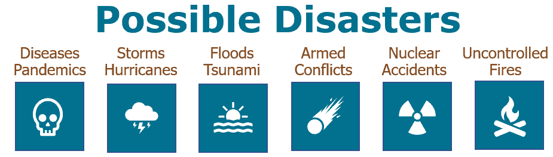

图 2.20 – 灾难可能的触发因素

+   **灾难恢复需求**：发生灾难时需要哪些资源？例如，这可能包括技术需求、操作需求、沟通需求、备份需求、冗余需求、文档需求、法规需求以及客户需求。

+   **灾难恢复程序**：如果发生灾难，应该遵循哪些程序？例如，可能包括沟通管理、远程访问程序、访问控制（包括物理和逻辑访问）等。

+   **角色与职责**：如果发生灾难，谁负责或负责任务（即谁负责网络？谁负责服务器？谁负责 VoIP？）。

## 实施灾难恢复计划（DRP）

如果你不知道如何实施 DRP，它是没有用的。那么，让我们来看看一些实施 DRP 时的最佳实践：

+   确保你有多个供应商（包括一些合同或协议），以便在灾难发生时需要服务时能得到支持。例如，确保你有协议（以及设备），以便在备用供应商宕机时从其他 ISP 获得服务。正如我奶奶所说，*"不要把所有的鸡蛋放在同一个篮子里。"*

+   定期审查与备份供应商的合同和协议，因为他们的服务可能会随着时间发生变化，你可能无法得到所需的服务。

+   确保你有**恢复顺序**，以便根据业务影响（RTO）确定首先恢复哪些系统。

+   记住，恢复站点的成本会根据服务类型（例如热站点、温站点或冷站点）而有所不同，因此请确保合理分配它们以降低成本（您不想在热站点上托管测试服务器）。

+   分析您的供应商的供应商。我记得有一次，DRP 中提到如果次要 ISP 发生故障，就切换到 ISP X。我们在测试中发现，ISP X 将服务外包给了我们的次要 ISP。这意味着次要 ISP 的基础设施出现问题时，也会影响到 ISP X，使得我们的 DRP 失效。

+   执行定期的 DRP 测试，以验证其有效性。

+   执行压力测试，以验证所采取的行动是否能够支持所需的人数或服务。例如，在测试过程中，您可能会检查能否连接到次要服务器，但该服务器是否能提供所需的性能水平？它能接受您恢复业务所需的连接数量吗？

+   执行安全测试，以确保提出的 DRP 能够达到最低可接受的安全水平。

+   如果您有多个地点，请从所有地点测试访问次要服务器/系统的能力（您需要确保您的员工即使在哥斯达黎加的海滩上工作，也能访问次要系统/服务器）。

+   测试次要系统（在 DRP 中提出的）的*耐用性*，并在不同季节和长时间段内进行测试。例如，您可能会测试卫星互联网连接，在晴天时可能工作正常，但在阴天或暴风雨时可能无法提供所需的服务水平。

+   在发布 DRP 之前，获取必要的批准（来自 CEO、CTO 和 CFO）。CTO 的批准至关重要，以确保他们同意技术决策，CEO 的批准至关重要，以确保 DRP 有效地覆盖业务，CFO 的批准确保您有足够的预算来实施和执行该计划。

# 总结

在这一章中，我们涵盖了许多非常有趣且重要的话题，这些内容可以应用到您的防御策略中。

首先，我们学习了如何创建漏洞评估，包括最常见漏洞类型的概述，以帮助您创建最佳评估。然后，我们扩展到了网络防御的核心方面之一：风险管理。在这里，我们学习了如何管理网络安全风险，并且还研究了网络安全领域最著名的框架之一：NIST 网络安全框架。

此外，正如在上一章中所讨论的，*可用性*是网络安全中的核心原则之一。因此，为了避免停机，我们学习了如何创建 BCP，其中深入探讨了其最重要的组件：BIA 和 DRP。

我们还学习了一个最常见且最危险的漏洞背后的细节，那就是著名（或臭名昭著）的 USB HID 漏洞。在这里，我们了解了利用这一漏洞的最常见攻击途径，以及我们可以用来防止此类攻击的工具和技术。

在下一章节，我们将进一步扩展这一内容，展示与网络安全中最薄弱环节——用户相关的所有漏洞，以及你可以利用的所有机制、工具和技术来*修补用户漏洞*。

# 进一步阅读

+   这是**国家标准与技术研究院**（NIST）的官方网站，你可以在这里查看 NIST 网络安全框架的最新版本：[`www.nist.gov/cyberframework`](https://www.nist.gov/cyberframework)。

+   在这里，你可以看到最新最强大的网络安全工具和小工具，帮助你进行漏洞评估：[`hak5.org/`](https://hak5.org/)。

+   一些网站展示了脆弱的 USB 加密狗，但大多数网站只展示了来自同一品牌的设备。在这种情况下，维基百科有最好的脆弱 USB 加密狗汇总，包括多个品牌：[`en.wikipedia.org/wiki/Logitech_Unifying_receiver`](https://en.wikipedia.org/wiki/Logitech_Unifying_receiver)。

+   如果你想查看另一种风险管理方法，我建议你查看英国政府的《橙皮书》：[`www.gov.uk/government/publications/orange-book`](https://www.gov.uk/government/publications/orange-book)。

+   这是曼彻斯特市政府提供的一个非常好的 BIA 模板：[`www.manchester.gov.uk/downloads/download/5700/mbcf_business_impact_analysis_template`](https://www.manchester.gov.uk/downloads/download/5700/mbcf_business_impact_analysis_template)。

+   这是曼彻斯特市政府提供的一份详细的 BCP 模板：[`www.manchester.gov.uk/downloads/download/5701/mbcf_business_continuity_plan_template`](https://www.manchester.gov.uk/downloads/download/5701/mbcf_business_continuity_plan_template)。

+   这是一个非常有趣的 BCP 模板，专门为小型企业设计：[`www.manchester.gov.uk/downloads/download/5792/business_continuity_guidance_to_support_small_businesses`](https://www.manchester.gov.uk/downloads/download/5792/business_continuity_guidance_to_support_small_businesses)。

+   你想创建自己的 USB HID 漏洞防护解决方案吗？如果是，那么我建议你查阅这份文档，以深入了解 USB 协议（包括描述符、类和更多内容）：[`www.ftdichip.com/Support/Documents/TechnicalNotes/TN_113_Simplified%20Description%20of%20USB%20Device%20Enumeration.pdf`](https://www.ftdichip.com/Support/Documents/TechnicalNotes/TN_113_Simplified%20Description%20of%20USB%20Device%20Enumeration.pdf)。
