# 第三章：*第三章*：理解政策、程序、合规性和审计

*"所有行业都面临着需要拥有网络安全领域专家的迫切需求；而当前的现实已经表明市场上这种人才的缺口。这意味着我们有机会在这个领域进行专业化，并帮助各行业减轻当前和未来的网络安全相关风险。"*

*– Joel González Saldivar – 人力资源和技能发展专家，墨西哥*

政策、程序、合规性和审计是对技术专家来说可能听起来很枯燥的话题。然而，在网络安全领域，它们至关重要。

事实上，政策和程序是所有组织网络安全战略和态势的支柱，而合规性和审计是确保它们得到遵守的最佳机制；因此，这些是所有网络安全专业人员必须解决的重要话题。

你还需要一个工具来衡量你的网络安全水平，因为这将帮助你了解当前的状况、目标以及达成目标的路径。帮助你实现这一目标的最佳工具是**网络安全成熟度模型**（**CMM**）。

本章将涵盖以下内容：

+   理解网络安全政策和程序的价值和重要性

+   实施**创建、更新、分发、推广、执行**（**CUDSE**）方法来创建和管理网络安全政策和程序

+   理解合规性的重要性以及如何确保始终保持一致

+   了解不同类型的审计以及如何有效地管理它们。

+   优秀 CMM 的好处、特点和结构

+   最佳 CMM 概览：**企业网络安全成熟度模型**（**ECM2**）

# 创建世界级的网络安全政策和程序

当我们从事网络安全工作时，通常会考虑它的技术方面：如何保护我们的网络、如何开发更好的代码、如何提升韧性等等。然而，还有一层非常重要的支持它们的基础，它是企业级安全的支柱：**网络安全政策和程序**。

然而，创建这些并非易事，而且大多数人并未接受过这方面的训练。实际上，作为 IT 专业人员，我们习惯于按照教程或步骤来安装新系统或服务器，但并没有类似的教程来创建网络安全政策和程序。

因此，为了让这项任务尽可能简单，我将向你展示**CUDSE 方法**（[www.cudse.com](http://www.cudse.com)），该方法已被全球多家公司成功使用，作为创建一流网络安全政策和程序的指导方针。

## 网络安全政策

防御性安全的主要目标是确保你的数据和系统安全（可用、保密和完整）。

为此，我们实施*系统*（例如**入侵防御系统**（**IPS**）和**入侵检测系统**（**IDS**））、*策略*（例如**深度防御**（**DiD**）策略）以及*计划*（例如**业务连续性计划**（**BCP**）和**灾难恢复计划**（**DRP**））；然而，你还需要创建将管理你基础设施周围所有因素的*规则*。

这些规则可以与系统相关（例如访问政策）、与用户相关（例如密码政策）或与数据相关（例如隐私政策）。

重要的是要记住，*所有的政策*都必须为每个公司量身定制。实际上，有些情况下，公司可能会根据地理位置有不同的政策，这些政策通常由文化、当地法律、法规和市场驱动。

然而，有些政策几乎是*标准的*，并且在大多数组织中都有出现。以下图例展示了一些这样的例子：

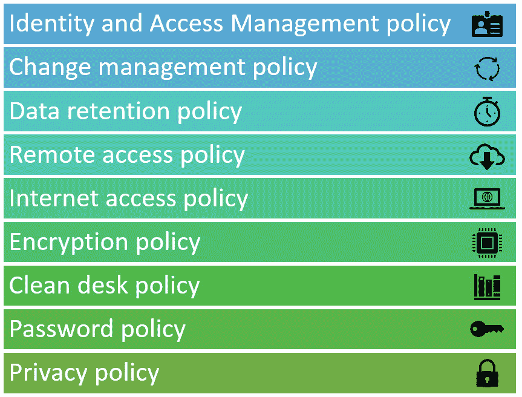

图 3.1 – 政策与程序的关系

提示

如果你需要帮助开始创建你的政策，可以从互联网上下载模板并将其作为指南；例如，以下是**系统管理员、审计、网络和安全**（**SANS**）研究所提供的一个良好资源库：[`www.sans.org/information-security-policy/`](https://www.sans.org/information-security-policy/)。然而，正如前面提到的，你需要确保创建符合你所在组织、文化和当地法规的政策。

## 网络安全程序

程序是逐步指导用户如何实现确保遵守特定政策的结果的指令。

通常，策略包含（或引用）多个旨在指导用户如何执行任务以遵守政策的程序。下图说明了政策与程序之间的关系：

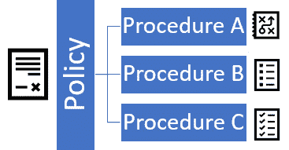

图 3.2 – 政策与程序的关系

例如，一个**身份与访问管理**（**IAM**）策略可能会引用以下程序：

+   如何从**Active Directory**（**AD**）中删除用户

+   如何删除禁用的 ID

+   如何归档访问日志

+   如何提升 UNIX 服务器上的权限

+   如何提升 Windows 服务器上的权限

+   用户通知程序

那些*隐形的*层通常被网络安全专业人员忽视；然而，投入时间、知识和资源，确保它们得到**创建**、**更新**、**分发**、**传播**和**执行**，是至关重要的。

## CUDSE 方法

网络安全中的一个常见错误是缺乏关于如何制定政策和程序的明确指南。

这可能是因为我们不喜欢处理非技术性事务（似乎很无聊），因为似乎没有人关心政策或程序，或者仅仅因为这是一个被遗忘的话题，几乎没有哪本网络安全书籍提到它。

因此，为了填补这个空白，我设计了**CUDSE 方法**（[www.cudse.com](http://www.cudse.com)），它涵盖了你在创建网络安全政策和程序时需要考虑的所有重要方面。现在，让我们来看看这个方法。

### 创建

首先，你需要确保创建有意义的政策，这些政策对你和你的组织都有意义，为了实现这一点，你需要遵循以下简单规则：

+   **易于理解**：人们讨厌阅读政策的原因是它们似乎是为了让人觉得枯燥复杂而写的。因此，相反，应该用简单的语言写出来，使其更吸引读者。*简洁明了，简短易懂*。如以下表格所示，一项不好的政策是复杂的，使用了很多技术术语（这些术语对大多数用户来说既不相关又让人困惑），没有提供如何遵守的清晰指南，并且提到了一个未知的资源（没有提供链接）。另一方面，一项好的政策是清晰的，简洁地说明了它解决的问题，并提供了一个明确的方式来解决问题并遵守政策：

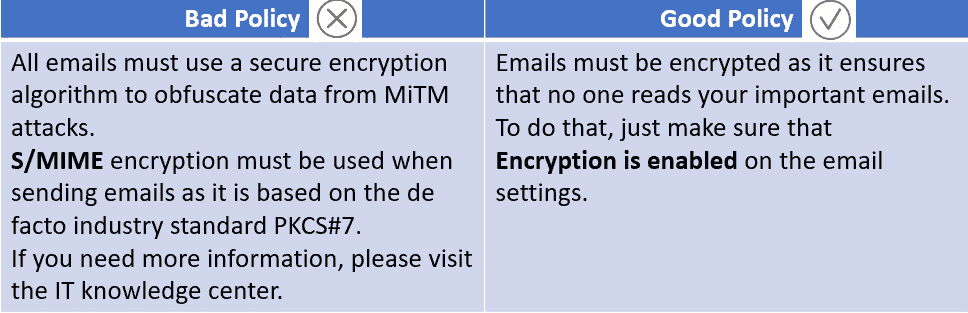

图 3.3 – 好政策和坏政策的例子

+   **易于实施**：确保你所写的政策可以实施和执行，否则你就是在浪费时间。一个好的建议是与你的**人力资源**(**HR**)部门密切合作，确保所有政策都能被执行，并且没有与地方性法规、法律或权利发生冲突。

+   **集成**：正如你所知，技术需要集成以弥合任何可能的漏洞，政策也不例外。它们需要智能地集成，以确保没有漏洞可以绕过它们。例如，如下图所示，你可能有多个政策，它们一起构成了你防御性安全的基础：

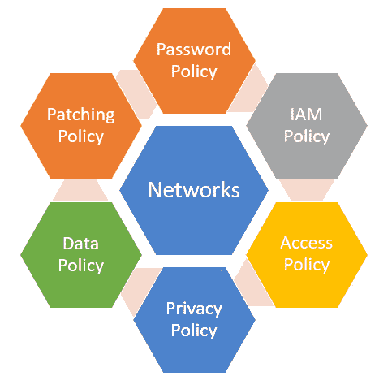

图 3.4 – 政策集成

+   **包容和合作**：记住，你不是孤军作战。事实上，如果你一个人坐在办公桌前编写所有政策，那你将犯一个严重的错误。相反，应该与公司内的各个部门或领域共同制定这些指南。这将帮助你制定更好的政策，并获得相关人员的支持。如前所述，人力资源部门是你在这一努力中的最大盟友之一。

+   **使用傻瓜式的例子**：使用人们容易理解和关联的例子，来阐明你要表达的观点。一个好的方法是使用*做与不做表格*，如下所示：

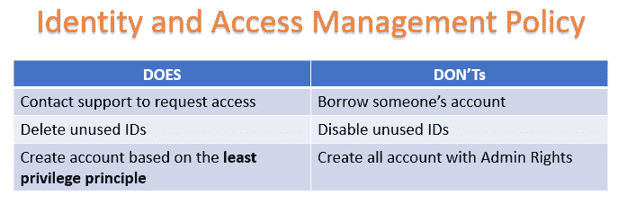

图 3.5 – 防呆政策示例

+   **获取批准**：找出在下一步之前，哪些人需要审查和批准这些政策。通常，人力资源或法务部门可以帮助你识别需要审查和批准你这些“酷”政策的个人、团队或小组。

### 更新

就像你保持服务器的更新（以防范新的威胁）一样，你也必须做到这一点，确保政策的更新。

但这更具挑战性，因为*这不仅仅是添加一个检查项，确保你的政策每天更新*；相反，你需要确定一个时间点，对每一项政策进行审查和分析，以确保它们在当前威胁环境下仍然具有相关性（通常，年度审查是可以接受的）。

然而，有些事件可能会触发政策的提前审查，具体如下：

+   对公司政策的修改

+   收购新公司

+   新的法律和规定

+   在新地区开设业务/办公室

    小贴士

    确保所有对政策和程序的更新和修订都在文档的版本历史中得到了妥善追踪。

### 分发

一个常见的错误是，政策一旦创建并分发后，就被遗弃在一个几乎*无人知晓*的位置。我曾见过这样的情况，连**首席信息安全官**（**CISO**）都不知道这些政策的具体位置，因此，确保以有序的方式将网络安全政策分发给所有员工是非常重要的。

正如律师和网络安全专家罗伯托·莱梅特所确认的，"*如果没有证明政策已正确共享或分发，就无法执行违反政策的处罚或制裁*"。

因此，这不仅仅是分发问题，还包括确保员工确认已收到政策。

小贴士

在线勾选一个复选框是获取用户确认的一种非常简单且在法律上可执行的方式。但是，始终与法务部门核实，以确保遵守公司政策以及当地的法规和法律。

现在，你需要制定一个分发策略，这可以像定义何时需要分发（或重新分发）政策那样简单。以下是一些示例场景：

+   在政策创建或更新时

+   在新员工入职时

+   作为年度必修培训的一部分

+   当某人变更当前角色时

### 社交化

一些公司仅仅将政策分发出去，并没有进一步的后续活动。然而，*这远远不够*！

要成功，你需要确保这些政策及其相关程序成为组织文化的一部分。

*这并不容易实现，但一旦政策成为组织文化的一部分，大家就会自然而然地支持和执行这些政策*。

此外，这也将帮助您确保新员工遵守政策或更快地接受政策。例如，如果*每个人*即使只是短暂离开，也锁定计算机，那么新员工即使没有阅读政策，也会自然而然地这样做。

提示

正如您可能已经猜到的那样，将网络安全政策作为组织文化的一部分，将使您能够显著降低政策培训和教育的未来成本。

这里有一些提示可以帮助您完成这一步骤：

+   开展持续的教育宣传活动，包括培训、传单、电子邮件等。

+   识别影响力者并指定他们为某项政策的倡导者（以帮助推广合规性）。

+   获得高层管理的支持，并请求他们支持传达网络安全政策的重要性。

+   获得人力资源的支持并请求他们支持传达不遵守网络安全政策的后果。

### 强制执行

作为政策的所有者，您必须确定*谁*负责确保政策的执行，并负责在违规情况下施加制裁。

在大多数情况下，您将是唯一能够访问和了解可能检测到任何违反此类政策的工具的人，因此您必须定义一个程序，说明您将如何处理这些互动（通常与高层管理、人力资源和法务部门）。

另一种强制执行的方法是利用一些技术工具——例如，您可以在 Active Directory 上强制执行密码策略，在电子邮件上强制进行加密等。

另一种——不太技术化的方式是更新公司模板，以确保用户不会忘记填写一些强制性字段——例如，在所有公司模板中包含脚注，以确保*数据分类*得到正确标记（公开、私密、机密和受限）。

# 理解和实现合规性

公司可能需要遵守多种法律和法规，以规定数据的存储、管理和处理方式。与其他法律一样，未能遵守可能导致罚款或其他法律后果，可能最终导致企业关闭，因此这些问题需要非常认真对待。

## 法规类型

在我们看如何实现合规性之前，让我们看看基于来源的法规类型。

### 国家法规

这些是政府制定的法律和法规，用于规范私营公司如何存储、管理和处理数据。

这些法规可能会很棘手，因为它们可能保护公司所在国家的个人，而不考虑公司的位置，因此您还需要了解与用户或客户地理位置相关的法规。

### 区域法规

这些法规与国家法规非常相似，但它们适用于多个国家。这些国家通常通过某些国际合作条约联系在一起，如由**欧盟**（**EU**）制定的**通用数据保护条例**（**GDPR**）。

#### GDPR

一个著名的地区性法规例子是 GDPR，其标志如图所示：

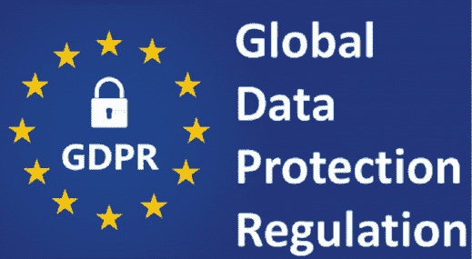

](img/Figure_3.6_B16290.jpg)

图 3.6 – 代表 GDPR 标志的欧盟旗帜

这是欧盟关于数据保护和隐私的法规，主要目的是让个人掌控自己的数据，以及公司如何处理这些数据。

这一法规很复杂，因为它也适用于那些管理欧盟公民数据的欧盟以外的公司。

尽管关于遵守这一法规所需成本有很多批评，部分专家将其视为一种法律机制，旨在鼓励公司提高网络安全水平并防止个人信息滥用。

另一个遵守的好理由是与之相关的天文数字罚款。以英国航空公司为例，由于不当的安全措施导致大量客户信息泄露，他们不得不支付超过 2 亿 **美元**（**USD**）的罚款。

提示

在某些情况下，地区性或国际性法规优于地方性法规，因此建议与法律部门合作，仔细分析这些法规。

### 市场/行业法规

一些与特定市场或行业相关的法规是非常严格的，并且可能适用于供应商和供应商。因此，了解你的业务以确保遵守这些规定是至关重要的。

如果你的公司处于服务行业，遵守这些法规可能是一个不错的策略，因为这是吸引顶级客户的好方法。

这里列出了这些法规的一些示例：

+   **1996 年健康保险流通与责任法案**（**HIPAA**）

+   **萨班斯-奥克斯利法案**（**SOX**）2002 年版

+   **支付卡行业数据安全标准**（**PCI DSS**）

### 客户法规

一些客户可能要求他们的服务提供商遵守一套法规，才能与其做生意。大多数情况下，这些法规是之前提到的法规（国家、地区或市场）的子集，公司通过这些法规确保其提供商在环境中具有一定的安全性。因此，虽然你的组织可能没有法律义务遵守这些法规，但为了与这些客户保持业务关系，仍然必须遵守。

### 内部法规

大型国际公司可能会有自己的网络安全法规，旨在保持各个部门和地区的一定安全水平。

这些法规与公司政策非常相似，但大型企业更倾向于使用术语*法规*，特别是在它们在不同国家有大规模运营的情况下。这个术语在特许经营中也广泛使用，以确保每个特许经营者与其内部的网络安全法规保持一致。

提示

创建一个矩阵，列出适用于您基础设施的法规，以确保*随时将其放在您的视线中*，并确保在制定安全策略和政策时考虑到它们（参见*图 3.5*的示例）。

## 达到合规性

正如前文所述，实现合规性是一项非常复杂的任务，可能需要大量的时间和资源投入。然而，您可以提供一些明确的激励措施，以便向高级管理层提供理由，证明在合规性方面的投资是合理的，如下图所示：

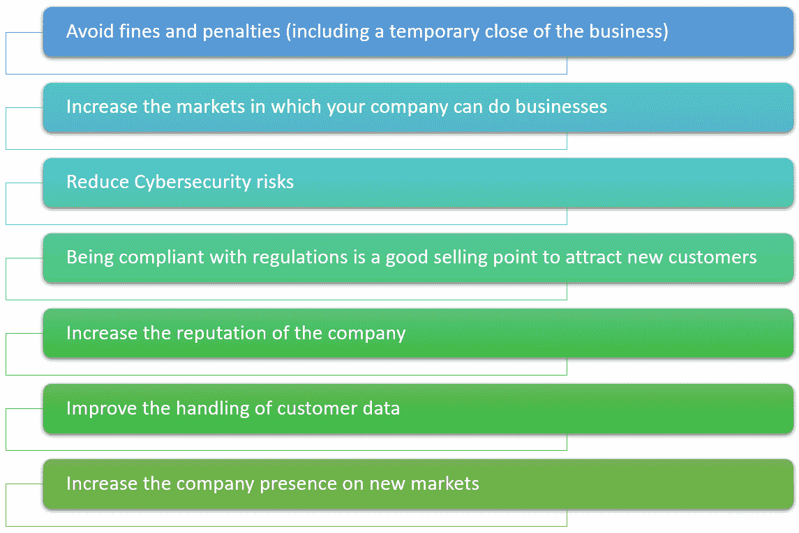

图 3.7 – 达到外部法规合规性的好处

这些要点应该足够强大，以确保高层管理层的*支持*（实际上，只需第一个要点就足够了）。现在，让我们专注于一些您可以应用以达到大多数法规合规性的良好实践。

### 制定计划

坦率地说，合规性是一项非常复杂的任务，因此在这种情况下，处理这种痛苦的最佳方式是花一些时间进行*规划*。请记住，合规性有二元结果——您要么合规，要么不合规；正如我爷爷过去常说的：*如果你必须做，那你最好做对！*

现在，不要把规划看作是浪费时间的行为，而是把它视为确保您有清晰路径以达到所需合规水平的工具。

为了尽可能简单化，我在这里总结了您需要包含以创建一个优秀*合规性计划*的项目：

+   **标题**：将由此计划涵盖的法规名称。

+   **利益相关者**：与此法规相关的人员姓名，例如人力资源经理、法律顾问、**首席财务官**（**CFO**）等。

+   **法规详细信息**：符合该法规所需的详细要求清单，例如加密要求、数据处理要求等。

+   **处罚和制裁**：在这里，您需要列出与每项法规相关的所有处罚和制裁。此外，请记住，这主要是一个法律问题，因此您*必须*与您的法律部门合作，以正确创建计划的此部分。

+   **范围**：法规的行动范围。这可以通过地理位置、行业等来定义。

+   **影响**：将受到此法规影响的系统、服务器、服务、数据和任何其他 IT 组件的详细清单。同时，请确保包括所有者的姓名，以便随时掌握。

+   **相关日期**：在这里，你需要添加两组不同的日期——首先是关于法规生效日期的日期，其次是你计划遵守这些法规的日期。

    一计划还是两计划？

    通常，你会为合规创建一个单一计划，但如果你在一家大型组织工作，或者公司需要遵守过多的法规，那么制定多个计划可能是个好主意。一种好的选择是根据之前解释的法规类型将其分组，并为每个组创建一个计划。

### 创建合规团队

如我在本书中已经提到的，*一个优秀的网络安全专业人士不是做所有事情的人，而是知道如何完成任务的人*。

因此，你需要学会与其他专业人士合作，以实现你的目标。

一个好的做法是建立支持团队——在这种情况下——建立一个合规团队，帮助你更快、更好地推动事情的发展。

现在，这不仅仅是随便询问谁愿意加入团队；更重要的是选择一些对该法规有兴趣的人员。例如，电子商务（销售）部门可能是**支付卡行业**（**PCI**）认证的理想利益相关者，而人力资源、法律和医疗部门则是符合 HIPAA 的理想利益相关者。

### 利用现有的信息

你可以利用企业信息——如**业务影响分析**（**BIA**）或风险评估——来确定当前可以用来遵守特定法规的努力。

如我们在*第二章*中提到的，*管理威胁、漏洞和风险*，风险评估是一个迭代过程，这一审查可能会导致对先前指定的风险应对措施进行更改——例如，一个公司决定*接受*的*风险*，在处理合规性时，可能需要进行*修复*，因为接受该风险不是一个合适的应对措施。

### 审查当前的控制措施

*记住——我们需要更聪明地工作，而不是更辛苦地工作*，而变得更聪明的一种方式是利用当前的系统和控制措施来实现新的目标。

对当前的控制措施进行清单盘点，并将其与法规进行关联，确定哪些控制措施可以用于遵守该法规。

你会发现，很多时候，你只需要对当前的系统进行一些调整，就能与法规对齐。

### 将合规要求与网络安全政策对齐

并非所有法规都可以通过系统来解决，因为有许多法规与用户有关，在这些情况下，你需要的是政策。

*然而，如前所述，你希望保持政策的简洁，因此尽量利用现有的网络安全政策，而不是制定新的政策。*

我知道在某些情况下，您可能需要创建新的政策，但这仅会在您确认当前政策不适用时发生。

一个好的解决方案是创建一个政策矩阵，如下表所示，您可以在其中将现有的政策与适用的法规进行比对：

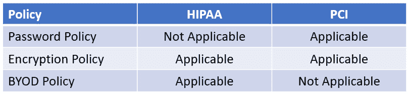

图 3.8 – 网络安全政策矩阵

这样的矩阵将帮助您轻松识别需要根据法规变动做出的政策调整，或者确认如果更新政策不会对合规性产生影响。

### 建立验证合规性的机制

到目前为止，我们已经开发了一个框架，以确保您符合任何给定的规定，但*这不是一次性的工作*。合规性是需要持续维护的，因此您需要建立机制，确保自己不仅现在合规，而且未来也能保持合规。

用于测试和验证合规性的机制被称为**审计**。

# 探索、创建和管理审计

到目前为止，我们已经审查了*政策*、*规定*等概念，还有一个非常棒的防御安全策略：*深度防御*；然而，所有这些政策、系统、策略和控制措施都需要经过测试，以确保它们能够提供所需的结果，并且已经得到实施和遵循。

简单来说，*审计是一个测试一组政策、规定或要求合规性水平的过程*。

审计可以是内部的或外部的，接下来我们快速看一下两者的区别。

## 内部网络安全审计

通常，这些审计是由组织设计的，目的是确保其系统、用户和数据符合一系列政策和规定。

大型企业可能会进行公司范围的审计，将*数据安全*纳入审计内容。

在大多数情况下，企业审计员直接向 C 级管理层报告，以确保其结果*尽可能客观*。

由于这些审计的可见性，建议您对自己的系统进行内部（部门级）网络安全审计，以确保您的环境是**审计准备就绪**的。

如下图所示，您可能会有部门级的审计（Wintel 团队；UNIX 团队；IAM 团队），然后是组织级的审计（网络；开发；支持），覆盖这两者将确保您的 IT 部门保持在**审计准备就绪**状态：

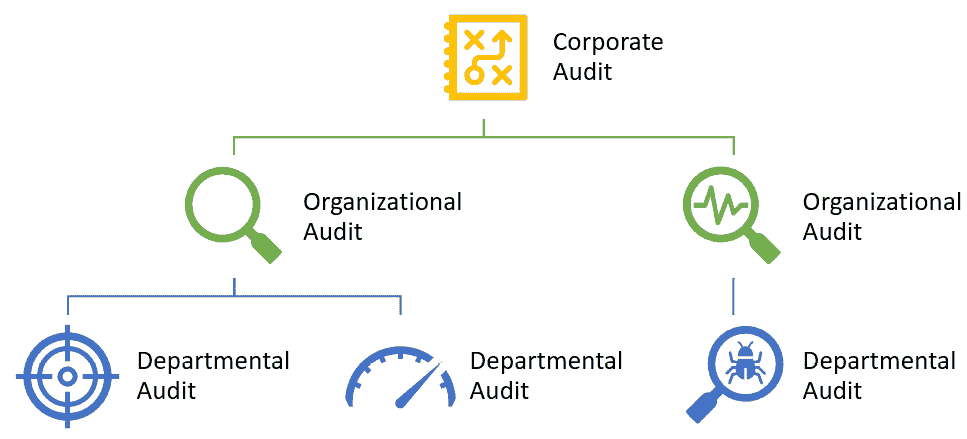

图 3.9 – 内部审计结构

如果您的公司没有进行审计，那么*您必须创建自己的安全审计*，因为这是确保您的政策和控制措施到位并得到遵循的最佳机制之一。

## 外部网络安全审计

在许多情况下，公司需要由第三方进行审计，以验证其是否符合某项法律或规定。

也有一些情况，企业可能希望第三方验证网络安全政策是否得到遵循。

提示

你必须确保进行审计的公司不是为你提供某些网络安全服务的公司，因为这样可能会造成利益冲突，并影响审计结果的中立性和客观性。

在某些情况下，第三方会提前宣布审计时间，以便你有时间准备所需的证据（如日志、报告等），但在其他情况下，审计员可能会突然出现，直接检查合规性，要求访问服务器，验证物理访问权限等。

通常，审计结果（称为*发现*）会提供给 C 级管理层，然后层层下发给你，这突显了始终保持环境*随时可审计*的重要性。

审计员

关于网络安全审计员是否应该是网络安全专家，存在很大的争论。然而，这取决于审计的目标。

如果**首席执行官**（**CEO**）希望基于检查清单进行基本的政策审计，那么我认为没有必要聘请网络安全专业人员。另一方面，如果审计的目标是对组织的数据安全级别进行实际测试，那么我认为网络安全专业人员是*必须的*。

既然我们已经看过了两种审计类型（内部审计和外部审计），接下来我们来看一下在审计过程中，系统和数据需要如何管理的最佳实践。

## 审计期间的数据管理

你需要特别注意在审计过程中如何管理数据和系统。

通常建议将基础设施的任何变更—*暂停* *进行*—以避免在审计期间产生影响。此外，在审计过程中有一些特定事项需要考虑，这些事项根据你是审计员还是被审计者（即系统所有者）而有所不同。

### 作为被审计者

在这种情况下，你将负责提供审计员所需的所有数据和访问权限。

然而，给第三方（甚至是外部人员）提供这种级别的访问权限是非常危险的，因此我整理了以下提示，可能有助于你降低风险：

1.  *始终*在有人接触你的系统和数据之前进行备份。这非常重要，因为它可以让你在审计过程中如果数据意外损坏（或修改/删除）时迅速恢复。

1.  在授予审计员访问权限时，请使用**最小权限原则**（**PoLP**）。

1.  *避免*为审计目的提供外部访问权限。相反，要求审计员现场进行审计以减少风险。

1.  确保遵守*数据保留政策*，以确保所有必要的日志在审计期间都可以提供。

此外，确保你与人力资源和法律部门确认，确保外部审计员签署所有必要的文档，以减少数据外泄的风险（例如签署**保密协议**（**NDA**）、保密条款等）。

### 作为审计员

审计员有着巨大的责任，因为他们发现的结果可能会带来法律、经济或职业上的后果。因此，作为审计员，你不仅要遵守高标准的道德规范，还要遵循技术标准，以确保所收集的数据没有被篡改。以下是最佳实践：

1.  在收集证据时遵循最佳实践。一个好的例子是*在提取文件前先对文件进行哈希处理*。这样，你可以证明你所拥有的数据没有被篡改。

1.  如果你预见到任何*利益冲突*——例如，与正在审计的公司 CISO 有家庭关系——那么在开始前要提出，避免审计结果受到质疑。

1.  有时，你可能会发现一些错误，通过简单地勾选复选框就能解决，但作为审计员，你的工作是报告而不是修复，所以*不要掉入应用快速修复的诱惑*。

1.  记住，你的访问可能会受到监控，因此*不要滥用你的访问权限*。即使是访问那些在审计中并非严格必要的文件夹或文件，也可能导致你和公司面临罚款或法律诉讼，因此请记住：*能力越大，责任越大*。

一些公司使用*通用*审计员来执行所有类型的审计（包括安全审计）。然而，没有基本网络安全知识的审计员可能会*忽视*某些情况，或者容易被欺骗，因此最佳实践是*网络安全审计必须由至少具备基本网络安全知识的审计员进行*。

## 网络安全审计类型

你可以审计几乎任何内容；然而，这并不意味着你要在审计上浪费时间和资源，接下来是网络安全领域中最常见的审计类型列表。

### 系统审计

这些审计通常旨在测试你的服务器在网络安全政策下的合规性水平。大多数时候，这些审计是按操作系统分段进行的，因此你可能会有针对 Wintel、UNIX、Red Hat 等系统的审计。

根据审计范围，这也可能包括以下内容：IAM（身份和访问管理）、密码和数据保留。

### 政策审计

这通常是一次广泛的审计，旨在测试公司所有网络安全政策的合规性水平。

### IAM 审计

这次审计的目的是确保所有 IAM 流程都与给定的政策或规定保持一致。这可能包括用户的创建、禁用用户、删除用户等。

### 数据处理审计

这是最复杂的审计之一，因为数据可以与多个因素相关，这些因素可能影响与之相关的法规或政策——例如，数据所有者、数据位置、数据分类、数据用途等等。

国际法规如 HIPAA、PCI 和 GDPR 高度关注数据审计。

### 网络审计

这通常与渗透测试（pentesting）相关，因为它旨在测试网络的合规性水平，许多时候，您需要进行渗透测试来成功审计网络的合规性水平。

为此目的最常用的工具是**Nmap**和**Wireshark**（这两个工具将在*第八章*，*提升您的网络防御技能*中介绍）。其他工具—如**Nessus**、**开放漏洞评估系统**（**OpenVAS**）、**Acunetix**、**SolarWinds**和**ManageEngine**—也常用于这些类型的审计。

以下截图显示了 Nessus 界面：

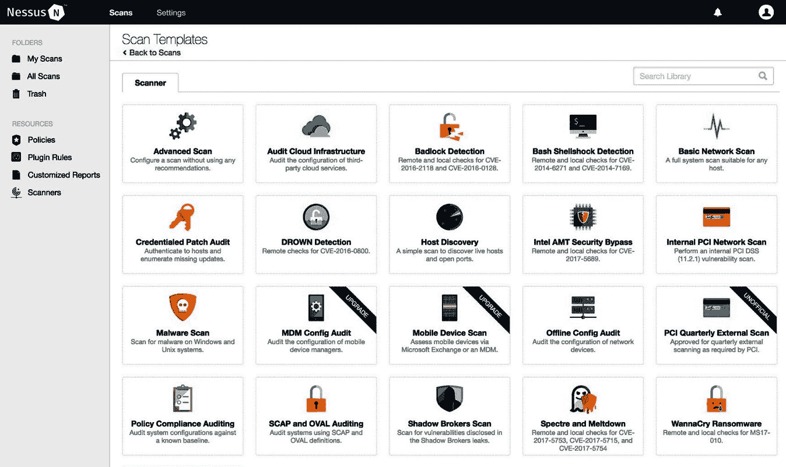

图 3.10 – Nessus 界面

此外，这些工具还可以作为一种低成本、方便的解决方案，用于测试我们的基础设施是否存在特定威胁或漏洞，如**Spectre Meltdown**，或确定我们是否符合某个特定标准，如 PCI DDS。

### 物理访问审计

该审计是关于测试所有与物理访问相关的机制和控制，这不仅仅是关于服务器房间的物理访问，而是控制和限制进入公司大楼的所有系统。

实际上，*物理安全*（我们将在*第九章*，*深入探讨物理安全*中深入讨论）必须是防御策略的核心，因为相关的风险（例如，在*第二章*中审查的**通用串行总线**（**USB**）漏洞，*管理威胁、漏洞与风险*）可能对公司造成灾难性的影响。

此外，入侵者可能会接触到最脆弱的资产——*用户*，并可能通过与他们交谈获取有价值的信息（我们将在*第四章*，*修补第 8 层*中详细了解这种社交工程攻击）。

注

社交网络的最大黑客攻击之一是针对 Twitter 的攻击，攻击者利用社交工程技术对 Twitter 的一些员工进行攻击，成功侵入了排名前 100 的账户（拥有超过 200 万粉丝的影响者）。

### 代码审计

这些审计可以集中于多个因素，例如：

+   漏洞识别

+   审计代码的功能性

+   审计代码的安全性（确保应用了最佳实践）

+   遵循给定的开发框架（如**软件开发生命周期**（**SDLC**）和**敏捷**开发）

+   一般最佳实践（如注释和缩进）

+   版本管理

+   安全代码库和部署规则

有一种常见的误解认为这些审计是*专门应用于软件开发公司*的；然而，如果公司修改了他们的某些应用程序，那么代码审计仍然适用。

### 密码合规性审计

大多数现代系统都具有确保用户密码符合公司政策的工具；然而，一些遗留系统缺乏这种功能，因此可能允许用户选择不合规的密码。

另一个风险是，特权账户（如 root）可能能够*绕过*这些限制，并在其他用户账户上设置不合规的密码。

此外，设备使用默认密码的风险也存在（这在网络设备和**物联网**（**IoT**）设备中非常常见）。

因此，许多公司投资于至少每年一次的系统审查（包括服务器、网络设备、物联网设备等），以确保所有密码都符合当前的密码政策。

## 什么触发审计？

有几个因素可能会触发审计——例如，外部审计通常非常昂贵，因此只有在像 PCI 这样的法规要求下才会进行。

内部（公司）审计也很昂贵，因为需要投入大量资源，因此这些审计通常由高层管理人员根据预算安排。

现在，你可能会想：*是否有一种机制可以让我测试我的环境，既简单又快捷，而且还能让我知道自己在安全方面的现状，并且如何实现下一阶段的目标？*

是的——这叫做**网络安全成熟度模型**。

# 应用 CMM

CMM 的主要思想是为任何组织提供一个标准化机制，以执行自我评估其网络安全水平。

它们被全球许多组织使用和实施，从大型跨国公司到小型企业，每个组织都可以利用实施 CMM 所带来的所有优势。

## CMM 的目标

CMM 是一个很好的工具，可以让网络安全专家实现以下三个目标：

1.  通过使用标准化机制，确定给定公司网络安全的水平。

1.  根据公司目标（或规定），确定预期的网络安全水平（基于标准化机制）。

1.  从第 1 点到第 2 点的明确路径。

## 一个好的 CMM 的特征

一个好的 CMM 需要具备以下特点：

+   **易于实施**：我们不想要复杂的**国际标准化组织**（**ISO**）系统；我们需要一个可以自我解释并且易于遵循的系统，这样组织就可以利用自己的资源来实施它。

+   **全面的网络安全视角**：一个好的 CMM 不仅仅是评估服务器和网络，还应该评估所有可能影响整体网络安全态势的组件——例如，人力资源（公司是否有适当的纪律程序？）或供应商（控制项；**服务水平协议**（**SLA**）；处罚）。

+   **可定制**：您应该能够根据业务需求轻松调整它。这意味着您可以添加或删除部分，而不会影响评估的最终结果。

+   **可扩展**：一个好的 CMM 应该能够适用于小公司，也适用于大型跨国公司。

+   **可适应性强**：它应该能够适应任何行业、任何需求和任何地区。

+   **明确定义的等级**：CMM 必须在所有领域中具有相同的等级（评分），以确保结果是现实的，并且可以成功地作为基准使用。

有几种 CMM 可供选择——其中一些是专有的（仅供某些公司内部使用）；一些是私有的（需要先支付才能查看，我认为这不是一个好主意）；还有一些是公开的（这些是最好的，因为通常它们是开放的，并且会收到社区的反馈）。

## 好的 CMM 结构

一个好的 CMM 必须是模块化的，这样实施它的公司可以添加或删除部分而不影响最终结果——例如，并非所有公司都有开发人员，因此要求没有开发人员的公司填写这些部分仅仅为了完成模型是没有意义的。

### 领域和控制项

在实施 CMM 时，负责该工作的 IT 人员（假设是*分析师*）将评估多个被称为**控制项**的内容。

为了简化实施过程（包括结果分析），这些控制项应该与其他相关控制项进行逻辑分组。这些组称为**领域**。

如下表所示，一个好的 CMM 评估了其他对您的网络安全策略有直接影响的领域——例如，人力资源（HR）：

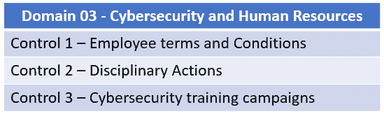

](img/Figure_3.11_B16290.jpg)

图 3.11 – ECM2 的领域和控制项

**ECM2**是模块化的，它包含 14 个领域的全面列表，您可以从中选择与您的组织相关的领域。

### 成熟度等级

现在，您已经按领域对控制项进行了排序，接下来是评估它们。评估应使用一个清晰定义每个级别的量表。最常见的评估量表有 3 级、5 级和+7 级量表。

3 级量表可能过于简化，提供的评分和改进空间非常有限，因此这不是最好的选择。

另一方面，+7 级量表可能过于复杂，难以评估、分析和报告，而且由于 CMM 的目标之一是易于实施，因此这也不是一个好的选择。

然而，5 级量表被认为是最好的标准，因为它可以让您准确地评估控制或领域，而不必进行不必要的复杂化。

下表展示了所有组件如何在 CMM 的评估页面上汇聚。这是基于企业网络安全成熟度模型（[www.ecm2.info](http://www.ecm2.info)），您可以看到使用此模型评估公司网络安全水平将是多么简单：

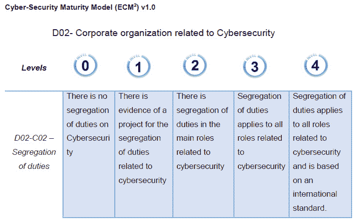

图 3.12 – 企业网络安全成熟度模型

在这里，您可以看到我们正在评估一个与**职责分离**相关的控制，该控制属于**与网络安全相关的公司组织**领域，您需要选择五个级别中*真正*代表您公司当前实际情况的那个。

## 结果分析

使用**ECM2**进行结果分析也是一项非常简单的任务。一旦您完成了对所有相关控制和领域的评估，您将获得三个不同的报告，如下所示：

+   **按控制**：当您希望在某一领域支持您的预算申请时，这非常有用——例如，缺乏 IAM 系统以及没有系统带来的风险。

+   **按领域**：这非常容易计算；基本上，领域的等级等于最低控制的级别。例如，如果您的网络安全政策非常好（4 级），但公司缺乏分发它们的计划（0 级），那么网络安全政策领域的整体评级就是 0。这样的结果在帮助您定义需要投资预算的薄弱区域时非常有用（与其让两个控制项处于 4 级，两个处于 1 级，不如让所有控制项都处于 2 级）。

+   **按公司**：这个结果通常用于向公司高层（C 级）报告整体网络安全水平。同样，这对于证明改善任何领域的预算申请特别有用。

下图展示了公司所展示的结果示例。请注意，您可以多么轻松地确定公司在**访问控制**和**网络安全**方面的重投资，同时也能看到一些其他关键组件需要关注，并应在下一个预算中优先考虑：

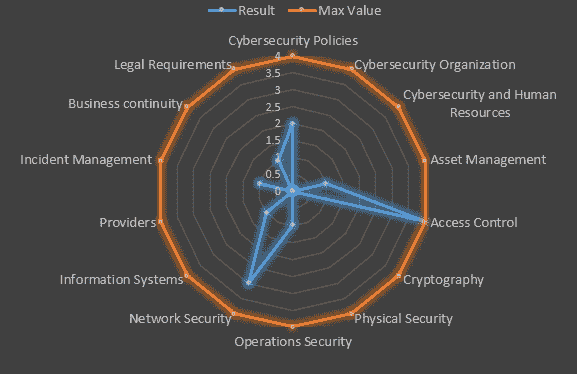

图 3.13 – ECM2 实施的图形结果

我知道你在想什么，*没错*：ECM2 的结果是您在请求网络安全预算时可以利用的一个好工具，也可以用来支持您的数字和未来投资。

## CMM 的优势

现在，让我总结一下实施 ECM2 的一些额外好处。

以下是管理方面的优势：

+   清晰了解公司/组织在网络安全方面的实际状况。

+   更好地理解网络安全最佳实践。

+   结果可以作为一个很好的基准工具。

+   易于识别网络安全风险。

+   提供对公司风险场景和暴露水平的可见性。

+   支持对网络安全项目的投资。

以下是财务上的优势：

+   帮助你制定更好的（更智能的）网络安全预算

+   帮助你识别需要投资的关键领域，以改善你的网络安全计划

+   帮助你识别网络安全项目的**投资回报**（**ROI**）

以下是操作性优势：

+   智能分配网络安全资源

+   提供清晰的指南，以理解网络安全中最脆弱的领域

+   减少与网络安全任务相关的资源和努力的*浪费*

+   提供更好的理解公司网络安全战略的方式

+   有助于在组织内部推动网络安全文化

    小贴士

    想了解更多关于 ECM2 的内容吗？如果是，访问[www.ecm2.info](http://www.ecm2.info)。

# 总结

到现在为止，你应该已经了解了拥有网络安全政策和程序的重要性，以及投入时间和资源来创建它们的必要性。

你学习了如何运用 CUDSE 方法来像专家一样创建和管理网络安全政策和程序！然后，你扩展了合规性的知识，并学习了如何实现和管理它。

然而，保持合规需要评估，因此你还扩展了对不同类型审计的知识，并学习了如何应对它们。

但由于审计过程复杂且昂贵，你了解了一种出色的工具，通过实施 ECM2，可以更快速、更简便且更有效地进行网络安全自我评估。

在下一章中，我们将看到一系列系统、工具和技术来应对任何 IT 基础设施中最具挑战性、最复杂和最脆弱的一层：第 8 层，也就是用户层！

# 进一步阅读

以下是一些额外的资源，你可以用来增加对本章主题的了解：

+   如果你想了解更多关于 CUDSE 方法的信息，或希望为开发未来版本做出贡献，请访问此网站：[www.cudse.com](http://www.cudse.com)

+   想了解更多关于 ECM2 的信息，或探索在未来版本和修订中合作的机会，请访问此网站：[www.ecm2.info](http://www.ecm2.info)
