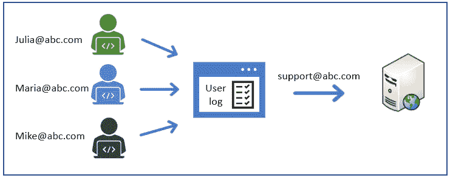

# 第四章：*第四章*：修补第 8 层

*“网络安全措施通常侧重于应对来自组织外部的威胁，而不是来自组织内部不可靠个人的威胁。然而，内部威胁如今对关键基础设施造成了数百万的损失。”*

*– 里卡多·加佐利 – IT 主管*

用户无疑是网络安全中最脆弱的因素。事实上，最近的一项研究显示，超过 50%的攻击是由内部人员引起的，无论是偶然（不小心的用户）还是故意（恶意内部人员）。

一个常见的错误是准备好网络安全专家应对服务器和网络等技术挑战，而没有准备好应对与人为因素相关的所有风险（如不小心的用户和恶意内部人员）。事实上，许多人认为管理用户比处理系统更为复杂，因为最终，你不能仅仅通过修补他们来解决问题！

因此，管理用户是一门艺术；在本章中，我将向您展示所有针对用户的不同攻击方式，以及如何掌握多种技术、方法和工具来防止这些攻击。

在本章中，我们将讨论以下主要内容：

+   理解第 8 层 – 内部威胁

+   精通社会工程学艺术

+   防御社会工程学技术

+   防御社会工程学攻击（修补第 8 层）

# 理解第 8 层 – 内部威胁

如您所知，用户也被称为**第 8 层**（这是一种笑话），因为他们位于 7 层 OSI 模型的顶部。

另一种更*专业*的称呼用户的方法是**内部人员**。这些内部人员是一个严重的威胁，因为他们已经进入了网络；因此，我们许多用于防止用户访问网络的防御系统和机制将不适用于他们。

现在，我们将讨论在制定网络安全策略时需要考虑的不同类型的用户。

## 不小心的用户

根据 Ponemon 研究所的一项研究，大约 24%的数据泄露是由于*无意*的人为错误造成的。我们称这些为无意错误，因为它们通常是用户的失误，而用户并没有故意对数据或系统造成伤害。

许多人认为这些事件很少发生，或者带来的影响很小。然而，正如您在以下图表中看到的，Ponemon 研究所的一项研究显示了一个非常不同的局面：  

图 4.1 – 内部威胁的成本

我将总结由不小心用户引起的最常见错误或失误，如下所示：

+   使用弱密码

+   在系统间重复使用密码

+   对个人系统使用相同的密码

+   对网络安全政策的缺乏理解

+   滥用或滥用特权账户

+   未经监控的设备

+   数据处理不当

+   安装未经授权的软件

+   无意中破坏系统

+   粗心的互联网浏览

+   使用免费的或开放的 Wi-Fi

+   “先点击再思考”（即电子邮件附件或链接中的内容）

+   无意中泄露敏感信息

如前所述，这些是*无辜*的错误，用户并无*伤害*公司的意图。然而，还有另一类威胁是用户有动机进行攻击，这些用户被称为**恶意内部人员**，我们接下来将讨论这一点。

## 恶意内部人员

首先，让我们试着了解是什么类型的动机可能导致员工转变为恶意内部人员：

1.  外部攻击者提供数据或执行行动以换取金钱的提议

1.  缺乏网络安全法规和公司制裁

1.  缺乏控制措施

1.  权力集中

1.  管理不善

1.  绩效评估差

1.  与公司政策、战略及同事的分歧

1.  裁员

    下图展示了恶意内部人员与无意用户在动机上的差异：

图 4.2 – 内部威胁的类型

正如你在*图 4.2*中看到的，理解这些动机将帮助你与管理层合作，制定策略以防止用户转变为*恶意内部人员*。此外，实施培训和教育策略将是你防止*无意用户*犯错的最佳盟友。

## 如何识别恶意内部人员？

下面是一些*行为*或*行动*，可以帮助你在为时已晚之前识别恶意内部人员：

+   下载大量数据（或数据库转储）

+   非工作时间访问系统和信息

+   权限提升

+   在没有业务需求的情况下下载敏感信息

+   未按照既定流程和控制创建账户

+   向未知外部地址上传数据的增加

+   重复请求访问敏感系统或数据

+   请求公司网络安全政策的例外

+   外部存储设备使用增加

+   电子邮件中出现异常附件（无论是附件大小还是文件数量）

+   执行黑客工具的证据或迹象

+   个人设备意外或增加连接到公司网络

*如果你认为自己不会遇到恶意内部人员，那么请再想一想。* *inc.com* 发布的一项研究显示，几乎五分之一的员工愿意将他们的密码卖给外部攻击者，正如你在*图 4.3*中看到的，他们会以非常低的价格这样做：

图 4.3 – 公司密码的价值

现在你已经知道这是一种严重的威胁，让我们考虑一些可以采取的措施，以减少与这些恶意内部人员相关的风险的概率和影响。

## 保护你的基础设施免受恶意内部人员的攻击

让我们看看你可以实施的工具、系统和策略，以防范这一威胁。

### 职责分离

这是你作为防御性安全策略的一部分，*必须*进行的核心活动之一，且它基于两个主要的行动或活动：

+   第一个是关于识别*你基础设施上最关键的任务*。在这里，你需要问自己：哪些人类行为（如果由恶意内部人员执行）会对系统和数据造成*重大影响*？

+   第二步，一旦识别出这些活动，你需要设置控制措施，以*确保一个人无法单独执行这些任务*。

    职责分离的重要性

    研究人员一致认为，如果实施职责分离，社交媒体平台（例如 2020 年的 Twitter 黑客事件）可能会避免遭受最大的黑客攻击。

现在，让我们来看一些如何利用并实施此策略的例子。

### 职责分离的例子

如你在*图 4.2*中所见，允许系统管理员创建特权账户可能会使恶意内部人员有机会发起危险的攻击。相反，你*必须*建立一些系统和流程来制定*新用户创建流程*，这需要多个小组的参与，*从而降低攻击的可能性*。

在下面的例子中，你可以看到一个流程，在这个流程中，系统管理员必须创建一个包含请求的工单。然后，该请求会发送到审批流程中，批准后会发送到**身份管理访问**（**IAM**）团队，以完成该请求。

请注意，通过帮助台过滤所有通信（双向通信）是防止恶意内部人员与负责创建账户的人员直接通信的有效方式，这大大增强了此方法的安全性：

图 4.4 – 职责分离

另一个很好的例子与备份相关，因为恶意内部人员可能知道删除某些文件不会造成任何伤害。因为这些文件可以从备份中恢复，而在这种情况下，他们会针对备份进行攻击，以防止任何恢复尝试。

为了防止这一危险场景，你可以使用职责分离来确保单一用户无法删除这些备份，因为有一个流程来执行该操作（*由政策、流程支持，并由系统强制执行*）。

### 邮箱的使用

当实施职责分离时，恶意内部人员可能会试图说服或让他人采取某些行动以帮助实施攻击。

为了避免这种情况，你可以使用**邮箱**来进行高度敏感团队之间的沟通，比如审批人、帮助台、IAM 团队等。这样可以避免暴露这些职位上人员的身份，防止直接的说服或勒索尝试：

图 4.5 – 使用邮箱

正如你在*图 4.5*中看到的那样，即使有直接的支持团队沟通渠道（这在小公司中很常见），恶意的内部人员也无法确定是谁在处理请求。

### 职位轮换

另一种好的做法是 IT 支持人员的职位轮换。这包括制定一项政策，要求 IT 人员定期轮换角色。这需要实施*交叉培训*、*指导*和*技能发展计划*，这些对于 IT 人员也是*激励性*的。

这一简单的政策为你的防御安全策略带来一些额外的优势，包括以下几点：

+   **减少停机风险**：你必须确保有经过培训的人，以避免由于缺乏对某项技术的了解而带来的风险。例如，"*哦，我们得等到下周，因为玛丽亚不在，她是唯一一个懂 DB2 的人。*"

+   **减少欺诈风险**：当一个人长期停留在同一角色时，他们可能能够掩盖自己的痕迹（如果有非法活动的话）。然而，如果不断轮换他们，就有合理的概率让新的人发现一些“异常”，进而揭露非法活动。

+   **减少攻击的影响**：通过缩短一个人担任同一职位的时间，也会减少一个人进行非法活动的时间；因此，攻击（对数据和系统的影响）也会降低。

### 强制休假

这基于与职位轮换相同的原理，并且可以作为*检测和制止欺诈*的手段。其工作原理非常简单：首先，已知从事欺诈的内部人员往往会因害怕被发现而变得偏执。因此，他们会避免休假，以防有人发现他们的恶意活动。

此外，比较新管理员与之前的管理员（现在正在休假）之间的活动差异也很容易，这可能会揭示恶意活动：

图 4.6 – 通过强制休假检测恶意活动

*图 4.6*展示了一个场景，其中一个特权用户每周下载超过`4`GB 的数据（这被视为*正常*），直到该人被迫休假，带宽使用量下降了超过 400%，这证实该用户从事了未经授权的企业带宽使用。

### 日志的分析与关联

未处理的数据可能不会触发任何警报，但正如之前示例所展示的，当它得到适当关联时，可能会显示出非常有趣的信息。

日志是一座金矿；不过，你需要深入挖掘才能发现有价值的信息。收集这些信息的最基本方法之一是通过关联用户和系统之间的数据，识别出异常情况。

此外，在进行分析时，你需要确定哪些事件高于或低于平均水平，这些才是你需要进一步调查的对象。

此外，还有许多系统可以自动分析日志。因此，除了给你一些品牌和名称外，我将向你展示那些能帮助你实现这一目标的工具类型，这样你就可以搜索并找到更适合你组织的解决方案。此外，我建议你寻找利用机器学习算法的替代方案，以便提高检测效率并减少误报。

系统如下：

+   行为分析系统

+   威胁情报

+   异常检测

+   预测性警报

然而，我希望你明白，没有这些系统并不是浪费宝贵数据的借口。实际上，我记得有一个非常有趣的场景，通过分析多个日志，我们发现了一名系统管理员非法使用公司资产进行*“比特币挖矿”*。

**我们是如何发现的？**

通过简单地检查日志，我们发现多个系统和非生产服务器从晚上 10 点到凌晨 4 点正常开启，唯一目的是进行比特币挖矿。此外，这些日志包含了所需的详细信息，不仅能够*识别相关用户*，还包含了*追究相关处罚和制裁所需的证据*。

### 警报

识别恶意内部人员的另一种有效方法是设置监控，当用户禁用某个网络安全系统时，系统会发出警报。

这一方法在那些为所有员工提供*管理员权限*的公司中特别有用，因为他们认为可以绕过安全机制（如禁用防病毒软件或防火墙）；然而，他们不知道的是，你已经领先了一步。

重要说明

有多种方式可以防止用户禁用某些安全功能；然而，并非所有公司或 IT 部门都具备相应的工具、知识或兴趣去执行这些操作，因此学习如何应对这些场景非常重要。

现在，让我们来看一个在 IT 部门中非常常见的例子，这对于安全来说其实是一个非常糟糕的做法。

### 共享凭证

默认情况下，最佳实践要求*在你的基础设施中不应允许共享凭证*。然而，如果确实存在共享凭证的情况，你需要设置额外的控制措施，如**多因素认证**（**MFA**）、**基于角色的访问控制**（**RBAC**）和**特权访问管理**（**PAM**）。

PAM 通过*将共享凭证*锁定到只能由经过认证的员工账户访问的存储库中（以确保可追溯性）。一旦系统管理员使用了凭证，该凭证会*重置*，以供下一位员工使用。虽然 PAM 解决了共享账户的问题，但它的实施成本非常高：

图 4.7 – 一个 PAM 系统示例

上述图示为 PAM 系统的示例，展示了每个用户如何登录到一个集中的系统（以确保可追溯性），然后从该系统向服务器*注入*共享账户。

#### 审计

这一话题已经在*第三章*《理解政策、程序、合规性与审计》中详细讲解过；然而，我想强调的是，*审计是检测恶意内部人员最有效的方式之一*，因此请确保你的基础设施定期接受审计（无论是内部审计还是外部审计）。

#### 网络安全政策

如在*第三章*《理解政策、程序、合规性与审计》中所讨论的那样，政策需要明确界定并传达。此外，这些政策*必须包含相应的制裁措施，以应对任何违反行为*。这些制裁措施是一个有效的机制，用于劝阻恶意内部人员，这也是确保所有员工都了解你们的网络安全政策如此重要的原因。

我们已经讨论了两种类型的内部人员：*无意*用户和*恶意*内部人员。然而，还有一种攻击方式。在这种攻击中，*外部人员将利用影响力和心理操控的力量，说服或诱导员工执行一系列旨在破坏系统或收集/修改敏感数据的行为*。这种技术被称为**社会工程学**，我们接下来将讨论这一内容。

# 掌握社会工程学的艺术

社会工程学是安全领域中最引人入胜的话题之一。事实上，许多专家将社会工程学定义为*一门艺术*：一种需要高度社交技巧的艺术，使攻击者能够*进入*受害者的心智，收集个人信息，甚至说服受害者执行有利于攻击者的特定行为。

*这就像是黑客攻击人类大脑，读取用户数据或注入指令让人类执行特定操作。*

正如我之前提到的，这是一个非常激动人心且重要的话题，因此我会尽量简要总结。

重要提示

作为防御安全领域的专业人士，你*必须*掌握这一话题，因为你对其运作的理解越深入，你就能越好地防御它。

现在，让我们看看那些旨在欺骗用户的攻击。此外，请记住，尽管并非所有作者都同意将这些攻击归类为社会工程的类型，但事实是，这些攻击与社会工程攻击共享相同的概念和策略。

## 社会工程周期

攻击者可以使用许多技术来执行社会工程攻击，但这些技术需要按照以下方式进行协调，以提高攻击的效率：

1.  **信息收集**：首先，攻击者将尽可能多地收集关于目标个人或组织的信息。攻击者了解的组织信息越多，成功的机会就越大。例如，攻击者非常关注了解组织结构、流程和程序，以作为下一步的输入。

1.  `svchost` Windows 进程出现在任务管理器中：

    图 4.8 – 在 Windows 上运行的 SVCHOST

    当然，攻击者知道这样的过程*总是*存在的，因此当用户发现它时，这将成为合法化攻击者的方式，从而赢得完全信任，并为下一步铺平道路。

1.  **影响受害者**：在获得用户信任后，攻击者可以操控受害者提供一些机密信息（如用户名和密码）或执行某些操作（如重置密码、打开终端或打开网页）。

1.  **执行攻击**：到此为止，攻击者可能已经获得有效凭证、完全的远程控制计算机权限，并且有多种方式可以执行最终的攻击（例如删除、修改或复制机密数据、访问某个系统等）。

1.  **抹除痕迹**：一旦攻击完成，攻击者可能会想要*掩盖自己的痕迹*，以避免被发现和起诉，同时保留对系统和数据的长时间访问权限：

图 4.9 – 社会工程生命周期

现在，让我们快速看看攻击者用来成功发起社会工程攻击的一些技术。

## 社会工程技术

下面是一些攻击者可以使用的技术，以发起社会工程攻击：

+   **冒充**：攻击者常用的一种技术是冒充他人；例如，冒充具有权威的人、拥有权力的人，或者代表信誉良好的公司或组织的人。

    这通常用于获得受害者的信任，以便获取信息或让受害者执行某些操作。

    一些最常见的冒充行为包括冒充 IT 人员、政府代表、银行员工或信誉良好的企业。

+   **恐惧**：攻击者可以利用恐惧来迫使用户遵从某个行为。例如，想象一封邮件内容如下：

    *"你的电脑已感染病毒，点击这里扫描，以防止电脑被阻止并被公司网络列入黑名单。"*

+   **互惠原则**：攻击者会做一些看似对受害者有利的事情。这样，受害者就容易遵从攻击者的请求（提供某些信息或执行某些操作），以回报这个好意。

+   **利用用户贪婪**：这将利用人类的基本弱点，例如：

    *"你赢得了一个邮轮假期，点击这里领取你的奖品！"*

+   **利用用户好奇心**：在这种情况下，攻击者可能会在目标附近丢弃一些恶意 USB 驱动器，希望有员工会捡起来并插入电脑。攻击者可能会在 USB 上贴上标签，如*“我的图片”*或*“机密”*，以增加好奇心的程度，从而提高攻击的有效性。

    作为一个有趣的事实，大多数资料来源认为*Stuxnet*（破坏伊朗核计划的病毒）是通过感染的 USB 驱动器传播的。

+   **社会验证**：另一种策略是使用社会验证来推动受害者。例如，攻击者可能会告诉你，*“这已经由其他系统管理员测试过了，”* 以给你一种安全感，因为其他人已经进行了类似操作。

+   **技术验证**：攻击者可以使用技术术语来混淆受害者。通常，这与其他技巧（如紧迫感和恐惧）结合使用。*图 4.8* 是这种技巧应用的一个很好的例子。

+   **权威人物**：攻击者可能会冒充权威人物来迫使你遵从某个要求。在某些情况下，攻击者可能不会冒充那个人，而是声称他们是在代表权威人物行动。例如，*"如果你不安装此软件，将会提交给佐藤先生处理。"* 请注意，在这个例子中，他们使用了名字（佐藤先生）而不是头衔（首席执行官），这是一种攻击者使用的技巧。

+   **稀缺性**：在这种情况下，攻击者会让受害者认为，如果不迅速采取行动，用户（受害者）可能会失去一个潜在的奖励。例如，假设收到一封来自 IT 部门的电子邮件，内容如下：

    *"我们有 20 台新的 MacBook 用来升级旧电脑；点击这里填写表格。记住只有 20 台笔记本电脑，并且它们将提供给前 20 个完成表格的人（先到先得）。"*

+   **紧迫感**：这种经典骗局可能会这样说：

    *"如果你在 30 分钟内不重置密码，你的电脑将被从网络中封锁。"*

    *"你的电脑已感染病毒，点击这里立即处理，以免信息被盗。"*

*图 4.10* 描述了社交工程攻击的整个流程以及攻击者使用的策略：

图 4.10 – 一个社交工程攻击示例

到目前为止，你已经了解了攻击的流程和攻击者用来获得用户信任并执行攻击的技巧。

现在，到了我们了解最常见的社交工程攻击类型的时刻，这些攻击中使用了这些技巧。

## 社交工程攻击的类型

在这里，我将总结一些基于社交工程技巧的最常见攻击。

#### 网络钓鱼（Phishing）

正如你可能已经知道的，这个概念非常简单。攻击者会发送一封伪造的邮件，试图冒充一个有信誉的人或公司。为了增加成功的几率，攻击者会首先试图说服受害者邮件是合法的（通过使用公司标志或冒充电子邮件账户或域名），然后请求用户采取某些行动，通常是访问一个链接或打开附件中的 PDF 文件。

接下来，让我们看看一些示例。

*每个人都梦想着免费的钱，而攻击者知道这一点*。为了利用人类这种欲望，攻击者会冒充一家想要转账给你的公司，但声称因为号码错误未能成功转账。然后，为了能*获得*这笔钱，你只需打开一个*无害的* PDF 文件，当然，这个文件里面会包含各种病毒，从键盘记录器到致命的勒索病毒。

在*图 4.11*中，我们突出显示了常见的攻击特征，帮助你识别这些类型的攻击：

图 4.11 – 一个“免费钱”网络钓鱼示例

现在，几乎每个人都在网上购物，你期待收到包裹的概率非常高，因此攻击者利用这一点，毫不犹豫地发送这些钓鱼邮件，希望任何正在期待真正包裹的人都会掉入陷阱。

如*图 4.12*所示，攻击者会冒充一个著名的快递公司，但仍然有几个项目可以帮助你确认这是一封钓鱼邮件。

第一个（看起来很明显）特征是地址来自 Hotmail。

第二个特征是你的电子邮件没有列在**收件人**字段中。

第三个特征是使用了通用的问候语。不过，最重要的一点是关于链接的。

*在这里，你可以将鼠标悬停在链接上，查看它指向的地址*。在这个示例中，很明显这个链接并没有指向真正的 DHL 域名：

图 4.12 – 一个包裹递送的钓鱼邮件示例

正如你所知道的，攻击手段通常会随着防御机制的进化而演变，所以，让我们来看看一些从钓鱼攻击中演变出来的社交工程变种。

#### 短信钓鱼（SMishing）

这个攻击与钓鱼攻击有相同的特征，唯一的区别是它是通过**短消息服务**（**SMS**）进行分发的。

虽然这听起来像是一个小小的变化，但这实际上是最危险的攻击途径之一，因为用户通常不会将旧短信与病毒联系在一起，所以他们往往*信任*这些信息并陷入陷阱。如果贵公司有**自带设备**（**BYOD**）政策，那么你必须执行以下操作：

*教育用户了解这种类型的威胁。*

*禁用短信中的超链接功能。*

现在，让我们看一下*图 4.13*，向你展示如何轻松识别这些威胁：

图 4.13 – 一种 SMishing 攻击示例

1.  大多数时候，攻击者会使用一个容易识别和屏蔽的随机号码。然而，在更精心设计的攻击中，攻击者可能会使用一些工具（如**BurnerApp**和**SpoofCard**）来伪造来电显示，冒充更可信的号码。

1.  另一个共同的因素是*紧迫感*，促使受害者执行请求的操作。

1.  另一个共同的因素是*利用恐惧*，让用户相信如果不执行请求的操作，某些坏事就会发生。

1.  如前所述，这里的主要攻击途径是*将受害者引导到一个恶意网站*，该网站可能会窃取你的凭证、感染你的设备或两者兼有。

1.  在一种可能的场景中，攻击者会购买一个看起来像原始域名的域名；然而，在其他情况下，攻击者会使用*链接缩短器*来掩盖网站名称。

#### 网络钓鱼

这是一种定向攻击，攻击者首先对受害者和公司进行深入的研究。然后，攻击者会利用所有这些知识创建一个*定制化的钓鱼攻击*。

通常，这些类型的攻击是针对高价值目标，如管理人员、财务人员或系统管理员（因为他们的管理凭证具有较高的价值）。

现在，让我们分析一个真实的网络钓鱼攻击示例（如*图 4.14*所示）：

图 4.14 – 一种网络钓鱼攻击示例

从之前的截图中，我们可以解读出以下内容：

1.  大多数时候，攻击者会*使用一个非常相似的域名来欺骗受害者*。正如你所看到的，在这个例子中，在更精心设计的攻击中，网站可能看起来合法。然而，如果你仔细观察，你会发现公司名称只是攻击者域名的一个子域。

1.  攻击者使用一个*引人注目的主题*，但也带有一些紧迫感（以防攻击被发现）。

1.  邮件将通过*使用真实姓名和职称*来正确地发送给受害者（在某些情况下，攻击者甚至会使用昵称来减少怀疑，使其听起来更熟悉）。

1.  将使用一个诱饵来吸引受害者的注意，并说服他们打开恶意文件。

1.  使用了*紧迫感*，促使用户执行请求的操作（例如，打开附件），而无需与管理层或其他员工进一步确认，这样他们可以识别出这可能是一次潜在的攻击。

1.  再次，貌似*无害的 PDF* 将是攻击者最终执行攻击的入口（例如，安装特定的勒索病毒、打开后门或安装键盘记录器）。

#### 电话钓鱼

也称为电话引诱或电话诈骗，电话钓鱼是一种基于攻击者与受害者之间电话对话的网络钓鱼攻击，攻击者试图说服受害者执行一系列操作或不小心透露某些机密信息。

从攻击者的角度来看，这是最复杂的攻击之一，因为它要求攻击者掌握我们之前提到的大部分社会工程学概念。

然而，攻击者也可以增强一些这些技巧，以确保受害者的配合。例如，攻击者可以打电话给帮助台，要求重置密码，并请求客服代表通过电话提供密码。如果客服拒绝请求，攻击者可以威胁客服代表称他们即将签署一笔价值数百万的交易，如果不提供密码，交易将无法完成，客服代表将承担责任。这个简单的伎俩确认了为什么这种攻击是经验丰富的社会工程师首选的机制。

网络钓鱼数据

网络钓鱼是最常见的社会工程攻击类型。事实上，*Verizon 2019 年数据泄露调查报告*显示，超过 30% 的已确认数据泄露与网络钓鱼攻击相关。另一方面，*电话钓鱼攻击的全球损失估计为 460 亿美元*。

正如你所看到的，攻击者擅长找到新的、巧妙的方式来扩展或演变他们的攻击，因此你必须保持最新，以揭示可能影响员工的任何新的潜在网络钓鱼变种。

### 恐吓软件

恐吓软件基于欺骗受害者，使其认为计算机已感染病毒，而实际上计算机是正常的。攻击者的目的是说服受害者安装*杀毒软件*来删除这些病毒，但*杀毒软件*是假的。

这种攻击有两种主要变种。第一种是基于*“免费杀毒软件”*，但实际上这是一种病毒，*“为其他病毒打开了大门”*。

另一种变种是基于向你出售*“杀毒软件”*，该软件声称*“移除”*一些根本不存在的病毒（因此，它本质上是诈骗）。

通常，这种攻击会以几种方式出现，例如：

+   来自恶意网站的弹窗

+   一个合法网站的附加组件（例如，YouTube）

+   一个将在 Windows 启动时执行的脚本

+   一个假的杀毒程序：

图 4.15 – 恐吓软件示例

这种类型的威胁在几年前非常流行（也就是在 Windows XP 时代）；然而，现如今，它们已经不那么常见，尽管如此，依然具有危险性。

然而，近年来，这种威胁似乎转移到了另一个平台，现在它们开始针对智能手机用户。

如你在*图 4.16*中所见，攻击非常相似。为了防止这种情况，Play 商店不断封禁这些应用程序；然而，它们总是以另一种名称重新出现：

图 4.16 – 智能手机上的恐吓软件

防止这种威胁出现在公司工作站上的一种方法是限制安装第三方应用程序的权限（这是我们将在*防御社交工程攻击*部分中讨论的主题）。这种限制也适用于智能手机，且*必须*强制执行，如果公司允许员工使用智能手机访问其系统（BYOD 政策）。

实现这一目标的一个好方法是利用**Android Business**，它使公司能够创建一个虚拟环境，在该环境中，企业可以应用更多的控制措施来保护数据，并控制谁可以访问他们的网络、系统和数据。

更多信息，请访问他们的官方网站 [`www.android.com/enterprise/`](https://www.android.com/enterprise/)。

此外，部署**广告拦截器**是一个不错的主意。这可以在三个层面上进行：

+   本地工作站上

+   使用公司防火墙

+   使用 DNS

    创建你自己的 DNS 广告拦截器

    在*第十章*，*应用物联网安全*中，我将向你展示如何使用**树莓派**以不到 50 美元的成本创建你自己的**广告拦截器**DNS。

尽管恐吓软件在以前版本的 Windows 中非常流行，但这种攻击仍然与保护你的基础设施相关，且同样关乎保护人们的财产。

### 诱饵攻击

这主要是一种攻击者用来利用受害者好奇心并将其引入陷阱的技术。在这种情况下，攻击者的主要目标是让受害者访问一个虚假或伪造的网页，打开一个被感染的文件，在假页面上提供他们的凭证，或者下载木马病毒。

以下图表展示了一些诱饵攻击的例子：

图 4.17 – 常见诱饵攻击示例

还有一个子类型，称为**点击诱饵**，它主要集中在呈现非常有趣的虚假新闻，目的是希望用户点击。大多数情况下，点击诱饵用于生成流量或通过广告赚取收入；然而，也有一些情况，它们被用来通过恶意软件感染系统。

### 肩窥

这听起来可能很基础，但许多信息就是通过这种简单的方法泄露的。本质上，它涉及到站在受害者身后，收集敏感信息，如用户名、密码等。

通常这种行为是由外部人员进行的，因此建立一个强有力的物理安全系统对于防止这种攻击至关重要。

对于经常出差的员工，另一个建议是使用*隐私屏幕*，以防止他人窥视你的屏幕。此外，使用*密码库*也能降低这一风险，因为密码不需要输入，因此也不会有泄露的风险。

### 尾随攻击（Tailgating）

既然我们提到了物理安全，那么现在就该谈谈尾随攻击（tailgating）。

这是攻击者用来获得对受限区域物理访问权限的最常见方法之一。

在这种情况下，攻击者会利用人类具有的*礼貌或友好*特征，在你身后的人进门时保持门打开。

攻击者非常有创意，很多时候，他们会拿着一个大披萨盒子或几杯美味的咖啡，作为不使用证件进入大楼的借口，希望一个“好人”（也就是一个无意的用户）帮忙为他们开门。

除了用户培训的应用之外，抵御这种类型威胁的最佳方式是使用额外的验证机制，如摄像头来检测外部人员。事实上，现在摄像头可以通过其他机制来检测外部人员，超越了人脸识别。这些机制包括运动模式、用户计数（如果两个人进入，但系统只读取了一个证件）、分析（基于不寻常路径的检测）等。

### 垃圾桶潜水

最著名的黑客之一，*凯文·米特尼克*，实际上是第一个出现在 FBI 通缉名单上的*黑客*，他让这一战术变得广为人知（这一点在他的书中有很好的解释）。

他评论道，他通过简单地在公司垃圾桶中寻找未碎纸的机密文件，获得了大量的信息。在某些情况下，攻击者可能会幸运地找到敏感信息，例如用户凭证；但在其他情况下，攻击者会利用这些信息收集关于公司的重要资料，这些资料可以成功地用来执行其他攻击（例如冒充）。

为了避免这种攻击，你*必须制定数据分类和管理政策*，明确规定以下内容：

+   不同类型的文档（如敏感、机密、公开等）

+   每种文档类型的适当处置方式

+   物理文档的适当处置方式（例如笔记、书籍、便签等）

当用户在办公室时，这些政策更容易执行。然而，随着越来越多的用户现在在家工作，你必须采取额外的机制来确保这些政策得到遵守，并且你的用户拥有适当的工具来执行这些政策。例如，向有敏感信息的用户提供碎纸机，或者限制在家打印敏感文件。

### 权衡交换

这是一种非常有趣的攻击，攻击者免费为受害者提供一些好处。

一个经典的例子是，攻击者冒充与某个开放工单相关的 IT 人员打电话给某公司的员工。正如您在以下示例中看到的那样，受害者很可能会*“利用”*电话来解决问题，而实际上，是攻击者会利用他们：

图 4.18 – 一种交换攻击

防止这种攻击的最佳方法是实施（并传达）一项关于 IT 支持的政策，该政策包括以下内容：

+   IT 绝不会从外部或阻止显示的号码给您打电话（如果可能的话，请为所有 IT 呼叫分配一个友好的号码，如 114）。

+   IT 人员绝对不会要求您的密码。

+   永远不要通过电话、电子邮件或短信提供您的密码：**绝对不要**。

另一个好主意是建立一个*双向验证回拨机制*。这意味着如果用户接到 IT 的电话，则用户必须回拨（使用官方帮助台号码）。此回拨将作为 IT 人员和员工的第二验证方法。

### 社交媒体勒索

这是正在发生的最新攻击之一。在这种攻击中，攻击者将应用多种技术来访问公司的社交网络（即 Facebook、Instagram 和 WhatsApp）。攻击者将确保他们更改所有恢复帐户的机制，因此尽管您可以联系社交媒体公司恢复访问，但您的攻击者在问题解决之前将可以访问帐户，这可能需要几个小时甚至几天。攻击者知道许多公司不会冒险将其社交帐户留在攻击者控制之下（因为这会损害品牌、客户和关注者），因此攻击者要求支付一些费用（通常是比特币）才会将帐户归还给您的公司。

这里有一些防止这种危险攻击的建议：

+   始终使用多因素身份验证。

+   使用强密码。这些类型的帐户应该由密码保险库管理，那么为什么要羞怯呢？使用最大长度，使用特殊字符，并使其免受字典或暴力攻击。

+   确保每个密码都是唯一的。

+   经常更改密码（至少每 3 个月一次）。这将由密码管理器管理，所需的工作仅仅是每年两次点击四次。

+   将访问这些帐户的人数减到最低，以降低风险。

此外，*确保管理这些帐户的人员*（如社交媒体经理）*在网络安全方面接受了良好的培训*（以防止这些类型的攻击）。

### 敲诈

在这种情况下，攻击者会试图说服受害者他们的电脑或智能手机被黑客入侵，并且如果在 10 小时内不满足攻击者的要求，某些私人或敏感信息将会被公开（当然，他们会利用紧迫感战术）。

正如你在*图 4.19*中看到的，一种方法是告诉受害者他们的电脑被黑了，并且为了证明这一点，攻击者会在邮件中粘贴受害者的密码：

图 4.19 – 一封敲诈邮件

如果攻击者知道密码，这是否意味着他们真的入侵了受害者的账户？

*绝对不是！*

在这种情况下，攻击者利用之前数据泄露中的信息，寻找电子邮件/密码配对，并将其用于攻击。

因此，虽然大多数时候提供的密码是旧密码，受害者会认出这是他们的密码，因此很可能会陷入这一骗局。

防止这种攻击的最佳方法是发起一项活动，向员工解释**攻击者如何获取你的旧密码**。你可以采取以下措施：

1.  简要解释什么是数据泄露，并提供一些最近大公司数据泄露的例子（例如，LinkedIn 的数据泄露、Yahoo 的数据泄露等）。

1.  请他们检查是否在这些泄露事件中，自己的账户信息被泄露。有几个网站可以进行检查，但并非所有网站都可信。如*图 4.19*所示，最受信任/使用最广泛的网站之一是[`haveibeenpwned.com/`](https://haveibeenpwned.com/)。该网站会显示你的电子邮件出现在什么数据泄露事件中，帮助你进一步保护这些账户。

1.  如果账户出现在已知的数据泄露事件中，请提供一份行动清单，例如，修改密码，确保永不使用相似或变种密码，启用多因素认证（MFA），或者删除账户（如果不再使用）：

图 4.20 – 一个检查泄露凭证的网站

到目前为止，你应该已经了解了社交工程攻击中使用的策略，以及最常见的攻击类型。

我们已经介绍了一些防御技术，现在是时候学习适用于**所有**此类攻击的额外**最佳实践**，这些最佳实践将帮助你减少与这些威胁相关的风险。

# 防御社交工程攻击（修补第 8 层）

*“公司在防火墙、加密和安全接入设备上花费数百万美元，而这笔钱是浪费的，因为这些措施并没有解决安全链中最弱的一环：使用、管理、操作和负责包含受保护信息的计算机系统的人。”*

*– 凯文·米特尼克*

让我们学习如何有效地保护公司免受这些威胁。

## 制定你的培训策略

如你所知，*修补*是防御性安全策略中最重要的策略之一，这个策略同样可以通过*教育和培训*应用于人。因此，你*必须*投入时间和其他资源，以确保拥有**强有力的培训策略**。

让我们来看一下在制定培训策略时需要考虑的关键点：

1.  *根据公司文化、威胁环境以及公司所管理的数据类型*进行个性化定制。

1.  对于小型公司，可以创建一个培训课程覆盖所有员工；然而，中型到大型公司和企业*必须有不同类型的定制培训*。这些培训可以根据员工类型、组织级别、管理的数据或数据访问权限进行划分。

1.  定义*交付方式*（例如，现场培训、网络研讨会、视频、动画、基于网页的互动学习等）。

1.  定义培训的*频率*。

1.  定义“通过”培训的成功标准，例如，在最终评估中得分至少为 80%。

1.  定义一个*奖励机制*；例如，提供一个可以分享到社交媒体的数字徽章。

1.  获得人力资源部门和高级管理层的支持，*使培训成为强制性的*。

    提示

    使培训尽可能互动，使用最新的真实案例，涵盖所有内容（不要假设某个话题过于基础而不包含在内），并以我们刚刚回顾的攻击列表为基础，确保覆盖所有主要攻击向量。

你需要说服高层管理人员，公司在网络安全教育上的支出不是**花费**，而是**投资**于保障最脆弱的网络安全因素。

## 管理员权限

这是一个有争议的话题，因为关于是否为所有员工提供管理员权限是否为良好实践尚无共识。然而，*从安全角度来看，毫无疑问，为所有员工提供管理员权限会增加你的威胁面*。

因此，你应该始终推动避免为所有用户提供管理员权限；然而，如果公司决定为所有员工授予管理员权限，那么你需要采取以下对策：

1.  定义一个明确的软件安装政策。

1.  创建可安装应用程序的白名单和黑名单。

1.  如果可能，创建一个存储白名单软件的仓库（这样可以减少用户安装被破解版本软件的风险）。

1.  如果在公司工作站上安装了黑名单软件，请设置警报。

## 实施强有力的 BYOD 政策

如果允许员工使用个人设备工作，请确保制定强有力的 BYOD 政策。

此外，这项政策*必须*得到系统和软件的支持，以便强制执行。

## 执行随机的社会工程学攻击活动

评估用户对社交工程攻击的准备程度或暴露程度的最佳方法是通过实际控制的攻击来测试他们。

以下是你可以采取的方法：

+   **设置你的环境**：购买一个你将用来发起攻击的域名。寻找与真正的攻击者可能使用的名字相似的域名，例如 *support-companyname.com*。

+   **每个周期测试一次攻击**：首先，你需要定义周期，例如每三个月、六个月或一年。例如，2020 年初进行钓鱼攻击，2020 年底进行诱饵攻击，2021 年初进行交换条件攻击，2021 年底进行勒索攻击。

+   **分析结果**：这并非要追究员工的责任并把他们列入“耻辱榜”。而是要收集情报，以便为未来的培训和教育确定改进的领域。

+   **设置奖励**：你可以为那些发现*攻击*并通过正确渠道向网络安全团队报告的员工设置奖励系统。

    奖励不总是与金钱相关

    你还可以利用免费的福利，比如数字徽章、名人墙、月度最佳安全员工（你可能想用更吸引人的名字，比如“*网络安全摇滚明星*”）、一个月的优先停车位等。

+   **公告和沟通**：你可能不希望通过提前通知来破坏评估的效果。然而，在评估结束后发送一份通知是个好主意，这样大家就能了解到这些类型的活动，也能分享一些相关的数字（例如，有多少人受到了攻击，潜在的损失等）。

为了避免服务中断，我们建议将这些活动推广给随机选中的一部分员工（根据公司的规模，这个比例可能是 10%到 60%的员工）。此外，你还需要确保这些随机选中的员工包括公司各个部门的人员（例如，人力资源、销售和 IT）。

# 总结

在本章中，你学习了关于用户的所有内容，包括他们如何影响你的防御性安全策略，他们的漏洞，以及针对他们的各种攻击方式，同时也包括你可以采取的所有策略来减少这些风险。

本章极为重要，因为通过保护这一攻击向量，你将大幅度减少针对你的基础设施、系统和数据的攻击范围。

现在，准备好迎接下一个激动人心的章节，在这个章节中我们将深入探讨更多技术性的内容。在接下来的章节中，你将学习到最佳的渗透测试工具、取证技术、网络技术以及其他许多你需要掌握的技术，以便制定最佳的防御性安全策略。

# 进一步阅读

这是《2020 年内部威胁的成本》的完整报告：

[`www.ibm.com/security/digital-assets/services/cost-of-insider-threats/#/`](https://www.ibm.com/security/digital-assets/services/cost-of-insider-threats/#/)。
