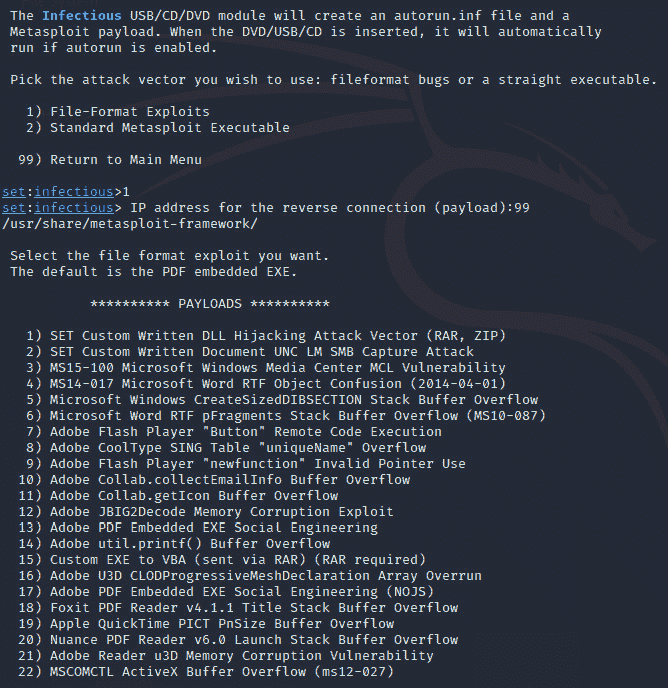

# 第五章：*第五章*: 网络安全技术与工具

*“数字化转型提供了巨大的机会，可以降低成本并提高生产力，但如果在没有加强防御安全的情况下进行，可能会导致灾难。”*

*– Roberto Sasso – 技术研究俱乐部创始人兼主席*

网络安全工具成千上万，仅仅了解它们的基础就需要几百年，因此为了节省宝贵的时间，我们将为你提供一些关于*最佳*网络安全系统、方法、技术和工具的见解，帮助你充分利用它们。

此外，我们还将回顾一个*必备*硬件设备，帮助你将安全意识提升到一个新的高度。

此外，你将更好地理解什么是**高级持续性威胁**（**APT**），如何防范它们，并且如何利用威胁情报保持领先于犯罪分子。

最后，你将理解批判性思维在网络安全中的重要性，并通过一个真实案例，了解网络安全威胁如何转化为 IT 解决方案。

在本章中，我们将讨论以下主题：

+   网络安全的网络工具和技术

+   渗透测试工具和方法

+   应用法医工具和方法

+   应对 APT

+   利用安全威胁情报

+   将威胁转化为解决方案

# 技术要求

为了充分利用本章内容，你需要安装 Kali Linux。这样，你就可以使用我们将要概述的工具。Kali Linux 非常轻量，因此几乎可以在任何一台带有互联网连接的旧电脑上安装。

另一种选择是使用虚拟机，但在这种情况下，你可能需要调整一些设置（特别是网络设置），以确保所有工具按预期工作。

所有图像，包括虚拟机的预构建虚拟图像，都可以在这里找到：[`www.kali.org/downloads/`](https://www.kali.org/downloads/)。

我们还将回顾卓越的**WiFi Pineapple**，拥有它将帮助你将本章的经验和知识提升到一个新的水平。

想了解更多关于这个必备渗透测试工具的信息，请访问[`shop.hak5.org/products/wifi-pineapple`](https://shop.hak5.org/products/wifi-pineapple)。

# 网络安全的高级无线工具

作为防御安全的专家，我们需要了解并理解最新工具的工作原理。无论它们是作为进攻性工具开发的，你都需要学会如何利用它们。让我们从一些最新和最酷的无线工具开始了解。

## 防御无线攻击

无线网络是目前最常用的连接方式，因此它们成为了网络犯罪分子的主要目标。因此，你需要领先一步，确保无线安全是你网络安全战略的核心部分。

在*第八章*《增强网络防御技能》中，有一个完整的部分专门讲解网络工具。然而，在这里，我们将看看一些在无线攻击中最重要的工具，以便你能领先于攻击者，并据此规划你的防御策略。

### 无所不能的 WiFi Pineapple

这是审计 Wi-Fi 网络时必备的工具。这个工具由*Hak5*在 2008 年创建，可能是全球最知名的硬件渗透测试工具——也许是因为这个小盒子的强大功能，易用性，或者它在单一设备上包含的各种工具。

提示

Hak5 的天才们投入了大量精力，不断更新这个工具以跟上最新的 Wi-Fi 审计工具（例如，MarkV 收到了 22 次固件更新）。然而，到了某个阶段，硬件必须升级才能包括新的工具（并在速度、范围等方面改善现有工具）。因此，考虑到 WiFi Pineapple 的多个版本，我们决定尽量使本节内容通用，以尽可能涵盖大多数 WiFi Pineapple 版本中可用的工具。

现在，让我们来看看这个神奇工具的一些功能。

#### 恶意接入点

你是否曾注意到，当你第一次连接到你喜欢的咖啡馆的无线网络后，你的智能手机会自动连接到该咖啡馆的无线网络？

这个功能本是为了改善用户体验，但它也带来了严重的安全漏洞。

为了利用这个漏洞，攻击者需要*模仿*其中一个*受信任*的 Wi-Fi **接入点**（**AP**），让受害者的设备自动连接到它。但问题是，攻击者如何知道受害者设备上受信任网络的名称呢？好吧，聪明的攻击就在这里开始了。

首先，让我们看看这个攻击背后的理论和概念。

当你的设备（如笔记本电脑、智能手机等）打开 Wi-Fi 并且没有连接到任何网络时，它会广播**探针请求帧**（**PRFs**），其中包含设备信任的 SSID 列表。这些帧会被 AP 捕获，AP 会查看这些帧，并检查其 SSID 是否在列表中；如果在，它就会启动连接过程：


图 5.1 – 探针请求/响应结构

这个设备的魔力（或恶意）在于，它利用了*探针请求没有加密*的事实，捕获这些请求并读取受信任和开放的 SSID 列表。

然后，设备会自动创建一个开放的 AP（没有密码），并使用一个受信任且开放的 SSID 名称。此时，受害者的设备将立即连接到该 AP。

现在，受害者的设备已经连接到**恶意接入点**，攻击者可以执行多种攻击，包括著名的**中间人攻击**，这一点将在*第八章*中详细讨论，*增强你的网络防御技能*。

提示

记住，你对将要被用来攻击你的工具了解得越多，你就越能做好准备，减少这些攻击的**概率**和**影响**。

让我们稍作停顿，思考一下这种攻击的危险，并分析你如何利用这些信息来支持你的*防御安全策略*。

你可以通过更新两项政策来降低这种风险的可能性：BYOD 政策和网络政策。在这种情况下，只需要确保包含以下内容：

*旅行时必须关闭 Wi-Fi，仅在安全地点（如办公室、家中、安全的酒店连接等）启用 Wi-Fi*。

正如我们在*第四章*中看到的，*修补第 8 层*，培训是防御安全中最基础和有效的工具之一，你可以利用像**WiFi Pineapple**这样的优秀工具使你的培训更具吸引力，同时提高对这种攻击潜在影响的意识。

提示

你可以通过每年开展安全活动来提高意识，例如**网络安全周**。在这里，你可以利用这个酷炫的工具展示那些攻击向量是现实的、易于实施的，并且对你的个人和职业数据、系统以及设备造成毁灭性影响。

此外，请记住，大多数用户认为这种类型的攻击不会发生在他们身上（因为它看起来太复杂了），但是当他们看到这种攻击是多么容易实施时，他们会更愿意接受你所制定的任何政策或策略来防范这种攻击，从而将你的用户从面临网络安全威胁的状态转变为防御安全的代理人。

#### 识别你基础设施中的未授权接入点（AP）。

WiFi Pineapple 有一个非常酷的模块，叫做**Recon**。这是一个非常简洁的界面，*让你看到看不见的东西*。因为它会展示你关于你基础设施中的 Wi-Fi（AP 和设备）正在发生的事情的信息。

让我们来探索你可以在这里收集到的宝贵信息：

+   关于 SSID 的信息（广播或隐藏）。

+   接入点（AP）的 MAC 地址。

+   安全类型（WPA、WPE、混合模式等）。

+   关于是否启用了 WPS 的信息。

+   接入点（AP）使用的 Wi-Fi 频道。

+   信号强度。

+   每个接入点（AP）连接的客户端。

+   客户端信息，包括 MAC 地址和制造商名称（*通过动态分析 MAC 地址的前三个八位字节获取*）。

+   你还可以发现那些未连接到任何接入点的客户端（包括物联网设备、扬声器、摄像头等）。

现在，你可以利用所有这些数据执行以下防御措施：

+   检测未授权的接入点（AP）。

+   检测伪造的 AP（通过隐藏 SSID 混淆）。

+   检测违反网络安全策略的行为，这些行为涉及 AP 所需的安全性。

+   检测脆弱的 AP（如安全类型弱或启用了 WPS）。

+   检测由于饱和或特定 Wi-Fi 通道的利用导致的性能问题或来自其他系统的干扰。

+   确定因设备连接到不应连接的 AP 或连接了未经授权设备的 AP 而产生的漏洞。

+   检测另一个 WiFi Pineapple 执行的潜在攻击。

+   检测你基础设施中未经授权的设备。

    提示

    正如本节所示，你可以利用这款设备创建你自己的低成本 Wi-Fi 监控工具，根据你的需求进行定制，并迅速部署。

此外，您可以对这些 AP 点执行一些操作，包括以下内容：

+   **将 SSID 添加到 PineAP 池**：这将使 WiFi Pineapple 开始模仿所选的 SSID。如前所述，这是一个很棒的工具，你可以在活动中利用它来 *提高意识*，展示攻击者如何轻松地执行这种攻击，因此需要遵循相关政策、方法、系统和工具来防止此类攻击。

+   **将 SSID 或客户端添加到过滤器**：在执行 *渗透测试* 或 *审计* 时，这非常有用，确保只有一组选定的设备或 AP 能够连接到你的 WiFi Pineapple。

+   `802.11` 协议。它通过假装是 AP，并向已连接的设备发送命令，让它们立即断开与 AP 的连接。

    这在你需要让所有设备立即断开与特定 AP 的连接时非常有用。在这种情况下，你可以通过点击鼠标轻松完成，而不是逐一寻找每个设备的拥有者并要求他们断开连接，从而减少暴露于潜在威胁的时间。

+   **捕获 WPA 握手**：这是另一个很棒的工具，可以帮助在网络安全研讨会上提高意识，展示攻击者是如何执行攻击的。

    提示

    人们不信任他们看不见的东西，这一点在安全领域尤为适用。很多人对那些他们从未看到的攻击并不在意，因为这些攻击看起来遥远、不相关或不可能。因此，向他们展示攻击是如何执行的以及攻击者执行这些攻击的简单性，是提高意识的最佳方式，同时也能提升整个组织的网络安全水平。

    关于 WiFi Pineapple 模块的另一个酷炫功能是，它们的 GUI 可以配置且具有响应性，因此你可以使用 GUI 并通过智能手机随时管理你的 Wi-Fi 监控工具！

+   **附加功能**：WiFi Pineapple Mark VII 具有一个非常酷的功能，可以让我们使用 3D 地图可视化数据，您可以以一种非常酷的方式直观地看到 AP 和已连接的设备：


图 5.2 – WiFi Pineapple Mark VII 的 3D 地图可视化

这是版本`1.0.0`的一个特性，虽然被认为是实验性的，但预计在即将发布的版本中会增加一些额外的选项和功能，请保持关注！

#### 其他 Pineapple 审计和测试工具

你想测试你的用户对 Wi-Fi 攻击的脆弱性吗？或者你也许想测试你的用户是否理解了你精心设计的网络安全培训？

无论如何，你可以利用**PineAP**创建一个虚假的 SSID，取一个吸引眼球的名字，比如*Free Wi-Fi, Free Game*，然后观察哪些设备掉进陷阱并连接上去。

提示

除了对公司和企业来说是一个很好的工具外，咨询师也可以利用它向用户展示其漏洞，并为多种网络安全服务打开大门（如培训、制定防御安全策略等）。

你也是开发者吗？如果是的话，我们应该看看如何通过新功能提升 WiFi Pineapple。

#### 扩展设备的功能

你可以通过这个硬件做很多事情，因此 WiFi Pineapple 的创作者决定开放他们的设备进行社区协作，以便你作为用户，可以利用这些模块并通过几次点击将它们添加到你的设备中：


图 5.3 – 向 WiFi Pineapple Mark VII 添加社区模块

如果你是开发者，我建议你访问这个链接，因为通过为 WiFi Pineapple 开发模块，你可以获得很多福利：[`shop.hak5.org/pages/developer-program`](https://shop.hak5.org/pages/developer-program)。

现在你了解了这些强大的 Wi-Fi 工具（硬件和软件），是时候继续探讨另一个令人兴奋的话题：**渗透测试**。

# 渗透测试工具和方法

许多人误以为*渗透测试 = 网络测试*，这是一个巨大的错误。

作为防御安全的专家，你需要以整体的方式推动你的防御策略，涵盖所有可能影响你基础设施的参与者、因素和行动。

因此，在本节中，我们将探讨你需要利用的所有不同工具和方法，以*创建最全面、最强大的网络安全策略*。

## Metasploit 框架

Metasploit 被认为是一个**利用框架**，这意味着它是一套强大的工具和实用程序包，你可以利用它来测试你的基础设施。

它包括多种工具，可用于以下目的：

+   信息收集（被动和主动）

+   漏洞扫描

+   利用

+   后渗透

+   还有许多其他附加模块，包括一些帮助攻击者掩盖痕迹的模块

本书的目的是不专注于攻击部分，但了解这个工具的基础知识对你来说会非常有价值。因此，我们将在*第十五章*中详细介绍这一部分，*利用渗透测试进行防御性安全*。

## 社会工程工具包

这是一个非常强大的工具包，主要被攻击者使用；然而，你也可以利用这个工具来开发以下内容：

+   意识提升活动。

+   改进的培训。

+   真实的实验室。

+   评估用户对特定攻击的易受攻击性。

    提示

    如前所述，展示员工对某一攻击的易受攻击性（例如，证明 60%的员工将他们的凭证输入到一个假页面上）是获得高层管理支持和预算的好方法。

如下截图所示，**社会工程工具包**（**SET**）是一个一体化工具包，包含了你创建真实而引人入胜的意识提升活动所需的所有工具：


图 5.4 – 社会工程工具包 (SET) 的主菜单

现在，让我们来看一下这些工具的最重要方面：

+   **钓鱼攻击向量**：这是一个很好的工具，可以用来测试你的员工是否容易受到**钓鱼攻击**。在这里，你可以制作尽可能真实的消息。此外，该工具还允许你根据需要加入恶意负载。

    如果你想将此测试提升到更高的层次，你甚至可以伪造电子邮件地址，挑战更技术化的团队。

    如下截图所示，该工具为你提供了创建自动化攻击的选项。你甚至可以根据多种选项进行定制：


图 5.5 – SET 钓鱼模块

+   **网络攻击**：在这里，你有多种选择可以尝试。最常见的是**网站克隆**，系统会克隆一个常访问的网站（例如社交媒体网站）。然后，当用户访问该网站时，会被重定向到一个假网站，在那里你可以完全控制，注入恶意代码并收集用户凭证。

    收集凭证是一个非常危险的任务——实际上，建议不要保存用户凭证。相反，一旦用户输入凭证，按钮会显示一条消息，说明这是一次网络安全测试，并指出通过这种方法未收集这些凭证，用户凭证可能会被他人利用。

    提示

    *绝不要*在没有法律部门书面授权的情况下收集凭证。因为你需要证明公司知道你正在执行的活动（特别是如果你是第三方承包商进行此测试），同时也需要法律团队的参与，以确保符合相关法规或法律。

    此外，除了注入恶意代码，你还可以创建一些无害的 HTML，告诉用户这只是一次安全测试，但下次可能会是真正的攻击。这个技术有助于提高用户的安全意识。

    如下图所示，你还可以利用其他攻击机制，如**HTML 攻击**（**HTAs**）、网页劫持攻击等：


图 5.6 – SET 网络攻击模块

+   `autorun.inf` 文件将在设备（USB、DVD、CD）插入时自动执行。

    在这里，你可以购买一款便宜的 USB 并将该工具加载其中，以判断员工在多大程度上容易掉入这个陷阱。

    由于这种攻击需要投资必要的硬件，因此建议在目标人群中进行测试，比如公司高管，以确定他们插入未知 USB 设备的可能性：



图 5.7 – 可用于感染性媒体生成器（SET）的有效载荷

+   **二维码攻击**：这是一个非常有趣的攻击路径。使用这个工具，攻击者可以利用二维码将用户重定向到感染站点。因此，攻击者可以在目标办公室附近发布带有二维码的广告，以感染一些设备。

    例如，你可以放置一些假广告，提供你的二维码。这个二维码会将用户重定向到你的 HTML 页面。该 HTML 页面会通知用户这是一种攻击技术，但此次是安全的。此时，你可以提供一个链接，其中包含关于该话题的额外培训材料。

现在让我们看看 exe2hex。

## exe2hex

这是一个非常有趣的工具，可以帮助将二进制文件编码为 ASCII 文本格式，从而简化将文件传输到目标计算机的过程。它帮助攻击者绕过你的许多安全控制。

然后，攻击者将利用 Windows 中的两个内置工具（**debug.exe** 和 **PowerShell**）将文本转换为可执行文件并执行攻击。

绕过大多数安全控制并将恶意文件放置到目标计算机中的能力非常可怕。然而，好消息是，有一种简单的方法可以防止这种攻击路径。

如前所述，这种攻击利用两个内置工具来完成其执行。debug.exe 在当前 Windows 系统中并未包含，所以除非你使用的是不受支持的 Windows 版本，否则不必担心这个问题（如果你确实在计算机上使用了不受支持的 Windows 版本，这将是尽快迁移该机器的另一个原因）。

另一个工具是 PowerShell，正如你所知道的，它可以被多种攻击利用。所以，这里推荐禁用 Windows 系统上的 PowerShell。

如果你有一个大型基础设施，你甚至可以在**Active Directory**上通过**组策略对象**（**GPO**）来进行此操作。此外，你还可以创建一个 GPO 来启用对超级管理员组的 PowerShell 访问（如果需要的话）。

市场上有许多其他的渗透测试工具，但由于渗透测试是由进攻性安全专家来处理的，我们的目标只是提供一个简要的回顾，以便你熟悉这些工具。现在，是时候谈论我们的下一个激动人心的话题——法医分析了。

# 申请法医工具和方法

有时，管理层或人力资源部门会要求你从指定的计算机中收集一些数据作为证据，因为某些程序、政策、法律或法规被违反了。

因此，你需要手头有多种工具，以便以最完整的方式执行这项任务，首先是为了保持你的中立性，其次是因为你可能正在处理最终可能进入法庭的证据。那么，让我们从理解如何管理证据的最佳实践开始。

## 处理证据

在处理数字证据时，数据完整性是关键，它能够证明证据在任何方式下都没有被篡改。

达到这一点的最佳方式是使用哈希，因为即使是最小的更改也会使哈希值发生变化。然而，如果哈希值保持不变，那么你就可以 100%确定文件没有被修改。

如下图所示，只需将第一个字母改为大写，哈希值就会发生完全不同的变化：


图 5.8 – .txt 文件的哈希值

如果你需要对多个文件或文件夹进行哈希计算，你可以将它们压缩成 ZIP 文件，或将它们添加到 ISO 镜像中，然后对该镜像文件应用哈希值。

如果你想玩哈希值，你可以下载**HashCalc**，这是一款轻量级的工具，允许你使用多种哈希算法生成哈希值。

## 法医工具

让我们来看看你可以用来执行与法医相关任务的最常见工具。

### Kali Linux 法医模式

如果你需要从计算机中收集数据，使用**Kali Linux 法医模式**是一个很好的方法。

这是一个可启动的 Kali 版本，预装了所有必要的法医工具，允许你在不需要安装任何东西到硬盘上的情况下收集信息，确保硬盘在执行法医任务时保持未修改。

如下图所示，这个实时版本在所有 Kali Linux 发行版中都有提供：


图 5.9 – 启动 Kali Linux 法医模式

现在，让我们来看看 Autopsy（尸检工具）。

### Autopsy（尸检工具）

这是一个必备的法医平台。

这个平台包含在 Kali Linux 中，但也可以在 Windows 上使用，配备了你在调查过程中可能需要的所有工具。

使用这个工具你可以收集到大量有用的信息；以下是一些例子：

+   源机器的操作系统

+   操作系统安装数据

+   操作系统的注册所有者

+   计算机名称

+   运行时间

+   用户账户数量

+   上次登录数据

+   网络卡列表

+   机器的 IP 和 MAC 地址

+   安装了黑客软件的痕迹

+   电子邮件客户端

+   电子邮件地址（网页）

+   SMTP 账户

+   已删除的文件

+   已知病毒的痕迹

+   网站历史、书签和 cookies

+   图片的 EXIF 数据

+   文件的地理位置/地理标签

如 *图 5.9* 所示，Autopsy 在 Windows 上的图形界面非常简洁直观：


图 5.10 – Autopsy Windows 界面

现在，让我们来看一下 Binwalk。

### Binwalk

这个工具非常适合寻找固件镜像中的嵌入文件或代码。

如果你需要查找瓦片、压缩文件、固件头、Linux 内核、引导加载程序等的签名，这尤其有用。

如下截图所示，有许多可用选项可以自定义扫描，使其成为一个非常多功能的工具：


图 5.11 – Binwalk 选项

现在，让我们来看一下 bulk-extractor。

### bulk-extractor

这是一个有趣的工具，它包含在 Kali Linux 套件中，可以从文件中提取多种信息，包括以下内容：

+   信用卡信息

+   URL

+   电子邮件地址

如果你需要扫描文件（甚至整个计算机）来查找敏感信息，检测或防止可能的数据泄漏，这非常有用。

另一个很酷的功能是，这个工具允许你基于已扫描的数据创建一个常见单词列表，然后将其转换为字典攻击的输入。

提示

如果你有一个密码检查引擎，那么你可以使用这个字典列表作为自定义词典输入，以防止用户选择相关的密码，从而消除这一漏洞。

该工具还可以将信息呈现为直方图，便于你轻松识别常见的电子邮件地址、域名等。

## 恢复已删除的文件

我们都知道当一个重要文件被错误删除时的感受。毫无疑问，很多时候人们会来找你帮忙，因此，如果你想成为某人的英雄，那你最好随时准备好这个工具。

在 Kali Linux 上，你可以使用 **Foremost** 根据文件的头部、尾部和内部数据结构来恢复已删除的文件。

如下截图所示，该工具有很多参数可以用来改善恢复过程：


图 5.12 – Foremost 命令

这个工具本应默认安装在 Kali Linux 上。然而，如果你找不到它，只需使用以下命令来安装：

```
sudo apt-get install foremost
```

如果你使用 Windows，你可以使用著名的 **Recuva**。这个工具（它有一个基本的免费版本）在恢复最近删除的文件时非常有效。

这是因为当你在 Windows 中删除文档时，实际上只是删除了其指针，但数据仍然保留在硬盘上。所以，这种类型的软件会搜索硬盘上的文件，然后重建 Windows 索引表，使文件在操作系统中重新出现。然而，为了提高计算机的速度，数据会写入硬盘上的第一个可用位置。因此，你越频繁地使用计算机，想要恢复的数据被另一个文件覆盖的风险就越大。

现在，让我们了解一下可能是最复杂的攻击向量：**APT**。

# 处理 APT 攻击

本书涵盖的战术旨在保护您的基础设施免受最常见的攻击和威胁向量。然而，还有一种威胁我们尚未涉及——由于其复杂性，这种攻击被认为得到政府和各种组织的支持。这种攻击被称为 APT。

在这种类型的攻击中，攻击者使用各种战术、技术和资源，在较长时间内持续访问系统，以干扰或监视特定的系统集合，从而实现特定目标，以下是一些示例：

+   偷窃知识产权或商业机密。

+   获取持续流动的敏感信息。

+   破坏特定的基础设施、系统或流程。

+   转移资金。

正如我们之前提到的，这些攻击非常有组织，通常由协调一致的团队执行，主要目标不是获得访问权限，而是保持不被发现，这意味着一些操作会慢慢执行，以避免触发某些触发器，从而暴露他们的存在。

为了实现这一目标，攻击者通常会遵循五个阶段：

+   **发现**：在这里，攻击者会尽可能多地收集受害者及其员工、供应商、合作伙伴等的信息。

    这一阶段通常包括技术研究活动（使用识别工具执行）和物理研究活动，例如翻垃圾箱、物理位置识别、社会工程学等。

+   **渗透**：这个阶段是关于获取系统和基础设施的访问权限。正如我们之前提到的，在这种类型的攻击中，攻击者会使用定制化的攻击方法来防止被发现（此处不允许脚本小子）。零日漏洞的利用在这里非常常见。

+   **扩展**：在这里，攻击者试图获得额外系统的访问权限（横向移动）或提升当前系统的权限。

    在此阶段，攻击者会留下一些后门，以确保在被捕的情况下可以继续访问。

+   **提取**：一旦攻击者穿越了基础设施并确定了目标信息，下一步就是开始提取数据。

    在这里，攻击者会使用先进的方法（如 DNS 隧道）来窃取所需的信息。

+   **转移**：我们曾见过非常复杂且协调的攻击，利用另一种攻击方式（如 DDoS）掩盖真实的攻击，并将资源转移到应对这种攻击上，同时让真实的攻击保持未被发现。

    脚本小子

    这是指那些对网络安全了解有限、唯一技能是运行脚本的攻击者（即使不理解脚本在做什么，有时甚至让他们的设备被感染）。

现在，让我们来学习如何防御这些类型的威胁。

## 防御技术

能够应用*我们所学的所有防御技术*将减少 ATP 发生的可能性。然而，让我们来看一下你可以应用的一些具体技术来防止 ATP：

+   监控流量（进出）以检测渗透或外泄的线索。

+   增加多因素认证的应用。

+   分析日志以检测妥协模式。

+   保持良好的身份和访问管理策略，并确保删除未使用或已禁用的用户。

+   在日志上设置监控，以检测篡改尝试（在这种类型的攻击中，日志可能会被删除，以防止追踪）。

+   使用蜜罐来检测并迷惑攻击者（我们将在*第十章*《应用物联网安全》中向你展示如何创建自己的蜜罐）。

好消息是，我们也有先进的系统和工具可以用来对抗犯罪分子，其中之一就是**威胁情报**。接下来我们将探讨这一点。

# 利用安全威胁情报

简单的 Google 搜索会告诉你，威胁情报有许多不同的定义，因此，为了简化问题，我们将其定义为*收集、分析和理解威胁、威胁行为者及其攻击行为模式*。

简单来说，威胁情报是基于相关数据创建知识（情报）。

有几种解决方案可供选择，其中大多数是*作为服务*提供的，第三方供应商为你提供这些知识的访问权限，通常按月收费。

现在，让我们进入下一个部分，了解什么是**威胁情报**。

## 威胁情报 101

攻击者以与他人共享攻击数据而著称，这样做会增加你成为受害者的风险。

但有了威胁情报，我们可以取得更好的结果，因为它是关于共享与攻击相关的数据，并对这些数据进行智能分析。这有助于创造可以被他人用来防御类似攻击的知识。

现在，公司正在利用认知技术分析数据并创造洞察。然而，这些认知系统的效果取决于它们所接受的训练，因此，在寻找威胁情报解决方案时，公司的研究能力和该领域的专业知识应当是你考虑的两个最重要因素。

关于数据流，虽然不同供应商的做法各不相同，一些使用私有数据集，而另一些则提倡与开放社区共享数据，以创建更大的数据池，从而改善其系统的输入方式。

下图展示了威胁情报系统所使用的一些数据输入的示例：


图 5.13 – 威胁情报输入

## 实施威胁情报

威胁情报的输出通常作为输入，用来改进多个网络安全系统和流程。以下是一些示例：

+   **改进网络安全系统**：一些工具，如 IPS、IDS 和防火墙，提供了摄取威胁情报数据的选项，以改进威胁的检测方式。

+   **事件响应**：威胁情报是事件响应团队的一个重要工具，它可以帮助减少误报、提升技能、改善分析流程并缩短响应时间。

+   **安全运营中心**（**SOCs**）：通过将这些新知识带入团队，SOC 可以利用并应用从威胁情报中收集到的所有知识，显著提高所有必要的指标。

    这种方法的最大优势之一是，它帮助 SOC 保持相关性，紧跟最新的威胁和可用的修复措施。

+   **风险分析**：你的团队可以利用威胁情报数据进行更好的风险分析，不仅帮助识别新风险，还能调整和更新已识别风险的概率和影响。

    此外，你还可以利用这些信息来创建新的风险响应和缓解策略。

现在，在我们结束本章之前，让我们看一个如何利用你的专业知识分析一些安全漏洞并将其转化为解决方案的例子。归根结底，掌握的意义不仅仅是重复书中的内容，而是利用这些知识创造新的事物。

# 将威胁转化为解决方案

正如你在本书中看到的，攻击者可以使用许多黑客工具来攻击你的基础设施。然而，作为防御安全的专家，你需要利用这些威胁并将它们为自己所用——*用对手的武器反击他们*。

让我们看一个例子。记得我们在*第二章*中回顾的 USB HID 漏洞吗？*管理威胁、漏洞和风险*？好吧，让我给你展示这些漏洞是如何被利用来创建一个解决方案，从而解决另一个网络安全问题：**密码**！

首先，我们从一个大家熟知的密码问题开始。

## 问题

目前，你可以使用密码管理器将密码注入到操作系统中的应用程序，但你不能用它来注入密码*以登录计算机*。因此，为了登录操作系统，你必须打开密码管理器应用程序，读取密码，然后手动输入，这不仅是糟糕的用户体验，还存在泄露的风险。有一种解决方案可以让你注入密码，但这种解决方案需要在操作系统上安装一个应用程序，所以这并不是一个真正的即插即用解决方案。而且，系统管理员需要登录各种服务器，所以他们需要一种真正的即插即用解决方案，并且能够在所有操作系统上工作，这样该解决方案才能在整个基础设施中使用。

## 解决方案

在这里，我们可以利用 USB HID 驱动程序的功能（那些犯罪分子用来进行 USB 攻击的驱动程序），创建一个独特的即插即用解决方案，使系统管理员可以在任何服务器上登录，无论操作系统是什么，而无需事先安装任何软件，从而使其成为一个高价值且易于实现的解决方案。

现在，系统管理员可以轻松使用超安全密码（最多 250 个字符），因为只需按一下按钮，密码就会安全地传输到服务器。

如果你想了解更多关于这个专利的信息，请访问以下链接：

[`patents.google.com/patent/US10762188B2`](https://patents.google.com/patent/US10762188B2)

我希望这个例子能激励你重新审视漏洞，但以不同的心态开始思考。开始思考的不仅仅是如何防止它们，还要思考如何将它们作为一种创新的防御解决方案加以利用。

# 总结

在这一章节中，你学习了如何将最强大的黑客设备之一（**WIFI Pineapple**）融入到你的防御安全策略中，以及如何保护自己免受利用该设备进行的最新攻击。

此外，你还了解了渗透测试和取证的一些内容，以及在这些领域中使用的最佳工具，以便你可以将它们加以利用。

然后，你了解了可能是网络安全中最危险的威胁——臭名昭著的 APT，并且更重要的是，如何保护你的基础设施免受这些威胁。

现在，到了进入下一章节的时候了，在这一章节，你将成为保护 Windows 基础设施（Windows 服务器、补丁管理、Active Directory、端点安全等）方面的*大师*。

在这里，你将接触到 Windows 服务器的最佳加固策略，包括*创建你自己的加固检查表！*

# 进一步阅读

想了解更多关于 Kali Linux 工具的信息吗？那这里就是你需要去的地方。在这里，你将找到 Kali Linux 上预装的所有工具，并按类型分类：[`tools.kali.org/tools-listing`](https://tools.kali.org/tools-listing)。

在这里，你可以查看最新的 WiFi Pineapple 版本，以及相关文档、社区和支持：[`shop.hak5.org/products/wifi-pineapple`](https://shop.hak5.org/products/wifi-pineapple)。

如果你想了解更多关于 Metasploit 的信息，包括最新版本、不同版本类型、文档、社区，甚至参与该项目的开发，请访问 [`www.metasploit.com/`](https://www.metasploit.com/)。
