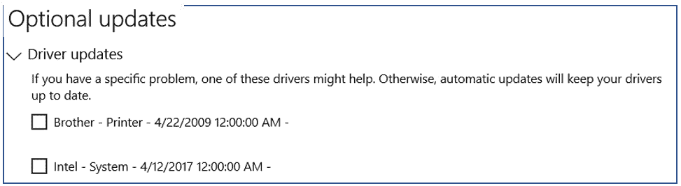

# 第六章：*第六章*：保护 Windows 基础设施

*"作为一名发明家和研究人员，我意识到一个组织的易受攻击程度取决于基础设施是如何实施、管理和设计的。"*

*– Sarbajit Rakshit，IBM 大师发明家*

几乎所有公司在其基础设施中都有 Windows 系统，无论是作为工作站、服务器还是目录服务。因此，要精通网络安全的艺术，您需要了解应用哪些策略、技术和工具，以及*如何*和*何时*应用它们来达到所需的安全级别。

要达成这些目标，我们将涵盖以下主要主题：

+   如何在 Windows 服务器上应用最佳的加固策略

+   创建您自己的 Windows 服务器加固检查表

+   设计世界级的补丁策略

+   关于 Windows 系统的所有不同类型补丁的概述

+   关于**Active Directory**（**AD**）的最佳网络安全实践

+   一个关于端点安全最佳实践的指南

+   概述如何利用加密来保护您的数据安全

# 技术要求

对于本章节，没有硬性要求；但是，如果能访问到 Windows 10 的机器来测试我们在本书中将要涵盖的一些概念（如补丁、加密、策略等），将会很有用。

# 应用 Windows 加固

没有什么是不可能被突破的；只要足够困难，就会使攻击者转而选择其他目标。

正如您所知，**加固**是一个用来保护特定服务器免受攻击的所有技术的花哨名字。虽然加固并非百分百安全的解决方案，但其目的是将服务器的安全性提高到可接受的水平，以防范大多数攻击。

通常情况下，一个正确加固的服务器应该能够抵御所有脚本化或自动化的攻击。

通常有两种方式可以应用加固，如以下所述：

+   由一个独立团队（**信息技术**（**IT**）基础设施）应用

+   另一个由安全团队（您）应用

让我们看看在由基础设施团队执行加固时，您的责任是什么。

## 由基础设施团队进行加固

在这种情况下，加固是由另一个团队执行的；但是，您可能仍需负责确保服务器安全，因此在这种情况下，您至少需要执行以下操作：

+   为团队提供最低加固要求的*检查表*。

+   定期进行审核，确保服务器具备最低的加固要求。

让我们看看如何创建一份**全面的加固检查表**，您可以提供给基础设施团队，以确保至少执行了必需的最低步骤。

## 创建一个加固检查表

加固检查表将受到多个因素的影响，包括公司风险承受能力、网络安全政策和适用的法规。在这里，我们将回顾创建最终**Windows 加固检查表**所需的最常见项目。

无论由谁负责执行 Windows 加固，本检查表将包含确保 Windows 服务器具有基本保护的基本项目。

现在让我们看看加固检查表的必需元素。

### 支持的操作系统版本

这是一个非常重要的因素，因为尽管较新版本的 Windows 引入了许多安全功能，例如 Windows Server 2019 中引入的 Windows Defender **高级威胁防护**（**ATP**），但旧版本的安全性较低，因此你应尽量鼓励在新构建的服务器上使用较新版本。

以下是应包含在检查表本节中的一些规则：

+   切勿允许不受支持的 Windows 服务器版本出现在你的基础设施中。

+   保持服务器基础设施的清单，其中应包括*支持结束*日期。

+   制定计划，在未来的*支持结束*服务器的*支持结束*日期生效前至少一年开始迁移。

+   制定一项政策，要求所有服务器在投入生产前必须包括所有更新、补丁和服务包。

如果由于预算不足而无法升级服务器，建议创建一份风险信，列出将旧服务器保留在基础设施中的所有网络安全风险（包括相关成本），并将其提交给高层管理人员。这样，他们将为新服务器提供预算或接受风险，在这种情况下，你的后盾就有保障。

### Windows 服务和功能

Windows 服务器有一组默认的服务，这些服务会在启动时自动启动。虽然许多这些服务是操作系统正常运行所必需的，但其中一些是可选的，并且可能存在潜在的安全漏洞。

尽管新版本只加载最低限度的必需服务，旧的操作系统服务器版本可能需要额外的调整以禁用一些非必要服务。

以下是关于此主题应包含在检查表中的一些项目：

+   请要求每位服务器所有者创建启用的服务清单，并为每个特定服务提供理由。

+   请要求服务器所有者至少每季度验证一次服务，以确保未使用的服务被禁用。

+   请要求服务器所有者创建一份*风险证明信*，如果运行的任何服务在公司网络安全政策中被列为*高风险*。

以下截图展示了一个示例的理由清单：

图 6.1 – 服务理由清单

此外，还需考虑到 Windows 服务以特定用户的安全上下文运行（本地系统、本地服务或网络服务账户）。然而，对于*应用程序*和*用户服务*，建议设置特定账户（本地或在 AD 中），以最小权限处理这些服务。

### 端口和协议

与服务类似，**端口和协议**应保持在最低限度，以减少潜在的攻击面。

检查清单项包括以下内容：

+   请每位服务器管理员创建一份开放端口列表（包括说明）。

+   请服务器管理员至少每季度验证一次开放端口，以确保所有开放端口都在使用中。

+   请要求服务器管理员创建一份*风险说明信*，以防任何开放端口在公司网络安全政策中被列为*高风险*。

犯罪分子常用的一种技术是扫描端口，因此，遵循这些简单步骤将大大增强服务器的安全性。

### 用户管理

也称为**身份与访问管理**（**IAM**），通常由一个独立的团队处理，该团队按照 IAM 流程创建、删除和禁用用户**标识符**（**ID**）。

以下是我们检查清单的相关要点：

+   所有用户管理应由 IAM 团队创建。

+   所有本地用户必须由 IAM 团队创建。

+   所有服务器管理员必须遵循 IAM 流程（创建、删除、禁用和更新用户账户）。

+   所有账户必须有相关人员作为负责人。

+   账户应根据**最小权限原则**（**PoLP**）创建。

+   密码策略必须由系统（服务器或 Active Directory）强制执行。

+   防止用户禁用**用户帐户控制**（**UAC**）。

+   阻止微软账户登录。

+   阻止访客账户。

+   账户锁定必须与当前网络安全政策对齐。如以下截图所示，这是在 Windows **本地组策略编辑器**中配置的：

图 6.2 – 锁定策略：Windows 组策略编辑器

+   禁用默认的*管理员*账户（此账户因禁用账户锁定，容易遭受暴力破解攻击）。

+   限制使用空白密码的用户。

其他事项将在*应用安全到 AD*部分中讨论。

### 监控

你需要随时保持对基础设施的控制，监控和日志在需要进行取证时至关重要。因此，有一些重要项应包括在我们的检查清单中，具体内容如下：

+   确保所有服务器都启用了*日志*。

+   确保*公司监控系统*在所有生产服务器上加载并运行。

请查看以下截图：

图 6.3 – 审核策略：Windows 组策略编辑器

如前所示，可以在 Windows 的`高级审计策略配置`文件夹中访问这些设置，以进行配置和验证（审计）。

### 清单的额外考虑事项

+   如果可用，确保**控制流保护**（**CFG**）和**数据执行防护**（**DEP**）已开启。通常，它们默认是**开启的**，但你可以通过以下步骤检查状态：

    1.  进入**Windows Defender 安全中心**。

    1.  点击**应用和浏览器控制**。

    1.  选择**漏洞保护设置**。

    1.  进入**系统设置**，你会看到**控制流保护**（**CFG**）和**数据执行防护**（**DEP**）的选项，如下图所示：

图 6.4 – Windows 嵌入式漏洞保护

+   在服务器上请求一个强大的杀毒解决方案（这可以是第三方解决方案或 Windows Defender）。

+   启用**Windows AppLocker**。

+   确保**基本输入输出系统**（**BIOS**）受到密码保护。

+   启用**安全启动**。

+   所有卷应为 NTFS 格式（不允许使用 FAT 格式）。

+   禁用将未加密的密码发送到第三方**服务消息块**（**SMB**）服务器。

+   仅允许在**LAN Manager**认证级别使用**NTLMv2**，拒绝使用**LM**和**NTLM**。

+   配置**Microsoft 网络服务器**以始终对通信进行数字签名。

+   确保**匿名 SID/名称转换**已禁用。

+   应禁用**SAM 账户和共享的匿名枚举**。

+   不允许匿名访问共享驱动器。

+   如果可用，启用基于云的保护，如**Microsoft 操作管理套件**（**OMS**）。

+   确保启用了加密（**加密文件系统**（**EFS**）或**BitLocker**）。

+   如果服务器托管一些**虚拟机**（**VM**），确保启用了**虚拟机可信平台模块（TPM）**，因为它将支持高级安全技术，如**BitLocker 驱动器加密**。

现在，是时候看看如何创建一个企业级的补丁管理策略了。

# 创建补丁管理策略

你有多少次听过，“*如果系统能够正确打补丁，这次攻击是可以防止的*”？而这些攻击的成本从数百万美元到破产不等，那么问题是：*为什么这种情况仍然发生？*

好吧，答案是补丁管理并不像看起来那么简单。

## 补丁管理的复杂性

让我们来看看与补丁管理相关的最常见的复杂因素。

### 传统系统

几乎所有公司都有一定程度的传统系统在生产中。大多数时候，这是因为某些应用程序只设计在特定的操作系统上运行，迁移到支持的操作系统可能会引发兼容性问题，因此公司决定接受这个风险。

问题在于，在这些情况下，你可能会遇到一些不受支持的操作系统（甚至应用程序、服务和协议），这会给你的基础设施带来额外的风险。

补丁遗留系统的建议如下：

1.  进行测试，确定是否可以迁移到受支持的操作系统。

1.  研究可以替代这些遗留应用程序的其他系统。

1.  如果前两个选项不可行，那么确保系统已安装最新的可用更新（补丁和热修复）。

1.  从系统中删除所有不必要的应用程序。

1.  将启用的端口减少到应用程序所需的最小值，并禁用其余端口。

1.  禁用所有未使用的服务。

1.  禁用所有未使用的启动应用程序。

1.  禁用**远程桌面**（**RDP**）。

1.  避免让这些服务器面向互联网，如果需要，应用额外的安全机制，如要求**虚拟私人网络**（**VPN**）进行连接。

1.  安排定期维护（至少每季度一次），以检查服务器状态。

此外，定期验证你的服务器环境（至少每年两次）也是一种良好的做法，以确保哪些服务器仍在使用（并删除任何*幽灵*或*未使用*的服务器）。

### 依赖关系和兼容性问题

大多数应用程序有很多依赖项，如 .NET Framework、**Java 运行时环境**（**JRE**）、**PHP：超文本预处理器**（**PHP**）等，这意味着为了正确运行这些应用程序，你需要在操作系统中安装并运行这些框架。

大多数情况下，这些框架具有**向后兼容性**，意味着它们也会支持为旧框架创建的应用程序。然而，这并非总是如此，在某些情况下，你需要保留旧框架才能保持你的遗留应用程序运行。

在这种情况下，建议采取以下措施：

1.  评估是否有较新的应用程序可以替代遗留应用程序。

1.  评估、记录并向高层管理人员展示这些风险，以便他们决定是否愿意接受这些风险。

1.  评估该应用程序管理的数据，并以此为输入来确定风险的影响。

1.  如果涉及较高的风险，查找已知漏洞（与该版本的依赖项相关，访问[`cve.mitre.org/`](https://cve.mitre.org/)），以确定并应用解决方法来降低攻击风险。

1.  将机器隔离，仅用于托管该应用程序，以减少风险范围。

现在，是时候展示如何开始创建你的补丁策略了。

## 任务分配（补丁角色和分配）

在大多数公司中，补丁更新由 IT 基础设施团队执行。然而，在网络安全方面，你可能负责确保所有服务器都已正确打补丁，因此这里有一些建议，确保你与基础设施团队之间的顺利协作：

+   一起合作制定补丁时间表。

+   创建一个*RACI 矩阵*，以确定谁负责、谁有责任、谁被咨询以及谁需要了解服务器上的更新安装和部署。

+   建立一个流程来请求紧急的补丁和热修复。

+   创建一个通讯计划，包含整个 IT 团队的联系信息。

+   创建一个责任矩阵，包含所有有关服务器和支持它们的团队的相关信息。您可以在以下截图中查看责任矩阵的示例：

图 6.5 – 操作系统支持责任矩阵

前面的操作系统支持责任矩阵有五列；不过，您可以根据需要扩展它，以包含所有相关信息。

还请确保定义清楚谁负责更新这些文档，它们将被存储在哪里，以及多久更新一次。

## 补丁的分发和部署

在小型基础架构中，这可能是一项简单的任务，但当您有多个服务器集群，且有成千上万台运行多种操作系统的服务器时，这就变得非常复杂。

虽然此任务通常由平台团队执行，但您理解它的工作原理至关重要，原因如下：

+   在某些情况下，您将需要负责管理更新。

+   这些知识将帮助您更好地根据情况调整您的防御策略。

现在，让我们来看看如何部署更新。

### Windows Server 更新服务

**Windows Server 更新服务**（**WSUS**）使您能够通过管理控制台管理和分发最新的 Microsoft 产品更新。

基本上，WSUS 服务器将使您能够执行以下操作：

+   集中管理更新

+   更新管理自动化

您可以在以下截图中查看可用的不同服务器角色概述：

图 6.6 – 将 WSUS 安装为 Windows 服务器角色

如前面的截图所示，WSUS 是一个内置的服务器角色。一个有趣的事实是，您可以在基础架构中拥有任意数量的 WSUS 服务器，但至少有一台需要连接到**Microsoft Update**以获取可用的更新信息（这称为**上游服务器**）。

提示

请记住，还有许多由第三方提供的其他替代*补丁管理工具*，如 **SolarWinds Patch Manager**、**AutoPatcher**、**Kaseya VSA**、**ManageEngine Patch Connect Plus**、**Ivanti PatchLink** 等。

WSUS 有两个主要界面，一个是通过 PowerShell 的**命令行界面**（**CLI**），另一个是内置的可视化界面，如下图所示，它提供了大量有关要在您的基础架构中部署的更新的信息、这些更新的分类等：

图 6.7 – WSUS 图形用户界面（GUI）

现在，部署更新并不像单击一下那么简单。实际上，为了避免中断，公司有一套规则，旨在避免在修补过程中中断某些服务的风险。这个过程叫做**变更管理**。

### 变更管理过程

大型企业无法冒险让其业务因补丁安装失败而导致服务器崩溃，从而造成数百万美元的损失。相反，它们有一套组织良好的*变更管理过程*，明确规定了何时可以进行服务器维护。

根据公司情况，这些*维护窗口*可能是每月或每季度一次，通常计划在一个*时间限定*的期间内执行，并包括一个**恢复时间**（**TTR**）窗口，以便在出现问题时恢复系统到原始状态。

操作系统更新通常会在这些维护窗口期间安装，因此，您需要熟悉变更管理过程，以确保关键更新能够在即将到来的维护窗口内安装。

## 补丁类型

让我们来回顾一下适用于基于 Windows 系统的不同类型更新。

请考虑到，为了帮助您优先部署，它们会根据重要性（从网络安全角度来看）进行分类。

分类为**关键**（意味着必须尽快安装）、**必需**（必须在下次修补窗口优先安装）和**次要**（可选更新）。这些更新在此处有更详细的说明：

+   **更新**：修复一个被认为是非关键的问题，例如一个非安全相关的错误。由于缺少此更新不会影响服务器的性能或安全性，因此这些更新被视为*次要*更新。

+   **关键更新**：这旨在修复一个特定的*非安全相关*的错误。通常，这类更新会发布给大量用户。即使这与安全无关，它也可能修复一些与性能和稳定性相关的问题，因此应被视为*关键更新*。

+   **定义更新**：这通常是包含产品定义数据库添加内容的软件更新。如以下截图所示，这些定义数据库通常用于防止恶意代码、钓鱼网站或垃圾邮件带来的攻击：

图 6.8 – Windows 定义更新

由于其中一些可能会防止已知的安全攻击向量，它们被认为是*关键*更新。

+   **安全更新**：此更新旨在修复一个与产品相关的安全漏洞。

    通常，这些漏洞会根据严重性被评定为关键、重要、中等或低级，如 Microsoft 安全公告中所示。

    提示

    Windows 安全更新带有两个重要文档，提供关于漏洞的详细信息。它们分别是*安全公告*和*Microsoft 知识库文章*，并且提供了关于修复漏洞的非常有用的见解。

+   **驱动程序**：有时，Windows 会提供更新其内置驱动程序（基本驱动程序）的目录，以改善或修复某些功能。如以下截图所示，这些更新有时被操作系统视为可选驱动程序，因为它们可能不适用于所有用户：

图 6.9 – Windows 驱动程序更新

考虑到缺少此更新不会危及系统的完整性或当前功能，因此它们被视为*次要*。

+   **功能包**：*新产品功能*，在即将发布的完整产品之前分发给用户。由于这些更新与*新功能*相关，而不是为了防止或修复某个问题或错误，因此它们被认为是*次要*更新。

+   以下是**功能更新**在 Windows 上的截图：

图 6.10 – Windows 功能更新

如前面的截图所示，当**功能更新**安装后，会有一个链接，您可以查看该更新中包含的新功能的详细信息。

+   **服务包**：微软在发布系统更新方面做得非常好，但这意味着随着时间推移，对于某个操作系统可能会有大量更新可用。因此，一旦有一定数量经过测试的热修复、更新、安全更新和关键更新，它们就会被打包成一个服务包。

    服务包可能还包含其他更新，包括客户要求的设计更改或功能。

    服务包是操作系统的重大更新，因此强烈建议先在测试环境中进行测试，然后再大规模部署到生产服务器中。

    由于它们包含了确保操作系统稳定性和安全性的关键更新，因此它们被认为是*关键*更新。

+   **更新累积包/月度累积包**：一个集合了热修复、安保更新、关键更新和更新的包，便于部署。这基本上是服务包的缩小版。更新累积包通常是基于相同功能的汇编，而月度累积包是根据更新发布的月份来编排的。由于它们包含了确保操作系统稳定性和安全性的关键更新，因此被认为是关键的。

现在你已经掌握了所有关于 Windows 更新的知识，是时候进入下一个话题，了解*如何保护 AD*了。

# 应用安全性到 AD

尽管没有关于保护 AD 的官方指南或标准，以下是可以帮助你增强 AD 服务器安全性的*行业最佳实践*汇编：

+   切勿在域控制器上安装额外的软件、角色或服务。

+   永远不要在域控制器上创建本地用户（用户管理必须在域控制器上谨慎处理）。

+   确保根据 PoLP 创建账户。

+   保持 AD 权限账户的记录（列表），包括所有者、权限以及与账户相关的其他数据（以防止幽灵账户）。

    提示

    **幽灵账户**是指那些所有权或使用情况不明确的账户。虽然在小型基础设施中这可能不是问题，但在大型环境中，如果没有遵循最佳实践，可能会有数十个这样的账户，这对你的基础设施构成重大风险。

+   不应使用 AD 权限账户登录工作站（这会增加账户被攻破的风险）。

+   避免将 AD 权限账户保持为禁用状态（最佳实践是如果权限账户不再使用，应该将其删除）。

+   所有日志都应启用。

+   必须优先在域服务器上安装安全更新。

+   如前所述，最新版本的 Windows Server 通常包含一组新的安全功能，因此在可能的情况下，使用最新版本的 Windows Server 来托管域控制器。

+   尽可能启用**多因素认证**（**MFA**）。

+   定期审查（审核）AD 权限账户。

    提示

    必须特别保护 AD 中三个内建组，它们在目录中拥有最高权限（企业管理员、域管理员和管理员）。

+   定期备份。

+   通过配置故障转移集群确保**高可用性**（**HA**）。你可以在[`docs.microsoft.com/en-us/windows-server/failover-clustering/failover-clustering-overview`](https://docs.microsoft.com/en-us/windows-server/failover-clustering/failover-clustering-overview)上阅读更多内容。

+   避免永久性地加入高权限组。相反，只在需要时授予临时成员资格。

+   在*创建自定义组*时，请确保使用特定且易于理解的名称——例如，*IT-Helpdesk*而不是*Group-x031*。

+   必须禁用 SMB 版本 1。可以通过 Windows 注册表禁用，或者如以下截图所示，也可以通过启用/禁用 Windows 功能的 GUI 来禁用/验证：

图 6.11 – Windows 功能

此外，大多数组织需要在另一台计算机上执行 AD 的管理任务——例如，IT 支持人员执行密码重置，或网络管理员进行**域名系统**（**DNS**）更改。

这些系统被称为**安全管理主机**，接下来我们将探讨必须应用于这些系统的一些安全最佳实践。

## 保护管理主机

如前所述，**安全管理主机**是指可以使用权限账户在 AD 中执行管理任务的系统（工作站或服务器）。

这里是一些关于如何将这些系统配置为安全平台的最佳实践：

+   在这些系统中启用多因素认证（MFA）。

+   审查这些系统的物理安全性，以确保它们处于安全区域内。

+   限制权限并防止安装任何额外的软件。

+   避免在这些系统上安装和使用电子邮件。

+   微软甚至建议避免在这些系统上安装 Office。

+   它们*必须*运行受支持并完全修补的操作系统。

+   应该禁用**通用串行总线**（**USB**）端口。

+   在可能的情况下，必须移除或断开媒体读取器（**数字视频光盘**（**DVD**）、**标清**（**SD**）等）。

+   必须禁用自动运行。

+   确保安全管理主机的安全功能与域控制器相同。

+   必须禁用互联网浏览功能。

此外，在可能的情况下，使用虚拟机（VM）作为安全的管理主机。首先，虚拟机在不使用时可以轻松关闭；其次，你可以配置它们在每次使用后恢复到默认快照，以保持系统的干净。

## Windows Server 安全文档

在这里，你可以找到关于操作系统内置的多个保护层的额外文档（包括视频），这些保护层可以帮助防止安全漏洞和恶意攻击，并确保数据和基础设施的安全：[`docs.microsoft.com/en-us/windows-server/security/security-and-assurance`](https://docs.microsoft.com/en-us/windows-server/security/security-and-assurance)。

现在，您已经学习了有关**Windows Server 安全性**的所有知识，是时候开始了解如何增强您基础设施中所有**Windows 工作站**的安全性了。

# 掌握终端安全

我们回顾的许多服务器最佳实践同样适用于工作站，因此我们不再重复它们，而是来看看一些特别适用于工作站的额外安全机制和工具。

## Windows 更新

我们已经讨论了补丁更新操作系统的重要性；然而，我想强调的是，你可以利用 WSUS 来向工作站分发更新。以下是微软提供的一个详细的分步指南，教你如何配置它：[`docs.microsoft.com/en-us/windows/deployment/update/waas-manage-updates-wsus`](https://docs.microsoft.com/en-us/windows/deployment/update/waas-manage-updates-wsus)。

## 为什么迁移到 Windows 10？

如前所述，有许多理由保持系统运行最新版本的操作系统，但在这里，我们将重点介绍一些额外的考虑因素，解释为什么迁移到 Windows 10 是一个好主意。

### Windows 作为一种服务

过去，微软每隔几年发布一个新版本的 Windows，这给 IT 专业人员在规划和部署方面带来了一些挑战。

现在，新的 Windows 10 是基于一个名为“Windows 即服务”（Windows as a Service）的概念创建的，这意味着微软将不再创建新的 Windows 版本（如 Windows 11），而是通过两种发布类型持续提供 Windows 10 的更新：**功能更新**，每年两次增加新功能，以及**质量更新**，每月至少提供一次安全和可靠性修复。

因此，采用这种新方法，微软计划简化 IT 专业人员的工作，并为其客户保持一致的 Windows 10 使用体验，同时确保系统具备最新的安全功能和更新。

若需了解有关这一新模型的更多信息，请访问官方站点：[`docs.microsoft.com/en-us/windows/deployment/update/waas-overview`](https://docs.microsoft.com/en-us/windows/deployment/update/waas-overview)。

### **Windows 10 安全选项**

有许多*安全策略设置*，允许你配置 Windows 10 机器的行为。这些设置可以在本地配置，或在**组策略对象**（**GPO**）中配置，应用于所有受该 GPO 管控的设备。

熟悉这些策略设置并根据组织的安全政策进行调整非常关键。在这里，你可以找到所有安全策略设置的列表，包含简要描述以及推荐的设置：[`docs.microsoft.com/en-us/windows/security/threat-protection/security-policy-settings/security-options`](https://docs.microsoft.com/en-us/windows/security/threat-protection/security-policy-settings/security-options)。

## 物理安全

物理安全是终端安全最重要的方面之一，因此在这里，我们将探讨一些你需要实施的最基本的建议，以确保系统的安全。

如在*第二章*中提到的，*管理威胁、漏洞和风险*，大多数计算机当前都存在与 USB 端口相关的漏洞，因为它们利用了计算机对**人机接口设备**（**HID**）设备（如键盘和鼠标）的固有信任。因此，我们需要确保*USB 端口无法被外部用户物理接触（主要针对客户服务角色或其他面向客户的角色的用户）*。

此外，必须实施多种机制以防止计算机被盗，我们将在*第九章*中深入讨论，*物理安全的深度探讨*。

## **杀毒软件解决方案**

这是一个基本的网络安全组件，你应该已经了解，因此无需花费太多时间在这一部分。相反，让我们简要总结一些关于使用杀毒软件解决方案的规则，如下所示：

+   在整个组织中使用相同的杀毒软件解决方案。

+   防止安装额外的杀毒软件解决方案（使用技术性和管理性控制）。

+   防止禁用或卸载企业级防病毒解决方案。尽可能地，此操作应当触发警报，通知 IT 安全团队和管理层（这作为一种非常有效的威慑手段）。

+   将 Windows Defender 视为一个出色的企业级防病毒解决方案。

+   始终保持自动更新开启（唯一的例外是当你通过内部服务器管理更新的部署时）。

    提示

    管理控制是所有基于规则、政策和法规的控制。通常，它们通过审计、处罚或**人力资源**（**HR**）行动来执行。另一方面，技术控制是所有通过使用技术组件（如**入侵防御系统**（**IPS**）、**入侵检测系统**（**IDS**）、防火墙和防病毒解决方案）来跟踪和执行的控制。

请记住，没有完美的防病毒解决方案。我认为，随着时间的推移，你会有自己的偏好，这些偏好也可能基于需求；例如，你可能喜欢某个防病毒解决方案用于个人使用，但可能会对企业使用有不同的偏好（因为有高级工具，如部署选项、警报和管理员控制台）。

## Windows Defender 防火墙

启用**Windows Defender 防火墙**是一个好主意，因为它作为额外的安全层。正如前面提到的防病毒解决方案，你必须实施一些管理控制和技术控制，防止并检测是否有人禁用它。

如下截图所示，你可以在每台工作站上本地配置防火墙，或通过**组策略**进行管理。此外，你还可以看到它根据连接的网络具有不同的配置文件。

图 6.12 – Windows 防火墙配置

另一个常见问题是，当出现网络问题时，IT 帮助台可能会暂时禁用 Windows Defender 防火墙作为临时解决方法；然而，你需要与他们制定一个政策，防止这种做法，鼓励他们进行**根本原因分析**（**RCA**），以确定问题的真实原因，同时不影响设备的安全性。

## 应用控制

在这里，你可能会面临两种选择：要么移除用户安装应用的权限，要么实施技术控制来监控用户安装的应用。两种选择各有优缺点——例如，从安全角度来看，限制用户权限可能是最简单的方法；然而，这会显著增加与用户因业务需求而需要安装应用的帮助台工单数量。另一方面，如果你授予所有用户管理员权限，则在安全性方面的风险会更高，你必须通过实施额外的安全控制来减轻这种风险。

## URL 过滤

你可以应用**统一资源定位符**（**URL**）过滤器来防止用户访问危险网站或可能影响网络带宽的网站。即使这听起来像个笑话，很多员工在连接到公司网络时会访问流媒体网站或应用观看电影，*因此也需要防止这种情况*，因为首先，大多数免费流媒体网站充满了恶意软件，其次，这可能会影响网络的可用性和带宽。

## 垃圾邮件过滤

我知道这非常基础，但既然这也非常重要，请记住，除了在邮件服务器上进行配置外，你还可以通过使用大多数邮件客户端中包含的垃圾邮件过滤器来增加额外的安全层。

此外，你还可以创建一些规则来防止其他电子邮件攻击。例如，如下图所示，你可以配置你的电子邮件自动标记外部邮件（例如，通过在邮件标题中添加**EXTERNAL**一词）。这个简单的动作将有助于防止伪造和钓鱼攻击。

图 6.13 – 自动标记外部邮件

例如，你可以通过在 Office 365 或 Exchange 服务器中创建一个规则来轻松实现这一点。你只需要创建一个新规则，选择将其应用于所有来自外部组织的邮件，选择应用对象，选择操作（在此案例中，**对邮件应用免责声明**），然后就完成了！相信我，这些非常简单的步骤将为你节省很多麻烦。

## 面向客户的系统

根据你的业务需求，可能会有一些系统需要外部用户访问（例如，供用户进行一些自助操作的计算机）。这些系统必须与网络隔离（如果可能，使用独立的互联网连接）。但是，它们也必须是安全的，以保护客户免受攻击。在这里，最好的建议是安装能够在系统重启后恢复到初始状态的软件（例如 Deep Freeze）。为了提高安全性（例如，在金融机构中），你可以在每个用户使用系统后进行回滚。

此外，这些计算机的外壳（根据国家的不同，它们可能被称为**CPU**、机箱等）必须与用户隔离，用户只能访问键盘、屏幕和鼠标（以防止连接如键盘记录器等危险设备）。

## 备份

你必须确保为用户提供一个已预安装并在所有工作站上配置的备份解决方案。

此外，你需要确保至少每年进行一次教育活动，向用户宣传备份的重要性、可用的工具以及不被批准使用的工具。

这非常重要，原因有二：首先，你需要确保所有用户都有可用的备份解决方案，以便在灾难发生时保持文件的安全副本；其次，你必须防止用户使用不安全的备份机制——例如，未经批准的云解决方案或外部 USB 驱动器。

提示

无论你做了多少次安全意识宣传活动——可以放心的是，如果有人丢失了数据（因为没有备份），你将是第一个被责备的人。所以，为了防止这种情况发生，你必须确保备份政策明确说明：*定期执行备份并进行测试是用户的责任*。你还可以补充：*如果出现错误，用户有责任通过官方（预定的）渠道报告给 IT 安全部门*。

## 用户

我们专门花了整个*第四章*，*补丁层 8*，来讨论用户；然而，我们还需要考虑一些额外的步骤，涉及到用户可能引入的漏洞，具体如下：

+   **用户个人设备**：你需要实施必要的技术和管理控制，防止用户的个人设备（包括**物联网**（**IoT**）设备）连接到你的公司网络。

+   **外设**：任何连接到你基础设施的额外设备都代表着额外的风险，因此，为了防范这些风险，你必须限制在公司终端上使用个人外设。从打印机到 USB 键盘，它们都可能构成安全漏洞，因此在公司环境中必须限制其使用和安装。这可以通过明确的用户政策和一些技术控制来实现，以防止或警告在安装个人外设时发生的情况。

## 数据安全

被盗的笔记本电脑可以很容易替换；然而，敏感企业信息的泄露，如知识产权或商业机密，可能对公司致命，在某些情况下甚至可能导致破产。因此，确保数据安全应当是你的优先任务，加密数据是一个很好的方法。

# 利用加密

作为第一步，你需要了解适用的法规和法律，以确定是否对你的组织（或其中某一部分）有特定的加密要求。例如，以下截图展示了**支付卡行业数据安全标准**（**PCI DSS**）和**健康保险流通与问责法案**（**HIPAA**）之间的不同加密要求：

图 6.14 – PCI 和 HIPAA 加密要求

然而，你不应该仅仅根据合规要求来制定加密政策。相反，你应当根据以下考虑因素，制定一个*强健的加密政策*：

+   实施全盘加密（例如，BitLocker）。

+   实施电子邮件加密。

+   实施文件级加密（用于敏感数据）。

+   加密备份。

+   创建宣传活动，展示加密的重要性，以及为何它必须在所有层面（数据静态、传输中等）应用。

+   在你的**自带设备**（**BYOD**）政策中，要求加密作为一项要求。

+   通过实施 VPN 加密传输中的数据。

+   确保在你的网页上实施**安全套接字层**（**SSL**）来加密数据。

+   确保你的通信工具（包括企业聊天）启用了**点对点**（**P2P**）加密。

+   实施密钥管理解决方案（如**Azure 密钥保管库**）以保护云应用程序和服务使用的加密密钥和密钥。

基于 Windows 的系统内置了加密硬盘的选项。此外，Windows 10 的高级版本还提供了一个名为**BitLocker**的工具，用于配置加密设置（包括整个硬盘加密）。

## 配置 BitLocker

要启用它，只需在 Windows 启动菜单的搜索框中输入`Manage BitLocker`，即可访问管理控制台，在其中可以开启或关闭**Windows BitLocker**。

某些版本的 Windows（如家庭版）可能没有**Windows BitLocker**；相反，它们会提供一个简化的设备加密系统。要启用此功能，你需要进入**开始** | **设置** | **更新与安全** | **设备加密**。如果没有列出此项，则表示该版本的 Windows 不支持设备加密。

# 总结

在本章中，我们学习了有关 Windows 服务器的最佳实践和策略，以及何时应用它们。之后，你学习了如何为 Windows 服务器创建加固检查表，这对我们和负责服务器管理的团队将具有极大的价值。

此外，我们回顾了 Windows 系统的所有不同类型的补丁及其在网络安全方面的重要性。然后，你学习了如何创建补丁策略以确保基础设施的安全。我们还回顾了大量的最佳实践，以保持你的 AD 安全。

最后，我们查看了保持 Windows 工作站安全的最重要实践，包括如何利用加密提高整体基础设施的安全性。

现在，你已经掌握了 Windows 安全的各个方面，是时候了解如何加固 Unix 服务器，所有相关内容将在下一章讲解。
