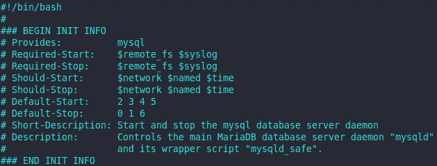
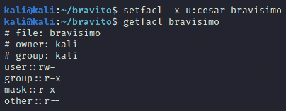

# 第七章：*第七章*：加固 Unix 服务器

*“加固的服务器极大地减少了攻击面，从而最小化了暴露于威胁的风险。它有助于摆脱较弱的默认设置并符合合规要求。”*

*– Faraz Ahmad，IT 安全顾问*

如果你习惯了管理**Windows** 系统和服务器，那么管理基于**Unix** 的系统和服务器可能会变得非常复杂。但别担心，我们会从基础开始，让你可以轻松跟随本章内容。

在这里，我们将覆盖大多数 Unix 系统（包括**Linux**）中使用的命令。尽管不同的 Unix 系统可能存在一些差异，本章中的结构和示例应该适用于最常见的 Unix 系统（包括 Linux）。

在本章中，我们将涵盖以下主要内容：

+   Unix 服务的完整指南（它们如何工作以及如何管理它们）

+   在 Unix 系统上权限是如何工作的

+   详细概述 Unix 系统中不同类型的权限（文件、文件夹、用户等）

+   使用 `umask` 进行高级权限配置

+   通过使用访问控制来增强你的防御性安全

+   管理访问控制列表

+   使用**iptables**配置基于主机的防火墙

+   利用日志文件的最佳实践

# 技术要求

对于本章，强烈建议你使用类 Unix 系统（如**Kali Linux**、**Debian**、**Ubuntu** 等）。本章包含大量截图，以便你能够看到所用命令的输出。然而，如果你能在阅读本书的同时自己测试这些命令，将会非常有价值。

一个非常好的选择是创建一个**虚拟机**（**VM**），这样你就可以通过 Kali 在你的电脑上轻松运行它。实际上，你会在本章末尾找到 Kali Linux 下载页面的链接。在那里，你可以下载一个预配置的虚拟机，准备在你喜欢的虚拟化软件（**VirtualBox**、**VMware** 等）中打开。

# 保护 Unix 服务

服务是后台运行的应用程序，执行或支持基本的**操作系统**（**OS**）任务。还有一些与应用程序或服务相关的服务，比如**Apache**、**结构化查询语言（SQL）**、**超文本预处理器（PHP）**、**远程过程调用（RPC）** 等。

许多服务默认加载并启用。然而，每个启用并运行的服务都代表一个潜在的漏洞，需要考虑和管理。

因此，为了减少这些风险，让我们回顾一些与 Unix 服务相关的最佳实践（以及一些额外的服务器设置注意事项）。

## 定义服务器的目的

Linux 服务器应该专门用于单一目的。例如，打印服务器、FTP、Web 服务器等。这个简单的任务将使加固工作变得更容易。

过去，拥有专用服务器是昂贵且难以获得的。然而，借助云技术，创建和管理每个目的的专用服务器变得非常容易，且不会在成本上产生显著增加。

## 安全启动配置

现在你已经定义了服务器的用途，下一步是通过移除所有不必要的应用程序、功能和协议来安全地配置操作系统，以避免不必要的风险。

这也将减少补丁工作的难度，因为需要补丁和加固的应用程序会减少，同时减少攻击面。

## 管理服务

第一步是确定哪些服务正在运行，以及它们的当前状态。

为此，我们可以执行以下命令：

```
service --status-all
```

此命令将运行 `init` 脚本，显示服务列表及其关联的状态。状态以括号表示，其中 `[ + ]` 表示服务正在运行，`[ - ]` 表示服务已停止，`[ ? ]` 表示对于没有返回状态的服务，返回 `?`。

如下图所示，像 SQL 和 **蓝牙** 这样的服务并不是必需的，因此它们目前被禁用：


图 7.1 – 已安装服务列表

要获取有关服务的更多信息，可以在 `/etc/init.d` 中找到每个服务的 `init` 脚本。

例如，下面的图展示了 MySQL `init` 脚本的信息。这些信息在确定服务是否必要时非常有用：



图 7.2 – MySQL init 脚本

此外，该脚本通常支持 `start` 和 `stop` 命令来更改服务的状态。例如，我们可以使用以下命令来启动 `ssh` 服务：

```
service ssh start
```

以下图展示了 `ssh` 服务是如何运行的，我们如何成功停止它，并且如何通过 `status` 命令进行验证：


图 7.3 – 停止运行的进程

请注意，`status` 命令还会提供一些其他有趣的信息，如进程的运行时间、端口、PID、内存使用情况等。

### 在 systemd 初始化中管理服务

另一种管理服务的方法是使用 `systemd`，通过以下命令（我们将以 `mysql` 服务为例）：

+   检查服务的状态（`mysql`）：

    ```
    inactive), while *Figure 7.5* shows the output when the service is active (running):
    ```


图 7.4 – mysql 服务状态

+   启动服务（`mysql`）：

    ```
    mysql service is now running:
    ```


图 7.5 – 正在运行的服务

+   重启服务（`mysql`）：

    ```
    systemctl restart mysql
    ```

+   检查服务是否配置为在下次启动时自动启动（`mysql`）：

    ```
    systemctl is-enabled mysql
    ```

+   启用 `mysql` 服务在启动时运行：

    ```
    systemctl enabled mysql
    ```

+   禁用 `mysql` 服务在启动时运行：

    ```
    systemctl disabled mysql
    ```

+   检查 `mysql` 服务是否处于活动状态：

    ```
    systemctl is-active mysql
    ```

请记住，`systemd` 在大多数 Unix 发行版中都存在，但如果系统中没有此项，您将看到以下错误：

```
systemctl is not installed
systemctl: command not found
```

现在，让我们来看一下如何使用 `systemd` 删除服务。

### 在 systemd 启动过程中删除服务

现在，让我们来看一些额外的命令来删除服务：

+   停止服务（`mysql`）：

    ```
    systemctl stop mysql
    ```

+   禁用服务（`mysql`）：

    ```
    systemctl disable mysql
    ```

+   删除服务（`mysql`）：

    ```
    rm /etc/systemd/system/mysql
    ```

+   重新加载 `systemd`：

    ```
    systemctl daemon-reload
    ```

+   运行 `systemd`：

    ```
    Systemctl reset-failed
    ```

下图展示了如何启用和禁用开机启动服务，以及如何检查当前状态：


图 7.6 – 启用/禁用服务

现在你知道如何管理服务，接下来我们将讨论一个非常有趣的话题：*Unix 上权限如何工作以及如何以安全的方式管理它们*。

# 应用安全的文件权限

Unix 系统有一种独特的权限管理方式，这与 Windows 系统非常不同，因此让我们从 Unix 系统中权限的基本工作原理开始。

## 理解所有权和权限

Unix 系统有三种文件/文件夹所有权级别，可以通过 `ls -l` 命令查看。

如下图所示，命令显示了大量信息，例如硬链接、谁创建了文件、文件大小、最后修改时间、文件或文件夹的名称，最重要的部分是`ls`的**权限**：


图 7.7 – 文件长格式列出结果（ls -l）

现在，让我们看一下权限部分，如下图所示。第一部分是文件类型（在此示例中，我们使用 `d` 表示目录或文件夹）。

其他类型如下：

+   `-`: 普通文件，具有不同的扩展名，如 `.txt`、`.php`、`.sh`、`.py` 等

+   `l`: 符号链接（或软链接或软连接）

+   `c`: `char` 文件类型

+   `b`: 块设备文件


图 7.8 – Unix 上的权限

然后我们有权限。这里有三个字母（加一个特殊字符）来表示三种不同用户类型（**用户**、**组**、**其他**）的权限（**读取**、**写入**、**执行**或**禁用**）：

+   **用户**: 是文件或文件夹的所有者或创建者。默认情况下，这表示谁创建了文件，但可以进行修改。

+   **组**: 显示指定组中用户的权限（如 *图 7.7* 所示）。

+   **其他**: 指定不属于文件所有者（用户）和指定组的其他用户的权限。

### 权限示例

如前节所示，类 Unix 系统有四种权限类型：

+   **读取**: 用户可以打开文件。

+   **写入**: 用户可以修改文件内容。

+   **执行**: 用户可以从 shell 执行或运行文件。

+   **禁用**: 没有权限。

为了更好地理解这一点，看看权限是如何应用的：

+   `---`：无权限

+   `--x`：仅执行权限

+   `-w-`：仅写入权限

+   `-wx`：写入和执行权限

+   `r--`：读取权限

+   `r-x`：读取和执行权限

+   `rw-`：读取和写入权限

+   `rwx`：读取、写入和执行权限

现在，让我们看看不同用户的权限是什么样的：

+   `rwxr-xr-x`：用户可以读取、写入和执行，组和其他用户只能读取和执行。

+   `rwxr-xr—`：用户可以读取、写入和执行，组可以读取和执行，其他用户只能读取。

记住，在分配权限时，你必须遵循**最小权限原则（PoLP）**。

### 数字模式下的权限（八进制表示）

Unix 系统有一个非常有趣的特点，就是权限也可以用数字表示，这使得系统可以使用数学来计算权限。为此，系统为每个权限分配了一个值：

+   `4`

+   `2`

+   `1`

下图表示如何在数字模式下计算权限时将值相加：


](img/Figure_7.9_B16290.jpg)

图 7.9 – 数字模式下的权限

根据前面的表格，权限现在看起来是这样的：

+   0 (`---`)：无权限

+   1 (`--x`)：仅执行权限

+   2 (`-w-`)：仅写入权限

+   3 (`-wx`)：写入和执行权限

+   4 (`r--`)：读取权限

+   5 (`r-x`)：读取和执行权限

+   6 (`rw-`)：读取和写入权限

+   7 (`rwx`)：读取、写入和执行权限

随着时间的推移，使用数字可能会更方便。然而，你必须熟悉这两种权限表示方式，因为一些命令可能会输入其中之一。

## 默认权限

在创建文件时，Unix 系统会将当前的默认权限分配给新创建的文件，作为数据安全专家，你必须理解这些权限是如何分配的。然而，你还必须了解如何定制这些设置，以防你需要对新创建的文件应用更严格的权限。

我们可以使用`ls -l {file_name}`命令查看文件的*权限*，但是为了查看*默认权限*，让我们使用`touch {file_name}`命令创建一个新文件，然后使用之前的`ls -l`命令查看系统默认分配的权限。

我们在下图中创建了一个示例，展示了我们系统中一个文件的*默认权限*。在这个例子中，默认权限如下：

+   **用户（kali）**：读取和写入

+   **组（kali）**：读取

+   **其他用户**：读取


](img/Figure_7.10_B16290.jpg)

图 7.10 – 无执行权限的文件

你可以通过命令来熟悉 Unix 系统（创建文件、删除刚创建的文件、列出权限等），你也可以通过转换来更熟悉数字模式。例如，你可以使用*图 7.10*中显示的权限，并通过*图 7.9*中的表格将其转换为数字模式。这将给你这些权限的数字表示，`644`。

小贴士

你是否注意到有一种情况，即`root`甚至没有执行（`x`）权限？如果有，不要惊慌，这很正常，可能只是表示该文件不是可执行文件。

以下图示例所示，这是一个由`root`拥有且没有执行权限的文件。正如所解释的那样，这是预期中的情况，因为日志文件不是可执行文件：


](img/Figure_7.11_B16290.jpg)

图 7.11 – 没有执行权限的文件

到目前为止，我们已经看到了如何应用权限到文件上。现在，是时候了解权限在目录（文件夹）中的作用了。

## 目录（文件夹）中的权限

在 Unix 系统中，文件和目录是分别管理的，这意味着*默认权限是分别配置的*。因此，请记住这一点，因为如果两者没有正确配置，这可能会构成安全漏洞。

如下图所示，我们创建了一个`mkdir {directory_name}`目录，然后使用`ls -ld`命令查看系统为该目录分配的默认权限：


](img/Figure_7.12_B16290.jpg)

图 7.12 – Unix 系统中文件夹的权限

如你所见，文件夹的权限与应用于文件的默认权限非常不同。让我们来做个对比。

我当前在文件上的默认权限（`rw-r--r--`）如下：

+   **用户（kali）**：读取和写入

+   **组（kali）**：读取

+   **其他**：读取

我当前在目录上的默认权限（`rwxr-xr-x`）如下：

+   **用户（kali）**：读取、写入和执行

+   **组（kali）**：读取和执行

+   **其他**：读取和执行

另一个需要澄清的重要事项是，*目录的权限与文件略有不同*：

+   **读取**：用户可以列出目录内容。

+   **写入**：用户可以在目录中删除或创建文件。

+   **执行**：用户可以访问目录。

    如果一个用户没有访问文件夹的权限，但对文件夹内的文件有完全访问权限，会发生什么情况？

    仅仅保护文件夹而不保护其中的文件*不是*最佳做法，因为用户仍然可以通过硬链接访问文件。因此，作为最佳做法，始终对文件夹及其内部的文件应用适当的权限。

## 使用 umask 更改默认权限

我们可以使用`umask`命令来改变文件和文件夹的默认权限。

如下图所示，你可以输入`umask`命令，它会告诉你当前会话的`umask`值：


](img/Figure_7.13_B16290.jpg)

图 7.13 – 检查默认权限和 umask

但是，`022`意味着什么呢？

为了回答这个问题，让我们先回顾一下基础知识。Unix 系统有两个默认权限：文件的`666`（意味着每个人都可以读取和写入），以及目录的`777`（意味着每个人都有读取、写入和执行权限）。但是，为了应用这个`umask`，我们只需要从默认值中减去`022`，结果大致如下：

**文件权限**：

*666 - 022 = 644*

基于*图 7.9*，`644`等于`rw-r--r--`。

如下图所示，文件的默认权限正是这样：


](img/Figure_7.14_B16290.jpg)

图 7.14 – 文件的默认权限

**目录权限**：

*777 - 022 = 755*

基于*图 7.9*，`755`等于`rwxr-xr-x`

下图确认了目录的默认权限`755`等于`rwxr-xr-x`：


](img/Figure_7.15_B16290.jpg)

图 7.15 – 目录的默认权限

现在，改变`umask`值非常简单。只需输入`umask`命令和新的值。

例如，如果你想添加一个更严格的值，可以使用`umask 0027`，这将提供以下结果：

**文件权限**：

*666 - 027 = 640*

基于*图 7.9*，`640`等于`rw-r--r--`。

结果是，默认情况下，*其他人*将无法访问这些文件。

**目录权限**：

*777 - 027 = 750*

基于*图 7.9*，`750` 等于 `rwxr-x---`。

结果是，默认情况下，*其他人*将无法访问或列出目录的内容，如下图所示：


](img/Figure_7.16_B16290.jpg)

图 7.16 – 权限拒绝错误

请注意，对于前面提到的*图 7.16*，`kali`用户不是文件的创建者，并且不属于该组，因此被视为*其他人*。

提示

使用此命令时需要非常小心，因为它可能会使系统暴露。例如，你绝不应使用`umask 000`，因为它会为所有新创建的文件和文件夹授予完全权限（`rwx`）给每个人。

## 权限层级

在 Unix 中，权限更具体的优先级高于权限较少的。

这意味着*用户*的权限优先于*组*的权限，而*用户*和*组*的权限又优先于*其他人*的权限。

这可能有点混淆，所以为了简化这一点，让我们看一下下面的示例。在那里，您可以看到我们创建了一个目录（`akira`），并使用默认的`rwxr-xr-x`权限，然后我们使用`chmod 077`将*用户*的权限从`rwx`（完全访问）更改为`---`（无访问）：


](img/Figure_7.17_B16290.jpg)

图 7.17 – Unix 权限的优先级

现在，目录权限是`---rwxrwx`。这非常有趣，因为*组*和*其他*用户具有完全访问权限，但*用户*（创建目录的用户）没有列出或访问文件的权限。

因此，这意味着由于权限层级（优先级），除了拥有者外，所有人都可以访问这个目录。

## 比较目录权限

可能有某些情况，您需要比较两个目录的权限，以查找可能导致安全漏洞的不一致之处：


](img/Figure_7.18_B16290.jpg)

图 7.18 – 比较文件夹权限

如前图所示，您可以使用`ls -ld {directory1 directory2}`命令查看比较结果。在这种情况下，我们可以看到权限不相同，这可能需要进行调整，以防止未经授权的访问。

## 修改单个文件的权限和所有权

在 Unix 上更改权限非常简单。这里，您可以使用`chmod`命令，后跟新的数字权限，如*图 7.17*所示，在那里我们将`akira`目录的权限更改为`700`，等同于`rwx----`。

命令语法如下：

```
chmod {new_permissions} file_name
```

您还可以使用`chown`命令来更改文件的所有权。

命令语法如下：

```
chown {new_owner} file_name
```

最后，我们还可以通过使用`chgrp`命令来更改文件的所属组。

命令语法如下：

```
chgrp {new_group} file_name
```

另一个有趣的命令是`chattr`，它使用户能够更改文件的一组属性。要查看更多关于此命令可以更改的所有属性的信息，请访问 [`manpages.org/chattr`](http://manpages.org/chattr)。

## 查找不需要的权限的有用命令

可能有某些情况，您需要检查权限以确定它们是否按预期应用，或者是否需要纠正（限制）某些权限，以维护文件的安全性。

以下是一些有用的命令列表，您可以利用它们来执行这项重要任务：

+   **查找其他用户可读的所有文件**：显示当前目录中所有*其他*用户可读的文件。许多文件位于隐藏目录中，通常无害。然而，如果此列表中出现任何机密或敏感文件（如 SSH 密钥），则必须修改权限以确保数据的机密性：

    ```
    find . -perm /004 -type f -print0 | xargs -0 ls -l
    ```

+   **查找所有以任何方式对其他用户可访问的文件**：这将显示您主目录中所有对*其他*用户具有读取、写入或执行权限的文件。这对于大致了解其他用户可以访问您主目录中的哪些文件以及在必要时采取限制措施非常有用：

    ```
    find ~ -perm /007 -type f -print0 | xargs -0 ls -l
    ```

+   **查找所有可由其他用户写入的文件**：显示指定目录中所有可由*其他*用户写入的文件。

    此列表中的所有文件必须仔细分析，以确定是否需要允许*其他*用户写入。如果不需要，则必须调整权限，以防止影响数据的完整性：

    ```
    find /{directory_name} -perm /002 -type f -print0 | xargs -0 ls -l
    ```

+   **查找所有用户或组可执行，且其他用户可写的文件**：显示主目录中所有既可由*其他*用户写入，又可由文件所有者的用户或组执行的文件。

    如果您发现一个文件可以被*其他*用户执行，那么您必须分析是否有对此行为的有效例外。如果没有，则需要立即更改文件权限，以防止影响文件的完整性和可用性：

    ```
    find ~ -perm -102 -type f -print0 | xargs -0 ls -l  # User
    find ~ -perm -012 -type f -print0 | xargs -0 ls -l  # Group
    ```

+   **查找所有不属于特定组的文件**：显示当前工作目录中所有*不属于*指定组的文件：

    ```
    find . -not -group {group_name} -type f -print0 | xargs -0 ls -l
    ```

+   **查找所有由特定组拥有的文件**：显示在您的主目录中由指定组拥有的所有文件：

    ```
    find ~ -group {group_name} -type f -print0 | xargs -0 ls -l
    ```

现在，您已经成为 Unix 系统权限管理的高手，让我们看看如何通过利用**访问控制列表**（**ACL**）来扩展所有这些知识，从而增强 Unix 服务器的安全性。

# 通过改善访问控制来增强服务器的保护

**ACL**使 Unix 管理员能够对权限进行详细的微调，这些微调可能是之前部分命令无法实现的。因此，让我们探索如何使用 ACL，这样您就可以利用它们来增强权限的应用和管理。

## 查看 ACL

首先，您可以使用`getfacl {file_name}`命令查看指定文件的 ACL。

以下图示例显示了一个具有和不具有 ACL 的文件。请注意，当文件具有 ACL 时，它会增加一行，显示指定用户在 ACL 上的权限，在本例中为`cesar`用户及其相关权限（`rwx`）：


图 7.19 – `getfacl`命令的视图

您也可以通过执行长列表命令（`ls –l`）来识别文件是否具有 ACL：


图 7.20 – 带有 ACL 的文件列表

上图显示了`bravo`文件的权限末尾有一个`+`符号，这表示该文件具有 ACL。

## 管理 ACL

要为文件设置 ACL，您可以使用`setfacl`命令。

在以下示例中，我们展示了一个命令的语法，其中我们希望为`bravo`文件创建一个 ACL，为`cesar`用户提供`rwx`权限：

```
setfacl -m u:cesar:rwx bravo
```

你还可以通过使用`g`（组）而不是`u`（用户）来为组创建 ACL。在以下示例中，你可以看到我们是如何为`bravo`文件创建 ACL 以*添加读取和写入权限*给`managers`组的：

```
setfacl -m g:managers:rw bravo
```

现在，让我们进一步探索`setfacl`命令的更多用途。

## 目录上的默认 ACL

在为目录创建默认 ACL 时，目录中创建的任何文件也会自动继承该默认 ACL。

为此，我们将使用相同的`setfacl`命令，但会使用一些不同的参数。在此示例中，我们为`bravito`文件夹创建一个默认 ACL，以便为`cesar`提供读取权限：

```
setfacl -m default:u:cesar:r bravito
```

下图展示了如何让`bravisimo`文件从我们刚为`bravito`目录创建的默认 ACL 中继承`cesar`的权限：


图 7.21 – 目录上的默认 ACL

现在，让我们看看你如何使用这个命令来移除一个 ACL。

## 移除 ACL

要移除特定的 ACL，使用相同的`setfacl`命令，但将`-m`参数替换为`–x`：

```
setfacl -x u:cesar bravisimo
```

下图展示了如何成功地移除`cesar`用户的 ACL：



图 7.22 – 移除用户的 ACL

然而，你可能会注意到`mask`仍然存在，因此 ACL 并没有完全移除。

如*图 7.23*所示，要完全移除`bravo`文件的 ACL，你需要使用以下命令：

```
setfacl -b bravo
```

此外，在下图中，注意到在执行此命令后，权限末尾的`+`符号也被移除了（参见`ls -l`命令的结果）：


图 7.23 – 完全移除文件的 ACL

此外，你还可以看到，在使用`getfacl`命令检查 ACL 时，`mask`已经不再显示。

## 增强的访问控制

还有其他一些系统通过实施安全策略来增强访问控制。其中之一就是著名的**SELinux**。

SELinux 的访问控制由加载到系统内核中的一组策略决定，这些策略启用了改进的安全机制，防止粗心的用户或行为不当的应用程序更改权限。

*SELinux*的安装、配置和设置可能会因 Unix 的不同版本而有所不同，因此，在这种情况下，最好通过访问其官方网站[`selinuxproject.org/page/Main_Page`](http://selinuxproject.org/page/Main_Page)来查看你所使用的 Unix 系统的具体设置。

好的，现在你已经是管理 Unix 权限的专家了，接下来是时候看看如何利用**主机防火墙**来增强 Unix 机器的安全性。

# 配置基于主机的防火墙

我们都熟悉防火墙作为设备，用来调节进出网络的流量，防止恶意代码或攻击的进入，同时防止数据泄露。

基于主机的防火墙是可以在操作系统级别激活的防火墙规则，从而为系统应用进出网络流量的保护。

主机防火墙的一个特点是它们是针对每个系统配置的，在需要时提供更高的灵活性。

有几个用于 Unix 系统的基于主机的防火墙，如 **iptables**，**firewalld**，**netfilter**，**ipfw** 等。

## 理解 iptables

iptables 用于在 Linux 内核中设置、维护和查看 IPv4 和 IPv6 包过滤规则表。

要理解 iptables，首先需要理解它的组成部分。

### 链

链是为特定任务定义的一组规则。

iptables 使用三组规则（链）来管理流量：**输入链**，**输出链** 和 **转发链**：

+   **输入链**：这些是应用于从网络到本地主机的传入流量的规则。

+   **输出链**：这些是应用于从本地主机到网络的出站流量的规则。

+   **转发链**：这些是应用于既不由主机发出也不指向主机的数据包的规则。它们是主机仅仅进行路由的数据包。

### 策略

iptables 使用三种策略或操作：**接受**，**丢弃** 和 **拒绝**：

+   **接受**：接受流量并将其传递给应用程序或系统进行处理。

+   **丢弃**：阻止流量，不进行处理。

+   **拒绝**：类似于丢弃，但会向主机发送一个错误返回，说明该数据包被阻止。

    提示

    iptables 中的规则是从上到下检查的。所以，在创建和插入规则时要小心，避免意外绕过。

好的，够多的理论了，接下来看看如何配置它们。

## 配置 iptables

我们需要通过以下命令来检查当前的 iptables 配置：

```
sudo iptables -L
```

在运行此命令时，我们可以看到三条链（`INPUT`，`FORWARD`，和`OUTPUT`），但如以下图所示，默认情况下没有预定义规则：


图 7.24 – 默认 iptables 配置

现在，让我们探讨一下前述图形中显示的每一列的含义：

+   `target`：定义要执行的操作（或策略）（`ACCEPT`，`DROP`，`REJECT`）。

+   `prot`：决定该规则应用于哪个协议。

+   `source`：数据包的源地址。

+   `destination`：数据包的目的地址。

如你在*图 7.24*中看到的，所有链（`INPUT`，`FORWARD`，和`OUTPUT`）的默认策略是`ACCEPT`。所以，让我们来探讨如何更改它。

### 更改默认策略

你可以通过以下命令轻松更改所有链（`INPUT`、`FORWARD` 和 `OUTPUT`）的默认策略，将更严格的权限应用于特定链：

```
sudo iptables -P FORWARD DROP
```

下图显示了命令的结果，现在你可以看到`FORWARD`链的默认权限是`DROP`：


图 7.25 – 默认的 iptables

现在是时候查看如何使用 iptables 阻止传入流量了。

### 使用 iptables 阻止传入流量

假设你识别出了一个已知进行 DDOS 攻击的 IP 地址（`14.14.14.14`）。

我们可以通过以下命令轻松地阻止来自该 IP 地址的所有传入流量：

```
sudo iptables -A INPUT -s 14.14.14.14 -j DROP
```

现在，让我们来看看这个命令的参数：

+   `-A`：用于将规则附加到链的末尾（你可以使用`-I`将规则附加到链的顶部）。

+   `-s`：指定数据包的源（在本例中是攻击者的 IP 地址）。

+   `-j`：指定要应用于数据包的操作或策略。


图 7.26 – 使用 iptables 阻止传入流量

上图显示了在 iptables 上创建的新规则。

### 使用 iptables 将 IP 地址列入白名单

我们还可以使用 iptables 通过以下命令列出白名单或接受来自指定来源的流量：

```
sudo iptables -I INPUT -s 192.168.1.14 -j ACCEPT
```

下图显示了前述命令的结果，以及`-I`参数如何将规则放在链的顶部：


图 7.27 – 使用 iptables 列出白名单地址

现在，让我们看看如何从 iptables 中删除策略。

### 从 iptables 中删除所有策略

有很多情况，你可能需要从 iptables 中删除所有策略，例如，如果你继承了一台新服务器，当前的规则很混乱，你希望使用自己的超级安全规则。或者，也许你只是想清除你写书时造成的所有混乱。好消息是，使用以下命令，完成这项操作非常简单：

```
sudo iptables -F
```

现在，正如下图所示，iptables 已被刷新，看起来像新的一样：


图 7.28 – 刷新 iptables 规则

刷新 iptables 也是在遇到网络问题时常见的故障排除步骤。然而，你必须设置所需的控制措施，以避免不加选择地执行此操作。此外，*对 iptables 的任何更改都应记录并获得安全分析师的批准，以确保其他安全机制已被替代*。

你在图 7.28 中注意到什么了吗？

我敢肯定你注意到了——这条命令只是移除了你创建的策略，但没有改变我们之前建立的`FORWARD`链的默认值（我们将其从`ACCEPT`改为`DROP`）。所以，刷新 iptables 时，确保你关注这一点。

现在，让我们看看如何使用 iptables 来防范一些威胁。

## 使用 iptables 进行 SSH 暴力破解保护

你可以使用以下 iptables 规则来阻止那些在`X`秒内尝试超过给定数量 SSH 连接的 IP 地址。以下是一个示例，若在 45 秒内有超过八次 SSH 连接，则阻止该 IP 地址：

```
iptables -A INPUT -p tcp --dport ssh -m conntrack --ctstate NEW -m recent --set
iptables -A INPUT -p tcp --dport ssh -m conntrack --ctstate NEW -m recent --update --seconds 45 --hitcount 8 -j DROP
```

请注意，第一个命令用于跟踪在端口`22`（SSH）上进入的新连接，而第二个命令则告诉 iptables 丢弃来自特定 IP 地址的包，该地址在 45 秒内发送了八个或更多请求。

注意

如果你想将这两条规则插入到`INPUT`链的顶部（以便在其他规则之前触发它们），请使用`-I`代替`-A`作为第一个参数。

另一个好的选择是使用*白名单*，因为它允许你允许一个或多个 IP 访问你的服务器，同时丢弃其他所有访问。

这是使用此技术的命令：

```
iptables -I INPUT -p tcp -s 10.10.10.10,192.168.1.14 --dport ssh -j ACCEPT
iptables -I INPUT -p tcp --dport ssh -j DROP
```

上面的例子将仅允许来自这两个 IP 地址的 SSH 连接，同时阻止来自其他任何 IP 地址的访问。

## 使用 iptables 防范端口扫描

有多种方法可以用 iptables 防范端口扫描，然而，这是我最喜欢的一种：

```
iptables -N PORT-PROTECT
iptables -A PORT-PROTECT -p tcp --syn -m limit --limit 2000/hour -j RETURN
iptables -A PORT-PROTECT -m limit --limit 200/hour -j LOG --log-prefix "DROPPED Port scan: "
iptables -A PORT-PROTECT -j DROP
iptables -A INPUT -p tcp --syn -j PORT-PROTECT
```

在这个例子中，我们假设没有合理的理由让一个主机在 1 小时内发送`200 SYN`请求，因此我们可以将此作为安全触发参数。然而，你可以根据自己的判断调整这个数字。

你可以使用 iptables 做很多其他事情，比如为特定端口实施规则以删除给定规则。你可以探索这些选项并根据需要配置 iptables。

最佳实践是定期检查 iptables，以确认设置未被更改。一个常见的错误是系统所有者或管理员可能在网络故障排除过程中删除了一些规则。在这种情况下，必须调查根本原因以修复问题。如果必须删除或禁用 iptables 规则，那么你需要确保另一个控制、政策或系统已经设置好，以弥补由于删除 iptables 规则所带来的潜在安全漏洞。

# 日志的高级管理

正如你所知道的，日志是对给定系统、操作系统或应用程序上活动或操作的记录。它们在调查过程中非常重要，帮助确定停机时间或其他事件的可能原因。

最佳实践指出，所有日志必须启用，以确保你能追踪系统中发生的所有事情。记住，日志是审计或取证分析中的主要信息来源，因此，你需要确保它们可以随时供查阅。

此外，现如今存储成本非常低，所以你很难为禁用日志以*节省空间*提供合理的理由。

另一个好习惯是将所有日志集中存储在外部设备上，这样在系统完全故障或硬盘崩溃的情况下，你仍然能够恢复日志。此外，攻击者通常会通过删除日志来掩盖自己的痕迹，但拥有日志的外部副本将使攻击者更难删除其痕迹（因为攻击者还需要侵入备份或集中存储日志的其他系统）。

## 利用日志

**安全信息与事件管理（SIEM）系统**可以收集并利用所有这些日志（数据），并经过一定的训练、配置和关联后，将这些数据转化为有用的安全洞察（信息和知识）。

这些系统的价值在于它们可以分析来自日志的大量数据（通常是被浪费的），以发现模式并揭示漏洞。它们甚至有能力检测正在进行的攻击（包括**高级持续威胁**）。

SIEM 系统的另一个好功能是，它们可以帮助你轻松找到已知的攻击迹象，例如以下迹象：

+   在同一小时内重复失败的登录尝试，每隔`X`天发生一次

+   异常数量的登录尝试

+   从未知地址在异常时间进行的登录

+   不明地址尝试在多个系统上登录

+   使用默认凭证进行的登录尝试（`admin`/`admin`）

同时，记住你还可以收集来自其他设备的日志，例如路由器、代理服务器和防火墙。这些日志非常重要，因为其中一些可以帮助你检测一些难以发现的攻击，比如被感染的僵尸机器进行加密货币挖矿、DDOS 攻击等。

你还可以从一些**物联网（IoT）**设备和**SCADA**系统中收集有价值的信息。这些可以提供早期警报，因为防护较差的系统通常是犯罪分子进入你基础设施的入口。及时发现这一点，可能帮助你防止他们访问你基础设施中的更有价值的资产和数据。

# 总结

恭喜你！你现在已经是 Unix 服务器安全的高手了，让我告诉你为什么。

首先，你学习了所有关于*Unix 服务*的内容，包括它们如何工作以及如何管理它们。

我们还以非常顺畅且简单的方式介绍了一个复杂的主题，*Unix 权限*，包括如何使用八进制表示法来处理这些权限。

然后，我们还了解了 Unix 系统中不同的*权限类型*，以及如何正确管理它们。

此外，我们回顾了如何利用`umask`进行默认权限的高级配置。

你还学习了如何通过*利用访问控制*来增强系统的安全性，并且学会了如何配置它们。

最后，你还学习了什么是*基于主机的防火墙*，以及如何使用*iptables*来配置它。

现在，拿一杯咖啡，做好准备，因为在下一章节中，你将掌握保护网络所需的所有技能。

# 进一步阅读

+   如果你想了解更多关于 SELinux 的内容，可以访问其官方代码库：[`github.com/SELinuxProject/selinux`](https://github.com/SELinuxProject/selinux)。

+   想要了解更多关于 iptable 配置的信息，你可以查看以下书籍：[`help.ubuntu.com/community/IptablesHowTo`](https://help.ubuntu.com/community/IptablesHowTo)。

+   在这里，你可以免费下载 Kali Linux 的最新版本：[`www.kali.org/downloads/`](https://www.kali.org/downloads/)。
