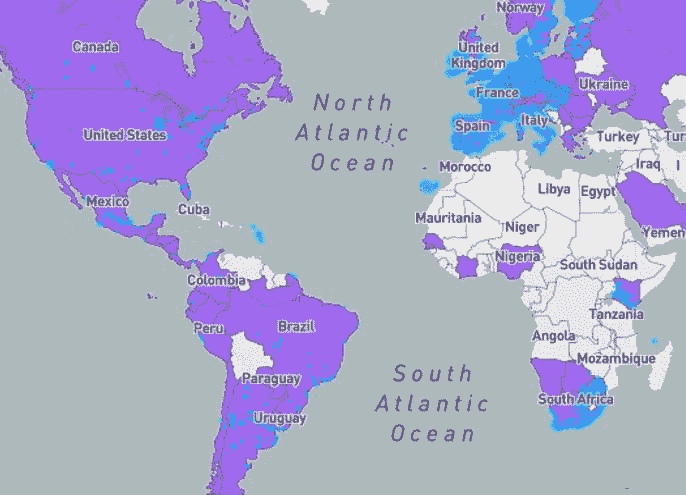
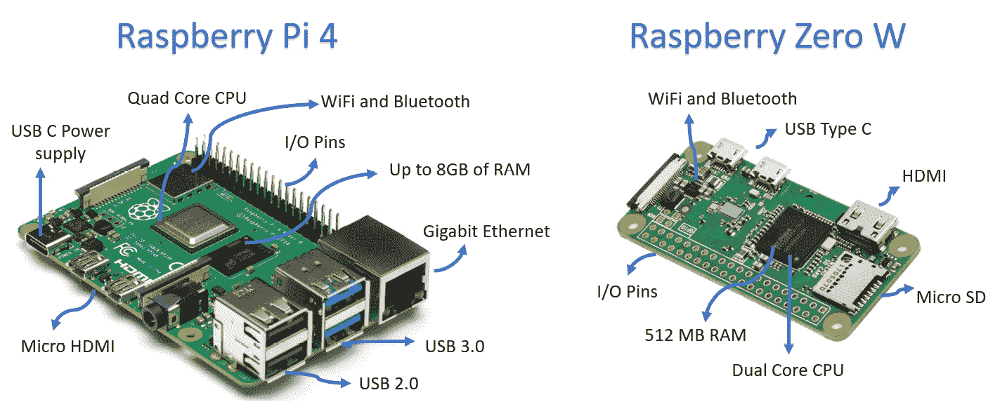
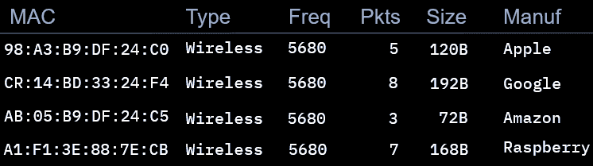

# 第十章：*第十章*：应用物联网安全

*"你不会把汽车钥匙放在引擎盖上——如果物联网设备没有安全保护，你就把自己暴露在与可能的恶意方共享数据所带来的风险中"*

*– Lisa De Luca，知名物联网发明者及 Wayfair 技术公司客户情报负责人。*

**物联网**（**IoT**）设备变得非常流行，因为它们可以让我们的生活更便捷。此外，它们的成本使其在消费市场上非常有吸引力。然而，这些廉价设备为渴望利用它们来利用漏洞的网络犯罪分子带来了许多机会。

因此，在本章中，您将学习如何领先于犯罪分子。您还将学会如何利用这些技术来创建您自己的网络安全工具，例如：

+   您自己的设备，用于检测恶意接入点

+   使用 Raspberry Pi 的防火墙和入侵检测系统

+   低于 10 美元的强大蜜罐

+   一种用于监控您的网络服务和网络的物联网设备

+   使用 Raspberry Pi 的互联网广告拦截器

现在，让我们看看本章将涵盖的主要内容：

+   *物联网简介，* 及其在工业和家庭应用中的风险。

+   物联网设备上的前 10 大*漏洞*清单。

+   探索最流行的物联网*网络技术，包括：LoRaWAN、Sigfox、ZigBee 等*。

+   一个关于安全机制的回顾 *以及改进物联网设备安全性的最佳实践*。

+   关于如何*利用低成本物联网设备创建您自己的防御性安全工具*的完整指南。

+   此外，作为额外奖励，本章还将告诉您*未经授权的物联网设备的危险，以及如何检测它们*。

# 技术要求

本章节没有技术要求。不过，我们强烈建议您购买一台 Raspberry Pi（3 型或更高型号），这样您可以进行实验，并创建一些您将在本章中看到的防御性安全工具。

# 了解物联网

让我们先定义物联网为*一组能够连接到互联网以共享数据和资源的设备*。

一些示例可能是您的智能手表或智能电视（是的，他们喜欢把*智能*这个词加在物联网设备上），但您办公室里的许多其他设备，例如复印机、打印机，甚至咖啡机，都可能是需要在允许连接到互联网之前进行漏洞分析的物联网设备。以下是一些物联网设备的示例：

图 10.1 – 物联网设备示例

企业正在意识到将设备连接到互联网的好处。这些好处包括增加新功能和收集有关客户使用或习惯的数据（这对于改进未来的产品非常有用）。此外，企业还可以通过设备共享服务、数据或功能，创建互联生态系统，大大提升用户体验。

但这些实施方式也带来了许多**风险**，您必须了解并理解这些风险，以便制定策略来有效地进行防护。

## 风险

大多数物联网设备是为了*增强*用户体验而创建的。然而，在许多情况下，这些设备并不是设计时就考虑到*安全*的。这可能会对您的网络和数据构成风险。

让我们来看一下两种主要的物联网实施方式以及每种方式相关的风险。

### 工业物联网

工业物联网环境中的主要风险如下：

+   传感器数据丢失

+   来自传感器的数据损坏

+   干扰传感器

+   工业间谍活动

+   设备劫持

+   修改数据以导致服务中断（机器或生产厂）

+   修改数据以导致经济损失（作物损失）

### 智能家居

智能家居环境中的主要风险如下：

+   网络入侵。

+   个人或敏感数据的泄露。

+   设备可用作僵尸网络发起**分布式拒绝服务**（**DDoS**）攻击。

+   设备的远程访问/控制。

+   禁用或绕过安全系统。

+   隐私问题（摄像头、麦克风等）。

下图展示了攻击者如何劫持您的物联网设备的示例。

图 10.2 – 物联网智能家居的威胁环境

现在，让我们来看一下可能引发这些*风险*的最常见*漏洞*。

## 漏洞

物联网市场的大部分竞争围绕着*成本*展开。因此，企业需要降低成本，有时这意味着缺乏安全性测试，甚至缺乏设备的基本安全设置。

因此，已经有成百上千个物联网设备连接到互联网，而设备的所有者甚至没有意识到它们的漏洞。

现在，让我们来看一下物联网设备中发现的十大漏洞：

图 10.3 – 物联网十大漏洞

现在，让我们来看一下物联网设备常用的网络协议及其相关的优缺点、风险和漏洞。

# 了解物联网网络技术

虽然一些物联网实现使用 Wi-Fi，但事实上 Wi-Fi 有几个局限性，特别是在能耗和网络覆盖（范围）方面。因此，已经开发出一套新技术来克服这一局限性，将覆盖范围提高到 10 公里。

现在，让我们来看看一些物联网网络技术及其相关的漏洞。

## LoRaWAN

**LoRaWAN**，也叫**LoRa**，是一个用于实现**低功耗广域网络**（**LPWANs**）的开放标准。

这项技术的主要优势之一是能够以非常低的功耗传输长距离（超过 10 公里）的数据。这使得 LoRa 成为连接物联网设备和传感器的绝佳选择。此外，正如下图所示，LoRa 设备非常小巧。这对原型制作（甚至是集成到生产系统中）非常有利：

图 10.4 – LoRa 发送器和接收器

所以，长距离覆盖和小型设备（低功耗）看起来是实现物联网网络的完美解决方案，但如果计划在基础设施中使用这些类型的网络，还需要考虑多种漏洞。

### LoRaWAN 安全漏洞

按设计，LoRa 非常安全。事实上，认证和加密是强制性的。然而，如果实施不当，设备和网络仍然可能受到攻击。

因此，寻找**LoRaWAN CertifiedCM**设备非常重要，以确保设备已通过标准测试并按预期工作。

以下是这些设备报告的一些漏洞列表：

+   一些设备可能预置了硬编码的加密密钥。

+   一些设备可能使用容易猜测的加密密钥，例如 `AppKey = 设备标识符 + 应用标识符`，或 `AppKey = 应用标识符 + 设备标识符`。

+   易受到拒绝服务攻击（Denial-of-Service）的影响。

+   易受到确认（ACK）欺骗攻击的影响。

+   易受到重放攻击的影响。

+   此外，LoRa 存在两个 CVE 漏洞：[`cve.mitre.org/cgi-bin/cvename.cgi?name=CVE-2020-4060`](https://cve.mitre.org/cgi-bin/cvename.cgi?name=CVE-2020-4060) 和 [`cve.mitre.org/cgi-bin/cvename.cgi?name=CVE-2020-28349`](https://cve.mitre.org/cgi-bin/cvename.cgi?name=CVE-2020-28349)。

请记住，新的 CVE 每天都会上传，因此在任何实现之前都要始终检查它们。

## Zigbee

Zigbee 是由 Zigbee 联盟开发的**个人区域网络**（**PANs**）标准，旨在为短距离应用（如传感器之间的通信）提供低成本、低功耗的无线通信解决方案。

重要提示

为什么物联网通信协议安全重要？2017 年，一组研究人员通过利用 Zigbee 智能灯泡实现的漏洞，成功入侵网络并注入恶意软件。

### Zigbee 安全漏洞

Zigbee 网络上最常见的漏洞包括以下几点：

+   它们容易受到通过信号干扰进行的可用性攻击（由于使用的频段，这种攻击很容易实现）。

+   安全性基于密钥交换的保密性，因此它们容易受到在修复密钥过程中嗅探网络的攻击。

+   一些系统不支持更换已泄露的密钥，因此一旦密钥泄露，就无法更换密钥以阻止入侵者。

+   相关的其他产品漏洞可以在以下网址找到：[`cve.mitre.org/cgi-bin/cvekey.cgi?keyword=zigbee`](https://cve.mitre.org/cgi-bin/cvekey.cgi?keyword=zigbee)。

下图显示了 Zigbee 模块：

图 10.5 – Zigbee 模块

请记住，我们在此解释的是标准特性和漏洞。然而，我们强烈建议您在实施之前先熟悉这项技术。

好的一点是，这些设备的成本非常低，因此您可以轻松制作自己的原型（借助如 Arduino 或 Raspberry Pi 之类的原型板）来确定最适合您的物联网实现的网络。

## Sigfox

**Sigfox**被开发用于每天发送少量消息，这样可以将成本和功耗保持在最低水平。使用这项技术，您每天最多可以发送 140 条消息（上行消息 12 字节，下行消息 8 字节）。

这在通过低成本远距离传输传感器数据时尤其有用。

这项技术正在广泛流行，正如你在*图 10.6*中所看到的，Sigfox 正在全球范围内被实现：

图 10.6 – Sigfox 覆盖地图

### Sigfox 安全漏洞

Sigfox 网络最常见的漏洞如下：

+   由于带宽低，某些通信可能未加密发送。这给传输的数据带来了风险。

+   它们容易受到通过信号干扰进行的可用性攻击（由于使用的频段，这种攻击容易实现）。

现在，让我们来看看一个在一些物联网实现中被采用的著名协议。我们说的就是**蓝牙**。

## 蓝牙

由于其普及，蓝牙成为物联网制造商的一个有趣选择，因为它成本低且易于与其他设备集成。

还有一个版本叫做**蓝牙低能耗**（**BLE**）。它对于物联网实现来说更为理想，因为其功耗非常低。

### 蓝牙安全漏洞

BLE 包括 128 位加密和身份验证。这是安全性中的两个重要机制。然而，仍然存在一些与 BLE 相关的漏洞：

+   设备在**可发现模式**下容易受到多种攻击，因此只应在设置时使用，并在设置后关闭。然而，*一些设备默认开启可发现模式，并且不提供更改选项*。这种设备（通常是非常低成本的物联网设备）应该避免使用。

+   CVE 网站上列出了一些关于 BLE 的漏洞。然而，大多数漏洞与制造商的实现不当有关，而不是协议本身的问题。请参阅以下网址：[`cve.mitre.org/cgi-bin/cvekey.cgi?keyword=ble`](https://cve.mitre.org/cgi-bin/cvekey.cgi?keyword=ble)。

2020 年，一位网络安全专家利用大规模蓝牙漏洞，仅用 90 秒就黑入了一辆特斯拉 Model X。

还有其他技术，如**NFC**，也用于物联网实现中以交换数据或触发动作。这些技术也需要进行分析，以确保它们不会对我们的数据或设备构成威胁。

## 安全考虑事项

如我们刚才所见，许多这些协议为物联网网络提供了足够的安全机制。然而，大多数发现的漏洞与实现不当有关。因此，物联网设备的整体安全考虑事项如下：

+   在购买物联网设备之前，始终进行研究，因为它可能存在安全实现不良或协议版本过时的问题。

+   执行功能分析，以确定在速度、带宽和距离方面最适合你的选项（如*图 10.7*所示）。

+   确保所有实现都由专家进行，以避免安全漏洞。

+   注意低成本设备和传感器，因为它们可能缺乏加密或其他安全机制（以降低成本）。

+   将物联网网络与企业网络隔离，以避免对主基础设施带来额外风险。

以下图表显示了物联网网络协议的比较：

图 10.7 – 物联网网络协议比较

如*图 10.7*所示，*没有一种适用于所有的解决方案*。相反，每种技术都有其优缺点，需要进行评估，以确定哪种解决方案最适合你。记住，可用性是你在制定网络安全战略时需要评估的因素之一。因此，你还需要考虑哪种技术能提供更高的保真度，并降低丢包或断开连接的风险。

# 提高物联网安全性

现在，让我们分析一些可以应用于提高物联网设备安全性的额外机制和最佳实践。

### 默认密码

安装时更改所有物联网设备的默认密码。

此外，确保为这些设备选择非常强的密码，密码应包含以下特性：

+   15 个字符长。

+   字母（大小写）、数字和特殊字符。

+   避免使用常见词汇（也称为字典词汇），如国家名称、月份名称等。

+   每年至少更改一次家庭设备的密码，每季度更改一次商业设备的密码。

+   使用密码管理器来安全且轻松地管理这些密码。

然而，使用超级密码并不足够。你还应该混淆用户名，以使攻击者更加难以破解。我们可以通过更改**默认用户**来做到这一点。

### 默认用户

默认用户如**管理员**很容易被攻击者猜到，因此更改这些默认设置会让攻击者更难以攻击。

### 禁用不必要的功能

如果物联网设备启用了远程连接到管理员面板或类似 Telnet 等脆弱服务的选项，则你*必须*禁用它们。

### 不安全的系统

在购买任何物联网设备之前，你*必须*在网上检查已知的漏洞（例如，以下网址：[`cve.mitre.org/`](https://cve.mitre.org/)）。

如果漏洞得以解决（例如，公司发布了补丁），那么说明制造商重视安全性。然而，如果漏洞没有得到制造商的解决，那么你应该寻找替代品，而不是将一个脆弱的设备添加到你的网络中。

重要提示

2020 年，一组研究人员使用[Shodan.io](http://Shodan.io)查找脆弱的打印机，并利用脚本强制这些脆弱的打印机打印一份*打印机安全指南*。

此外，在 2018 年，超过 50,000 台打印机开始打印一条支持 YouTuber 的信息，成为又一次成功的大规模打印机攻击（见*图 10.8*）：

图 10.8 – 50,000 台脆弱打印机打印的信件

这种攻击相对*无害*。然而，试想如果攻击者发送了一个命令，让 50,000 台打印机打印《*堂吉诃德*》的副本。那么我们就会谈到 5000 万页的影响（这可真是*非常多*）。

### 启用的服务和端口

物联网设备可能默认启用了多个服务和端口。因此，你*必须*定义哪些服务应该具有互联网访问权限，哪些服务应该仅限局域网使用。

例如，你可能希望网络打印机可以访问互联网进行更新，但如果不使用的话，应该禁用远程管理访问和网络打印机服务（大多数情况下，局域网打印机就足够了）。

### 数据存储

检查设备上保存了什么类型的数据以及这些数据应用了什么类型的安全保护。如果数据在存储时没有进行安全加密，那么要么禁用数据保存功能，要么创建一个持续删除所有数据的流程。

### 安全设置

如前所述，避免将设备以默认设置添加到网络中，因为这可能成为攻击者的目标。

### 物理设置

确保这些设备无法被未经授权的人访问，因为攻击者可以按下重置按钮以启用默认登录，并访问系统。

### 分离网络

始终保持物联网设备在私人网络中是一种良好的做法。这确保了物联网设备无法访问任何敏感文件。

现在，让我们谈谈物联网设备的好处，以及你如何利用它们创建一些非常酷的项目，来增强你的网络、办公室、系统、数据，甚至是你的房子的安全性。

# 使用物联网设备创建网络安全硬件

**树莓派**是目前最著名的物联网设备之一，用于创建原型。

事实上，互联网上有成百上千个很酷的项目，你可以用这个强大的设备来创建。

如*图 10.9*所示，树莓派是一个非常强大的设备，具备大量的计算能力，配备了你需要的所有端口，并且还配有一些 I/O 引脚，可以轻松连接多个模块和传感器。

目前有两个主要版本：普通的树莓派（当前为第 4 版）和**树莓派零**。这是树莓派的迷你版，便于携带且功耗极低。这对于一些项目来说非常合适：

图 10.9 – 树莓派版本比较

互联网上许多树莓派项目与针对网络和系统的网络武器有关。然而，好消息是，也有许多与*防御安全*相关的酷项目，你可以利用这些项目的*低成本*和*易于实现*，但更重要的是，因为你在创建这些项目时可以获得很多乐趣。所以，让我们来看看这个用树莓派打造的防御安全项目的精彩合集。

### 检测流氓接入点

*流氓接入点是对我们网络、系统和数据的巨大威胁*。

它们基本上是恶意的**接入点**，旨在模仿你原来的接入点并执行多种攻击。

### 威胁

**流氓接入点**是对你的基础设施和数据的*巨大*威胁，因为它可以用来发起多种危险攻击，例如以下几种：

+   中间人攻击

+   断开认证攻击

+   探测请求监视器

+   拦截、检查、修改和重放 Web 流量

+   凭证收集

+   DHCP 饿死攻击

+   Windows 更新攻击

+   ARP 欺骗

+   DNS 监控

+   DNS 欺骗

因此，正如你所看到的，流氓接入点可以对你的基础设施造成巨大的破坏。幸运的是，过去这些攻击并不常见，因为如*图 10.10*所示，要悄无声息地走私执行这些攻击所需的所有硬件是非常困难的：

图 10.10 – 老式和新型流氓接入点比较

坏消息是，现在攻击者可以使用一个口袋大小的树莓派作为平台来发起这些类型的攻击。由于体积小、功耗低，它可以在攻击者的口袋里保持物理上不被察觉。

为了执行这些类型的攻击，攻击者可以利用互联网上提供的多种工具，比如**Wifiphisher**（[`github.com/wifiphisher/wifiphisher`](https://github.com/wifiphisher/wifiphisher)），或者一个名为**Wifipumpkin3**的框架。您可以通过以下网址找到它：[`github.com/P0cL4bs/wifipumpkin3`](https://github.com/P0cL4bs/wifipumpkin3)。

请参阅以下图示：

图 10.11 – WiFi-Pumpkin 之前的 GUI 版本（已废弃）

如*图 10.11*所示，这些工具非常易于使用。这可能会导致攻击数量增加，因为这些攻击可以被脚本小子（那些知识有限、喜欢执行基于简单教程的攻击的攻击者）执行。

### 解决方案

有一些来自思科（Cisco）和惠普（HP）的商业解决方案，但这些解决方案*非常昂贵*，几乎不可能被小型和中型企业采购。

*但有个好消息。* 来自哥斯达黎加 Cenfotec 大学的一组聪明的发明家和网络安全专家使用了攻击者所使用的相同技术，开发出一种低成本解决方案，可以在您的基础设施中找到恶意接入点。这个解决方案被称为**Rpi-AWAPS**：

图 10.12 – Rpi-AWAPS 的分析与控制系统

想要了解更多关于这个令人难以置信的项目，请访问以下链接：

[`www.crbravo.com/rpi-awaps`](http://www.crbravo.com/rpi-awaps)

重要提示

**将威胁转化为解决方案**：这些大师和发明家创建的解决方案是*独一无二的*，因为他们*将一种攻击性武器转化为了解决方案，这就是网络安全创新的巅峰*。此外，这个出色的工具已经在网上发布，因此任何人都可以以非常低的成本进行复制。如果您喜欢这个工具，请通过上述链接给作者留言——他们会很感激的！

请记住，目前该项目的实现是西班牙语版本，但团队正在开发一个英文版的系统。

## 树莓派防火墙和入侵检测系统

另一种利用低成本物联网设备的酷炫方式是通过使用**树莓派**创建低成本防火墙或入侵检测系统。

实现这一目标有多种方法，虽然这不是企业级的解决方案，但它将为预算紧张、几乎没有网络安全预算的小型公司提供额外的保护。以下是一些您可以参考的例子：

+   [`www.instructables.com/Raspberry-Pi-Firewall-and-Intrusion-Detection-Syst/`](https://www.instructables.com/Raspberry-Pi-Firewall-and-Intrusion-Detection-Syst/)

+   [`dergipark.org.tr/en/download/article-file/1160762`](https://dergipark.org.tr/en/download/article-file/1160762)

我们还可以利用树莓派创建更专业的安全系统，针对一些特定系统，如**SCADA**。

## 工业控制系统（SCADA）的防御性安全系统

还有一些实现方案利用树莓派提升工业控制系统的安全性。以下是一个例子：[`www.acadpubl.eu/hub/2018-118-21/articles/21e/66.pdf`](http://www.acadpubl.eu/hub/2018-118-21/articles/21e/66.pdf)。

树莓派有几种类型，因此即使前面的一些链接指向的是特定版本的树莓派，你仍然可以在最新版本的树莓派上运行它。你的树莓派甚至可能比链接中提到的版本运行得更好（在速度、容量、空间、能耗等方面）。

## 安全的 USB 到 USB 复制机

这是一个非常有趣的树莓派实现，旨在减少连接感染的 USB 设备的风险。

想象一下，你正在参加一个会议，有人通过 USB 设备给你提供一些需要的文件。你知道将它连接到你的计算机是有风险的，但你还能做什么呢？

这个解决方案叫做**CIRCLean**。该系统基于由**卢森堡计算机事件响应中心**（**CIRCL**）设计的树莓派，用来扫描 USB 设备并在安全地将其余内容移动到新 USB 设备之前，禁用一些可疑文件。

这里是他们的官方网站，供你了解更多有关此项目的信息：

+   [`circl.lu/projects/CIRCLean/`](https://circl.lu/projects/CIRCLean/)

+   [`github.com/CIRCL/Circlean`](https://github.com/CIRCL/Circlean)

请参考下图：

图 10.13 – CIRCLean 的逐步操作指南

请注意，*图 10.13*是如何通过逐步的方式描述系统功能的。

## 创建一个$10 蜜罐

我们都知道蜜罐的重要性。然而，市场上一些解决方案价格偏高。那么，一个价格低于一杯咖啡的蜜罐解决方案如何呢？这听起来肯定很有吸引力。好了，我的朋友，这完全可以通过树莓派实现。

实际上，有几种蜜罐解决方案可以安装在你的小（但强大的）新朋友——树莓派上。

### OpenCanary

**Thinkst Canary**是一个非常棒的蜜罐设备，但不幸的是，并非每个人都能购买它。好消息是，你可以通过免费的**OpenCanary**软件获得其最重要的功能。

你可以轻松地定制一个便宜的树莓派来作为这个令人惊叹的系统的主机。

OpenCanary 允许你原生伪造以下服务：

+   SSH

+   FTP

+   Git

+   HTTP

+   MSSQL

+   MySQL

+   Telnet

+   SNMP

+   VNC

+   还有更多！

每当有人登录到 OpenCanary 服务器时，你都会通过电子邮件即时收到关于该活动的通知（如*图 10.14*所示）。

现在，由于这是一个蜜罐，并且没有人应该登录它，所以你知道每次登录都是一次黑客攻击尝试：

图 10.14 – 入侵警报 – OpenCanary

项目的官方网站可以在以下网址找到：[`opencanary.readthedocs.io/en/latest/`](https://opencanary.readthedocs.io/en/latest/)。

### Cowrie

另一个选项是**Cowrie**。Cowrie 是一个中到高交互的 SSH 和 Telnet 蜜罐，旨在记录暴力破解攻击以及攻击者执行的 shell 交互。它可以在 Python 中模拟 Unix 系统或充当 SSH 和 Telnet 代理。

它呈现了一个完全虚拟化的文件系统，攻击者可以使用大多数命令和二进制文件。所有操作都会被记录，包括攻击者使用的所有工具（工具包、木马、用户名、密码，甚至他们的位置）。

你可以访问他们的网站，网址如下：[`github.com/cowrie/cowrie`](https://github.com/cowrie/cowrie)。

### SNARE

一个更小的选项是**超级下一代先进反应蜜罐**（**SNARE**）。这个*Web 应用蜜罐*将帮助你吸引并追踪来自互联网野外区域的大量恶意行为者。

这种类型的蜜罐允许你托管一个页面，同时能够看到该页面上发生的所有流量和活动。

官方网站可以在以下网址找到：[`github.com/mushorg/snare`](https://github.com/mushorg/snare)。

## Web 应用和网络的高级监控

**Nagios Core**是一个开源系统，提供网络和应用程序监控。它监控主机和服务，并在发生任何错误时发送警报（并且当服务恢复在线时也会发送警报）。

Nagios Core 包括以下功能：

+   监控网络服务（SMTP、POP3、HTTP、NNTP、PING）。

+   监控资源（CPU 负载、磁盘使用情况等）。

+   通知和警报（通过电子邮件、寻呼机或用户定义的方式）。

+   提供网络状态、通知、错误历史、日志等的 Web 界面。

好消息是，有一个专门为物联网设备（包括树莓派）创建的免费版本，叫做**NEMS**，正如你在*图 10.15*中看到的，界面非常酷：

图 10.15 – NEMS 运行在树莓派上

这是该特殊树莓派版本的网站链接：[`nemslinux.com/download/nagios-for-raspberry-pi-4.php`](https://nemslinux.com/download/nagios-for-raspberry-pi-4.php)。

## 创建一个互联网广告拦截器

互联网广告不仅令人烦恼——它们还有许多其他问题：

+   高带宽消耗

+   点击诱饵

+   诈骗

+   恶意软件

好消息是，你可以使用**Pi-hole**。这是一个很棒的广告拦截器，可以使用树莓派保护整个网络免受广告干扰。

项目页面可以在此找到：[`pi-hole.net/`](https://pi-hole.net/)。

## 访问控制和物理安全系统

您还可以利用多种 IoT 设备，基于多种技术，如以下示例，创建用于访问控制和物理安全的廉价设备：

+   运动检测

+   人脸识别

+   电子邮件警报

+   警报和更多功能

正如您在*图 10.15*中所见，您可以使用多种 IoT 设备进行此类项目，例如加载有**Motion Eye OS**的树莓派，或者更便宜的设备如**ESP8266**或**ESP32**：

图 10.16 – Raspberry Pi Zero、Orange Pi 和 ESP32

您已经学到了如何使用这些工具创建/开发所有酷炫的安全项目。然而，这些设备落入错误的手中（包括无意的用户），可能会对公司的数据和系统构成重大风险，因此这里是一个*特别收录*，扩展了这个话题。

# 特别收录 – 了解未经授权的 IoT 设备的危险

另一个安全风险与连接到您的网络的未经授权的 IoT 设备有关。在这种情况下，一个无意的用户可能会天真地将 IoT 设备连接到您的网络。这可能给您的网络带来很多安全风险。

因此，您*必须*建立一个系统来检测网络中的这些未经授权设备。

## 检测未经授权的 IoT 设备

检测连接到您网络的未经授权的 IoT 设备的简单方法是检查连接到您网络的设备的制造商。

您可以使用名为**Kismet**的软件轻松实现这一点。正如您在*图 10.17*中所见，使用 Kismet 可以扫描网络上的设备并查看设备的制造商，从而帮助您检测诸如树莓派、Alexa、Google Home、Amazon Echo 等未经授权的设备：

图 10.17 – 使用 Kismet 检查制造商名称

此工具已经安装在 Kali Linux 上。有关更多信息，请访问以下网址：[`tools.kali.org/wireless-attacks/kismet`](https://tools.kali.org/wireless-attacks/kismet)。

## 检测树莓派

还有一些工具可以用来识别特定的 IoT 设备。例如，您可以使用名为**Raspberry Pi Finder**的软件（由**Adafruit**开发），它提供了一个非常干净和易于使用的界面，以确定是否连接了树莓派到您的网络上：

图 10.18 – Raspberry Pi Finder

此工具的另一个酷炫功能是，它可以在 Windows、Mac 和 Linux 上使用。有关更多信息，您可以访问它们的官方网站：

+   [`learn.adafruit.com/the-adafruit-raspberry-pi-finder`](https://learn.adafruit.com/the-adafruit-raspberry-pi-finder)

+   [`github.com/adafruit/Adafruit-Pi-Finder`](https://github.com/adafruit/Adafruit-Pi-Finder)

还有一个工具可以帮助你识别网络中的树莓派。巧合的是，这个工具与前者同名，但由另一位开发者**伊万·X**开发。这个工具可以通过以下链接找到：[`ivanx.com/raspberrypi/`](http://ivanx.com/raspberrypi/)。

## 禁用不明的树莓派设备

如果你在检测到树莓派之后想更进一步，那么你可以使用一个叫做**RPI Hunter**的工具。这个工具能帮助你找出树莓派是否连接到你的网络，并发送多个有效载荷来禁用该设备。

要了解更多关于这个工具的信息，请访问以下链接：

[`github.com/BusesCanFly/rpi-hunter`](https://github.com/BusesCanFly/rpi-hunter)

# 总结

本章我们覆盖了很多信息。

首先，你了解了物联网设备、它们的相关风险和漏洞，以及如何解决这些问题。

然后，你将熟悉所有不同类型的物联网网络技术及其相关的漏洞。

但最棒的是，*你学会了如何将这些物联网设备（大多数人认为它们是威胁）作为强大的工具，部署到你的防御性安全工具库中*。

现在，是时候进入另一个非常有趣且当今非常相关的话题：**云安全**（如何在云中安全地部署和开发应用程序）。

# 进一步阅读

+   如果你想了解更多关于所有可用的树莓派型号和其他酷炫的项目，可以访问他们的网站：[`www.raspberrypi.org/`](https://www.raspberrypi.org/)。

+   如果你对学习更多关于 LoRa 网络的内容感兴趣，可以访问他们的网站：[`lora-alliance.org/`](https://lora-alliance.org/)。

+   要了解更多关于 Zigbee 的信息，可以访问以下网站：[`zigbeealliance.org/`](https://zigbeealliance.org/)。

+   如果你想了解更多关于 Sigfox 的内容，可以访问他们的官方网站：[`www.sigfox.com`](https://www.sigfox.com)。
