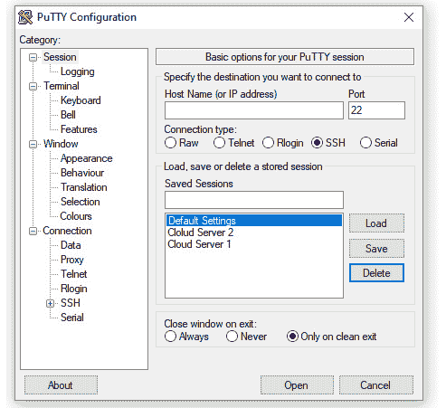
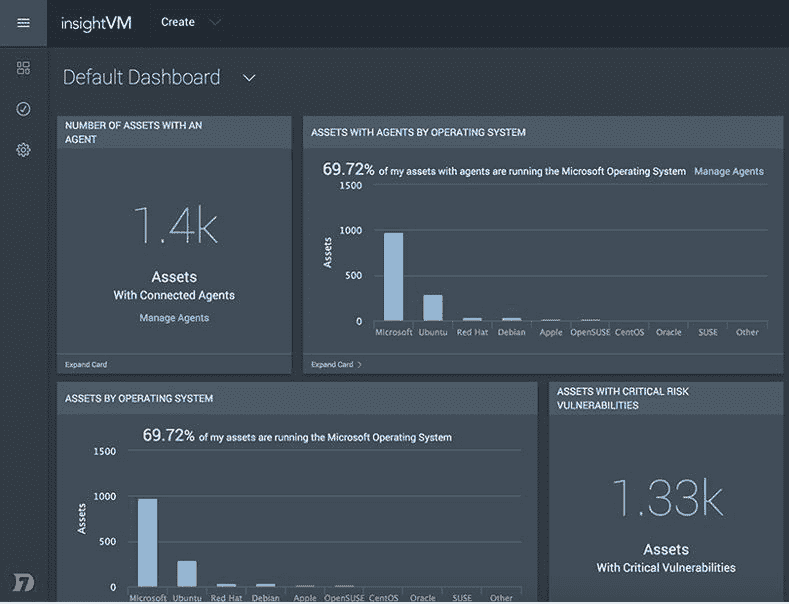

# 第十一章：*第十一章*：云端安全开发与部署

*"网络安全对我们支持云和服务管理工作至关重要。实际上，对抗网络威胁的高效率和速度是至关重要的差异化因素。"*

*– Kyndryl 的海湾和黎凡特地区基础设施服务经理 Dario Sarmiento*

如今，大多数公司都将其 IT 环境托管在云上，因为通常意味着更高的正常运行时间、更强的韧性、更快的部署、更低的风险，甚至更好的安全标准。

然而，这种向云端的迁移也带来了多样的风险和漏洞，需要评估以确保基础设施的安全。

因此，在本章中，我们将首先讨论不同类型的云和数据（以及如何保护它们）。

接下来，我们将通过审视如何使您的**Kubernetes**实施更加安全来深入技术细节。

另外，我们将讨论一些加固云数据库的最佳实践，并讨论监控云基础设施的最佳系统。

以下是本章将涵盖的主要主题：

+   云应用的安全部署和实施

+   保护 Kubernetes 和 API

+   强化数据库服务

+   测试您的云安全性

# 技术要求

本章无需技术要求，但您可以创建免费帐户以测试我们将要审查的一些工具。此外，大多数云服务提供免费试用（层），您可以利用这些试用来实践这些概念。

# 云应用的安全部署和实施

几乎所有公司至少部分业务运行在云端。然而，每家公司都是独特的，他们对云服务的实施可能是不同云模型的混合，下面将详细解释。

## 云模型的安全性

云模型分为三种类型：**软件即服务**（Software as a Service，SaaS）、**平台即服务**（Platform as a Service，PaaS）和**基础设施即服务**（Infrastructure as a Service，IaaS）。每种模型都与其他模型有很大不同，因此需要应用不同的安全措施。因此，让我们从快速介绍三种云环境类型开始，以更好地理解我们要保护的内容。

### 软件即服务（Software as a Service，SaaS）

这基本上是加载在云上并且用户可以通过网络界面轻松访问的软件。以下是一些例子：

+   像**Gmail**和**Outlook**这样的基于网络的电子邮件

+   像基于网络的计费系统或票务系统这样的网络工具

+   像**Office 365**或**Google Workspace**这样的基于网络的生产力应用程序

### 平台即服务（Platform as a Service，PaaS）

这为开发者提供了一个创建自己应用的平台。以下是一些例子：

+   容器，如**Docker**和**Kubernetes**

+   软件开发代码库和版本控制系统，例如**GitHub**

+   基于云的平台，如**Windows** **Azure**

### 基础设施即服务（IaaS）

这为系统管理员创建自己的系统和基础设施提供了基础架构。一些示例如下：

+   **亚马逊云服务**（**AWS**）

+   **DigitalOcean**

+   **Rackspace**

在这些云环境中，安全责任由云用户和云提供商共同承担。

以下图突出显示了根据使用的云类型，谁负责实施某些安全机制：


](img/Figure_11.1_B16290.jpg)

图 11.1 – 云安全责任

现在，让我们看看在云环境中应该如何管理数据安全。

## 云中的数据安全

在云环境中，数据有三种类型（或状态）：**静态数据**、**传输中的数据**和**使用中的数据**（**内存**）。因此，你需要确保无论数据处于什么状态，都始终保持安全。那么，让我们来看一下如何确保在所有不同状态下保护数据的最佳实践。

### 保护静态数据

静态数据基本上是存储在你的云或云系统中的所有数据。确保静态数据的最佳方法是使用加密，然而，加密的应用方式在不同类型的云中有所不同，如下图所示：


](img/Figure_11.2_B16290.jpg)

图 11.2 – 基于云类型的加密实现

请注意，对于**PaaS**和**SaaS**，静态数据的加密主要由服务提供商管理。因此，在选择云服务提供商之前，你*必须*与他们确认是否为静态数据提供某种加密（记住，这也包括备份数据）。

### 保护传输中的数据

传输中的数据基本上是所有端点之间的数据流（从你的机器到云及反向）。保护这些数据会更加复杂，因为它通常需要云提供商与用户之间的一些协调。

例如，*为 SaaS 保护传输中的数据*通常通过使用安全的传输协议来实现，例如**SSL**（**HTTPS**）。如下面的图所示，HTTPS 通过加密传输中的数据来防止中间人攻击：


](img/Figure_11.3_B16290.jpg)

图 11.3 – 安全的 SSL 连接与 HTTP

*为 PaaS 保护传输中的数据*通常要求用户在云端执行一些配置，并在计算机上使用一些安全设置（例如，使用安全 API 在终端和云之间传输数据）。如以下图所示，使用 API 密钥可确保端到端加密，确保终端设备与 PaaS 之间的通信安全：


](img/Figure_11.4_B16290.jpg)

图 11.4 – 云中安全 API 密钥实现示例

*为 IaaS 保护传输中的数据*通常由用户完成，通过设置安全的通道连接到云中的系统和基础设施，例如，使用**SSH**。

下图显示了 PuTTY 的图形界面，它是最著名的**SSH 客户端**，可以用来确保与你的云服务器的通信是安全的：



图 11.5 – PuTTY SSH 客户端

现在，让我们来看一下通常被忽视但非常重要的安全状态：*使用中的数据*。

### 保护使用中的数据

使用中的数据基本上是存储在**随机存取内存（RAM）**中的信息。过去，这些数据并不被认为是脆弱的，但攻击者发现了从内存中提取信息的方法，因此，确保有机制来保护这些数据变得非常重要。

保护此类数据的主要方式是在操作系统层面，通过确保服务器和应用程序安装最新的安全更新，以防止内存泄漏。

SaaS 用户可以采取一些机制来减少这些攻击的风险，例如：

+   不使用时关闭云会话。

+   从网页工具注销（而不是仅仅关闭浏览器）。

PaaS 用户可以应用与 SaaS 用户相同的最佳实践，并确保他们使用平台的最新版本，避免使用那些已知有漏洞可能导致内存泄漏的平台。

IaaS 用户需要进一步遵循以下最佳实践：

+   安装操作系统的最新版本。

+   定期更新操作系统的补丁。

+   保持所有软件更新（特别是安全更新）。

+   从服务器中删除任何易受攻击的软件。

我们刚刚介绍了云安全的基础知识。现在是时候深入探讨如何在使用 Kubernetes 时增强安全性了。

# 保护 Kubernetes 和 API

Kubernetes 是部署云应用程序最常用的平台之一。由于其流行性，了解如何保护 Kubernetes 是非常重要的，以增强云环境的安全性。

## 云原生安全

为了更好地理解 Kubernetes 安全与云安全的关系，让我们来看一下下面的图，它解释了**云原生系统**的**四个 C**的分层模型：


图 11.6 – 云原生安全的四个 C

如前图所示，这是基于**深度防御**（**DiD**）模型的分层模型，旨在增强基于云的开发安全性。

防御的第一道防线是云本身（这是我们刚刚讲过的主题），然而，你可能还需要考虑与每个云提供商相关的特定方面，因此，最佳做法是查看云提供商的页面，了解他们的安全能力。

作为附加信息，以下图提供了主要云服务提供商的安全页面链接：


图 11.7 – 云服务提供商的安全链接

您也可以在*进一步阅读*部分找到这些链接。现在，下一层是集群（在本例中是 Kubernetes），让我们深入探讨保护 Kubernetes 的最佳实践。

## 控制对 Kubernetes API 的访问

在这里，建议对所有**应用程序编程接口（API）**流量使用**传输层安全性（TLS）**，并确保身份验证、授权和准入控制已正确启用和配置。

## 控制对 kubelet 的访问

对**kubelet** HTTPS 端点的请求（未被其他配置的身份验证方法拒绝）默认*被视为匿名请求*。

因此，最佳实践是在生产集群上*启用身份验证和授权*，以防止任何安全风险。

## 防止容器加载不需要的内核模块

攻击者可以通过创建合适类型的套接字来加载内核模块，从而使攻击者能够利用管理员认为未被使用的内核模式漏洞。

为了防止这种情况，您可以从节点中卸载这些模块，或通过创建类似 `/etc/modprobe.d/kubernetes-blacklist.conf` 的文件并添加如下内容来将它们列入黑名单：

```
blacklist dccp
blacklist sctp
```

如果您想了解更多有关此命令的信息，请访问以下网站：[`access.redhat.com/documentation/en-us/red_hat_enterprise_linux/6/html/deployment_guide/blacklisting_a_module`](https://access.redhat.com/documentation/en-us/red_hat_enterprise_linux/6/html/deployment_guide/blacklisting_a_module)。

## 限制对 etcd 的访问

必须限制对**etcd**的访问，因为这相当于给予集群的 root 权限。因此，以下是防止未经授权访问 etcd 的两项建议：

+   使用来自 API 服务器到 etcd 服务器的强密码。所谓强密码是指一个超级长且复杂的密码，您可以通过密码管理工具创建和管理它。我见过很多人为此创建 12 位数的密码，这是有意义的，因为它们将存储在密码管理器中，因此可以尽情创建尽可能长和强的密码。

+   为非主节点组件使用独立的 etcd 实例。

此外，考虑到 etcd 的敏感性，另一项最佳安全实践是*仅 API* 应该有权访问它，并且只授权那些必须访问 etcd 的节点。

## 避免在生产环境中使用 alpha 或 beta 功能

您可能会发现 Kubernetes 有一些非常酷的功能，处于 alpha 或 beta 阶段。在这种情况下，建议等到这些功能最终版发布后再使用它们。

Alpha 或 Beta 版本的功能可能存在尚未解决的安全漏洞，可能会危及整个集群。值得一提的是，这条建议实际上适用于所有软件和硬件（不仅仅是 Kubernetes）。

## 第三方集成

与之前的建议类似，第三方集成可能听起来非常吸引人，提供了你想要实现的功能，但与任何其他集成一样，在将这些集成安装到生产环境之前，你需要先进行测试。

同时，记得始终在互联网上搜索有关该集成的信息，看看其他人是怎么说的。兼容性问题、漏洞甚至崩溃是你在遇到这些问题之前，能在互联网上发现并防止它们的事情。

现在，云原生系统安全的四个组成部分中的另外两个是**代码**和**容器**，通常由*开发者*负责。然而，作为网络安全专业人员，确保开发团队至少遵循某种安全代码开发框架，以减少云环境中的风险，会是一个不错的做法。

# 硬化数据库服务

获取对数据库的访问权限可能是攻击者最渴望的目标。

这不仅仅是因为他们能够访问的数据，更因为通过获取这些数据库的访问权限，攻击者可能会访问其他系统，创建新用户，等等。

现在，你需要考虑的是，当谈到数据库时，我们讨论的是一个庞大的领域，每个系统和技术可能都有自己的硬化步骤。因此，最好理解那些适用于大多数数据库的最佳实践，正如这里所展示的：

+   必须始终启用诸如加密和审计等基本安全设置，确保其始终处于*开启*状态。

+   使用高级工具来监控、检测并拒绝对数据的访问（如果可能，寻找包含 AI 组件的新解决方案，以增强入侵检测）。

+   管理员账户（例如**DBA**账户）必须使用更强的密码标准（如果可能的话，使用 60 个字符以上的密码并使用密码管理器）。

+   始终应用基本的安全政策，例如**最小权限原则 (PoLP)**和职能分离（它们在*第三章*，*理解政策、程序、合规性和审计*中有详细解释）。

+   数据库隔离有助于你更好地控制数据和相关的控制措施。例如，可以根据合规性控制将数据库进行隔离。

+   始终确定数据是内部访问还是外部访问，并适当应用控制措施。

+   分析并在可能的情况下，利用云服务提供商提供的安全功能。

+   分析并在可能的情况下，利用数据库开发者提供的安全功能。

+   利用合规标准来提高数据库的安全性，即使你不需要遵守它们（例如，**PCI-DSS**）。

+   避免在测试环境中使用客户数据。

+   在可能的情况下，使用策略管理器来强制执行安全策略。

+   使用增强解决方案（如**Google Secret Manager**）来存储敏感信息，如 API 密钥、密码、证书等。

此外，以下是一些链接，供您参考，帮助您了解如何加固某些特定数据库引擎：

+   MySQL 安全性：

    [`dev.mysql.com/doc/refman/5.7/en/security-against-attack.html`](https://dev.mysql.com/doc/refman/5.7/en/security-against-attack.html)

+   PostgreSQL 安全性：

    [`www.postgresql.org/docs/7.0/security.htm`](https://www.postgresql.org/docs/7.0/security.htm)

+   SQL Server 安全性：

    [`docs.microsoft.com/en-us/sql/relational-databases/security/securing-sql-server?view=sql-server-ver15`](https://docs.microsoft.com/en-us/sql/relational-databases/security/securing-sql-server?view=sql-server-ver15 )

+   Oracle 数据库安全性：

    [`docs.oracle.com/cd/B28359_01/network.111/b28531/guidelines.htm#DBSEG009`](https://docs.oracle.com/cd/B28359_01/network.111/b28531/guidelines.htm#DBSEG009)

+   MongoDB 安全性检查清单：

    [`docs.mongodb.com/manual/administration/security-checklist/`](https://docs.mongodb.com/manual/administration/security-checklist/)

+   Redis 安全性：

    [`redis.io/topics/security`](https://redis.io/topics/security)

+   Google Cloud Storage 最佳实践：

    [`cloud.google.com/storage/docs/best-practices#security`](https://cloud.google.com/storage/docs/best-practices#security)

现在，您已经了解了如何保护云环境，接下来可以查看一些可以帮助您测试云安全性的工具。

# 测试您的云安全性

正如您可能已经知道的那样，所有的防御性安全措施*必须*经过测试，以确认已实施的控制是否有效，还要检测是否存在任何可能被攻击者利用的漏洞。

因此，在本节中，我们将探讨一些最佳工具，这些工具可以帮助您监控云的可用性和漏洞情况，以确认您的控制措施是否有效，并判断它们是否符合相关法规要求。

## Azure 安全中心

**Azure 安全中心**是使用微软云服务的必备工具，因为它能让您评估所有云资源的安全状态，包括服务器、存储、SQL、网络、应用程序和工作负载。

如下图所示，您可以在此查看您的安全状态，并通过使用 Azure **安全评分**建议来改善安全性：


图 11.8 – Azure 安全中心

此外，Azure 安全中心使您能够查看与各种监管要求的合规性，并执行持续的评估和报告，以简化合规过程。

## Amazon CloudWatch

**Amazon CloudWatch**监控云应用，并将数据转换为度量指标和事件，以便更好地展示 AWS 资源、应用和服务的可见性。

此外，你还可以检测异常行为、配置警报、执行自动化操作等。


图 11.9 – Amazon CloudWatch 的功能

如前图所示，**Amazon CloudWatch**是一个出色的工具，可以增强 AWS 资源的监控和可用性。

## AppDynamics

被**Cisco**于 2017 年收购的**AppDynamics**提供基于云的监控服务，用于评估应用性能。

如下图所示，该工具被创建用以支持即使是复杂的环境：


图 11.10 – AppDynamics

该工具还具有应用安全监控功能，可以帮助你更快地发现漏洞和安全隐患。

## Nessus 漏洞扫描器

**Nessus 漏洞扫描器**被许多人认为是最完整的漏洞扫描器。如下图所示，Nessus 使你能够运行多个预配置的扫描，从而简化操作：


图 11.11 – Nessus 扫描模板

此外，你还可以配置自己的高级扫描来查找特定的漏洞。

甚至还有一个有限的免费版本，你可以用来测试此扫描工具的强大功能。

若想获取更多信息，可以访问他们的网站：[`es-la.tenable.com/products/nessus`](https://es-la.tenable.com/products/nessus)。

## InsightVM

**InsightVM**是由**Rapid7**开发的工具，可用于评估云端和虚拟基础设施，找出漏洞并进行精确的风险评估。

如下图所示，**默认仪表板**提供了大量信息，帮助你了解当前的漏洞情况。例如，仪表板可以作为基础设施中不受支持的服务器的可视化提醒：



图 11.12 – InsightVM 默认仪表板

该工具的另一个优势是，你还可以用它来监控云外的其他系统，使你能拥有一个一体化的安全仪表板。

## Intruder

**Intruder**是一个漏洞扫描工具，帮助你通过检查超过 10,000 个漏洞和安全检查来评估你的云环境状态。如图所示，图形用户界面非常直观，能够在一个仪表板中呈现所有有用数据。

此外，它还提供了根据漏洞的严重性对其进行排序的选项，让你始终能保持关注。


图 11.13 – Intruder 图形用户界面

还有许多其他性能监控工具以及漏洞扫描器，你可以查看它们，这些工具有各自独特的特点和功能：**OpenVAS**、**Qualys** **Cloud Platform**、**AlienVault USM**、**Alibaba** **Website Threat Inspector**、**Amazon** **Inspector**、**Orca** **Security**、**Trend Micro** **Cloud One**，等等。

很遗憾，这一章已经结束，但好消息是，如果你想了解更多关于**OpenVAS**的信息，可以跳转到*第十三章*，*漏洞评估工具*，在这一章中，你将有一个完整的章节，专门讲解如何更好地使用这个强大的工具。

# 总结

在本章中，我们涵盖了大量有用的信息，帮助你更好地理解与安全云实施相关的各个方面。

我们了解了不同类型的云及其相关的安全性，也看到了如何保护 Kubernetes。最后，我们展示了数据库安全的一些基础知识以及评估云安全的各种工具（在坏人之前）。

但我们还没有结束。在下一章，我们将进一步深入探讨这一主题，学习如何通过 Web 应用程序掌握安全实施。

# 进一步阅读

以下是每个云服务提供商提供的最佳安全实践链接：

+   [`aws.amazon.com/security/`](https://aws.amazon.com/security/)

+   [`www.alibabacloud.com/trust-center`](https://www.alibabacloud.com/trust-center)

+   [`cloud.google.com/security/`](https://cloud.google.com/security/)

+   [`www.ibm.com/cloud/security`](https://www.ibm.com/cloud/security)

+   [`docs.microsoft.com/en-us/azure/security/azure-security`](https://docs.microsoft.com/en-us/azure/security/azure-security)
