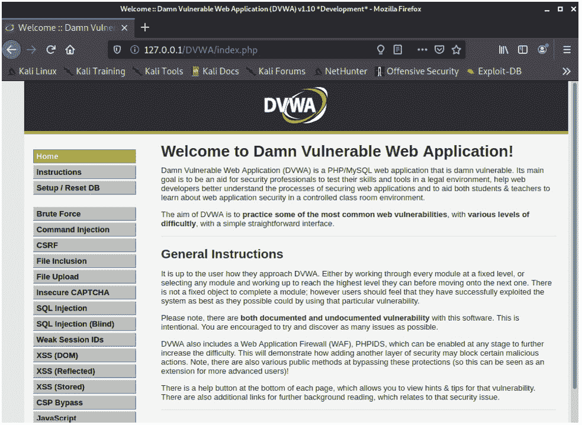
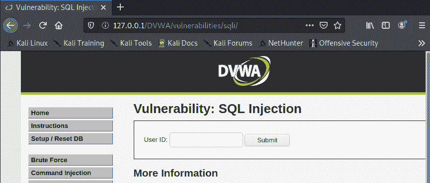
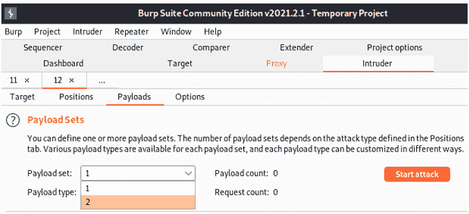

# 第十二章：*第十二章*：掌握 Web 应用安全

*“Web 应用无处不在，攻击者如今投入大量精力了解它们的攻击面并利用它们的漏洞。我们则需要做同样的事。”*

*– 克里斯蒂安·罗德里格斯，攻防安全认证专家（OSCP）|攻防安全 Web 专家（OSWE）*

的确，我们必须保护我们的 Web 应用，这也是我们创建这个超级激动人心的章节的原因，您将在其中获得所有知识，掌握确保 Web 应用安全所需的技能。首先，我们将向您展示别人可能知道关于您的网站或 Web 应用的多少信息，以及隐匿所有这些公共信息的重要性。

接下来，我们将进入更技术性的内容，并向您介绍 Web 应用最常见的攻击之一：**跨站脚本攻击**（**XSS**）。之后，本章其余部分将非常技术性和实践性。

我们将从一步步的指南开始，教您安装两个必备的网络安全工具，如下所示：

+   **非常脆弱的 Web 应用**（**DVWA**）

+   Burp Suite

DVWA 是一个很棒的工具，它为您提供了一个安全的虚拟环境，您可以在其中测试甚至熟悉 Web 应用上的多种漏洞。

另一方面，Burp Suite 是一个出色的工具，可以实时测试给定的 Web 应用。

一旦我们配置好两个工具，就会进行一个实验，向您展示如何针对以下两种攻击测试 Web 应用：

+   **结构化查询语言**（**SQL**）注入攻击

+   暴力破解攻击

总结一下，这一章我们将涵盖的主要内容如下：

+   收集关于您的网站/ Web 应用的信息

+   利用 DVWA

+   概述 Web 应用最常见的攻击

+   使用 Burp Suite

+   在 DVWA 上的 SQL 注入攻击

+   对 Web 应用密码进行暴力破解

# 技术要求

为了充分利用本章的内容，建议安装带有 Kali Linux 的**虚拟机**（**VM**）以便顺利进行实验。

我们还将使用两个工具，DVWA 和 Burp Suite，但我们会涵盖它们的安装和配置方法，所以不用担心这个问题。

# 收集关于您的网站/ Web 应用的信息

当保护您的 Web 资源（网站、Web 应用、**应用程序接口**（**API**）等）时，第一步是确定有关它们的哪些信息可以在互联网上轻松且自由地获取。如果您想知道为什么要这么做，答案非常简单：因为攻击者首先就是这么做的！

而且信不信由你，数以千计的 Web 资源暴露了敏感数据，如*密码*、*数据库用户*、*敏感文档*等。

## 公共数据收集的重要性

现在，让我们首先了解一下突出此活动重要性的关键方面（以及为什么您必须投入时间和资源来进行此活动），如下所示：

+   公共信息可以被用于定向的社交工程攻击（钓鱼、语音钓鱼、冒充等）。

+   用户名可以被用于执行定向的密码攻击（字典攻击、暴力破解攻击等）。

+   服务器名称和**互联网协议**（**IP**）地址可以用于执行定向的**拒绝服务**（**DOS**）攻击。

+   攻击者可以利用公共信息进行更有效的字典攻击。

现在，让我们来看一下如何爬取互联网，发现关于你的网站的公共信息。

## 开源情报

**开源情报**（**OSINT**）是指从公共（开放）资源，如互联网，收集情报或信息。这一术语通常由情报服务机构使用，但现在在网络安全领域非常普遍。

事实上，有一个非常好的框架（[`osintframework.com/`](https://osintframework.com/)），它包含了多个可以供你收集互联网上各种数据的资源，接下来我们将看到你可以使用的最相关的工具来进行数据收集。

### DNS 查询

这些工具可以让你收集有关你的网络资源的**域名系统**（**DNS**）信息。因此，强烈建议检查你的网站，看看其他人知道关于你的网站什么。

一个很好的例子是网站[`spyse.com/tools/dns-lookup`](https://spyse.com/tools/dns-lookup)，它不仅提供 DNS 信息，还包括以下内容：

+   DNS 记录（**邮件交换**（**MX**）、**地址**（**A**）、名称服务器）

+   DNS 历史

+   使用的技术（**操作系统（OS）**、**互联网信息服务**（**IIS**）、库、字体、**内容管理系统**（**CMS**）等）

+   子域名

+   其他数据（**超文本传输协议**（**HTTP**）头、**层叠样式表**（**CSS**）、链接、**JavaScript**（**JS**））

+   证书信息（**安全套接字层**，或**SSL**）

+   已验证的电子邮件地址

根据你的业务需求，其中一些信息*必须*被隐藏，因为它可能代表着安全或隐私风险。

以下截图中展示的页面还显示了基于从**公共漏洞和暴露**（**CVE**）中发现的漏洞的安全评分：


图 12.1 – 来自 spyse.com 的漏洞视图

正如你可能已经推测到的，这些类型的页面也是评估你的托管服务提供商安全性的一个重要信息来源。

### WHOIS 记录

这些记录显示了与给定域名所有者相关的信息。这里的主要风险是，这些记录与某个人关联，可能会使该人成为网络犯罪分子的主要目标。

例如，如果攻击者可以看到大公司的域名所有者的电子邮件地址，那么攻击者可以利用这些信息对该人进行多次攻击，如以下几种：

+   社交工程攻击

+   暴力破解攻击

+   冒充攻击

+   在已知的数据泄露中搜索电子邮件以收集凭据

为了防止这些攻击，公司可以向域名注册人支付额外费用，*隐藏*这些记录作为隐私保护措施，如以下截图所示：


图 12.2 – 私有域名与正常域名的 WHOIS 输出

注意在前面的截图中，注册人信息已被隐藏以保护安全和隐私。

## 托管信息

你可能还想查看的另一条信息是关于共享托管环境的。例如，像[`www.domainiq.com`](https://www.domainiq.com)这样的页面可以列出托管在某一服务器或子网中的所有域名。

这些信息可以通过以下两种方式使用：

+   首先，它可以帮助你判断服务器的声誉，特别是当你使用共享托管环境时。

+   其次，这也可能是一个隐私问题，因为它可能会泄露公司所有权的私人信息。例如，你可能会在不同的公司名下注册两家公司，因为你不希望公众将它们联系在一起，但如果两个域名托管在同一服务器上，可能会透露关于这两家公司实际所有权的线索。

以下截图展示了托管在同一服务器上的域名列表：


图 12.3 – 显示托管在同一服务器上的域名列表

作为附注，如果你使用的是第三方共享托管环境，这些信息也可能会有用，帮助你判断你的网站是否因托管在同一服务器上的不良页面而面临被封禁（黑名单）的风险（这可能会影响到你邮件服务器的可用性）。

### 网页抓取工具

还有一些工具专门用于收集某一领域的所有公共信息。

你可以利用这些工具来确定从你的网站或 Web 应用中可以*收集*多少信息，以确保你的私人数据保持机密。

这里列出了一些网页抓取工具的示例：

+   [`webscraper.io`](https://webscraper.io)：一款流行的浏览器扩展，允许你从指定网站收集所有公共信息。

+   [`www.scraperapi.com/`](https://www.scraperapi.com/)：该网站为用户提供了一个 API，用于执行网页抓取。

+   [`www.scraping-bot.io/`](https://www.scraping-bot.io/)：一个用户友好的系统，用于抓取网页。

如下截图所示，大多数抓取系统会输出多种类型的文档，包括`.html`、`.doc`、`.pdf`、`.xls`等：


图 12.4 – 网页抓取

*请记住，网页抓取应仅在你自己的服务器上进行，因为在某些国家/地区这可能是非法的。*

### 防止网页抓取

还有一些步骤可以防止他人利用网页抓取攻击你的网络资源。以下是一些最有效的步骤：

+   实现**Web 应用防火墙**（**WAF**）。

+   使用反机器人系统（如**完全自动化公共图灵测试以区分计算机和人类**（**CAPTCHA**））。

+   要求*用户注册*以访问下载和其他信息。

+   使用*IP、服务器、域名等黑名单*。

+   使用先进系统，如*浏览指纹识别*来检测潜在的机器人。

+   使用*蜜罐*识别那些想要抓取你网站的攻击者（并将其阻止）。

这些技巧可能有助于防范一些自动化抓取工具，但你的系统可能仍然容易受到网页抓取攻击。这就是为什么我们在本章开头重点讨论确保没有敏感信息外泄的原因，这样如果有人进行网页抓取，他们将无法从我们的网络系统中收集到任何敏感数据。

## 使用 Google 黑客（Dork）检查数据暴露

我知道许多人讨厌将此称为**黑客行为**（主要因为这不需要任何技术技能）；然而，很多人将 Google dork 称为 Google 黑客，所以我决定在标题中保留这个名字，以引起一些关注。

**Google Dork**基于使用一些搜索命令和参数，更有针对性地收集互联网中的私人文件和信息。

如前所述，这不是一个由谷歌创建的*黑客*工具；相反，它是利用这个搜索引擎查找一些没有适当保护、因此暴露在互联网上的敏感信息。

让我们回顾一些可以帮助你确保在互联网上不暴露自己的 Google dork。你可以看到一个例子：

```
site:yoursite.com filetype:xls intext"phone" 
```

检查你的网站是否有包含电话号码的`.xls`文件。你可以通过将`phone`关键词替换为任何其他属性，或者将文件类型改为`.pdf`、`.doc`等来进一步改进。以下是一个代码示例，展示如何做到这一点：

```
site:yoursite.com filetype:sql "# dumping data for table" "`PASSWORD` varchar" 
```

在你的网络资源中搜索带有`password`关键词的开放数据库。

如下图所示，你需要仔细检查这些搜索结果，看看结果是仅显示基本数据（如变量名）还是更敏感的数据（如明文密码）：


图 12.5 – Google Dork 输出

即使这听起来令人难以置信，有时你甚至可能会在`.txt`文件中找到密码，如以下代码示例所示：

```
site:yoursite.com intitle:"index of" "Index of /" password.txt 
```

前面示例中的代码将搜索错误放置的文件（如包含用户名或密码的`.txt`文件）。

提示

在这里，您可以找到超过 6,000 个 Google dork，您可以根据需要修改它们。有些是针对特定 Web 服务的，因此可能对您非常有用：[`www.exploit-db.com/google-hacking-database`](https://www.exploit-db.com/google-hacking-database)。

还有另一种方法，通过修改您服务器中的`robots.txt`文件，防止外部人员将这些 Google dork 用于您的 Web 系统，如下所示：

+   通过运行以下代码防止 Google 索引：

    ```
    User-agent: Googlebot
    Disallow: /
    ```

+   通过运行以下代码防止 Google 索引特定的文件类型：

    ```
    User-agent: Googlebot
    Disallow: /*.sql$
    ```

+   通过运行以下代码防止索引某个特定的文件夹：

    ```
    User-agent: Googlebot
    Disallow: /directoryName/
    ```

+   通过运行以下代码防止其他搜索引擎索引：

    ```
    User-agent: *
    Disallow: /
    ```

所有这些都是非常基础（但可行）的攻击，但现在您已经学会了如何设置 Web 安全的基础，接下来是时候继续学习 Web 应用程序最常见的攻击了。

# 利用 DVWA

在继续本章其余部分之前，您需要了解一个非常棒的工具，它将帮助您更好地理解 Web 应用程序中的漏洞。

*但是，我们还将使用这个平台向您展示如何测试您的 Web 应用程序，以防御最常见的攻击，例如以下几种：*

+   暴力破解攻击

+   SQL 注入攻击

此外，这个轻量级且易于安装的系统具有很多酷的功能，例如以下几点：

+   一个可以在安全环境中探索多个 Web 应用程序漏洞的平台

+   一个极好的工具，用于制作视频或实时演示，以提高对这些漏洞的意识

+   一个测试环境，用于确定攻击对 Web 应用程序的影响

+   用于测试修复措施的沙盒环境

如前所述，我强烈建议您*在虚拟机上安装 DVWA*，这样您就可以执行我们将在本章接下来的部分中看到的实验，看看*如何针对真实攻击测试您的 Web 应用程序以及应用至少基本的安全加固对 Web 应用程序的重要性*。

## 在 Kali Linux 上安装 DVWA

在最新版本的 Kali Linux 上安装 DVWA 并不容易找到明确的（逐步）安装说明；因此，为了节省您的时间（和避免麻烦），我创建了一份超级简单的指南，帮助您*在仅 14 个步骤内安装 DVWA 到 Kali Linux*。下面是操作方法：

1.  按如下方式导航到`html`文件夹：

    ```
    cd /var/www/html
    ```

1.  克隆`git`仓库，像这样：

    ```
    sudo git clone https://github.com/digininja/DVWA.git
    ```

1.  按如下方式更改`installation`文件夹的权限：

    ```
    sudo chmod -R 777 DVWA
    ```

1.  按如下方式导航到`installation`文件夹中的`config`文件：

    ```
    cd DVWA/config
    ```

1.  复制`config`文件并重命名，如下所示：

    ```
    cp config.inc.php.dist config.inc.php
    ```

1.  打开`config`文件查看数据库凭据，并将密码修改为更容易输入的内容（在以下示例中，我将密码更改为`pass`）：

    ```
    config file, including all database information:Figure 12.6 – DVWA database user configuration
    ```

1.  通过运行以下命令安装`mariadb`：

    ```
    sudo apt-get update
    sudo apt-get -y install apache2 mariadb-server php php-mysqli php-gd libapache2-mod-php
    ```

1.  通过运行以下命令启动数据库：

    ```
    sudo service mysql start
    ```

1.  登录到数据库（密码为空，因此只需按*Enter*即可），如下所示：

    ```
    sudo mysql -u root -p
    ```

1.  现在，我们需要在数据库中创建一个用户。在这种情况下，我们需要使用我们刚刚在 `config` 文件中创建的相同用户名和密码（见 *图 12.7*）。这是您需要的代码：

    ```
    create user 'user'@'127.0.0.1' identified by 'pass';
    ```

1.  现在，我们需要授予用户在数据库上的所有权限，如下所示：

    ```
    grant all privileges on dvwa.* to 'user'@'127.0.0.1' identified by 'pass';
    ```

    提示

    请注意，由于我们正在操作数据库，这些命令需要以分号（`;`）结尾。

1.  现在，这两个操作在数据库上的结果应该如下所示：

    图 12.7 – 用户在数据库中的成功创建

1.  现在是时候导航到 `apache2` 目录来配置我们的 Apache 服务器，如下所示：

    ```
    cd /etc/php/7.3/apache2
    ```

1.  现在，让我们修改 `php.ini` 文件，确保以下参数已启用：`allow_url_fopen` 和 `allow_url_include`，如 *图 12.9* 所示，为此我们将使用 `mousepad`，如下所示：

    ```
    fopen wrappers to modify these values, as illustrated in the following screenshot:Figure 12.8 – Apache server parameters 
    ```

1.  现在，是时候启动 Apache 服务器了。您可以通过运行以下命令来完成：

    ```
    127.0.0.1/DVWA/.Congratulations!! If you can see the same as shown in the following screenshot, then it means that you successfully installed DVWA:
    ```


图 12.9 – DVWA 配置页面

哦，但等等——还有最后一步。向下滚动并点击 **创建/重置数据库**。这将为您创建一个数据库，几秒钟后，您将被引导到登录界面，如下图所示：


图 12.10 – DVWA 登录界面

现在，只需输入以下凭证进行登录：

+   `admin`

+   `password`

如下图所示，您可以测试和实验很多有趣的漏洞，例如 **暴力破解**、**命令注入**、**文件包含**、**SQL 注入**等：



图 12.11 – DVWA 网络界面

一个非常有趣的攻击是著名的 XSS 攻击，我们将在接下来的章节中深入探讨。

# 概述 web 应用程序中最常见的攻击

现在是时候讨论您可能遇到的针对 web 应用程序的 *最常见攻击* 了，当然也会介绍您可以用来保护系统免受这些攻击的方法、技巧和工具。

## 探索 XSS 攻击

这种攻击的原理非常简单：*利用一些 JavaScript 或 HTML 代码在您的 web 应用程序上执行恶意代码*。

为了更好地理解这些攻击类型，让我们来看一种最常见的 XSS 攻击类型：**劫持用户会话**。

### 劫持用户会话

在这里，攻击者将尝试向 web 应用程序注入恶意代码，该代码可以用于提取会话 cookie，从而冒充受害者。

为了更好地说明这一攻击，让我们来看一个基于租房网站的示例，如下所示：

1.  攻击者将登录到易受攻击的网站，创建一个广告来出租房屋 *但是* 在该字段的描述中（正常人会描述房屋的优点），攻击者将嵌入恶意代码，目的是收集用户的会话 Cookie 并将其发送到他们的服务器。

1.  当另一个用户打开那个 *被黑客入侵的* 房屋租赁广告时，恶意的 JavaScript 将会执行，受害者的会话 Cookie 会被复制并发送给攻击者。

1.  现在，攻击者可以通过使用窃取的会话 Cookie 来伪装成受害者，在系统中将自己标识为受害者，如以下截图所示：


图 12.12 – 通过 XSS 实现会话劫持

现在，让我们看看如何防止这种攻击。你可以采取以下措施：

+   设置 `php.ini` 指令，如下所示：

    ```
    session.use_only_cookies = 1 -> for using only cookie based session ids
    session.use_trans_sid = 0 -> disable showing PHPSESSID in browser url
    ```

+   每次提供任何重要数据时，使用 `session_regenerate_id()`（这将删除旧的会话号并生成一个新的）。

+   在 `$_SESSION` 中保存关于用户的一些指纹信息（如 IP 地址、浏览器代理等）。然后，每次收到 Cookie 时，你可以进行比对，如果发现不匹配，就能知道有问题。

+   使用 *SSL 证书* 来加密数据传输过程。

+   教育用户 *始终退出登录*，而不是仅仅关闭浏览器，特别是在使用 Web 应用程序时。

+   使用 `timeout` 来 *终止空闲会话*（使会话过期）。

+   保持会话 **标识符** (**IDs**) 不出现在 **统一资源定位符** (**URL**) 中。

+   *避免重复使用会话 ID* 进行身份验证。

+   将会话 *ID Cookies* 标记为 `HTTPOnly`。

+   在访问 Web 应用程序中的敏感资源时，*要求重新认证*。

同样重要的是，要强调还有许多其他已知的 XSS 攻击，例如以下几种：

+   执行未经授权的活动

+   钓鱼攻击

+   捕获按键记录

+   捕获敏感信息

现在，让我们概述一些额外的提示，帮助你更好地保护你的 Web 应用程序免受 XSS 攻击。

### 针对 XSS 攻击的额外缓解措施

以下是一些最佳实践，可以用来降低受到 XSS 攻击影响的风险：

+   保持你的 Web 应用程序 *更新*，及时安装安全更新。

+   *清理*输入。

+   *限制*输入字段中的 JavaScript 输入（输入验证）。

+   *确保*您的 Web 应用程序的所有第三方模块也都是最新的。

+   定期 *检查 CVE 网站*，以确定是否有新发现的 XSS 漏洞影响了你的系统：[`cve.mitre.org/cgi-bin/cvekey.cgi?keyword=xss`](https://cve.mitre.org/cgi-bin/cvekey.cgi?keyword=xss)。

现在，让我们谈谈用于测试 Web 应用程序漏洞的最佳工具之一：**Burp Suite**！

# 使用 Burp Suite

**Burp Suite**是一个很棒的平台，可以帮助我们查找 Web 应用程序中的漏洞。事实上，如果你有 Web 应用程序，*你必须*至少有一个经过 Burp Suite 培训的人员来测试你 Web 应用程序的安全性。

*但不要担心，如果你没有使用过这个工具——这一部分就是为你准备的！*

在这里，你将学习如何设置 Burp Suite，为接下来的章节做好准备。在这些章节中，你将看到如何使用 Burp Suite 和 DVWA 测试一个 Web 应用程序，防范两种常见的攻击：SQL 注入和暴力破解攻击。

## Burp Suite 版本

让我们先来讨论这个工具的三个主要版本（为了简便起见，我们将其分为两个版本——免费版和付费版）。

### 专业版和企业版

这些版本提供了更多的高级工具，并且你可以在进行 Web 应用程序测试时使用它们。此外，它们还提供了自动化设置，这对于大公司或企业可能至关重要。

### Community 版本

这是一个默认包含在 Kali Linux 中的基本版本工具。

在这个版本中，你可以进行许多测试，但有限制：测试不能自动化（必须手动执行），不过这对于中小型公司来说已经足够了。

但是这只是理论，若你想了解每个版本的详细信息及其价格，请访问他们的官网：[`portswigger.net/burp`](https://portswigger.net/burp)。

现在，在深入一些实际场景之前，让我们简要了解一下 Burp Suite 的**Community 版本**在**Kali Linux**上的界面，这样你就可以自己执行一些最常见的 Web 应用程序测试操作，包括 SQL 注入和暴力破解攻击；但首先，我们先熟悉一下这个工具。

## 在 Kali 上设置 Burp Suite

要在 Kali 上执行 Burp Suite，只需打开命令行并输入以下命令：

```
burpsuite
```

如果你是第一次使用 Burp Suite，你需要阅读并接受条款，接受后你就能看到 Burp Suite 的界面。

*等一下*——你是否收到了关于**Java 运行环境**（**JRE**）的错误？

别担心——这是你第一次启动 Burp Community 时常见的错误，它与操作系统中安装的 JRE 版本有关，以下截图中可以看到。无论如何，在这种情况下，你可以跳过这个提示，直接启动 Burp：


图 12.13 – 执行 Burp Suite 时的 JRE 错误

在免费版中，唯一可用的选项是选择**临时项目**，所以我们点击那里，然后选择默认选项，最终进入主界面**图形用户界面**（**GUI**）。

*恭喜！*现在，你应该能看到 Burp Suite Community 的主界面，如下图所示：


图 12.14 - Burp Suite 社区版

您已经准备好开始进行一些测试，让我们继续看看如何使用**Burp Suite 和 DVWA**来测试您的 Web 应用程序抵御 SQL 注入攻击。

# DVWA 上的 SQL 注入攻击

对于此演示，我们将使用 Kali Linux，加上我们刚刚设置的两个工具：Burp Suite 社区版和 DVWA。

**提示:**

如果您重新启动机器，您需要再次启动 DVWA 所需的服务，并使用以下命令重新启动您的浏览器：

**sudo service apache2 start**

**sudo service mysql start**

DVWA 的一个很酷的功能是您可以自定义攻击的难度（他们称之为安全级别）。以下是每个级别的简要解释：

+   **低**: 计算机非常容易受到攻击，没有任何安全措施。

+   **中等**: 旨在模拟一个没有良好安全实践的 Web 应用程序。

+   **高**: 这是前一个级别的延伸，其中利用可能更难实现。

+   **不可能**: 这是一个应用了所有最佳实践的机器的模拟。

在 SQL 攻击的情况下，**低**安全级别会显示一个文本字段，您可以轻松输入直接的 SQL 注入，如下面的屏幕截图所示：



图 12.15 - DVWA 低安全级别：SQL 注入

然而，对于我们的示例，我们将把它提升到下一个级别，并使用**中等**安全级别，在这个级别中，我们将只看到一个下拉菜单，而不是一个简单的文本字段。

因此，为了完成这个安全测试，我们需要一个额外的工具来注入 SQL，这就是您将利用一个新朋友 Burp Suite 的地方。

现在，让我们逐步了解如何执行这个超酷的 SQL 注入安全测试，如下所示：

1.  打开 Burp Suite，并使用 Burp 默认设置创建一个临时项目。

1.  从主菜单中选择**代理**，然后从子菜单中选择**拦截**。

1.  然后，选择**启动 Burp 浏览器**选项。

1.  使用 Burp 浏览器，打开 DVWA，转到左侧菜单，点击**安全性**，然后在下拉菜单中选择**中等**，点击**提交**，如下面的屏幕截图所示：

    图 12.16 - 更改 DVWA 中的安全级别

1.  现在，转到左侧菜单中的**SQL 注入**，在那里，你应该看到一个带有**提交**按钮的下拉菜单，如下面的屏幕截图所示：

    图 12.17 - 中等安全级别的 SQL 注入

1.  返回到 Burp Suite，点击**拦截已关闭**以打开它，如下面的屏幕截图所示：

    图 12.18 - 在 Burp Suite 中打开拦截

1.  返回 **DVWA** 并点击 **提交**（如*图 12.17*所示）。

1.  如果你返回到 Burp Suite，你应该能够看到拦截到的数据，如下图所示：

    图 12.19 – Burp Suite 捕获的数据

1.  如*图 12.19*的末尾所见，选择的下拉菜单值被发送为 `id=1`，所以让我们通过调整这个数字来看看这个 Web 应用程序的安全性如何。

1.  让我们将 Burp Suite 中的 `id` 值从 `1` 更改为 `2`，然后点击 **转发**，看看会发生什么。

1.  如果你回到 **DVWA**，你会看到下拉菜单仍然显示 **用户 ID 1**；然而，**用户 ID 2** 的信息却在显示。这意味着 Burp Suite 成功地注入了一个新的值，而没有接触到网页，如下图所示：

    图 12.20 – 用户 ID 从 Burp Suite 更改

1.  但那只是一个测试。现在我们看到我们可以注入数据，接下来让我们尝试进行*真正的 SQL 注入*。为此，我们将更改**用户 ID**的值，看看不同的值能带来什么效果。为了实现这一点，我们返回 Burp Suite，并确保**拦截**处于打开状态，然后再次点击 **DVWA** 上的 **提交**，以便再次在 Burp Suite 中获取数据。

1.  现在，将 Burp Suite 中的 `1` 改为 `1 OR 1=1#` 然后点击 **转发**。

1.  如下图所示，**DVWA** 中的网页现在同时显示了*所有*五个用户的信息，即使没有提供相关的选项。这意味着*我们刚刚发现了一个安全缺陷*！这里是：

    图 12.21 – 显示不应在 Web 应用程序中显示的数据

1.  点击 `ID`，接下来是：

    ```
    1 OR 1=1 UNION SELECT NULL,TABLE_NAME FROM INFORMATION_SCHEMA.TABLES#
    ```

1.  现在，如果你回到 **DVWA**，你会看到这次我们获得了更多信息，*包括表名*。这是一个非常严重的安全漏洞，因为攻击者可以从我们的 Web 应用程序中获取非常敏感的数据。*现在，我们刚刚发现了一个更严重的漏洞，它危及了信息的机密性*，如下图所示：

    图 12.22 – 从 Web 应用程序泄露的数据库信息

1.  有了这些信息，我们可以测试是否能够从这个 Web 应用程序中获取更多敏感数据，接下来让我们尝试以下命令：

    ```
    1 OR 1=1 UNION SELECT USER,PASSWORD FROM users#
    ```

如果你回到 **DVWA**，你应该能够看到显示所有密码哈希值，如下图所示：


图 12.23 – 从 Web 应用程序泄露的哈希密码

现在，让我们看看执行这个实验时可能会遇到的一个常见错误。

## 修复常见错误

你是否遇到与*图 12.24*所示相同的错误？如果是的，别担心——这很容易修复。只需进入 Burp Suite，选择**拦截关闭**，然后刷新**DVWA**，一切应该恢复正常。

同时，请记住，*这些值区分大小写*，因此请确保使用正确的大小写，以避免错误，如下图所示：


图 12.24 – DVWA 错误

现在，让我们做另一个测试，看看一个 Web 应用程序是否容易受到暴力破解攻击。

# 对 Web 应用程序的密码进行暴力破解

在这里，我们将使用之前一直在使用的两个应用程序，因此我们直接进入步骤，如下所示：

1.  进入 Burp Suite 并确保**拦截**已关闭。

1.  进入**DVWA**，从左侧菜单中选择**暴力破解**。

1.  输入`admin`作为**密码**的`12345`（还不要点击**登录**）。

1.  返回**Burp Suite**并将**拦截**设置为开启。

1.  现在，你应该能够看到所有发送的数据，包括输入的**用户名**和**密码**值。

1.  点击顶部菜单中的**操作**按钮，然后选择**发送到入侵者**，如下图所示：

    图 12.25 – Burp Suite 中的操作菜单

1.  现在，你应该看到**入侵者**菜单已被红色高亮显示，所以请点击顶部菜单中的**入侵者**，如下图所示：

    图 12.26 – 入侵者菜单

1.  进入顶部菜单中的**位置**。在那里，你可以看到我们将在有效负载中使用的参数或变量。通常，它会默认识别一些参数，因此在这种情况下，让我们通过点击**清除**来清除这些值。

1.  然后，将攻击类型更改为`admin`并点击`12345`。结果应该如下所示：

    图 12.27 – 添加有效负载位置

    现在我们已经添加了两个位置，接下来我们去顶部菜单中的**有效负载**。在那里，点击**有效负载集**，你应该能够看到下拉菜单中有两个选项。这是因为我们刚才添加了两个有效负载位置，第一个是**用户名**，第二个是**密码**，如下图所示：

    

    图 12.28 – 添加有效负载集

1.  好的——现在我们设置`1`（`用户名`）和**有效负载类型**为**简单列表**。

1.  为了简化这个示例，我们只包括两个用户名：一个是`admin`，另一个是`cesar`。只需选择`admin`并点击`cesar`即可。

1.  现在，让我们用负载集 #2（`password`）进行相同的操作。在这里，我们通常会使用一个密码字典，但为了简便起见，我们手动添加几个密码选项。为此，只需设置`2`，然后保持`kessen`、`topolino`、`password`、`letmein`、`qwerty`。结果应该如下面的截图所示：

    图 12.29 – 添加负载选项（值）

1.  返回到**DVWA**，复制您在输入错误密码时收到的错误信息：**用户名和/或密码错误**。

1.  再次返回**Burp Suite**，然后选择**选项**。在这里，我们将使用错误信息作为标记，来识别何时找到密码。为此，请进入**Grep Match**，点击**清除**以删除默认值，然后粘贴错误信息并点击**添加**。

1.  现在，是时候发动攻击了。为此，只需点击右上角的**开始攻击**按钮。

## 分析结果

到现在为止，您应该看到一个窗口，如下图所示，显示暴力破解攻击的结果。

如我们所见，在我们的例子中，有一个结果没有找到错误（最后一列），这意味着这一行包含密码。在这种情况下，`password`：


图 12.30 – 暴力破解攻击结果

现在，记住我们的目标是使用此工具测试网页应用的漏洞，并应用适当的修复措施，直到漏洞被修复为止。

如您所见，这两款工具非常强大，*用于测试您的网页应用*，因此，正如之前提到的，良好的做法是让安全团队中的至少一名成员熟练掌握这两款工具，这样网页应用的测试可以持续进行，以便在攻击者利用漏洞之前发现并修复它们。

# 总结

到目前为止，您应该已经掌握了保护网页应用的各个方面。在本章中，我们学习了网页应用的主动与被动数据收集，并了解了用于发现互联网中关于网页应用敏感数据的最佳工具和方法。我们还学习了没有对一些*公开*信息进行模糊处理的风险。

我们还学习了如何安装、配置并使用最佳的虚拟环境，以熟悉网页应用中的常见漏洞（DVWA 平台）。此外，我们还探讨了如何安装、配置并使用最佳工具来实时评估给定网页应用的安全性（Burp Suite）。

我们还通过一个实际操作的例子，亲身体验了攻击者如何轻松利用常见的漏洞来攻击您的网页应用。

但是，还有许多其他工具可以帮助你发现 web 应用程序甚至整个基础设施中的漏洞，接下来我们将进入下一章，回顾一些专业级漏洞评估工具！

# 进一步阅读

+   有关 DVWA 的更多信息，可以在官方 Git 页面找到，链接如下：[`github.com/digininja/DVWA`](https://github.com/digininja/DVWA)

+   本页面介绍了一些其他的网络应用攻击，你可能需要查看：[`owasp.org/www-project-top-ten/`](https://owasp.org/www-project-top-ten/)
