# 第十三章：*第十三章*：脆弱性评估工具

*“在第四次工业革命的破坏性和指数级推进过程中，越来越多的过程被数字化和机器人化，数据的爆炸性增长越来越多地由人工智能进行管理。伴随这一新技术能力的推进，网络犯罪带来的风险也在增加。因此，增强的网络安全能力成为让社会从第四次工业革命中受益的挑战之一。”*

*— 恩尼奥·罗德里格兹，经济学博士及哥斯达黎加经济学会会长*

本书中我们已经讨论了许多关于脆弱性的内容；然而，本章的创建是作为该主题的单点参考，以便你可以在一个地方获取所有关于脆弱性的信息。

虽然*第二章*《管理威胁、脆弱性和风险》描述了脆弱性是什么以及如何分类它们，但本章更多关注如何在脆弱性分类后识别它们。

因此，我们可以说，尽管*第二章*，《管理威胁、脆弱性和风险》是脆弱性管理的理论部分，但本章更多关注实际/技术方面，包括深入探讨用于发现我们系统和基础设施中脆弱性的工具。

为了实现这些目标，本章将涵盖以下主题：

+   如何像**首席信息安全官**（**CISO**）一样处理脆弱性

+   脆弱性测试工具的类型

+   安装和配置最为知名的脆弱性评估扫描器（**开放脆弱性评估系统**，也称为**OpenVAS**）

+   **Nexpose**及其他可用脆弱性扫描器概述

# 技术要求

为了充分利用本章的内容，建议安装**虚拟机**（**VM**）并安装**Kali Linux**，以便正确进行实验操作。

# 处理脆弱性

正如我们在*第二章*，《管理威胁、脆弱性和风险》中所看到的，管理公司级别脆弱性的过程包括*识别*、*分析*、*评估*和*修复*。

现在，这个过程就是我们所说的*管理*方面。现在，是时候从*操作*（日常）角度理解它是如何实现的。

## 谁应该寻找脆弱性？

如果你的预算足够大，你必须将这项任务分配给内部或外部（第三方）**红队**（如*第一章*《防御性安全概念复习》中所述）。

另一方面，如果您的预算有限，您可以鼓励公司内部人员报告您基础设施中的任何漏洞。为了使这一做法有效，您必须*建立*并*传达*一个*过程*，并且在可能的情况下，为发现并报告这些漏洞的人提供激励。

## 漏洞赏金计划

**漏洞赏金**是一个巧妙的想法，旨在鼓励他人告诉您您的漏洞，而不是将其用于对付您。

该计划的目标是*提供经济激励*，鼓励外部人员发现您网站资源（应用程序、页面等）中的未知漏洞。

提示

漏洞赏金计划更适合那些拥有高安全标准的公司，以及已经经过内部红蓝队测试和加固的软件。因此，为一个尚未正确加固的、最近创建的网站发布漏洞赏金是资源的浪费。

如前所述，漏洞赏金计划通常由那些投入大量资源于其平台的强大公司提供，因此，如果您有非常出色的渗透测试技能，我强烈建议您查看这些网站并了解更多关于这些计划的信息：

+   [`hackerone.com/bug-bounty-programs`](https://hackerone.com/bug-bounty-programs)

+   [`hackenproof.com/bug-bounty-solutions`](https://hackenproof.com/bug-bounty-solutions)

+   [`bugcrowd.com/programs`](https://bugcrowd.com/programs)

+   [`www.facebook.com/BugBounty/`](https://www.facebook.com/BugBounty/)

+   [`www.microsoft.com/en-us/msrc/bounty`](https://www.microsoft.com/en-us/msrc/bounty)

+   [`bounty.github.com/`](https://bounty.github.com/)

+   [`internetbugbounty.org/`](https://internetbugbounty.org/)

漏洞赏金计划的支付通常根据发现的漏洞影响进行分类，这与支付类别相关，如下图所示：

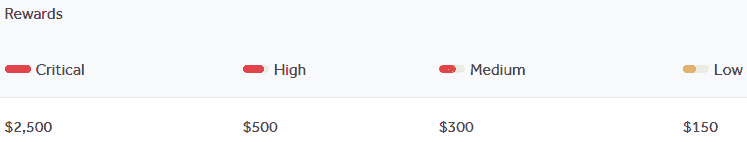

](img/Figure_13.1_B16290.jpg)

图 13.1 – 漏洞赏金支付示例

然而，这可能引发以下问题：

*我只应该检查外部（面向互联网）系统和服务中的漏洞吗？*

## 内部漏洞

尽管面向外部的系统更容易受到攻击，但您仍然负责*公司数据的整体安全*，这意味着您还需要关注数据的*可用性*和*完整性*，这两个因素特别容易受到内部攻击（无论是恶意还是无意的）。

因此，红队也应对内部系统进行测试，以确保数据的**机密性**、**完整性**和**可用性**得到保护。

请查看以下截图：

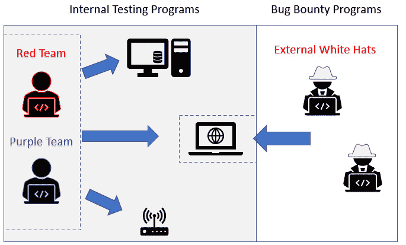

](img/Figure_13.2_B16290.jpg)

图 13.2 – 内部与外部测试程序

如前面的截图所示，漏洞测试程序可以通过利用外部资源来增强系统安全性。

## 漏洞测试工具

有大量工具可以用于执行漏洞测试，我们可以将它们分为两大类：*手动漏洞评估* 和 *自动化漏洞扫描器*。

### 手动漏洞测试

你可以利用我们在前几章中回顾的许多工具，手动查找漏洞——例如，**Burp Suite**、**Nmap**、**Wireshark**、**Shodan** 和 **Web Scrappers**。

这类测试需要更高的技术技能，通常由网络安全专家或红队/紫队来执行。

### 自动化漏洞扫描器

这些扫描器的目标是通过让我们仅需几个步骤，就能扫描给定的网页资源或系统，检测其中的一种或多种漏洞，从而让我们的生活更轻松——事实上，对于大多数扫描器，只需点击一次即可完成。

这使得组织能够扫描其系统中复杂的漏洞，而无需依赖渗透测试人员进行漏洞评估，从而使得这些扫描器成为预算有限的公司聘用渗透测试人员时更合适的选择。

它们中的大多数包含已知漏洞的数据库（**常见漏洞与暴露**，或 **CVE**），并附有相应的脚本来测试每个漏洞。在某些情况下，它们甚至将这些漏洞分组，以便用户确定系统是否符合某些合规要求，例如 **支付卡行业数据安全标准**（**PCI DSS**）或 **健康保险流通与责任法案**（**HIPAA**）。

以下截图显示了 **Nessus** 漏洞扫描器的**图形用户界面**（**GUI**）：

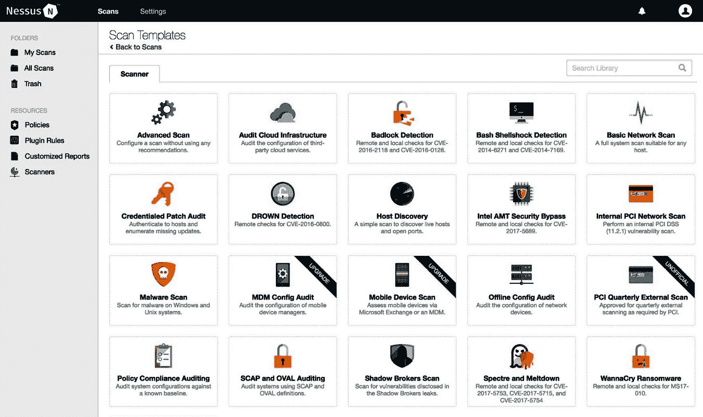

](img/Figure_13.3_B16290.jpg)

图 13.3 – Nessus 漏洞扫描器的图形用户界面

好的——现在，让我们深入了解两款较为著名的漏洞扫描工具：**OpenVAS** 和 **Nexpose**。

# 使用漏洞评估扫描器（OpenVAS）

**OpenVAS** 是最著名的开源漏洞扫描器。

该软件主要由 *Greenbone networks* 作为开源项目维护 ([www.greenbone.net](http://www.greenbone.net))，并作为其商业漏洞管理解决方案套件的一部分。

该软件能够测试整个网络，发现设备，并执行多个操作来确定系统的**操作系统（OS）**、端口、配置和安装的软件，如下图所示：

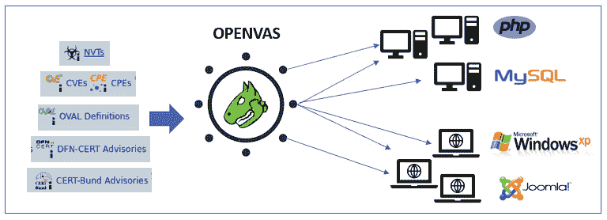

](img/Figure_13.4_B16290.jpg)

图 13.4 – OpenVAS 网络扫描结构

之后，OpenVAS 可以执行多个检查，以识别每个已识别组件上的漏洞。

## 认证测试

OpenVAS 强大功能的一部分是能够执行两种类型的测试：未认证测试和认证测试。

*未认证测试*较少侵入性，因为它仅根据软件、配置和发现的端口测试一般漏洞。

另一方面，*认证测试*更强大，因为它允许你在测试中添加另一个因素——即*用户会话、身份验证和授权*。

在这里，OpenVAS 将使用有效凭证（由测试者提供）运行 **本地安全检查**（**LSC**），以收集有关目标系统漏洞的更多细节。

以下是可以在认证测试中使用的凭证示例：

+   **服务器消息块（SMB）**：用于检查 Windows 系统上安装的软件的补丁级别，如 Adobe Acrobat Reader 或 Java 套件

+   **安全外壳（SSH）**：用于检查 Unix 和 Linux 系统上的补丁级别

+   **ESX 集成（ESXi）**：用于本地测试 VMware ESXi 服务器

+   **简单网络管理协议（SNMP）**：用于测试网络组件，如路由器和交换机

现在，让我们看看如何在我们的 Kali Linux 机器上安装这个工具。

## 安装 OpenVAS

好的——第一步是使用以下命令下载并安装 OpenVAS：

```
sudo apt-get install openvas
```

安装好软件后，接下来执行配置脚本，使用以下命令：

```
sudo gvm-setup
```

*你遇到错误了吗？*

如下截图所示，存在与 **postgresql** 相关的常见错误，但我们将看到如何解决它：

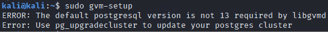

图 13.5 – postgresql 错误

错误的原因是同时运行了两个版本的 **postgresql**，而 **postgresql** 使用 **传输控制协议**（**TCP**），如你所知，它不能在两个版本之间使用相同的端口。

因此，要解决此问题，我们只需确保版本 13 正在 TCP `端口 5432` 上运行，然后可以将任何其他可用端口分配给版本 12。下面是如何操作的。

我们首先打开 `postgresql 13` 的配置文件，如下所示：

```
sudo nano /etc/postgresql/13/main/postgresql.conf
```

在这里，你需要导航到端口并将当前值更改为 `5432`，如以下截图所示：

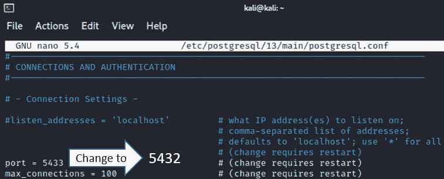

图 13.6 – 更改 postgresql 13 的端口

然后，使用 *Ctrl* + *O* 保存文件，使用 *Ctrl* + *X* 退出，如以下截图所示：

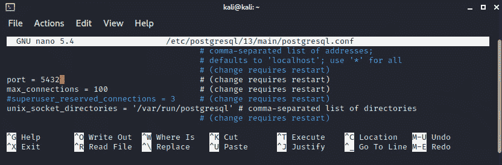

图 13.7 – 保存 postgresql 配置文件

下一步是修改 `postgresql` `12` 的端口，并将端口设置为 `5433`，如下所示：

```
sudo nano /etc/postgresql/12/main/postgresql.conf
```

然后，像之前一样，我们需要更改端口，这次从 `5432` 改为 `5433`，如下截图所示：

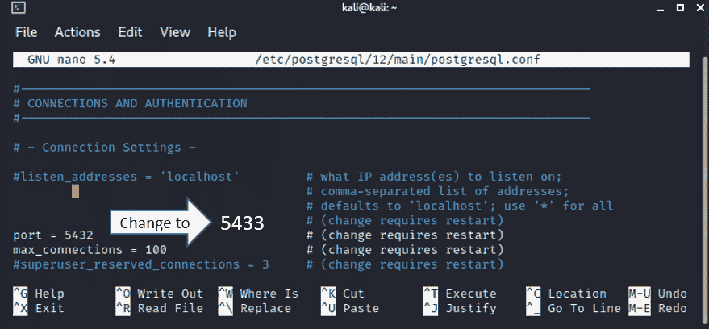

图 13.8 – 更改 postgresql 12 的端口

然后，按 *Ctrl* + *O* 保存文件，再按 *Ctrl* + *X* 退出。

现在，我们只需要使用以下命令重启 **postgresql**：

```
sudo systemctl restart postgresql
```

这样就应该解决问题了！

现在，我们可以返回并运行 OpenVAS 配置脚本，如下所示：

```
sudo gvm-setup
```

现在，过几分钟后，你应该会看到类似下面的内容：

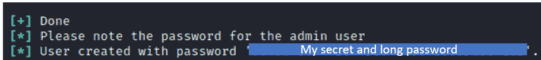

图 13.9 – OpenVAS 配置和密码

提示

确保你复制密码并保存在安全的位置，因为你将需要它来访问 OpenVAS。

此时，你已经准备好启动 OpenVAS！

## 使用 OpenVAS

要执行 OpenVAS，只需键入以下命令：

```
sudo gvm-start
```

请注意，你也可以通过 Kali Linux 的 GUI 启动 OpenVAS，并在 **02 - Vulnerability Analysis** 下浏览应用程序，如下图所示：

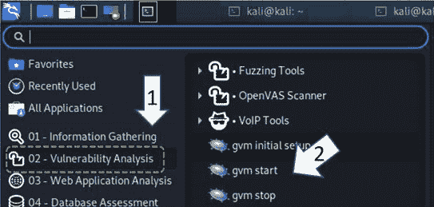

图 13.10 – 打开 OpenVAS

在某些情况下，OpenVAS 可能无法打开默认浏览器，并会显示以下错误：

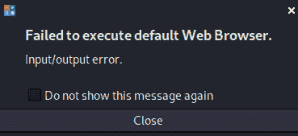

图 13.11 – OpenVAS 配置和密码

但不用担心——在这种情况下，你只需要从命令行复制 OpenVAS 的**统一资源定位符**（**URL**）（如下图所示），然后粘贴到你喜欢的网页浏览器中：

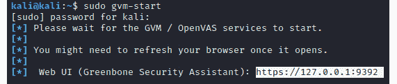

图 13.12 – OpenVAS URL

等等——某些浏览器可能会将此页面标记为危险，如下图所示。不过，你可以忽略警告并继续访问 OpenVAS：

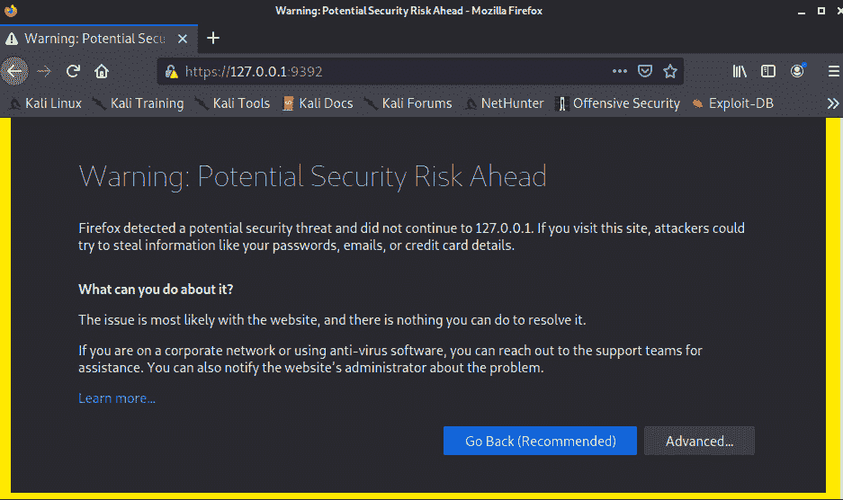

图 13.13 – 打开 OpenVAS 时的通用警告

恭喜！！现在，你应该能看到 OpenVAS 登录页面，如下图所示：

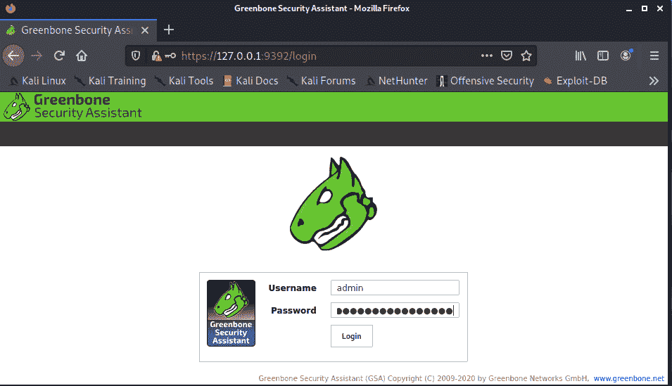

图 13.14 – OpenVAS 登录页面

现在，你可以使用用户名 `admin` 和我们刚才复制的密码登录 OpenVAS。

## 更新你的 Feed

OpenVAS 使用多个 Feed 作为输入来检查漏洞，因此保持其最新非常重要。

要查看版本信息，你可以进入 **Administration** | **Feed Status**，如下图所示：

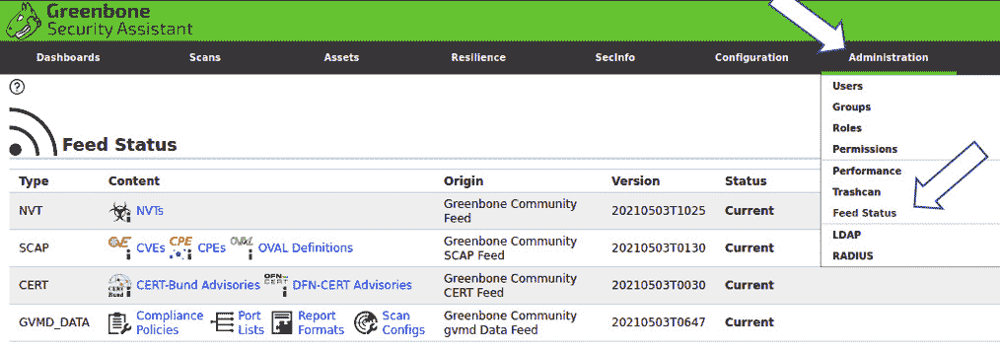

图 13.15 – OpenVAS Feed 状态页面

如果需要更新 Feed，可以使用下述命令。

+   要更新 **NVT Feed**，请运行以下命令：

    ```
    sudo runuser -u _gvm -- greenbone-nvt-sync
    ```

+   要更新 **SCAP Feed**，请运行以下命令：

    ```
    sudo runuser -u _gvm -- greenbone-feed-sync --type SCAP
    ```

+   要更新 **CERT Feed**，请运行以下命令：

    ```
    sudo runuser -u _gvm -- greenbone-feed-sync --type CERT
    ```

+   要更新 **GVMD DATA Feed**，请运行以下命令：

    ```
    sudo runuser -u _gvm -- greenbone-feed-sync --type GVMD_DATA
    ```

完美！现在，你已经拥有一个完全配置、更新并准备执行扫描的 OpenVAS 实例。

如前所述，你可以对特定的 **Internet Protocol**（**IP**）地址或一组 IP 地址进行扫描。

现在，你已经准备好熟悉这个工具并开始测试你的环境。

# Nexpose Community 概述

**Nexpose** 是另一个与 OpenVAS 非常相似的漏洞扫描器。

Nexpose Community 由 **Rapid7** 提供支持，你可以在这里下载：[`www.rapid7.com/info/nexpose-community/`](https://www.rapid7.com/info/nexpose-community/)。

我们必须强调一点，功能已被限制；不过，如果你想要完整版本，他们也提供 Nexpose 的完整版本，30 天试用。

安装步骤在以下链接中有详细文档：[`docs.rapid7.com/nexpose/download`](https://docs.rapid7.com/nexpose/download)。

要运行扫描，你只需按照以下简单流程操作，如*Figure 13.16* 中所示：

1.  **信息与安全**：在这里，你只需添加测试的名称和描述。

1.  **资产**：选择要扫描的*资产*或系统。

1.  **认证**：在这里，你可以添加进行认证测试的凭据。

1.  **模板**：在这里，你可以选择要执行的扫描类型——例如，**Sarbanes-Oxley**（**SOX**）扫描或 PCI DSS 扫描。

1.  **引擎**：在这里，你可以选择系统将从哪些来源收集漏洞。

1.  **计划**：这是一个非常酷的选项，可以让你安排未来的或定期的测试。

你可以在以下截图中看到一个概述：

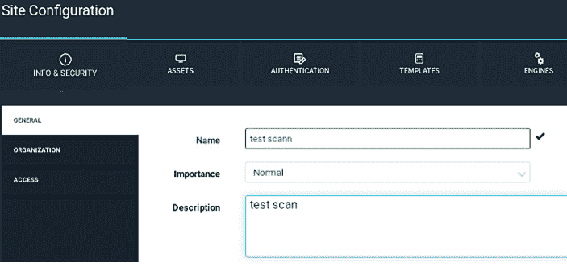

图 13.16 – Nexpose Community GUI

此外，Rapid7 发布了一个名为 **InsightVM** 的新产品（见*Figure 13.17*），宣传为 Nexpose 的增强版，包含仪表盘、修复项目、**持续监控**（**CM**）等功能。

在这里，你可以找到 Nexpose 和新款 **InsightVM** 之间的详细对比：[`www.rapid7.com/products/nexpose/insightvm-comparison/`](https://www.rapid7.com/products/nexpose/insightvm-comparison/)。

你可以在以下截图中看到 InsightVM 的默认仪表盘：

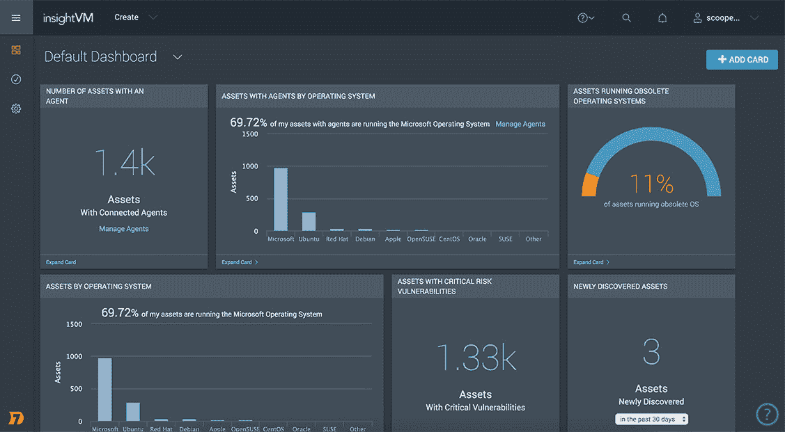

图 13.17 – InsightVM

还有许多其他漏洞测试系统，既可以在本地计算机上运行，也可以是基于云的，您可以在世界任何地方通过简单点击执行。

实际上，还有许多其他工具，如 **legion**、**nikto**、**nmap** 和 **Unix-privesc-checker**，你也可以使用它们来查找系统中的漏洞，正如下面截图所示，这些工具都可以在 Kali Linux 上免费使用：

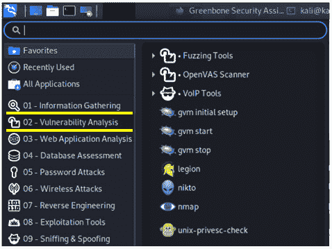

图 13.18 – Kali Linux 上的漏洞分析工具

*哪个更好？*

这将取决于你的公司、预算，甚至你必须遵守的法规。除此之外，考虑你对这些工具中哪个最熟悉和舒适使用也是非常重要的。

# 总结

漏洞管理是防御性安全中的一个关键领域；因此，在这一章中，我们重点介绍了用于执行漏洞评估的工具。

在这里，你还了解了可用工具的类型，以及作为网络安全领导者，你可以使用的一些策略来增强你的漏洞扫描策略。

此外，我们安装了 OpenVAS，它被许多人认为是最佳的免费漏洞扫描工具，毫无疑问，它是你网络安全工具库中的必备工具。

我们以对其他工具（包括免费和付费工具）的概述结束了这一章，你也可以利用这些工具来测试你的基础设施是否存在已知漏洞。

现在，让我们为下一章做准备，在这一章中，你将学习所有关于**恶意软件分析**的知识。

# 进一步阅读

如果你想了解更多关于漏洞奖励的信息，可以参考这本书：

[`www.packtpub.com/product/bug-bounty-hunting-essentials/9781788626897`](https://www.packtpub.com/product/bug-bounty-hunting-essentials/9781788626897)
