# 第十四章：*第十四章*：恶意软件分析

*“恶意软件感染的目标是利用系统，因此恶意软件分析作为一种机制变得非常重要，帮助我们更好地理解恶意软件，从而减少未来攻击的概率和影响。”*

*– Patricia Herrera，网络安全硕士*

**恶意软件分析**被许多人视为一种进攻性安全任务。然而，作为防御性安全的专家，您必须了解这一过程的基础知识，这样您才能在防御性安全策略中加以利用。

因此，尽管本章旨在覆盖恶意软件分析的基础知识，但我们也将涵盖一些高级主题，包括一个实际操作活动，向您展示如何执行基本的恶意软件分析，但更重要的是，如何收集（并解释）分析结果中最有价值的信息。

这里是我们将在本章中涵盖的主要主题的详细信息：

+   恶意软件分析的重要性

+   恶意软件基础知识，包括功能、目标和后门

+   恶意软件分析的类型（静态、动态和混合）

+   恶意软件分析的分类（静态、交互式、自动化和手动）

+   最佳恶意软件分析工具概述

+   实际操作体验，执行基本的恶意软件分析

# 技术要求

对于本章内容，您将需要一台 Windows 机器来执行恶意软件的实际分析。

# 为什么我要分析恶意软件？

让我们首先定义恶意软件分析，作为一种分析恶意软件（软件、脚本、**统一资源定位符**（**URL**）等）以尽可能多地收集有关威胁的信息的过程。

这被视为一项非常技术性的任务，需要高度熟练的专业人员，而这些资源对于公司来说可能非常昂贵。此外，这项任务还可能非常耗时，这进一步增加了执行此分析的成本。然而，即使是预算充足的公司，也可能不会投资于恶意软件分析，原因在于他们还没有意识到这一投资的好处。

因此，让我们首先描述执行恶意软件分析的主要好处和输出。

## 恶意软件功能

恶意软件分析的主要目标之一是发现恶意软件的内部功能。这个步骤至关重要，因为*它将支持在感染后的隔离工作*。这个步骤的主要目标在这里描述：

+   发现恶意软件利用的漏洞来感染系统

+   理解恶意软件在系统之间传播所使用的机制

+   确定恶意软件是否具有任何高级功能，如*自我销毁*、*变形能力*、*传播*、**人工智能**（**AI**）等

## 恶意软件目标

作为本次分析的一部分，您将能够确定恶意软件的目标，这将帮助您*确定每个案例所需的最佳缓解措施*。这里给出了一些例子：

+   数据外泄

+   数据破坏

+   数据加密（勒索软件）

+   数据删除

+   系统故障（网络战）

+   系统中断（黑客行动主义）

+   系统损坏

## 恶意软件连接

恶意软件分析的另一个关键方面是确定*谁*创建了恶意软件，以及被外泄的数据去向何方。

这是因为两个主要原因。第一个是法律方面的问题，因为在大多数国家，分发恶意软件是犯罪行为，因此*识别试图危害你系统的团体至关重要*。

第二个原因是关于使用这些信息来*屏蔽和列入黑名单***互联网协议**（*(**IP**)*）地址，这些地址被恶意软件使用，因为这将防止进一步的攻击。

此外，这些数据（IP、服务器名称等）可以作为*威胁情报*，由开源（众包）系统使用，以防止其他公司和行业的攻击。

看一下以下截图：

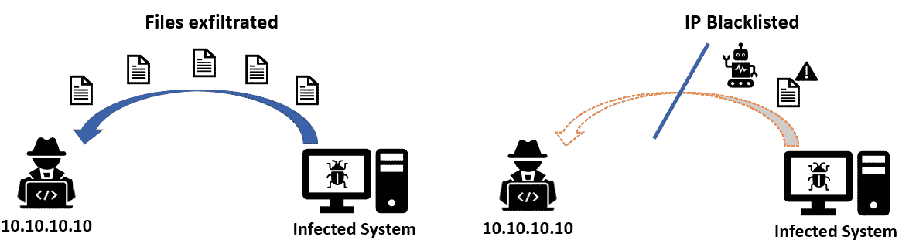

图 14.1 – IP 黑名单

如前面的截图所示，黑名单 IP 地址可能有助于阻止正在进行的攻击，但也可能防止同一团体的未来攻击。还需要记住，黑名单还将阻止**命令与控制**（**C&C**）攻击。

## 恶意软件后门

恶意软件的一个共同特征是创建后门。虽然这些后门的用途和目标可能有所不同，但确定任何后门的踪迹非常重要，以*减少进一步感染或数据泄露的可能性*。

## 受影响的系统

另一个重要的分析因素是有关将受到恶意软件影响的系统（操作系统、软件或硬件）。这非常重要，因为某些恶意软件可能会保持*不活跃*，直到出现特定条件或系统（例如 Stuxnet）。

现在你已经了解了恶意软件分析的好处和重要性，是时候了解恶意软件分析的类型以及它们的类别了。

# 恶意软件分析的类型和类别

有大量工具可以用于恶意软件分析，因此为了更好地理解它们，首先让我们来描述三种（实际上是两种）恶意软件分析工具。

## 静态恶意软件分析

这种类型的分析基于对代码的审查，以确定潜在的威胁指示。这些指示可能是哈希值、IP 地址、代码签名、代码模式、字符串、函数等。

这种分析的主要特点是它不执行代码，虽然这在资源方面是一种优势，但其范围也有限，因为它不能完全测试恶意软件所执行的影响和操作。

另一个缺点是，复杂的恶意软件可能包含先进的功能，旨在绕过这种静态分析。

## 动态恶意软件分析

这种类型的测试需要更多的资源，包括熟练的专业人员，以及技术资源，因为它需要一个隔离的环境来运行测试，称为**沙箱**。

提示

沙箱非常敏感，因为如果没有正确配置和隔离，它们可能会导致灾难性的事件。因此，沙箱只能由经验丰富和经过培训的专家使用。

在这种类型的测试中，恶意软件会在沙箱中执行，以发现前面章节中解释的几乎所有恶意软件特征。

因此，动态恶意软件分析的主要优点是它能提供对恶意软件的更深入洞察，帮助发现额外的信息，这些是静态测试无法获得的。

然而，有些高级恶意软件可以绕过`xxx.xxx.xxx.xxx`——使得动态测试不可靠。

为了解决这个问题，组织现在使用混合方法。

## 混合恶意软件分析  

如下图所示，混合方法是基于前面已解释的两种方法的结合，旨在利用它们的优势，同时弥补它们的弱点：

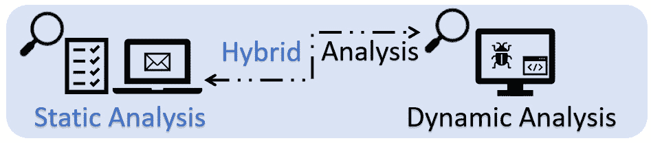

图 14.2 – 恶意软件分析类型

如前所述，先进的恶意软件可能通过使用代码来欺骗沙箱，防止在沙箱环境中完全执行；然而，使用**启发式**方法或签名的静态分析可能能够检测到这种行为，从而允许分析人员修改沙箱，以执行恶意软件的*隐藏*功能或操作。

什么是启发式恶意软件分析？

启发式方法被引入作为一种检测新威胁的方式，例如未知的恶意软件、修改过的恶意软件，甚至是多态性恶意软件。它们基本上通过分析文件的代码，寻找已知病毒的片段、常见的功能或仅出现在恶意软件中的代码，例如加密整个硬盘、禁用杀毒软件等。

我知道你想了解更多关于恶意软件工具的内容，但在深入了解之前，我们需要了解恶意软件分析的各个阶段，因为这可能作为一种分类方法，帮助区分不同的工具。

现在，让我们探索恶意软件分析的不同类别。

## 静态属性分析

这是一种简单的分析类型，旨在分析恶意软件的一些基本特征（元数据），以便更好地了解恶意软件。

通常，这是判断是否需要进一步分析的第一步，甚至可以帮助确定更合适的分析方法。

## 交互式行为分析

交互式行为分析是一种非常复杂的分析类型，在这种分析中，分析人员与恶意软件进行交互，以便更好地理解它（影响、连接等）。这种测试在一个专门为执行此测试而创建的受保护和隔离的环境中进行。这样可以使分析人员确定恶意软件对**操作系统（OS）**、注册表项、进程、服务相互依赖、后门等所造成的更改。

## 完全自动化分析

这是一组预定的测试，可以对给定的恶意软件执行，以收集一些额外的信息。这个测试通常是*基于云*的（作为服务），并由第三方提供。

主要的优势之一是它会生成一份易于阅读的报告，这意味着执行此类测试不需要特殊技能。此外，当公司需要以方便快捷的方式分析大量恶意软件样本时，这种分析是非常推荐的。

## 手动代码逆向

这可能是最复杂的恶意软件分析类型，因为它需要使用调试器、反汇编工具或编译器进行代码逆向。

在某些情况下，甚至可能需要高级的加密技能来执行此类测试。

不同类别的恶意软件分析如下面的图所示：

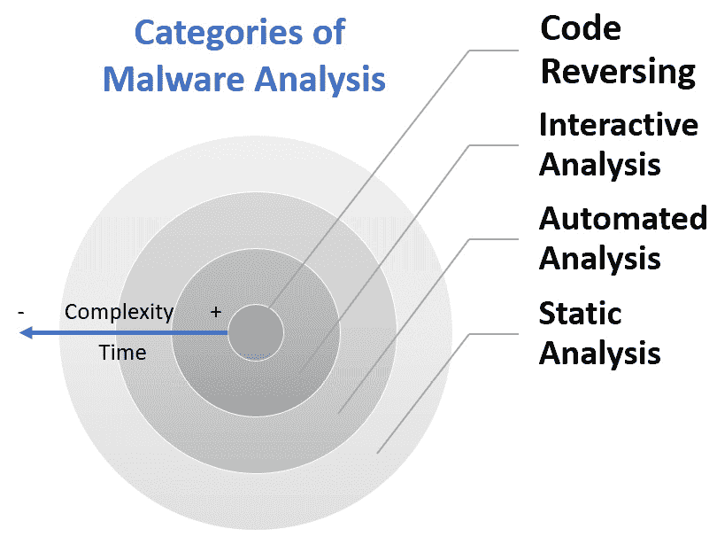

图 14.3 – 恶意软件分析的类别

如前图所示，代码逆向是最复杂且最耗时的分析过程。

好的——现在你已经成为恶意软件分析概念的专家（包括它们的类别和分析类型），是时候进入下一个话题，最终看到用于执行恶意软件分析的工具了。

# 最佳恶意软件分析工具

让我们回顾一下用于恶意软件分析的五大工具。此汇总包含了所有类型和类别的恶意软件分析工具。

## 进程浏览器

这个工具基本上是一个*超级任务管理器*，可以为你提供关于系统中正在运行的进程的详细信息。

它告诉你文件的位置、**自动运行**设置、进程的专用性能图（有助于发现异常模式），并且如以下截图所示，它提供了一个选项，可以使用[VirusTotal.com](http://VirusTotal.com)的数据库检查每个进程，如果你想测试可疑进程，这非常有用：

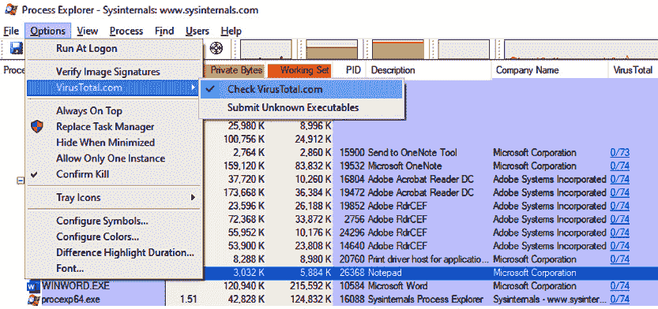

图 14.4 – 使用进程浏览器通过 VirusTotal.com 检查运行中的进程

这个工具虽然基础，但它是免费的，并且得到了微软的支持，所以它绝对是一个很好的起点。

要下载它，请访问官方网站：[`docs.microsoft.com/en-us/sysinternals/downloads/process-explorer`](https://docs.microsoft.com/en-us/sysinternals/downloads/process-explorer)。

## 进程监视器

**进程监视器**（**ProcMon**）是微软（前 Sysinternals）提供的另一款出色工具，允许你实时监控所有与文件系统、进程和威胁活动相关的活动。可以通过以下链接免费下载可执行文件：[`docs.microsoft.com/en-us/sysinternals/downloads/procmon`](https://docs.microsoft.com/en-us/sysinternals/downloads/procmon)。

然而，这个工具每秒可以记录成千上万的事件，因此有可能会漏掉某些事件。不过，为了克服这个问题，你可以将结果导出为**逗号分隔值**（**CSV**）文件，利用像*ProcDOT*这样的工具进行离线可视化。

## ProcDOT

如前所述，有一些很棒的工具，例如**ProcMon**和**Wireshark**，它们提供了很好的洞察力来揭示潜在的恶意软件；然而，这两个工具生成成千上万条记录，使得数据分析过程非常复杂且耗时。

但这时**ProcDOT**派上用场，它使你能够通过交互式图表关联来自两个数据源（ProcMon 和 Wireshark）的数据，这在分析过程中大有帮助。此外，该工具具有以下主要功能：

+   动画模式（非常适合轻松理解时间方面）

+   智能跟踪算法（帮助你聚焦于相关项目）

+   线程注入的检测和可视化

+   网络活动的关联（以及引发这些活动的进程）

+   活动时间线

+   用于清理噪音的过滤器（按全局和会话分类）

以下截图展示了来自 ProcDOT 的可视化分析和关联结果：

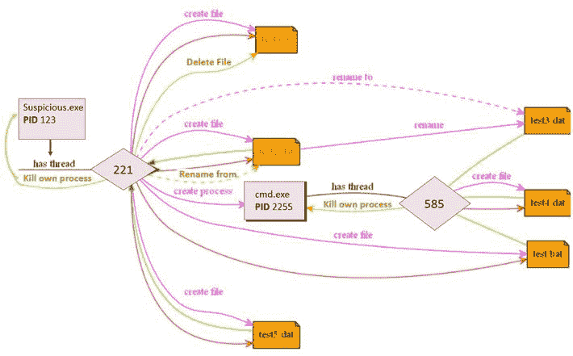

图 14.5 – ProcDOT 可视化分析

哦，此外这个工具是免费的，可以通过以下链接获取：[`www.procdot.com/index.htm`](https://www.procdot.com/index.htm)。

## Ghidra

**Ghidra** 是一款由**美国国家安全局**（**NSA**）开发的出色的**软件逆向工程**（**SRE**）套件，自 2019 年以来已作为开源软件免费发布。该软件的一个主要特点是能够在不执行代码的情况下进行反汇编。

此外，Ghidra 还具有以下功能：

+   在 Windows、macOS 和 Linux 上进行编译代码的跨平台分析

+   代码的反汇编、汇编和去混淆、图形化和脚本编写

+   支持多种架构，包括**高级 RISC 机器**（**ARM**）、PowerPC、**每秒百万条指令**（**MIPS**）、Java、6800、x86、x64、**精简指令集计算机**（**RISC**）等。

安装文件和**常见问题**（**FAQ**）可以在官方网页上找到：[`ghidra-sre.org/`](https://ghidra-sre.org/)。

## PeStudio

**PeStudio** 是一个很棒的工具，用于*在 Windows 机器上进行静态恶意软件分析*。

一个很酷的功能是*你不需要安装它*，因为它作为便携式可执行文件在 Windows 上运行。另外，请注意，软件有一个免费的基础版，也有一个可以以低价购买的高级版。

现在，让我们通过实际操作恶意软件分析来深入了解这个工具。

# 执行恶意软件分析

首先，让我们从他们的网站上下载可执行文件：[`www.winitor.com/download`](https://www.winitor.com/download)。

一旦你有了可执行文件，只需双击它们即可运行。然后，你将看到主界面，如下图所示：

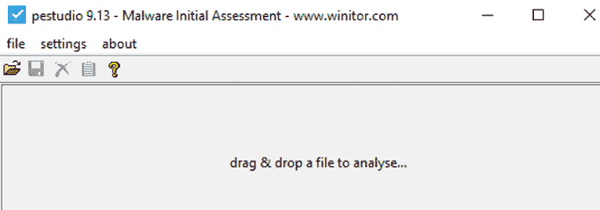

图 14.6 – PeStudio 图形用户界面

现在，如前面的截图所示，我们只需要拖放我们想要分析的文件即可。

注意

恶意软件分析是一项危险的任务，可能会损害你的计算机甚至整个网络，因此，在开始之前，你需要遵循一些安全措施，正如我们接下来强调的那样。

## 安全措施

有一些安全规则必须遵循，以减少执行恶意软件分析时的风险。以下是这些规则的汇总：

+   切勿使用个人计算机或工作计算机进行恶意软件分析。

+   确保用于测试的计算机与网络隔离。

+   推荐使用隔离的虚拟沙箱环境。

+   尽可能为每次分析使用一个新的沙箱。

+   使用托管在与网络隔离的计算机上的**虚拟机**（**VM**），该虚拟机应安装全新的镜像且没有其他数据存储。

+   分析完成后，删除虚拟机。

+   为每次分析创建一个新的虚拟机。

+   在处理危险的恶意软件并进行动态分析时，请彻底清除主机计算机的硬盘并重新安装操作系统。

+   一旦识别出恶意软件，检查该恶意软件是否能够隐藏在**硬盘驱动器**（**HDD**）的启动扇区中，如果是，请采取必要的修复措施，彻底清除恶意软件，因为普通的磁盘清除可能不足以完全清除恶意软件。

好了，安全措施已经明确，接下来我们开始执行分析。

## 执行分析

在此案例中，我们将执行几种类型的分析，使用不同的文件类型，以便探索使用此工具可以收集的不同类型的数据。

这里的想法是通过工具的使用，确定在执行分析时需要查找的信息；因此，使用真实的恶意软件进行此示例是一种不必要的风险。相反，我们将使用已知的安全文件来执行分析。

对于第一个，我将使用一个注册表文件（例如，你可以使用 PeStudio 安装包中的那个）。

如下图所示，主屏幕会提供一些基本信息，如哈希值（这些哈希值可以与已知哈希数据库进行对比）：

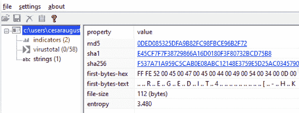

图 14.7 – PeStudio 的基本输出

此外，如*图 14.8*所示，还有一个名为**virustotal**的重要部分，它通过 VirusTotal **应用程序编程接口**（**API**）与 VirusTotal 集成，以告知您不同防病毒软件对该文件的评级。在这里，您需要考虑它连接到外部服务器进行查询；因此，这里的结果可能需要一些时间才能显示出来。但是，如果其他人已经扫描了该文件，那么输出几乎是立即的。现在，这也告诉您一些关于文件的信息，因为如果找不到它，那么您可能面临一个非常新的威胁或修改后的文件用于攻击您的基础设施，因此这可能作为证据表明您正在面临有针对性的攻击。

这里的另一个有趣的数据是**年龄**列，因为它显示了每个防病毒软件扫描的时间，正如下面的屏幕截图所示，其中有一个超过 2 年的扫描，这意味着这个文件已经存在了相当长的时间：

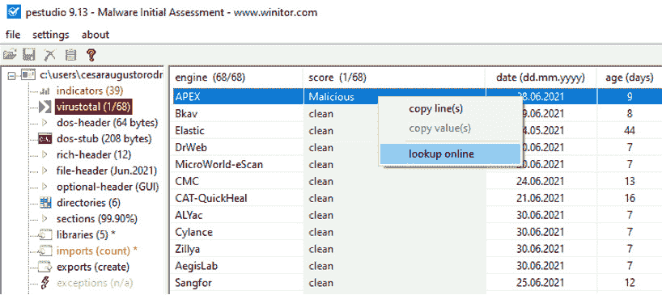

图 14.8 – VirusTotal 的扫描结果

现在，**字符串**部分非常重要，因为它读取文件的实际内容，所以您可以在不打开文件的情况下进行探索。例如，在以下屏幕截图中，我们可以看到注册表键的值：

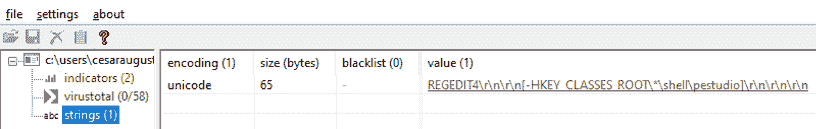

图 14.9 – 检查注册表文件的值而无需打开它

另一个例子是您可以确定文件内容是否编码了任何网址（例如 C&C 服务器），如下面的屏幕截图所示。在这个屏幕截图中要突出的另一个有趣的项目是工具还显示了长字符串，这可能被视为一种威胁。这非常有用，因为它通过非常清晰的方式向您显示这些信息，否则这些信息将很难手动查找：

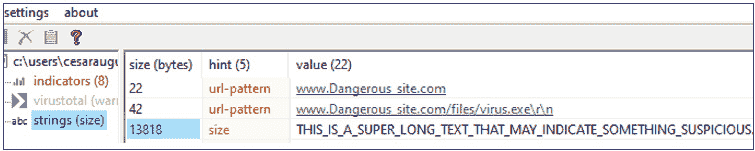

图 14.10 – 文件内找到的 URL 模式

好了，现在让我们扫描一个更复杂的文件，例如`.dll`文件。

如图 14.11 所示，PeStudio 现在显示了更多类别和大量有用信息。

例如，**字符串**部分包含许多有趣的信息，如以下内容：

+   与注册表键的交互或操作

+   与文件的交互或操作，包括权限（例如，获取文件大小，删除文件，写入文件等）。

+   执行系统操作（打开进程，删除进程等）

+   窗口（GUI）管理（关闭窗口，发送弹出窗口，获取弹出窗口数据等）

+   **输入和输出**（**I/O**）操作（获取活动窗口，鼠标或键盘操作等）。

另一个需要查看的重要类别是与此文件相关的`.dll`文件，这对于确定恶意软件的范围至关重要。此外，PeStudio 允许你复制`.dll`文件的名称。如果你不熟悉`.dll`，可以在谷歌搜索以获取更多帮助（或直接访问**Microsoft Developer Network**（**MSDN**））。

你可以在这里看到 PeStudio 的概览：

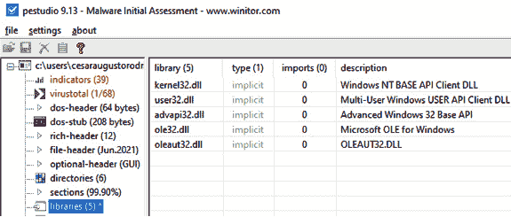

Figure 14.11 – 在 PeStudio 中分析库

现在，在**sections**类别中，你将能够看到恶意软件的高级属性，例如文件是否可写、可执行、可共享或可丢弃（用**X**符号表示）。在这一部分中，你还可以看到恶意软件的另一个常见特征——自我修改，这是变形恶意软件的常见特性。

**文件头**类别还展示了一个非常重要的信息，即文件编译的时间。此外，请记住，一些恶意软件具有自动编译的特性，因此如果日期非常新，可能意味着你正面临的是高级的自动编译恶意软件。

哦，还有一件事：如果[VirusTotal.com](http://VirusTotal.com)的任何杀毒引擎将文件识别为恶意软件（如下面的截图所示），那么你可以选择进入**virustotal**类别，获取有关恶意软件的更多信息：

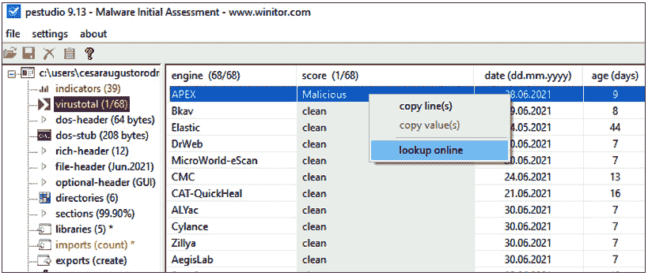

Figure 14.12 – 查看 PeStudio 中的 VirusTotal 扫描结果

**virustotal**类别还提供了大量超级有用的数据，你可以将其与自己的分析结果进行关联。例如，**virustotal**会显示恶意软件影响、删除或更新的注册表键值，以及其他操作，如被恶意软件终止的进程。

*在我们结束这一章之前，请记住，在进行恶意软件分析之前，务必遵循必要的安全措施。*

# 总结

在本章中，我们学到了很多关于恶意软件分析的内容，但更重要的是，我们了解了如何收集和理解用于分析的工具的输出结果。

虽然恶意软件分析大多由专业团队（使用专业工具和环境）执行，但通过学习这个过程，你已经掌握了在全球网络安全战略中像专业人士一样管理的技能！

现在，是时候进入另一个激动人心的章节，在这一章中，我们将学习如何在防御安全中利用渗透测试工具和技术。

# 进一步阅读

若想了解更多关于恶意软件分析的信息，可以阅读以下书籍：

[`www.packtpub.com/product/mastering-malware-analysis/9781789610789`](https://www.packtpub.com/product/mastering-malware-analysis/9781789610789)
