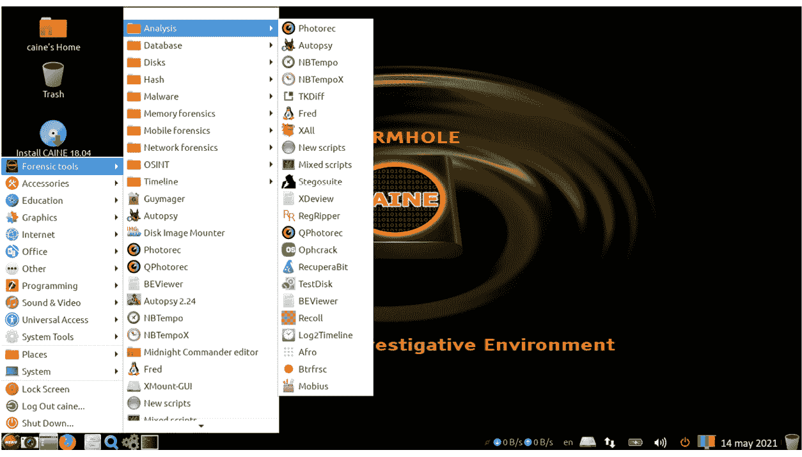

# 第十六章：*第十六章*: 实践取证

*“处理数字证据对于司法系统来说是一个巨大的挑战，特别是当我们意识到它带来的新挑战和风险时，比如收集证据的远程操控。”*

*– 法官 RosibelJara*

数字取证是一个非常复杂的话题，因为正如你在本章中将看到的，即使你无法访问设备，仍然可以收集证据。因此，为了在法庭上被接纳，数字证据必须遵守一系列条件和规定，以确保数字证据得到了妥善处理，并且它被适当保存。因此，数字取证专家的角色对于确保数字取证过程的成功至关重要。本章旨在为你提供一个非常好的入门介绍，并作为你需要面对这一过程时的起点。

本章将涵盖以下主题：

+   数字取证简介

+   防御安全中的数字取证

+   取证平台

+   寻找证据

+   移动取证

+   证据管理

# 数字取证简介

**数字取证**（也称为**网络取证**或简称取证）是从数字系统中收集、识别、收集、保护和存储数据的过程，这些数据可以作为证据使用。

在我们的案例中，我们将专注于用于检测计算机系统、服务器、网络、基础设施或数据的使用、滥用、入侵、损坏或修改的取证。然而，取证也用于恢复已删除或修改的数据，因此我们先花几分钟回顾一下取证如何用于这一过程。

## 用于恢复已删除或丢失数据的取证方法

取证的一个部分是用于从数字媒体中收集、识别和恢复已删除数据。

通常，数据是从非易失性媒体存储中恢复的，如硬盘和 USB 驱动器，但也可以从易失性内存中收集数据，如**随机存取内存（RAM）**。

易失性与非易失性内存

易失性内存，如 RAM，是一种只在设备开机时保存信息的内存，而非易失性内存，如硬盘，可以在没有电源的情况下长时间保存信息。因此，从易失性内存中收集信息被认为是一个更复杂和专业的任务。

现在，让我们先来回顾一下如何从易失性内存中捕获数据。

### 从 RAM 中恢复数据

由于 RAM 的硬件性质，从 RAM 中恢复数据被认为是一个非常复杂的任务。然而，我们可以使用一个工具和一种方法来实现这一目标。我们来看看。

#### 微软 COFEE

**微软计算机在线取证证据提取工具**（**COFEE**）工具包由微软开发并分发给警察机构，帮助他们从微软系统中收集数字证据。

该工具作为一个实时 USB 加载，包含一个**图形用户界面（GUI）**，并拥有超过 150 个取证工具，包括存储在易失性内存（RAM）中的数据。

这款工具的副本据说在 2009 年泄露到互联网上，如果你有兴趣查看它，简单的 Google 搜索会给你 WikiLeaks 页面的链接来下载它。

提示

请记住，泄露版的软件可能包含恶意内容，因此避免在主计算机上运行此类软件。相反，尝试使用虚拟沙箱环境，并在下载和运行此类软件时采取所有必要的预防措施。

#### 冷启动攻击

这是一种非常有趣的方式，直接从 RAM 中收集数据。让我来解释一下它是如何工作的：

1.  首先，你需要物理访问计算机。

1.  打开计算机。

1.  冷却 RAM 模块（可以使用冷冻喷雾剂）。

1.  切断机器电源。

1.  使用轻量级 USB 启动**操作系统（OS）**启动计算机。

1.  使用任何可用的内存转储软件或脚本执行内存转储。

如下图所示，这种攻击的一个限制是，恢复的数据量与所需时间成正比。这意味着，执行转储的速度越快，恢复的数据就越多。

图 16.1 – 冷启动攻击中时间与数据的关联

正如你想象的那样，存在物理破坏内存的风险，因此强烈建议仅在非常受控的空间（实验室环境）中使用此方法。此外，只有在你希望检查的计算机已开机的情况下，此方法才有效。

可以从 RAM 中恢复什么数据？

可以从 RAM 中恢复的数据包括未保存的文档、草拟的电子邮件、密码、聊天记录、用户名、打印的文档（打印作业）、设置、网络或连接设置，如 IP 地址和**服务集标识符（SSID）**等。

现在，让我们来看看我们可以用来从非易失性内存中恢复数据的工具和方法。

### 从非易失性内存中恢复信息

有许多工具可以用来从非易失性内存（如硬盘）中恢复已删除的数据。大多数工具非常容易使用，并且在 Windows 计算机上具有非常友好的用户界面，例如**Recuva**。

此外，还有一些更先进的工具，如**Foremost**，这是一个加载在 Kali Linux 上的工具。我们在*第五章*中介绍了 Foremost 的配置和执行，*网络安全技术与工具*。

### 数字恢复与物理恢复

为了说明数据恢复的工作原理，让我从解释 Windows 如何管理文件开始。

Windows 使用一种叫做**主文件表**（**MFT**）的东西。这个表就像一本书的索引，它告诉**操作系统**（**OS**）每个文件的位置，通过指向文件所在的硬盘扇区来实现。这意味着，当你想打开一个文件时，操作系统会检查 MFT 来找出文件的位置，然后从磁盘中检索数据。

如下图所示，为了提高计算机速度，当你删除一个文件时，操作系统会删除 MFT 中的条目，使得该扇区变得*可用*，可以被另一个文件使用。然而，信息仍然保留在硬盘上，直到操作系统用另一个文件覆盖该扇区：

图 16.2 – Windows MFT 表结构

因此，大多数数字恢复软件所做的就是对硬盘扇区进行深度扫描，根据磁盘中找到的内容重建 MFT。类比来说，这就像是阅读一本书以重建它的索引（目录）。

也有硬盘分区或系统损坏的情况。在这些情况下，可以通过将硬盘连接为外部驱动器到另一台计算机，并在另一台计算机上运行恢复软件，轻松检索文件。

然而，也有硬盘因旋转和摩擦造成所有活动部件不断使用而发生物理损坏的情况，如下图所示。损坏的例子包括坏头、头碰撞、划痕，甚至是转子损坏。

提示

在大多数情况下，硬盘损坏是渐进性的，因此如果你开始听到来自计算机的点击声或嗡嗡声，那么是时候更换硬盘并保存你的数据，以免为时已晚。

在所有这些情况下，恢复是可能的，但仅能通过专家使用特殊设备和 properly 设置的实验室进行。还要注意，物理恢复通常是昂贵的。

图 16.3 – 硬盘的活动部件

关于**固态硬盘**（**SSDs**），由于没有活动部件，因此损坏的风险较低。然而，如果发生物理损坏，恢复过程会更加复杂。

现在，让我们从防御安全的角度关注计算机取证，来检测计算机系统、服务器、网络、基础设施或数据的使用、滥用、入侵、损坏或修改。

# 防御安全中的数字取证

在谈到防御安全中的取证时，我们必须在几个领域进行取证，包括以下内容：

+   数据分析

+   日志分析

+   电子邮件取证

+   数据库取证

+   恶意软件取证

+   内存取证

+   移动取证

+   网络取证

现在，让我们深入了解数字取证的管理方式，包括涉及的过程。

## 谁应该负责数字取证？

有两种主要方式来管理所有这些取证工作。虽然一些公司有专门的取证专家来处理所有与取证相关的任务，但其他公司则在每个领域培养专家，作为取证专家。此外，还有一位取证协调员，作为所有取证活动的领导者。

## 数字取证过程

大多数公司根据自己的需求和成熟度定制数字取证过程。然而，让我向你展示执行数字取证时必须遵循的步骤：

+   **数据处理与保管**：在取证过程中管理数据是*确保结果成功的关键*。你需要记住，在这个过程中收集的数据可能会用于起诉或采取其他法律行动，因此你*必须*确保数据的收集是基于司法系统认可的标准。

    此外，你还需要应用必要的工具和技术，以确保数据从收集到呈现的完整性（例如，将数据作为证据提交给法院）。展示数据完整性的最常用方法之一是对收集的数据进行哈希处理，正如在*第五章*《网络安全技术与工具》中提到的那样。

+   **数据收集**：任何取证过程的第一步是从所有可用的来源收集*所有*数据。这一步非常重要，以至于我们将在接下来的章节中深入讨论。

+   **数据分析**：在这一阶段，分析师首先通过过滤大量信息，以便基于相关信息进行分析，从而减少不必要的工作。然后，他们必须使用多种工具和方法来分析已收集的数据。正如我们之前提到的，这种分析可以在任何类型的存储介质（易失性或非易失性）上进行，并使用数字和物理恢复技术。整个取证过程的结果依赖于正在分析的数据和设备，因此这一任务必须由认证的专业人士来执行。

    提示

    如果你有兴趣获得取证认证，我强烈建议你访问这个网站：[`i2c2x.com/`](https://i2c2x.com/)。

+   **保存或归档证据**：一个常见的错误是在审判后删除证据。然而，这些数据在上诉过程中可能仍然具有价值，能够识别重复犯罪者（这对于判断某人是无意使用者还是恶意内部人员可能至关重要），甚至在威胁情报中，通过将数据与新事件进行关联，以识别进一步的攻击。

    因此，最佳做法是创建一个数据保留政策部分，确定归档数字证据所需的时间。请注意，在某些情况下，这一政策可能会受到某些法规或法律的影响。

图 16.4 – 数字取证过程

现在，是时候看看一些用于执行数字取证和收集数字证据的平台了。

# 取证平台

正如我们之前提到的，取证过程是一项非常敏感的任务，必须小心谨慎地进行，以确保收集到的数据得以保存，并且其完整性得到保证。

然而，这并不是通过单一工具就能实现的。相反，取证专家必须根据多个因素（如数据来源、存储类型和操作系统）选择最适合每个场景的工具。

好消息是，为了简化我们的工作，一些操作系统已经专门设计成执行取证活动，并预装了一系列取证工具。

此外，这些操作系统中的一些还可以作为可启动的 live CD 或 live USB 使用，这使我们能够执行更高级的取证操作。

现在，让我们回顾一些这些取证操作系统的集合。

## CAINE

**计算机辅助调查环境**（**CAINE**）是一个基于 GNU/Linux 的*live*发行版，提供一个完整的取证环境，包括现有软件工具作为软件模块，以及一个友好的图形界面，支持取证专家在数字调查过程中进行操作。

图 16.5 – CAINE GUI

如前面截图所示，CAINE 预装了大量现成的取证工具，包括**The Sleuth Kit**、**Autopsy**、**RegRipper**、**Wireshark**、**PhotoREC**等。

他们的官方下载页面是[`www.caine-live.net/`](https://www.caine-live.net/)。

## SIFT 工作站

SIFT 工作站是一个免费的开源取证工具集，用于进行详细的数字取证。它有两种安装方式：一种是下载一个现成的虚拟机，另一种是直接在 Ubuntu 机器上安装：

图 16.6 – SIFT 工作站

上面的截图展示了 SIFT 的虚拟机安装版，可以从 SANS 网页下载，链接为[`www.sans.org/tools/sift-workstation/`](https://www.sans.org/tools/sift-workstation/)。

## PALADIN

**PALADIN**是一个基于 Ubuntu 的修改版*live* Linux 发行版，简化了各种取证任务。它包含了很多取证工具，分为 33 个类别，如下图所示：

图 16.7 – PALADIN 工具分类

关于 Paladin 的更多版本信息，请访问他们的官方网站[`sumuri.com/software/paladin/`](https://sumuri.com/software/paladin/)。

现在我们了解了数字取证的各种工具和平台，让我们来学习如何获取证据，以及确保在取证检查过程中不会遗漏任何数据的主要来源。

# 寻找证据

一旦发现攻击，许多事情需要以最高优先级完成，包括恢复受到影响的系统和服务。然而，另一个关键任务是找到并保护与攻击相关的所有证据。这个任务至关重要，因为它可以让你做以下几件事：

+   确定攻击是由内部人员还是外部人员发起的。

+   确定内部人员是恶意的还是无意的用户。

+   确定攻击者利用的漏洞。

+   根据**机密性**、**完整性**和**可用性**（**CIA**）三要素来确定对业务数据的影响。

+   确定受攻击影响的系统或服务。

+   收集证据以执行法律或纠正措施（来自人力资源部门）。

既然你已经知道收集证据的重要性，让我们来看一下有关收集过程的一些最佳实践。

## 数据来源

正如你所知道的，在取证过程中有很多地方可以收集数字信息。你需要查找的最常见文件类型是日志文件，因为它们通常会记录设备上的所有事件（我们在*第十五章*，*利用渗透测试进行防御性安全*中讨论过此话题）。

一个常见的错误是仅检查服务器上的日志。然而，实际上还有很多其他地方可能是重要的信息来源。在本节中，我们将探讨一些，首先从非易失性内存开始。

### 非易失性内存

如前所述，可以从 RAM 中获取数据，因此在数字调查过程中，你可能希望先进行 RAM 转储，以获取一些额外的信息，然后再执行其他操作或关闭服务器。

### 恢复已删除的数据

你还应该在硬盘上搜索已删除数据的痕迹。这对于检测恶意内部人员尤为重要，因为他们可能会通过删除日志或类似记录来掩盖自己的行踪。在这种情况下，你可能无法恢复已删除的信息，但你可能能证明某些日志已被删除或篡改，这本身就可以成为证据。

### 路由器和其他网络设备

这可能是攻击发生后第二常见的寻找痕迹的地方。

除了寻找异常活动外，你还需要寻找日志篡改的迹象，如删除的条目，因为这些可能是攻击的指示。

### 物联网设备

通常，物联网（IoT）日志文件被忽视，但它们可以是一个很好的信息来源，特别是当它们被用作你基础设施的入侵点时。

### 网络打印机

网络打印机通常被忽视，但从本质上来说，它们是网络设备，这意味着它们可能成为攻击的跳板。此外，这些设备的安全性较弱，这正是攻击者越来越多地针对这些设备的原因。

您会对通过检查这些日志所能收集到的所有信息感到震惊，其中包括以前试图入侵您网络的尝试。

### 移动设备

智能手机等移动设备作为迷你计算机，可以被用作进入您公司网络的一个入口。

因此，使用能够收集关于移动设备使用情况和互动的日志的监控软件非常重要。如果您的公司有**自带设备（BYOD）**政策，那么这点尤其重要，因为这些设备更容易受到攻击，因此控制这些设备是必须的。

移动设备的取证是一个大话题，所以我们来详细回顾一下这个话题。

# 移动取证

移动取证已经成为取证领域最大的专门化领域之一——不仅因为几乎每个人都有智能手机，还因为智能手机可以收集大量的数据。

移动取证的酷点在于，在某些情况下，*您甚至不需要手机就可以收集到智能手机收集到的一些数据*。让我向您展示如何操作。

## 无设备取证

智能手机会收集大量信息，如位置、消息、搜索、常去地点、应用使用情况、浏览历史等，但最有趣的是，Google（是的，就是 Google）会将所有这些数据记录在他们的云端。让我们学习如何访问这些数据：

1.  访问 [`takeout.google.com`](https://takeout.google.com)。

1.  使用您的用户凭证登录。

1.  选择您想要检索的数据。

1.  选择您希望如何接收文件（通过驱动器、云存储或直接下载链接）。

1.  选择您是只想这次导出文件，还是希望安排未来的导出。

1.  确定文件类型和每个文件的最大大小。

1.  点击**导出**。

导出取决于 Google 收集到的关于您的数据量，因此请考虑到在某些情况下，导出所有数据可能需要几小时甚至一天的时间。

图 16.8 – Google Takeout 页面

信息类型取决于您使用的 Google 服务。然而，对于 iPhone 用户来说，这可能是可选的，但这里收集的一些信息适用于所有 Android 用户。您可能会对收集到的数据量感到惊讶。例如，在导出的文件中，您不仅能看到应用程序的使用详情，还能看到使用的具体时间（以及时间戳）。

以下是一些可以导出的数据示例：

+   通过 Google Home 获取的物联网设备信息

+   日历条目（包括创建和删除的时间）

+   您的 Google Chrome 访问的所有内容（历史记录、设置等）

+   有关您打印文件的信息（Google Print）

+   使用 Google 搜索或地图进行的购买和预定信息

+   在 Google 社区上发布的图片和文字

+   联系人照片

+   有关您 Google 账户的注册和活动数据

+   Google Fit 收集的所有生物识别数据，包括睡眠数据、训练数据、步行距离等

+   关于您的 Google 搜索的元数据

+   使用 Google Pay 进行的购买历史

+   您在 Google Books 上阅读或购买的书籍信息（包括笔记和标记）

+   基于 Google Play 电影的电影偏好（包括播放列表，甚至是您为每部电影提供的评分）

+   基于 Google Shop 的购物历史（包括送货地址）

+   您在 Google Hangouts 中的聊天记录（包括附件的图片）

+   基于 Google 地图的导航历史（包括访问网站的偏好和评论）

+   设备配置、性能数据、软件版本等（适用于 Android 设备）

+   有关您在 Google Play 上玩过的游戏信息（包括分数）

+   已安装的应用程序、评分和购买记录（Google Play）

+   您的位置信息历史（基于 GPS 收集的数据）

+   在 YouTube 上搜索和观看的视频历史

+   还有更多

此外，如下图所示，您还可以选择其他参数，例如导出数据的格式以及要包含的导出项目：

图 16.9 – Google Takeout 导出设置

对于 iPhone 用户，情况略有不同，因为其隐私政策比 Android 更为严格。这意味着收集关于用户的已保存信息更加复杂。苹果没有类似于此页面的选项，用户无法直接请求其数据，因此，从 iPhone 收集此类信息可能需要向苹果直接发送法律请求，以获取授权来共享这些用户信息。

## 移动设备上的重要数据来源

正如我们之前提到的，移动设备会收集大量数据，甚至在没有访问手机的情况下也能获取。然而，如果您能够访问手机，可能还能收集到更多的信息。

尽管大多数书籍会告诉您收集诸如图片、通话记录、消息和其他容易识别的数据，但移动设备上还有许多可以收集的数据。让我们来看一下我列出的移动设备数据收集清单：

+   **Wi-Fi 连接数据（包括已知 SSID 的列表）**：这对于确认用户是否在某个特定位置，或者是否尝试连接到未经授权的网络，可能非常有用。

+   **蓝牙连接数据**：这有助于确定是否连接了未经批准的设备。

+   **操作系统安装细节**：这些数据对于确定设备是否最近恢复为出厂设置非常有用，这可以作为设备数据被擦除的证明。

+   **应用列表**：这可以用来确定设备上是否安装了未经授权的软件。例如，这在确定某个无意间使用的第三方软件是否存在漏洞或用于泄露设备数据时特别有用。

+   **操作系统更新信息**：这些信息对于确定设备是否因操作系统某些安全更新缺失而被攻击或入侵非常有用，甚至可以证明设备即使在完全修补后仍然存在漏洞（这可能揭示零日攻击的存在）。

+   **Root 权限、越狱和其他操作系统修改**：检查是否有越狱或其他未经授权的操作系统修改的痕迹非常重要，因为这可能代表公司政策的违背。这也可能是设备被入侵的原因（并解释为什么设备未能防止攻击）。

+   **USB 连接元数据**：这些数据可以帮助你确定设备是否连接到了授权设备，并且是否进行了或尝试进行数据外泄。

+   **云存储应用和用户**：在调查过程中，这些信息可以用来确定数据是否被导出到个人云存储服务（如 Dropbox、Box、OneDrive 等）。

这份检查清单与设备无关，但收集数据所使用的工具和方法因设备、操作系统、品牌、型号等的不同而有所变化。

提示

根据设备的操作系统，用户可能会存储这些数据。因此，确保对设备所有用户进行数据收集活动非常重要。

## 移动设备的运输

许多解决方案允许你远程删除移动设备上的文件。因此，为了避免设备受到外部操作，建议使用**法拉第笼**来屏蔽任何进入的信号，防止设备上的数据被修改。

现在是时候了解一些关于管理数字证据的准则和国际最佳实践，以确保其在法律程序中作为有效证据使用。

# 管理证据（从法律角度来看）

*“我们必须适应数字时代，处理数字证据时，链条的完整性也必须得到维护。”*

*– 律师，安吉丽丝·阿尔法罗*

正如我们之前提到的，进行取证的第一步是确保所收集的数据得到正确的处理和存储。否则，数据可能无法在审判或其他法律程序中作为证据使用。

一些国家可能有不同的法规或框架，必须遵循才能使用数字证据。然而，让我分享一些全球范围内关于数字证据的常见准则和法规。

## ISO 27037

ISO/IEC 27037:2012 提供了关于识别、收集、获取和保留数字证据的指南。

最新版本于 2018 年修订，允许您从多种设备中识别、收集、获取和保留数据，包括但不限于以下内容：

+   数字存储（非易失性）

+   移动设备

+   GPS 导航设备

+   数码相机（包括闭路电视）

+   网络设备

如果您想了解更多关于该标准的信息，可以访问其官方网站：[`www.iso.org/standard/44381.html`](https://www.iso.org/standard/44381.html)。

## 数字证据政策与程序手册

美国国家司法研究所于 2020 年制定了本手册，为执法机构制定数字证据收集、处理和处理政策与程序提供指导：

[`nij.ojp.gov/library/publications/digital-evidence-policies-and-procedures-manual`](https://nij.ojp.gov/library/publications/digital-evidence-policies-and-procedures-manual).

## FBI 的数字证据政策指南

这是**联邦调查局**（**FBI**）在调查过程中用于处理、审查和处理数字证据的政策：[`vault.fbi.gov/digital-evidence-policy-guide`](https://vault.fbi.gov/digital-evidence-policy-guide).

## 区域计算机取证实验室

**区域计算机取证实验室**（**RCFL**）项目是 FBI 与其他美国联邦、州和地方执法机构之间的合作伙伴关系，为执法机构提供数字取证服务和专业知识支持。

他们出版了一本*数字证据现场指南*，旨在作为正确处理数字证据的指南。该指南可以在此处找到：

[`www.rcfl.gov/file-repository/fieldguide_sc.pdf/view`](https://www.rcfl.gov/file-repository/fieldguide_sc.pdf/view).

## 美国网络安全与基础设施安全局

美国**网络安全与基础设施安全局**（**CISA**）发布了一份关于取证的指南，包括对美国适用法律的引用，以及关于取证的一系列有用链接：

[`us-cert.cisa.gov/sites/default/files/publications/forensics.pdf`](https://us-cert.cisa.gov/sites/default/files/publications/forensics.pdf).

RFC 3227 – 证据收集与归档指南

**互联网工程任务组**（**IETF**）发布了 RFC 3227 – *证据收集与归档指南*，可在以下链接找到：[`datatracker.ietf.org/doc/html/rfc3227`](https://datatracker.ietf.org/doc/html/rfc3227)。

# 总结

数字取证是一个重要的话题。甚至有数字取证的学士学位，这证实了该主题的广泛和复杂性。

然而，本章旨在为您提供有关该主题的深入概述，以及您在需要监督公司数字调查（取证）时必须遵循的考虑事项。

因此，在本章中，你了解了不同类型的法医鉴定，以及在调查过程中必须审查的不同数据来源。

此外，我们还回顾了收集数据的最佳实践，以及如何从法律角度正确地管理这些数据。

最后，我们探讨了移动法医鉴定的独特性以及与之相关的一些最佳实践。

现在，是时候进入另一个有趣的章节了，在这个章节中，我们将学习如何应用自动化来增强我们的防御安全策略。

# 进一步阅读

如果你想获得法医领域的专业学位，这里有本科以及相关证书课程。更多信息，请访问以下网站：

+   [`i2c2x.com/`](https://i2c2x.com/)

+   [`www.ubalt.edu/cpa/undergraduate-majors-and-minors/majors/cyber-forensics/`](https://www.ubalt.edu/cpa/undergraduate-majors-and-minors/majors/cyber-forensics/)
