# 第十七章：*第十七章*：实现安全工具的自动化

*“大多数时候，人们因为害怕‘自动化会取代人类’的神话，而没意识到自动化的好处，但实际上，自动化代表的是最高级别的成熟和卓越。”*

*– Desilda Toska, Dottore Magistrale 和自动化领导者*

大多数攻击者利用自动化工具和技术来增强攻击的范围。因此，你必须理解自动化的重要性，这样你也可以利用它来更好地保护你的基础设施。

此外，你还必须了解构成威胁环境的不同类型的自动化攻击，以便为它们做好防御规划。

事实上，我相信你一定熟悉一些自动化攻击，如*垃圾邮件*和**分布式拒绝服务**（**DDoS**）攻击，但在这里，我们将回顾 21 种自动化攻击，以便更好地理解这一威胁，其中包括一些非常有趣的攻击，如凭证填充、抢购、狙击等。

以下是本章要涵盖的主要主题列表：

+   为什么要使用自动化？

+   自动化攻击的类型

+   使用 Python 进行网络安全工具的自动化

+   使用 Raspberry Pi 进行网络安全自动化

# 为什么要使用自动化？

*“在计算中，最有效的工作是那些不需要执行的工作。”*

*– Ignacio Trejos-Zelaya*

如前所述，网络犯罪分子利用自动化作为其主要工具来扩大攻击的范围，所以如果你想在同一起跑线上竞争，也应该把自动化作为防御安全策略的关键因素。

## 自动化的好处

让我们回顾一些通过将自动化作为防御安全策略的一部分来利用的好处。它们列在这里：

+   资源优化（你可以用更少的资源做更多的事情）

+   将资源转移到更高级的任务上（通过自动化耗时的无增值任务）

+   成本降低

+   更快地检测到威胁

+   更快速地采取对策

+   减少攻击时的影响

+   合规性和与合规性相关的任务支持

现在，另一方面，让我们回顾一下不应用自动化的风险。

## 忽视自动化的风险

一些公司可能不愿意投资于自动化；然而，以下是与之相关的一些风险：

+   资源浪费（做那些可以自动化的任务）

+   人为错误的概率增加

+   反应时间较慢（人类速度与计算机速度的对比）

+   更容易成为自动化攻击的目标

+   创新资源减少

+   用于研究的资源减少

+   发现威胁的能力降低

现在，让我们回顾一下我们可能面临的各种自动化攻击类型。

# 自动化攻击的类型

大多数攻击是自动化的，旨在针对更广泛的受众，以提高成功的机会；因此，了解可能面临的自动化攻击类型非常重要，为此我们将基于**开放 Web 应用程序安全项目**（**OWASP**）对自动化攻击进行分类回顾。

## 账户聚合

该攻击旨在根据共同因素识别和聚合账户——例如，收集来自某一系统的所有凭证，收集来自单个用户（来自多个系统）的凭证，等等。

## 账户创建

该攻击旨在创建大量账户。

攻击者的目标多种多样，包括使用新账户进行垃圾邮件、账户滥用、**拒绝服务攻击（DoS）**等。

## 广告欺诈

这种自动化攻击旨在通过虚假点击进行广告欺诈，如下图所示：

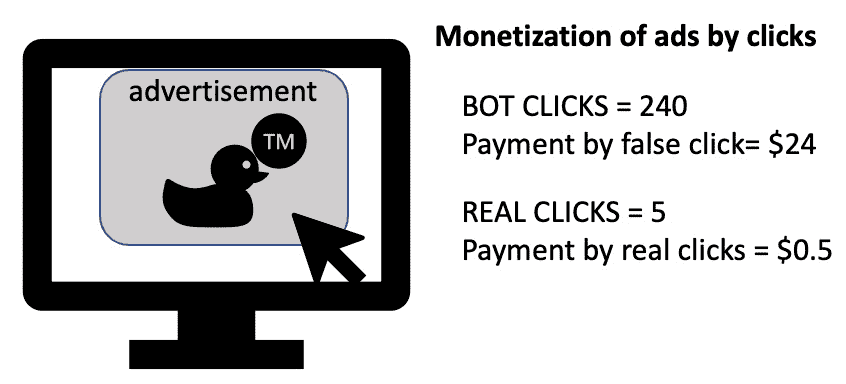

图 17.1 – 广告欺诈示例

如前所示的截图所示，网络犯罪分子可以通过使用这种自动化攻击来进行欺诈，从而使他们的收入呈指数增长。

## CAPTCHA 绕过

**完全自动化公共图灵测试以区分计算机与人类**（**CAPTCHA**）是一种非常基础的防止某些类型自动化攻击的方法，通过创建一个人类可以解决而机器人（脚本）无法解决的测试。然而，随着图像识别技术和**光学字符识别**（**OCR**）的进步，CAPTCHA 对用户来说变得更加困难，但对计算机来说则变得更加容易。您可以在以下截图中看到一些不可能的 CAPTCHA 示例：


图 17.2 – 不可能的 CAPTCHA 示例

实际上，如前所示的截图所示，某些 CAPTCHA 对人类来说是无法解读的。

## 卡片破解

这种攻击旨在通过在信用卡处理网站上暴力破解信用卡数据（如安全码和有效期）来识别缺失的信用卡数据。

## 卡片欺诈

该攻击用于验证大量被盗或欺诈的信用卡号码。这通常通过在信用卡处理网站上测试大量卡片来实现。

## 兑现

使用被盗或欺诈的支付信息购买商品或服务。此攻击是自动化的，旨在实现多个网站或在短时间内的购买（在卡被封锁之前）。

## 凭证破解

在这里，攻击者尝试通过暴力破解或基于字典的攻击来验证用户名和密码组合。

## 凭证填充

该攻击旨在验证大量用户名和密码组合（通常从黑市或以前的数据泄露中获得），并与给定网站进行比对。

## 拒绝库存

这是一个非常有趣的攻击，旨在通过将产品加入购物车但不付款，从而在一段时间内减少产品的库存。此攻击可能对电子商务页面的销售产生非常负面的影响，但它也可以被触发以负面影响某个产品的发布，或推动某个产品的销售。你可以在下面的截图中看到此类攻击的一个示例：

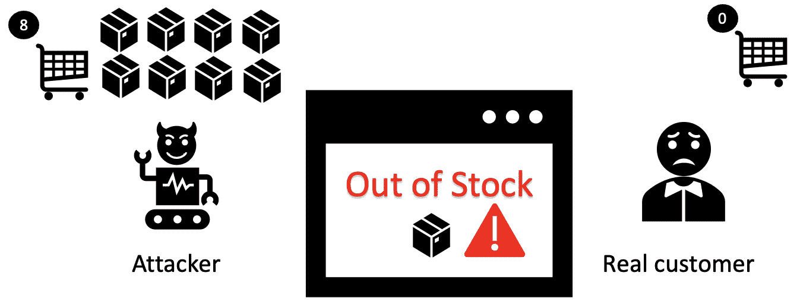

图 17.3 – 库存拒绝攻击

需要强调的是，这种攻击也可以针对诸如酒店预订、汽车租赁和其他通过电子商务网站提供的服务和产品进行。

## 拒绝服务（DoS）

这可能是最常见的自动化攻击类型，攻击的方式是通过大量请求淹没网站，超过 Web 服务器的承载能力，直接影响网站及其服务的可用性。

## 加速

这种攻击旨在绕过一系列步骤，更快地到达流程的最后步骤，如下面的截图所示：

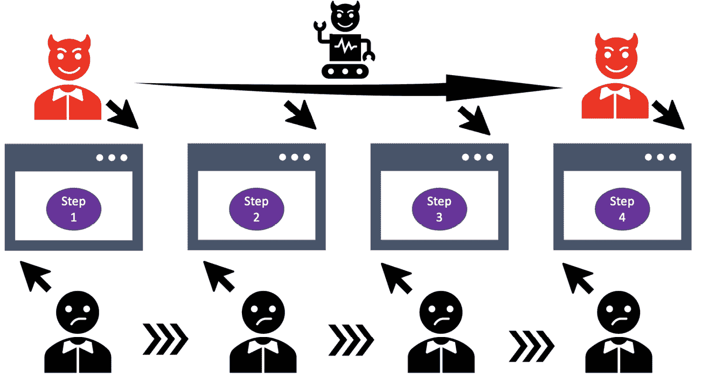

图 17.4 – 加速账户示例

如前所示的截图所示，加速可以通过更快地进入给定的 Web 流程的最后部分来为攻击者节省时间——例如，在 Web 培训表单中点击**下一步**，直到攻击者到达最后一个问题。

## 指纹识别

这种自动化攻击旨在收集有关某个网站的公开可用信息，以便更好地理解该站点。大多数时候，它收集如**超文本传输协议**（**HTTP**）头、错误信息、**统一资源定位符**（**URL**）路径等数据。这种攻击可以通过利用搜索引擎上索引的信息以及其他技术，如利用 Google dorks，在不访问网站的情况下进行。

## 足迹扫描

这种攻击可以被视为一种更具侵入性的指纹识别。在这种情况下，攻击针对应用程序，尝试收集多个数据，如应用程序参数、值、处理顺序、文件夹结构等。这也可以被视为一种**应用程序编程接口**（**API**）扫描，但需要强调的是，这仅仅是发现信息，而不是利用所发现的信息。

## 票贩子

这种自动化攻击涉及监控在线提供的某个产品或服务的可用性，然后在满足特定条件时自动进行购买（例如，当可用数量=10 时，购买 Lida 音乐会的所有票）。

## 抢购

这种攻击类似于票贩子攻击，不同之处在于这种攻击是由时间触发的（最后时刻）——例如，当时间=（截止日期-1）时，进行最后一轮下注。

## 抓取

这种自动化攻击涉及通过访问网页和 API 来收集信息，可以通过认证用户身份（使用被盗凭证）来进行，甚至可以在没有认证用户身份的情况下进行。

## 偏移

这个攻击的目的是操控网站指标（如点击数、访客数等）、投票、评论和点赞，从而操纵真实的结果并从中获利（如声誉、名气、粉丝等）。你可以在以下截图中看到偏移的示例：


图 17.5 – 偏移示例

如前面的截图所示，使用这种攻击方式，某篇文章的声誉可能会被操控。

## 垃圾邮件攻击

这是一种著名的攻击方式，涉及大量发送电子邮件，无论是用于营销还是传播恶意软件。

## 令牌破解

这个攻击的目的是发现网站上激活的令牌，如优惠券代码、折扣和优惠，这些令牌可以被攻击者使用。

## 漏洞扫描

我们已经深入讨论了这种自动化攻击，主要是通过识别给定网站、API 或其他网络资源中的已知漏洞来进行。

现在，让我们来探索如何使用 Python 在网络安全中应用自动化。

# 使用 Python 自动化网络安全工具

我们通过展示自动化的所有好处来开始本章，现在是时候看看如何利用 Python 实现自动化了。

Python 是一种超直观的语言，广泛用于脚本编写和自动化，我们也可以利用它来自动化一些与网络安全相关的任务。

实际上，你几乎可以用 Python 自动化你想做的任何事情，包括自动化一些知名的网络安全工具，如**Nessus**、**Nexpose**、**Shodan**、**Nmap**、**Metasploit**、**Sqlmap**等。

然而，在本节中，我们将探索使用 Python 自动化网络安全任务的其他方法。

## 本地文件搜索

在某些情况下，你需要在给定工作站上搜索特定的文件或文件夹，例如，为了实现合规性、作为审计的一部分或作为取证调查的一部分。

所以，如果你是审计员，拥有一个脚本来查找这些文件和文件夹会非常有用，而这可以通过 Python 轻松实现。让我们来看看怎么做。

Python 默认安装在 Kali Linux 中，因此要运行它，只需执行以下命令：

```
python3
```

如下截图所示，`>>>`表示 Python 解释器已准备好接收你的代码：

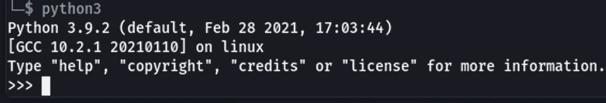

图 17.6 – Kali Linux 上的 Python 解释器

现在，让我们使用一个叫做`os.walk`的函数，它基本上通过自上而下（甚至自下而上）地遍历目录树来收集文件名和目录。

对于我们的例子，假设我们有如下截图中的文件结构：

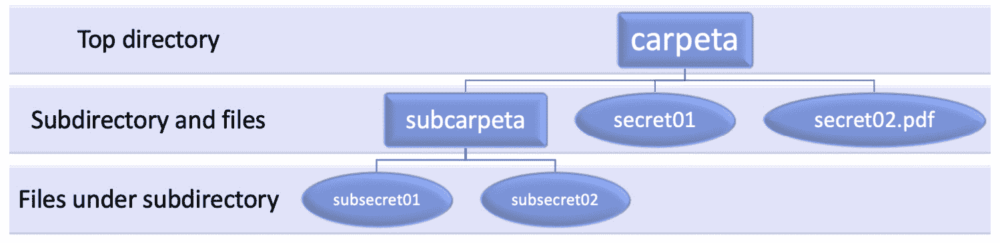

图 17.7 – 提出的示例文件结构

现在，让我们看看如何轻松地使用 `os.walk` 来自动化搜索文件和目录。

让我们从回到我们之前打开的 Python 会话开始，并在那里输入以下代码：

```
>>> import os
>>> for root, dirs, files in os.walk('.'):
...     for file in files:
...         print(file)
...         print(----------)
```

提示

Python 解释器使用缩进，因此确保你的代码与前面的代码片段保持相同的缩进。

如下图所示，代码输出了当前目录树下所有的文件（从上到下）：

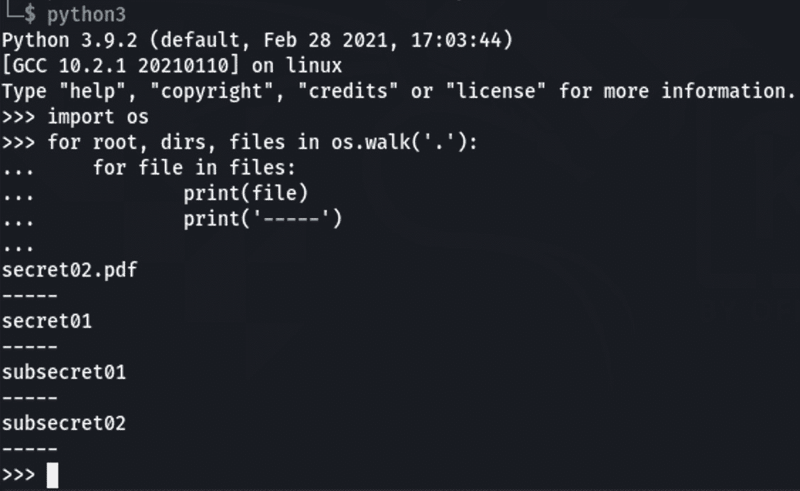

图 17.8 – 使用 os.walk 函数的代码输出

在这个例子中，我们只打印了文件名，但你也可以打印其他参数，如 `root`（目录）和 `dirs`（子目录）。

提示

如果你有 Python 使用经验，可能会觉得这个例子非常基础，事实上，正是为了这个目的：用一个非常基础的例子来向那些没有 Python 经验的读者阐明这个概念。

此外，你还可以通过使用其他函数（如 `os.path`）扩展该例子，显示文件的路径，或者甚至添加几行程序代码，只显示某种特定类型的文件。在这里，唯一的限制就是你的想象力！

## 基础取证

你还可以通过简单的 Python 代码自动收集文件的元数据。

为了完成这个任务，我们将使用 `os` 库。在这个例子中，我们使用 `os.stat`，因为它提供了许多操作系统可以使用的有用元数据，包括以下内容：

+   文件最后修改时间（`st_mtime`）

+   文件最后访问时间（`st_atime`）

+   创建时间或最后一次元数据更改时间（`st_ctime`）

+   用户 `st_uid`）

+   文件所有者的组 ID（`st_gid`）

+   文件大小（`st_size`）

让我们来看一个例子。

回到 Python，并输入以下代码行：

```
>>> import os
>>> stats = os.stat(('secret01'))
>>> stats
```

输出应该会显示所有前述的信息（创建日期、文件所有者等等），如下图所示：

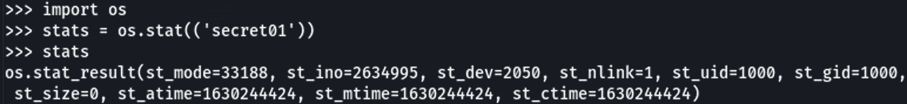

图 17.9 – 使用 os.stat 获取的文件元数据

如果你想了解更多关于这个库的信息，可以访问以下网页：

+   [`docs.python.org/3/library/os.html`](https://docs.python.org/3/library/os.html)

+   [`docs.python.org/3/library/stat.html`](https://docs.python.org/3/library/stat.html)

    提示

    这些日期格式对你来说不熟悉吗？别担心——你可以使用像 `time` 或 `datetime` 这样的库将 Unix 时间转换为人类可读的时间。

许多其他酷炫的库可以用来从文件中获取信息，接下来会讨论这些。

### Pillow

`Pillow`是一个额外的 Python 库，允许对图像进行处理。在我们的案例中，我们可以用它从图片中获取元数据，例如拍摄地点的**全球定位系统**（**GPS**）坐标。

### 使用 Python 收集 PDF 和 Word 文件的元数据

在`PDFDocument`、`PDFParser`、`PyPDF2`和`PdfFileReader`的情况下。

对于 Word 文档，最著名的库是`Python-Docx`，它可以从 Word 文档中提取超过 14 个属性。

## 网页抓取

另一种常见的使用 Python 进行自动化的方法是通过网页抓取。那么，接下来我们来概述一下最常用的库、包和模块，看看如何使用 Python 来自动化网页抓取。

### 使用 pip

如果你打算玩 Python，那么强烈推荐你安装`pip`。`pip`是 Python 的包管理器，可以安装在命令行中使用，来下载和安装 Python 包及其所需的依赖项。

在 Kali Linux 上的安装非常简单，可以通过以下命令完成：

```
sudo apt update
sudo apt install python3-pip
```

现在，要验证安装的版本，可以使用以下命令：

```
pip3 -V
```

如下图所示，我们在 Kali Linux 上成功安装了`pip3`：

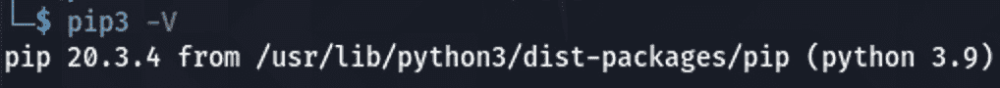

图 17.10 – 在 Kali Linux 上显示 pip3 版本

现在我们已经设置好了环境，接下来继续概述一些你可以用来进行 Python 自动化的最常用和最著名的库与模块。

### Beautiful Soup

在网络安全领域，`BeautifulSoup`是一个必备的 Python 库，用于解析**超文本标记语言**（**HTML**）和**可扩展标记语言**（**XML**）文件。事实上，你会发现几乎所有关于网页抓取的 Python 代码中都使用了这个库。

`BeautifulSoup`的魅力在于它提供了多种选项，能够以一种简单清晰的方式提取你需要的数据。让我来向你解释一下它是如何工作的。

*首先，我们要明确一点*——*HTML 文件不仅仅是一个文件，而是一个充满信息的宝贵源泉，通过 Beautiful Soup，你可以提取所有这些信息。*

下图显示了可以使用 Beautiful Soup 解析的信息：

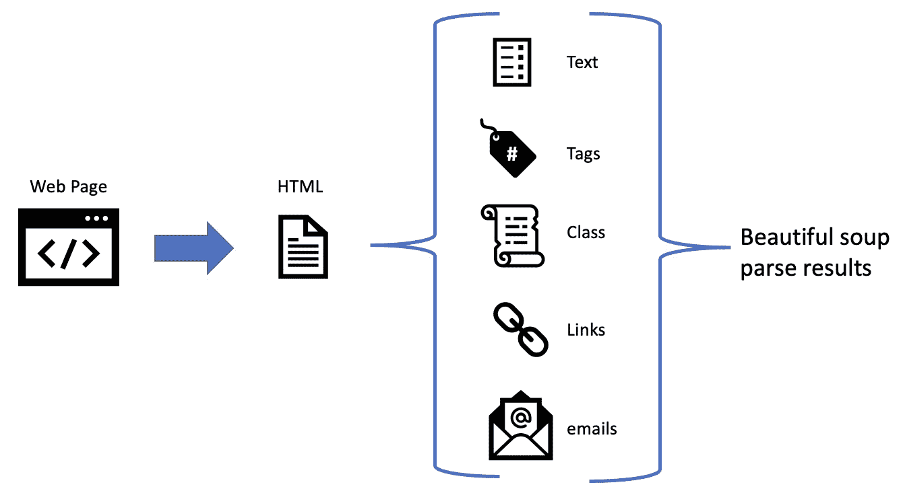

图 17.11 – 可以通过 Beautiful Soup 解析的信息

如前所示截图，HTML 文件中有很多信息可以被解析，`BeautifulSoup`使我们更容易提取这些信息。

现在，让我们看看你如何也可以利用 Python 来自动化一些网络安全任务。

## 网络安全自动化

你可以找到无数的 Python 脚本来自动化一些网络安全任务，它们的具体内容取决于你所使用的工具和系统。

然而，你也可以自己创建一个，因此让我们概述一个非常著名的工具，它可以帮助你自动化一些关于捕获和分析网络流量的任务——著名的**Scapy**。

### Scapy

这是一个很棒的工具，你可以在 Python 代码中使用它（无论是交互式还是作为库）来管理从网络嗅探软件（如 Wireshark）收集的数据包。

要安装它，你可以使用以下命令：

```
pip3 install scapy
```

然后，你可以通过以下命令确认`scapy`已安装：

```
scapy
```

如果安装成功，你应该看到类似下面的内容：

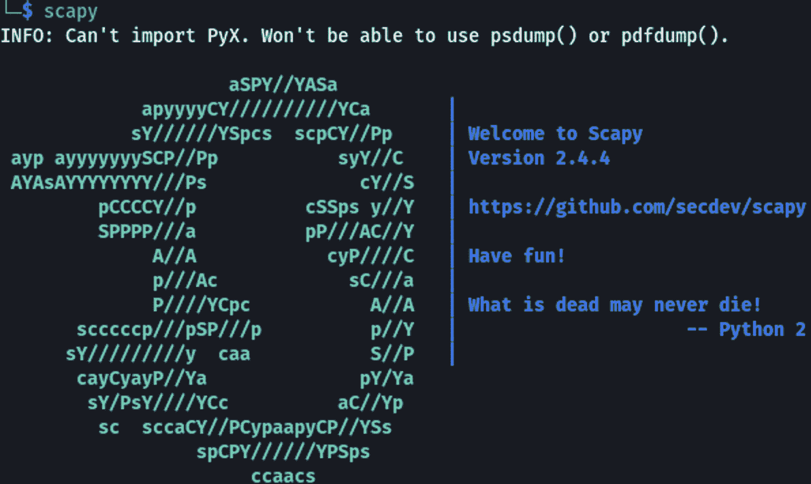

图 17.12 – Scapy

使用 Scapy，你可以做很多酷炫的事情，比如发送修改过的**互联网控制消息协议**（**ICMP**）数据包、端口扫描、读取**数据包捕获（PCAP）**文件，甚至像 Wireshark 一样捕获数据包。

注意

很多人在`scapy`和`scrapy`之间感到困惑，因为这两个工具都用于 Python 的安全。然而，虽然`scapy`主要用于数据包操作，`scrapy`则用于 Python 的网页抓取。相似，但不相同！

现在，让我们来看看如何利用强大的**树莓派**来自动化网络安全任务。

# 使用树莓派进行网络安全自动化

在*第十章*，*应用物联网安全*中，我们介绍了很多可以用树莓派做的酷炫网络安全项目，包括以下内容：

+   检测恶意接入点

+   使用树莓派创建**入侵检测系统**（**IDS**）和防火墙

+   创建一个安全复制**统一串行总线**（**USB**）设备信息的机器

+   创建蜜罐

+   创建一个网络监控设备

+   创建广告拦截器

+   甚至可以创建一个系统来检测网络中不明的树莓派设备，并学习如何禁用它

现在，在本节中，我们将概述一些可以帮助你自动化网络安全任务的树莓派项目。

## 使用树莓派的 Fail2ban 蜜罐自动化威胁情报收集

有很多工具和技术可以用来将**互联网协议**（**IP**）地址列入黑名单。事实上，你甚至可以通过在树莓派上安装 Pi-hole（如*第十章*，*应用物联网安全*中提到的那样）来自己创建，但我们这里不讨论这些系统，而是讲述如何利用一台便宜的树莓派收集攻击者的数据，并利用这些数据来更好地保护你的基础设施。

注意

这些基于低成本硬件的解决方案并不是为了取代强大的企业级设备。相反，它们是为了作为一个很棒的工具，用于创建原型和**概念验证**（**PoC**），这是进行研究的一个重要步骤，最终这也是网络安全大师必备的技能。

为了实现这个任务，我们将利用一款免费的开源软件，名为 **Fail2ban**。

Fail2ban 通过分析系统日志文件（如 `/var/log/apache/error_log`）来寻找恶意登录尝试、暴力破解攻击和其他针对系统的攻击。

然而，Fail2ban 设计时是针对单一系统运行的，因此我们将利用 Raspberry Pi 的强大性能和低成本，将其设置为一个暴露的蜜罐系统，收集有关攻击者的威胁情报，并利用这些信息来增强我们防御性安全系统中的黑名单。

下图展示了提议的架构，旨在利用 Fail2ban 在 Raspberry Pi 上自动化情报收集：

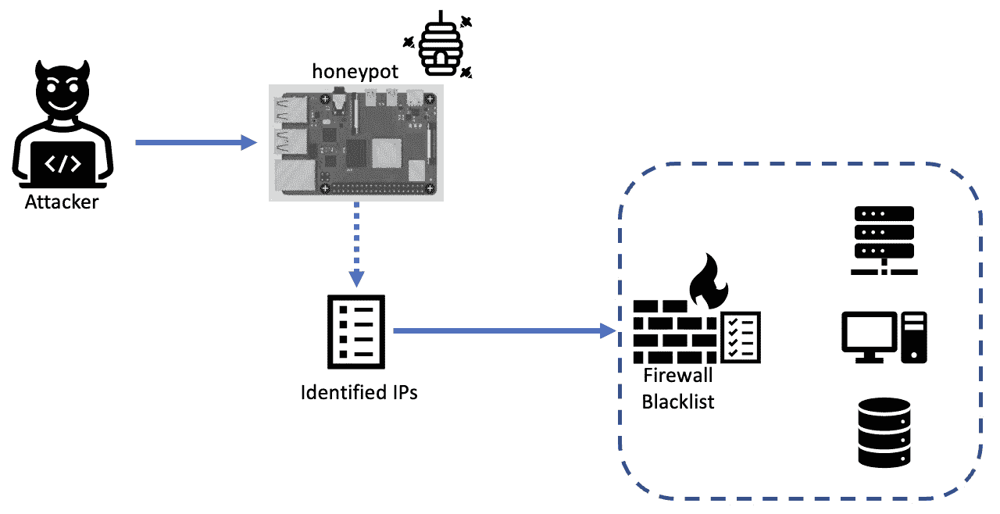

图 17.13 – 在 Raspberry Pi 上使用 Fail2ban 的提议解决方案架构

你可以参考 [pimylifeup.com](http://pimylifeup.com) 上创建的教程，了解如何在 Raspberry Pi 上安装 Fail2ban，网址是：[`pimylifeup.com/raspberry-pi-fail2ban/`](https://pimylifeup.com/raspberry-pi-fail2ban/)。

你也可以通过遵循这份指南直接在 Unix 服务器上设置 Fail2ban：[`www.redhat.com/sysadmin/protect-systems-fail2ban`](https://www.redhat.com/sysadmin/protect-systems-fail2ban)。

或者，你可以访问他们的官方网站：[`www.fail2ban.org`](https://www.fail2ban.org)。

提示

Fail2ban 的另一个酷功能是，你可以配置它在检测到攻击时立即通知你，这样你就能快速获取攻击者的数据，并将其输入到你的系统中。

现在，让我们来看看另一个很酷的项目，使用我们的好朋友 Raspberry Pi 来自动化互联网监控。

## 基于 Raspberry Pi 的自动化互联网监控系统

假设你有一个远程位置，提供 Wi-Fi 服务给你的客户，而这个互联网连接可能会受到多种因素的影响，从速度变慢到完全没有连接。

所以，让我们回顾几个项目，看看如何利用 Raspberry Pi 自动化检测这些问题并通知你，从而在客户受到影响之前采取行动。

### 基于 Raspberry Pi 的自动化互联网监控

有一个简单的解决方案，你可以使用 Raspberry Pi 和简单的代码来 Ping 外部位置的一个设备，以确定它们是否有活动的互联网连接。然后，你可以利用 Raspberry Pi 的功能，通过 **发光二极管** (**LED**)、声音或更为隐蔽的方式（如通过仪表盘、电子邮件或社交媒体消息）提醒你，以下截图中展示了这一过程：

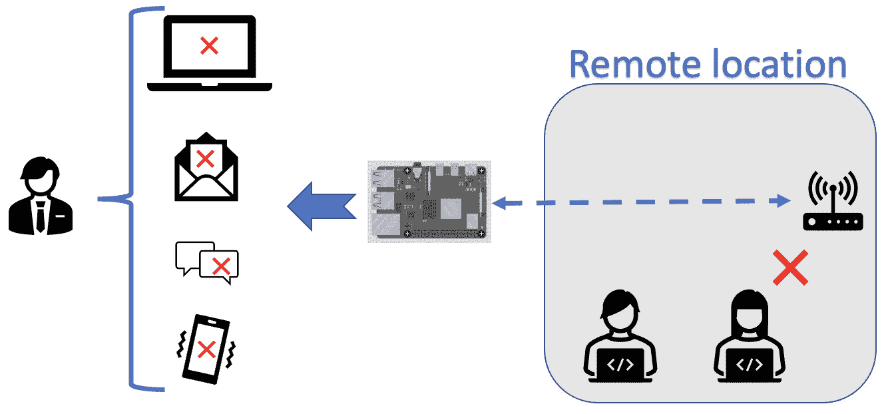

图 17.14 – 自动化互联网监控系统架构

如果你想实现这个互联网监控解决方案，你可以参考由制作人 *talk2bruce* 发布的非常详细的逐步安装教程，链接：[`www.instructables.com/Raspberry-Pi-Internet-Monitor/`](https://www.instructables.com/Raspberry-Pi-Internet-Monitor/)。

现在，让我们回顾另一种自动化方法，旨在控制不仅是连接，还有互联网的速度。

### 自动化互联网速度监控

如前所述，可能会有一些情况下，互联网连接正常但速度较慢，这可能是由于 **互联网服务提供商**（**ISP**）的问题、路由器问题、线路问题等原因。不管问题的来源是什么，你需要及时了解这些问题，以便采取措施加以解决（记住——可用性问题也是你的责任）。

此外，Raspberry Pi 还允许你在数据库中记录互联网连接历史，这样你可以利用这些数据进行进一步的分析（例如，找出模式来发现问题的根本原因）。

有一个教程，介绍了如何利用来自 Ookla 的第三方 API ([`www.speedtest.net/apps/cli`](https://www.speedtest.net/apps/cli)) 来监控 Raspberry Pi 上的互联网速度：[`pimylifeup.com/raspberry-pi-internet-speed-monitor/`](https://pimylifeup.com/raspberry-pi-internet-speed-monitor/)。

这些是使用 Raspberry Pi 进行自动化的一些例子，但在这里，天空才是极限。

记住——如果你是 Raspberry Pi 的专家，可以把你的项目链接发给我进行审阅，我们甚至可以在未来版本的书中包含它们。

# 总结

我们对目前攻击者使用的 21 种主要自动化攻击进行了全面的概述，以便你可以对你的组织进行评估，确定哪些攻击可能对你的基础设施和组织构成威胁。

但我们也学到了如何利用自动化，因此我们回顾了一些 Python 库，你可以利用它们在取证、网页抓取和网络安全等任务中进行自动化处理。

在结束本章之前，我们学会了如何利用著名的 Raspberry Pi 创建一些非常酷的网络安全小工具，这些工具能够帮助我们自动化一些任务，例如收集恶意地址以加入黑名单，以及两种不同的方法来测试互联网连接的速度和稳定性。

我希望最后这一部分能够激发你进行一些额外的测试和研究，开发你自己的网络安全小工具和原型，像一个大师一样！

# 进一步阅读

如果你想了解更多关于 Raspberry Pi 的信息，可以访问制造商的网站，这里有丰富的资源，包括教程、项目等。

此外，你还可以在那里找到关于 Raspberry Pi 不同版本的信息，以确定哪一种更适合你的项目。

这是网站的链接：

[`www.raspberrypi.org/`](https://www.raspberrypi.org/)
