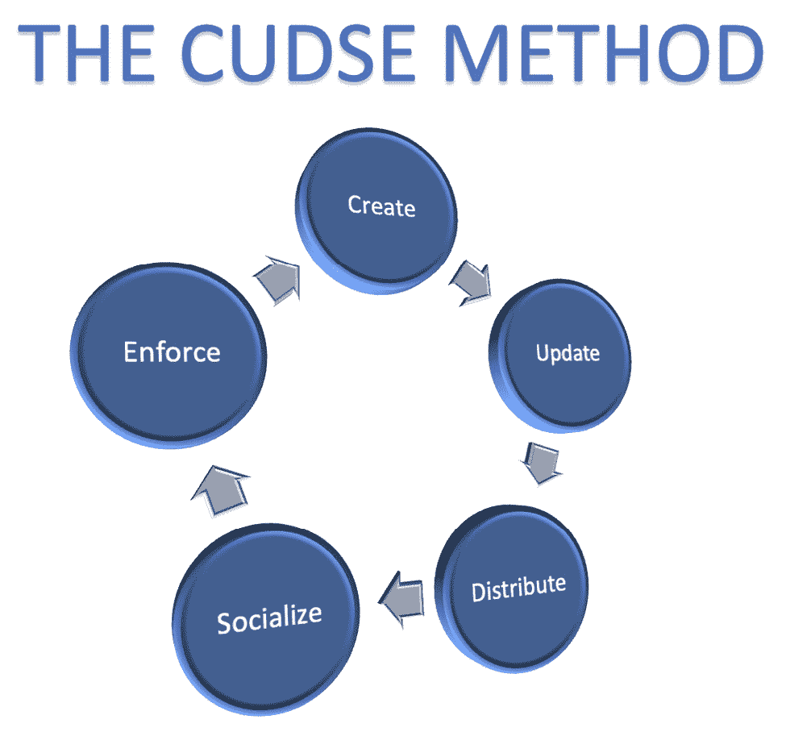
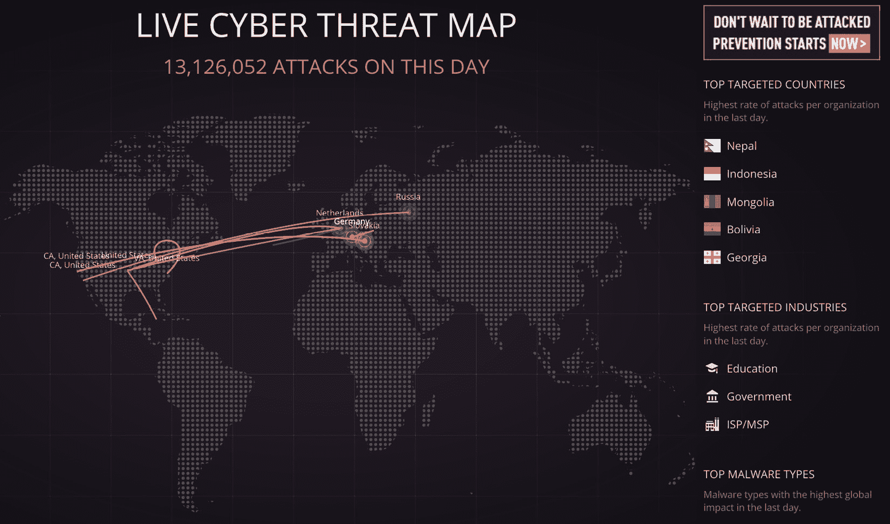

# 第十八章：*第十八章*：大师级的有用资源汇编

*“在家中和街道上，我们的安全依赖于我们自己……同样的概念也适用于网络空间。”*

*– 米格尔·安赫尔·罗德里格斯，哥斯达黎加前总统及美洲国家组织前秘书*

我们拥有的最宝贵的资源之一就是我们多年来收集的链接（收藏夹或书签）。

实际上，您的收藏夹是通过多年的职业经验收集的工具、信息和最佳实践的宝贵集合。

因此，我决定将这一最后一章献给您，分享一系列链接，您可以利用这些链接来改进您的数字工具箱中的网络安全网页资源。

这些链接分为三大类：

+   网络安全模板集合

+   必备的网络资源（漏洞库、攻击地图、密码工具等）

+   行业领先的最佳实践参考

# 免费的网络安全模板

这里是一个有用模板的汇编，您可以在作为网络安全专家的角色中按类别利用这些模板。

## 业务连续性计划和灾难恢复计划模板

网络上有成千上万的**业务连续性计划**（**BCP**）模板；然而，由政府机构创建的模板通常是最佳选择，因为它们准备充分，基于国际标准，并且免费：

+   来自曼彻斯特市议会的 BCP 模板：[`www.manchester.gov.uk/downloads/download/5701/mbcf_business_continuity_plan_template`](https://www.manchester.gov.uk/downloads/download/5701/mbcf_business_continuity_plan_template)

+   来自英国赫特福德郡议会的 BCP 模板和指南：[`www.hertfordshire.gov.uk/services/business/business-advice/business-continuity-and-fire-safety.aspx`](https://www.hertfordshire.gov.uk/services/business/business-advice/business-continuity-and-fire-safety.aspx)

+   来自英国达勒姆郡议会的 BCP 模板：[`www.durham.gov.uk/media/888/Small-Business-and-Voluntary-Organisations-Business-Continuity-Plan/pdf/SmallBusinessAndVoluntaryOrganisationBusinessContinuityTemplate.pdf?m=635568457135400000`](https://www.durham.gov.uk/media/888/Small-Business-and-Voluntary-Organisations-Business-Continuity-Plan/pdf/SmallBusinessAndVoluntaryOrganisationBusinessContinuityTemplate.pdf?m=635568457135400000)

+   来自剑桥市的 BCP 模板：[`www.cambridgema.gov/-/media/Files/CDD/EconDev/SmallBusiness/unitedwaybusinesscontinuitytemplate.pdf`](https://www.cambridgema.gov/-/media/Files/CDD/EconDev/SmallBusiness/unitedwaybusinesscontinuitytemplate.pdf)

以下是关于连续性规划的模板和信息的综合列表，包括**业务连续性计划（BCP）**、**灾难恢复计划（DRP）**和风险管理：[`www.business.qld.gov.au/running-business/protecting-business/risk-management/continuity-planning/plan`](https://www.business.qld.gov.au/running-business/protecting-business/risk-management/continuity-planning/plan)

以下网站包含了多个资源，包括如何进行业务影响分析、创建 BCP 甚至 DRP：[`www.ready.gov/it-disaster-recovery-plan`](https://www.ready.gov/it-disaster-recovery-plan)

这里是南加州大学创建的另一个优秀的灾难恢复计划（DRP）示例：[`fsep.usc.edu/files/2019/02/Disaster-Recovery-Plan-Template.pdf`](https://fsep.usc.edu/files/2019/02/Disaster-Recovery-Plan-Template.pdf)

## 风险管理

这里有一系列由英国政府发布的关于风险管理的文档，称为*橙皮书*：[`www.gov.uk/government/publications/orange-book`](https://www.gov.uk/government/publications/orange-book)。

## 网络安全政策和程序的设计与管理

网络安全政策不仅仅是根据模板创建一个文档并将其永远存储在一个不明的地方。

事实上，网络安全政策和程序是您拥有的最重要资产之一，因为它们代表了您组织网络安全的基线。因此，您必须了解如何正确地制定和管理这些政策和程序，以确保您的防御性安全策略有一个坚实的基础。

我们推荐使用 CUDSE 方法，因为如以下图所示，它向您展示了如何在整个生命周期中正确地管理您的网络安全政策：

图 18.1 – CUDSE 方法

此方法的官方网站可以在[`www.cudse.com`](http://www.cudse.com)找到。

这是一个开放的倡议，如果您希望成为方法未来版本的编辑或贡献者，可以随时在网页上注册。

# 必备的网络资源

这是一个非常好的*网络安全控制清单*，您可以利用它进行快速审计，或者将其作为创建您自己清单的基础：[`www.utah.gov/beready/business/documents/BRUCyberSecurityChecklist.pdf`](https://www.utah.gov/beready/business/documents/BRUCyberSecurityChecklist.pdf)

## 网络威胁或数字攻击地图

这些页面实时展示了当前世界范围内发生的网络攻击的图形化表示。

如下图所示，页面还显示了额外的数据，如最受攻击的国家和按行业划分的攻击：

图 18.2 – 实时网络威胁地图

以下是一些最著名的威胁地图：

+   [`threatmap.checkpoint.com/`](https://threatmap.checkpoint.com/)

+   [`www.imperva.com/cyber-threat-attack-map/`](https://www.imperva.com/cyber-threat-attack-map/)

+   [`www.fireeye.com/cyber-map/threat-map.html`](https://www.fireeye.com/cyber-map/threat-map.html)

这些页面对于以下内容非常有用：

+   意识培训

+   网络安全演示

+   突出展示某一行业中防御性安全的重要性

此外，还有一些页面，如[`www.digitalattackmap.com/#anim=1&color=0&country=ALL&list=0&time=18763&view=map`](https://www.digitalattackmap.com/#anim=1&color=0&country=ALL&list=0&time=18763&view=map)，可以根据日期显示可视化效果。这非常有趣，因为它可以帮助你将攻击次数与特定日期关联起来，例如选举期间、假期等时段的攻击增加。

## 网络安全认证

现在有许多公司提供网络安全认证；然而，并非所有公司都能提供物有所值的认证服务。因此，让我和你分享一些在报考网络安全认证时需要考虑的关键因素。

### 国际认证

PDF 文件容易被复制，因此你需要确保你的认证机构会提供一个数字令牌，方便你与他人分享，以确认你的认证是真实的，而非*伪造的 PDF 文件*。

这里，最好的解决方案是使用**数字徽章**，该徽章可以验证你是真正的认证持有者。**数字徽章技术**有所不同，最新的徽章甚至可以通过扫描数字徽章在网站上进行验证（非常酷）。

### 更新的文献和内容

网络安全是一个迅速变化的领域，因此你需要确保选择的认证机构使用最新的认证和考试内容，并避免选择那些多年来使用相同内容的机构。

### 创新

有太多认证机构几乎没有区别，因此要探索那些敢于创新的认证机构，提供*新的提案、新的考试、新的内容、新的认证方案（包括数字徽章）*，这些才是能为你的简历带来独特优势的机构。

### 由专家验证和管理

另一个需要检查的重要项是*谁在运营认证机构*；例如，*选择一个由真正了解该领域的网络安全专家支持和运营的认证机构比选择由一群不熟悉该领域的投资者和管理者运营的机构要好*。

因此，我们强烈推荐**国际创新与认证委员会**（**I2C2x**），这是一个由网络安全专家管理并拥有的认证机构，致力于提升全球网络安全水平。

欲了解更多信息，请访问他们的网站：[i2c2x.com](http://i2c2x.com)。

## 网络安全新闻与博客

几乎每天都会有与网络安全相关的新博客或网站诞生；然而，并非所有网站都是由专家运营的，这可能导致其中一些分享不正确甚至是假新闻；因此，确保访问的网站是最好的非常重要，接下来我将分享一些世界上最好的网络安全资源。

在国际上被誉为网络安全新闻最佳来源之一的是：[`krebsonsecurity.com/`](https://krebsonsecurity.com/)

他们已经制作了超过 15 年的网络安全高质量视频内容，包括技巧、硬件黑客和新闻。

每个网络安全专家必备的书签之一是**Hak5 播客**：[`hak5.org/pages/videos`](https://hak5.org/pages/videos)

其中一个最好的网络安全知识交流论坛是：[`security.stackexchange.com/`](https://security.stackexchange.com/)

但等等，还有其他语言（如西班牙语）创作的非常好的内容！例如，您可以访问节目*Noches de Cyberseguridad*，每周邀请来自拉丁美洲的专家讨论与网络安全相关的不同话题：[`www.facebook.com/nochesdeciberseguridad/`](https://www.facebook.com/nochesdeciberseguridad/)

## 网络安全工具

在这里，我将总结一些必须拥有的网络资源，方便大家保存到书签中。我们在书中已经谈到了其中的一些资源；然而，考虑到它们的重要性，这里也值得再次强调。

测试网络安全漏洞的必备平台是：[`dvwa.co.uk/`](https://dvwa.co.uk/)

Kali Linux 的官方页面，包括下载地址如下：[`www.kali.org/`](https://www.kali.org/)

**NetHunter**（适用于移动设备的 Kali Linux）的官方网站如下：[`www.kali.org/get-kali/#kali-mobile`](https://www.kali.org/get-kali/#kali-mobile)

一个包含超过 40,000 个已知漏洞的数据库如下：[`www.exploit-db.com/`](https://www.exploit-db.com/)

`exploit-db`的一个子栏目，专门介绍 Google 黑客（dorks），地址如下：[`www.exploit-db.com/google-hacking-database`](https://www.exploit-db.com/google-hacking-database)

已知网络安全漏洞的最佳来源如下：[`cve.mitre.org/index.html`](https://cve.mitre.org/index.html)

我知道还有很多其他工具；这只是本书中提到的一些最好的工具的亮点。接下来我们将谈谈一些最常用的与密码相关的资源。

## 与密码相关的工具

弱密码或不良密码管理实践是造成大部分网络安全漏洞的原因，以下是与密码管理相关的必备资源。

本网站用于检查给定的电子邮件是否曾出现在数据泄露事件中，因此必须更改密码并且永远不再使用：[`haveibeenpwned.com/`](https://haveibeenpwned.com/)

这个网站是一个很好的资源，用来强调弱密码的危险。特别适用于网络安全演讲或意识提升活动：[`www.grc.com/haystack.htm`](https://www.grc.com/haystack.htm)

Google 和 Microsoft 的多因素认证解决方案：

+   [`support.google.com/accounts/answer/1066447`](https://support.google.com/accounts/answer/1066447)

+   [`www.microsoft.com/en-us/security/mobile-authenticator-app`](https://www.microsoft.com/en-us/security/mobile-authenticator-app)

现在，我将与您分享一些关于网络安全最佳实践和框架的链接。

# 行业领先的最佳实践

总结以下关于网络安全和数据安全的行业最佳实践、框架和标准页面。

## 法规和标准

**PCI-DSS**是处理信用卡信息和支付数据的公司必须使用的标准。它们的官方网站如下：[`www.pcisecuritystandards.org/`](https://www.pcisecuritystandards.org/)

**HIPAA**是美国的一项法规，旨在保护患者的敏感医疗记录：[`www.hhs.gov/hipaa/index.html`](https://www.hhs.gov/hipaa/index.html)

**GDPR**是欧盟制定的旨在保护其公民个人数据的法规：[`gdpr.eu/`](https://gdpr.eu/)

正如本书前面所提到的，记住你必须始终研究与公司所在地、客户及市场相关的应用法规，以避免不必要的罚款和制裁。

## 网络安全框架、标准等

现在，让我们以网络安全领域的领先框架、标准和其他必备资源的清单来结束。

### NIST 网络安全框架

最著名的网络安全框架是 NIST：[`www.nist.gov/cyberframework`](https://www.nist.gov/cyberframework)

### ISO 27001

27001 系列是与网络安全相关的 ISO 标准家族：[`www.iso.org/isoiec-27001-information-security.html`](https://www.iso.org/isoiec-27001-information-security.html)

### 物联网安全基金会

一份关于网络安全（包括物联网安全框架）的出版物清单，由物联网安全基金会设计：[`www.iotsecurityfoundation.org/best-practice-guidelines/`](https://www.iotsecurityfoundation.org/best-practice-guidelines/)

### MITRE ATT&CK 矩阵

该矩阵是基于真实案例和观察的对抗者战术与技术的整理知识库：[`attack.mitre.org/`](https://attack.mitre.org/)

### OWASP 十大

**开放式 Web 应用程序安全项目**（**OWASP**）是一个非盈利基金会，旨在增强 Web 资源和应用程序的安全性。它因发布十大 Web 应用程序安全风险而闻名：[`owasp.org/`](https://owasp.org/)

### 网络安全成熟度模型

**企业** **网络安全成熟度模型**（**ECM2**）使网络安全专业人员能够通过几个简单的步骤来确定公司的当前网络安全水平，并提供如何迈向下一个阶段的指南。你还可以在他们的网站上注册，成为下一个版本的贡献者或编辑：[www.ecm2.info](http://www.ecm2.info)

# 总结

我希望你在成为网络安全专家的旅程中，能够发现这些链接有用。此外，我相信你也有一堆有用的资源和链接，所以请随时通过社交媒体与我分享，我会非常乐意将它们添加到未来版本的书籍中，甚至在我的即将到来的会议中展示它们。

本章也代表着这一段精彩旅程的结束，旨在提升你在多个主题上的网络安全技能，如服务器加固、网络安全、物理安全、云安全，甚至是网络安全政策的重要性和相关性。

此外，你还学习了诸如法医、恶意软件分析和物联网安全等高级主题。

但在这本书中，你不仅仅学习了技术；你还学会了如何创造技术，而我们是通过利用物联网（IoT）设备来创建你自己的网络安全工具来实现这一点，这正是高手所做的！

我真心希望你像我在制作这本书时一样，享受这段学习经历。

*你现在是防御性安全的高手！*

# 深入阅读

最后，我想与您分享我在美国、德国、西班牙、日本和中国注册的专利清单。这些专利是与来自世界各地的杰出研究人员和专家们共同研究和原型制作数百小时的成果，我希望它们能为你作为一名网络安全研究人员的未来提供灵感和动力：[`patents.google.com/?inventor=cesar+bravo&assignee=International+Business+Machines+Corporation`](https://patents.google.com/?inventor=cesar+bravo&assignee=International+Business+Machines+Corporation)
