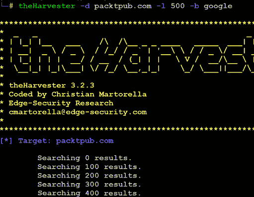
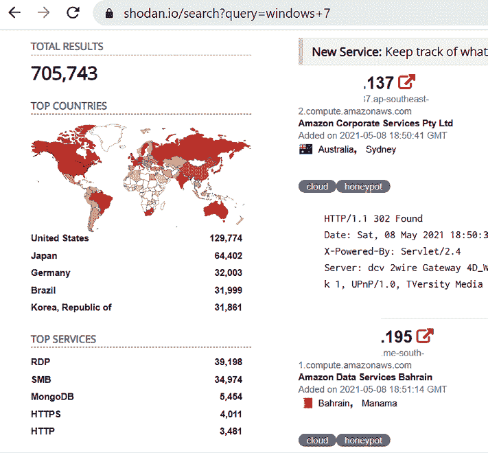
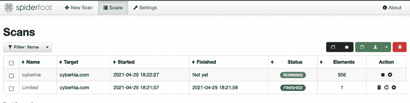

# 第二章：开放源代码情报与被动侦察

收集目标的所有可能信息始终是渗透测试人员思考中的最重要方面，以实现最佳结果。在网络安全领域，通过公开来源收集信息通常被称为**开放源代码情报**（**OSINT**）。通过 OSINT 进行的被动侦察发生在渗透测试或对某个组织进行攻击的第一步中。攻击者通常会将渗透测试整体工作量的最多 75%投入到侦察阶段，因为正是这个阶段定义、映射并探索目标的漏洞，这些漏洞最终会导致成功的利用。

侦察有两种类型：

+   被动侦察（直接和间接）

+   主动侦察

被动侦察是收集和分析公开可用信息的艺术，通常来自目标本身或在线的公共资源。在访问这些信息时，测试人员或攻击者不会以异常方式与目标互动——请求和活动不会被记录，因此不会直接追溯到测试人员。因此，被动侦察首先进行，以最小化可能表明即将发生攻击或识别攻击者的直接接触。

本章将介绍被动侦察和 OSINT 的原则与实践，包括以下内容：

+   侦察的基本原则

+   OSINT

+   在线资源和暗网搜索

+   获取用户信息

+   为密码列表进行用户画像

+   利用社交媒体提取密码字典

主动侦察，涉及与目标的直接互动，将在*第三章*中讲解，*外部与内部网络的主动侦察*。

# 侦察的基本原则

侦察（Reconnaissance），或称为侦查，是进行渗透测试或攻击数据目标时的第一步。它是在实际测试或攻击目标网络之前进行的。侦察的结果将帮助我们了解是否需要进一步的侦察，或者在利用阶段能够利用的漏洞。侦察活动根据与目标网络或设备的互动程度分为不同的等级。

被动侦察不涉及与目标网络的任何恶意直接互动。攻击者的源 IP 地址和活动不会被记录（例如，对目标的电子邮件地址进行 Google 搜索不会留下目标可以检测到的痕迹）。目标很难，甚至几乎不可能，将被动侦察与正常的商业活动区分开来。

被动侦察进一步分为直接和间接两类。直接被动侦察涉及攻击者与目标进行的正常互动。例如，攻击者会登录到公司网站，查看各种页面，并下载文档以供进一步研究。这些互动是预期的用户活动，很少会被视为攻击的前兆。间接被动侦察则完全不会与目标组织进行任何互动。

相反，主动侦察涉及直接查询或其他互动（例如，针对目标网络的端口扫描），这些操作可能会触发系统警报，或者允许目标捕获攻击者的 IP 地址和活动。这些信息可能会被用于识别和逮捕攻击者，或在法律程序中使用。因此，被动侦察的风险要低得多，但与其主动对等物一样，也有其局限性。

渗透测试者或攻击者通常遵循一个结构化的信息收集过程，从广泛的范围（商业和监管环境）开始，逐步深入到更具体的信息（用户账户数据）。

为了提高效率，测试者在收集信息之前应该确切知道自己要寻找什么以及这些数据将如何使用。通过使用被动侦察并限制收集的数据量，可以最小化被目标检测到的风险。

## OSINT

渗透测试或攻击的第一步是使用 OSINT 收集信息。这是从公共来源，特别是通过互联网收集信息的艺术。可用的信息量相当大——大多数情报和军事组织都在积极进行 OSINT 活动，以收集关于目标的信息，并防范泄露有关它们的数据。

OSINT 可以分为两种类型：**进攻性**和**防御性**。进攻性主要处理收集所有准备对目标发动攻击所需的数据，而防御性则是收集关于先前安全漏洞和其他与目标相关的安全事件的数据，这些数据可以用来进行防御或保护自己。*图 2.1* 中展示了 OSINT 的基本思维导图：


图 2.1：OSINT 的基本思维导图

## 进攻性 OSINT

需要收集的信息取决于渗透测试的初步目标。例如，如果测试者想访问个人健康记录，他们将需要相关方（如第三方保险公司、医疗服务提供者、各行业 IT 运营主管、商业供应商等）的姓名和个人信息，以及他们的用户名和密码。如果攻击路径涉及社会工程学，他们可能会补充一些信息，这些信息能增加信息请求的可信度，例如：

+   **域名**：攻击者或渗透测试人员在外部场景中识别目标时，从域名开始，这是开源情报（OSINT）中最关键的元素之一。

    +   **子域名**：这些是主域名的一部分；例如，如果目标域名是`sample.com`，那么可能会使用`demo.sample.com`、`producton.sample.com`、`ecommerce.sample.com`等。识别这些域名将为攻击者提供更多的资产，以便在侦察阶段进行评估。

    +   **DNS 条目**：在今天的网络世界中，任何事物都可能联网。这意味着，每个连接到互联网的设备都有一个唯一的 IP 地址。类似地，DNS 条目是分配给特定 IP 地址的便于人类理解的名称列表，例如，`demo.sample.com`，它会被转换为格式为`104.x.x.243`的 IP 地址。DNS 条目包括 A（主机名到 IP）、NS（名称服务器）、CNAME（规范名称）、MX（邮件交换）、AAAA（DNS 记录到 IPv6）、SRV（服务记录）、TXT（文本记录）和 PTR（指针记录，相对于 A 记录）。所有这些信息将为攻击者提供不仅仅是与 DNS 相关的详细信息，还包括其他一系列信息——例如，他们运行的是什么类型的服务——攻击者可以利用这些信息来开始制定攻击策略。

    +   **邮件交换**：虽然我们可以从 DNS 条目中找到 MX 记录，但识别邮件交换被视为一套完全不同的枚举，因为大多数情况下，它们涉及一个提供邮件投递服务的第三方，这些服务可能被攻击者利用，通过 SMTP 正常功能利用邮件中继发送大量邮件。

+   **DNS 侦察与路径映射**：一旦测试人员识别出具有在线存在并包含感兴趣项目的目标，下一步就是识别目标的 IP 地址和路径。DNS 侦察关注于识别谁拥有特定的域名或 IP 地址系列（例如 WHOIS 信息，尽管自通用数据保护条例（GDPR）实施以来有所变化），DNS 信息定义了分配给目标的实际域名和 IP 地址，以及渗透测试者或攻击者与最终目标之间的路径。

这些信息收集是半主动的——部分信息可以从公开的免费资源中获取，而其他信息则来自第三方，如 DNS 注册商。尽管注册商可能会收集与攻击者请求相关的 IP 地址和数据，但这些信息通常不会提供给最终目标。目标几乎从未审查或保留能够直接监控的信息，如 DNS 服务器日志。由于所需信息可以通过定义的系统化和有条理的方法进行查询，因此其收集可以自动化。

在接下来的章节中，我们将讨论如何仅使用 Kali Linux 中预安装的简单工具就能枚举所有域名。

## 收集域名信息

我们将利用 sublist3r 工具进行域名收集。这个工具并未预安装在 Kali Linux 中；不过，您可以通过在终端运行 `sudo apt install sublist3r` 来安装它。这个工具是用 Python 编写的，它将使用 OSINT 技术列举主域名的子域名。它使用如 Google、Bing、Baidu 和 ASK 搜索引擎的 API。此外，它还在 NetCraft、VirusTotal、Threatcrowd、DNSDumpster 和 ReverseDNS 中进行搜索，同时还使用特定的字典进行 DNS 暴力破解。

一旦工具安装完成，攻击者可以运行 `sudo sublist3r -d ourtargetcompany.com -t 3 -e bing` 来在 Bing 搜索引擎中查找子域名，如 *图 2.2* 所示，针对 `packtpub.com`：


图 2.2：使用 Bing API 对 packtpub.com 进行 sublist3r 子域名信息收集

可能会遇到 VirusTotal 阻止请求的错误信息。您可以通过输入 `export VT_APIKEY=yourapikey` 来修复此问题，前提是您需要在 `virustotal.com` 创建帐户并生成 API 密钥。

## Maltego

Maltego 是最强大的 OSINT 框架之一，适用于个人和组织的侦察。它是一个图形界面工具，可以通过多种方法（如电子邮件地址、URL、个人社交媒体网络档案以及两个人之间的共同连接）提取互联网上公开的信息，从而收集任何个人的信息。它还能够列举 DNS、暴力破解普通 DNS，并以易于读取的格式从社交媒体收集数据。

我们可以通过开发已收集数据的可视化来利用这个工具。社区版 Maltego 4.2.17 随 Kali Linux 一起提供。访问该应用程序的最简单方式是通过终端输入 `maltego`。Maltego 中的任务被称为转换（transforms）。转换内置在工具中，是执行特定任务的代码脚本。

在 Maltego 中，还有多个插件可用，例如 SensePost 工具集、Shodan、VirusTotal 和 ThreatMiner。

使用 Maltego 进行 OSINT 的步骤如下：

1.  要访问 Maltego，您需要通过访问 https://www.maltego.com/ce-registration/ 创建一个帐户。创建帐户并成功登录 Maltego 应用程序后，您应该会看到 *图 2.3* 所示的界面：

    图 2.3：Maltego 启动界面

1.  在**Maltego CE（免费版）**下点击**运行**，同意条款和条件，安装变换，选择一个 Web 浏览器选项（隐私模式），最后点击**准备好**。这将使我们能够使用社区变换。但是有使用数量限制。

1.  Transform Hub 是 Maltego 客户端允许用户轻松安装来自不同数据提供者的变换的地方，这些变换既有商业变换又有社区变换。

1.  一切都完成后，您应该准备好使用 Maltego；通过转到**菜单**文件夹中的**机器**并点击**运行机器**来创建一个机器，如*图 2.4*所示；然后您将能够启动 Maltego 引擎的一个实例。

    图 2.4：在 Maltego 中运行机器

运行机器后，通常会呈现以下机器选择：

+   **公司跟踪者**：这将检索与领域相关的所有电子邮件地址，然后查看哪些条目在 LinkedIn 等社交网络站点上有记录。它还通过过滤到特定域作为目标，下载并提取互联网上发布文档的元数据。

+   **查找维基百科编辑**：此变换查找来自维基百科编辑的详细信息，并在所有社交媒体平台上搜索它们。

+   **足迹 L1**：这执行领域的基本足迹。

+   **足迹 L2**：这执行领域的中级足迹。

+   **足迹 L3**：这是对领域进行深入的强大深度挖掘，通常需要在 Kali Linux 上谨慎使用，因为它会消耗大量内存资源。

+   **足迹 XML**：这适用于大型目标，如公司托管其自己的数据中心，并尝试通过查看**发件人策略框架**（**SPF**）记录以及向其名称服务器反向委托 DNS 来获取足迹。

+   **人物 - 电子邮件地址**：用于获取某人的电子邮件地址并查看其在互联网上的使用情况。输入不是域，而是完整的电子邮件地址。

+   **修剪叶条目**：这通过提供删除网络某些部分的选项来过滤信息。

+   **Twitter 挖掘器 X**：此工具分析别名的推文。

+   **Twitter 挖掘器 Y**：这用于 Twitter 的关联；它查找推文，提取并分析它。

+   **Twitter 监控器**：这可用于监视 Twitter 上关于某个短语周围提到的标签和命名实体。输入是一个短语。

+   **URL 到网络和域信息**：此变换将识别其他**顶级域名**（**TLDs**）的域信息。例如，如果您提供`www.cyberhia.com`，它将识别`www.cyberhia.co.uk`和`cyberhia.co.in`等其他 TLD。

攻击者从 Footprint L1 开始，获取对域名及其潜在子域的基本了解，同时收集相关的 IP 地址。作为信息收集的一部分，从这些信息开始是一个好习惯；然而，攻击者也可以利用之前提到的其他所有机器来达成目标。一旦选定了机器，点击**Next**并指定一个域名，例如`cyberhia.com`。*图 2.5*提供了`cyberhia.com`的概述：


图 2.5：在 Maltego 的 Footprint L1 模块的仪表板上显示`cyberhia.com`的结果

## OSRFramework

OSRFramework 是由 i3visio 设计的一个工具，用于执行开源威胁情报，具有像 OSRFConsole 这样的控制台的 Web 界面。要安装此框架，可以在终端中运行`sudo apt install python3-pip`来安装`pip3`。最后，可以通过运行`sudo pip3 install osrframework`命令直接通过`pip3`安装 OSRFramework 工具。

OSRFramework 提供了关于多个来源中关键词的威胁情报，还提供了作为独立工具或 Maltego 插件的灵活性。OSRFramework 附带了三个方便的模块，渗透测试人员可以在外部威胁情报数据收集中使用这些模块：

+   `usufy`：此工具用于在多个搜索引擎中搜索，识别 URL 中的关键词，并自动枚举并将所有结果以`.csv`格式存储。以下是使用`cyberhia`作为`usufy`关键词的输出：

    ```
    usufy -n cyberhia 
    ```

+   `mailfy`：此工具用于识别关键词，并将电子邮件域名附加到关键词末尾，同时通过 API 调用自动在[haveibeenpawned.com](http://haveibeenpawned.com)上进行搜索：

    ```
    mailfy -n cyberhia 
    ```

+   `searchfy`：此工具用于在 Facebook、GitHub、Instagram、Twitter 和 YouTube 中搜索关键词。测试人员可以在终端中运行`searchfy -q "cyberhia"`来查询`cyberhia`作为`searchfy`的关键词，如*图 2.6*所示：

    图 2.6：`searchfy`对`cyberhia`关键词的输出

## 网络档案

当某些内容从互联网上被删除时，并不意味着它在所有地方都被完全删除。每个 Google 访问过的页面都会作为快照备份在 Google 的缓存服务器中。通常，这些缓存服务器的目的是检查 Google 是否能够为你提供最合适的搜索结果。

攻击者可以使用相同的技术收集关于给定目标的信息。例如，假设一个被黑客攻击的数据库的详细信息发布在`sampledatadumpwebsite.com`上，而该网站或链接已被从互联网上删除。

如果该页面曾被 Google 访问，这些信息可以成为攻击者获取重要信息的宝贵来源，包括用户名、密码哈希、使用的后端类型以及其他相关的技术和政策信息。

Wayback Machine 维护着互联网页面的数字档案。以下链接是从 Google 缓存中获取历史数据时使用的第二级链接：[`web.archive.org/web/`](https://web.archive.org/web/)。*图 2.7*是`cyberhia.com`在 WayBack Machine 中的截图，截取时间为 2018 年 3 月 24 日：


图 2.7：2018 年 3 月时`cyberhia.com`的缓存页面

Google 缓存、Wayback Machine 以及任何给定域名的实时版本可以直接通过访问[`cachedviews.com/`](https://cachedviews.com/)获取。

## Passive Total

RiskIQ 的 Passive Total 是另一个提供特定目标域名 OSINT 的平台注册平台。它既有商业版本，也有社区版（[`community.riskiq.com/`](https://community.riskiq.com/)）。攻击者可以在该平台中枚举目标的相关信息，如 DNS 和 IP 地址、证书信息以及特定子域名上发生变化的频率。

*图 2.8*提供了关于`cyberhia.com`的详细信息：


图 2.8：搜索 cyberhia.com 时，Passive Total 的输出结果

我们将在*Google 黑客数据库*部分深入讨论 Google 的隐藏面。

# 抓取

攻击者利用一种技术从网站上提取大量数据集，这种方法被称为抓取或网页抓取（scraping）。提取的数据会被存储在本地文件系统中。在接下来的部分，我们将使用 Kali Linux 中一些常用的工具进行抓取。

## 收集用户名和电子邮件地址

theHarvester 是一个 Python 脚本，能够通过流行的搜索引擎和其他网站搜索电子邮件地址、主机和子域名。使用 theHarvester 相对简单，只需设置几个命令选项。可用的选项如下：

+   `-d`：此选项用于指定要搜索的域名，通常是目标的域名或网站。

+   `-b`：此选项用于指定数据提取的来源；它必须是以下之一：`Bing`、`BingAPI`、`Google`、`Google-Profiles`、`Jigsaw`、`LinkedIn`、`People123`、`PGP`或`All`。

+   `-l`：此限制选项指示 theHarvester 仅从指定数量的搜索结果中提取数据。

+   `-f`：此选项用于将最终结果保存为 HTML 和 XML 文件。如果省略此选项，结果将只显示在屏幕上，而不会保存。

*图 2.9*提供了通过运行`theHarvester -d packtpub.com -l 500 -b google`从`packtpub.com`域提取的示例数据。



图 2.9：运行 theHarvester 以收集关于 packtpub.com 的详细信息

请注意，Kali 上可能安装了两个版本的 theHarvester，因此建议使用最新版本的 theHarvester。

攻击者还可以利用 LinkedIn API 提取给定域内的人员列表，并轻松形成有效电子邮件地址和/或用户名的可能列表。例如，当一个组织使用 `X.Y@domain.com` 格式的名字和姓氏时，例如 `vijay.velu@company.com`。可以利用 theHarvester 工具列举出目前在组织中工作的用户详细信息；只需运行以下命令即可轻松完成：

```
theHarvester -d packtpub.com -l 500 -b LinkedIn 
```

这些结果可以用来创建一个电子邮件 ID 列表，用于执行电子邮件钓鱼攻击。

前员工的电子邮件地址仍然可能派上用场。在进行社会工程攻击时，将信息请求定向到前员工通常会导致重定向，使攻击者看起来像是与前员工有过接触。此外，许多组织并未正确终止员工账户，因此这些凭证可能仍然能够访问目标系统。

## 获取用户信息

许多渗透测试人员会收集用户名和电子邮件地址，因为这些信息通常用于登录到目标系统。最常用的工具是网络浏览器，它用于手动搜索目标组织的网站以及第三方网站，例如 LinkedIn 或其他社交网站。

渗透测试人员还可以选择在其他门户网站上进行搜索，例如 [`hunter.io`](https://hunter.io)，并/或使用 Firefox 插件，如浏览器中的 Email Extractor，从中提取电子邮件地址。

### TinEye

TinEye 是由 Idee, Inc. 开发并提供的在线反向图像搜索门户。简而言之，它是一个类似于 Google 的搜索引擎，但它仅允许用户通过图像进行搜索。这些信息可以帮助攻击者将图像映射到目标，并在精心设计的社会工程攻击中加以利用：


图 2.10：在 TinEye 上进行图像搜索

## 在线搜索门户

哪里可以找到大量脆弱主机，以及其漏洞详情和截图？通常，攻击者会利用现有漏洞轻松访问系统，因此最简单的方式之一就是在 Shodan 上搜索。Shodan 是一个非常重要的搜索引擎，允许任何人通过各种筛选条件查找连接到互联网的设备。可以通过访问 [`www.shodan.io/`](https://www.shodan.io/) 来使用它。它是全球范围内最受欢迎的网站之一，提供有关信息的广泛查询。如果搜索公司的名称，它将提供数据库中的相关信息，如 IP 地址、端口号以及正在运行的服务。

*图 2.11* 是 [shodan.io](http://shodan.io) 的一个示例截图，显示了运行 Windows 7 的主机，这使得攻击者能够进一步缩小目标范围并进行横向移动。我们将在后续章节中学习此内容：



图 2.11：Shodan 中 Windows 7 的搜索结果

类似于 Shodan，攻击者也可以利用 [censys.io](http://censys.io) API 进行相关信息收集；这可以提供关于 IPv4 主机、网站、证书以及其他存储信息的更多内容。举例来说，*图 2.12* 提供了关于 `cyberhia.com` 的信息：


图 2.12：censys.io 中 cyberhia.com 的结果

### SpiderFoot

Kali 中包含许多其他自动化工具，可以补充手动搜索。其中之一是 SpiderFoot，它利用 OSINT 自动化执行进攻性和防御性被动侦察。该工具是用 Python 3 编写的，采用 GPL 许可证，并已预装在最新版本的 Kali 中。该工具提供配置多个 API 的选项，以增强结果。

该工具可以通过运行 `spiderfoot -l IP:Port` 启动，如 *图 2.13* 所示：


图 2.13：从终端运行 SpiderFoot

一旦引擎启动，你将能够访问 `http://IP:port`，点击 **Settings**，并添加你可能已经拥有的所有 API 密钥；例如，将 `AbusIPDB.com` API 密钥（你可以通过访问 abuseIPDB 创建此密钥）添加到 SpiderFoot，如 *图 2.14* 所示；然后保存更改。这也可以同样应用于所有需要令牌或 API 密钥的 API：


图 2.14：在 SpiderFoot 设置中添加 AbuseIPDB.com API 密钥

配置完所有设置后，点击 **New Scan**，输入扫描名称和种子目标，也就是我们目标组织的主域名，并选择 *图 2.15* 中所示的选项：


图 2.15：在 SpiderFoot 中创建新扫描

SpiderFoot 网页界面提供三种不同方式来运行被动侦察扫描：

+   **按使用案例**，渗透测试人员可以选择 **All**（全部）、**Footprint**（足迹）、**Investigate**（调查）和 **Passive**（被动）（对于渗透测试人员来说，保持隐蔽使用 SpiderFoot 是一个不错的选择）

+   **按所需数据**，这将允许渗透测试人员选择他们要查找的信息

+   **按模块**，允许测试人员选择他们希望从哪些模块收集信息

这些工具还可以收集关于印刷媒体、学术出版物等的信息。像 Passive Total 一样，这个工具也有商业版和社区版。

一旦完成所需的选择并且扫描运行完毕，你应该会看到类似于 *图 2.16* 所示的结果：


图 2.16：SpiderFoot 扫描结果输出（正在进行中）

使用 SpiderFoot 执行的 OSINT 的存档可以通过点击 **Scans** 标签访问，这将显示所有过去和当前运行的扫描，如 *图 2.17* 所示：



图 2.17：SpiderFoot 扫描详情

## 其他商业工具

Spyse ([`spyse.com/`](https://spyse.com/)) 和 ZoomEye ([`www.zoomeye.org/`](https://www.zoomeye.org/)) 是非常棒的搜索引擎，可以用于防御性被动侦察，快速收集给定目标的整个攻击面。*图 2.18* 展示了 Spyse 的界面截图：


图 2.18：Spyse 对 cyberhia.com 的输出

# Google Hacking 数据库

在 Covid-19 疫情期间，信息流行病的兴起对世界经济产生了重大影响。公众普遍使用 Google 保持更新；**“google it”** 是一个常用的成语，指代搜索任何类型的信息，无论是简单的搜索查询，还是在收集特定主题的信息。在本节中，我们将重点介绍渗透测试人员如何通过 Dork 技巧利用 Google 进行搜索。

Google Dork 或 Google Hacking 查询是一个搜索字符串，使用高级搜索技术和方法来查找目标网站上不容易获得的信息。这些 Dork 查询可以返回通过简单搜索查询难以找到的信息。

## 使用 Dork 脚本查询 Google

理解**Google Hacking Database**（**GHDB**）的第一步是，测试人员必须了解所有的高级 Google 操作符，就像机器级编程工程师必须理解计算机操作码（也称为**操作码**，它是指定要执行哪些操作的机器语言指令）一样。

这些 Google 操作符是 Google 查询过程的一部分，搜索语法如下：

```
operator:itemthatyouwanttosearch 
```

在`操作符`、冒号（`:`）和`要搜索的项目`之间没有空格。*表 2.1* 列出了所有高级 Google 操作符：

| **操作符** | **描述** | **能与其他操作符组合使用吗？** | **可以单独使用吗？** |
| --- | --- | --- | --- |
| `intitle` | 页面标题关键词搜索 | 是 | 是 |
| `allintitle` | 一次性搜索标题中的所有关键词 | 否 | 是 |
| `inurl` | 在 URL 中搜索关键词 | 是 | 是 |
| `site` | 仅限于站点的 Google 搜索结果 | 是 | 是 |
| `ext` 或 `filetype` | 搜索特定的扩展名或文件类型 | 是 | 否 |
| `allintext` | 搜索所有出现次数的关键词 | 否 | 是 |
| `link` | 在页面上搜索外部链接 | 否 | 是 |
| `inanchor` | 在网页上搜索锚链接 | 是 | 是 |
| `numrange` | 限制搜索范围 | 是 | 是 |
| `daterange` | 限制按日期搜索 | 是 | 是 |
| `author` | 查找群组作者 | 是 | 是 |
| `group` | 搜索群组名称 | 是 | 是 |
| `related` | 搜索相关关键词 | 是 | 是 |

表 2.1：GHDB 中可用的高级操作符列表

*图 2.19* 提供了一个简单的 Google Dork 截图，用于在配置不当的 WordPress 网站上搜索任何明文密码。该 Dork 搜索采用以下格式，输入到搜索框中：

```
inurl:/wp-content/uploads/ ext:txt "username" AND "password" | "pwd" | "pw" 
```


图 2.19：Google dork 搜索输出的明文密码

对于更具体的操作符，我们可以参考 Google 的指南，地址是[`www.googleguide.com/advanced_operators_reference.html`](http://www.googleguide.com/advanced_operators_reference.html)。

我们可以利用来自 exploit-db 的 Google 黑客数据库，该数据库由安全研究社区不断更新，地址是[`www.exploit-db.com/google-hacking-database/`](https://www.exploit-db.com/google-hacking-database/)。

## 数据泄漏网站

在今天的世界里，任何信息都可以通过像[pastebin.com](http://pastebin.com)这样的应用快速而有效地在线分享。然而，当开发者将源代码、加密密钥和其他机密信息存储在该应用中并放置在无人看管的地方时，这反而成了一个主要的缺点；这些在线信息为攻击者提供了丰富的信息列表，供其制定更具针对性的攻击。

存档论坛还展示了特定网站的日志或过去的黑客事件记录（如果该网站曾被入侵）；Pastebin 也提供这些信息。*图 2.20*列出了关于目标的机密信息：


图 2.20：Pastebin 输出的明文用户名和密码

## 防御性 OSINT

防御性 OSINT 通常用于查看互联网上已有的内容，包括泄露的信息；它还用于评估这些信息在渗透测试中的价值。如果渗透测试的目标是展示一个实际场景，在这个场景中这些数据会有所帮助，第一步是识别一个已经被入侵的相似目标。大多数组织只会修复受影响的平台或主机——他们往往会忽视其他相似的环境。防御性 OSINT 通常分为三个搜索领域。

### 黑暗网

黑暗网是 Tor 服务器与其客户端之间存在的加密网络，而深网仅仅是指那些由于某种原因无法被传统搜索引擎（如 Google）索引的数据库和其他网络服务的内容。

让我们以过期药物或禁用药物为例，这些药物可能在黑暗网上出售。我们将探索如何使用 Tor 浏览器识别黑暗网上的信息。一些网站，如[`dark.fail/`](https://dark.fail/)，提供隐藏深网链接的市场列表，这些链接只能通过 Tor 浏览器访问。*图 2.21*展示了在这样一个市场上出售的药物示例，名为**梦想市场**：


图 2.21：Darknetlive 梦想市场

尽管各国政府试图封锁这些黑市网站的访问，但总会有这些网站的克隆站点在运行。我们现在已经学会了如何使用 Tor 浏览器访问暗网的信息来源。

### 安全漏洞

安全漏洞是指通过绕过数据、应用程序、服务、网络和/或设备的底层安全机制，导致未经授权访问的任何事件。一个例子是 2021 年 4 月 Facebook 的数据泄露事件，导致 533 百万用户的详细信息泄露。这可能有助于攻击者创建一个强大的密码字典，我们将在*为密码列表创建用户档案*中进行讨论。

黑客通常会访问以下网站：

+   [`haveibeenpwned.com`](https://haveibeenpwned.com/)

+   [`haveibeenzuckered.com/`](https://haveibeenzuckered.com/)

这些网站包含泄露数据的档案。以下截图提供了有关您的电子邮件地址是否在最近的 Facebook 泄露事件中被泄露的信息：[`www.businessinsider.com/stolen-data-of-533-million-facebook-users-leaked-online-2021-4?r=US&IR=T`](https://www.businessinsider.com/stolen-data-of-533-million-facebook-users-leaked-online-2021-4?r=US&IR=T)：


图 2.22：确认电子邮件地址是否遭到泄露，以及在 Facebook 数据泄露事件中泄露了哪些其他信息

为了收集更多关于目标的信息，渗透测试人员可以访问像[zone-h.com](http://zone-h.com)这样提供泄露信息的网站。例如，一个名为 Moroccohackteam 的威胁团体对[chinaseeds.com](http://chinaseeds.com)进行了篡改。*图 2.23*提供了篡改时使用的 IP 地址、Web 服务器和操作系统的详细信息：


图 2.23：chinaseeds.com 被黑事件的输出快照

测试人员可以利用这些不同的来源来列举目标组织或个人的信息，然后在社会工程攻击中加以利用。例如，攻击者可以冒充执法机关通过电子邮件联系受害人，要求他们点击攻击者控制的网站以确认身份。我们将在*第五章*《高级社会工程学与物理安全》中更详细地学习不同的场景。

### 公共记录

在进行社会工程或红队活动时，收集关于高层目标（如 C 级高管、董事会成员或 VIP）的信息是非常有用的。公共记录可以用于根据可用的信息创建个人的密码列表。例如，Findmypast 网站提供关于个人（如唐纳德·特朗普）的信息，如*图 2.24*所示：


图 2.24：在 Findmypast.co.uk 上进行“唐纳德·特朗普”姓名搜索的结果

## 威胁情报

威胁情报是关于潜在或当前攻击的控制、计算和细化信息，这些攻击威胁到一个组织。此类情报的主要目的是确保组织意识到当前的风险，并根据所呈现的威胁对其进行画像，例如**高级持续性威胁**（**APTs**）、零日漏洞和其他严重的外部威胁。例如，如果 A 公司——一家医疗药品制造商——通过 APT 遭遇勒索软件攻击，B 公司就能通过获得相关的**战术、技术与程序**（**TTPs**）来被警示这一威胁，并相应调整其安全措施。

实际上，由于缺乏可信的来源，以及威胁的性质和可能性所带来的支出，组织通常会花费很长时间才能做出决策。在前面的例子中，B 公司可能在现场的系统较少，或者可能不得不暂停所有进出互联网的连接，直到进行内部审查。

这些信息有可能被攻击者利用来攻击网络。然而，这些信息被认为是被动侦察活动的一部分，因为此时尚未对目标发起直接攻击。渗透测试者和攻击者通常会订阅这些开源威胁情报框架，例如**ATT&CK 矩阵**中的**妥协指标**（**IOCs**）。

## 用户画像与密码列表

到目前为止，你已经学会了如何使用被动侦察收集目标用户的姓名和传记信息；这是黑客使用的相同过程。下一步是利用这些信息为用户和目标创建特定的密码列表。

常用密码列表可以下载，并存储在 Kali 的`/usr/share/wordlists`目录中。这些列表反映了大量用户的密码选择，应用程序在使用每个可能的密码后才能转到下一个密码，这个过程可能会非常耗时。

幸运的是，**常见用户密码分析器**（**CUPP**）允许渗透测试者为特定用户生成密码列表。在 Kali 的最新版本中，默认并没有安装 CUPP，但可以通过在终端中输入以下命令来安装它：

```
sudo apt install cupp 
```

这将下载并安装该工具。CUPP 是一个 Python 脚本，可以通过输入以下命令从 CUPP 目录中直接调用：

```
root@kali:~# cupp -i 
```

这将以交互模式启动 CUPP，提示用户输入用于创建密码列表的特定信息。一个示例如*图 2.25*所示：


图 2.25：使用 CUPP 创建密码列表

创建完密码列表后，它将被放置在`cupp`目录中。

# 创建用于破解密码的自定义词汇表

Kali Linux 中有多种现成的工具可以创建用于离线破解密码的自定义词汇表。我们现在来看一下其中的几个。

## 使用 CeWL 映射网站

CeWL 是一个 Ruby 应用程序，它会爬取给定 URL 到指定深度，可选择跟踪外部链接，并返回一个单词列表，可以在密码破解工具中使用，如 John the Ripper。*图 2.26* 提供了从 Google 索引页面生成的自定义单词列表：


图 2.26：使用 CeWL 从网页创建自定义密码列表

从网页提取的这些文本有时会包含开发者留下的 HTML 注释，这些注释对于执行更有针对性的攻击非常有用。

## 使用 twofi 从 Twitter 提取单词

虽然我们可以在 Facebook、Twitter 和 LinkedIn 等社交媒体平台上对用户进行分析，但我们也可以使用 **twofi**，即 **Twitter words of interest**。该工具是使用 Ruby 脚本编写的，利用 Twitter API 生成可用于离线密码破解的自定义单词列表。Twofi 默认没有安装在 Kali Linux 中，因此你需要在终端中运行 `sudo apt install twofi`。

要使用 `twofi`，我们必须拥有有效的 Twitter API 密钥和 API 密钥。确保你在 `/etc/twofi/twofi.yml` 中输入了这些详细信息。*图 2.27* 展示了如何在被动侦察中使用 `twofi` 来生成我们的自定义密码词汇表；在以下示例中，我们运行 `twofi -m 6 -u @PacktPub > filename`，该命令生成了由 `PacktPub` Twitter 账户发布的自定义单词列表：


图 2.27：使用 twofi 创建 packtpub.com 的词汇表

**Twofi** 在单独的定向攻击中非常强大。例如，创建一个频繁使用 Twitter 的用户的个人资料，并使用这些词汇表来破解其他平台（如 Microsoft 365 及其他社交媒体平台）上的密码是很容易的。

# 总结

本章详细介绍了攻击过程或杀伤链的第一步：进行信息收集或被动侦察，利用 OSINT 的力量识别目标上的关键信息。被动侦察提供了从攻击者视角实时查看目标公司的方式。这是一种隐蔽的评估：攻击者的 IP 地址和活动几乎与正常的商业流量无异。

相同的信息在社会工程攻击中或其他攻击中非常有价值。我们深入探讨了使用自动化工具节省时间，并通过进攻性和防守性的 OSINT 进行了被动侦察。

在下一章，我们将学习主动侦察类型之间的区别，并利用通过 OSINT 收集的数据。尽管主动侦察技术能提供更多信息，但总是伴随着被发现的风险。因此，本章将重点介绍高级隐蔽技术。
