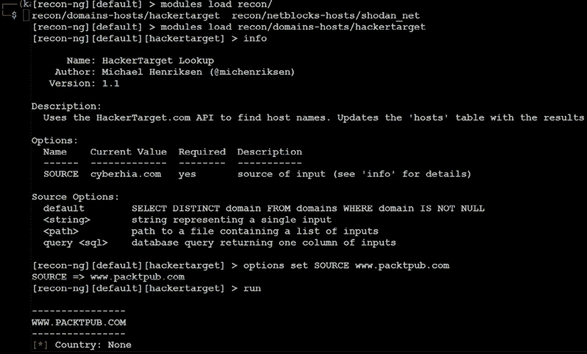
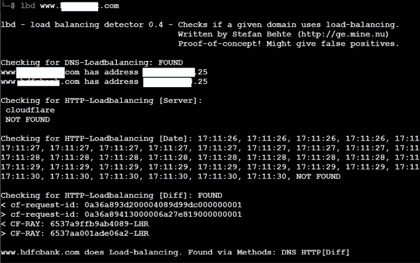
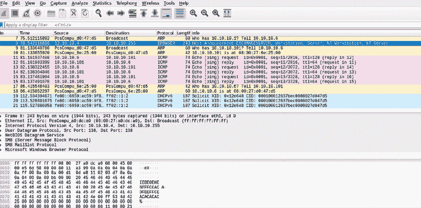
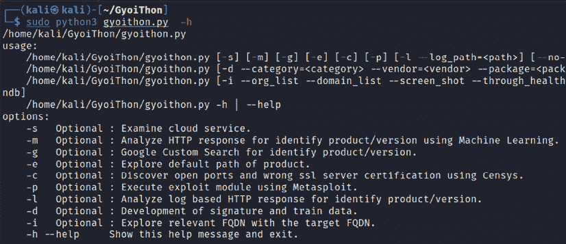

# 第三章：外部和内部网络的主动侦察

主动侦察是直接从目标收集信息的艺术。这个阶段的目的是尽可能多地收集并武器化有关目标的信息，以促进“杀伤链”方法论的利用阶段。在上一章中，我们讨论了如何使用 OSINT 进行被动侦察，这几乎是不可被察觉的，并且能提供关于目标组织及其用户的大量信息。这个阶段建立在 OSINT 和被动侦察获得的结果基础上，强调更加集中的探测，以识别通往目标的路径以及攻击面。一般而言，复杂系统具有更大的攻击面，而每个攻击面都可能被利用，从而支持更多的攻击。

尽管主动侦察能产生更有用的信息，但与目标系统的交互可能会被记录，从而触发保护设备（如防火墙、**入侵检测系统**（**IDSes**）、**入侵防御系统**（**IPSes**）和**终端检测响应**（**EDR**）**系统**）的警报。随着数据对攻击者的有用性增加，检测的风险也随之增加；这一点在*图 3.1*中有所体现：


图 3.1：数据的有用性与攻击者检测风险

为了提高主动侦察提供详细信息的效果，我们的重点将放在使用最隐蔽的技术上，因为这些技术最难被检测到。在本章中，你将学习以下内容：

+   隐蔽扫描技术

+   外部和内部基础设施、主机发现与枚举

+   对应用程序进行全面侦察，特别是 recon-ng

+   使用 DHCP 枚举内部主机

+   在 SaaS 应用程序中枚举服务

+   渗透测试中有用的微软 Windows 命令

+   利用默认配置

+   使用 SNMP、SMB 和 rpcclient 进行用户枚举

# 隐蔽扫描技术

主动侦察的最大风险是被目标发现。通过测试人员的时间和数据戳、源 IP 地址以及其他信息，目标可以识别侦察的来源。

因此，采用隐蔽技术来最小化被检测的可能性。在支持侦察时，模拟黑客行为的测试人员将执行以下操作：

+   伪装工具签名以避免被检测，从而触发警报

+   将攻击隐藏在合法流量中

+   修改攻击以隐藏流量的来源和类型

+   使用非标准流量类型或加密使攻击不可见

隐蔽扫描技术可以包括以下部分或全部内容：

+   调整源 IP 栈和工具识别设置

+   修改数据包参数（Nmap）

+   使用带有匿名网络的代理（ProxyChains 和 Tor 网络）

## 调整源 IP 栈和工具识别设置

在渗透测试员（或攻击者）开始测试之前，我们必须确保 Kali 上所有不必要的服务都被禁用或关闭。这是为了防止被检测到。例如，本地的 DHCP 守护进程已启用但并不需要。DHCP 有可能与目标系统交互，从而被记录并向目标管理员发送警报。其他需要更新的服务可能会与授权服务器或错误报告服务建立网络通信，因此最好在测试过程中禁用所有不需要的服务，只启用执行特定任务所必需的服务。

一些商业和开源工具（例如 Metasploit 框架）会在其数据包中标记一个标识序列。虽然这在测试后分析系统事件日志时非常有用（可以将由特定测试工具发起的事件与系统的事件日志直接比较，以确定网络如何检测和响应攻击），但它也可能触发某些入侵检测系统。在实验室系统中测试你的工具，确定哪些数据包被标记，并且可以选择更改标签或小心使用该工具。

识别标记的最简单方法是将工具应用于新创建的虚拟镜像作为目标，并查看系统日志中的工具名称。此外，使用 Wireshark 捕获攻击者和目标虚拟机之间的流量，然后在**数据包捕获**（**pcap**）文件中搜索任何可以归因于测试工具的关键词（工具名称、供应商、许可证号等）。

可以通过修改`http_form_field`选项来更改 Metasploit 框架中的`useragent`。在`msfconsole`提示符下，选择使用`auxiliary/fuzzers/http/http_form_field`选项，然后设置一个新的`useragent`头，如*图 3.2*所示：


图 3.2：在 Metasploit 辅助工具中更改 User agent

在这个例子中，`useragent`被设置为 Google 的索引蜘蛛`Googlebot-Image`。这是一个常见的自动化应用程序，访问并索引网站，很少引起网站所有者的注意。

渗透测试人员还可以选择使用插件，如 Firefox 的 User agent 切换器：[`addons.mozilla.org/en-GB/firefox/addon/uaswitcher/`](https://addons.mozilla.org/en-GB/firefox/addon/uaswitcher/)

另一种选择是使用 Chrome 的 User agent 切换器：

[`chrome.google.com/webstore/detail/user-agent-switcher-for-c/djflhoibgkdhkhhcedjiklpkjnoahfmg`](https://chrome.google.com/webstore/detail/user-agent-switcher-for-c/djflhoibgkdhkhhcedjiklpkjnoahfmg)

要识别合法的`useragent`头，请参考以下示例：

[`www.useragentstring.com/`](http://www.useragentstring.com/)

## 修改数据包参数

最常见的主动侦察方法是对目标进行扫描，向其发送特定数据包，然后利用返回的数据包获取信息。这类工具中最受欢迎的是**网络映射工具**（**Nmap**）。要有效使用 Nmap，必须以 root 权限运行。这是操作数据包的应用程序的常规要求，因此我们将在所有 Nmap 查询中使用`sudo`。

在尝试减少被检测时，一些隐匿技术包括以下几种：

+   攻击者带着明确的目标接近目标，并仅发送足够数量的数据包来确定目标。例如，如果你想确认一个 Web 主机的存在，你首先需要确定`80`或`443`端口（Web 服务的默认端口）是否开放。

+   避免可能与目标系统建立连接并泄露数据的扫描。不要 ping 目标，或者使用**同步**（**SYN**）以及非常规数据包扫描，如**确认**（**ACK**）、**完成**（**FIN**）和**重置**（**RST**）。

+   随机化或伪造数据包设置，例如源 IP 和端口地址，以及 MAC 地址。

+   调整时间设置，减缓数据包到达目标站点的速度。

+   通过分片数据包或附加随机数据改变数据包大小，以混淆数据包检查设备。

作为示例，如果你想进行隐匿扫描并尽量减少被检测，可以使用以下`nmap`命令：

```
# nmap --spoof-mac Cisco --data-length 24 -T paranoid --max-hostgroup 1 --max-parallelism 10 -Pn 10.10.10.100/24 -v -n -sS -sV -oA output -p T:1-1024 --randomize-hosts 
```

*表 3.1* 详细说明了前述命令：

| **命令** | **原理** |
| --- | --- |
| `--spoof-mac-Cisco` | 伪造 MAC 地址，使其与 Cisco 产品匹配。如果将 Cisco 替换为 0，则会生成完全随机的 MAC 地址。 |
| `--data-length 24` | 这会将 24 个随机字节附加到大多数发送的数据包中。 |
| `-T paranoid` | 将时间设置为最慢模式：paranoid。 |
| `--max-hostgroup` | 限制同时扫描的主机数量。 |
| `--max-parallelism` | 限制发送的未完成探测数。你还可以使用`--scan-delay`选项设置探测之间的暂停；然而，该选项与`--max_parallelism`选项不兼容。 |
| `-Pn` | 不发送 ping 以识别活动系统（因为这可能泄露数据）。 |
| `-n` | 禁用 DNS 解析：Nmap 不会主动查询内部或外部 DNS 服务器获取 DNS 信息。这类查询通常会被记录，因此应该禁用查询功能。 |
| `-sS` | 进行隐匿的 TCP SYN 扫描，这种扫描不会完成 TCP 三次握手。其他扫描类型（例如，空扫描）也可以使用；然而，大多数此类扫描会触发检测设备。 |
| `-sV` | 启用版本检测。 |
| `-oA` | 该选项将结果输出为所有格式（XML、gnmap 和 nmap）。 |
| `-p T:1-1024` | 指定要扫描的 TCP 端口。 |
| `--random-hosts` | 随机化目标主机顺序。 |

表 3.1：对前述 Nmap 命令的详细解析

这些选项将共同创建一个非常缓慢的扫描，以隐藏源的真实身份。然而，如果数据包过于异常，复杂的修改实际上可能会引起目标的注意；因此，许多测试者和攻击者使用匿名网络来最小化被检测的风险。

攻击者还可以通过运行以下命令利用诱饵或僵尸方法：`-D` 是开关，诱饵可以是任何 IP 地址；`RND:10` 是一组 10 个随机 IP 地址，伪装成攻击源。当我们在 Nmap 中使用 `–sI` 开关时，目标应该会接收到来自僵尸 IP 的警报：

```
nmap -n –D Decoy1,decoy2,decoy3 targetIP 
nmap –D RND:10 targetIP
nmap -sI [Zombie IP] [Target IP] 
```

## 使用代理与匿名网络

在本节中，我们将探讨攻击者用来在网络上保持匿名的两个重要工具。我们将在本节中重点介绍 Tor 和 Privoxy。

Tor ([www.torproject.org](http://www.torproject.org)) 是一种开源的第三代洋葱路由实现，提供免费的匿名代理网络访问。洋葱路由通过加密用户流量并通过一系列洋葱路由器进行传输，从而实现在线匿名性。在每个路由器上，都会去除一层加密以获取路由信息，然后将消息传输到下一个节点。它被比作逐层剥洋葱的过程，因此得名。它通过保护用户 IP 流量的源和目的地来防范流量分析攻击。

在此示例中，Tor 将与 Privoxy 一起使用，Privoxy 是一个不缓存的 Web 代理，位于与互联网通信的应用程序之间，并使用高级过滤确保隐私和去除广告，同时删除任何可能发送给测试者的潜在恶意数据。

安装 Tor，请执行以下步骤：

1.  执行 `apt-get update` 和 `apt-get upgrade` 命令，然后使用以下命令：

    ```
    sudo apt install tor 
    ```

1.  一旦安装了 Tor，请编辑位于 `/etc` 目录中的 `proxychains4.conf` 文件。该文件规定了测试系统在访问 Tor 网络时将使用的代理的数量和顺序。代理服务器可能宕机，或者可能出现过载（导致连接缓慢或延迟）；如果发生这种情况，严格的 ProxyChain 将由于缺少预期链接而失败。因此，禁用 `strict_chain` 并启用 `dynamic_chain`，这样可以确保连接按照*图 3.3*所示进行路由：

    图 3.3：在 Proxychains4.conf 中启用动态链

1.  编辑 `[ProxyList]` 部分，确保 `socks5` 代理存在，如*图 3.4*所示：

    图 3.4：将代理列表添加到 proxychains4.conf 中

    开放代理可以轻松地在线找到（例如 [`www.proxynova.com/proxy-server-list/`](https://www.proxynova.com/proxy-server-list/)），并添加到 `proxychains.conf` 文件中。测试人员可以利用这一点进一步模糊自己的身份。例如，如果有报告指出某个国家或 IP 地址段近期对在线攻击负责，可以从该位置查找开放代理并将其添加到你的列表或单独的配置文件中。

1.  要从终端窗口启动 Tor 服务，输入以下命令：

    ```
    # sudo service tor start 
    ```

1.  使用以下命令验证 Tor 是否已启动：

    ```
    # sudo service tor status 
    ```

    验证 Tor 网络是否正常工作并提供匿名连接非常重要。

1.  首先验证你的源 IP 地址。从终端输入以下命令：

    ```
    # firefox www.whatismyip.com 
    ```

    这将启动 Iceweasel 浏览器并打开一个网站，提供与该网页连接的源 IP 地址。

1.  注意 IP 地址，然后使用以下 ProxyChains 命令调用 Tor 路由：

    ```
    # proxychains firefox www.whatismyip.com 
    ```

    在这个特定实例中，IP 地址被识别为 `xx.xx.xx.xx`。从终端窗口对该 IP 地址进行 `whois` 查询，表明传输现在是从一个 Tor 出口节点退出，如 *图 3.5* 所示：

    

    图 3.5：你的随机分配的 IP 地址的 whois 详细信息

你还可以通过访问来验证 Tor 是否正常工作

[`check.torproject.org`](https://check.torproject.org)。

尽管通信现在通过 Tor 网络得到保护，但仍然可能发生 DNS 泄漏，这种情况发生在系统进行 DNS 请求时，可能会泄露你的身份给 ISP。你可以在 [www.dnsleaktest.com](http://www.dnsleaktest.com) 上检查 DNS 泄漏。

大多数命令行可以通过 `proxychains` 从控制台运行，以访问 Tor 网络。在使用 Tor 时，需要注意以下几点：

+   Tor 提供匿名服务，但不保证隐私。出口节点的拥有者能够嗅探流量，并可能能够访问用户凭证。

+   据报道，Tor 浏览器包中的漏洞已被执法机关用来攻击系统并获取用户信息。

+   ProxyChains 不处理**用户数据报协议**（**UDP**）流量。

+   某些应用程序和服务无法在这种环境中运行——尤其是 Metasploit 和 Nmap 可能会出现问题。Nmap 的隐蔽 SYN 扫描会突破 ProxyChains，改为使用连接扫描，这可能会泄露信息给目标。

+   一些浏览器应用程序（如 Flash/ActiveX 或 HTML5）可以用来获取你的 IP 地址。

+   攻击者还可以使用随机链接。使用此选项时，ProxyChains 会从我们的列表中随机选择 IP 地址（例如本地以太网 IP，`127.0.0.1`，`192.168.x.x` 或 `172.16.x.x`）并用它们来创建我们的 ProxyChain。这意味着每次使用 ProxyChains 时，代理链对目标看起来都不同，从而使追踪我们流量的来源变得更加困难。

+   为此，以类似的方式编辑 `/etc/proxychains4.conf` 文件，注释掉 `dynamic chains` 并取消注释 `random_chain`，因为我们一次只能使用其中一个选项。

+   此外，攻击者可以取消注释 `chain_len` 所在的行，这样在创建随机代理链时，链中的 IP 地址数量将由其决定。

攻击者可以使用此技术来建立合格的匿名性，并在网络上保持匿名。

# DNS 侦察与路由映射

一旦测试者识别出具有在线存在并包含感兴趣项目的目标，下一步是识别目标的 IP 地址和路由。DNS 侦察关注的是识别谁拥有某个特定域名或一系列 IP 地址（这类信息可以通过 `whois` 获得，尽管自 2018 年 5 月起，**通用数据保护条例**（**GDPR**）在欧洲生效后，这一过程已发生完全变化）。DNS 信息定义了分配给目标的实际域名和 IP 地址，以及渗透测试者或攻击者与最终目标之间的路由。

这一信息收集是半主动的，因为有些信息来自如 [dnsdumpster.com](http://dnsdumpster.com) 等公开的免费开放源，而其他信息则来自第三方，如 DNS 注册商。尽管注册商可能会收集与攻击者请求相关的 IP 地址和数据，但通常不会提供给最终目标。目标可以直接监控的信息，如 DNS 服务器日志，通常不会被审查或保留。

由于所需的信息可以通过定义的系统化和有条理的方法查询，因此其收集可以实现自动化。

请注意，DNS 信息可能包含过时或不准确的条目。为减少不准确信息的出现，可以查询不同的源服务器并使用不同的工具进行交叉验证。审查结果并手动验证任何可疑的发现。

## whois 命令（GDPR 后）

`whois` 命令曾是识别 IP 地址的第一步，持续了多年，直到 GDPR 生效为止。以前，`whois` 命令用于查询存储互联网资源注册用户信息的数据库，如域名或 IP 地址。根据查询的数据库，`whois` 请求的响应将提供名称、物理地址、电话号码和电子邮件地址（有助于社交工程攻击），以及 IP 地址和 DNS 服务器名称。2018 年 5 月 25 日后，不再提供注册人详细信息；然而，攻击者仍可以了解哪个 `whois` 服务器响应，并且它会检索包括可用性、所有权、创建、到期详细信息和名称服务器在内的域名数据。*图 3.6* 显示了对 `facebook.com` 域运行 `whois` 命令的情况：


图 3.6：包含名称服务器详细信息的 facebook.com 域的 whois 信息

# 使用全面的侦察应用程序

虽然 Kali 包含多种工具来辅助侦察，但许多工具的功能重叠，并且将一个工具中的数据导入到另一个工具通常是一个复杂的手动过程。大多数测试人员选择一组子集工具，并通过脚本调用它们。

专注于侦察的综合工具最初是命令行工具，具有一组定义的功能；其中最常用的是 **深度魔法信息收集工具**（**DMitry**）。DMitry 可以执行 `whois` 查找，检索 [netcraft.com](http://netcraft.com) 信息，搜索子域和电子邮件地址，并执行 TCP 扫描。不幸的是，它在这些功能之外不可扩展。

*图 3.7* 提供了运行 DMitry 对 [www.cyberhia.com](http://www.cyberhia.com) 的详细信息。可以使用以下命令来枚举反向 DNS 到 IP 查找、Whois、子域、电子邮件地址和开放端口详细信息：

```
sudo dmitry -winsepo out.txt www.cyberhia.com 
```


图 3.7：运行 DMitry 提取域和 whois 信息

请注意，此处生成的一些信息可能属于提供 DNS 保护的托管公司。例如，如果我们的目标托管来自 Cloudflare 或 AWS **内容分发网络**（**CDN**）的名称服务器。

最近的进展促成了综合框架应用程序的出现，这些应用程序结合了被动和主动侦察。在接下来的部分，我们将更多地了解 recon-ng。

## recon-ng 框架

recon-ng 框架是一个开源框架，用于进行侦察（被动和主动），最近新增了一个完整的插件市场。该框架类似于 Metasploit 和 **Social Engineer Toolkit**（**SET**）；recon-ng 使用一个非常模块化的框架。每个模块都是一个定制的命令解释器，预配置用于执行特定任务。

recon-ng 框架及其模块是用 Python 编写的，使得渗透测试人员可以轻松构建或修改模块以促进测试。recon-ng 工具还利用第三方 API 进行某些评估；这种额外的灵活性意味着 recon-ng 执行的一些活动可能会被这些第三方追踪。用户可以指定自定义`useragent`字符串或代理请求，以最小化对目标网络的警觉。

在 Kali 的较新版本中，recon-ng 默认已安装。recon-ng 收集的所有数据都将存储在数据库中，允许你根据存储的数据创建各种报告。用户可以选择其中一个报告模块，自动生成 CSV 报告或 HTML 报告。

要启动应用程序，请在提示符下输入`recon-ng`；要查看可用模块，请在`recon-ng>`提示符下输入`marketplace search`，如*图 3.8*所示：


图 3.8：在 recon-ng 中进行市场搜索以查找所有可用模块

要安装任何模块，我们只需运行`marketplace install modulename`，要加载特定模块，输入`modules load`后跟模块名。在输入时按*Tab*键会自动完成命令。如果模块有唯一的名称，你可以只输入名称的唯一部分，模块将被加载，而无需输入完整路径。

输入`info`将为你提供有关模块如何工作以及如何获取 API 密钥的信息（如果需要）。模块加载后，使用`options set`命令设置选项，然后输入`run`执行，如*图 3.9*所示：



图 3.9：加载 hackertarget 模块并将源设置为 www.packtpub.com

一般而言，测试人员依赖 recon-ng 进行以下操作：

+   利用多个来源（如 haveibeenpwned、mangle、mailtester、censys 和 shodan）收集主机和联系人信息。

+   使用 Flickr、Shodan、geocode、YouTube 和 Twitter 识别主机和个人的地理位置。

+   使用`netcraft`和相关模块识别主机信息。

+   识别以前已被泄露并暴露在互联网上的账户和密码信息（`pwnedlist`模块位于 domains-credentials 中——`domain_ispwned`、`account_creds`、`domain_creds`、`leak_lookup` 和 `leaks_dump`）。

### IPv4

**互联网协议**（**IP**）地址是用于标识连接到私人网络或公共互联网的设备的唯一编号。如今，互联网主要基于版本 4，即 IPv4。Kali 包含若干工具以促进 DNS 侦察，如*表 3.2*所示：

| **应用程序** | **描述** |
| --- | --- |
| `dnsenum`、`dnsmap` 和 `dnsrecon` | 这些是全面的 DNS 扫描工具——DNS 记录枚举（A、MX、TXT、SOA、通配符等）、子域名暴力攻击、Google 查找、反向查找、区域传输和区域遍历。`dnsrecon` 通常是首选——它非常可靠，结果解析良好，数据可以直接导入到 Metasploit 框架中。 |
| `dnswalk` | 该 DNS 调试器检查指定域的内部一致性和准确性（在 Kali 的新版本中未默认安装，因此需要运行 `apt-get install dnswalk`）。 |
| `fierce` | 该工具通过尝试区域传输并进行暴力破解攻击，定位与指定域名不相邻的 IP 空间和主机名，从而获得 DNS 信息。 |

表 3.2：Kali 中用于帮助 DNS 勘探的工具

在测试过程中，大多数调查人员首先运行 `fierce` 以确认已识别出所有可能的目标，然后运行至少两种全面的工具（例如 `dnsenum` 和 `dnsrecon`）以生成最大量的数据，并提供一定程度的交叉验证。

在 *图 3.10* 中，`dnsrecon` 被用于生成标准 DNS 记录搜索，以及特定于 SRV 记录的搜索。每种情况下的结果摘录如下：


图 3.10：在 www.packtpub.com 上运行 dnsrecon 工具

`dnsrecon` 允许渗透测试人员获取 SOA 记录、**名称服务器**（**NS**）、**邮件交换器**（**MX**）主机、使用 **发送者策略框架**（**SPF**）发送电子邮件的服务器，以及使用中的 IP 地址范围。

### IPv6

尽管 IPv4 看似提供了大规模的地址空间，但几年前，免费的 IP 地址已被用尽，迫使人们使用 NAT 技术来增加可用地址的数量。一个更为永久的解决方案是在采用改进的 IP 地址方案 IPv6 后得以实现。尽管它只占互联网地址的不到 5%，但其使用率在不断增加，渗透测试人员必须做好应对 IPv4 和 IPv6 之间差异的准备。

在 IPv6 中，源地址和目标地址的长度为 128 位，共有 2¹²⁸ 个可能的地址——即 340 无穷大个地址！

地址空间增大的问题给渗透测试人员带来了一些困扰，尤其是在使用扫描器逐步扫描可用地址空间寻找存活的服务器时。然而，IPv6 协议的一些特性简化了发现过程，特别是使用 ICMPv6 来识别活动的链路本地地址。

在进行初步扫描时，考虑到以下原因，IPv6 是非常重要的：

+   测试工具对 IPv6 功能的支持不均，因此测试人员必须确保验证每个工具，以确定其在 IPv4、IPv6 和混合网络中的性能和准确性。

+   由于 IPv6 是一种相对较新的协议，目标网络可能包含泄露重要数据的配置错误；测试人员必须准备好识别并利用这些信息。

+   旧的网络控制设备（如防火墙、IDS 和 IPS）可能无法检测到 IPv6。在这种情况下，渗透测试人员可以使用 IPv6 隧道来与网络保持隐蔽通信，并将未被检测到的数据外泄。

## 使用专门的 IPv6 工具

Kali 包含了若干开发的工具，旨在利用 IPv6（大多数全面的扫描器，如 Nmap，现在都支持 IPv6），其中一些工具在此进行了详细介绍。特定于 IPv6 的工具主要来源于 **THC-IPv6 攻击工具包**。可以通过运行以下命令来安装该工具：

```
sudo apt install thc-ipv6 
```

*表 3.3* 提供了用于 IPv6 侦察的工具列表：

| **应用** | **描述** |
| --- | --- |
| `atk6-dnsdict6` | 使用基于字典文件或自身内部列表的暴力搜索枚举子域名，以获取 IPv4 和 IPv6 地址（如果存在） |
| `atk6-dnsrevenum6` | 根据 IPv6 地址执行反向 DNS 枚举 |
| `atk6-covert_send6` | 将文件内容隐蔽地发送到目标 |
| `atk6-covert_send6d` | 将隐蔽接收到的内容写入文件 |
| `atk6-denial6` | 对目标执行各种拒绝服务攻击 |
| `atk6-detect-new-ip6` | 检测加入本地网络的新 IPv6 地址 |
| `atk6-detect_sniffer6` | 测试本地局域网内的系统是否正在嗅探 |
| `atk6-exploit6` | 对目标执行已知的 IPv6 漏洞（CVE）的利用 |
| `atk6-fake_dhcps6` | 假冒 DHCPv6 服务器 |

表 3.3：Kali 中用于评估 IPv6 的工具

Metasploit 也可以用于 IPv6 主机发现。`auxiliary/scanner/discovery/ipv6_multicast_ping` 模块将发现所有启用 IPv6 的机器及其物理（MAC）地址，如 *图 3.11* 所示：


图 3.11：使用 Metasploit ipv6 扫描器发现网络中的 IPv6 设备

`sudo atk6-alive6` IPv6 套件将发现同一段网络中的活动地址，如 *图 3.12* 所示：


图 3.12：使用 atk6-alive6 发现网络中的 IPv6 活跃设备

## 映射到目标的路径

路径映射最初作为诊断工具，允许您查看一个 IP 数据包从一个主机到另一个主机的路径。

通过使用 IP 数据包中的 **生存时间**（**TTL**）字段，每经过一个节点，接收路由器会返回一个 `ICMPTIME_EXCEEDED` 消息，并将 `TTL` 字段中的值减少 `1`。

数据包计算跳数和路径。对于攻击者或渗透测试人员来说，`traceroute` 数据提供了以下重要信息：

+   攻击者和目标之间的确切路径

+   与网络外部拓扑相关的提示

+   确认访问控制设备（防火墙和数据包过滤路由器）是否在过滤攻击流量

+   如果网络配置错误，可能会识别出内部地址

使用基于网页的 traceroute（[www.traceroute.org](http://www.traceroute.org)），可以追踪到各种不同地理位置的源站点到目标网络。这种类型的扫描通常会发现多个不同的网络连接到目标，这些信息在仅从接近目标的地点执行单个 traceroute 命令时可能会被遗漏。基于网页的 traceroute 还可能识别出连接两个或多个网络的多宿主主机。这些主机是攻击者的重要目标，因为它们大大增加了通向目标的攻击面。

在 Kali 中，`traceroute` 是一个使用 ICMP 数据包来绘制路由的命令行程序；在 Windows 中，该程序是 `tracert`。

如果从 Kali 启动 `traceroute`，你很可能会看到大多数跳数被过滤（数据以 `* * *` 显示）。例如，从作者当前所在的位置进行 `traceroute` 到 [www.packtpub.com](http://www.packtpub.com) 时，输出将显示为 *图 3.13* 所示：


图 3.13：对 www.packtpub.com 进行的 traceroute 路由跟踪

如果使用 Windows 命令行中的 `tracert` 运行相同的请求，我们将看到如 *图 3.14* 所示的输出：


图 3.14：使用 Windows tracert 工具对 www.packtpub.com 进行 traceroute 路由跟踪

我们不仅可以获得完整的路径，还可以看到 [www.google.com](http://www.google.com) 解析到一个略微不同的 IP 地址，表明负载均衡器正在生效（你可以通过使用 Kali 的 `lbd` 脚本来确认这一点；不过，这一活动可能会被目标网站记录）。

路径数据的不同原因在于，`traceroute` 默认使用 UDP 数据报，而 Windows 的 `tracert` 工具则使用 ICMP 回显请求（ICMP 类型 8）。因此，在使用 Kali 工具完成 `traceroute` 时，重要的是使用多种协议来获取最完整的路径，并绕过数据包过滤设备。Kali 提供了一组完成路由跟踪的工具，详见 *表 3.4*：

| **应用程序** | **描述** |
| --- | --- |
| `hping3` | 这是一个 TCP/IP 数据包组装和分析工具。它支持 TCP、UDP、ICMP 和原始 IP，并采用类似于 ping 的界面。 |
| `intrace` | Kali 的较新版本没有预装此工具，因此测试者需要在终端运行 `apt install intrace` 来获取它。这个工具通过利用现有的 TCP 连接（无论是从本地系统或网络发起的，还是来自本地主机）来枚举 IP 路由跳数。它对于绕过外部过滤器（如防火墙）非常有用。intrace 是一个替代不太可靠的 0trace 程序的工具。 |
| `atk6-trace6` | 这是一个使用 ICMP6 协议的 traceroute 程序。 |

表 3.4：可用于完成 trace routes 的 Kali 工具

`hping3`是最有用的工具之一，因为它可以控制数据包类型、源数据包和目标数据包。例如，Google 不允许 ping 请求。然而，如果将数据包作为 TCP SYN 请求发送，仍然可以 ping 服务器。

在以下示例中，测试者尝试从命令行 ping 目标域。没有返回数据；目标域显然正在阻止基于 ICMP 的`ping`命令。然而，下一条命令调用`hping3`，并指示它执行以下操作：

+   使用设置了 SYN 标志的 TCP 发送类似 ping 的命令到目标域（`-S`）

+   将数据包定向到 80 端口；此类合法请求很少被阻止（`- p 80`）

+   设置发送三个数据包到目标的计数（`-c 3`）

执行前述步骤时，使用*图 3.15*所示的命令：


图 3.15：通过 80 端口运行 hping3 测试目标

`hping3`命令成功识别目标在线，并提供一些基本的路由信息。

# 识别外部网络基础设施

一旦测试者的身份得到保护，下一步关键的是识别网络中可访问互联网部分的设备。攻击者和渗透测试人员使用这些信息执行以下操作：

+   识别可能干扰（负载均衡器）或消除（防火墙和数据包检查设备）测试结果的设备

+   识别具有已知漏洞的设备

+   识别继续实施隐秘扫描的需求

+   了解目标在安全架构和一般安全方面的关注点

`traceroute`提供有关数据包过滤能力的基本信息；Kali 中的其他一些应用程序包括：

+   **Lbd**：使用两种基于 DNS 和 HTTP 的技术来检测负载均衡器（如*图 3.16*所示）

+   **Nmap**：检测设备并确定操作系统及版本

+   **Shodan**：基于 Web 的搜索引擎，识别连接到互联网的设备，包括那些具有默认密码、已知错误配置和漏洞的设备

+   **censys.io**和**spyze**：类似于已经扫描整个互联网的 Shodan 搜索，提供证书详细信息、技术信息、错误配置和已知漏洞。

*图 3.16*显示了在对目标域运行`lbd`脚本时获得的结果；如你所见，目标在其网站上使用了`DNS-Loadbalancing`和`HTTP-Loadbalancing`。从渗透测试人员的角度来看，这些信息可以用来解释为什么获得了虚假结果，因为负载均衡器将特定工具的活动从一个服务器转移到另一个服务器。*图 3.16*还显示了 HTTP 负载均衡：



图 3.16：运行 lbd 检测负载均衡器

# 防火墙之外的映射

攻击者通常使用`traceroute`工具开始网络调试，`traceroute`尝试映射到特定目标主机或系统的路由中的所有主机。一旦目标被到达，`TTL`字段将为`0`，而目标将丢弃数据报并生成 ICMP 超时包返回给源主机。常规的`traceroute`与*图 3.17*所示类似：

图 3.17：运行 traceroute 识别数据包过滤设备

正如从前面的示例中看到的那样，我们无法超越特定的 IP，这很可能意味着在跳数`3`处存在一个数据包过滤设备。攻击者会进一步挖掘，以了解该 IP 上部署了什么。

部署默认的 UDP 数据报选项时，每次发送 UDP 数据报时都会增加端口号。因此，攻击者将开始指向一个端口号，以便到达最终目标位置。

# IDS/IPS 识别

渗透测试人员可以使用`nmap`和`WAFW00F`来识别是否存在检测或防御机制，如**入侵检测系统**（**IDS**）、**入侵防御系统**（**IPS**）或**Web 应用程序防火墙**（**WAF**）。

攻击者在主动侦察过程中使用的另一个工具是`WAFW00F`；该工具在最新版本的 Kali Linux 中已预装。它用于识别和指纹识别 WAF 产品，并提供已知 WAF 的列表。可以通过向命令添加`-l`开关来提取正在使用的 WAF 版本（例如，`wafw00f -l`）。*图 3.18* 显示了运行在 Web 应用程序背后的具体 WAF：


图 3.18：运行 wafw00f 指纹识别 Web 应用程序防火墙

# 主机枚举

主机枚举是获取有关特定主机详细信息的过程。仅知道服务器或无线接入点的存在是不够的；相反，我们需要通过识别开放端口、基础操作系统、正在运行的服务以及支持的应用程序来扩展攻击面。这是高度侵入性的，除非小心处理，否则这种活动会被目标组织检测到并记录。

## 活跃主机发现

第一步是对目标地址空间进行网络 ping 扫描，并查找指示特定目标处于活动状态并能够响应的响应。历史上，ping 通常指的是使用 ICMP；然而，TCP、UDP、ICMP 和 ARP 流量也可以用于识别活动主机。

各种扫描器可以通过互联网的远程位置运行，以识别活动主机。虽然主要的扫描器是 Nmap，Kali 还提供了其他一些有用的应用程序，如*表 3.5*所示：

| **应用程序** | **描述** |
| --- | --- |
| `atk6-alive6` 和 `atk6-detect-new-ip6` | 这是用于 IPv6 主机检测的工具。`Atk6-detect-new-ip6` 以脚本方式运行，当新 IPv6 设备被添加时，会自动识别。 |
| `dnmap` 和 `nmap` | `nmap` 是标准的网络枚举工具。`dnmap` 是 Nmap 扫描器的分布式客户端-服务器实现。PBNJ（一个用于监控网络上变化的工具套件）将 Nmap 结果存储在数据库中，并进行历史分析，以识别新主机。 |
| `fping`、`hping2`、`hping3` 和 `nping` | 这些是数据包构造工具，它们通过不同的方式响应目标，帮助识别在线主机。 |

表 3.5：在 Kali Linux 中用于发现在线主机的工具

对于渗透测试员或攻击者来说，从在线主机发现中返回的数据将确定攻击目标。

在进行渗透测试时，最好运行多个主机发现扫描，因为某些设备可能是时间敏感的。在一次渗透测试中，发现系统管理员在正常工作时间结束后设置了一台服务器用于玩游戏。由于这不是一个经过批准的业务系统，管理员没有按照正常流程为服务器提供安全保护；服务器上有多个易受攻击的服务，且未安装必要的安全补丁。测试人员通过利用管理员用于玩游戏的服务器中的漏洞，成功攻破了该服务器并获得了访问底层企业网络的权限。

# 端口、操作系统和服务发现

Kali 提供了几种不同的工具，适用于识别远程主机上开放的端口、操作系统和已安装的服务。大多数功能可以通过 Nmap 完成。虽然我们会重点介绍使用 Nmap 的示例，但其基本原理同样适用于其他工具。

## 端口扫描

端口扫描是连接到 TCP 和 UDP 端口的过程，用来确定目标设备上正在运行的服务和应用程序。在 TCP/IP 中，每台计算机有 65,535 个端口，分别用于 TCP 和 UDP。有些端口已知与特定服务相关联（例如，TCP 20 和 21 是 **文件传输协议** (**FTP**) 服务的常用端口）。

前 1,024 个端口是众所周知的端口，大多数定义的服务都在这个范围内运行；已接受的服务和端口由 IANA 维护（[`www.iana.org/assignments/service-names-port-numbers/service-names-port-numbers.xhtml`](http://www.iana.org/assignments/service-names-port-numbers/service-names-port-numbers.xhtml)）。

虽然某些服务有预定义的端口，例如 `80` 端口用于网页流量，但服务可以被配置为使用任何端口。这个选项常常用于隐藏特定服务，特别是当服务已知易受攻击时。然而，如果攻击者完成端口扫描后没有发现预期的服务，或者发现服务使用了不常见的端口，他们将会被促使进一步调查。

通用端口映射工具 Nmap 依赖于主动栈指纹识别。特制的数据包被发送到目标系统，操作系统对这些数据包的响应使 Nmap 能够识别操作系统。为了使 Nmap 工作，必须至少有一个监听端口是开放的，并且操作系统必须已知并进行指纹识别，且该指纹的副本已存储在本地数据库中。

使用 Nmap 进行端口发现时会产生大量噪声；它将被网络安全设备检测到并记录下来。需要记住的几点如下：

+   聚焦于隐蔽性的攻击者和渗透测试人员只会测试那些影响他们所追踪的目标的**杀伤链**的端口。如果他们正在发起一个利用 web 服务器漏洞的攻击，他们会寻找具有可访问端口`80`和`443`，或端口`8080`和`8443`的目标。

+   大多数端口扫描器都有默认的端口列表，扫描这些端口以确保你知道列表中有哪些端口，以及哪些端口被遗漏了。需要考虑 TCP 和 UDP 端口。

+   成功的扫描需要对 TCP/IP 及相关协议、网络以及特定工具如何工作的深刻理解。例如，SCTP 是一个越来越常见的网络协议，但在公司网络中很少进行测试。

+   即使是慢速进行的端口扫描，也可能会影响网络。一些旧的网络设备和来自特定厂商的设备在接收或传输端口扫描时会被锁定，从而将扫描变成拒绝服务攻击。

+   用于扫描端口的工具，特别是 Nmap，正在扩展其功能。它们还可以用于检测漏洞并利用一些简单的安全漏洞。

# 使用 netcat 编写你自己的端口扫描器

当攻击者利用代理应用和 Tor 网络时，也可以编写自己的自定义网络端口扫描器。以下的一行命令可以在渗透测试中使用，仅通过使用 netcat 就能识别开放端口的列表，如*图 3.19*所示：

```
while read r; do nc -v -z $r 1-65535; done < iplist 
```


图 3.19：运行一行 Bash 脚本进行端口扫描

相同的脚本可以修改为针对单一 IP 的更具针对性的攻击，如下所示：

```
while read r; do nc -v -z target $r; done < ports 
```

使用自定义端口扫描器时，任何入侵检测系统被警报的可能性都比使用其他端口扫描器时要高。

## 操作系统指纹识别

确定远程系统操作系统的方法是通过两种类型的扫描来完成的：

+   **主动指纹识别**：攻击者向目标发送正常和畸形的数据包，并记录其响应模式，这称为指纹。通过将指纹与本地数据库进行比对，可以确定操作系统。

+   **被动指纹识别**：攻击者嗅探或记录并分析数据包流，以确定数据包的特征。

主动指纹识别比被动指纹识别更快、更准确；在 Kali 中，主要的主动工具是 Nmap。Nmap 工具向目标网络注入数据包，并分析其接收到的响应。在*图 3.20*中，`-O`标志命令 Nmap 确定操作系统：

```
nmap -sS -O target.com 
```


图 3.20：Nmap 扫描以识别目标的操作系统

请注意，目标系统隐藏真实操作系统是相对简单的。由于指纹识别软件依赖于数据包设置，如生存时间或初始窗口大小，改变这些值或其他用户可配置的设置会改变工具的结果。一些组织会主动更改这些值，以使侦察的最终阶段更加困难。

## 确定活动服务

侦察阶段的最终目标是识别目标系统上运行的服务和应用程序。如果可能，攻击者将希望知道服务类型、供应商和版本，以便更容易识别潜在的漏洞。以下是一些用于确定活动服务的技术：

+   **识别默认端口和服务**：如果远程系统被识别为运行 Microsoft 操作系统，并且端口`80`（WWW 服务）处于开放状态，攻击者可能会假设已安装了默认的 Microsoft IIS。将使用额外的测试来验证这一假设（使用 Nmap）。

+   **横幅抓取**：这通常使用如 amap、netcat、Nmap 和 Telnet 等工具进行。

+   **检查默认网页**：某些应用程序会安装默认的管理、错误或其他页面。如果攻击者访问这些页面，它们将提供关于已安装应用程序的信息，这些应用程序可能存在安全漏洞。在*图 3.21*中，攻击者可以轻松识别出目标系统上已安装的 Microsoft IIS 版本。

+   **查看源代码**：配置不当的基于 Web 的应用程序可能会对某些 HTTP 请求（如`HEAD`或`OPTIONS`）作出响应，这些响应中可能包含 Web 服务器的软件版本，甚至可能包括基本操作系统或使用的脚本环境。在*图 3.21*中，`netcat`从命令行启动，用于向特定网站发送原始的`HEAD`数据包。该请求生成了成功消息（`200 OK`）；然而，它也识别出服务器正在运行 Microsoft IIS 7.5，并且由 ASP.NET 驱动：

    ```
    nc -vv www.target.com port number and then enter HEAD / HTTP/1.0 
    ```

    

    图 3.21：使用 netcat 抓取目标的横幅

# 大规模扫描

在测试较大的组织时，通常会涉及多个类 B/C IP 范围的大规模扫描。例如，对于全球性公司，通常存在多个 IP 块作为外部面向互联网的部分。如*第二章*《开源情报与被动侦察》中所述，攻击者进行扫描时没有时间限制，而渗透测试人员有时间限制。渗透测试人员可以使用多种工具执行该活动；Masscan 是其中之一，可用于扫描大规模的 IP 块，快速分析目标网络中的活动主机。Masscan 在 Kali 中是默认安装的。

Masscan 的最大优势在于主机、端口、速度的随机化，灵活性和兼容性。*图 3.22*展示了一个类 C 网络的扫描，几秒钟内即可完成，并识别出目标主机上端口 `80` 上可用的 HTTP 服务：

图 3.22：在类 C IP 范围内运行 masscan 以发现 TCP 开放端口 80

## DHCP 信息

**动态主机配置协议**（**DHCP**）是一项动态分配 IP 地址给网络主机的服务。此协议在 TCP/IP 协议栈的数据链路层的 MAC 子层中运行。选择自动配置时，会向 DHCP 服务器发送广播查询，当 DHCP 服务器响应时，客户端会向 DHCP 服务器发送广播查询请求所需的信息。服务器将为系统分配一个 IP 地址，并提供其他配置参数，如子网掩码、DNS 和默认网关。

嗅探是一种非常有效的被动信息收集方法，一旦连接到网络，攻击者可以通过运行 Wireshark 工具开始嗅探，看到大量广播流量，如*图 3.23*所示：

图 3.23：Wireshark 中的广播网络流量

我们现在会看到 **DNS**、**NBNS**、**BROWSER** 及其他可能揭示主机名、**VLAN** 信息、域名和活动子网的协议流量。我们将在*第十一章*《目标行动与横向移动》中讨论更多与嗅探相关的攻击。

## 内部网络主机的识别与枚举

如果攻击者的系统已经配置了 DHCP，它将提供一些非常有用的信息，有助于映射内部网络。可以通过在 Kali 终端中输入 `ifconfig` 来获取 DHCP 信息，如*图 3.24*所示；你应该能够看到详细的信息：


图 3.24：以太网适配器的 ifconfig 详细信息

+   `inet`：DHCP 服务器提供的 IP 信息应至少为我们提供一个活动子网，可以通过不同的扫描技术来识别活动系统和服务的列表。

+   `子网掩码`：此信息可用于计算子网范围。从前面的截图来看，我们有 `255.255.255.0`，这意味着 `CIDR` 是 `/24`，我们可以大致预期在同一子网中有 255 个主机。 |

+   **默认网关**：网关的 IP 信息提供了 ping 其他类似网关 IP 的机会。例如，如果默认网关的 IP 是 10.10.10.1，通过 ping 扫描，攻击者可能能够枚举其他相似的 IP 地址，如 10.10.20.1 和 10.10.20.1。 |

+   **其他 IP 地址**：DNS 信息可以通过访问 `/etc/resolv.conf` 文件获得。该文件中的 IP 地址通常会在所有子网中使用，并且在 DHCP 过程中，域信息也会自动添加到该文件中。 |

## 本地 MS Windows 命令

*表 3.6* 提供了一份渗透测试或红队演练中有用命令的清单，即使只有物理访问权限或具有远程 Shell 与目标系统进行通信时也能使用。然而，这并不是一个详尽的列表：

| **命令** | **示例** | **描述** |
| --- | --- | --- |
| `nslookup` | `nslookup``Server nameserever.google.com``Set type=any``ls -d anydomain.com` | `nslookup` 用于查询 DNS。示例命令展示了如何使用 `nslookup` 进行 DNS 区域传输。 |
| `net view` | `net view` | 该命令显示计算机/域和其他共享资源的列表。 |
| `net share` | `net share list="c:"` | 该命令用于管理共享资源，并显示本地系统上所有共享资源的相关信息。 |
| `net use` | `net use \\[targetIP] [password] /u:[user]``net use \\[targetIP]\[sharename] [password] /u:[user]` | 该命令用于连接同一网络上的任何系统，也可用于检索网络连接列表。 |
| `net user` | `net user [UserName [Password &#124; *] [options]] [/domain]``net user [UserName {Password &#124; *} /add [options] [/domain]]``net user [UserName [/delete] [/domain]]` | 该命令显示与用户相关的信息，并执行与用户帐户相关的活动。 |
| `arp` | `arp /a``arp /a /n 10.0.0.99``arp /s 10.0.0.80 00-AA-00-4F-2A-9C` | 该命令显示并修改 ARP 缓存中的条目。 |
| `route` | `route print``route print 10.*``route add 0.0.0.0 mask 0.0.0.0 192.168.12.1``route delete 10.*` | 类似于 ARP，`route` 可用于了解本地 IP 路由并修改这些信息。 |
| `netstat` | `netstat -n -o` | 该命令显示本地系统上所有活动的 TCP 连接和端口；即显示监听中的连接、已建立连接和在网络适配器 IP 地址上等待的连接。 |
| `nbtstat` | `nbtstat /R``nbtstat /S 5``nbtstat /a Ip` | 该命令显示 NETBIOS 信息，通常用于识别某个 IP 的 MAC 地址，这可用于 MAC 欺骗攻击。 |
| `wmic` | `wmic process get caption,executablepath,commandline``netsh wlan show profile "profilename" key=clear` | `wmic` 被用于攻击者执行所有典型诊断；例如，系统的 Wi-Fi 密码可以通过一条命令提取。 |
| `reg` | `reg save HKLM\Security sec.hive reg save HKLM\System sys.hive reg save HKLM\SAM sam.hive reg add [\\TargetIPaddr\] [RegDomain][ \Key ]``reg export [RegDomain]\[Key] [FileName]reg import [FileName ]``reg query [\\TargetIPaddr\] [RegDomain]\[ Key ] /v [Valuename!]` | `reg` 命令被大多数攻击者用于保存注册表配置单元，以进行离线密码攻击。 |
| `for` | `for /L %i in (1,1,10) do echo %ii && ping -n 5 IP``for /F %i in (password.lst) do @echo %i& @net use \\[targetIP] %i /u:[用户名] 2>nul&& pause && echo [用户名] :%i>>done.txt` | `for` 循环可以在 Windows 中用于创建端口扫描器或枚举账户。 |

表 3.6：渗透测试活动中的常用 Windows 命令

## ARP 广播

在内部网络主动侦察过程中，可以使用 `nmap`（`nmap -v -sn IPrange`）扫描整个本地网络并嗅探 ARP 广播。此外，Kali 也有 `arp-scan`（`arp-scan IP range`）来识别同一网络上存活的主机列表。

*图 3.25* 是 Wireshark 的截图，展示了在对整个子网运行 `arp-scan` 时生成的目标流量。这被认为是一种非隐蔽扫描：


图 3.25：在 Wireshark 上进行 ARP 扫描的网络流量

## Ping 扫描

Ping 扫描是对整个网络 IP 地址范围或单个 IP 进行 ping 测试的过程，用来检查它们是否存活并做出响应。攻击者在进行大规模扫描时的第一步是枚举所有有响应的主机。渗透测试人员可以利用 `fping` 或 `nmap`，甚至编写自定义的 Bash 脚本来执行该活动：

```
fping -g IPrange
nmap -sP IPrange
for i in {1..254}; do ping -c 1 10.10.0.$i | grep 'from'; done 
```

有时，攻击者在进行 ping 扫描时可能会遇到障碍，因为防火墙会阻止所有 ICMP 流量。在 ICMP 被阻止的情况下，我们可以利用以下命令，通过在 ping 扫描时指定端口号列表来识别存活的主机：

```
nmap -sP -PT 80 IPrange 
```

*图 3.26* 显示了使用 `fping` 工具发现的所有存活主机：


图 3.26：在类 C IP 范围上使用 gping 的输出

## 使用脚本结合 masscan 和 nmap 扫描

`masscan` 和 `nmap` 在详细枚举方面的速度和可靠性是我们目标导向渗透测试策略中非常有效的组合。在本节中，我们将编写一段脚本，它能够节省时间并提供比在利用漏洞时使用的工具更准确的结果：

```
#!/bin/bash
function helptext { 
  echo "enter the massnmap with the file input with list of IP address ranges" 
}
if [ "$#" -ne 1 ]; then 
  echo  "Sorry cannot understand the command" 
  helptext>&2 
  exit 1 
elif [ ! -s $1 ]; then 
  echo "ooops it is empty" 
  helptext>&2 
  exit 1 
fi 

if [ "$(id -u)" != "0" ]; then 
  echo "I assume you are running as root" 
  helptext>&2 
  exit 1 
fi
for range in $(cat $1); do 
  store=$(echo $range | sed -e 's/\//_/g') 
  echo "I am trying to create a store to dump now hangon" 
  mkdir -p pwd/$store; 
  iptables -A INPUT -p tcp --dport 60000 -j DROP; 
  echo -e "\n alright lets fire masscan ****" 
  masscan --open --banners --source-port 60000 -p0-65535 --max-rate 15000 -oBpwd/$store/masscan.bin $range; masscan --read$ 
  if [ ! -s ./results/$store/masscan-output.txt ]; then 
     echo "Thank you for wasting time" 
  else 
    awk'/open/ {print $4,$3,$2,$1}' ./results/$store/masscan-output.txt |  awk'
/.+/{ 
 if (!($1 in Val)) { Key[++i] = $1; } 
 Val[$1] = Val[$1] $2 ","; 
 END{ 
 for (j = 1; j <= i; j++) {
 printf("%s:%s\n%s",  Key[j], Val[Key[j]], (j == i) ? "" : "\n");
 } 
}'>}./results/$store/hostsalive.csv 

for ipsfound in $(cat ./results/$store/hostsalive.csv); do 
  IP=$(echo $TARGET | awk -F: '{print $1}'); 
  PORT=$(echo $TARGET | awk -F: '{print $2}' | sed's/,$//'); 
  FILENAME=$(echo $IP | awk'{print "nmap_"$1}'); 
  nmap -vv -sV --version-intensity 5 -sT -O --max-rate 5000 -Pn -T3 -p $PORT -oA ./results/$store/$FILENAME $IP; 
   done 
fi
done 
```

现在，将文件保存为 `anyname.sh`，然后执行 `chmod +x anyname.sh`。接下来，运行 `./anyname.sh fileincludesipranges`。

执行前面的脚本后，你应该能够看到以下内容，如 *图 3.27* 所示：


图 3.27：在 Kali 上运行我们自定义的脚本扫描网络

## 利用 SNMP

**SNMP**，即 **简单网络管理协议**，传统上用于收集网络设备的配置信息，如打印机、集线器、交换机、路由器及互联网协议上的服务器。攻击者可能会利用 SNMP（默认在 UDP 端口 `161` 上运行），特别是当 SNMP 配置不当或被忽视时，默认配置使用默认的社区字符串。

SNMP 首次引入于 1987 年：版本 1 在传输过程中使用明文密码；版本 2c 提高了性能，但仍使用明文密码；而最新的版本 3 则对所有流量进行了加密，并确保消息完整性。所有版本的 SNMP 都使用两种类型的社区字符串：

+   **Public**：社区字符串用于只读访问

+   **Private**：社区字符串用于读写访问

攻击者会寻找的是互联网中任何已识别的网络设备，并检查是否启用了公共社区字符串，以便提取与网络相关的所有信息并绘制拓扑结构，从而进行更有针对性的攻击。这些问题的产生通常是因为基于 IP 的 **访问控制列表** (**ACLs**) 通常未被实施或根本未使用。

Kali Linux 提供了多种工具来执行 SNMP 枚举；攻击者可以利用 snmpwalk 或 onesixtyone 来了解完整的 SNMP 步骤，如 *图 3.28* 所示：

```
snmpwalk -c public ipaddress –v1 
```


图 3.28：具有公共社区字符串的设备上的 snmpwalk 输出

攻击者还可以利用 Metasploit 通过使用 `/auxiliary/scanner/snmp/snmpenum` 模块进行 SNMP 枚举，如 *图 3.29* 所示。

有些系统安装了 SNMP，但系统管理员完全忽视了这一点：


图 3.29：通过 SNMP 协议使用 Metasploit 进行 SNMP 枚举

攻击者还可以通过 Metasploit 内的账户枚举模块提取所有用户账户，如 *图 3.30* 所示：


图 3.30：通过 SNMP 协议使用 Metasploit 进行账户枚举

## 通过 SMB 会话获取的 Windows 账户信息

传统上，在内部网络扫描期间，攻击者很可能利用最常用的内部 **服务器消息块** (**SMB**) 会话。在外部利用的情况下，攻击者可以使用 `nmap` 进行枚举，但这种场景非常罕见。以下 `nmap` 命令将枚举 Windows 机器上的所有远程用户。这些信息通常会创建许多入口点，就像后期的暴力破解和密码猜测攻击一样：

```
nmap --script smb-enum-users.nse -p445 <host> 
```

攻击者还可以利用 Metasploit 模块 `auxiliary/scanner/smb/smb_enumusers` 执行该活动。*图 3.31* 显示了在运行 `Metasploitable3` 的 Windows 系统上成功枚举用户：


图 3.31：使用 SMB 协议在 Metasploit 中枚举用户

这可以通过具有有效的密码猜测来实现，或者通过暴力破解 SMB 登录。

## 定位网络共享

渗透测试人员如今经常忽略的最古老攻击之一是 NETBIOS 空会话，它可以让他们枚举所有网络共享：

```
smbclient -I TargetIP -L administrator -N -U "" 
```

`enum4linux` 也可以像 `enum.exe` 一样使用，`enum.exe` 曾是 BindView 的一部分，现已由 Symantec 接管；该工具通常用于从 Windows 和 Samba 系统中枚举信息：

```
enum4linux.pl [options] targetip 
```

选项如下（如 `enum`）：

+   `-U`：获取用户列表

+   `-M`：获取机器列表

+   `-S`：获取共享列表

+   `-P`：获取密码策略信息

+   `-G`：获取组和成员列表

+   `-d`：详细信息；适用于 `-U` 和 `-S`

+   `-u user`：指定要使用的用户名（默认为 `""`）

+   `-p pass`：指定要使用的密码（默认为 `""`）

该工具在扫描和识别域列表以及域 SID 方面更具攻击性，如 *图 3.32* 所示：


图 3.32：使用 enum4linux 枚举域控制器

## 主动目录域服务器侦察

在内部渗透测试活动中，渗透测试人员通常会被提供用户名和密码。在实际场景中，攻击者已进入网络，攻击场景将是他们能够利用正常用户权限做什么，以及如何提升权限来危及企业域。

Kali Linux 默认安装了 `rpcclient`，可以用来对活动目录环境进行更积极的侦察。该工具提供了多个选项来提取域和其他网络服务的所有详细信息，我们将在 *第十章*，*利用* 中进行探索。系统内部工具之一 ADExplorer 也可以用来执行 AD 枚举。*图 3.33* 展示了域、用户和组的枚举：


图 3.33：使用有效凭据通过 rpcclient 枚举域和账户详细信息

## 枚举 Microsoft Azure 环境

在疫情期间，许多组织进行了转型，以更好地与云平台集成，特别是在 Microsoft Exchange Server 发布关键漏洞时。在本节中，我们将讨论使用 Kali Linux 从 Azure 环境中进行信息收集的各种技术。

要与 Azure 服务交互，我们首先需要下载客户端。可以通过在终端中运行以下命令来实现：

```
curl -sL https://aka.ms/InstallAzureCLIDeb | sudo bash
sudo apt-get install ca-certificates curl apt-transport-https lsb-release gnupg
sudo apt-get install azure-cli 
```

成功安装 `azure-cli` 后，我们应该能够通过运行 `az login` 在 Kali Linux 中使用 `az` 客户端登录；如果没有订阅，攻击者可以通过添加 `--no-subscriptions` 来选择在没有订阅的情况下登录，如 *图 3.34* 所示：


图 3.34：登录 Microsoft 365 Azure 账户

一旦使用 Microsoft 365 账户登录，您应该能够成功接收云详情；如果该账户有订阅，它们将显示在 *图 3.35* 中：


图 3.35：用户有权查看的 Azure 门户详情

*表 3.7* 提供了一些在枚举 Microsoft Azure 云服务时非常有用的命令：

| **命令** | **示例** | **描述** |
| --- | --- | --- |
| `az ad user list` | `az ad user list --output=table --query='[].{Created:createdDateTime,UPN:userPrincipalName,Name:displayName,Title:jobTitle,Department:department,Email:mail,UserId:mailNickname,Phone:telephoneNumber,Mobile:mobile,Enabled:accountEnabled}'``az ad user list --output=json --query='[].{Created:createdDateTime,UPN:userPrincipalName,Name:displayName,Title:jobTitle,Department:department,Email:mail,UserId:mailNickname,Phone:telephoneNumber,Mobile:mobile,Enabled:accountEnabled}' --upn='<upn>'` | 该命令将提供所有连接到此 Azure AD 的用户列表 |
| `az ad group list` | `az ad group list --output=json --query='[].{Group:displayName,Description:description}'` | 该命令将提供与租户关联的所有组的完整列表 |
| `az ad group member list` | `az ad group member list --output=json --query='[].{Created:createdDateTime,UPN:userPrincipalName,Name:displayName,Title:jobTitle,Department:department,Email:mail,UserId:mailNickname,Phone:telephoneNumber,Mobile:mobile,Enabled:accountEnabled}' --group='<group name>'` | 该命令将提供指定组的完整成员列表 |
| `az ad app list` | `az ad app list --output=table --query='[].{Name:displayName,URL:homepage}'``az ad app list --output=json --identifier-uri='<uri>'` | 该命令将提供我们在 Azure AD 中可用的应用程序列表 |
| `az ad sp list` | `az ad sp list --output=table --query='[].{Name:displayName,Enabled:accountEnabled,URL:homepage,Publisher:publisherName,MetadataURL:samlMetadataUrl}'` | 这将提供我们服务主体账户的详细信息 |

表 3.7：用于枚举 Microsoft Azure 云服务的命令

## 使用综合工具（Legion）

以前的安全工具 Sparta 在 Kali 的最新版本中已不可用，但它被另一个名为 Legion 的综合工具所取代，后者与 Sparta 是同一个分支。这个工具可以帮助渗透测试人员加速实现系统攻破的目标，它结合了多个工具，如 Nmap 和其他几个脚本与工具。它是一个半自动化工具，非常适合攻击者在进行基于端口和服务的集中信息收集时使用：

+   `主机`: 这将列出渗透测试人员设置的所有目标

+   `服务`: 这是在自动运行过程中需要运行的服务列表；例如，如果配置为运行 Nmap，并且识别到端口 `80`，它将自动截图

+   `工具`: 这将包括在特定端口上运行的所有工具及其相关输出

*图 3.36* 显示了 Legion 在对本地子网执行操作时的表现。默认情况下，Legion 执行 `nmap` 完整端口扫描，并根据端口上识别的服务运行相应的 Nmap 脚本，并尽可能截图：


图 3.36：Legion 中的端口扫描输出

# 使用机器学习进行侦察

机器学习已成为网络安全中的关键技术。它是使用数据和算法模仿人类学习方式的艺术。机器学习是人工智能的一个分支。在本节中，我们将探讨 GyoiThon 工具，你可以在大规模渗透测试或红队活动中利用它。

机器学习算法有四种类型：

+   有监督：这些学习算法提供了一组已知的数据（带标签），其中包括期望的输出。这种学习的目标是使算法通过学习数据中的模式，从而实现高准确度并进行预测。

+   无监督：这些学习算法在没有标签的数据或不包含期望输出的数据集上进行训练。算法尝试解释和组织数据集。

+   半监督：这是前述几种类型的混合形式。

+   强化学习：这些算法基于有规律的学习过程，其中算法提供一组明确的动作、因素和期望结果。大多数时候，这是一种通过试错法探索不同可能性和选项，以确定哪种方法最优。

GyoiThon 由 gyoisamurai 开发，是一个基于朴素贝叶斯（监督）深度学习方法（深度学习是机器学习的一个子集）的渗透测试工具，使用 Python 3 编写。它包括一个软件分析引擎、漏洞识别引擎和报告生成引擎。要在 Kali Linux 机器上安装 GyoiThon，请在终端中运行以下命令：

```
$ sudo git clone https://github.com/gyoisamurai/GyoiThon
cd GyoiThon
sudo pip3 install -r requirements.txt
sudo apt --fix-broken install
sudo apt install python3-tk 
```

安装完要求后，使用终端运行`sudo python3 gyoithon.py -h`，你应该能够看到所有选项，如*图 3.37*所示：



图 3.37：成功运行 GyoiThon 工具

在开始侦察活动之前，你可以编辑配置文件`config.ini`并输入代理详细信息（如果有），例如 Censys 和 DomainTools 的 API 信息。所有目标信息可以输入到`host.txt`文件中，该文件位于工具克隆的同一文件夹中。输入目标详细信息的格式为：协议（`http`或`https`）、域名（`cyberhia.com`）、端口（`80`或`443`）、根路径（`/`或`/admin/`）。使用`host.txt`对`cyberhia.com`进行侦察的示例如下：

```
http cyberhia.com 80 /
https cyberhia.com 443 /admin/ 
```

最后，你可以在终端中运行`sudo python3 gyoithon.py`。工具中的软件引擎应该能够使用深度学习基础和签名通过正常的 Web 访问抓取横幅。*图 3.38*显示了对目标的成功侦察输出：


图 3.38：使用 GyoiThon 进行侦察

你可以利用此工具的其他功能包括：

+   扫描云服务并探索相关的（**完全合格域名（FQDN）**）

+   执行自定义 Google 搜索并基于产品版本探索默认路径

+   对目标进行端口扫描

+   使用 Metasploit 执行漏洞模块

由于它是一个监督学习算法，你应该能够根据输入到算法中的数据来确定输入和输出。在这种情况下，每次扫描执行时，数据将被标记，并且算法会进行训练，这将显著减少误报。例如，如果目标有数百个域名，这对于自动化服务器横幅抓取并使用漏洞检测引擎列出所有漏洞以准备利用非常有用。

# 总结

攻击者可能面临其活动被识别的实际风险，这使他们面临暴露于目标的风险。然而，我们现在已经看到了在主动侦察过程中可以采用的不同技术，以减少这种风险。攻击者必须确保在需要绘制网络图、寻找开放端口和服务，以及确定安装的操作系统和应用程序之间保持平衡。

攻击者面临的真正挑战是采用隐蔽的扫描技术，以降低触发警报的风险。

手动方法通常用于创建缓慢的扫描；然而，这种方法并不总是有效。因此，攻击者利用像 Tor 网络和各种代理应用程序这样的工具来隐藏他们的身份。

此外，我们还探讨了如何使用 GyoiThon 工具通过机器学习执行侦察，这可以显著减少你的手动工作量。

在下一章中，我们将探讨更多有助于漏洞评估的技术和流程，以及如何利用扫描器识别可作为潜在攻击目标的漏洞，以便推动目标的实现。
