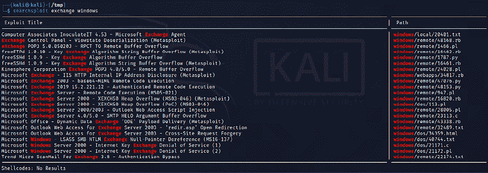
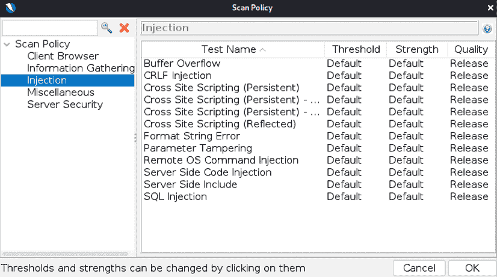

# 第四章：漏洞评估

被动和主动侦察的目标是识别可利用的目标，而漏洞评估的目标是找出最可能支持测试人员或攻击者目标的安全漏洞（未经授权的访问、数据修改或拒绝服务）。在攻击链的利用阶段，漏洞评估专注于创建访问权限，映射漏洞并将漏洞与攻击结合起来，保持对目标的持续访问。

已经识别出了成千上万的可利用漏洞，大多数漏洞都有至少一个概念验证代码文件或技术，能够让系统受到攻击。然而，成功的基本原理在不同的网络、操作系统和应用程序中是相同的。

本章内容将介绍以下内容：

+   使用在线和本地漏洞资源

+   使用 Nmap 进行漏洞扫描

+   Lua 脚本

+   使用**Nmap 脚本引擎**（**NSE**）编写你自己的 Nmap 脚本

+   选择和定制多个漏洞扫描器

+   在 Kali 中安装 Nessus 并探索 Qualys 的在线社区扫描器

+   专用于 Web 和应用程序的扫描器

+   一般的威胁建模

# 漏洞命名法

漏洞扫描通过自动化的过程和应用程序来识别网络、系统、操作系统或应用程序中可能被利用的漏洞。

当正确执行时，漏洞扫描能够提供设备清单（包括授权设备和恶意设备）、已主动扫描的已知漏洞，并通常会确认设备是否符合各种政策和规定。

不幸的是，漏洞扫描非常“响亮”；它们会发送大量数据包，容易被大多数网络控制检测到，这使得隐蔽几乎不可能实现。它们还存在以下限制：

+   在大多数情况下，漏洞扫描器是基于特征的；它们只能检测已知的漏洞，并且只能在存在扫描器可以应用于目标的识别签名时检测到漏洞。对于渗透测试人员来说，最有效的扫描器是开源的；它们允许测试人员快速修改代码以检测新漏洞。

+   扫描器会产生大量输出，常常包含虚假的正向结果，这可能会误导测试人员；尤其是，当网络中使用不同的操作系统时，虚假正向结果的发生率可高达 70%。

+   扫描器可能会对网络造成负面影响；它们可能会产生网络延迟或导致某些设备故障。建议在初次扫描时，通过移除拒绝服务类型的插件来调整扫描。

+   在某些司法管辖区，扫描被视为黑客行为，可能构成非法行为。

有多个商业和开源产品可以执行漏洞扫描。

# 本地和在线漏洞数据库

被动与主动侦察共同识别目标的攻击面，也就是可以评估漏洞的所有点的总数。仅安装操作系统的服务器只有在该操作系统存在漏洞时才可能被利用；然而，随着每个安装的应用程序，潜在的漏洞数量会增加。

渗透测试人员和攻击者必须找到可以利用已知和疑似漏洞的特定漏洞。开始搜索的第一步是访问供应商网站；大多数硬件和应用程序供应商在发布补丁和升级时会发布漏洞信息。如果已知某个弱点的漏洞，供应商通常会将此信息突出显示给他们的客户。

尽管它们的目的是让客户自行测试漏洞的存在，攻击者和渗透测试人员也会利用这些信息。

其他收集、分析并共享漏洞信息的在线站点如下：

+   国家漏洞数据库，汇集了美国政府发布的所有公共漏洞数据，网址：[`web.nvd.nist.gov/view/vuln/search`](http://web.nvd.nist.gov/view/vuln/search)

+   Packet Storm Security，网址：[`packetstormsecurity.com/`](https://packetstormsecurity.com/)

+   SecurityFocus，网址：[`www.securityfocus.com/vulnerabilities`](http://www.securityfocus.com/vulnerabilities)

+   由 Offensive Security 维护的漏洞数据库，网址：[`www.exploit-db.com/`](https://www.exploit-db.com/)

+   对于一些 0-day 漏洞，渗透测试人员也可以关注[`0day.today/`](https://0day.today/)

漏洞数据库也被本地复制到 Kali，并可以在`/usr/share/exploitdb`目录中找到。

要搜索本地的`exploitdb`副本，请打开终端窗口，在命令提示符中输入`searchsploit`和所需的搜索词。这将调用一个脚本，该脚本会搜索包含所有漏洞列表的数据库文件（`.csv`）。搜索结果将返回已知漏洞的描述，以及相关漏洞的路径。该漏洞可以提取、编译并针对特定漏洞执行。请看一下*图 4.1*，它展示了`exchange windows`漏洞的描述：



图 4.1：在 searchsploit 中使用关键字进行搜索

搜索脚本从左到右扫描 CSV 文件中的每一行，因此搜索词的顺序非常重要；搜索`Oracle 10g`会返回多个漏洞，但`10g Oracle`则不会返回任何结果。

此外，脚本对大小写非常敏感；尽管你被指示在搜索词中使用小写字符，但搜索 `vsFTPd` 并没有结果，而搜索 `vs FTPd`（在 `vs` 和 `FTPd` 之间有空格）则返回了更多的结果。可以使用 `grep` 命令或诸如 `KWrite`（`apt-get install kwrite`）这样的搜索工具来更有效地搜索 CSV 文件。

本地数据库的搜索可能会识别出几个可能的漏洞，并列出描述和路径；然而，这些漏洞需要根据你的环境进行定制，然后在使用前进行编译。将漏洞复制到 `/tmp` 目录（给定路径未考虑到 `/windows/remote` 目录位于 `/platforms` 目录下的情况）。

以脚本形式呈现的漏洞，例如 Perl、Ruby 和 PHP 认证漏洞，比较容易实现。例如，如果目标是一个可能容易受到远程代码执行攻击的 Microsoft Exchange 2019 服务器，且需要有效的凭证，可以将漏洞复制到 `root` 目录，然后像标准的 Python 文件一样执行，如 *图 4.2* 所示：


图 4.2：从 exploit-db 运行 Python 脚本，针对 Microsoft Exchange 服务器的漏洞

许多漏洞以源代码形式提供，使用前需要编译。例如，针对 Windows RPC 特定漏洞的搜索会识别出几个可能的漏洞。

被识别为 `76.c` 的 RPC DCOM 漏洞在实践中被证明是相对稳定的。因此，我们将其作为示例。为了编译这个漏洞，将其从存储目录复制到 `/tmp` 目录。在该目录下，使用以下命令通过 GCC 编译：

```
root@kali:~# gcc 76.c -o exploit 
```

这将使用 GNU 编译器集合应用程序将 `76.c` 编译成一个名为 `76.exe` 的输出文件，如 *图 4.3* 所示：


图 4.3：编译 C 文件以创建漏洞可执行文件

尽管我们收到了一些警告和备注，编译成功并没有出现任何错误消息。当你在目标上调用应用程序时，必须使用符号链接调用可执行文件（该文件不存储在 `/tmp` 目录中），如下所示：

```
root@kali:~# ./exploit 
```

这个漏洞的源代码有详细的文档，所需的参数在执行时也很清楚，如 *图 4.4* 所示：


图 4.4：运行已编译的漏洞

不幸的是，并非所有来自 Exploit 数据库和其他公共来源的漏洞都能像 `76.c` 那样轻松编译。有几个问题使得这些漏洞对于渗透测试人员来说，使用起来既有问题甚至是危险的，具体问题如下：

+   有意的错误或不完整的源代码通常会遇到，因为有经验的开发人员试图将漏洞隔离开，避免不熟悉风险的初学者尝试在不知晓风险的情况下入侵系统。

+   漏洞利用并不总是有足够的文档说明；毕竟，没有标准来规范用于攻破数据系统的代码的创建和使用。因此，这些漏洞利用工具可能很难使用，特别是对于缺乏应用开发经验的测试人员。

+   由于环境的变化（如对目标系统应用的新补丁和目标应用中的语言变化）可能导致不一致的行为，这可能需要对源代码进行重大修改；同样，这可能需要一位熟练的开发者。

+   总是存在免费代码包含恶意功能的风险。渗透测试人员可能以为自己正在进行**概念验证**（**POC**）测试，但却未意识到漏洞利用工具还在被测试的应用中创建了一个后门，开发者可能利用该后门。

为了确保一致的结果并创建一个遵循一致实践的编码社区，已经开发了多个漏洞利用框架。最流行的漏洞利用框架是 Metasploit 框架，我们将在*第十章*《漏洞利用》中进一步探讨 Metasploit。

接下来，让我们探讨渗透测试人员在漏洞扫描过程中可以利用的不同工具。

# 使用 Nmap 进行漏洞扫描

没有 Nmap 的安全操作系统发行版是不存在的。到目前为止，我们已经讨论了如何在主动侦察过程中使用 Nmap，但攻击者不仅仅使用 Nmap 来寻找开放端口和服务，还利用 Nmap 执行漏洞评估。截至 2021 年 12 月 21 日，Nmap 的最新版本是 7.92，随附有 600 多个 NSE 脚本，如*图 4.5*所示：


图 4.5：查看 /usr/share/nmap/scripts 文件夹中的所有脚本

渗透测试人员利用 Nmap 最强大、最灵活的功能，它们允许他们编写自己的脚本，并且还可以自动化脚本以简化漏洞利用过程。NSE 的主要开发目的如下：

+   **网络发现**：攻击者利用 Nmap 的主要目的就是网络发现，正如我们在*第三章*《外部与内部网络的主动侦察》中学到的那样。

+   **服务的版本分类检测**：同一个服务有成千上万的服务版本，Nmap 使得识别这些服务变得更加容易。

+   **漏洞检测**：自动识别广泛网络范围内的漏洞；然而，Nmap 本身不能完全充当漏洞扫描器。

+   **后门检测**：一些脚本被编写用来识别后门模式。如果网络中有任何蠕虫感染，它会使攻击者的工作变得容易，能够缩小范围并集中精力远程控制机器。

+   **漏洞利用**：攻击者也可以利用 Nmap 与其他工具（如 Metasploit）结合进行漏洞利用，或者编写自定义的反向 shell 代码，并将 Nmap 的功能与这些工具结合使用进行利用。

在启动 Nmap 执行漏洞扫描之前，渗透测试人员必须更新 Nmap 脚本数据库，以查看是否有新脚本被添加到数据库中，确保不会错过漏洞识别：

```
sudo nmap --script-updatedb 
```

使用以下命令对目标主机运行所有脚本：

```
sudo nmap -T4 -A -sV -v3 -d -oA Target output --script all --script-argsvulns.showall target.com 
```

## Lua 脚本介绍

Lua 是一种轻量级的嵌入式脚本语言，基于 C 语言开发，创建于 1993 年的巴西，至今仍在积极开发中。它是一种功能强大且快速的编程语言，主要用于游戏应用和图像处理。其完整的源代码、手册和一些平台的二进制文件不超过 1.44 MB（小于一张软盘）。一些用 Lua 开发的安全工具包括 Nmap、Wireshark 和 Snort 3.0。

Lua 被选择作为信息安全脚本语言的原因之一是其紧凑性，没有缓冲区溢出和格式字符串漏洞，而且它是可解释的。

可以通过在终端输入`sudo apt install lua5.4`命令直接在 Kali Linux 上安装 Lua。以下代码提取是读取文件并打印第一行的示例脚本：

```
#!/usr/bin/lua 
local file = io.open("/etc/shadow", "r")
contents = file:read()
file:close()
print (contents) 
```

Lua 与其他脚本语言类似，如 Bash 和 Perl 脚本。前面的脚本应该会产生如*图 4.6*所示的输出：


图 4.6：运行 Lua 脚本以显示 /etc/shadow 文件

## 定制 NSE 脚本

为了达到最大效果，脚本的定制化帮助渗透测试人员及时发现正确的漏洞。然而，大多数时候，攻击者没有时间编写脚本。以下代码提取是一个 Lua NSE 脚本，用于识别特定的文件位置，我们将使用 Nmap 在整个子网中进行搜索：

```
local http=require 'http' 
description = [[ This is my custom discovery on the network ]] 
categories = {"safe","discovery"} 
require("http")
function portrule(host, port) 
  return port.number == 80 
end

function action(host, port) 
  local response 
  response = http.get(host, port, "/config.php") 
  if response.status and response.status ~= 404 
    then 
    return "successful" 
  end 
end 
```

将文件保存到`/usr/share/nmap/scripts/`文件夹中。最终，你的脚本已经准备好进行测试，如*图 4.7*所示；你应该能够顺利运行自己的 NSE 脚本：


图 4.7：运行我们新创建的 Nmap 脚本

为了完全理解前面的 NSE 脚本，以下是代码中内容的描述：

+   `local http: require'http'`：这行调用 Lua 中的正确库；此行调用 HTTP 脚本并将其作为本地请求。

+   `description`：这是测试人员/研究人员可以输入脚本描述的地方。

+   `categories`：通常包含两个变量，其中一个声明它是否是安全的或具侵入性的。

# Web 应用漏洞扫描器

漏洞扫描器存在所有扫描器的常见缺点（扫描器只能检测已知漏洞的特征，无法判断漏洞是否能够被实际利用；假阳性报告的发生率较高）。此外，Web 漏洞扫描器无法识别业务逻辑中的复杂错误，也无法准确模拟黑客使用的复杂链式攻击。

为了提高可靠性，大多数渗透测试人员使用多种工具扫描 Web 服务。当多个工具报告某个特定漏洞可能存在时，这种共识会指引测试人员检查可能需要手动验证的区域。

Kali 附带了大量的 Web 服务漏洞扫描器，并提供了一个稳定的平台来安装新扫描器并扩展其功能。这使得渗透测试人员可以通过选择以下类型的扫描工具来提高测试的有效性：

+   最大化测试的完整性（识别的漏洞总数）和准确性（漏洞为真实漏洞而非假阳性结果）。

+   尽量减少获得可用结果所需的时间。

+   尽量减少对被测试 Web 服务的负面影响。这可能包括由于流量吞吐量增加而导致系统变慢。例如，最常见的负面影响之一是测试表单向数据库输入数据，并将更新内容通过邮件发送给个人；不受控的此类表单测试可能会导致超过 30,000 封邮件被发送！

选择最有效工具的过程具有显著复杂性。除了已列出的因素外，一些漏洞扫描器还会发起相应的漏洞利用并支持利用后活动。就我们的目的而言，所有扫描可被利用的弱点的工具都将被视为漏洞扫描器。Kali 提供了多种不同的漏洞扫描器，包括以下几种：

+   扩展传统漏洞扫描器功能，包括网站及相关服务的扫描工具（例如，Metasploit 框架和 Websploit）。

+   扩展非传统应用程序（如 Web 浏览器）功能以支持 Web 服务漏洞扫描的扫描器（OWASP Mantra）。

+   专门开发用于支持网站和 Web 服务中侦察和漏洞利用检测的扫描器（如 Arachni、Nikto、Skipfish、WPScan、joomscan 等）。

## Nikto

Nikto 是最常用的主动 web 应用扫描器之一。它对 web 服务器进行全面的测试。其基本功能是检查 6,700 多个潜在危险的文件或程序，以及过时的服务器版本和 270 多个服务器版本的特定漏洞。Nikto 识别服务器配置错误、索引文件和 HTTP 方法，还能找到已安装的 web 服务器和软件版本。Nikto 是基于开放公共许可证版本发布的 ([`opensource.org/licenses/gpl-license`](https://opensource.org/licenses/gpl-license))。

Nikto 是一个基于 Perl 的开源扫描器，支持 IDS 规避和用户自定义扫描模块；然而，这个原始的网页扫描器已经显得有些过时，不如一些现代扫描器那么准确。

大多数测试人员在测试网站时首先使用 Nikto，这是一个简单的扫描器（特别是在报告方面），通常提供准确但有限的结果；此扫描的样本输出如 *图 4.8* 所示：


图 4.8：在端口 80 上运行 Nikto 对目标进行扫描

## 自定义 Nikto

最新版本的 Nikto 是 2.1.6。社区允许开发者调试并调用特定的插件。这些插件可以根据以前的版本进行自定义。你可以获取所有插件的列表，然后指定一个特定的插件来执行扫描。目前大约有 35 个插件可供渗透测试人员使用；*图 4.9* 提供了最新版本的 Nikto 中可用的插件列表：


图 4.9：列出 Nikto 中的所有插件

例如，如果攻击者发现显示 Apache 服务器 2.4.0 的横幅信息，Nikto 可以通过运行以下命令来进行自定义，运行 Apache 用户枚举的特定插件：

```
sudo nikto -h target.com -Plugins "apacheusers(enumerate,dictionary:users.txt);report_xml" -output apacheusers.xml 
```

渗透测试人员应能够看到以下信息：


图 4.10：使用特定插件运行 Nikto

当 Nikto 插件成功运行时，`apacheusers.xml` 输出文件应包含目标主机上的活动用户。

攻击者还可以将 Nikto 扫描指向 Burp 或任何代理工具，使用命令 `nikto.pl -host <hostaddress> -port <hostport> -useragentnikto -useproxy http://127.0.0.1:8080`。

下一步是使用更先进的扫描器，扫描更多的漏洞；这些扫描器可能需要更长的时间才能完成。复杂的漏洞扫描（根据要扫描的页面数量以及网站的复杂性来确定，其中可能包括允许用户输入的多个页面，如搜索功能或用于从用户收集数据并存入后端数据库的表单）通常需要几天才能完成。

## OWASP ZAP

基于已验证的漏洞数量，OWASP ZAP 是最有效的扫描器之一。这个工具未预装在 Kali Linux 2021 中。该工具基于 Paros 代理工具的分支。最新版本是 2.11.1，发布于 2021 年 12 月 11 日。您可以通过在终端上运行 `sudo apt install zaproxy` 进行安装，并通过运行 `zaproxy` 打开，这应该引导我们到*图 4.11*：


图 4.11：加载 OWASP ZAP 2.11.1

应用程序启动后，它应该询问您是否希望会话是持久的还是临时的。根据您的情况做出最合适的选择。这个扫描器的一个特点是它可以作为独立的自动扫描器使用，也可以作为代理工具来测试被测试的网络应用程序的相关部分。在开始扫描活动之前，更新所有插件以最大化输出。如果选择使用自动扫描器，该工具应该显示以下屏幕，以输入目标 URL 并选择使用传统爬虫和/或 AJAX 爬虫。如果选择了 AJAX 爬虫，则该应用程序将使用浏览器遍历网站上的每个链接，并为下一阶段（执行主动扫描）捕获它们。使用手动/代理方法来保持网络流量/网页请求低，并集中在不创建巨大噪音的情况下测试，避免触发警报或导致拒绝服务。与其他扫描器不同，此工具可能产生虚警：


图 4.12：启动 OWASP ZAP 自动扫描

要测试特定的漏洞，您可以从主菜单中导航到**分析和扫描策略管理器**，选择**默认策略**，然后点击**修改**，这将引导您到*图 4.13*。现在您应该能够修改相关的攻击：



图 4.13：自定义自动扫描策略

ZAP 对目标进行扫描，并将漏洞分类为高、中、低和信息警报。您可以点击识别的结果以深入具体发现。OWASP ZAP 可帮助您发现漏洞，如反射型跨站脚本、存储型跨站脚本、SQL 注入和远程操作系统命令注入。扫描完成后，您应该能够看到以下屏幕，显示目标的文件夹结构、警报和扫描器执行的其他活动（主动扫描/蜘蛛/AJAX 蜘蛛）：


图 4.14：在警报部分列出 OWASP ZAP 发现的所有漏洞

此外，OWASP ZAP 在**代理**部分提供了特殊功能，允许渗透测试人员查询请求并观察响应，以执行验证，这被我们称为手动 PoC。

像 OWASP DirBuster 这样的工具也可以被攻击者用来定义自己的用户代理或模拟任何知名的用户代理头部，如 IRC bot 或 Googlebot，并且可以配置最大子进程数量、总后代数以及可遍历路径的数量。例如，如果爬虫发现了`www.target.com/admin/`，则可以在 URL 中添加字典项，如`www.target.com/admin/secret/`，默认最大值为`16`，意味着工具将扫描最多 16 个文件夹路径。然而，攻击者可以利用其他工具进一步深入挖掘，最大化工具的有效性，并精确选择路径数量。如果存在保护机制，如 WAF 或网络级 IPS，渗透测试人员可以选择每秒发送少量连接请求来扫描目标。

其他工具包括 Burp Suite Community Edition，它在 Kali Linux 中预安装，是被认为最好的代理工具之一。它提供了多种选项，测试人员可以使用。然而，工具的免费版无法扫描并保存输出。商业版的工具允许测试人员添加额外的插件，并在探索 Web 应用程序时执行被动扫描。

# 移动应用程序漏洞扫描器

渗透测试人员通常忽视应用商店（如 Apple、Google 等）中的移动应用程序；然而，这些应用程序也充当了网络的入口点。在本节中，我们将介绍如何快速设置移动应用扫描器，以及如何将扫描器的结果结合起来，利用这些信息识别更多的漏洞并实现渗透测试的目标。

**移动安全框架**（**MobSF**）是一个开源的、自动化的渗透测试框架，适用于所有移动平台，包括 Android、iOS 和 Windows。整个框架是用 Django Python 框架编写的。

该框架可以直接从[`github.com/MobSF/Mobile-Security-Framework-MobSF`](https://github.com/MobSF/Mobile-Security-Framework-MobSF)下载，或者通过在 Kali Linux 中运行`git clone https://github.com/MobSF/Mobile-Security-Framework-MobSF`命令来克隆。

一旦框架被克隆，使用以下步骤启动移动应用扫描器：

1.  进入`Mobile-Security-Framework-MobSF`文件夹：

    ```
    cd Mobile-Security-Framework-MobSF/ 
    ```

1.  使用以下命令安装依赖项：

    ```
    sudo apt install python3-venv
    sudo python3 -m pip install -r requirements.txt
    sudo ./setup.sh
    sudo ./run.sh 
    ```

    如果测试人员第一次运行时，可能会遇到`python3: No module named pip`的错误信息。要解决此错误，只需在终端中运行`sudo apt install python3-pip`命令，然后继续后续步骤。

1.  安装完成后，检查配置设置，输入 `sudo ./setup.sh` 或 `sudo python3 setup.py install`。这将设置所有前提条件，并完成数据库的所有迁移种子。

1.  使用 `sudo ./run.sh yourIPaddress:portnumber` 命令运行漏洞扫描器，如 *图 4.15* 所示：

    图 4.15：在端口 8080 上运行 MobSF 框架

1.  在浏览器中访问 URL `http://yourIPaddress:Portnumber`，并将侦察过程中发现的任何移动应用上传到扫描器，以识别入口点。

1.  文件上传后，渗透测试人员可以在扫描器中识别出反汇编后的文件，以及所有其他重要信息：

    图 4.16：成功安装并执行 MobSF 扫描器在示例 APK 文件上

扫描输出将提供所有移动应用的配置信息，如活动、服务、接收器和提供者。有时，这些配置信息提供了硬编码的凭证或云 API 密钥，可在其他已识别的服务和漏洞中使用。在一次渗透测试过程中，我们在目标的移动应用中的一个 Java 文件中发现了一个开发者账户的用户名和 Base64 编码的密码，该文件被注释掉，允许访问该组织的外部 VPN。

移动安全框架中更重要的部分在于 URL、恶意软件和字符串。

# OpenVAS 网络漏洞扫描器

**开放漏洞评估系统**（**OpenVAS**）是一个开源漏洞评估扫描器，同时也是一个漏洞管理工具，通常被攻击者用来扫描广泛的网络，其数据库中包含超过 80,000 个漏洞。然而，和其他商业工具（如 Nessus、Nexpose 和 Qualys）相比，这被认为是一个较慢的网络漏洞扫描器。

这个工具在 Kali Linux 2021.4 中没有预装，因此需要手动安装。确保你的 Kali 系统是最新的，并通过运行 `sudo apt install gvm` 命令来安装 OpenVAS 的最新版本。完成后，运行 `sudo gvm-setup` 命令来设置 OpenVAS。此设置将运行所有相关的漏洞数据库（SCAP/NVT/CERT），并且当脚本成功执行后，它应创建一个管理员用户并生成一个随机密码，如 *图 4.17* 所示：


图 4.17：安装过程中确认管理员用户创建和临时密码

最后，为确保安装正常，运行 `sudo gvm-check-setup` 命令，它将列出运行 OpenVAS 所需的前 10 项。如果安装成功，测试人员应该能够看到以下内容：


图 4.18：成功安装 OpenVAS 漏洞扫描器

下一步是通过在命令行提示符中运行`sudo gvm-start`命令来启动 OpenVAS 扫描器。根据带宽和计算机资源的不同，这可能需要一些时间。一旦安装和更新完成，渗透测试人员应该能够通过输入用户名和密码，在端口`9392`上使用 SSL 访问 OpenVAS 服务器（[`localhost:9392`](https://localhost:9392)）。

需要检查的一个重要事项是，通过从主菜单导航到`Administration->Feedstatus`，确保你有最新的漏洞源，你应该看到*图 4.19*所示内容：


图 4.19：检查 OpenVAS 的源状态，以更新当前的源

攻击者现在准备利用 OpenVAS，方法是通过导航到**配置**，点击**目标**，然后点击**新建目标**，输入目标信息。输入新目标的详细信息后，攻击者可以导航到**扫描**，点击**任务**，点击**新建任务**，输入详细信息，查看之前输入的扫描目标，设置扫描器和扫描配置，并保存。最后，点击任务名称，然后从扫描器门户点击**开始扫描**，即可启动扫描。

## 自定义 OpenVAS

与其他扫描器不同，OpenVAS 还可以自定义扫描配置：它允许测试人员添加凭证、禁用特定插件、设置最大和最小连接数等。要停止此服务，测试人员可以运行`sudo gvm-stop`命令。

# 商业漏洞扫描器

大多数威胁行为者利用开源工具发起攻击；然而，商业漏洞扫描器在渗透测试过程中有其自身的优缺点。在本节中，我们将学习如何在 Kali Linux 上安装 Nessus 和 Nexpose，并且由于这些扫描器得到了有声望的公司支持，因此它们拥有全面的文档，所以我们不会深入配置这些工具。

## Nessus

Nessus 是由 Renaud Deraison 于 1998 年启动的老牌漏洞扫描工具。它是一个开源项目，直到 2005 年，该项目被 Tenable Network Security（由 Renaud 共同创立）接管。Nessus 是安全社区中最常用的商业漏洞扫描器之一，主要用于网络基础设施扫描。请注意，Tenable 拥有多个安全产品。在本节中，我们将探讨如何安装 Nessus Essential。

以下是如何在 Kali Linux 上安装 Nessus 的逐步说明：

1.  通过访问[`www.tenable.com/try`](https://www.tenable.com/try)并选择**免费试用 Nessus PRO**，注册为普通用户。

1.  从[`www.tenable.com/downloads/`](https://www.tenable.com/downloads/)下载适合的 Nessus 版本。

1.  一旦下载完 Nessus，运行安装程序，如下命令所示：

    ```
    sudo dpkg -i Nessus-8.14.0-debian6_amd64.deb 
    ```

1.  下一步是通过运行 `sudo systemctl start nessusd.service` 启动 `nessus` 服务，这样 Nessus 就会在我们的系统上启动。

1.  默认情况下，Nessus 扫描器通过 SSL 在端口 `8834` 上运行。在成功安装后，攻击者应该能够看到以下内容：

    图 4.20：在 Kali Linux 上成功安装 Nessus

1.  添加一个新用户并激活许可证；你的扫描器将根据你的许可证下载所有相关插件。

1.  最后，你应该能够看到 Nessus 已经运行，如 *图 4.21* 所示，它准备好对目标系统/网络进行扫描：

    图 4.21：选择策略以启动 Nessus 扫描

攻击者可以利用 Nessus 的所有功能，快速识别可以用于选择正确目标进行利用的漏洞。我们将在后续章节中探讨其他商业和专用扫描器。

## Qualys

Qualys 是漏洞管理商业市场中的另一大玩家。他们还提供了一个社区版在线扫描器，在渗透测试/RTE 中肯定会非常有用。

渗透测试人员可以通过访问 [`www.qualys.com/community-edition/`](https://www.qualys.com/community-edition/) 来获取免费的社区版。一旦注册完成，测试人员将拥有自己的自定义门户，并且登录凭证应该允许我们扫描最多 16 个 IP 地址。Qualys 中一个外部扫描完成的示例将如 *图 4.22* 所示：


图 4.22：成功启动使用 Qualys 社区版进行扫描

你应该注意到，扫描将来自于 Qualys 托管的公共 IP 地址，建议在启动 Qualys 扫描之前自定义扫描策略，例如禁用拒绝服务类型的检查。

# 专用扫描器

杀链的利用阶段是对渗透测试人员或攻击者最危险的阶段；他们直接与目标网络或系统互动，并且很可能会被记录下活动或暴露身份。因此，必须采取隐蔽措施来减少测试人员的风险。尽管没有任何特定的工具或方法是无法被发现的，但一些配置变化和特定工具会使得检测变得更加困难。

在之前的版本中，我们讨论了 **Web 应用攻击与审计框架** (**w3af**) 扫描器，这是一个基于 Python 的开源 Web 应用安全扫描器，但由于该产品缺乏更新，现已不再包含在 Kali Linux 发行版中。

Kali 还包括一些特定应用的漏洞扫描器，如 WPScan 和 VoIP Hopper。让我们探索一下 WPScan，它通常被称为 WordPress 安全扫描器，攻击者可以利用它自动检测超过 22,800 个 WordPress 漏洞。

这个应用程序是用 Ruby 编写的，并且已经预安装在 Kali 上。扫描可以通过运行 `wpscan --url target.com` 来简单启动，如 *图 4.23* 所示：


图 4.23：使用 WPScan 扫描 Web 应用程序

# 威胁建模

被动和主动侦察阶段绘制目标网络和系统的图，并识别可能被利用的漏洞，以实现攻击者的目标。在攻击者的击杀链的这一阶段，有强烈的行动欲望；测试人员希望立即发起利用攻击并证明他们能够攻破目标。然而，未经过计划的攻击可能不是实现目标的最有效手段，且可能牺牲成功所需的隐秘性。

渗透测试人员已经采用（正式或非正式）一种被称为威胁建模的过程，该过程最初是由网络规划人员开发的，用于制定防御性对策来应对攻击。

渗透测试人员和攻击者已经将这种防御性威胁建模方法颠倒过来，以提高攻击的成功率。进攻性威胁建模是一种正式的方法，结合了侦察和研究的结果来制定攻击策略。攻击者必须考虑可用的目标，并识别目标类型，具体如下：

+   **主要目标**：这些是任何组织的主要入口点目标，当被攻破时，它们成为渗透测试的目标。

+   **次要目标**：这些目标可能提供信息（安全控制、密码和日志政策、本地及域管理员的用户名和密码），以支持攻击或允许访问主要目标。

+   **三级目标**：这些目标可能与测试或攻击目标无关，但相对容易被攻破，并且可能提供信息或分散对实际攻击的注意力。

对于每种目标类型，您必须确定使用哪种方法。单一漏洞可以通过隐秘技术进行攻击，或者可以通过大量攻击来快速利用多个目标。如果实施大规模攻击，防御者的控制设备中的噪音将频繁导致他们最小化路由器和防火墙上的日志记录，甚至完全禁用它。

使用的方法将指导漏洞的选择。通常，攻击者在创建威胁模型时会遵循攻击树方法，如 *图 4.24* 所示：


图 4.24：一个示例攻击树，展示攻击目标

攻击树方法使测试员能够轻松可视化可用的攻击选项，以及如果选定的攻击未成功时可采用的替代选项。一旦生成攻击树，漏洞利用阶段的下一步是识别可能用于利用目标中漏洞的攻击方式。在前述攻击树中，我们可视化了获取工程文档的目标，这些文档对于提供工程服务的组织至关重要。

渗透测试员还可以使用 pytm，这是一个基于 Python 的工具，在 web 应用程序的漏洞利用过程中非常有用，帮助你理解如何通过暴露的服务器渗透特定组织。该工具包含 100 个预定义的基于 Web 的威胁，并且提供在几分钟内创建**数据流图**（**DFD**）的能力，这些图可以作为典型的入口点使用。该工具可以直接从 GitHub 下载，或者通过运行 `git clone https://github.com/izar/pytm` 来获取。下载后，安装所有依赖项以运行该程序：

```
git clone https://github.com/izar/pytm
cd pytm
sudo pip3 install –r requirements.txt
sudo python3 setup.py install
sudo python3 tm.py -–list 
sudo python3 tm.py --dfd | dot -Tpng -o sample.png 
```

渗透测试员应查看通过 pytm 生成的 web 服务器的 DFD，如*图 4.25*所示：


图 4.25：通过 pytm 生成的示例 DFD

攻击者可以利用这个 DFD 来识别应用程序的正确入口点，发现漏洞并加以利用。

# 总结

本章重点介绍了多种漏洞评估工具和技术。我们学习了如何使用 NSE 为 Nmap 编写自己的漏洞脚本，如何使用一种工具将主动侦察的结果转化为定义好的行动，从而为测试者建立访问目标的权限。我们还学习了如何在 Kali Linux 上安装 OpenVAS、Nessus 和 Nexpose 漏洞扫描器，并在云中利用 Qualys 的社区版。

Kali 提供了多种工具，以便于开发、选择和激活漏洞，包括内部的 exploit-db（`searchsploit`），以及几个简化漏洞使用和管理的框架。我们还探索了特定应用的 WordPress 安全扫描器（WPScan），并讨论了威胁建模的基本原理。此外，我们学习了如何使用 pytm 创建威胁数据流图（DFD），帮助渗透测试员识别大多数入口点并渗透 web 应用程序。

下一章重点讲解攻击者杀伤链中最重要的部分——**利用阶段**。物理安全是获取数据系统访问权限的一种方法（如果你能启动系统，就能获得根权限！）。物理访问还与社会工程学密切相关，社会工程学是利用人类的信任来进行攻击的艺术。这是攻击者实现其目标的阶段。典型的利用活动包括通过利用不良的访问控制进行横向升级，以及通过窃取用户凭证进行纵向升级。
