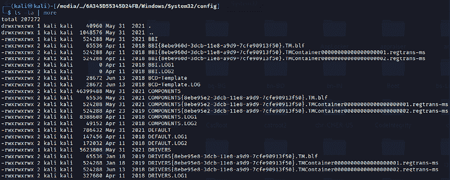
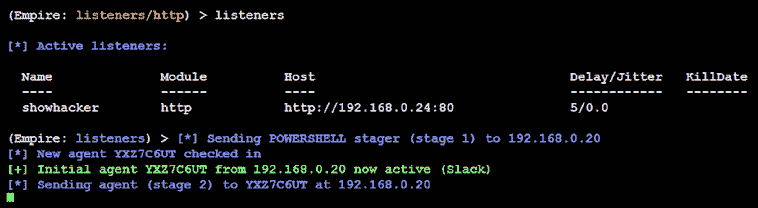
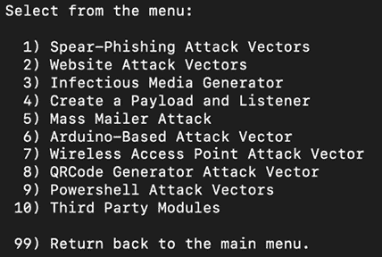
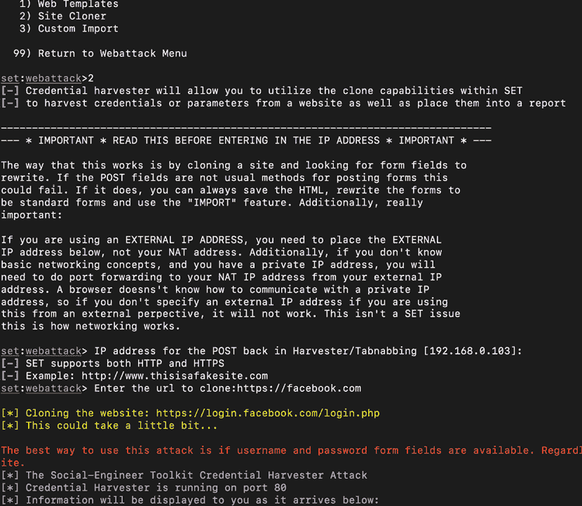

# 第五章：高级社会工程学和物理安全

社会工程学是一种通过与人类互动来操纵他们，从而获取信息或执行恶意活动的方法。它是最有效的攻击手段，已经使许多大型组织陷入安全事件之中。攻击者可以通过利用人类心理来选择单一或多种方式针对个人，这样可以有效地欺骗人类，让他们为攻击者提供对系统的物理访问权限。它是红队演练、渗透测试或实际攻击中使用的最成功的攻击途径。社会工程学攻击的成功依赖于两个关键因素：

1.  在侦察阶段获得的知识。攻击者必须知道与目标相关的名称和用户名；更重要的是，攻击者必须了解网络中用户的关注点。

1.  了解如何运用这些知识来说服潜在目标启动攻击，通过冒充权威与他们通话，询问他们的信息，鼓励他们点击链接或执行程序。近年来，以下两种战术最为成功：

    +   如果目标公司最近刚刚完成年终评估，那么公司中的每个员工都会非常关注从人力资源部门收到更新后的薪资包。因此，与该主题相关的电子邮件或文档很可能会被目标个人打开。

    +   如果目标公司收购或合并了另一家公司，则社交工程学攻击的类型将是鲸吞攻击，目标是 C 级管理人员以及两家公司中的其他高管。此类攻击的主要原理是，用户拥有的特权越多，攻击者可以获得的访问权限也就越多。

Kali Linux 提供了多个工具和框架，如果将社会工程学作为前提来影响受害者打开文件或执行特定操作，这些工具和框架的成功几率会大大提高。例如，Metasploit 框架创建的基于文件的可执行文件，以及使用无文件技术的 PowerShell 脚本（如 Empire 3）。

在本章中，我们将探讨一些**战术、技术和流程**（**TTPs**），并深入了解如何利用**社会工程学工具包**（也称为**SET**和**SEToolkit**）以及**Gophish**。使用这些工具的技术将作为运用社会工程学从其他工具中部署攻击的模型。

到本章结束时，您将学习以下概念和方法：

+   攻击者可能采取的不同社会工程学攻击方法

+   如何在控制台执行物理攻击

+   使用微控制器和 USB 创建伪造物理设备

+   通过凭证收割者攻击收集用户名和密码

+   启动 Tabnabbing 和 Web Jacking 攻击

+   使用多重攻击 Web 方法

+   使用 PowerShell 的字母数字 Shellcode 注入攻击

+   如何在 Kali Linux 上设置 Gophish

+   发起电子邮件钓鱼活动

为支持 SET 的社会工程学攻击，以下一般实施实践也将被描述：

+   隐藏恶意可执行文件并混淆攻击者的 URL

+   通过 DNS 重定向升级攻击

+   通过 USB 获取系统和网络的访问权限

# 命令方法学和 TTPs

作为支持网络杀伤链方法论的攻击路径，社会工程学专注于利用人的信任和天生的帮助意识来欺骗和操纵他们，从而破坏网络及其资源。

*图 5.1*展示了攻击者可以采取的不同攻击方法，以收集信息和/或获取访问权限。


图 5.1：不同类型的社会工程学策略

从本书的前几版中，我们现在已将社会工程学策略重新分类为两大类：一类涉及技术，另一类包括针对人的特定技术。以下章节将简要介绍这两类；之后我们将探讨基于计算机的攻击，特别是使用 Kali Linux 进行的物理攻击和电子邮件钓鱼攻击。

## 技术

随着技术从传统 PC 到笔记本电脑和手机的演变，社会工程学技术也在不断发展。本节将讨论可以使用 Kali Linux 进行的基于计算机和移动设备的攻击。

### 基于计算机的

利用计算机进行社会工程学攻击可以细分为以下几种类型。所有这些攻击都最好在最大化利用所有被动和主动侦察信息的基础上进行：

+   **电子邮件钓鱼**：利用电子邮件媒介收集信息或利用受害者系统中已知软件漏洞的攻击称为电子邮件钓鱼。

+   **诱饵/交换条件**：这是一种通过利用 USB 闪存盘和光盘来嵌入已知漏洞并创建后门的技术。诱饵更侧重于通过使用物理媒介来利用人类的好奇心。攻击者可以创建一个特洛伊木马，借助自动运行功能或用户点击打开驱动器内的文件时，提供对系统的后门访问。交换条件与诱饵类似，但在这种情况下，受害者会为特洛伊木马提供某些东西作为交换。

+   **Wi-Fi 钓鱼**：渗透测试人员可以利用此技术通过设置一个与目标公司相似的虚假 Wi-Fi 网络来收集用户名和密码。例如，攻击者可以通过将其 Wi-Fi 的 SSID 设置为与公司相同（或相似）来瞄准目标公司，从而允许用户无需密码即可连接到虚假的无线路由器。我们将在*第六章*，*无线和蓝牙攻击*中深入探讨这些攻击。

### 基于移动设备

基于移动设备的攻击已成为一种轻松获取机密信息或尝试收集其他重要细节的方法，这些细节可能有助于渗透测试或**红队演练**（**RTE**）的目标。我们将讨论攻击者常用的两种基于移动设备的攻击：

+   **短信钓鱼**：攻击者通过**短消息服务**（**SMS**）执行钓鱼攻击，发送包含链接的短信或草拟一条允许用户点击链接或回复文本的消息。渗透测试人员还可以利用公开提供的服务，例如[`www.spoofmytextmessage.com/free`](https://www.spoofmytextmessage.com/free)。

+   **快速响应码**（**QR 码**）**：** 在红队演练中，二维码也是将有效负载传递到隔离区域的最有效方式。类似于垃圾邮件，包含中奖奖励信息或最新消息（如免费新冠疫苗注册）的二维码可以打印出来，并张贴在人们常去的地方，例如餐厅、吸烟区、厕所和其他繁忙区域。

## 基于人群

基于人群的攻击是红队演练或渗透测试中最有效的攻击类型。这些攻击集中在特定情况下人们的行为。以下部分解释了通过专注于人们的弱点以及利用这些弱点的不同策略来执行的不同类型的攻击。

### 物理攻击

物理攻击通常涉及攻击者的实际存在，攻击者随后执行社交工程攻击。以下是进行**红队演练**或渗透测试时常见的两种物理攻击类型：

+   **冒充或伪装**：这包括测试者编写脚本并冒充重要人物，以从目标员工群体中获取信息。我们最近进行了一次社会工程攻击，目的是通过一次物理社会工程演练，识别域用户的用户名和密码。场景设定为攻击者与受害者对话，并冒充内部 IT 帮助台，“亲爱的 X 先生，我是来自内部 IT 部门的 Y 先生。我们注意到您的系统已经与网络断开连接 20 天。由于最近发生的勒索病毒攻击，建议您安装最新的系统更新。您能提供您的笔记本电脑以及用户名和密码吗？”这导致用户提供了登录详情，并且作为奖励，将笔记本电脑交给了攻击者。攻击者的下一步是将后门程序植入系统，以保持持续访问。

+   **控制台攻击**：这些攻击包括所有涉及物理访问系统的攻击，例如更改管理员用户的密码、植入键盘记录器、提取存储的浏览器密码或安装后门程序。

### 基于语音的

任何通过语音信息欺骗用户在计算机上执行操作或泄露敏感信息的攻击，都被称为基于语音的社会工程攻击。

**电话欺诈**（vishing）是利用录音语音信息或个人直接拨打电话给受害人，以从目标受害人或受害人群体中提取信息的艺术。通常，电话欺诈会涉及可信的脚本，例如，如果*公司 X*宣布与*公司 Y*建立新的合资企业，员工会对两家公司未来的发展感到好奇。这使得攻击者可以直接拨打电话，使用预先定义的脚本，如下所示：

> “您好，我是来自公司 Y 的 X 先生。我们现在已经宣布参与了一个合资企业，因此从技术上讲，我们都在同一个团队中。您能告诉我您的数据中心在哪里吗，并提供一份关键任务服务器的清单吗？如果您不是合适的人选，能否指引我找对人？非常感谢，X 先生。”

精心设计的电话欺诈（vishing）可以使攻击者不仅获得机密信息，还能保持隐蔽，避免引起不必要的注意。接下来我们讨论一个重要的攻击方法——获取物理设备的访问权限。

# 控制台的物理攻击

在本节中，我们将探讨在可以进行物理访问的系统上通常执行的不同类型攻击。

## samdump2 和 chntpw

最常用的密码哈希转储方法之一是利用`samdump2`。这可以通过打开已获取系统的电源，然后通过我们的 Kali USB 启动它，方法是在 BIOS 中进行必要的更改（比如在联想电脑上，可以按*F12*键进入启动菜单并选择 USB）来完成：

1.  一旦通过 Kali 启动系统，默认情况下本地硬盘必须作为媒体驱动器挂载（假设媒体驱动器没有被 BitLocker 或类似的加密保护），如 *图 5.2* 所示：

    图 5.2：Kali Linux 上的所有挂载磁盘

1.  如果默认没有挂载驱动器，攻击者可以通过运行以下命令手动挂载驱动器：

    ```
    mkdir /mnt/target1
    mount /dev/sda2 /mnt/target1 
    ```

1.  系统挂载后，导航到挂载的文件夹（在我们的例子中为 `/media/root/<ID>/Windows/System32/Config`），并运行 `samdump2 SYSTEM SAM`，如 *图 5.3* 所示。`SYSTEM` 和 `SAM` 文件应显示系统驱动器上的所有用户及其密码哈希，随后可使用 `John`（John the Ripper）或 `hashcat` 工具离线破解密码。

    图 5.3：使用 samdump2 输出的密码哈希

    使用相同的访问权限，攻击者还可以从系统中删除用户密码。`chntpw` 是一个 Kali Linux 工具，可用于编辑 Windows 注册表、重置用户密码、将用户提升为管理员，并提供其他一些有用的选项。使用 `chntpw` 是重置 Windows 密码或在密码未知的情况下访问 Windows 计算机的好方法。

    `chntpw` 是一个工具，用于查看信息并更改 Windows NT/2000、XP、Vista、7、8.1、10 以及其他 Windows 服务器的用户密码，支持通过外部驱动器启动设备。

1.  SAM 用户数据库文件通常位于 Windows 文件系统的 `\WINDOWS\system32\config\SAM`。导航到文件夹，如 *图 5.4* 所示：

    图 5.4：来自 Windows system32 config 文件夹的所有文件

1.  运行 `chntpw SAM`；密码存储在 Windows 中的 `SAM` 文件中。**安全账户管理器** (**SAM**) 是 Windows XP、Windows Vista 和 Windows 7 中的一个数据库文件，存储用户的密码。

SAM 文件可以用于验证本地和远程用户。通常，`SAM` 文件位于 `C/Windows/system32/config/SAM`：

1.  在 Kali Linux 终端中输入 `chntpw -i SAM`，路径为 `/media/root/<ID>/Windows/System32/Config`

1.  选择 `1 – 编辑用户数据和密码`

1.  输入用户的 `RID`，在此例中为 `03ef`，如 *图 5.5* 所示：

    图 5.5：使用 chntpw 编辑 SAM 文件的交互式终端

选择 `1 – 清除（空白）用户密码`，然后输入 `q` 完成任务。输入 `y` 进行 `写入 hive` `文件`。最后，你应该能够得到类似于 `<SAM> - OK` 的确认信息。*图 5.6* 显示了编辑后的 SAM 文件内容：


图 5.6：最终的 SAM 文件编辑确认，表明我们的密码已设置为空

在 Windows 10 中，系统重启后会包含 `hyberfile.sys` 文件，这会阻止攻击者挂载系统驱动器。要挂载系统驱动器并访问该驱动器，可以使用 `mount -t ntfs-3g -ro remove_hiberfile /dev/sda2 /mnt/folder`。请注意，某些具有端点加密工具（如 BitLocker 或任何其他供应商工具）的系统，在删除此文件后可能无法启动。

其他绕过工具包括 Kon-boot，它是另一种取证工具，利用类似于 `chntpw` 的功能。Kon-boot 仅影响管理员账户，不会移除管理员的密码；它只让你在不输入密码的情况下登录，在下次正常系统重启时，原始的管理员密码仍然 intact。

该工具可以从此网站下载：[`www.piotrbania.com/all/kon-boot/`](https://www.piotrbania.com/all/kon-boot/)。

## Sticky Keys

在本节中，我们将探讨如何利用物理访问 Windows 计算机的控制台（该计算机解锁或没有密码）。攻击者可以利用微软 Windows Sticky Keys 特性在几秒钟内植入后门；然而，前提是你需要管理员权限才能放置可执行文件。但当系统通过 Kali Linux 启动时，攻击者可以不受任何限制地放置文件。

以下是攻击者可以利用的 Windows 工具列表，这些工具可以将实用程序可执行文件替换为 `cmd.exe` 或 `powershell.exe`：

+   `sethc.exe`

+   `utilman.exe`

+   `osk.exe`

+   `narrator.exe`

+   `magnify.exe`

+   `displayswitch.exe`

以下是将 `sethc.exe` 替换为 `cmd.exe` 的步骤：

```
cd /media/root/<ID>/Windows/System32/
cp cmd.exe /home/kali/Desktop
mv /home/kali/Desktop/cmd.exe /home/kali/Desktop/sethc.exe
rm sethc.exe
mv /home/kali/Desktop/sethc.exe . 
```

*图 5.7* 显示了 `cmd.exe` 的后门，当我们按下 *Shift* 键五次以调用 `sethc.exe` 时，命令提示符会出现，因为我们将 `cmd.exe` 替换为 `sethc.exe`。


图 5.7：显示 `Sticky Keys`（sethc.exe）后门运行命令提示符（cmd.exe）

我们已经探讨了如何清除 Windows 10 本地用户的密码，并通过合法的 Windows 程序设置后门。

# 创建一个伪造的物理设备

Kali 还可以帮助进行入侵者直接物理访问系统和网络的攻击。这种攻击可能具有风险，因为入侵者可能会被细心的人发现或被监控设备拍到。然而，回报可能非常可观，因为入侵者可以入侵包含重要数据的特定系统。

物理访问通常是社会工程学的直接结果，尤其是在使用冒充时。常见的冒充包括以下几种：

+   一个自称是帮助台或 IT 支持人员的人，声称只是需要快速通过安装系统升级来中断受害者。

+   一名供应商拜访客户，然后借口与别人交谈或去卫生间。

+   送货员送包裹。攻击者可以在网上购买送货制服；然而，由于大多数人认为穿着全身棕色制服并推着装满箱子的手推车的人是 UPS 的送货员，因此制服在社会工程中往往不是必需的！

+   穿着工装、手里拿着打印出来的工作单的工人通常会被允许进入配线间和其他区域，特别是当他们声称是根据楼宇经理的要求前来时。

+   穿上昂贵的西装，拿着文件夹，走路迅速；员工们会认为你是个不为人知的经理。在进行这种渗透测试时，我们通常会告诉别人我们是审计员，而且我们的检查很少受到质疑。

敌对物理访问的目标是迅速破坏选定的系统；这通常是通过在目标上安装后门或类似设备来实现的。一种经典的攻击方式是将一个 USB 键（形式为键盘/鼠标）插入系统，并让系统通过自动播放选项安装它；然而，许多组织会在整个网络中禁用自动播放功能。

攻击者还可以设置诱饵陷阱：携带含有文件的移动设备，文件名吸引人点击并查看内容。以下是一些例子：

+   带有“员工薪资”、“医疗保险更新”或“Covid-19 退出策略”等标签的 USB 驱动器。

+   Metasploit 允许攻击者将有效载荷（如反向 Shell）绑定到可执行文件（如屏幕保护程序）上。攻击者可以使用公开可用的公司图片创建屏幕保护程序，并将带有新屏幕保护程序的 USB 寄给员工。当用户安装该程序时，后门也被安装，并连接到攻击者的服务器。

+   如果你知道员工最近参加了某个会议，攻击者可以冒充出席的供应商，并向目标发送一封信，暗示这是供应商展会的后续。典型的消息内容是，*“如果你错过了我们的产品演示和一年的免费试用，请通过点击 start.exe 查看附带的 USB 中的幻灯片。”*

## 微型计算机或基于 USB 的攻击代理

我们注意到在 RTE/渗透测试中使用微型计算机和基于 USB 的设备的显著增加。这些设备由于其紧凑性而被广泛使用；它们可以隐藏在网络的任何地方，并且几乎能运行任何一台完整的笔记本电脑能运行的程序。在本节中，我们将探讨最常用的设备——树莓派和 MalDuino USB。

### 树莓派

树莓派是一款微型计算机，尺寸约为 8.5 厘米×5.5 厘米，但它却集成了 2-8GB 的 RAM、两个 USB 2.0 或两个 USB 3.0 端口以及一个由 Broadcom 芯片支持的以太网端口，采用 1.5GHz 的 64 位四核 CPU，并支持 Wi-Fi 和蓝牙。它没有硬盘，而是使用 SD 卡进行数据存储。如*图 5.8*所示，树莓派几乎是口袋大小；它很容易隐藏在网络中（例如放置在工作站或服务器后面，置于服务器机柜内，或者隐藏在数据中心的地板板下）。


图 5.8：组装好的树莓派 4 照片

要将树莓派配置为攻击向量，需要以下物品：

+   一块树莓派 Model B，或更新版本

+   一根 HDMI 线

+   一根 micro-USB 线和充电器

+   一根以太网线或迷你无线适配器

+   一张 SD 卡，Class 10，至少 16GB 的容量

总的来说，所有这些设备通常都可以在网上购买，总花费不到 100 美元。以下是将树莓派配置为最新版本的 Kali Linux 的步骤：

1.  要配置树莓派，请从[`www.kali.org/get-kali/#kali-arm`](https://www.kali.org/get-kali/#kali-arm)下载最新版本的 Kali Linux ARM 版。从源压缩包中提取它。如果您正在从基于 Windows 的桌面配置，则可以使用*第一章*中介绍的相同 Rufus 工具来制作启动的 Kali USB 磁盘。

1.  使用卡读器，将 SD 卡连接到基于 Windows 的计算机，并打开 Rufus 工具。选择之前下载并解压的 Kali ARM 版本，`kali-custom-rpi.img`，并将其写入 SD 卡。从 Mac 或 Linux 系统烧录 SD 卡的详细说明可以在 Kali 官网找到：[`www.kali.org/docs/usb/live-usb-install-with-mac/`](https://www.kali.org/docs/usb/live-usb-install-with-mac/)。

1.  将新烧录的 SD 卡插入树莓派，并将以太网线或无线适配器连接到 Windows 工作站，将 HDMI 线连接到显示器，将 micro-USB 电源线连接到电源，键盘和鼠标也连接好。连接电源后，树莓派将直接启动进入 Kali Linux。树莓派依赖外部电源，并且没有独立的开关；但是，Kali Linux 仍然可以通过在终端中运行`halt`命令来关闭。Kali 安装完成后，确保使用`apt update`命令进行更新。

1.  请确保尽快更改 SSH 主机密钥，因为所有树莓派映像都使用相同的密钥。在 Kali Linux 终端中使用以下命令：

    ```
    sudo rm /etc/ssh/ssh_host_*
    sudo dpkg-reconfigure openssh-server
    sudo service ssh restart 
    ```

    同时，确保通过在终端中运行`sudo passwd kali`更改默认的用户名和密码。

1.  配置树莓派定期通过 `cron` 任务连接回攻击者的计算机（使用静态 IP 地址或 DynDNS）。然后，攻击者必须物理访问目标的场所，并将树莓派连接到网络。大多数网络会自动为设备分配 DHCP 地址，并且对这种攻击类型的防御有限。

1.  一旦树莓派连接回攻击者的 IP 地址，攻击者可以远程使用 SSH 发出命令，对受害者的内部网络进行侦察和利用。

如果连接了无线适配器，如 EW-7811Un V2，即 150 Mbps 无线 802.11b/g/n Nano USB 适配器，攻击者可以通过无线连接或使用树莓派发起无线攻击。

### MalDuino：坏 USB

MalDuino 是一个由 Arduino 驱动的 USB 设备，攻击者可以在 RTE/渗透测试活动中使用该设备。该设备具有键盘注入功能，能够在几分之一秒内运行命令。这些设备在拥有组织建筑物物理访问权限的情况下，尤其有用。通常，组织内部的人很少锁定他们的计算机，认为物理访问限制就是安全措施，不会有人动手。即使攻击者物理访问了系统，工作人员也可以辩称“我们没有 USB 政策”；嗯，这是个好理由。但禁用 USB 并不等于禁用基于 USB 的键盘——当攻击者插入 MalDuino 时，它会充当键盘，模拟人类输入命令，并精确执行指定的有效载荷。

MalDuino 有两个版本：Elite 和 Lite。区别在于，Elite 提供了一个 SD 卡选项，可以在设备上的硬件开关下加载大约 16 个不同的有效载荷，这样你就不需要重新配置整个设备。使用 MalDuino Lite，每次更改有效载荷时都需要重新配置设备。

该板支持 Ducky Script 模板，使得创建自定义脚本变得容易。*图 5.9* 展示了 MalDuino Elite 硬件：


图 5.9：MalDuino 作为 USB 设备

设置板子的说明可以在 [`malduino.com/wiki/doku.php?id=setup:elite`](https://malduino.com/wiki/doku.php?id=setup:elite) 找到。

我们将专注于通过以下步骤为板子设置 Empire PowerShell 脚本：

1.  在 Empire 中生成 PowerShell 有效载荷（参见*第十章*，*利用*）。

1.  确保监听器已经启动并在监听任何连接。

1.  将 PowerShell 启动器转换成字符串；由于 MalDuino 的缓冲区大小为 256 字节，因此有效载荷必须被分割。这可以通过访问 [`malduino.com/converter/`](https://malduino.com/converter/) 来实现。

1.  一旦字符串转换完成，它应该像*图 5.10*中所示那样：

    图 5.10：组织字符串以匹配每行 254 字符的限制

1.  下一步是将有效载荷构建成脚本，如*图 5.11*所示：

    图 5.11：将有效载荷加载到 MalDuino 中

1.  最后的操作是将设备插入受害者的机器；此时，你应该能够看到代理回报，如*图 5.12*所示：

    图 5.12：MalDuino 成功连接到我们的 Empire 监听器

我们已经学会如何利用专为 MalDuino USB 设计的设备来启动反向 Shell 连接到攻击者。攻击者还可以利用另一种场景，即将这些设备投放到目标地点，例如自助餐厅，甚至将其快递给公司 CEO 的私人助理，并附上一封来自法院或监管机构的高警报信息；受害者的好奇心或恐惧心理完成了攻击者的任务。

# 社会工程工具包 (SET)

SET 由 David Kennedy（`@ReL1K`）创建和编写，他是 trustedsec 的创始人，并由一个活跃的协作小组维护（`www.social-engineer.org`）。它是一个开源的、基于 Python 的框架，专门设计用于便于社会工程攻击。

该工具的设计目标是通过培训实现安全性。SET 的一个重要优势是它与 Metasploit 框架的互联性，Metasploit 提供了所需的有效载荷、绕过杀毒软件的加密技术以及连接到受损系统的监听模块，当它发送 Shell 回到攻击者时。

在 Kali 发行版中打开 SET，进入`Applications | Social Engineering Tools | social engineering toolkit`，或在 Shell 提示符下输入`sudo setoolkit`。你将看到如*图 5.13*所示的主菜单：


图 5.13：SET 启动屏幕

如果选择`1) 社会工程攻击`，将会出现如下子菜单，如*图 5.14*所示：



图 5.14：社会工程攻击主菜单

攻击菜单选项如下：

1.  **鱼叉式钓鱼攻击向量**：此模块允许攻击者创建电子邮件消息和模板，并将其与附加的漏洞一起发送到目标受害者。

1.  **网站攻击向量**：这是一个综合模式，允许攻击者利用多个子模块进行各种网站攻击——我们将在接下来的章节中探索一些模块。

1.  **感染性媒体生成器**：该选项会创建一个`autorun.inf`文件和 Metasploit 有效载荷。一旦烧录或复制到 USB 设备或物理媒体（如 CD 或 DVD），并插入目标系统，它将触发自动运行（如果启用了自动运行）并破坏系统。

1.  **创建有效载荷和监听器**：此模块是一个快速的菜单驱动方式来创建 Metasploit 有效载荷。攻击者必须使用另一个社会工程攻击说服目标启动它。

1.  **群发邮件攻击**：能够使用 `Sendmail` 发送群发邮件并伪造发件人身份。

1.  **基于 Arduino 的攻击向量**：这通过编程 Arduino 设备，如 Teensy（[`www.pjrc.com/teensy/`](https://www.pjrc.com/teensy/)）。因为这些设备在连接到物理 Windows 系统时会注册为 USB 键盘，所以它们能够绕过基于禁用自动运行或其他终端保护的安全措施。

1.  **无线接入点攻击向量**：这将在攻击者的系统上创建一个伪造的无线接入点和 DHCP 服务器，并将所有 DNS 查询重定向到攻击者。攻击者随后可以发起各种攻击，例如 Java 小程序或凭证收集器攻击。

1.  **二维码生成器攻击向量**：这会创建一个与攻击相关联的二维码，二维码中包含一个指定的 URL。

1.  **PowerShell 攻击向量**：这允许攻击者创建依赖于 PowerShell 的攻击，PowerShell 是一种命令行外壳和脚本语言，在 Vista 及以后版本的 Windows 中可用。

1.  **第三方模块**：这允许攻击者使用 **远程管理工具 Tommy 版** (**RATTE**) 和 Zonksec 提供的 Google Analytics 攻击。RATTE 是 Java 小程序攻击的一部分，它是一个基于文本菜单的远程访问工具，可以作为独立的载荷使用。

SET 还提供了 **快速渗透测试** 的菜单项，快速访问一些支持 SQL 数据库暴力破解和密码破解的专用工具，以及基于 Python 的一些自定义漏洞利用工具，SCCM 攻击向量，Dell 计算机 DRAC/机箱利用，用户枚举和 PsExec PowerShell 注入。

菜单还提供了更新 SET 和更新配置的选项。然而，这些额外的选项应避免使用，因为 Kali 不完全支持它们，可能会与依赖关系产生冲突。

## 社会工程攻击

社会工程工具包的最新版本已移除了伪造短信和全屏攻击模块。以下是社会工程攻击的简要说明。

`鱼叉式钓鱼攻击向量` 允许攻击者创建邮件并将其发送给目标受害者，附带漏洞利用代码。`网站攻击向量` 利用多种基于网络的攻击方式，包括以下几种：

1.  **Java 小程序攻击方法**：这会伪造 Java 证书并传递基于 Metasploit 的载荷。这是最成功的攻击之一，能有效攻击 Windows、Linux 和 macOS 目标。

1.  **Metasploit 浏览器漏洞攻击方法**：这通过 iFrame 攻击传递 Metasploit 载荷。

1.  **凭证收集器攻击方法**：这会克隆一个网站，并自动重写 `POST` 参数，允许攻击者拦截并收集用户凭证；收集完成后，它会将受害者重定向回原始网站。

1.  **Tabnabbing 攻击方法**：这会将一个不活动的浏览器标签页上的信息替换为一个克隆页面，该页面链接回攻击者。当受害者登录时，凭证会被发送给攻击者。

1.  **Web 劫持攻击方法**：该方法利用 iFrame 替换，使突出显示的 URL 链接看起来是合法的；然而，当点击该链接时，会弹出一个窗口，并且合法的链接会被恶意链接替换。

1.  **多重攻击网络方法**：这允许攻击者选择一次发起的多个攻击中的一部分或全部，包括以下内容：

    +   Java 小应用攻击方法

    +   Metasploit 浏览器漏洞利用方法

    +   凭证收集攻击方法

    +   Tabnabbing 攻击方法

    +   Web 劫持攻击方法

1.  **HTA 攻击方法**：这是一种攻击者展示一个伪造网站，自动下载 `.HTA` 格式的 HTML 应用程序。

作为 SET 强大功能的初步示例，我们将看到它如何被用来获得远程 Shell：即从被攻击系统到攻击者系统的连接。

执行 Tabnabbing 攻击的测试人员可能会遇到以下错误信息：`[!] 出现问题，打印错误：模块 'urllib' 没有属性 'urlopen'`。这是当前版本的已知问题。然而，可以选择多重攻击网络方法，然后执行 Tabnabbing 攻击。

## 凭证收集器 Web 攻击方法

凭证（通常是用户名和密码）使得一个人可以访问网络、计算系统以及更广泛的数据。攻击者可以通过间接方式使用这些信息（例如，登录受害者的 Gmail 账户并发送电子邮件来推动攻击，针对受害者的信任关系），或直接攻击用户账户。由于凭证广泛重用，这种攻击尤其具有相关性；用户通常会在多个地方重复使用相同的密码。

特别重要的是拥有特权访问权限的人的凭证，例如系统管理员或数据库管理员的凭证，这可以让攻击者访问多个账户和数据存储库。

SET 的凭证收集攻击使用克隆站点来收集凭证。要启动此攻击，从主菜单选择 `2) 网站攻击向量`，然后选择 `3) 凭证收集攻击方法`，再选择 `2) 网站克隆`。

在这个示例中，我们将按照菜单选择克隆一个网站，如 Facebook，如 *图 5.15* 所示：



图 5.15：使用凭证收集器克隆 Facebook 到我们的 Kali Linux 系统

再次提醒，攻击者的 IP 地址必须发送到目标。当目标点击链接或输入 IP 地址时，他们将看到一个克隆页面，类似于 Facebook 的常规登录页面，如 *图 5.16* 所示，并会被提示输入用户名和密码：


图 5.16：在我们的本地 Kali Linux 上托管 facebook.com

完成后，用户将被重定向到常规的 Facebook 站点，在那里他们将登录自己的账户。在后台，他们的访问凭证将被收集并转发给攻击者。攻击者将看到如下记录，如*图 5.17*所示：


图 5.17：成功捕获我们托管的本地 facebook.com 的用户名和密码字段

当攻击者完成凭证收集后，按下*Ctrl* + *C*会在`/SET/reports`目录下生成两个报告，格式分别为 XML 和 HTML。

请注意，URL 栏中的地址并不是有效的 Facebook 地址；大多数用户如果看到该地址会意识到有问题。成功的攻击需要攻击者为受害者准备一个合适的借口或故事，让受害者接受这个不寻常的 URL。例如，向一个非技术性的管理层目标群体发送电子邮件，通知他们现在由 IT 托管的本地 Facebook 站点可以减少邮件系统的延迟。

凭证收集攻击是评估公司网络安全的一个优秀工具。为了有效实施，该组织首先需要培训所有员工，教他们如何识别并应对钓鱼攻击。大约两周后，发送一封包含一些明显错误（如错误的公司 CEO 名字或包含错误地址的地址块）和一个能够收集凭证的程序链接的公司内部邮件。计算响应凭证的收件人百分比，并根据结果调整培训计划，以减少这个百分比。

## 多重攻击网络攻击方法

网站攻击向量的 Hail Mary 攻击是一种多重攻击网络方法，允许攻击者同时实施几种不同的攻击，前提是他们选择这样做。默认情况下，所有攻击都是禁用的，攻击者可以选择对目标执行哪些攻击。要启动此攻击，请从主菜单选择`2) 网站攻击向量`，然后选择`6) 多重攻击网络方法`，接着选择`2) 网站克隆`，如*图 5.18*所示：


图 5.18：多重攻击网络攻击向量菜单

你可以选择`6\. 使用所有攻击 – 即“战术核弹”`，或者输入你想要执行的攻击类型的数字；例如，对于`Web Jacking 攻击方法`，请输入`5`。

如果你不确定哪些攻击对目标组织有效，这是一种有效的选项；选择一名员工，确定成功的攻击类型，然后将其重复用于其他员工。

## HTA 网络攻击方法

这种类型的攻击是一个简单的 HTML 应用程序，可以为远程攻击者提供完全访问权限。HTA 文件的常见扩展名是 `.hta`。HTA 被视为与 `.exe` 扩展名的可执行文件一样。当通过 `mshta.exe` 执行时（或双击文件图标时），它会立即运行。当通过浏览器远程执行时，用户会在 HTA 下载之前被询问是否保存并运行该应用程序；如果保存，之后可以按需运行该程序。

攻击者可以使用 Web 技术为 Windows 创建恶意应用程序。要使用社会工程工具包发起 HTA 攻击，从主菜单选择 `1) 社会工程攻击`。然后，从下一个菜单选择 `2) 网站攻击向量`，再选择 `7) HTA 攻击方法`，最后选择 `2) 网站克隆器` 来克隆任意网站。在本例中，我们将克隆 `facebook.com`，如*图 5.19*所示：


图 5.19：通过克隆 facebook.com 成功设置 HTA 网络攻击

攻击者现在将向受害者用户发送伪造的 `facebook.com` 网站，以进行信息钓鱼；*图 5.20* 展示了受害者将看到的内容：


图 5.20：受害者的屏幕，在 HTA 负载传送到终端时弹出

如果受害者用户在系统上本地运行 HTA 文件，Internet Explorer 安全性将弹出一个额外的对话框，建立与攻击者的反向连接，如*图 5.21*所示。SET 应该会自动设置 Metasploit 的监听器：


图 5.21：成功执行负载，导致 Metasploit 反向 Shell 连接受害者

## 使用 PowerShell 字母数字 Shellcode 注入攻击

SET 还结合了基于 PowerShell 的更有效攻击方法，这些方法在 Microsoft Windows Vista 发布后，适用于所有 Microsoft 操作系统。由于 PowerShell shellcode 可以轻松地注入目标的物理内存，通过这种方式发起的攻击不会触发杀毒软件警报。

要使用 SET 发起 PowerShell 注入攻击，从主菜单选择 `1) 社会工程攻击`。然后从下一个菜单选择 `9) PowerShell 攻击向量`。这将给攻击者提供四种攻击类型的选择；对于本示例，选择 `1` 来调用 PowerShell 字母数字 shellcode 注入器。这将设置攻击参数，并提示攻击者输入负载监听器的 IP 地址，这通常是攻击者的 IP 地址。输入完成后，程序将创建利用代码并启动本地监听器。

启动攻击的 PowerShell Shellcode 存储在 `/root/.set/reports/ powershell/x86_powershell_injection.txt` 中。攻击的社会工程学部分发生在攻击者说服目标受害者将 `x86_powershell_injection.txt` 的内容复制到 PowerShell 提示符中，如*图 5.22*所示，并执行代码：

图 5.22：/root/.set/reports/powershell 文件夹中的 PowerShell 载荷

如*图 5.23*所示，Shellcode 的执行没有触发目标系统的杀毒警报。相反，当代码被执行时，它在攻击系统上打开了一个 Meterpreter 会话，并允许攻击者与远程系统建立交互式 Shell：


图 5.23：确认 Metasploit 反向 Shell 从受害者到我们的 SET 监听器

一旦获得远程系统的访问权限，攻击者应创建一个后门，关于这一点，我们将在*第十三章*《命令与控制》中深入探讨。我们现在已经探索了攻击者在使用 SET 进行社会工程学攻击时可以使用的重要技术。

# 隐藏可执行文件并混淆攻击者的 URL

如前面示例所示，成功发起社会工程学攻击有两个关键。第一个是获取使其有效所需的信息：用户名、业务信息以及有关网络、系统和应用程序的支持细节。然而，大部分的精力集中在第二个方面：精心设计攻击以诱使目标打开可执行文件或点击链接。

一些攻击生成的模块需要受害者执行它们才能使攻击成功。不幸的是，用户对执行未知软件的警觉性越来越高。然而，有一些方法可以增加攻击执行成功的可能性，包括以下几种：

+   从受害者已知并信任的系统发起攻击，或伪造攻击的来源。如果攻击看起来来自帮助台或 IT 支持，并声称是紧急软件更新，那么它很可能会被执行：

    +   将可执行文件重命名为类似于受信任软件的名称，例如 `Java Update`。

    +   将恶意载荷嵌入到一个无害的文件中，例如 PDF 文件，通过一种攻击方式，如 Metasploit 的 `adobe_pdf_embedded_exe_nojs` 攻击。

    +   可执行文件也可以与 Microsoft Office 文件、MSI 安装文件或配置为在桌面上静默运行的 BAT 文件捆绑在一起。

    +   让用户点击下载恶意可执行文件的链接。

+   由于 SET 使用攻击者的 URL 作为攻击的目标，成功的关键因素之一是确保攻击者的 URL 对受害者来说是可信的。为此，攻击者使用了几种技术，包括以下几种：

    +   使用像[`goo.gl/`](https://goo.gl/)或[tinyurl.com](http://tinyurl.com)这样的服务来缩短网址。这些缩短的 URL 在社交媒体平台上很常见，例如 Twitter，受害者在点击这些链接时通常不会采取任何预防措施。

    +   在社交媒体网站上输入链接，例如 Facebook 或 LinkedIn；该网站会生成一个自己的链接来替代你的链接，并显示目标页面的图片。然后，删除你输入的链接，留下新的社交媒体链接。

    +   在 LinkedIn 或 Facebook 上创建一个虚假网页；作为攻击者，你控制内容，可以创造一个引人入胜的故事，促使成员点击链接或下载可执行文件。一个执行得当的页面不仅会针对员工，还会瞄准供应商、合作伙伴及其客户，从而最大化社会工程学攻击的成功率。

# 使用 DNS 重定向升级攻击

如果攻击者或渗透测试员已经入侵了内部网络中的某个主机，他们可以通过 DNS 重定向来升级攻击。这通常被认为是一种水平攻击（它妥协的是大致相同访问权限的人）；然而，如果捕获了特权人员的凭证，它也可能向上升级。 在本例中，我们将使用 bettercap（将在*第十一章*中更详细地探讨，*行动目标与横向移动*）作为嗅探器、拦截器和交换式 LAN 的日志记录工具。它便于实施中间人攻击，但我们将利用它发起 DNS 重定向攻击，将用户引导至用于社会工程学攻击的网站。

要启动攻击，我们需要安装 bettercap，而最新版本的 Kali 中默认未安装此工具。可以通过运行`sudo apt install bettercap`来完成安装。安装完成后，我们应该能够激活所需的任何模块；例如，我们现在通过创建一个名为`dns.conf`的文件，其中包含 IP 和域名详细信息，来尝试在目标上使用 DNS 欺骗攻击模块，如*图 5.24*所示。这样，网络上所有发送到`microsoft.com`的请求将被转发到攻击者的 IP 地址，在此示例中为`192.168.0.103`。

我们可以通过在 Kali Linux 上启动默认的 Apache 服务器来运行该攻击，首先通过运行`sudo systemctl start apache2.service`来启动服务，接着通过在终端输入`sudo bettercap`来运行 bettercap，加载我们的 DNS 配置文件`set dns.spoof.hosts dns.conf`，然后通过运行`dns.spoof on`来开启 DNS 欺骗：


图 5.24：配置 bettercap 以嗅探网络

为确保网络上的所有目标首先准备就绪，测试人员需要通过在 bettercap 终端输入`net.sniff on`和`arp.spoof on`来启用网络嗅探和 ARP 欺骗模块。成功的 DNS 重定向将在 bettercap 终端中被捕获，如*图 5.25*所示：


图 5.25：成功将 DNS 重定向 Microsoft.com 到攻击者的 IP

当网络上的受害者访问`microsoft.com`时，他们将被重定向到托管在攻击者 IP 上的 Apache 服务。攻击者可以选择克隆`microsoft.com`并将其托管在他们的 Apache 服务器上。在内部基础设施中，这种攻击更为成功，因为没有额外的 DNS 安全保护。大多数公司在其外部基础设施上有 DNS 保护，例如 Cloudflare、AWS Shield 和 Akamai。

## 网络钓鱼攻击

网络钓鱼是一种针对大量受害者的电子邮件欺诈攻击，例如一个已知的美国互联网用户列表。目标通常没有关联，电子邮件也不会试图吸引任何特定个人。

相反，邮件内容包含一些普遍感兴趣的项目（例如，*点击这里接种 COVID-19 疫苗*）和一个恶意链接或附件。攻击者打算通过概率，至少有一部分人会点击附件，从而发起攻击。

另一方面，网络钓鱼是一种高度特定的钓鱼攻击形式；通过以特定方式编写电子邮件消息，攻击者希望吸引特定受众的注意。例如，如果攻击者知道销售部门使用某个特定应用程序来管理客户关系，他们可能会伪造一封电子邮件，假装来自该应用程序的供应商，邮件主题为`紧急修复<应用程序> - 点击链接下载`。

成功发起网络钓鱼攻击的步骤如下：

1.  在发起攻击之前，确保在 Kali 上安装了`sendmail`（`sudo apt-get install sendmail`），并将`set.config`文件中的`SENDMAIL=OFF`更改为`SENDMAIL=ON`，该文件位于`/etc/setoolkit/`。

    如果测试人员收到任何与`broken package exim*`相关的错误信息，应运行`sudo apt-get purge exim4-base exim4-config`，然后运行`sudo apt-get install sendmail`。

1.  要执行攻击，启动 SET，然后从主菜单中选择`Social Engineering Attacks`，再从子菜单中选择`Spear-Phishing Attack Vectors`。这将启动攻击的开始选项，如*图 5.26*所示：

    图 5.26：网络钓鱼主菜单

1.  选择`1`进行大规模电子邮件攻击；然后会展示一系列攻击有效载荷，如*图 5.27*所示：

    图 5.27：网络钓鱼模块中可用的漏洞列表

1.  攻击者可以根据在侦察阶段获得的目标信息选择任何可用的有效载荷。在这个示例中，我们将选择`7) Adobe Flash Player "Button" Remote Code Execution`选项。

    当你选择`7`时，将提示你选择有效载荷，如*图 5.28*所示。我们在这个示例中使用了 Windows Meterpreter 反向 Shell HTTPS：

    

    图 5.28：框架中支持的有效载荷

    一旦从 SET 控制台准备好有效载荷和漏洞利用，攻击者将看到*图 5.29* 中显示的确认信息：

    

    图 5.29：使用 Adobe 漏洞创建 PDF 文件

1.  现在，您可以通过选择选项 `2\. 重命名文件，我想让它看起来很酷` 来重命名文件。

1.  一旦重命名文件，您将有两个选项可以选择：`E-mail Attack Single Email Address` 或 `E-mail Attack Mass Mailer`。

1.  攻击者可以选择使用群发邮件或单独针对较弱的受害者，取决于其偏好。如果使用单个电子邮件地址，SET 会提供进一步的模板供攻击者使用，如*图 5.30*所示：

    图 5.30：为单个电子邮件地址作为目标提供的预定义模板

1.  在选择钓鱼模板后，您将有两个选项可用：使用自己的 Gmail 账户发起攻击（`1`）或使用自己的服务器或开放中继（`2`）。如果使用 Gmail 账户，攻击可能会失败；Gmail 会检查外发邮件中的恶意文件，并且非常有效地识别 SET 和 Metasploit 框架生成的有效载荷。如果必须通过 Gmail 发送有效载荷，可以先使用 Veil 3.1 对其进行编码。

建议使用`sendmail`选项发送可执行文件；它允许伪装邮件来源，使其看起来像是来自可信来源。为了确保邮件的有效性，攻击者应注意以下几点：

+   内容应提供诱因（新服务器将更快，具有更好的防病毒功能）和威胁（您需要进行的更改，才能访问您的电子邮件）。大多数人都会回应直接的行动呼吁，尤其是当它直接影响到他们时。

+   在前面的示例中，附加文档的标题为`template.pdf`。在实际场景中，这个标题应改为`instructions.pdf`。

+   确保拼写和语法正确，邮件的语气应与内容相符。

+   发送电子邮件的个人职称应与内容相符。

+   如果目标组织较小，可能需要伪装成真实个人的名字，并将邮件发送给一个通常不会与该人互动的小群体。

+   包含一个电话号码；这会使邮件看起来更正式，而且可以通过各种方式使用商业语音 IP 解决方案获取带有本地区号的短期电话号码。

一旦攻击邮件发送到目标，成功激活（收件人启动可执行文件）将创建一个反向 Meterpreter 隧道，连接到攻击者的系统。攻击者将能够控制被攻陷的系统。

## 使用 Gophish 进行电子邮件钓鱼攻击

Gophish 是一个完全集成的开源钓鱼框架，同时也提供商业支持。该框架使任何类型的用户都可以快速创建钓鱼活动并在几分钟内部署一个复杂的钓鱼模拟或执行真实攻击。与 SET 不同，Gophish 并未预装在 Kali Linux 中。在本节中，我们将探讨如何设置环境：

1.  通过访问[`github.com/gophish/gophish/releases`](https://github.com/gophish/gophish/releases)，根据系统配置下载合适的版本。在本书中，我们将使用 gophish-v0.11.1 64 位 Linux 版本。

1.  一旦应用程序下载到 Kali Linux，我们将解压缩文件夹并用正确的信息配置`config.json`文件；攻击者可以选择使用任何自定义数据库，如 MySQL、MSSQL 等。我们将使用`sqlite3`；如果测试者希望通过局域网共享相同资源，则必须在`listen_url`中声明明确的 IP 地址，如*图 5.31*所示。它设置为`0.0.0.0`以监听所有以太网适配器。

    默认情况下，它只会暴露给本地主机：

    

    图 5.31：更改 Gophish 配置文件，并将监听 URL 设置为 0.0.0.0:3333

1.  下一步是通过在 Kali Linux 终端运行`chmod +x gophish`来更改文件权限以执行。最后，从同一文件夹中输入`sudo ./gophish`运行应用程序，这应该会在默认的`3333`端口上启动 Gophish Web 应用程序门户，并带有自签名的 SSL 证书。为了避免应用程序使用默认凭证，Gophish 的最新版本会在初始启动脚本中为`admin`用户生成一个临时密码，如*图 5.32*所示：

    图 5.32：Gophish 启动时自动生成的 admin 用户密码

1.  现在，你应该能够通过访问`https://yourIP:3333`来访问应用程序；你应该能够使用用户`admin`和从上一步获取的密码进行登录。这将迫使测试者重置他们的初始密码，如*图 5.33*所示：

    图 5.33：成功登录后，Gophish 强制重置密码的界面，用户为 admin

当使用 Gophish 自签名证书在内部托管时，测试者在浏览器中将收到证书错误。

# 使用 Gophish 发起钓鱼攻击

在启动钓鱼活动之前，需要在 Gophish 中设置一些先决条件。它们可以大致分为几个重要步骤，以确保成功启动活动：

1.  **模板**：模板是网络钓鱼中非常关键的部分；你必须能够根据你的游戏计划创建自己的模板。最常用的模板包括 Office365、Webmail 以及内部 Facebook 和 Gmail 登录页面。一些模板可以在[`github.com/PacktPublishing/Mastering-Kali-Linux-for-Advanced-Penetration-Testing-4E/tree/main/Chapter%2005`](https://github.com/PacktPublishing/Mastering-Kali-Linux-for-Advanced-Penetration-Testing-4E/tree/main/Chapter%2005)找到。

    创建模板的简单步骤如下：在模板部分，点击**新建模板**，在**名称**和**主题**字段中输入详细信息，点击 HTML，复制模板中的原始 HTML 内容，粘贴到编辑器中，然后点击**保存模板**。

1.  **登录页面**：网络钓鱼活动的效果总是与如何通过登录页面将受害者重定向到一个合法网站有关。

    与模板步骤类似，从左侧菜单中导航到登录页面，点击**新建页面**，输入**名称**，然后复制并粘贴模板——你也可以直接导入一个站点。最后，点击**保存页面**。

1.  **发送配置**：配置文件是你存储所有 SMTP 和发件人详细信息的地方；Gophish 允许攻击者定义多个配置文件，并可以使用自定义电子邮件头信息。

    创建配置文件，点击**发送配置**，**新建配置**，并输入**名称**和**接口类型**；默认情况下应该选择**SMTP**。在**发件人**部分输入你选择的电子邮件 ID。**主机**是 SMTP 服务器——攻击者可以选择自己的服务器或使用现有服务，如 AWS。在我们的例子中，我们将使用 `smtp.gmail.com:465` 并输入**用户名**和**密码**。大多数反钓鱼解决方案会基于邮件头信息阻止邮件发送。因此，尝试使用**电子邮件头** `Microsoft Office Outlook XX` 或 `Outlook Express for Macintosh`。如果所有设置正常，可以点击**发送测试邮件**。成功的测试邮件应与*图 5.34*中的示例相似。最后，点击**保存配置**：

    

    图 5.34：Gophish 默认电子邮件

    使用 Gmail 服务的测试人员必须确保开启**低安全性应用访问**，以允许第三方应用使用该服务。这可以通过访问[`myaccount.google.com/lesssecureapps?pli=1`](https://myaccount.google.com/lesssecureapps?pli=1)并开启**允许低安全性应用**来实现。

1.  **用户与组**：上传单个或多个目标受害者的电子邮件 ID 和其名字、姓氏。Gophish 允许测试人员创建组并以 CSV 格式导入。

    从菜单中导航到**用户与组**，点击**新建组**，然后导入一个 CSV 格式的文件，或者手动输入名字、姓氏、电子邮件 ID 和职位。点击**添加**，然后点击**保存更改**。

1.  **账户管理**：单个实例可以启动多个钓鱼活动；因此，个别用户可以拥有自己的门户账户。

1.  **Webhook**：Webhook 只是一个 Web 回调或 HTTP 推送**应用程序编程接口**（**API**）。此选项允许测试人员实现 Webhook，可以将结果直接推送到任何第三方 API。

一旦我们设置好了所有的模板、着陆页面、用户和发送配置文件，我们就可以通过点击菜单中的**Campaigns**来启动活动。然后点击**New Campaign**并输入活动的**名称**。选择**电子邮件模板**、**着陆页面**，并提供将承载钓鱼页面的主机/IP 的**URL**；通常，这将是运行 Gophish 的 Kali Linux IP 地址。选择**启动日期**或安排日期和时间，选择已创建的**发送配置文件**，选择**组**，如*图 5.35*所示，最后点击**Launch Campaign**。我们可以选择钓鱼活动开始的日期和时间以及目标受害者的组。Gophish 还提供了一个选项来测试电子邮件，查看它是被阻止了，还是直接进入目标的收件箱，具体取决于所选模板：


图 5.35：在特定目标上启动电子邮件活动

一旦活动成功启动，受害者应该会收到基于在活动选择过程中所选模板的电子邮件。使用`Microsoft Teams Unread messages`模板的电子邮件将类似于*图 5.36*中所示：


图 5.36：使用 Microsoft Teams Unread 模板的钓鱼电子邮件示例

当目标用户点击电子邮件中的任何链接时，他们将被带到着陆页面，并且会带上由 Gophish 为目标用户生成的唯一 RID 号码。应显示一个示例的 Office 365 着陆页面，如*图 5.37*所示：


图 5.37：当受害者点击链接时，Office 365 着陆页面的示例

同一个着陆页面也可以与 BeEF 框架挂钩，以劫持浏览器并利用用户当前的浏览器会话；然而，我们将在*第七章*，*利用基于 Web 的应用程序*中探讨 BeEF 的详细内容。

最后，测试人员可以追踪每个活动启动后发送、打开、点击和提交的所有电子邮件，如*图 5.38*所示：


图 5.38：Gophish 仪表板

**Email Reported**选项包括那些发现并报告钓鱼邮件为可疑的用户。通常，内部 IT 安全团队成员可以利用这个输出评估用户的网络安全意识。

我们现在已经探讨了如何下载、安装和运行 Gophish，并启动电子邮件钓鱼活动。

# 使用批量传输作为钓鱼手段来传递负载

攻击者还可以利用大容量文件传输软件，如 Smash、Hightail、Terashare、WeTransfer、SendSpace 和 DropSend。假设我们针对了两个人，一个是财务管理员，另一个是 CEO。攻击者可以简单地在这两名受害者之间发送文件，访问其中一个大容量传输网站，如 `sendspace.com`，上传一个恶意文件，同时将发送者设置为 `Financeadmin@targetcompany.com`，将接收者设置为 `ceo@targetcompany.com`。文件上传后，双方将收到包含文件链接的电子邮件；在这种情况下，`ceo@targetcompany.com` 将收到一封邮件，通知文件已成功发送，`Financeadmin@cyberhia.com` 将收到类似的邮件，如*图 5.39*所示：


图 5.39：Sendspace 大容量传输邮件

在大多数情况下，这些大容量传输并不在企业环境的阻止列表中（如果一个被阻止，攻击者可以切换到另一个），因此它们能直接访问内部员工并传递有效信息，且不可检测的有效载荷将提供更高的成功率，而不会暴露攻击者的身份。

# 概述

社会工程学是一种攻击人类的方法，利用人们固有的信任和乐于助人的特点来攻击网络及其设备。在本章中，我们探讨了社会工程学如何被用来促进旨在捕获凭证、激活恶意软件或协助发起进一步攻击的攻击。大多数攻击依赖于 SET 和 Gophish；然而，Kali 还拥有多个其他应用程序，可以通过社会工程学方法加以改进。我们还探讨了如何利用新的大容量传输公司来传播有效载荷，而不必使用任何电子邮件服务来执行钓鱼攻击。我们还研究了如何通过物理访问，通常与社会工程学结合使用，来将恶意设备放置在目标网络中。

在下一章中，我们将研究如何对无线网络进行侦察，并攻击开放网络以及基于 WPA2 加密方案保护的网络。我们还将研究无线和蓝牙协议中的一般弱点，这些弱点使它们容易受到拒绝服务攻击和冒充攻击。
