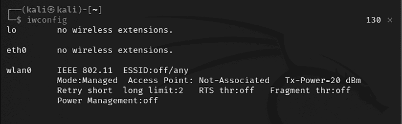
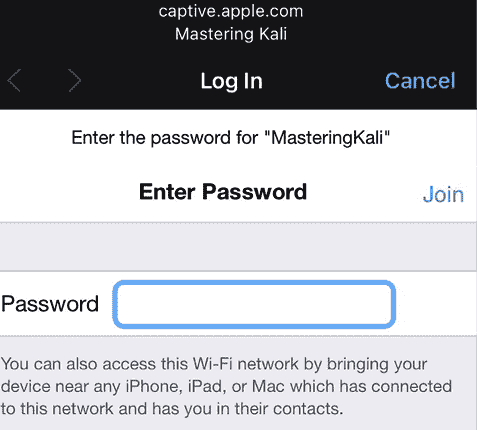

# 第六章：无线和蓝牙攻击

移动设备的主导地位促使大多数公司采纳**自带设备**（**BYOD**），并需要提供即时的网络连接，使无线网络成为普遍的互联网接入点。不幸的是，无线接入的便利性伴随着有效攻击的增加，这些攻击可能导致数据盗窃、未经授权的访问以及网络资源的服务拒绝。Kali 提供了多种工具来配置并发起这些无线攻击，从而帮助组织提高安全性。

在本章中，我们将探讨几个日常管理任务和无线攻击，包括以下主题：

+   配置 Kali 进行无线和蓝牙攻击

+   无线和蓝牙侦察

+   绕过隐藏的**服务集标识符**（**SSID**）

+   绕过 MAC 地址认证和开放认证

+   破解 WPA/WPA2 加密并执行**中间人攻击**（**MiTM**）

+   使用 Reaver 攻击无线路由器

+   **拒绝服务**（**DoS**）攻击针对无线和蓝牙通信

# 无线和蓝牙技术介绍

无线技术使得两个或多个实体可以在没有任何类型的电线或电缆的情况下进行远距离通信。它利用**无线电频率**（**RF**）和**红外线**（**IR**）波。

*表 6.1*概述了不同的无线技术，支持的 IEEE 标准、操作的无线频率、数据比特率以及网络范围和大小：

| **名称** | **蓝牙经典** | **蓝牙 4.0 低能耗（BLE）** | **ZigBee** | **Wi-Fi** | **Wi-Fi 5/6** |
| --- | --- | --- | --- | --- | --- |
| IEEE 标准 | 802.15.1 | 802.15.1 | 802.15.4 | 802.11（a, b, g, n） | 802.11（ac, ax） |
| 频率（GHz） | 2.4 | 2.4 | 0.868, 0.915, 2.4 | 2.4 和 5 | ac=5, ax=2.4 和 5 |
| 最大原始比特率（Mbps） | 1-3 | 1 | 0.250 | 11（b），54（g），600（n） | 433（ac）600.4（ax） |
| 典型数据吞吐量（Mbps） | 0.7-2.1 | 0.27 | 0.2 | 7（b），25（g），150（n） | 6933（ac）9607.8（ax） |
| 最大（户外）范围（米） | 10（2 类），100（1 类） | 50 | 10-100 | 100-250 | ac=35-110 ax=70-240 |
| 网络大小 | 7 | 未定义 | 64,000+ | 255 | 8 |

表 6.1：不同类型无线技术的比较

在本章中，我们将重点介绍两种主要的无线技术：蓝牙和 Wi-Fi。主要区别在于，Wi-Fi 能够提供长距离和高速互联网，而蓝牙则为短距离设备设计，用于共享信息。

# 配置 Kali 进行无线攻击

Kali Linux 预装了多种工具，以便于无线网络的测试；然而，这些攻击需要广泛的配置才能完全有效。此外，测试人员在实施攻击或审计无线网络之前，应具备扎实的无线网络背景。

无线安全测试中最重要的工具是无线适配器，它连接到无线**接入点**（**AP**）。它必须支持使用的工具，尤其是`aircrack-ng`工具套件；特别是，卡的芯片组和驱动程序必须具备将无线数据包注入通信流的能力。

这是对需要将特定数据包类型注入目标和受害者之间流量的攻击的要求。注入的数据包可以导致 DoS 攻击，使攻击者能够捕获破解加密密钥所需的握手数据或支持其他无线攻击。

与 Kali 兼容的最可靠适配器是 Alfa 网络卡，特别是 AWUS036NH 或 Wi-Fi Pineapple 适配器，或者支持无线 802.11 b、g 和 n 协议的 TP-Link N150 TL-WN722N 版本 1。同样，为了执行蓝牙攻击，建议使用外部加密狗，如 TP-Link USB 蓝牙适配器或 WAVLINK 无线蓝牙 CSR 4.0 加密狗。这些卡通常不到 10 美元，且可以在线轻松购买，支持 Kali 执行的所有测试和攻击。

# 无线侦察

进行无线攻击的第一步是进行侦察——这有助于确定目标 AP 的确切位置，并突出显示可能影响测试的其他无线网络。

如果你使用的是 USB 连接的无线网卡连接到 Kali 虚拟机，请确保 USB 连接已经从宿主操作系统断开，并已连接到虚拟机。如果你使用的是 VirtualBox，选择 Kali Linux 虚拟机，然后点击**设置**。选择**USB**类别，点击带有**+**符号的 USB 图标，然后选择 USB 无线或蓝牙适配器。这将断开 USB 与宿主操作系统的连接，并将其连接到你的 VirtualBox。同样，对于 VMware，点击主菜单中的**VM**，点击**可移动设备**，然后选择你的无线或蓝牙设备。

接下来，通过在命令行中运行`iwconfig`来确定可用的无线接口，如*图 6.1*所示：



图 6.1：无线适配器列表

对于某些攻击，你可能希望增加适配器的输出功率。如果你与一个合法的无线 AP 位于同一位置，并且希望目标连接到你控制的虚假 AP 而不是合法 AP，这将特别有用。这些虚假或**恶意**AP 允许攻击者截获数据，并根据需要查看或修改数据以支持攻击。攻击者经常会复制或克隆一个合法的无线网络，然后将其传输功率提高，以便吸引受害者。要增加功率，使用以下命令：

```
sudo iwconfig wlan0 txpower 30 
```

许多攻击将使用 `aircrack-ng` 及其相关工具进行。首先，我们需要拦截或监控无线传输；因此，我们需要通过 `airmon-ng` 命令将 Kali 通信接口设置为监控模式：

```
sudo airmon-ng start wlan0 
```

上一条命令的执行结果如 *图 6.2* 所示：


图 6.2：使用 airmon-ng 启动监控模式

请注意，返回的描述表示有些进程可能会造成问题。处理这些进程的最有效方法是使用全面的 `kill` 命令，如下所示：

```
sudo airmon-ng check kill 
```

要查看本地无线环境，请使用以下命令：

```
sudo airodump-ng wlan0mon 
```

上一条命令列出了在特定时间内无线适配器范围内能够发现的所有网络。它提供了网络上无线节点的**基本服务集标识符**（**BSSID**），该标识符是通过 MAC 地址识别的。

**媒体访问控制**（**MAC**）地址唯一标识网络中的每个节点。它由六对十六进制数字（0 到 9 和字母 A 到 F）组成，并通过冒号或短横线分隔，通常以这种格式显示：`00:50:56:C0:00:01`。

它还显示了相对输出功率的指示、已发送数据包的信息、包括所用频道和数据的带宽信息、加密使用情况的信息，以及提供无线网络名称的**扩展服务集标识符**（**ESSID**）。这些信息如 *图 6.3* 所示，非必要的 ESSID 已被模糊处理：


图 6.3：airodump-ng 正在积极识别不同的无线 AP

`airodump` 命令默认在 2.4 GHz 上循环通过可用的无线频道 1-13，并识别以下内容：

+   `BSSID` 是唯一的 MAC 地址，用于标识无线接入点（AP）或路由器。

+   每个网络的 `PWR` 或功率。虽然 `airodump-ng` 错误地显示功率为负值，但这只是一个报告伪影。要获取正确的正值，请访问终端并运行 `airdriver-ng unload 36`，然后运行 `airdriver-ng load 35`。

+   `CH` 显示正在用于广播的频道。

+   `ENC` 显示所使用的加密方式——如果没有使用加密，则为 `OPN`（开放）；如果使用加密，则为 `WEP` 或 `WPA`/`WPA2`。`CIPHER` 和 `AUTH` 提供附加的加密信息。

+   `ESSID` 是无线网络的公共名称，由共享相同 SSID 或名称的接入点（AP）组成。

在终端窗口的下部，你将看到尝试连接或已连接到无线网络的站点。

在我们与任何这些（潜在的）目标网络交互之前，我们必须确认我们的无线适配器能够进行数据包注入。为此，请在终端 shell 提示符下运行以下命令：

```
sudo aireplay-ng -9 wlan0mon 
```

这里，`-9`表示注入测试。这将提供向目标 Wi-Fi 网络注入数据包的能力。

# 绕过隐藏的 SSID

ESSID 是唯一标识无线局域网的字符序列。隐藏 ESSID 是一种试图通过模糊安全性来实现的差劲方法；不幸的是，可以通过以下任何一种方式获得 ESSID：

+   嗅探无线环境并等待客户端连接到网络，然后捕获该连接

+   主动取消认证客户端，迫使客户端关联并捕获该关联

`aircrack`工具特别适合捕获解除隐藏 ESSID 所需的数据，如以下步骤所示：

1.  在命令提示符下，确认攻击系统上已启用无线功能，通过输入以下命令：

    ```
    sudo airmon-ng 
    ```

1.  接下来，使用以下`ifconfig`命令查看可用的接口，并确定无线系统使用的确切名称：

    ```
    ifconfig 
    ```

1.  启用无线接口，输入以下命令（你可能需要将`wlan0`替换为前一步骤中识别的可用无线接口）：

    ```
    sudo airmon-ng start wlan0 
    ```

1.  如果你重新确认`ifconfig`，你会看到现在正在使用一个监视地址或`wlan0mon`。现在使用`airodump`确认可用的无线网络，输入以下命令，攻击者应该能够看到*图 6.4*中的屏幕：

    ```
    sudo airodump-ng wlan0mon 
    ```

    

    图 6.4：airodump 显示所有可用的无线网络

    正如你在*图 6.4*中看到的，最后一个网络的`ESSID`仅被识别为`<length: 0>`。没有使用其他名称或标识。隐藏的`ESSID`的长度被标识为由九个字符组成；然而，这个值可能不正确，因为`ESSID`是隐藏的。真实的`ESSID`长度实际上可能比九个字符更短或更长。

    重要的是，可能有客户端连接到这个特定网络。如果有客户端存在，我们将取消认证客户端，迫使他们在重新连接到 AP 时发送`ESSID`。

1.  重新运行`airodump`并过滤掉除了目标 AP 之外的所有内容。在这个特定案例中，我们将专注于使用以下命令从频道 11 上的隐藏网络收集数据：

    ```
    sudo airodump-ng -c 11 wlan0mon 
    ```

    执行此命令将移除来自多个无线源的输出，并允许攻击者专注于目标`ESSID`，如*图 6.5*所示：

    

    图 6.5：airodump 在频道 11 上运行

    执行`airodump`命令时获得的数据表明，有一个站点（`82:A4:64:7F:6D:88`）连接到了`BSSID`（`C0:05:C2:02:85:67`），而该`BSSID`又与隐藏的`ESSID`相关联。

1.  为了捕获正在传输的`ESSID`，我们需要创建一个条件，确保它会在客户端与 AP 连接的初始阶段发送。

    因此，我们将通过发送一串数据包发起去认证攻击，既对客户端也对 AP 进行攻击，打破它们之间的连接，并迫使客户端重新与 AP 关联。

    要发起攻击，打开一个新的命令行窗口并输入如下截图所示的命令（`0`表示我们正在发起去认证攻击，`10`表示我们将发送`10`个去认证数据包，`-a`是目标 AP，`c`是客户端的 MAC 地址）：

    

    图 6.6：向连接的站点发送去认证数据包

1.  在所有去认证数据包发送完毕后，返回到最初监视网络连接的窗口，如图*6.7*所示：

    图 6.7：隐藏的 ESSID 现在在频道 11 的 airodump 中可见

现在你将看到明文显示的`ESSID`。

知道`ESSID`有助于攻击者确认他们专注于正确的网络（因为大多数 ESSID 基于企业身份），并有助于登录过程。

# 绕过 MAC 地址认证和开放认证

MAC 地址通常与网络适配器或具有网络功能的设备关联；因此，它通常被称为物理地址。

MAC 地址中的前三对数字称为组织唯一标识符，它们用于识别制造或销售设备的公司。最后三对数字是特定于设备的，可以视为设备的序列号。

因为 MAC 地址是唯一的，它可以用于将用户与特定网络关联，特别是无线网络。这有两个重要的意义——它可以用于识别试图访问网络的黑客或合法的网络测试人员，且它可以作为身份验证的手段，允许个人访问网络。

在渗透测试中，测试者可能希望在网络中保持匿名。一种支持这种匿名配置的方法是更改攻击系统的 MAC 地址。

这可以通过手动使用`ifconfig`命令来完成。要确定现有的 MAC 地址，请从命令行窗口运行以下命令：

```
sudo ifconfig wlan0 down
sudo ifconfig wlan0 | grep HW 
```

要手动更改 IP 地址，请使用以下命令：

```
sudo ifconfig wlan0 hw ether 38:33:15:xx:xx:xx
sudo ifconfig wlan0 up 
```

替换`xx`表达式中的十六进制对。此命令将允许我们将攻击系统的 MAC 地址更改为一个受害网络已使用并接受的地址。攻击者必须确保该 MAC 地址在网络中尚未被使用，否则，如果网络正在被监控，重复的 MAC 地址可能会触发警报。

在更改 MAC 地址之前，必须关闭无线接口。

Kali 还允许使用自动化工具`macchanger`。要将攻击者的 MAC 地址更改为由相同供应商生产的产品的 MAC 地址，可以从终端窗口使用以下`macchanger`命令：

```
sudo macchanger wlan0 -e 
```

要将现有的 MAC 地址更改为完全随机的 MAC 地址，请使用以下命令：

```
sudo macchanger wlan0 -r 
```

你应该能够看到`macchanger`工具。*图 6.8*提供了分配给我们无线适配器的新 MAC 地址：


图 6.8：更改无线适配器的 MAC 地址

一些攻击者在测试过程中使用自动化脚本频繁更改其 MAC 地址，以实现匿名化。

许多组织，特别是大型学术团体，如高校和大学，使用 MAC 地址过滤来控制谁可以访问其无线网络资源。

MAC 地址过滤使用网络卡上的唯一 MAC 地址来控制对网络资源的访问；在典型配置中，组织维护一个允许访问网络的 MAC 地址白名单。如果传入的 MAC 地址不在批准的访问列表中，则会限制其连接网络。

不幸的是，MAC 地址信息以明文形式传输。攻击者可以使用`airodump`收集已接受的 MAC 地址列表，然后手动将其 MAC 地址更改为目标网络接受的地址之一。因此，这种类型的过滤几乎无法为无线网络提供实际的保护。

无线网络保护的下一个层级是使用加密来提供。

# 攻击 WPA 和 WPA2

**Wi-Fi 保护访问**（**WPA**）和**Wi-Fi 保护访问 2**（**WPA2**）是无线安全协议，旨在解决 WEP 的安全缺陷。由于 WPA 协议为每个数据包动态生成新的密钥，它们能够防止导致 WEP 失败的统计分析。然而，它们也容易受到某些攻击技术的影响。

WPA 和 WPA2 通常与**预共享密钥**（**PSK**）一起使用，以确保 AP 和无线客户端之间的通信安全。PSK 应至少为 13 个字符长度的随机密码短语；如果不是，可以通过暴力破解攻击将 PSK 与已知字典进行比较，从而确定 PSK。这是最常见的攻击方式。

请注意，如果配置为企业模式，使用 RADIUS 认证服务器进行身份验证，可能需要更强大的计算机来破解密钥或执行不同类型的中间人攻击（MiTM）。

## 暴力破解攻击

与 WEP 不同，WEP 可以通过对大量数据包进行统计分析来破解，而 WPA 解密要求攻击者创建特定的数据包类型，以揭示细节，例如 AP 与客户端之间的握手。

要攻击 WPA 传输，应执行以下步骤：

1.  启动无线适配器，并使用`ifconfig`命令确保已创建监视接口。

1.  使用`sudo airodump-ng wlan0mon`来识别目标网络。

1.  使用以下命令开始捕获目标 AP 与客户端之间的流量：

    ```
    sudo airodump-ng --bssid F0:7D:68:44:61:EA -c 11 --showack --output-format pcap --write <OUTPUT LOCATION> wlan0mon 
    ```

1.  设置`-c`来监视特定频道，`--write`将输出写入文件以供稍后的字典攻击使用，`--showack`标志确保客户端计算机确认你请求将其从无线 AP 去认证。上述命令的典型输出如*图 6.9*所示：

    图 6.9：在频道 11 上对特定 BSSID 的 airodump

1.  保持这个终端窗口打开，并打开第二个终端窗口来发起去认证攻击；这将迫使用户重新认证目标 AP 并重新交换 WPA 密钥。去认证攻击命令如下所示：

    ```
    sudo aireplay-ng -0 10 -a <BSSID> -c <STATION ID> wlan0mon 
    ```

    *图 6.10*展示了`aireplay-ng`在去认证连接到特定 BSSID 的站点时的实际操作：

    

    图 6.10：将站点从 BSSID 去认证

1.  成功的去认证攻击将显示`ACKs`，这表示连接到目标 AP 的客户端已确认刚刚发送的去认证命令。

1.  检查原始命令行窗口，保持开启以监控无线传输，并确保捕获到四路握手。成功的 WPA 握手将在控制台的右上角标识出来。在以下示例中，数据表明 WPA 握手值为`C2:B3:7B:17:00:B7`：

    图 6.11：成功捕获特定 BSSID 的无线握手

1.  使用`aircrack`通过定义的词表破解 WPA 密钥。攻击者为收集握手数据定义的文件名将位于根目录，并附加`.cap`扩展名。

在 Kali 中，词表位于`/usr/share/wordlists`目录中。虽然有多个词表可用，但建议下载更有效破解常见密码的列表。

在之前的示例中，密钥已预先放入密码列表中。对一个长且复杂的密码进行字典攻击可能需要几个小时，具体时间取决于系统配置。以下命令使用`passwordlist`作为源词表（攻击者也可以使用位于 Kali 的`/usr/share/wordlists/`文件夹中的密码列表）：

```
sudo aircrack-ng -w passwordlist -b BSSID <OUTPUT LOCATION>Output.cap 
```

*图 6.12*展示了成功破解 WPA 密钥的结果；经过测试六个常见密钥后，网络名为“Hidden”的密钥被发现是`Letmein87`：


图 6.12：无线适配器列表

如果你没有现成的自定义密码列表，或者希望快速生成一个列表，可以在 Kali 中使用 crunch 应用程序。以下命令指示 crunch 使用给定的字符集创建一个最小长度为`5`字符、最大长度为`25`字符的单词列表：

```
sudo crunch 5 25 abcdefghijklmnopqrstuvwxyzABCDEFGHIJKLMNOPQRSTUVWXYZ0123456789 | aircrack-ng --bssid (MAC address) -w nameofthewifi.cap 
```

作为附加选项，你还可以通过使用基于 GPU 的密码破解工具（如 AMD/ATI 显卡的 oclHashcat 和 NVIDIA 显卡的 cudaHashcat）来提高暴力破解攻击的效果。

要实施此攻击，首先使用以下命令将 WPA 握手捕获文件`output.cap`转换为`hashcat`文件：

```
sudo aircrack-ng nameofthewifi.cap -j <output file> 
```

转换完成后，你应该在运行命令的同一文件夹中获得一个`.hccapx`文件。现在，攻击者可以通过以下命令执行`hashcat`，对新的捕获文件进行攻击（选择与您的 CPU 架构和显卡匹配的`hashcat`版本）：

```
sudo hashcat -m 2500 <filename>.hccapx <wordlist> 
```


图 6.13：在 VirtualBox 中使用主机 GPU 运行 hashcat

在虚拟容器（如 VirtualBox 或 VMware）中运行 hashcat 时，常见的问题之一是用户可能无法按预期运行 hashcat，因为 3.x 版本的 hashcat 需要 GPU。然而，可以通过在终端中运行以下命令来作为替代方案：`sudo apt-get install libhwloc-dev ocl-icd-dev ocl-icd-opencl-dev`。这将允许测试人员利用 CPU 的计算能力在容器内运行 hashcat。

如果你有多个 GPU，测试人员可以利用诸如 John the Ripper 和`cowpatty`等工具，通过终端中的以下命令，从捕获的无线流量中破解密码：

```
sudo john –w=<dictionaryfile> --stdout | sudo cowpatty -r yourhandshake.cap -d - -s WIFIESSIDS 
```

基本上，John the Ripper 会逐步创建一个字典，包含所有字符、特殊字符和数字。之后，输出将传递给 Pyrit，通过`passthrough`关键字来破解密码，并且`cowpatty`将针对特定的`WIFIESSID`来破解密码。

## 使用 Reaver 攻击无线路由器

WPA 和 WPA2 也容易受到针对 AP 的**Wi-Fi 保护设置**（**WPS**）和 PIN 攻击。

大多数 AP 支持 WPS 协议，该协议于 2006 年作为标准推出，旨在让用户轻松设置和配置 AP，并将新设备添加到现有网络中，而无需重新输入复杂的密码。

不幸的是，PIN 是一个八位数字（1 亿个可能的猜测），但最后一个数字是校验和。由于 WPS 认证协议将 PIN 分为两半并分别验证每一半，这意味着 PIN 的前半部分有 10⁴（10,000）个可能的值，后半部分有 10³（1,000）个可能的值——攻击者最多只需猜测 11,000 次就能攻破 AP！

Reaver 是一个旨在最大化猜测过程的工具（尽管 Wifite 也会进行 WPS 猜测）。

要开始 Reaver 攻击，首先使用 `wash` 辅助工具识别任何易受攻击的网络，确保设备处于监视模式，可以通过运行 `sudo airmon-ng start wlan0` 来启动监视模式，然后运行以下命令：

```
sudo wash -i wlan0mon --ignore-fcs 
```

如果存在任何易受攻击的网络，可以使用以下命令对其发起攻击：

```
sudo reaver -i wlan0mon -b (BSSID) -vv 
```

攻击者在终端运行 Reaver 工具时应能够看到以下截图：


图 6.14：Reaver 在特定 BSSID 上运行

在 Kali 中测试此攻击已证明攻击速度较慢且容易失败；然而，它可以作为背景攻击使用，或者可以补充其他攻击方式来破坏 WPA 网络。

# 针对无线通信的拒绝服务（DoS）攻击

我们将评估的针对无线网络的最终攻击是 DoS 攻击，其中攻击者通过使网络崩溃或剥夺合法用户对无线网络的访问来使网络无法使用。无线网络对 DoS 攻击非常敏感，而且在分布式无线网络中很难定位攻击者。DoS 攻击的示例如下：

+   向无线网络注入精心制作的网络命令（如重新配置命令）可能会导致路由器、交换机和其他网络设备发生故障。

+   一些设备和应用程序可以识别到攻击正在发生，并会自动响应，禁用网络。恶意攻击者可以发起明显的攻击，然后让目标设备自己创建 DoS！

+   用大量数据包轰炸无线网络可以使其无法使用；例如，HTTP 洪水攻击通过向 Web 服务器发出成千上万的页面请求，可以耗尽其处理能力。以同样的方式，向网络中注入身份验证和关联数据包会阻止用户连接到接入点（AP）。

+   攻击者可以构造特定的去身份验证和去关联命令，这些命令在无线网络中用于关闭授权连接并洪泛网络，从而阻止合法用户维持与无线 AP 的连接。

为了演示这一点，我们将通过用去身份验证数据包洪泛网络来创建 DoS 攻击。因为无线 802.11 协议支持在接收到定义的数据包后进行去身份验证（以便用户在不再需要时断开连接），这可能是一种具有破坏性的攻击——它符合标准，且没有办法阻止这种情况的发生。

将合法用户从网络中踢出的最简单方法是用一串去身份验证数据包攻击他们。这可以通过 `aircrack-ng` 工具套件来实现：

```
sudo airmon-ng start wlan0
sudo aireplay-ng -0 0 -a (bssid) -c (station ID) wlan0mon 
```

此命令将攻击类型标识为 `-0`，表示这是一个去身份验证攻击。第二个 `0`（零）启动一个持续的去身份验证数据包流，使网络对其用户不可用。

WebSploit 框架是一个开源工具，用于扫描和分析远程系统。它包含多个工具，包括专门用于无线攻击的工具。可以通过在终端运行`sudo apt install websploit`进行安装。要启动它，只需打开命令行并输入`websploit`。

WebSploit 界面类似于`recon-ng`和 Metasploit 框架，提供模块化界面供用户使用。

启动后，使用`show modules`命令查看当前版本中存在的攻击模块。使用`use wifi_deauth`命令选择`Wi-Fi deauth`（一串去认证数据包）。如*图 6.15*所示，攻击者只需使用`set`命令设置各种选项，然后运行`execute`启动攻击：


图 6.15：使用 WebSploit 执行去认证攻击

# 攻击 WPA2 企业实现

WPA-Enterprise 是一种在企业中广泛使用的技术。它不使用单一的 WPA-PSK（大多数用户用于连接无线网络的方式）。为了保持域账户的治理和灵活性，企业使用 WPA-Enterprise。

一种典型的攻击 WPA-Enterprise 网络的方法是，首先枚举无线设备，然后攻击已连接的客户端以获取身份验证详情。这包括伪装目标网络并向客户端提供良好的信号。然后，原始有效的 AP 会导致 AP 和连接到 AP 的客户端之间的中间人攻击（MiTM）。要模拟 WPA-Enterprise 攻击，攻击者必须在目标范围内接近，才能拥有多个 AP。攻击者还可以使用 Wireshark 嗅探流量，识别无线网络流量握手。

在本节中，我们将探讨攻击者通常会利用的不同工具，以对 WPA-/WPA2-Enterprise 网络进行各种类型的攻击。

Wifite 是一个自动化无线攻击工具，预装在 Kali Linux 中，使用 Python 编写。Wifite 的最新版本是 V2.5.8，修复了之前已知的`aircrack-ng`漏洞。

本工具利用以下攻击方法来提取无线 AP 的密码：

+   **WPS**：离线 Pixie Dust 攻击和在线暴力破解 PIN 攻击

+   **WPA**：WPA 握手捕获和离线破解，以及 PMKID 哈希捕获和离线破解

+   **WEP**：包括前述所有攻击方式，如 chop-chop、碎片化和 aireplay 注入

现在我们已经准备好启动 Wifite，以便我们可以执行 WPA 四路握手捕获，并执行自动密码破解攻击。可以通过在终端输入`sudo wifite`直接启动该工具。攻击者将进入交互模式，以便选择一个接口，如*图 6.16*所示：


图 6.16：Wifite 中的无线适配器列表

选择接口后，它应自动启用适配器的监控模式，并开始列出所有 Wi-Fi ESSID、频道、加密方式和信号强度，无论它们是否为 WPS，以及连接到特定 ESSID 的客户端数量。一旦选择了目标 ESSID，攻击者按下键盘上的*Ctrl* + *C*，这将启动攻击。

默认情况下，会自动启动四种攻击类型。这些攻击包括 WPS Pixie Dust、WPS PIN、PMKID 和 WPA 握手。如果前三种攻击与目标无关，攻击者可以通过按*Ctrl* + *C*来忽略它们。在捕获握手时，攻击者可以看到已发现的连接到该站点的客户端。握手捕获完成后，默认情况下，握手副本会以`hs/handshake_ESSID_MAC.cap`的形式存储在当前文件夹中。

一旦握手成功捕获，它将使用`tshark`、`cowpatty`（此工具在 Kali Linux 中未预安装，安装方法是在终端中运行`sudo apt install cowpatty`），以及`aircrack-ng`进行分析，验证 ESSID 和 BSSID 的握手有效性。

Wifite 被编程为自动使用字典列表与`aircrack-ng`一起运行。也可以在启动 Wifite 时直接传递自定义字典列表，方法是输入`wifite --wpa --dict /path/customwordlist`。成功的握手破解通常会返回无线 AP（路由器）的密码，如*图 6.17*所示：


图 6.17：无线适配器列表

所有密码将保存在当前文件夹中的`cracked.txt`文件中，该文件是从运行 Wifite 的目录中获取的。该工具具有匿名功能，可以在攻击前将 MAC 地址更改为随机地址，攻击完成后再恢复原状。

# 使用 bettercap

bettercap 是攻击者可以利用的工具之一，它可以在几分钟内更好地执行 Wi-Fi 握手捕获攻击。该工具预装了许多 Wi-Fi 黑客模块，在红队演练或渗透测试中非常方便。以下是成功捕获 WPA2 握手的步骤：

1.  通过运行`sudo airmon-ng start wlan0`来确保无线设备处于监控模式。

1.  通过输入`sudo bettercap --iface wlan0mon`在终端中运行带有相关接口的 bettercap。

1.  在 bettercap 终端中输入`wifi.recon on`，如*图 6.18*所示：

    图 6.18：bettercap 执行无线网络侦察

    如果在运行`wifi.recon on`命令时，看到错误信息`error while setting interface wlan0mon`，请确保安装了旧版本的 libpcap。您可以使用`wget http://old.kali.org/kali/pool/main/libp/libpcap/libpcap0.8_1.9.1-4_amd64.deb`下载它，然后使用`dpkg -i libpcap0.8_1.9.1-4_amd64.deb`安装。

1.  要列出所有可见的 Wi-Fi 网络，请在 bettercap 终端中输入`wifi.show`。

1.  通过运行`wifi.deauth <BSSID>`执行去认证攻击。

1.  在去认证成功后，当设备重新连接到 Wi-Fi 网络时，必须通过 bettercap 捕获握手并存储在`/root/`文件夹中，如*图 6.19*所示，针对 BSSID `c2:b3:7b:17:00:b7`:

    图 6.19：bettercap 捕获无线网络的握手

1.  最后，可以将相同的`.pcap`文件传递给`aircrack-ng`或`hashcat`来破解密码。

# 使用 Wifiphisher 进行 Evil Twin 攻击

大多数公司面临的主要问题之一是办公室范围内存在伪造 AP，它们的名称与公司的 Wi-Fi 网络相同。在这一部分，我们探讨了 Wifiphisher，一个用于进行红队行动或 Wi-Fi 渗透测试的伪造 AP 框架。通常，我们使用此工具对连接到 Wi-Fi 网络的客户端执行有效的中间人攻击（MiTM）。

该工具在 Kali 中默认没有安装，因此攻击者应该通过在终端中运行`sudo apt install wifiphisher`来安装此工具。

成功执行 Evil Twin 攻击使用 Wifiphisher 的步骤如下：

1.  安装 Wifiphisher 后，在终端中运行`sudo wifiphisher`启动该工具，这将显示以下带有可用无线网络列表的屏幕：

    图 6.20：Wifiphisher 识别无线网络列表

1.  选择正确的无线目标 ESSID/BSSID 并按*Enter*键。这将使我们的无线适配器复制和克隆 AP。这将把我们带到一个屏幕，选择可用的钓鱼场景，如*图 6.21*所示：

    图 6.21：Wifiphisher 的预定义钓鱼模板

1.  如前面的截图所示，内置了三个场景：固件升级页面、网络管理器连接和浏览器插件更新。我们可以选择任何一个选项。在此示例中，我们选择了选项 2，以模拟网络管理器窗口，显示特定页面并请求密码。接下来的步骤是复制具有相同名称和频道的 ESSID。此外，设置了 Web 和 DHCP 服务器，所有连接的设备将通过去认证方法断开连接。在内部，使用另一个接口设置了一个 AP 来捕获受害者输入的详细信息，如*图 6.22*所示：

    图 6.22：Wifiphisher 的虚假 AP 的活动客户端连接仪表板

1.  无线终端设备将被去认证攻击断开，并且无法重新连接到 Wi-Fi 网络，因为该工具还会执行 Wi-Fi 干扰。（如果攻击者不希望干扰网络，建议使用`sudo wifiphisher –nojamming`。）

1.  受害者现在将能够看到 Wi-Fi 网络作为开放网络，如*图 6.23*所示：

    图 6.23：我们目标无线网络的不安全克隆

1.  一旦用户连接到免费 Wi-Fi，它会打开登录门户，要求用户输入密码，如*图 6.24*所示：

    图 6.24：受害者设备上的假冒登录门户

1.  就是这样——受害者连接到攻击者网络时输入的任何密码都会在 Wifiphisher 中被捕获，这些输入可以用来创建密码列表字典，破解前面部分捕获的握手。攻击者在关闭 Wifiphisher 工具时，应该看到以下屏幕，按下*Ctrl* + *C*：

    图 6.25：通过 Wifiphisher 使用假接入点捕获的密码列表

# WPA3

尽管 WPA 的第三代（WPA3）于 2018 年 1 月推出，作为 WPA2 的替代品，以弥补 WPA2 的弱点，但它的使用并不广泛。该标准采用 192 位加密强度，WPA3-Enterprise 使用 AES-256 的 GCM 模式，配合**SHA-384**（**安全散列算法**）作为**基于散列的消息认证码**（**HMAC**），并且仍强制使用**CCMP-128**（**计数模式** **密码块链接消息协议**），它是**AES-128**（**美国加密标准**）在 CCM 模式下使用，并且这是 WPA3-Personal 中的最小加密算法。

与 WPA2 的**预共享密钥**（**PSK**）不同，WPA3 采用**平等认证**（**SAE**），也称为 Dragonfly。Mathy Vanhoef（[`papers.mathyvanhoef.com/usenix2021.pdf`](https://papers.mathyvanhoef.com/usenix2021.pdf)）撰写了一篇非常有趣的论文，概述了与 IEEE 标准 802.11 相关的框架碎片化、聚合和伪造攻击设计缺陷。

虽然目前没有现成的漏洞可供利用，但与 WPA3-Personal 及其使用的 SAE 认证协议有关的问题仍然存在。

# 蓝牙攻击

曾经有一家赌场通过鱼缸温度计被黑客攻击，这显示了确保物联网（**IoT**）设备安全的重要性。蓝牙也不例外，**蓝牙低功耗**（**BLE**）设备被消费者和企业广泛使用，因此攻击者需要理解如何探测和攻击这些设备。

蓝牙协议层的重要部分如下：

+   **逻辑链路控制和适配协议**（**L2CAP**）：它提供高层数据协议和应用程序之间的数据接口。

+   **射频通信协议**（**RFCOMM**）：它模拟计算机上串行通信接口（如 EIA-RS-232）所需的功能。RFCOMM 可以通过 AT 命令访问，也可以通过**无线应用协议**（**WAP**）通过**传输控制协议/互联网协议**（**TCP/IP**）栈和**对象交换**（**OBEX**）协议访问。默认情况下，可以共享数据文件、名片和日历信息，无需厂商依赖。

蓝牙有三种安全模式：

+   **安全模式 1** – 这是一个不安全模式，出现在旧型号的手机/设备中。

+   **安全模式 2** – 在此模式下，强制执行服务级安全；例如，某些访问需要授权和身份验证才能连接并使用服务。

+   **安全模式 3** – 在此模式下，强制执行链路级安全，而蓝牙本身使用受信任和不受信任的设备。

Kali Linux 预装了设备驱动程序（BlueZ，它是一组管理蓝牙设备的工具）以支持蓝牙设备。类似于使用`iwconfig`识别无线适配器，我们在终端使用`sudo hciconfig -a`来验证我们的蓝牙设备是否连接并处于活动状态。

运行此命令时，您应该看到`hci0`或`hci1`适配器（或两者）的配置信息，如*图 6.26*所示：


图 6.26：蓝牙 USB 设备列表

下一步是在终端中运行`sudo hcitool scan`，对任何可用的蓝牙设备进行侦察。这将给我们带来一份设备列表，显示我们的适配器能够接触并收到响应的设备，如*图 6.27*所示：


图 6.27：使用 hcitool 进行蓝牙侦察

类似于 Wireshark，攻击者还可以利用 hcidump 工具进一步调试设备发送和接收的包。

现在我们已经获取了目标设备，下一步是识别设备支持的服务类型。这可以通过使用 Kali 中预装的 sdptool 来实现。以下命令提供了目标设备支持的服务列表，如*图 6.28*所示：

```
sudo sdptool browse <MAC address of the target> 
```


图 6.28：运行 sdptool 浏览目标 MAC

一旦获得这些细节，攻击者可以执行更高级的攻击，例如蓝牙窃取（bluesnarf，利用设备访问其联系人列表、短信、电子邮件，甚至私人照片）或蓝牙劫持（bluejacking，向其他可用的蓝牙设备发送匿名消息）。由于这些攻击依赖于特定的移动设备型号，因此我们在本书中不会进一步探讨它们。攻击者可以选择使用`l2ping`工具执行拒绝服务（DoS）攻击。只需在设备上运行`sudo l2ping –s 100 <MAC 地址>`，一旦目标设备瘫痪，就可以使用社交工程技术伪装成 IT 人员。

# 总结

在本章中，我们检查了执行成功攻击任何无线网络所需的不同任务，并且了解了如何配置无线调制解调器以及使用如`aircrack-ng`等工具进行 AP 的侦察。在本章中，我们还学习了蓝牙的基础知识，以及完整的`aircrack-ng`工具套件，这些工具用于识别隐藏的网络、绕过 MAC 认证，并攻破 WPA、WPA2 和 WPA-Enterprise。我们还看到了如何利用自动化工具 Wifite 快速捕获握手并离线破解密码，或使用一个好的字典，并结合多个选项。接着，我们深入探讨了如何使用 Wifiphisher 设置一个假 AP，并学习了如何对无线网络和蓝牙设备进行 DoS 攻击。

在下一章中，我们将重点讨论如何使用专门针对这种类型访问的方法评估网站，从而进行必要的侦察和扫描，识别可能被利用的漏洞。我们将看到攻击者如何利用自动化工具（如漏洞利用框架和在线密码破解）来攻击这些漏洞。最后，我们将能够对 Web 应用程序执行最重要的攻击，并通过 Web shell 利用这种访问权限，完全控制 Web 服务。我们还将探讨特定服务，以及它们为何以及如何容易受到 DoS 攻击。
